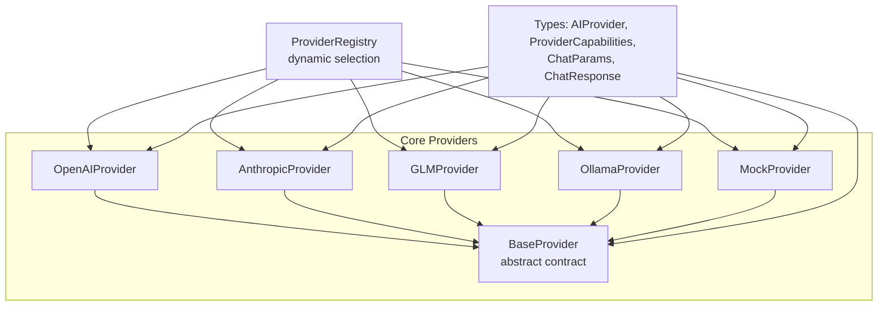
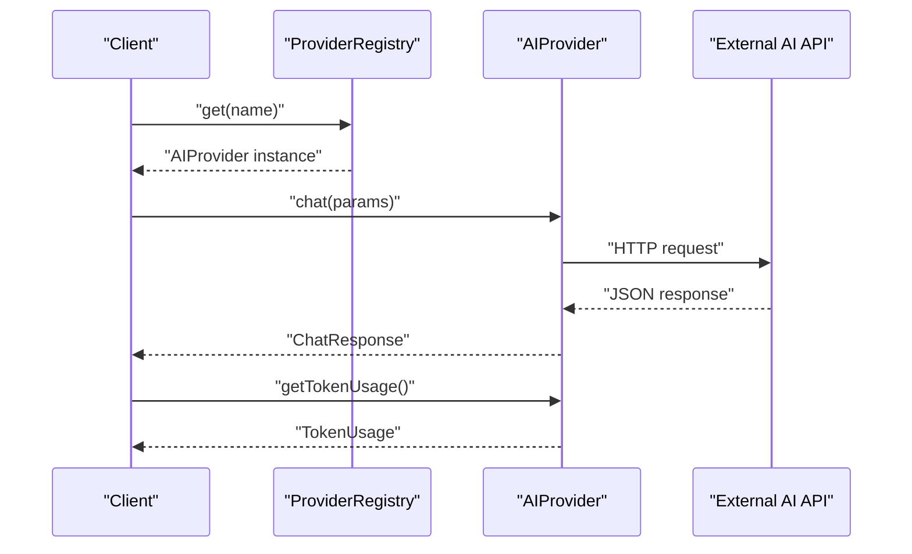
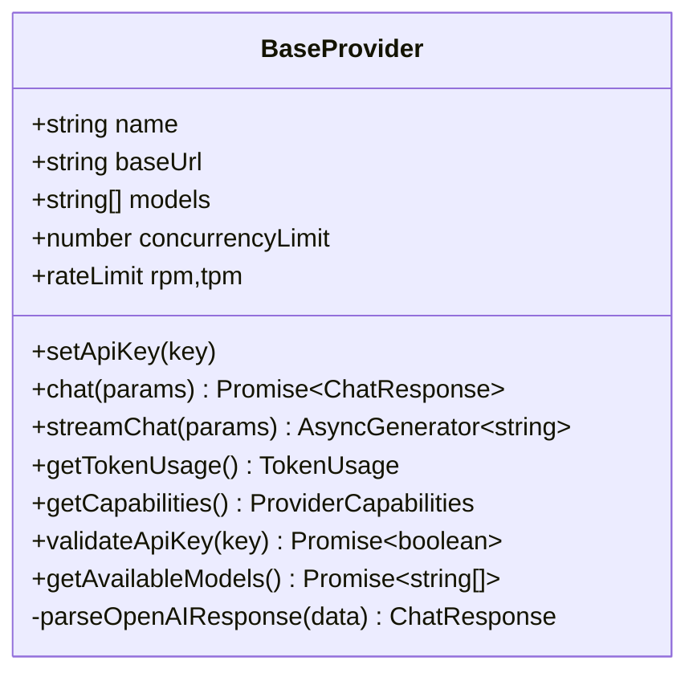
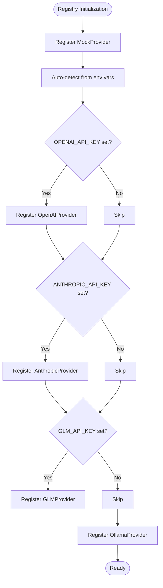
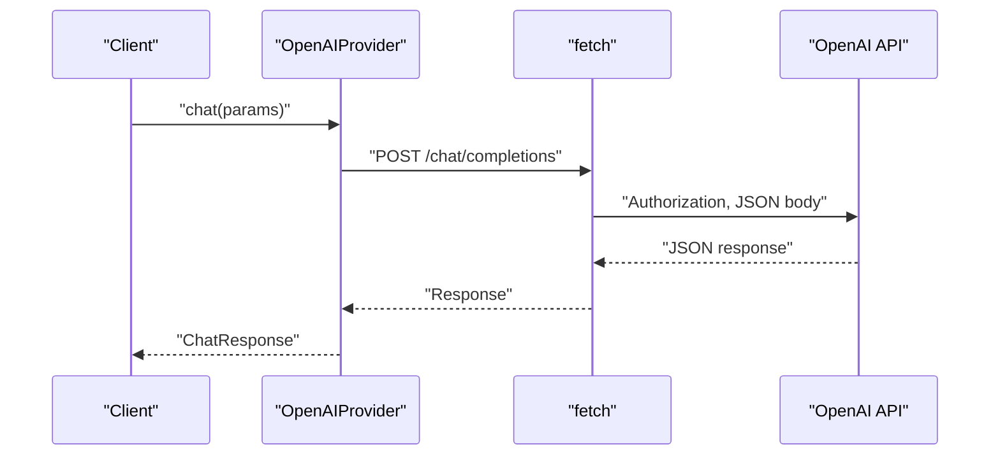
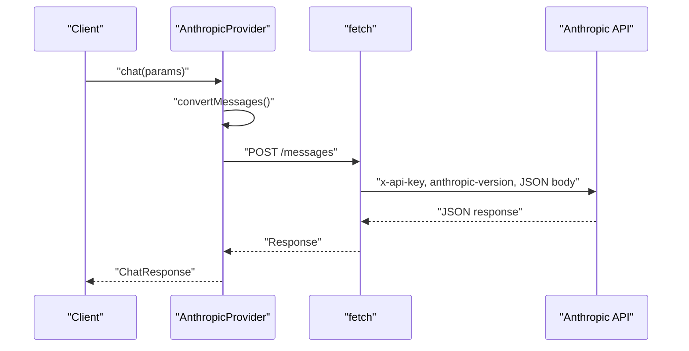
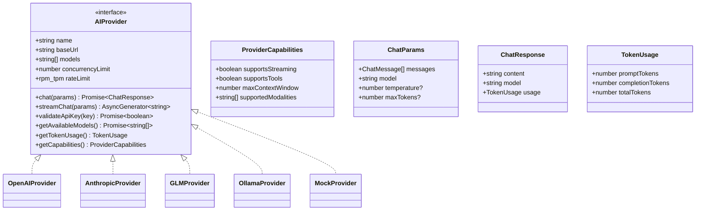
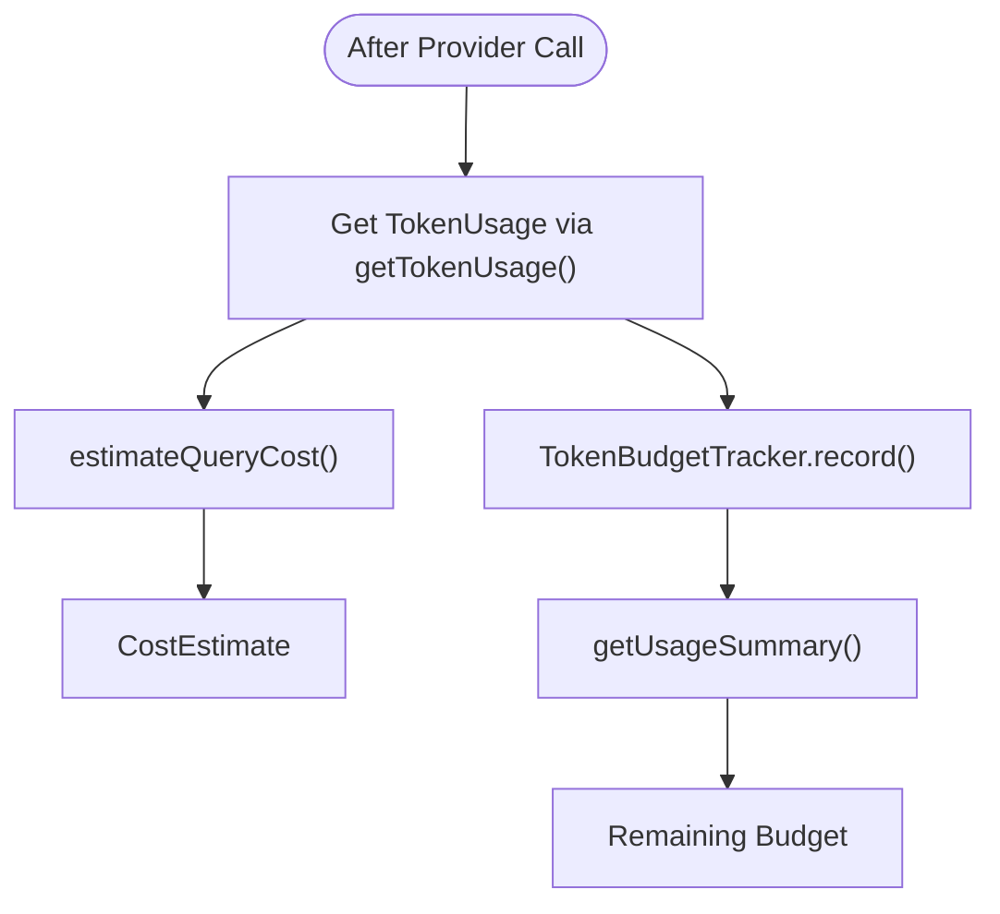
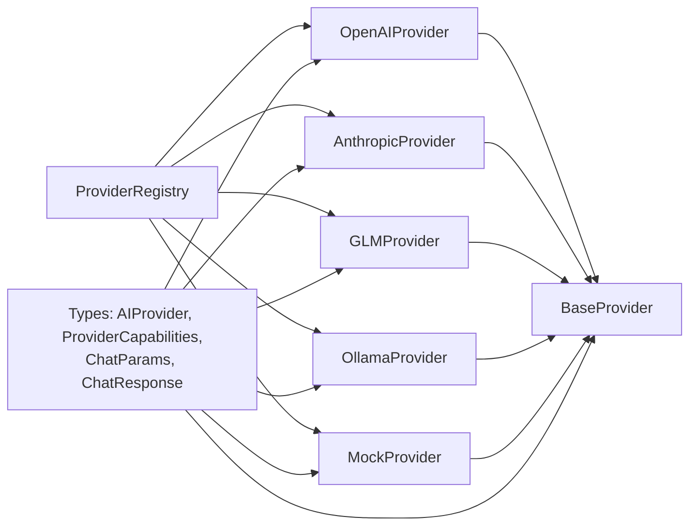

# AI Provider Integration

<cite>
**Referenced Files in This Document**
- [base.ts](file://src/core/providers/base.ts)
- [registry.ts](file://src/core/providers/registry.ts)
- [openai.ts](file://src/core/providers/openai.ts)
- [anthropic.ts](file://src/core/providers/anthropic.ts)
- [glm.ts](file://src/core/providers/glm.ts)
- [mock.ts](file://src/core/providers/mock.ts)
- [ollama.ts](file://src/core/providers/ollama.ts)
- [provider.ts](file://src/types/provider.ts)
- [route.ts](file://src/app/api/providers/route.ts)
- [estimator.ts](file://src/core/budget/estimator.ts)
- [tracker.ts](file://src/core/budget/tracker.ts)
</cite>

## Table of Contents
1. [Introduction](#introduction)
2. [Project Structure](#project-structure)
3. [Core Components](#core-components)
4. [Architecture Overview](#architecture-overview)
5. [Detailed Component Analysis](#detailed-component-analysis)
6. [Dependency Analysis](#dependency-analysis)
7. [Performance Considerations](#performance-considerations)
8. [Troubleshooting Guide](#troubleshooting-guide)
9. [Conclusion](#conclusion)
10. [Appendices](#appendices)

## Introduction
This document describes the AI provider integration system that enables pluggable AI service implementations. It covers the provider abstraction layer, provider interface contract, configuration and authentication handling, error recovery, and the provider registry for dynamic selection. It also documents provider-specific implementations, API parameter mapping, response formatting, and cost calculation integration. Guidance is included for adding new providers and extending existing integrations.

## Project Structure
The AI provider system is organized under a dedicated core module with provider implementations, a shared base class, and a registry. Type definitions define the provider contract and capabilities. An API endpoint exposes provider metadata for client configuration.

**Diagram sources**
- [base.ts:1-83](file://src/core/providers/base.ts#L1-L83)
- [openai.ts:1-134](file://src/core/providers/openai.ts#L1-L134)
- [anthropic.ts:1-215](file://src/core/providers/anthropic.ts#L1-L215)
- [glm.ts:1-132](file://src/core/providers/glm.ts#L1-L132)
- [ollama.ts:1-196](file://src/core/providers/ollama.ts#L1-L196)
- [mock.ts:1-112](file://src/core/providers/mock.ts#L1-L112)
- [registry.ts:1-83](file://src/core/providers/registry.ts#L1-L83)
- [provider.ts:1-66](file://src/types/provider.ts#L1-L66)

**Section sources**
- [base.ts:1-83](file://src/core/providers/base.ts#L1-L83)
- [registry.ts:1-83](file://src/core/providers/registry.ts#L1-L83)
- [provider.ts:1-66](file://src/types/provider.ts#L1-L66)

## Core Components
- BaseProvider: Defines the provider interface contract, default streaming fallback, token usage tracking, capability reporting, and API key validation. It also provides a shared response parsing utility for OpenAI-style responses.
- Provider implementations: OpenAI, Anthropic, GLM, Ollama, and Mock each specialize API endpoints, headers, parameter mapping, streaming parsing, and token usage extraction.
- ProviderRegistry: Centralized provider registration and selection, auto-detection from environment variables, and creation by name.
- Types: Define the provider contract, capabilities, chat parameters and responses, and provider configuration.

**Section sources**
- [base.ts:1-83](file://src/core/providers/base.ts#L1-L83)
- [openai.ts:1-134](file://src/core/providers/openai.ts#L1-L134)
- [anthropic.ts:1-215](file://src/core/providers/anthropic.ts#L1-L215)
- [glm.ts:1-132](file://src/core/providers/glm.ts#L1-L132)
- [ollama.ts:1-196](file://src/core/providers/ollama.ts#L1-L196)
- [mock.ts:1-112](file://src/core/providers/mock.ts#L1-L112)
- [registry.ts:1-83](file://src/core/providers/registry.ts#L1-L83)
- [provider.ts:1-66](file://src/types/provider.ts#L1-L66)

## Architecture Overview
The system uses a provider abstraction layer with a registry enabling dynamic provider selection. Providers implement a common interface and can be auto-detected from environment variables. The registry supports programmatic creation by name and returns provider instances for chat and streaming.

**Diagram sources**
- [registry.ts:43-49](file://src/core/providers/registry.ts#L43-L49)
- [provider.ts:45-57](file://src/types/provider.ts#L45-L57)
- [openai.ts:26-62](file://src/core/providers/openai.ts#L26-L62)
- [anthropic.ts:51-92](file://src/core/providers/anthropic.ts#L51-L92)
- [glm.ts:26-62](file://src/core/providers/glm.ts#L26-L62)
- [ollama.ts:49-85](file://src/core/providers/ollama.ts#L49-L85)
- [mock.ts:49-97](file://src/core/providers/mock.ts#L49-L97)

## Detailed Component Analysis

### BaseProvider
- Purpose: Shared contract and utilities for all providers.
- Responsibilities:
  - Enforce provider interface contract.
  - Provide default streaming fallback that yields the full response as a single chunk.
  - Track last token usage and expose it.
  - Capability reporting with defaults.
  - API key validation by attempting a minimal chat call.
  - Shared response parsing for OpenAI-style responses.
- Key methods and properties:
  - name, baseUrl, models, concurrencyLimit, rateLimit
  - setApiKey, chat, streamChat, getTokenUsage, getCapabilities, validateApiKey, getAvailableModels, parseOpenAIResponse

**Diagram sources**
- [base.ts:3-82](file://src/core/providers/base.ts#L3-L82)

**Section sources**
- [base.ts:1-83](file://src/core/providers/base.ts#L1-L83)

### ProviderRegistry
- Purpose: Centralized provider management for dynamic selection and creation.
- Responsibilities:
  - Auto-detect providers from environment variables and register them.
  - Register a mock provider by default.
  - Provide methods to get, list, and create providers by name.
  - Normalize provider names for case-insensitive lookup.
- Creation logic:
  - Supports "openai", "anthropic", "glm ai / zai" or "glm", "ollama", and "mock".
  - Throws an error for unknown provider names.

**Diagram sources**
- [registry.ts:19-37](file://src/core/providers/registry.ts#L19-L37)

**Section sources**
- [registry.ts:1-83](file://src/core/providers/registry.ts#L1-L83)

### OpenAIProvider
- Capabilities: Streaming and tools support; high context window; text/image modalities.
- API mapping:
  - Endpoint: chat/completions.
  - Headers: Authorization Bearer, Content-Type.
  - Body: model, messages, temperature, max_tokens, stream (for streaming).
- Streaming:
  - Uses fetch with readable streams; parses SSE-like lines prefixed with "data:".
  - Emits delta content chunks.
- Token usage:
  - Extracts prompt/completion/total tokens from response usage.
- Error handling:
  - Non-OK responses raise an error with status and body.
  - AbortController with timeouts for long-running requests.

**Diagram sources**
- [openai.ts:26-62](file://src/core/providers/openai.ts#L26-L62)

**Section sources**
- [openai.ts:1-134](file://src/core/providers/openai.ts#L1-L134)

### AnthropicProvider
- Capabilities: Streaming and tools support; large context window; text/image modalities.
- Message conversion:
  - Converts ChatMessage roles to Anthropic format.
  - Ensures messages start with a user role; system messages are extracted.
- API mapping:
  - Endpoint: messages.
  - Headers: x-api-key, anthropic-version, Content-Type.
  - Body: model, messages, system (optional), max_tokens, temperature, stream (for streaming).
- Streaming:
  - Parses "data:" lines; yields content_block_delta deltas.
  - Tracks usage from message_start and message_delta events.
- Token usage:
  - Aggregates input/output tokens from events; sets lastTokenUsage accordingly.

**Diagram sources**
- [anthropic.ts:31-92](file://src/core/providers/anthropic.ts#L31-L92)

**Section sources**
- [anthropic.ts:1-215](file://src/core/providers/anthropic.ts#L1-L215)

### GLMProvider
- Capabilities: Streaming support; text modality; moderate context window.
- API mapping:
  - Endpoint: chat/completions.
  - Headers: Authorization Bearer, Content-Type.
  - Body: model, messages, temperature, max_tokens, stream (for streaming).
- Streaming:
  - Similar to OpenAI streaming; parses SSE-like lines and yields delta content.
- Response parsing:
  - Uses shared parseOpenAIResponse to extract content and token usage.

**Section sources**
- [glm.ts:1-132](file://src/core/providers/glm.ts#L1-L132)

### OllamaProvider
- Capabilities: Streaming support; text modality; local model serving.
- Auto-discovery:
  - Retrieves available models from /api/tags and updates internal models list.
- API mapping:
  - Endpoint: api/chat.
  - Body: model, messages, stream, options (temperature, num_predict).
- Streaming:
  - Parses individual JSON lines; yields message.content.
  - Tracks usage from eval_count and prompt_eval_count upon completion.
- Validation:
  - Validates connectivity by checking /api/tags endpoint.

**Section sources**
- [ollama.ts:1-196](file://src/core/providers/ollama.ts#L1-L196)

### MockProvider
- Purpose: Testing and development; deterministic responses and configurable delays.
- Behavior:
  - Selects a response category based on system/user messages.
  - Returns a structured response with confidence level and randomized token usage.
  - Supports streaming by yielding words with small random delays.
- Validation:
  - Always validates as true for local testing.

**Section sources**
- [mock.ts:1-112](file://src/core/providers/mock.ts#L1-L112)

### Provider Types and Contract
- AIProvider: Defines the provider contract including name, baseUrl, models, concurrencyLimit, rateLimit, chat, streamChat, validateApiKey, getAvailableModels, getTokenUsage, getCapabilities.
- ProviderCapabilities: Describes streaming support, tools support, max context window, and supported modalities.
- ChatParams and ChatResponse: Standardized input and output shapes for chat operations.
- TokenUsage: Tracks prompt, completion, and total tokens.

**Diagram sources**
- [provider.ts:45-57](file://src/types/provider.ts#L45-L57)
- [provider.ts:37-43](file://src/types/provider.ts#L37-L43)
- [provider.ts:6-17](file://src/types/provider.ts#L6-L17)
- [provider.ts:19-24](file://src/types/provider.ts#L19-L24)

**Section sources**
- [provider.ts:1-66](file://src/types/provider.ts#L1-L66)

### Provider Configuration and Authentication
- Environment-based auto-detection:
  - OPENAI_API_KEY for OpenAI.
  - ANTHROPIC_API_KEY for Anthropic.
  - GLM_API_KEY for GLM.
  - Ollama is registered regardless; it does not require an API key.
- Manual configuration:
  - ProviderRegistry.createProvider allows specifying name, apiKey, and baseUrl.
- API key validation:
  - BaseProvider.validateApiKey temporarily switches the key and attempts a minimal chat call.
  - Providers override validateApiKey when external validation is not applicable (e.g., Ollama).

**Section sources**
- [registry.ts:19-37](file://src/core/providers/registry.ts#L19-L37)
- [openai.ts:11-15](file://src/core/providers/openai.ts#L11-L15)
- [anthropic.ts:16-20](file://src/core/providers/anthropic.ts#L16-L20)
- [glm.ts:11-15](file://src/core/providers/glm.ts#L11-L15)
- [ollama.ts:11-15](file://src/core/providers/ollama.ts#L11-L15)
- [base.ts:38-52](file://src/core/providers/base.ts#L38-L52)
- [ollama.ts:165-176](file://src/core/providers/ollama.ts#L165-L176)

### API Parameter Mapping and Response Formatting
- OpenAI:
  - Messages mapped directly; streaming uses delta content.
  - Token usage from response usage.
- Anthropic:
  - Messages converted to role/content pairs; system extracted.
  - Streaming yields content_block_delta; usage tracked from message_start/message_delta.
- GLM:
  - Same as OpenAI; response parsed via shared parser.
- Ollama:
  - Options include temperature and num_predict; streaming yields message.content.
  - Token usage from eval_count and prompt_eval_count.
- Mock:
  - Deterministic responses based on message content; streaming word-by-word.

**Section sources**
- [openai.ts:26-62](file://src/core/providers/openai.ts#L26-L62)
- [anthropic.ts:31-92](file://src/core/providers/anthropic.ts#L31-L92)
- [anthropic.ts:154-174](file://src/core/providers/anthropic.ts#L154-L174)
- [glm.ts:26-62](file://src/core/providers/glm.ts#L26-L62)
- [ollama.ts:49-85](file://src/core/providers/ollama.ts#L49-L85)
- [ollama.ts:144-151](file://src/core/providers/ollama.ts#L144-L151)
- [mock.ts:49-97](file://src/core/providers/mock.ts#L49-L97)

### Cost Calculation Integration
- Estimation:
  - CostEstimate computed from model pricing per million tokens and estimated prompt/completion tokens.
  - Pricing tiers for known models; default pricing for unknown models.
- Tracking:
  - TokenBudgetTracker aggregates usage per agent and total usage, with budget limits and remaining balance.
- Usage:
  - Providers update lastTokenUsage during chat and streaming; consumers can retrieve usage via getTokenUsage.

**Diagram sources**
- [estimator.ts:25-55](file://src/core/budget/estimator.ts#L25-L55)
- [tracker.ts:11-22](file://src/core/budget/tracker.ts#L11-L22)
- [base.ts:25-27](file://src/core/providers/base.ts#L25-L27)

**Section sources**
- [estimator.ts:1-56](file://src/core/budget/estimator.ts#L1-L56)
- [tracker.ts:1-78](file://src/core/budget/tracker.ts#L1-L78)
- [base.ts:25-27](file://src/core/providers/base.ts#L25-L27)

### Provider Selection and Load Balancing
- Dynamic selection:
  - ProviderRegistry.get returns a configured provider instance by name.
  - ProviderRegistry.getAll enumerates available providers for UI or configuration.
- Load balancing:
  - The current implementation selects a single provider per request.
  - Future enhancements could include weighted selection or health checks across providers.

**Section sources**
- [registry.ts:43-49](file://src/core/providers/registry.ts#L43-L49)
- [registry.ts:47-49](file://src/core/providers/registry.ts#L47-L49)

### API Endpoint for Provider Metadata
- The providers endpoint lists configured providers and whether they are configured (based on environment variables for OpenAI, Anthropic, and GLM). Ollama and Mock are always present.

**Section sources**
- [route.ts:1-25](file://src/app/api/providers/route.ts#L1-L25)

## Dependency Analysis
- Cohesion:
  - Each provider encapsulates its own API specifics, improving cohesion.
- Coupling:
  - All providers depend on BaseProvider and share the AIProvider contract.
  - Registry depends on provider implementations and environment variables.
- External dependencies:
  - Providers rely on fetch for HTTP calls and AbortController for timeouts.
  - Ollama provider depends on local service availability.

**Diagram sources**
- [registry.ts:1-83](file://src/core/providers/registry.ts#L1-L83)
- [base.ts:1-83](file://src/core/providers/base.ts#L1-L83)
- [provider.ts:1-66](file://src/types/provider.ts#L1-L66)

**Section sources**
- [registry.ts:1-83](file://src/core/providers/registry.ts#L1-L83)
- [provider.ts:1-66](file://src/types/provider.ts#L1-L66)

## Performance Considerations
- Concurrency and rate limits:
  - Each provider defines concurrencyLimit and rateLimit (rpm, tpm). Respect these limits to avoid throttling or overload.
- Streaming:
  - Prefer streaming for large responses to improve perceived latency and reduce memory overhead.
- Timeouts:
  - Requests use AbortController with timeouts; adjust provider-specific timeouts as needed.
- Local vs remote:
  - Ollama is local and generally faster; remote providers may introduce network latency and rate limiting.

[No sources needed since this section provides general guidance]

## Troubleshooting Guide
- Authentication failures:
  - Verify environment variables for OpenAI, Anthropic, and GLM.
  - Use validateApiKey to test credentials.
- Network errors:
  - Check baseUrl correctness and network connectivity.
  - Inspect non-OK responses and error bodies for provider-specific messages.
- Streaming issues:
  - Ensure provider supports streaming and that the response body is readable.
  - Handle malformed JSON chunks gracefully.
- Local provider issues:
  - For Ollama, confirm the service is running and accessible at the configured base URL.

**Section sources**
- [openai.ts:48-55](file://src/core/providers/openai.ts#L48-L55)
- [anthropic.ts:78-85](file://src/core/providers/anthropic.ts#L78-L85)
- [glm.ts:48-55](file://src/core/providers/glm.ts#L48-L55)
- [ollama.ts:71-78](file://src/core/providers/ollama.ts#L71-L78)
- [base.ts:38-52](file://src/core/providers/base.ts#L38-L52)

## Conclusion
The AI provider integration system offers a robust, extensible abstraction layer for multiple AI services. The provider registry enables dynamic selection and configuration, while each provider implementation handles API specifics, streaming, and token usage. The system integrates with cost estimation and token tracking to support budget-aware operations. Extending the system with new providers follows a clear pattern: implement the AIProvider contract, handle API specifics, and register the provider.

[No sources needed since this section summarizes without analyzing specific files]

## Appendices

### Adding a New AI Provider
- Steps:
  - Create a new class extending BaseProvider.
  - Implement chat and streamChat with provider-specific API mapping.
  - Parse response content and token usage; update lastTokenUsage.
  - Override getCapabilities to reflect streaming/tools/context/window/modality support.
  - Optionally override validateApiKey if external validation is needed.
  - Register the provider in ProviderRegistry.createProvider and auto-detect logic if applicable.
- Example references:
  - [openai.ts:4-15](file://src/core/providers/openai.ts#L4-L15)
  - [anthropic.ts:9-20](file://src/core/providers/anthropic.ts#L9-L20)
  - [glm.ts:4-15](file://src/core/providers/glm.ts#L4-L15)
  - [ollama.ts:4-15](file://src/core/providers/ollama.ts#L4-L15)
  - [mock.ts:23-38](file://src/core/providers/mock.ts#L23-L38)
  - [registry.ts:55-79](file://src/core/providers/registry.ts#L55-L79)

**Section sources**
- [openai.ts:1-134](file://src/core/providers/openai.ts#L1-L134)
- [anthropic.ts:1-215](file://src/core/providers/anthropic.ts#L1-L215)
- [glm.ts:1-132](file://src/core/providers/glm.ts#L1-L132)
- [ollama.ts:1-196](file://src/core/providers/ollama.ts#L1-L196)
- [mock.ts:1-112](file://src/core/providers/mock.ts#L1-L112)
- [registry.ts:55-79](file://src/core/providers/registry.ts#L55-L79)

### Provider Configuration Examples
- Environment variables:
  - OPENAI_API_KEY for OpenAI.
  - ANTHROPIC_API_KEY for Anthropic.
  - GLM_API_KEY for GLM.
  - GLM_BASE_URL for GLM base URL override.
  - OLLAMA_BASE_URL for Ollama base URL override.
- Programmatic creation:
  - Use ProviderRegistry.createProvider with name, apiKey, and baseUrl.
- Provider metadata endpoint:
  - GET providers endpoint returns configured providers and their models.

**Section sources**
- [registry.ts:19-37](file://src/core/providers/registry.ts#L19-L37)
- [registry.ts:55-79](file://src/core/providers/registry.ts#L55-L79)
- [route.ts:1-25](file://src/app/api/providers/route.ts#L1-L25)

### Rate Limiting and Fallback Strategies
- Rate limiting:
  - Respect provider-defined rpm and tpm limits; implement backoff or queuing.
- Concurrency:
  - Use provider concurrencyLimit to limit simultaneous requests.
- Fallback:
  - Implement provider switching or retries on transient errors.
  - Consider fallback to MockProvider for testing or degraded modes.

**Section sources**
- [openai.ts:8-9](file://src/core/providers/openai.ts#L8-L9)
- [anthropic.ts:13-14](file://src/core/providers/anthropic.ts#L13-L14)
- [glm.ts:8-9](file://src/core/providers/glm.ts#L8-L9)
- [ollama.ts:8-9](file://src/core/providers/ollama.ts#L8-L9)
- [mock.ts:27-28](file://src/core/providers/mock.ts#L27-L28)