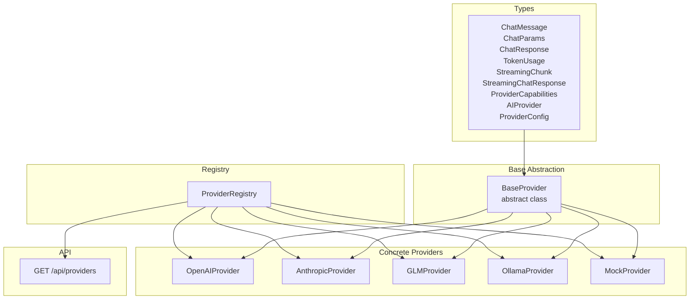
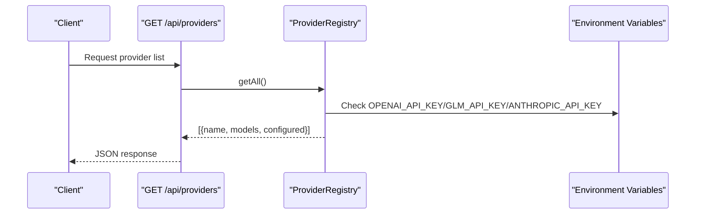
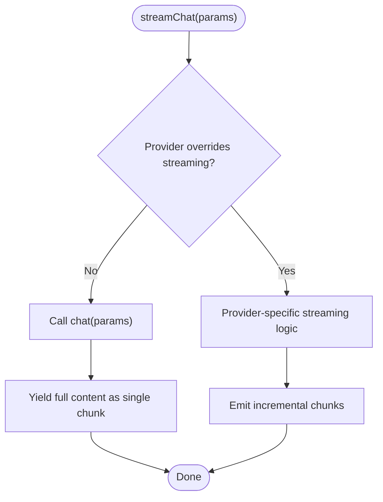
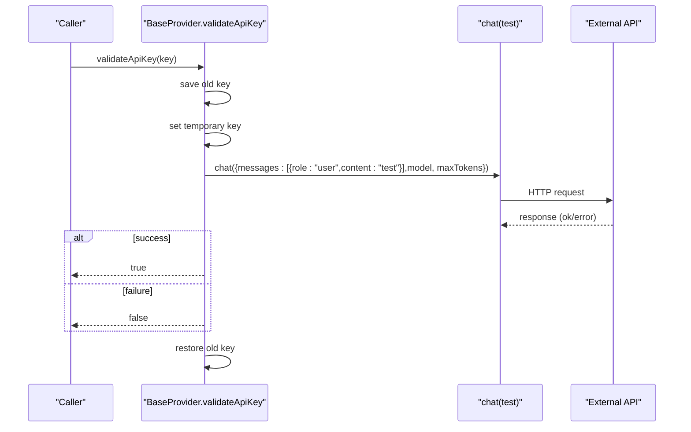
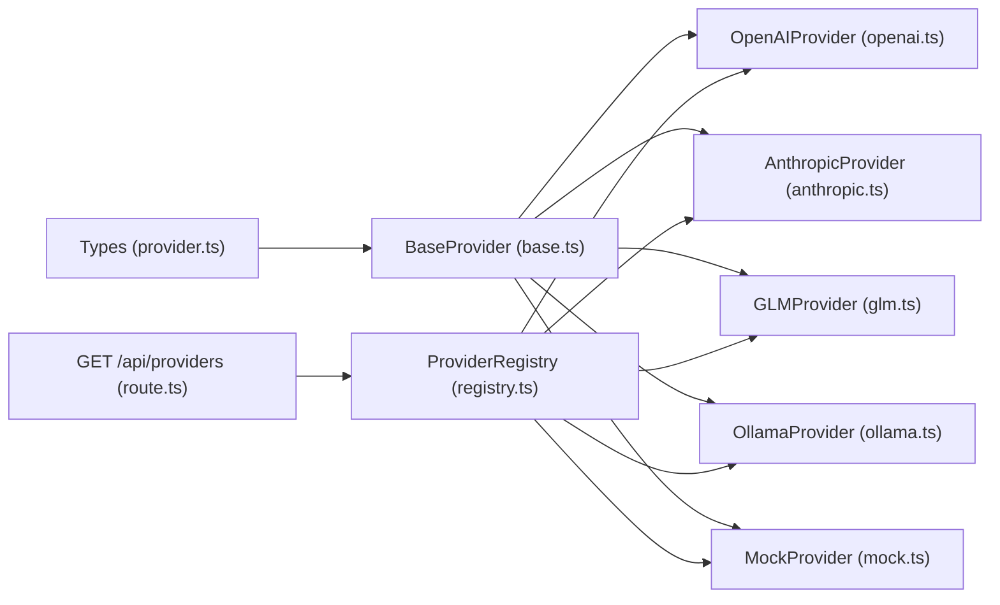

# Provider Abstraction Layer

<cite>
**Referenced Files in This Document**
- [base.ts](file://src/core/providers/base.ts)
- [provider.ts](file://src/types/provider.ts)
- [registry.ts](file://src/core/providers/registry.ts)
- [openai.ts](file://src/core/providers/openai.ts)
- [anthropic.ts](file://src/core/providers/anthropic.ts)
- [glm.ts](file://src/core/providers/glm.ts)
- [ollama.ts](file://src/core/providers/ollama.ts)
- [mock.ts](file://src/core/providers/mock.ts)
- [route.ts](file://src/app/api/providers/route.ts)
</cite>

## Table of Contents
1. [Introduction](#introduction)
2. [Project Structure](#project-structure)
3. [Core Components](#core-components)
4. [Architecture Overview](#architecture-overview)
5. [Detailed Component Analysis](#detailed-component-analysis)
6. [Dependency Analysis](#dependency-analysis)
7. [Performance Considerations](#performance-considerations)
8. [Troubleshooting Guide](#troubleshooting-guide)
9. [Conclusion](#conclusion)

## Introduction
This document explains the AI provider abstraction layer that enables pluggable support for multiple AI services (OpenAI, Anthropic, GLM, Ollama, and a mock provider). It covers the BaseProvider contract, the AIProvider interface, provider configuration and capability detection, default streaming behavior, validation mechanisms, and patterns for extending the system with custom providers.

## Project Structure
The provider abstraction lives under src/core/providers and is complemented by shared types in src/types. A registry manages provider instances and auto-detection based on environment variables. An API endpoint exposes provider metadata to the client.



**Diagram sources**
- [provider.ts:1-66](file://src/types/provider.ts#L1-L66)
- [base.ts:1-83](file://src/core/providers/base.ts#L1-L83)
- [openai.ts:1-134](file://src/core/providers/openai.ts#L1-L134)
- [anthropic.ts:1-215](file://src/core/providers/anthropic.ts#L1-L215)
- [glm.ts:1-132](file://src/core/providers/glm.ts#L1-L132)
- [ollama.ts:1-196](file://src/core/providers/ollama.ts#L1-L196)
- [mock.ts:1-112](file://src/core/providers/mock.ts#L1-L112)
- [registry.ts:1-83](file://src/core/providers/registry.ts#L1-L83)
- [route.ts:1-25](file://src/app/api/providers/route.ts#L1-L25)

**Section sources**
- [provider.ts:1-66](file://src/types/provider.ts#L1-L66)
- [base.ts:1-83](file://src/core/providers/base.ts#L1-L83)
- [registry.ts:1-83](file://src/core/providers/registry.ts#L1-L83)
- [route.ts:1-25](file://src/app/api/providers/route.ts#L1-L25)

## Core Components
- AIProvider interface: Defines the contract that all providers must implement, including identity, configuration, capabilities, and methods for chat, streaming, validation, and token usage.
- BaseProvider abstract class: Implements shared behavior (API key storage, default streaming fallback, token usage parsing helpers, and a default validation routine).
- Concrete providers: OpenAI, Anthropic, GLM, Ollama, and Mock implement provider-specific logic while inheriting from BaseProvider.
- ProviderRegistry: Centralized registration and discovery of providers, including environment-based auto-detection and programmatic creation.

**Section sources**
- [provider.ts:45-57](file://src/types/provider.ts#L45-L57)
- [base.ts:3-82](file://src/core/providers/base.ts#L3-L82)
- [registry.ts:8-83](file://src/core/providers/registry.ts#L8-L83)

## Architecture Overview
The abstraction layer separates concerns between the shared contract (AIProvider/BaseProvider), provider-specific implementations, and a registry that orchestrates discovery and instantiation. The API surface exposes provider metadata to clients.

```mermaid
classDiagram
class AIProvider {
+string name
+string baseUrl
+string[] models
+number concurrencyLimit
+rateLimit : {rpm, tpm}
+chat(params) Promise~ChatResponse~
+streamChat(params) AsyncGenerator~string~
+validateApiKey(key) Promise~boolean~
+getAvailableModels() Promise~string[]~
+getTokenUsage() TokenUsage?
+getCapabilities() ProviderCapabilities
}
class BaseProvider {
<<abstract>>
-string apiKey
-TokenUsage? lastTokenUsage
+setApiKey(key) void
+chat(params) Promise~ChatResponse~*
+streamChat(params) AsyncGenerator~string~*
+getTokenUsage() TokenUsage?
+getCapabilities() ProviderCapabilities
+validateApiKey(key) Promise~boolean~
+getAvailableModels() Promise~string[]~
#parseOpenAIResponse(data) ChatResponse
}
class OpenAIProvider {
+name="OpenAI"
+baseUrl : string
+models : string[]
+concurrencyLimit : number
+rateLimit : {rpm, tpm}
+chat(params) Promise~ChatResponse~
+streamChat(params) AsyncGenerator~string~
+getCapabilities() ProviderCapabilities
}
class AnthropicProvider {
+name="Anthropic"
+baseUrl : string
+models : string[]
+concurrencyLimit : number
+rateLimit : {rpm, tpm}
+chat(params) Promise~ChatResponse~
+streamChat(params) AsyncGenerator~string~
+getCapabilities() ProviderCapabilities
}
class GLMProvider {
+name="GLM AI / ZAI"
+baseUrl : string
+models : string[]
+concurrencyLimit : number
+rateLimit : {rpm, tpm}
+chat(params) Promise~ChatResponse~
+streamChat(params) AsyncGenerator~string~
+getCapabilities() ProviderCapabilities
}
class OllamaProvider {
+name="Ollama"
+baseUrl : string
+models : string[]
+concurrencyLimit : number
+rateLimit : {rpm, tpm}
+chat(params) Promise~ChatResponse~
+streamChat(params) AsyncGenerator~string~
+getAvailableModels() Promise~string[]~
+validateApiKey() Promise~boolean~
+getCapabilities() ProviderCapabilities
}
class MockProvider {
+name="Mock Provider"
+baseUrl : string
+models : string[]
+concurrencyLimit : number
+rateLimit : {rpm, tpm}
+chat(params) Promise~ChatResponse~
+streamChat(params) AsyncGenerator~string~
+validateApiKey() Promise~boolean~
+getCapabilities() ProviderCapabilities
}
AIProvider <|.. BaseProvider
BaseProvider <|-- OpenAIProvider
BaseProvider <|-- AnthropicProvider
BaseProvider <|-- GLMProvider
BaseProvider <|-- OllamaProvider
BaseProvider <|-- MockProvider
```

**Diagram sources**
- [provider.ts:45-57](file://src/types/provider.ts#L45-L57)
- [base.ts:3-82](file://src/core/providers/base.ts#L3-L82)
- [openai.ts:4-134](file://src/core/providers/openai.ts#L4-L134)
- [anthropic.ts:9-215](file://src/core/providers/anthropic.ts#L9-L215)
- [glm.ts:4-132](file://src/core/providers/glm.ts#L4-L132)
- [ollama.ts:4-196](file://src/core/providers/ollama.ts#L4-L196)
- [mock.ts:23-112](file://src/core/providers/mock.ts#L23-L112)

## Detailed Component Analysis

### AIProvider Interface and BaseProvider Contract
- Identity and configuration:
  - name: Human-readable provider identifier.
  - baseUrl: Base URL for API endpoints.
  - models: List of supported model identifiers.
  - concurrencyLimit: Maximum concurrent requests allowed.
  - rateLimit: Per-minute and per-million-tokens limits.
- Methods:
  - chat(params): Synchronous chat completion returning content, model, and token usage.
  - streamChat(params): Asynchronous generator yielding incremental content chunks.
  - validateApiKey(key): Verifies an API key without permanently changing state.
  - getAvailableModels(): Returns the current list of available models (provider-specific).
  - getTokenUsage(): Returns the last observed token usage.
  - getCapabilities(): Reports provider capabilities (streaming, tools, context window, modalities).
- Optional capabilities:
  - Providers can override getCapabilities() to advertise streaming, tool support, and modalities.

Implementation highlights in BaseProvider:
- API key management: setApiKey(key) stores the key; validateApiKey(key) temporarily swaps keys, performs a safe test call, then restores the previous key.
- Default streaming fallback: streamChat yields the entire response as a single chunk if a provider does not implement streaming.
- Token usage parsing: parseOpenAIResponse handles OpenAI-style responses and updates lastTokenUsage.

**Section sources**
- [provider.ts:45-57](file://src/types/provider.ts#L45-L57)
- [base.ts:3-82](file://src/core/providers/base.ts#L3-L82)

### Provider Registry and Configuration
- Auto-detection:
  - Registers Mock by default.
  - Conditionally registers GLM, OpenAI, and Anthropic based on presence of their respective API keys in environment variables.
  - Registers Ollama unconditionally (graceful failure if service is unavailable).
- Programmatic creation:
  - createProvider(name, apiKey, baseUrl?) constructs a specific provider instance by name, normalizing the input to lowercase and mapping known aliases.
- Provider metadata API:
  - GET /api/providers returns provider names, model lists, and whether a provider is configured (based on environment variables).



**Diagram sources**
- [route.ts:3-24](file://src/app/api/providers/route.ts#L3-L24)
- [registry.ts:19-37](file://src/core/providers/registry.ts#L19-L37)

**Section sources**
- [registry.ts:8-83](file://src/core/providers/registry.ts#L8-L83)
- [route.ts:1-25](file://src/app/api/providers/route.ts#L1-L25)

### Default Streaming Implementation
- BaseProvider.streamChat(params) provides a fallback that:
  - Calls chat(params) synchronously.
  - Yields the full content as a single chunk.
- Providers can override streamChat to implement native streaming:
  - OpenAIProvider: Uses fetch with stream=true and parses SSE-like lines.
  - AnthropicProvider: Parses message events and tracks usage across events.
  - GLMProvider: Mirrors OpenAI’s streaming format.
  - OllamaProvider: Streams raw JSON lines and extracts content and usage.
  - MockProvider: Simulates streaming by emitting words with random delays.



**Diagram sources**
- [base.ts:19-23](file://src/core/providers/base.ts#L19-L23)
- [openai.ts:64-132](file://src/core/providers/openai.ts#L64-L132)
- [anthropic.ts:94-186](file://src/core/providers/anthropic.ts#L94-L186)
- [glm.ts:64-130](file://src/core/providers/glm.ts#L64-L130)
- [ollama.ts:87-163](file://src/core/providers/ollama.ts#L87-L163)
- [mock.ts:99-106](file://src/core/providers/mock.ts#L99-L106)

**Section sources**
- [base.ts:19-23](file://src/core/providers/base.ts#L19-L23)
- [openai.ts:64-132](file://src/core/providers/openai.ts#L64-L132)
- [anthropic.ts:94-186](file://src/core/providers/anthropic.ts#L94-L186)
- [glm.ts:64-130](file://src/core/providers/glm.ts#L64-L130)
- [ollama.ts:87-163](file://src/core/providers/ollama.ts#L87-L163)
- [mock.ts:99-106](file://src/core/providers/mock.ts#L99-L106)

### Provider Validation Mechanism and Error Handling
- BaseProvider.validateApiKey(key):
  - Temporarily replaces the stored API key.
  - Executes a minimal chat request with a short test message and small maxTokens.
  - Restores the original key and returns success/failure based on whether the request succeeded.
- Provider-specific validations:
  - OllamaProvider.validateApiKey(): Checks connectivity to the local service endpoint instead of requiring an API key.
  - MockProvider.validateApiKey(): Always returns true for local development/testing.
- Error handling patterns:
  - Providers wrap non-OK responses by reading the body and throwing a descriptive error with status code attached.
  - Streaming providers decode response bodies and handle malformed JSON chunks gracefully.
  - Timeouts are enforced via AbortController and cleanup via clearTimeout.



**Diagram sources**
- [base.ts:38-52](file://src/core/providers/base.ts#L38-L52)
- [openai.ts:48-55](file://src/core/providers/openai.ts#L48-L55)
- [anthropic.ts:78-85](file://src/core/providers/anthropic.ts#L78-L85)
- [glm.ts:48-55](file://src/core/providers/glm.ts#L48-L55)
- [ollama.ts:165-176](file://src/core/providers/ollama.ts#L165-L176)
- [mock.ts:108-110](file://src/core/providers/mock.ts#L108-L110)

**Section sources**
- [base.ts:38-52](file://src/core/providers/base.ts#L38-L52)
- [openai.ts:48-55](file://src/core/providers/openai.ts#L48-L55)
- [anthropic.ts:78-85](file://src/core/providers/anthropic.ts#L78-L85)
- [glm.ts:48-55](file://src/core/providers/glm.ts#L48-L55)
- [ollama.ts:165-176](file://src/core/providers/ollama.ts#L165-L176)
- [mock.ts:108-110](file://src/core/providers/mock.ts#L108-L110)

### Concrete Provider Implementations

#### OpenAIProvider
- Identity and limits: name "OpenAI", predefined models, concurrency and RPM/TPM limits.
- Capabilities: streaming enabled, tools supported, wide context window, text/image modalities.
- Chat: Sends JSON payload to /chat/completions, parses OpenAI response format, sets token usage.
- Streaming: Enables stream=true, reads SSE-like lines, yields delta content, handles [DONE].

**Section sources**
- [openai.ts:4-134](file://src/core/providers/openai.ts#L4-L134)

#### AnthropicProvider
- Identity and limits: name "Anthropic", predefined models, moderate concurrency and rate limits.
- Capabilities: streaming enabled, tools supported, large context window, text/image modalities.
- Message conversion: Converts ChatMessage to Anthropic’s expected structure and ensures the first message is a user message.
- Chat: Posts to /messages, parses content blocks and usage.
- Streaming: Parses message_start/message_delta events and updates token usage incrementally.

**Section sources**
- [anthropic.ts:9-215](file://src/core/providers/anthropic.ts#L9-L215)

#### GLMProvider
- Identity and limits: name "GLM AI / ZAI", single model, conservative concurrency and rate limits.
- Capabilities: streaming enabled, no tools, wide context window, text modality.
- Chat: Similar to OpenAI but uses GLM’s /chat/completions endpoint and parses OpenAI-compatible response.
- Streaming: Mirrors OpenAI streaming behavior.

**Section sources**
- [glm.ts:4-132](file://src/core/providers/glm.ts#L4-L132)

#### OllamaProvider
- Identity and limits: name "Ollama", local model, effectively unlimited rate limits.
- Dynamic models: getAvailableModels() queries /api/tags to discover installed models at runtime.
- Capabilities: streaming enabled, no tools, wide context window, text modality.
- Chat: Posts to /api/chat with stream=false, parses final response and usage.
- Streaming: Posts with stream=true, yields content from JSON lines, tracks usage on completion.
- Validation: Validates connectivity to /api/tags instead of requiring an API key.

**Section sources**
- [ollama.ts:4-196](file://src/core/providers/ollama.ts#L4-L196)

#### MockProvider
- Identity and limits: name "Mock Provider", local simulation, generous limits.
- Capabilities: streaming enabled, no tools, wide context window, text modality.
- Chat: Selects a domain-specific response based on system message content, simulates token usage.
- Streaming: Emits words with randomized delays to simulate typing.
- Validation: Always returns true for local development.

**Section sources**
- [mock.ts:23-112](file://src/core/providers/mock.ts#L23-L112)

### Extending the Abstraction Layer
To add a new provider:
1. Create a new class extending BaseProvider and implement:
   - Identity fields (name, baseUrl, models, concurrencyLimit, rateLimit).
   - chat(params) and streamChat(params) with provider-specific HTTP calls and response parsing.
   - getCapabilities() to advertise features.
   - Optionally override validateApiKey() if the provider has a different validation approach.
2. Register the provider in the registry:
   - Add environment-based detection if applicable.
   - Add a mapping in createProvider() to construct the provider by name.
3. Expose provider metadata via the API if needed.

Example extension points:
- Override getCapabilities() to enable streaming or tool support.
- Implement provider-specific token usage parsing in a helper similar to parseOpenAIResponse.
- Integrate with environment variables for configuration and validation.

**Section sources**
- [base.ts:3-82](file://src/core/providers/base.ts#L3-L82)
- [registry.ts:55-79](file://src/core/providers/registry.ts#L55-L79)

## Dependency Analysis
- Cohesion: Each provider encapsulates its own API specifics and response parsing.
- Coupling: Providers depend on BaseProvider for shared behavior; the registry depends on provider constructors; the API depends on the registry.
- External dependencies: Providers rely on fetch and environment variables for configuration.



**Diagram sources**
- [provider.ts:45-57](file://src/types/provider.ts#L45-L57)
- [base.ts:3-82](file://src/core/providers/base.ts#L3-L82)
- [openai.ts:4-134](file://src/core/providers/openai.ts#L4-L134)
- [anthropic.ts:9-215](file://src/core/providers/anthropic.ts#L9-L215)
- [glm.ts:4-132](file://src/core/providers/glm.ts#L4-L132)
- [ollama.ts:4-196](file://src/core/providers/ollama.ts#L4-L196)
- [mock.ts:23-112](file://src/core/providers/mock.ts#L23-L112)
- [registry.ts:8-83](file://src/core/providers/registry.ts#L8-L83)
- [route.ts:1-25](file://src/app/api/providers/route.ts#L1-L25)

**Section sources**
- [registry.ts:8-83](file://src/core/providers/registry.ts#L8-L83)
- [route.ts:1-25](file://src/app/api/providers/route.ts#L1-L25)

## Performance Considerations
- Concurrency and rate limits: Configure concurrencyLimit and rateLimit appropriately per provider to avoid throttling or overload.
- Streaming vs. synchronous: Prefer streaming for responsive UX; ensure robust parsing of partial chunks and graceful handling of malformed data.
- Timeouts: Use AbortController to prevent hanging requests; set reasonable timeouts for chat and streaming calls.
- Token usage tracking: Providers update lastTokenUsage; consider aggregating usage across sessions for budgeting.

[No sources needed since this section provides general guidance]

## Troubleshooting Guide
- API key validation fails:
  - Verify environment variables for the provider (OPENAI_API_KEY, ANTHROPIC_API_KEY, GLM_API_KEY).
  - Use validateApiKey() to test credentials without persisting them.
- Streaming errors:
  - Check provider-specific streaming logic and ensure the endpoint supports streaming.
  - Handle malformed JSON chunks and missing response bodies gracefully.
- Connectivity issues:
  - For Ollama, confirm the service is running and reachable at the configured base URL.
  - For remote providers, verify network access and firewall rules.
- Model availability:
  - Use getAvailableModels() to discover dynamic model lists (e.g., Ollama).
- Rate limit exceeded:
  - Reduce concurrencyLimit and adjust rateLimit settings; implement backoff strategies.

**Section sources**
- [base.ts:38-52](file://src/core/providers/base.ts#L38-L52)
- [openai.ts:48-55](file://src/core/providers/openai.ts#L48-L55)
- [anthropic.ts:78-85](file://src/core/providers/anthropic.ts#L78-L85)
- [glm.ts:48-55](file://src/core/providers/glm.ts#L48-L55)
- [ollama.ts:26-47](file://src/core/providers/ollama.ts#L26-L47)
- [mock.ts:108-110](file://src/core/providers/mock.ts#L108-L110)

## Conclusion
The provider abstraction layer cleanly separates provider-specific logic from shared concerns, enabling easy addition of new AI services while maintaining a consistent interface. The BaseProvider offers sensible defaults for streaming and validation, while concrete providers tailor behavior to their APIs. The registry and API surface simplify discovery and configuration, and the types define a clear contract for extensibility.