# Provider Registry and Management

<cite>
**Referenced Files in This Document**
- [registry.ts](file://src/core/providers/registry.ts)
- [base.ts](file://src/core/providers/base.ts)
- [openai.ts](file://src/core/providers/openai.ts)
- [anthropic.ts](file://src/core/providers/anthropic.ts)
- [glm.ts](file://src/core/providers/glm.ts)
- [ollama.ts](file://src/core/providers/ollama.ts)
- [mock.ts](file://src/core/providers/mock.ts)
- [provider.ts](file://src/types/provider.ts)
- [route.ts](file://src/app/api/providers/route.ts)
- [settings-store.ts](file://src/stores/settings-store.ts)
- [page.tsx](file://src/app/settings/page.tsx)
- [metrics.ts](file://src/lib/metrics.ts)
- [circuit-breaker.ts](file://src/lib/circuit-breaker.ts)
</cite>

## Table of Contents
1. [Introduction](#introduction)
2. [Project Structure](#project-structure)
3. [Core Components](#core-components)
4. [Architecture Overview](#architecture-overview)
5. [Detailed Component Analysis](#detailed-component-analysis)
6. [Dependency Analysis](#dependency-analysis)
7. [Performance Considerations](#performance-considerations)
8. [Troubleshooting Guide](#troubleshooting-guide)
9. [Conclusion](#conclusion)
10. [Appendices](#appendices)

## Introduction
This document describes the provider registry and management system that powers AI provider selection and lifecycle within the application. It covers:
- Provider registration and dynamic loading based on environment variables
- Runtime provider switching and configuration management
- Provider selection strategies and health monitoring
- Provider lifecycle: initialization, validation, and cleanup
- Examples of programmatic registration, custom selection logic, and health monitoring

## Project Structure
The provider system is organized around a central registry that loads providers dynamically, a shared base class that defines the provider contract, and concrete provider implementations for OpenAI, Anthropic, GLM, Ollama, and a mock provider. A small API surface exposes provider availability and configuration status. UI and settings integrate with the registry to enable runtime provider updates.

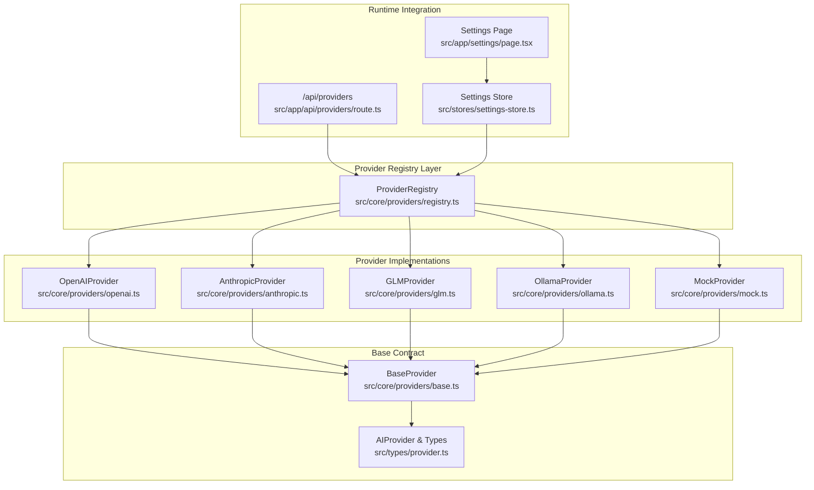

**Diagram sources**
- [registry.ts:8-83](file://src/core/providers/registry.ts#L8-L83)
- [openai.ts:4-134](file://src/core/providers/openai.ts#L4-L134)
- [anthropic.ts:9-215](file://src/core/providers/anthropic.ts#L9-L215)
- [glm.ts:4-132](file://src/core/providers/glm.ts#L4-L132)
- [ollama.ts:4-196](file://src/core/providers/ollama.ts#L4-L196)
- [mock.ts:23-112](file://src/core/providers/mock.ts#L23-L112)
- [base.ts:3-83](file://src/core/providers/base.ts#L3-L83)
- [provider.ts:45-66](file://src/types/provider.ts#L45-L66)
- [route.ts:1-25](file://src/app/api/providers/route.ts#L1-L25)
- [settings-store.ts:1-90](file://src/stores/settings-store.ts#L1-L90)
- [page.tsx:40-211](file://src/app/settings/page.tsx#L40-L211)

**Section sources**
- [registry.ts:1-83](file://src/core/providers/registry.ts#L1-L83)
- [base.ts:1-83](file://src/core/providers/base.ts#L1-L83)
- [provider.ts:1-66](file://src/types/provider.ts#L1-L66)
- [route.ts:1-25](file://src/app/api/providers/route.ts#L1-L25)
- [settings-store.ts:1-90](file://src/stores/settings-store.ts#L1-L90)
- [page.tsx:40-211](file://src/app/settings/page.tsx#L40-L211)

## Core Components
- ProviderRegistry: Central registry that registers providers at startup, auto-detects providers from environment variables, and exposes lookup and creation APIs.
- BaseProvider: Abstract base class defining the AIProvider contract, default streaming behavior, token usage tracking, capability reporting, and API key validation.
- Provider Implementations: Concrete providers for OpenAI, Anthropic, GLM, Ollama, and Mock, each implementing provider-specific chat and streaming logic, capabilities, and optional validation.
- Types: AIProvider interface and supporting types define the contract for chat requests/responses, token usage, streaming chunks, and provider capabilities.
- Runtime Integration: An API endpoint lists providers and their configuration status; the settings UI integrates with a store to update provider selection and model choices.

**Section sources**
- [registry.ts:8-83](file://src/core/providers/registry.ts#L8-L83)
- [base.ts:3-83](file://src/core/providers/base.ts#L3-L83)
- [openai.ts:4-134](file://src/core/providers/openai.ts#L4-L134)
- [anthropic.ts:9-215](file://src/core/providers/anthropic.ts#L9-L215)
- [glm.ts:4-132](file://src/core/providers/glm.ts#L4-L132)
- [ollama.ts:4-196](file://src/core/providers/ollama.ts#L4-L196)
- [mock.ts:23-112](file://src/core/providers/mock.ts#L23-L112)
- [provider.ts:45-66](file://src/types/provider.ts#L45-L66)
- [route.ts:1-25](file://src/app/api/providers/route.ts#L1-L25)
- [settings-store.ts:1-90](file://src/stores/settings-store.ts#L1-L90)
- [page.tsx:40-211](file://src/app/settings/page.tsx#L40-L211)

## Architecture Overview
The provider system follows a registry pattern with dynamic discovery and explicit creation. Providers are registered at construction time and can be retrieved by name. The registry also supports programmatic creation of providers with custom API keys and base URLs. The UI reads provider availability from the API and persists user-selected provider and model in a store.

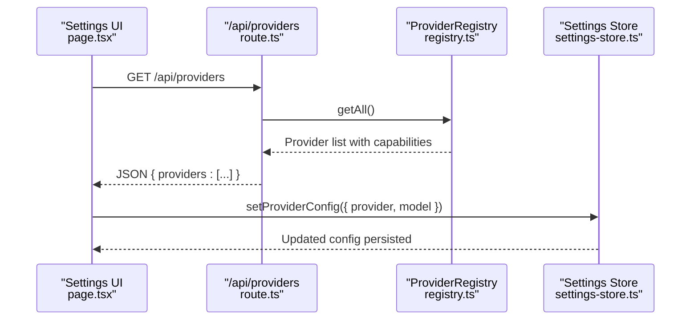

**Diagram sources**
- [route.ts:1-25](file://src/app/api/providers/route.ts#L1-L25)
- [registry.ts:43-53](file://src/core/providers/registry.ts#L43-L53)
- [settings-store.ts:47-90](file://src/stores/settings-store.ts#L47-L90)
- [page.tsx:40-211](file://src/app/settings/page.tsx#L40-L211)

## Detailed Component Analysis

### ProviderRegistry
Responsibilities:
- Registers providers at startup, including a built-in mock provider and auto-detected providers based on environment variables.
- Provides methods to register, retrieve, list, and programmatically create providers.
- Supports provider creation with custom API keys and base URLs.

Key behaviors:
- Auto-detection checks for GLM, OpenAI, and Anthropic API keys and conditionally registers their providers.
- Always registers Ollama locally and Mock providers.
- Normalizes provider names to lowercase for lookups and creation.

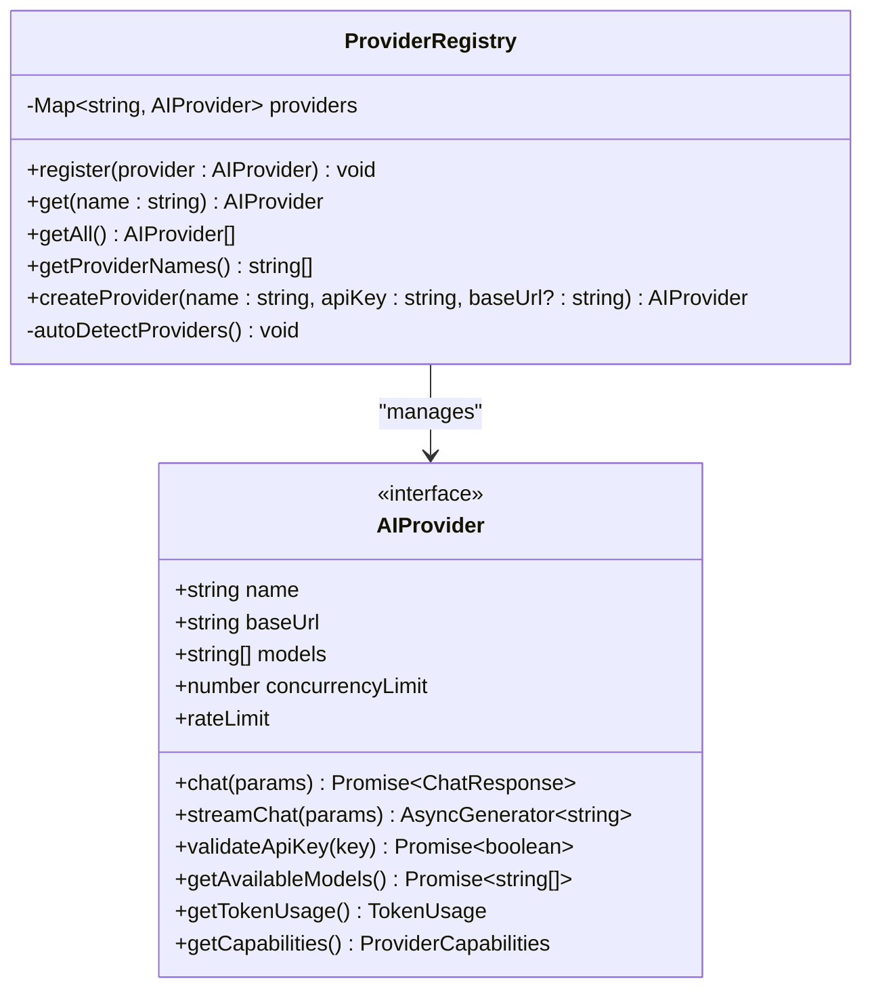

**Diagram sources**
- [registry.ts:8-83](file://src/core/providers/registry.ts#L8-L83)
- [provider.ts:45-57](file://src/types/provider.ts#L45-L57)

**Section sources**
- [registry.ts:11-37](file://src/core/providers/registry.ts#L11-L37)
- [registry.ts:39-80](file://src/core/providers/registry.ts#L39-L80)

### BaseProvider and AIProvider Contract
Responsibilities:
- Define the provider contract for chat, streaming, validation, model discovery, token usage, and capabilities.
- Provide a default streaming implementation and a helper to parse OpenAI-style responses.
- Expose a default capability profile and token usage tracking.

Key behaviors:
- validateApiKey attempts a safe test call using the current API key and restores it afterward.
- parseOpenAIResponse extracts content and usage from provider responses and tracks token usage.

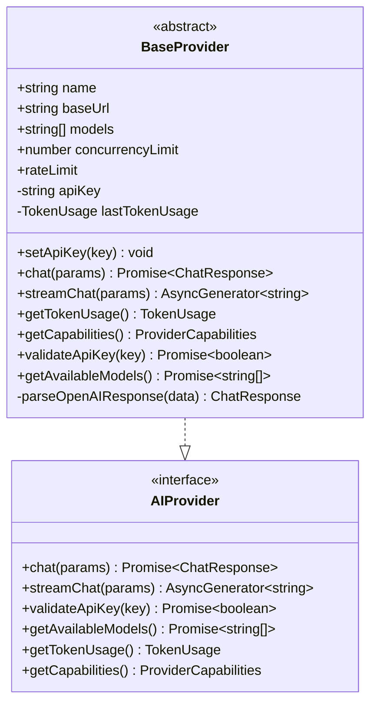

**Diagram sources**
- [base.ts:3-83](file://src/core/providers/base.ts#L3-L83)
- [provider.ts:45-57](file://src/types/provider.ts#L45-L57)

**Section sources**
- [base.ts:13-52](file://src/core/providers/base.ts#L13-L52)
- [base.ts:54-81](file://src/core/providers/base.ts#L54-L81)
- [provider.ts:45-57](file://src/types/provider.ts#L45-L57)

### Provider Implementations

#### OpenAIProvider
- Implements chat and streaming with OpenAI-compatible endpoints.
- Supports streaming and tool use capabilities.
- Uses environment variables for API key and base URL.

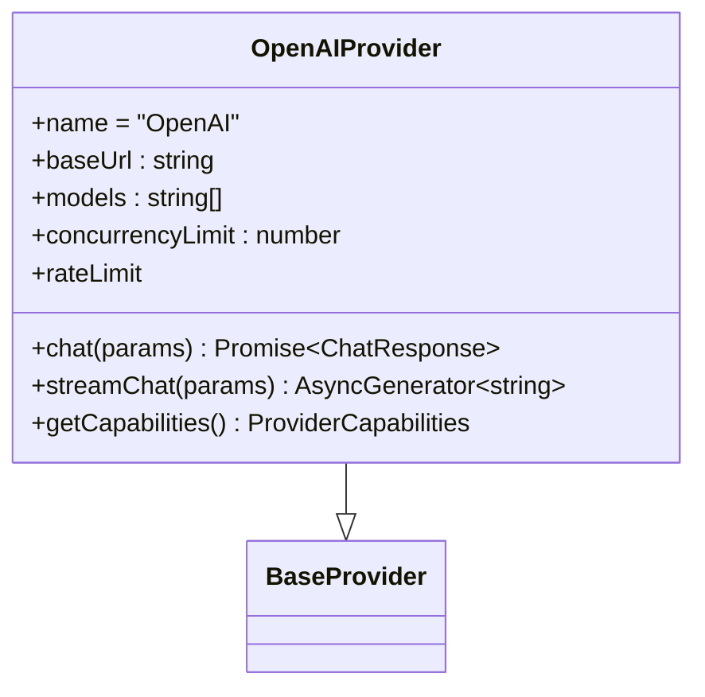

**Diagram sources**
- [openai.ts:4-134](file://src/core/providers/openai.ts#L4-L134)
- [base.ts:3-83](file://src/core/providers/base.ts#L3-L83)

**Section sources**
- [openai.ts:11-62](file://src/core/providers/openai.ts#L11-L62)
- [openai.ts:64-132](file://src/core/providers/openai.ts#L64-L132)

#### AnthropicProvider
- Implements chat and streaming with Anthropic Messages API.
- Converts messages to Anthropic’s expected format and handles streaming events.
- Supports streaming and tool use capabilities.

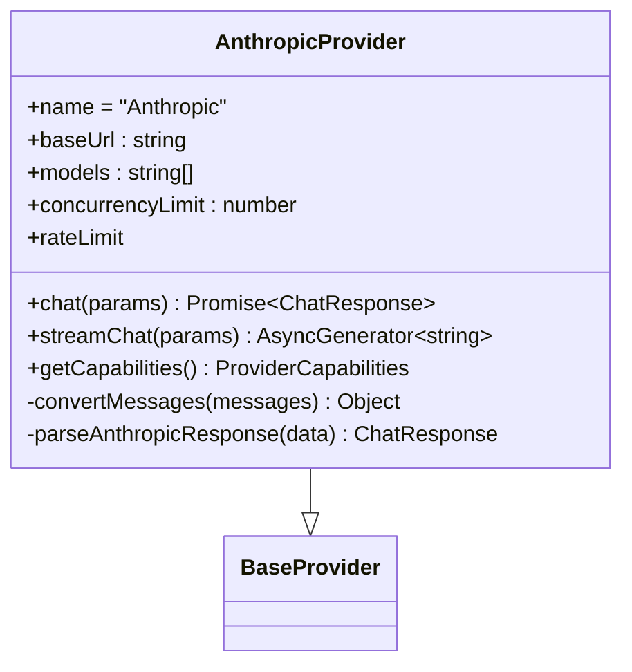

**Diagram sources**
- [anthropic.ts:9-215](file://src/core/providers/anthropic.ts#L9-L215)
- [base.ts:3-83](file://src/core/providers/base.ts#L3-L83)

**Section sources**
- [anthropic.ts:16-92](file://src/core/providers/anthropic.ts#L16-L92)
- [anthropic.ts:94-186](file://src/core/providers/anthropic.ts#L94-L186)
- [anthropic.ts:188-213](file://src/core/providers/anthropic.ts#L188-L213)

#### GLMProvider
- Implements chat and streaming with GLM-compatible endpoints.
- Uses environment variables for API key and base URL.
- Supports streaming and limited tool use.

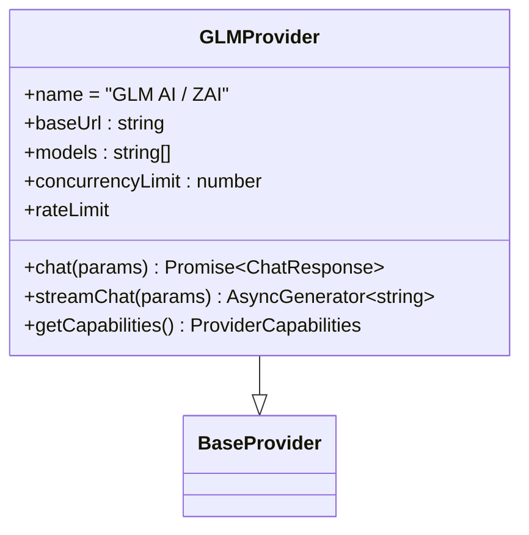

**Diagram sources**
- [glm.ts:4-132](file://src/core/providers/glm.ts#L4-L132)
- [base.ts:3-83](file://src/core/providers/base.ts#L3-L83)

**Section sources**
- [glm.ts:11-62](file://src/core/providers/glm.ts#L11-L62)
- [glm.ts:64-130](file://src/core/providers/glm.ts#L64-L130)

#### OllamaProvider
- Implements chat and streaming against a local Ollama instance.
- Dynamically discovers available models via the /api/tags endpoint.
- Validates connectivity instead of requiring an API key.

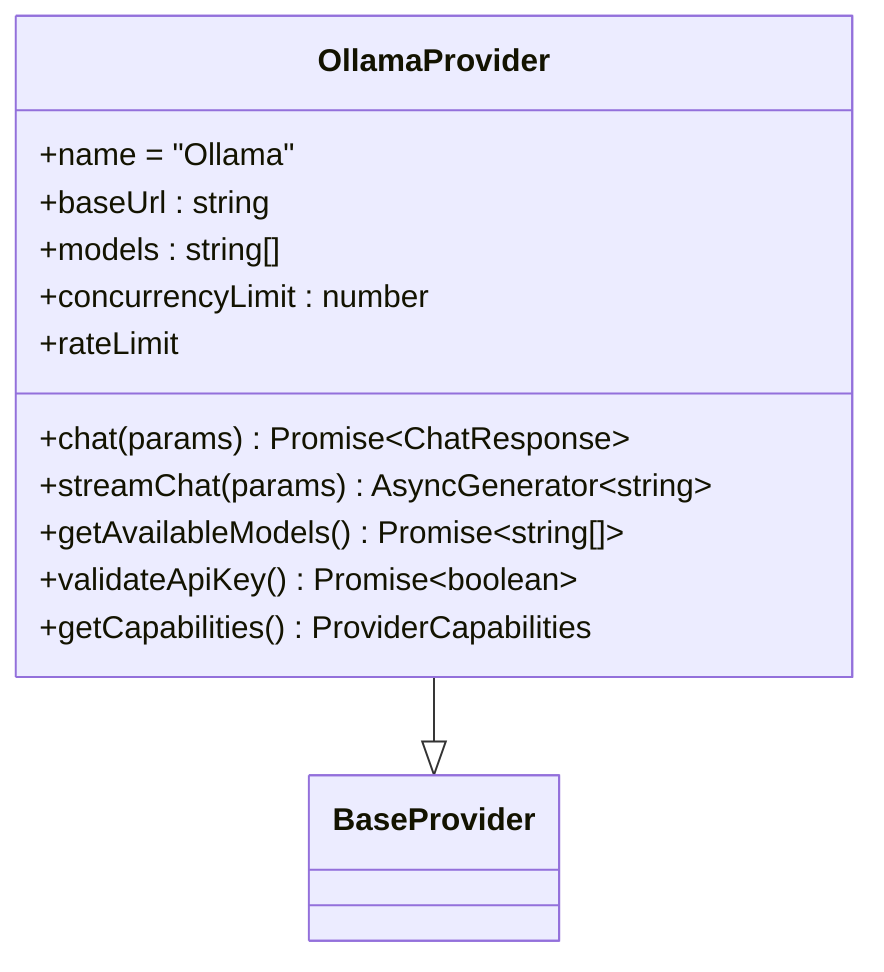

**Diagram sources**
- [ollama.ts:4-196](file://src/core/providers/ollama.ts#L4-L196)
- [base.ts:3-83](file://src/core/providers/base.ts#L3-L83)

**Section sources**
- [ollama.ts:11-47](file://src/core/providers/ollama.ts#L11-L47)
- [ollama.ts:49-85](file://src/core/providers/ollama.ts#L49-L85)
- [ollama.ts:87-163](file://src/core/providers/ollama.ts#L87-L163)
- [ollama.ts:165-176](file://src/core/providers/ollama.ts#L165-L176)

#### MockProvider
- Provides deterministic responses for testing and demos.
- Simulates domain-aware responses and streaming delays.
- Always validates as configured.

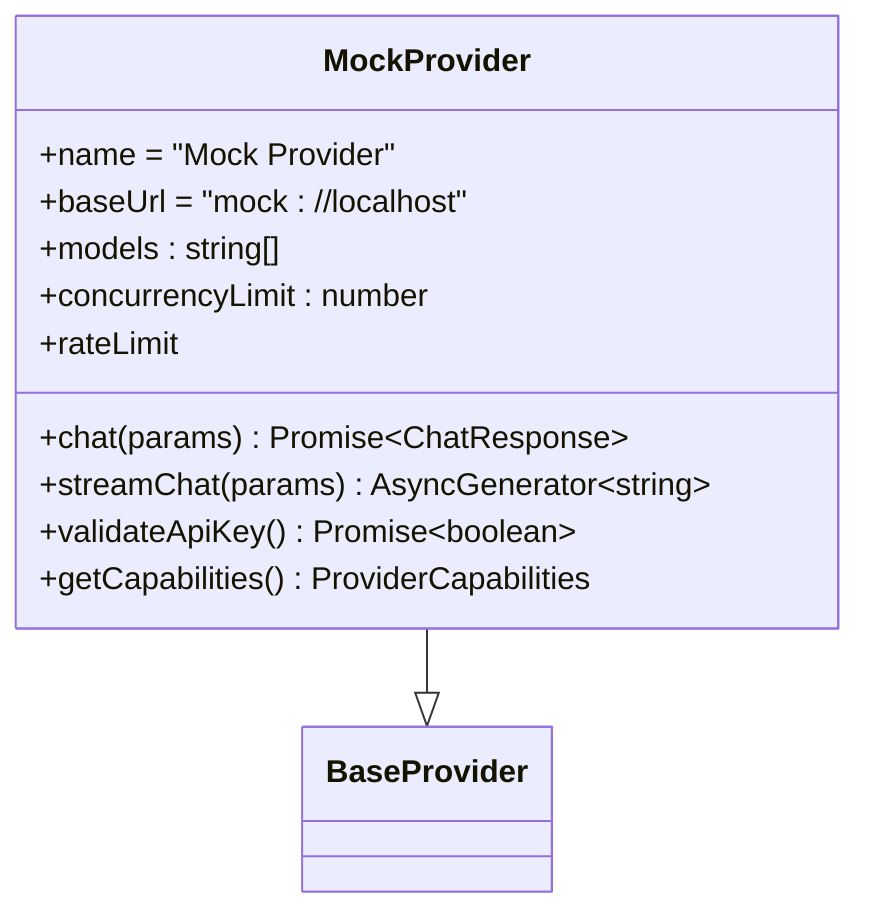

**Diagram sources**
- [mock.ts:23-112](file://src/core/providers/mock.ts#L23-L112)
- [base.ts:3-83](file://src/core/providers/base.ts#L3-L83)

**Section sources**
- [mock.ts:33-97](file://src/core/providers/mock.ts#L33-L97)
- [mock.ts:99-111](file://src/core/providers/mock.ts#L99-L111)

### Provider Selection and Health Monitoring
- Provider availability: The API endpoint enumerates providers and marks whether they are configured based on environment variables.
- UI integration: The settings page fetches provider statuses and allows selecting provider and model, with special handling for Ollama base URL.
- Health monitoring: The metrics library computes agent performance scores and can suppress underperforming agents. While not directly selecting providers, it informs selection decisions by scoring agents.

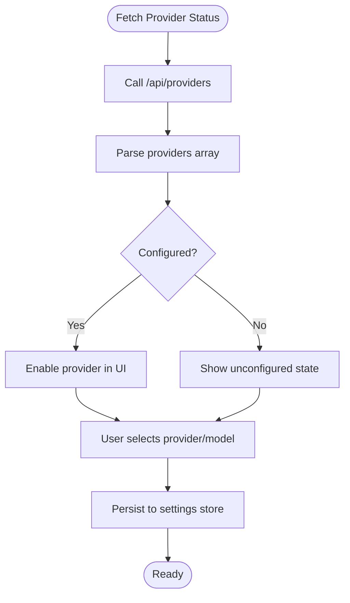

**Diagram sources**
- [route.ts:3-24](file://src/app/api/providers/route.ts#L3-L24)
- [page.tsx:45-70](file://src/app/settings/page.tsx#L45-L70)
- [settings-store.ts:47-90](file://src/stores/settings-store.ts#L47-L90)

**Section sources**
- [route.ts:1-25](file://src/app/api/providers/route.ts#L1-L25)
- [page.tsx:40-211](file://src/app/settings/page.tsx#L40-L211)
- [settings-store.ts:1-90](file://src/stores/settings-store.ts#L1-L90)
- [metrics.ts:42-132](file://src/lib/metrics.ts#L42-L132)

### Provider Lifecycle Management
- Initialization: Providers are constructed with API keys and base URLs resolved from environment variables or constructor arguments.
- Validation: Providers expose validateApiKey to test credentials. Ollama validates connectivity instead of API key presence.
- Cleanup: Providers do not implement explicit cleanup; timeouts and AbortController signals are used to cancel long-running requests.

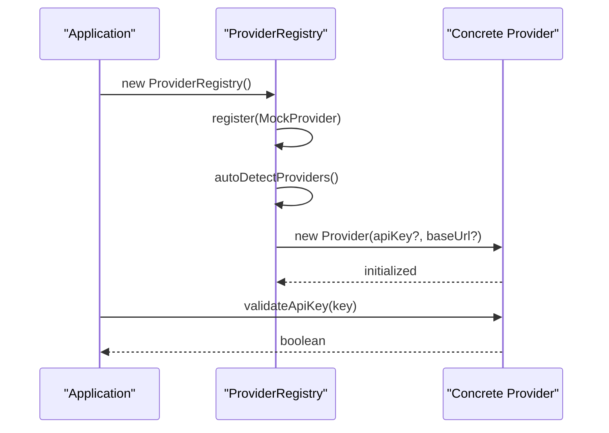

**Diagram sources**
- [registry.ts:11-37](file://src/core/providers/registry.ts#L11-L37)
- [base.ts:38-52](file://src/core/providers/base.ts#L38-L52)
- [openai.ts:11-15](file://src/core/providers/openai.ts#L11-L15)
- [anthropic.ts:16-20](file://src/core/providers/anthropic.ts#L16-L20)
- [glm.ts:11-15](file://src/core/providers/glm.ts#L11-L15)
- [ollama.ts:11-15](file://src/core/providers/ollama.ts#L11-L15)

**Section sources**
- [registry.ts:11-37](file://src/core/providers/registry.ts#L11-L37)
- [base.ts:38-52](file://src/core/providers/base.ts#L38-L52)
- [openai.ts:11-15](file://src/core/providers/openai.ts#L11-L15)
- [anthropic.ts:16-20](file://src/core/providers/anthropic.ts#L16-L20)
- [glm.ts:11-15](file://src/core/providers/glm.ts#L11-L15)
- [ollama.ts:11-15](file://src/core/providers/ollama.ts#L11-L15)

### Provider Configuration Management
- Environment variables: Registry auto-detects providers based on presence of GLM, OpenAI, and Anthropic API keys. Ollama is always registered and falls back gracefully.
- Runtime updates: The settings store persists provider and model selections. The UI reflects provider configuration status and allows custom model entries and Ollama base URL updates.

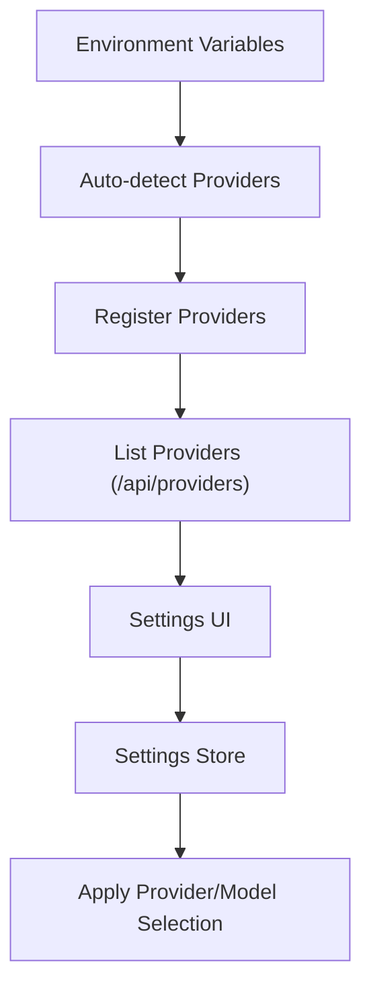

**Diagram sources**
- [registry.ts:19-37](file://src/core/providers/registry.ts#L19-L37)
- [route.ts:3-24](file://src/app/api/providers/route.ts#L3-L24)
- [page.tsx:40-211](file://src/app/settings/page.tsx#L40-L211)
- [settings-store.ts:47-90](file://src/stores/settings-store.ts#L47-L90)

**Section sources**
- [registry.ts:19-37](file://src/core/providers/registry.ts#L19-L37)
- [route.ts:1-25](file://src/app/api/providers/route.ts#L1-L25)
- [page.tsx:40-211](file://src/app/settings/page.tsx#L40-L211)
- [settings-store.ts:1-90](file://src/stores/settings-store.ts#L1-L90)

### Programmatic Registration and Custom Selection Logic
- Programmatic registration: Use the registry’s register method to add a provider instance.
- Programmatic creation: Use createProvider with a provider name, API key, and optional base URL to instantiate a provider dynamically.
- Custom selection logic: Combine provider capabilities, availability, and performance metrics to choose the best provider for a given request.

Example references:
- [Programmatic registration:39-41](file://src/core/providers/registry.ts#L39-L41)
- [Programmatic creation:55-79](file://src/core/providers/registry.ts#L55-L79)
- [Capabilities and models:17-24](file://src/core/providers/openai.ts#L17-L24)

**Section sources**
- [registry.ts:39-41](file://src/core/providers/registry.ts#L39-L41)
- [registry.ts:55-79](file://src/core/providers/registry.ts#L55-L79)
- [openai.ts:17-24](file://src/core/providers/openai.ts#L17-L24)

### Provider Health Monitoring
- Metrics library computes agent performance scores and can suppress agents with consistently low quality.
- Circuit breaker provides resilience by failing fast and attempting recovery after a timeout.

Example references:
- [Agent metrics computation:162-221](file://src/lib/metrics.ts#L162-L221)
- [Circuit breaker state machine:21-136](file://src/lib/circuit-breaker.ts#L21-L136)

**Section sources**
- [metrics.ts:42-221](file://src/lib/metrics.ts#L42-L221)
- [circuit-breaker.ts:21-136](file://src/lib/circuit-breaker.ts#L21-L136)

## Dependency Analysis
The registry depends on all provider implementations and the shared types. Providers depend on the base class and types. The API route depends on the registry. The settings UI depends on the store and the API route.

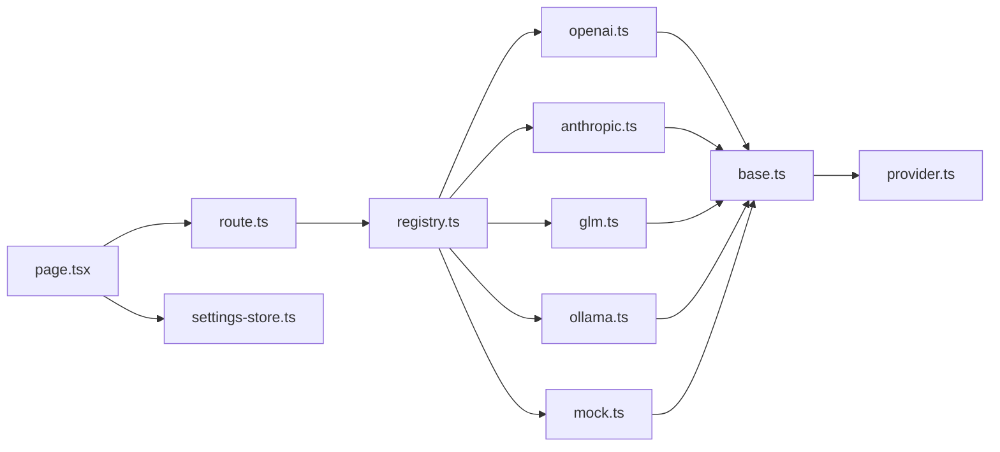

**Diagram sources**
- [registry.ts:1-7](file://src/core/providers/registry.ts#L1-L7)
- [openai.ts:1-2](file://src/core/providers/openai.ts#L1-L2)
- [anthropic.ts:1-2](file://src/core/providers/anthropic.ts#L1-L2)
- [glm.ts:1-2](file://src/core/providers/glm.ts#L1-L2)
- [ollama.ts:1-2](file://src/core/providers/ollama.ts#L1-L2)
- [mock.ts:1-2](file://src/core/providers/mock.ts#L1-L2)
- [base.ts](file://src/core/providers/base.ts#L1)
- [provider.ts](file://src/types/provider.ts#L1)
- [route.ts](file://src/app/api/providers/route.ts#L1)
- [page.tsx:1-32](file://src/app/settings/page.tsx#L1-L32)
- [settings-store.ts:1-3](file://src/stores/settings-store.ts#L1-L3)

**Section sources**
- [registry.ts:1-7](file://src/core/providers/registry.ts#L1-L7)
- [route.ts](file://src/app/api/providers/route.ts#L1)
- [page.tsx:1-32](file://src/app/settings/page.tsx#L1-L32)
- [settings-store.ts:1-3](file://src/stores/settings-store.ts#L1-L3)

## Performance Considerations
- Concurrency limits and rate limits are defined per provider. Respect these limits to avoid throttling or failures.
- Streaming support varies by provider. Prefer streaming for large responses to improve perceived latency.
- Use the circuit breaker to protect downstream calls and reduce load during failures.
- Consider agent performance scores to bias selection toward higher-performing agents when applicable.

[No sources needed since this section provides general guidance]

## Troubleshooting Guide
Common issues and resolutions:
- Provider not appearing in the UI: Ensure the corresponding environment variable is set (GLM_API_KEY, OPENAI_API_KEY, ANTHROPIC_API_KEY). Ollama is always registered but may fail gracefully if the service is unreachable.
- API key validation fails: Verify the API key is correct and the provider service is reachable. Use validateApiKey to test.
- Streaming errors: Check provider-specific streaming endpoints and ensure network stability. Providers implement their own streaming parsing and may raise errors on malformed chunks.
- Local Ollama connectivity: Confirm the base URL is correct and the service is running. Ollama’s validateApiKey checks connectivity instead of requiring an API key.

**Section sources**
- [route.ts:7-20](file://src/app/api/providers/route.ts#L7-L20)
- [base.ts:38-52](file://src/core/providers/base.ts#L38-L52)
- [openai.ts:48-55](file://src/core/providers/openai.ts#L48-L55)
- [anthropic.ts:78-85](file://src/core/providers/anthropic.ts#L78-L85)
- [glm.ts:48-55](file://src/core/providers/glm.ts#L48-L55)
- [ollama.ts:165-176](file://src/core/providers/ollama.ts#L165-L176)

## Conclusion
The provider registry system offers a flexible, extensible foundation for managing AI providers. It supports dynamic registration, environment-driven configuration, runtime updates, and health monitoring. By leveraging provider capabilities, performance metrics, and resilience patterns like circuit breaking, applications can implement robust selection and failover strategies tailored to their needs.

[No sources needed since this section summarizes without analyzing specific files]

## Appendices

### Provider Capabilities Reference
- OpenAI: Supports streaming and tools; larger context window.
- Anthropic: Supports streaming and tools; larger context window.
- GLM: Supports streaming; moderate context window.
- Ollama: Supports streaming; local deployment; no API key required.
- Mock: Deterministic responses for testing; supports streaming.

**Section sources**
- [openai.ts:17-24](file://src/core/providers/openai.ts#L17-L24)
- [anthropic.ts:22-29](file://src/core/providers/anthropic.ts#L22-L29)
- [glm.ts:17-24](file://src/core/providers/glm.ts#L17-L24)
- [ollama.ts:17-24](file://src/core/providers/ollama.ts#L17-L24)
- [mock.ts:40-47](file://src/core/providers/mock.ts#L40-L47)