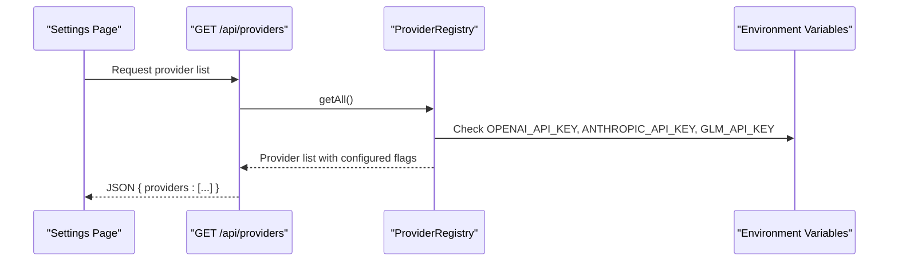
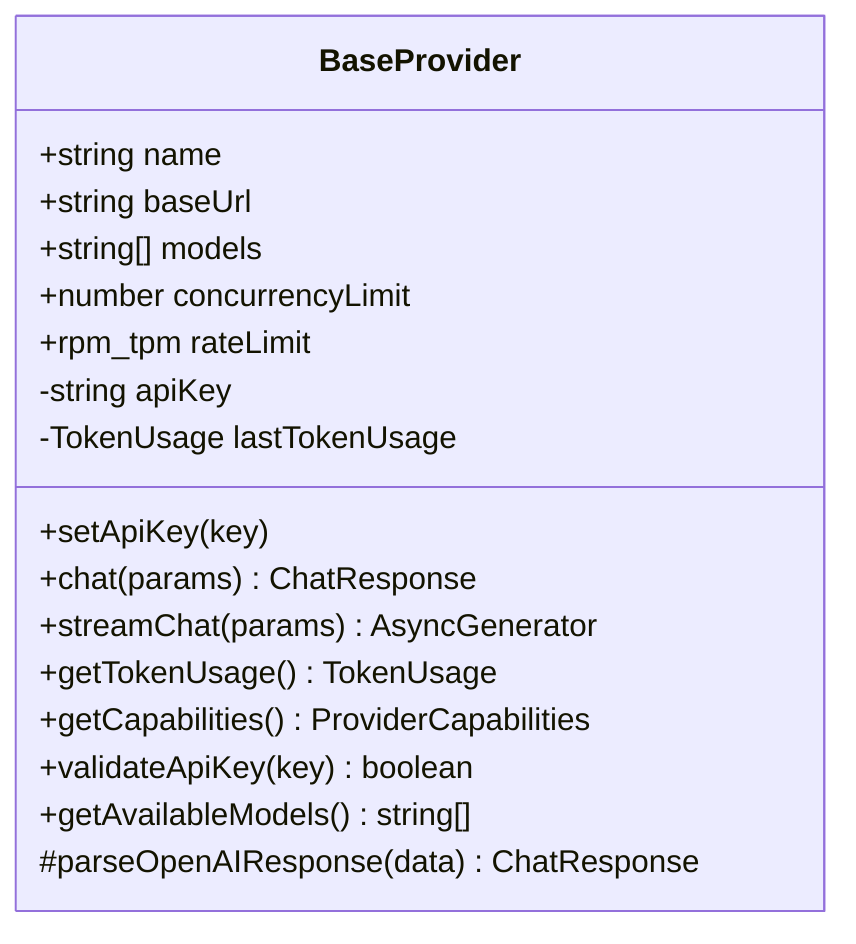
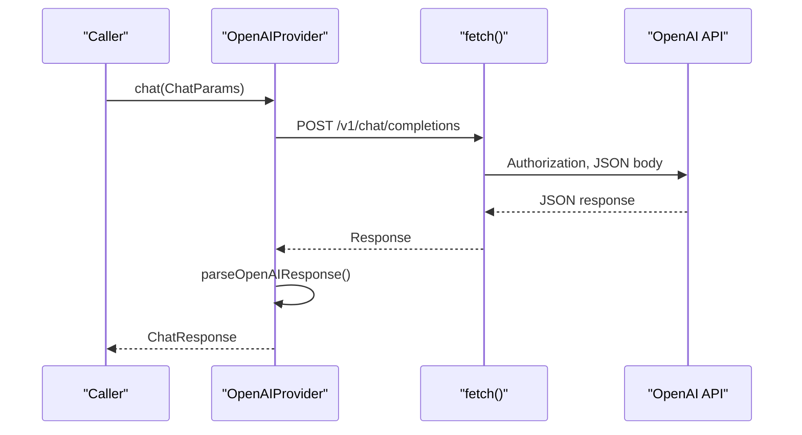
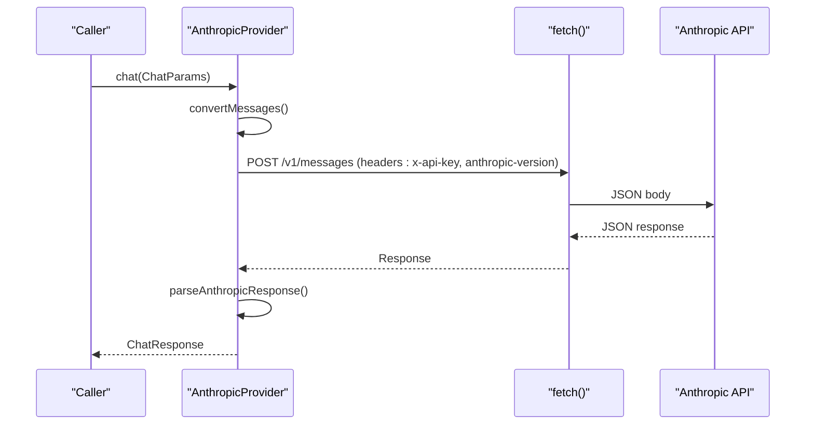
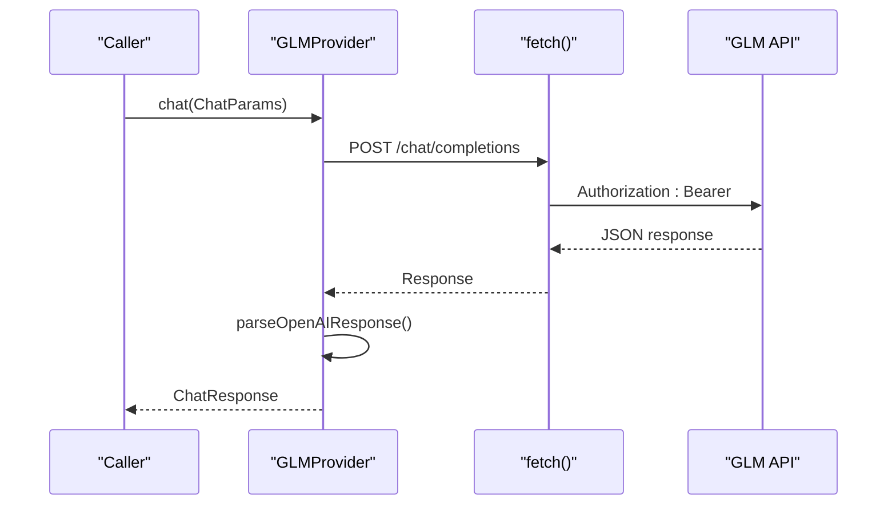
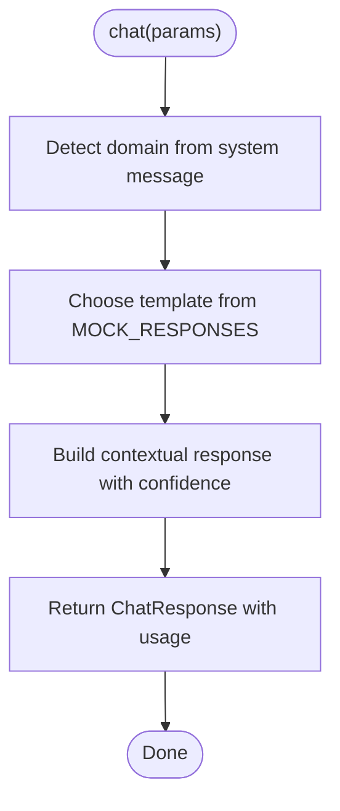
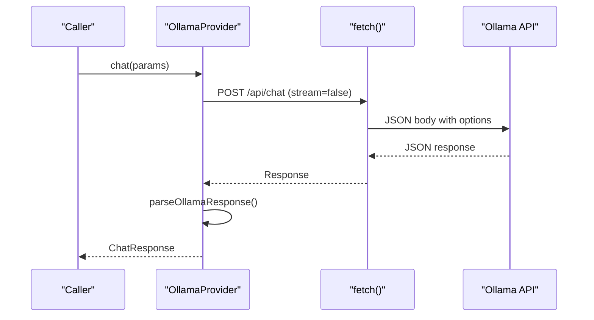
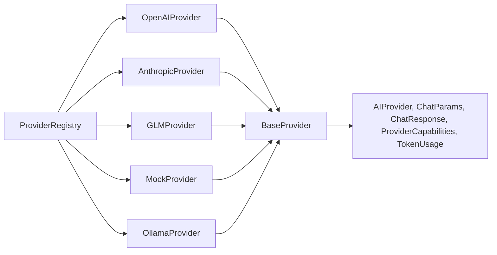

# Specific Provider Implementations

<cite>
**Referenced Files in This Document**
- [base.ts](file://src/core/providers/base.ts)
- [openai.ts](file://src/core/providers/openai.ts)
- [anthropic.ts](file://src/core/providers/anthropic.ts)
- [glm.ts](file://src/core/providers/glm.ts)
- [mock.ts](file://src/core/providers/mock.ts)
- [ollama.ts](file://src/core/providers/ollama.ts)
- [registry.ts](file://src/core/providers/registry.ts)
- [provider.ts](file://src/types/provider.ts)
- [settings-store.ts](file://src/stores/settings-store.ts)
- [route.ts](file://src/app/api/providers/route.ts)
- [errors.ts](file://src/lib/errors.ts)
- [rate-limiter.ts](file://src/core/concurrency/rate-limiter.ts)
</cite>

## Table of Contents
1. [Introduction](#introduction)
2. [Project Structure](#project-structure)
3. [Core Components](#core-components)
4. [Architecture Overview](#architecture-overview)
5. [Detailed Component Analysis](#detailed-component-analysis)
6. [Dependency Analysis](#dependency-analysis)
7. [Performance Considerations](#performance-considerations)
8. [Troubleshooting Guide](#troubleshooting-guide)
9. [Conclusion](#conclusion)

## Introduction
This document provides comprehensive documentation for the AI provider implementations in the project, focusing on OpenAI, Anthropic, GLM, and the mock provider. It explains each provider’s unique characteristics, API parameter mappings, response formatting, and integration specifics. It also covers configuration requirements, authentication methods, rate limiting considerations, error handling patterns, and best practices for each implementation.

## Project Structure
The provider implementations are organized under a shared base class with provider-specific subclasses. A registry manages provider registration and creation, while type definitions define the contract for all providers. The settings store and API route expose provider configuration and availability to the UI.

```mermaid
graph TB
subgraph "Provider Layer"
Base["BaseProvider<br/>abstract"]
OpenAI["OpenAIProvider"]
Anthropic["AnthropicProvider"]
GLM["GLMProvider"]
Mock["MockProvider"]
Ollama["OllamaProvider"]
end
subgraph "Registry"
Registry["ProviderRegistry"]
end
subgraph "Types"
Types["AIProvider, ChatParams, ChatResponse,<br/>ProviderCapabilities, TokenUsage"]
end
Base --> OpenAI
Base --> Anthropic
Base --> GLM
Base --> Mock
Base --> Ollama
Registry --> OpenAI
Registry --> Anthropic
Registry --> GLM
Registry --> Mock
Registry --> Ollama
OpenAI --> Types
Anthropic --> Types
GLM --> Types
Mock --> Types
Ollama --> Types
```

**Diagram sources**
- [base.ts:1-83](file://src/core/providers/base.ts#L1-L83)
- [openai.ts:1-134](file://src/core/providers/openai.ts#L1-L134)
- [anthropic.ts:1-215](file://src/core/providers/anthropic.ts#L1-L215)
- [glm.ts:1-132](file://src/core/providers/glm.ts#L1-L132)
- [mock.ts:1-112](file://src/core/providers/mock.ts#L1-L112)
- [ollama.ts:1-196](file://src/core/providers/ollama.ts#L1-L196)
- [registry.ts:1-83](file://src/core/providers/registry.ts#L1-L83)
- [provider.ts:1-66](file://src/types/provider.ts#L1-L66)

**Section sources**
- [base.ts:1-83](file://src/core/providers/base.ts#L1-L83)
- [registry.ts:1-83](file://src/core/providers/registry.ts#L1-L83)
- [provider.ts:1-66](file://src/types/provider.ts#L1-L66)

## Core Components
- BaseProvider: Defines the common contract and shared behavior for all providers, including API key management, token usage tracking, capability reporting, and a default streaming fallback.
- Provider subclasses: Implement provider-specific logic for chat, streaming, response parsing, and capability reporting.
- Registry: Auto-detects and registers providers based on environment variables and exposes creation and discovery APIs.
- Types: Define the provider interface, chat parameters, response format, capabilities, and token usage.

Key responsibilities:
- Parameter mapping: Each provider maps ChatParams to its native API payload.
- Response formatting: Providers normalize responses to a unified ChatResponse with content, model, and usage.
- Streaming: Providers implement streaming where supported, yielding content chunks.
- Validation: Providers implement API key validation and connectivity checks.

**Section sources**
- [base.ts:1-83](file://src/core/providers/base.ts#L1-L83)
- [provider.ts:1-66](file://src/types/provider.ts#L1-L66)
- [registry.ts:1-83](file://src/core/providers/registry.ts#L1-L83)

## Architecture Overview
The provider architecture follows a base-class pattern with provider-specific subclasses. The registry centralizes provider lifecycle and discovery. The UI integrates with the registry via an API endpoint to present available providers and their configuration status.



**Diagram sources**
- [route.ts:1-24](file://src/app/api/providers/route.ts#L1-L24)
- [registry.ts:1-83](file://src/core/providers/registry.ts#L1-L83)

## Detailed Component Analysis

### BaseProvider
The base class defines the AIProvider contract and shared utilities:
- Contract: name, baseUrl, models, concurrencyLimit, rateLimit, chat, streamChat, validateApiKey, getAvailableModels, getTokenUsage, getCapabilities.
- Utilities: Default streamChat fallback, token usage tracking, OpenAI-style response parsing helper.
- Validation: Tests API key validity by issuing a small request.



**Diagram sources**
- [base.ts:1-83](file://src/core/providers/base.ts#L1-L83)
- [provider.ts:1-66](file://src/types/provider.ts#L1-L66)

**Section sources**
- [base.ts:1-83](file://src/core/providers/base.ts#L1-L83)
- [provider.ts:1-66](file://src/types/provider.ts#L1-L66)

### OpenAIProvider
Capabilities:
- Streaming and tools support.
- Large context window and multimodal support.
- Uses OpenAI’s chat/completions endpoint.

Key behaviors:
- Parameter mapping: model, messages, temperature, max_tokens.
- Streaming: Parses SSE-like data chunks and yields deltas.
- Response parsing: Extracts content and usage from OpenAI’s response format.
- Error handling: Propagates HTTP errors with status and body.
- Timeout: Uses AbortController with a 60-second timeout for non-streaming and 120 seconds for streaming.



**Diagram sources**
- [openai.ts:26-62](file://src/core/providers/openai.ts#L26-L62)
- [base.ts:58-81](file://src/core/providers/base.ts#L58-L81)

**Section sources**
- [openai.ts:1-134](file://src/core/providers/openai.ts#L1-L134)
- [base.ts:58-81](file://src/core/providers/base.ts#L58-L81)

### AnthropicProvider
Capabilities:
- Streaming and tools support.
- Large context window and multimodal support.
- Uses Anthropic’s messages endpoint.

Key behaviors:
- Message conversion: Converts ChatMessage to Anthropic’s expected format, ensuring the first message is a user message.
- Parameter mapping: model, messages, max_tokens, temperature, optional system.
- Streaming: Parses event lines and yields delta text; tracks token usage from message_start and message_delta events.
- Response parsing: Aggregates text blocks and usage from Anthropic’s response.
- Error handling: Propagates HTTP errors with status and body.
- Headers: Uses x-api-key and anthropic-version.



**Diagram sources**
- [anthropic.ts:51-92](file://src/core/providers/anthropic.ts#L51-L92)
- [anthropic.ts:188-213](file://src/core/providers/anthropic.ts#L188-L213)

**Section sources**
- [anthropic.ts:1-215](file://src/core/providers/anthropic.ts#L1-L215)

### GLMProvider
Capabilities:
- Streaming support.
- Single model list; tools not supported.
- Uses OpenAI-compatible chat/completions endpoint.

Key behaviors:
- Parameter mapping: model, messages, temperature, max_tokens.
- Streaming: Parses SSE-like data chunks and yields deltas.
- Response parsing: Reuses the base OpenAI-style parser.
- Environment: Reads GLM_API_KEY and GLM_BASE_URL.
- Error handling: Propagates HTTP errors with status and body.



**Diagram sources**
- [glm.ts:26-62](file://src/core/providers/glm.ts#L26-L62)
- [base.ts:58-81](file://src/core/providers/base.ts#L58-L81)

**Section sources**
- [glm.ts:1-132](file://src/core/providers/glm.ts#L1-L132)

### MockProvider
Capabilities:
- Streaming support.
- No tools.
- Simulates responses based on system message domains.

Key behaviors:
- Domain detection: Chooses a response template based on keywords in the system message.
- Response generation: Adds a confidence level and contextual framing.
- Token usage: Randomized usage values.
- Streaming: Emits words with randomized delays.
- Validation: Always returns true.



**Diagram sources**
- [mock.ts:49-97](file://src/core/providers/mock.ts#L49-L97)

**Section sources**
- [mock.ts:1-112](file://src/core/providers/mock.ts#L1-L112)

### OllamaProvider
Capabilities:
- Streaming support.
- Local inference; no tools.
- Auto-detects available models via /api/tags.

Key behaviors:
- Parameter mapping: model, messages, stream=false for non-streaming; stream=true for streaming; options include temperature and num_predict.
- Streaming: Parses JSON lines and yields message content; tracks usage from final eval_count and prompt_eval_count.
- Connectivity: Validates by checking /api/tags endpoint.
- Environment: Uses OLLAMA_BASE_URL; no API key required.



**Diagram sources**
- [ollama.ts:49-85](file://src/core/providers/ollama.ts#L49-L85)
- [ollama.ts:178-194](file://src/core/providers/ollama.ts#L178-L194)

**Section sources**
- [ollama.ts:1-196](file://src/core/providers/ollama.ts#L1-L196)

## Dependency Analysis
Provider dependencies and relationships:
- All providers depend on BaseProvider and the AIProvider contract.
- Registry depends on each provider class and environment variables for auto-detection.
- UI integrates with the registry via an API endpoint to discover providers and their configuration status.



**Diagram sources**
- [registry.ts:1-83](file://src/core/providers/registry.ts#L1-L83)
- [base.ts:1-83](file://src/core/providers/base.ts#L1-L83)
- [provider.ts:1-66](file://src/types/provider.ts#L1-L66)

**Section sources**
- [registry.ts:1-83](file://src/core/providers/registry.ts#L1-L83)
- [provider.ts:1-66](file://src/types/provider.ts#L1-L66)

## Performance Considerations
- Concurrency limits: Each provider defines a concurrencyLimit to cap simultaneous requests.
- Rate limits: Providers declare rpm and tpm limits; use the retry utility for exponential backoff with jitter.
- Timeouts: Providers use AbortController timeouts for long-running requests.
- Streaming: Prefer streaming for responsive UX; handle malformed chunks gracefully.
- Local vs remote: Ollama is local and effectively unlimited; remote providers require careful rate limiting and retries.

Best practices:
- Use withRetry for transient failures; avoid retrying authentication errors.
- Monitor token usage via getTokenUsage to manage budgets.
- Configure provider-specific timeouts and limits according to provider capabilities.

**Section sources**
- [base.ts:1-83](file://src/core/providers/base.ts#L1-L83)
- [openai.ts:26-62](file://src/core/providers/openai.ts#L26-L62)
- [anthropic.ts:51-92](file://src/core/providers/anthropic.ts#L51-L92)
- [glm.ts:26-62](file://src/core/providers/glm.ts#L26-L62)
- [ollama.ts:49-85](file://src/core/providers/ollama.ts#L49-L85)
- [rate-limiter.ts:1-40](file://src/core/concurrency/rate-limiter.ts#L1-L40)

## Troubleshooting Guide
Common issues and resolutions:
- Authentication failures: Ensure API keys are set in environment variables and validated via validateApiKey.
- Network timeouts: Adjust timeouts and enable retries with exponential backoff.
- Rate limiting: Respect provider rpm and tpm limits; implement queueing or throttling.
- Streaming errors: Handle malformed JSON chunks and missing response bodies; ensure AbortController is used.
- Provider not detected: Verify environment variables; check registry auto-detection logic.
- Local provider connectivity: For Ollama, confirm the base URL and that the service is running.

Error taxonomy:
- AppError, NetworkError, TimeoutError, ValidationError, ModelError, BudgetError, RateLimitError, AuthenticationError.

**Section sources**
- [errors.ts:1-78](file://src/lib/errors.ts#L1-L78)
- [openai.ts:48-55](file://src/core/providers/openai.ts#L48-L55)
- [anthropic.ts:78-85](file://src/core/providers/anthropic.ts#L78-L85)
- [glm.ts:48-55](file://src/core/providers/glm.ts#L48-L55)
- [ollama.ts:71-78](file://src/core/providers/ollama.ts#L71-L78)
- [mock.ts:108-110](file://src/core/providers/mock.ts#L108-L110)

## Conclusion
The provider implementations share a consistent contract and base utilities while adapting to provider-specific APIs, parameters, and response formats. The registry simplifies provider discovery and configuration, while the UI surfaces provider availability and configuration status. By following the documented patterns for parameter mapping, response formatting, streaming, validation, and error handling, developers can integrate and troubleshoot providers effectively.