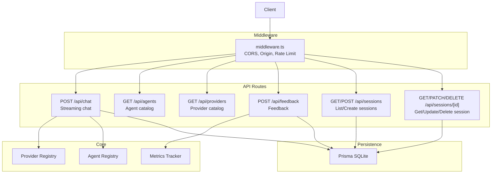
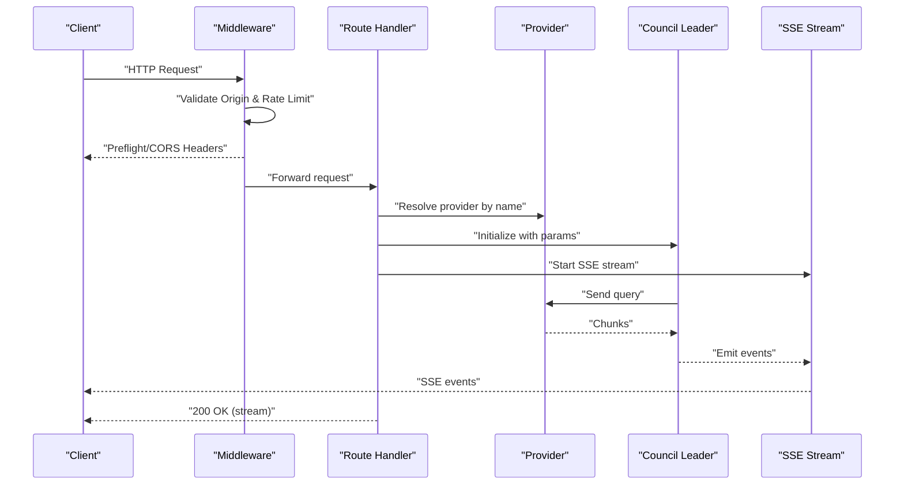
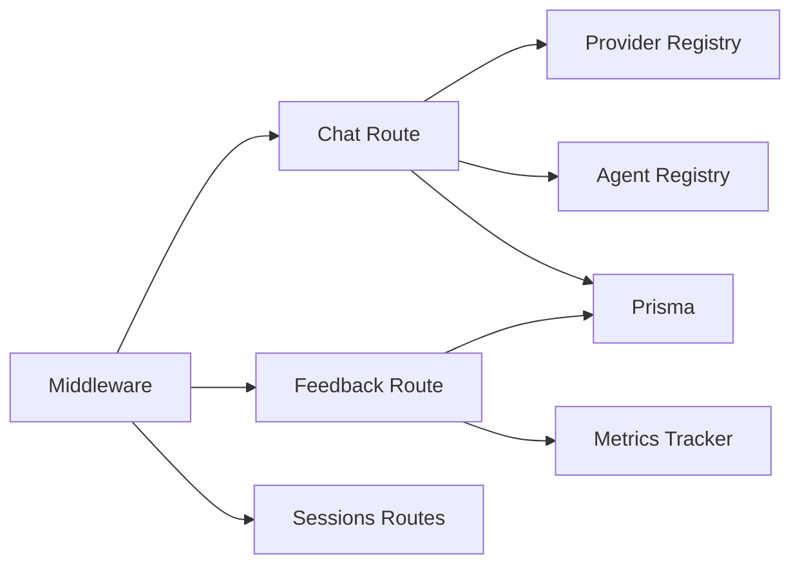

# API Reference

<cite>
**Referenced Files in This Document**
- [route.ts](file://src/app/api/chat/route.ts)
- [route.ts](file://src/app/api/sessions/route.ts)
- [[id]/route.ts](file://src/app/api/sessions/[id]/route.ts)
- [route.ts](file://src/app/api/agents/route.ts)
- [route.ts](file://src/app/api/providers/route.ts)
- [route.ts](file://src/app/api/feedback/route.ts)
- [sse.ts](file://src/types/sse.ts)
- [index.ts](file://src/types/index.ts)
- [middleware.ts](file://src/middleware.ts)
- [schema.prisma](file://prisma/schema.prisma)
- [registry.ts](file://src/core/providers/registry.ts)
- [metrics.ts](file://src/lib/metrics.ts)
- [errors.ts](file://src/lib/errors.ts)
- [package.json](file://package.json)
</cite>

## Table of Contents
1. [Introduction](#introduction)
2. [Project Structure](#project-structure)
3. [Core Components](#core-components)
4. [Architecture Overview](#architecture-overview)
5. [Detailed Component Analysis](#detailed-component-analysis)
6. [Dependency Analysis](#dependency-analysis)
7. [Performance Considerations](#performance-considerations)
8. [Troubleshooting Guide](#troubleshooting-guide)
9. [Conclusion](#conclusion)
10. [Appendices](#appendices)

## Introduction
This document provides a comprehensive API reference for the Deep Thinking AI system. It covers public endpoints for:
- Chat streaming via Server-Sent Events (SSE)
- Session management (list, create, retrieve, update, delete)
- Agent information discovery
- Provider configuration and availability
- Feedback collection

It also documents request/response schemas, parameter validation, rate limiting, security considerations, and client integration patterns. API versioning, backward compatibility, and deprecation policies are addressed where applicable.

## Project Structure
The API surface is implemented as Next.js App Router API routes under src/app/api. Middleware enforces CORS, origin validation, and rate limiting. Data persistence uses Prisma with SQLite. Providers and agents are registered dynamically at runtime.

**Diagram sources**
- [route.ts:88-222](file://src/app/api/chat/route.ts#L88-L222)
- [route.ts:1-25](file://src/app/api/agents/route.ts#L1-L25)
- [route.ts:1-25](file://src/app/api/providers/route.ts#L1-L25)
- [route.ts:1-26](file://src/app/api/feedback/route.ts#L1-L26)
- [route.ts:1-91](file://src/app/api/sessions/route.ts#L1-L91)
- [[id]/route.ts](file://src/app/api/sessions/[id]/route.ts#L1-L119)
- [middleware.ts:166-211](file://src/middleware.ts#L166-L211)
- [registry.ts:1-83](file://src/core/providers/registry.ts#L1-L83)
- [metrics.ts:1-225](file://src/lib/metrics.ts#L1-L225)
- [schema.prisma:10-48](file://prisma/schema.prisma#L10-L48)

**Section sources**
- [route.ts:1-222](file://src/app/api/chat/route.ts#L1-L222)
- [route.ts:1-91](file://src/app/api/sessions/route.ts#L1-L91)
- [[id]/route.ts](file://src/app/api/sessions/[id]/route.ts#L1-L119)
- [route.ts:1-25](file://src/app/api/agents/route.ts#L1-L25)
- [route.ts:1-25](file://src/app/api/providers/route.ts#L1-L25)
- [route.ts:1-26](file://src/app/api/feedback/route.ts#L1-L26)
- [middleware.ts:166-211](file://src/middleware.ts#L166-L211)
- [schema.prisma:10-48](file://prisma/schema.prisma#L10-L48)

## Core Components
- Chat API: Accepts a structured request, validates and sanitizes input, detects prompt injection, selects a provider, orchestrates reasoning agents, and streams events via SSE.
- Sessions API: Manages session lifecycle with pagination, filtering, and partial updates.
- Agents API: Returns agent catalog with sensitive fields excluded.
- Providers API: Returns configured providers and their models.
- Feedback API: Records user feedback for agent performance.

**Section sources**
- [route.ts:88-222](file://src/app/api/chat/route.ts#L88-L222)
- [route.ts:1-91](file://src/app/api/sessions/route.ts#L1-L91)
- [[id]/route.ts](file://src/app/api/sessions/[id]/route.ts#L1-L119)
- [route.ts:1-25](file://src/app/api/agents/route.ts#L1-L25)
- [route.ts:1-25](file://src/app/api/providers/route.ts#L1-L25)
- [route.ts:1-26](file://src/app/api/feedback/route.ts#L1-L26)

## Architecture Overview
The API follows a layered architecture:
- Transport: Next.js App Router routes
- Security: Middleware handles CORS, origin validation, and rate limiting
- Orchestration: Chat route builds a provider and leader to coordinate agents
- Persistence: Prisma ORM with SQLite
- Observability: Metrics tracking for feedback and agent performance

**Diagram sources**
- [route.ts:88-222](file://src/app/api/chat/route.ts#L88-L222)
- [middleware.ts:166-211](file://src/middleware.ts#L166-L211)
- [registry.ts:55-83](file://src/core/providers/registry.ts#L55-L83)

## Detailed Component Analysis

### Chat API
- Endpoint: POST /api/chat
- Purpose: Submit a query to the reasoning council and receive a streaming response via SSE.
- Authentication: Not enforced by the route; relies on middleware for origin and rate limiting.
- Authorization: Not enforced by the route; ensure appropriate controls at deployment level.

Request
- Content-Type: application/json
- Body fields:
  - query: string (required)
  - provider: string (optional; default: "glm")
  - model: string (optional; defaults to environment)
  - maxAgents: number (1–20; default: 7)
  - concurrencyLimit: number (1–10; default: 3)
  - iacpEnabled: boolean (optional; default: true)
  - ollamaBaseUrl: string (optional; used when provider is "ollama")

Validation and Safety
- JSON parsing errors return 400 with JSON error payload.
- query must be a non-empty string and under a maximum length; otherwise 400.
- Control characters are sanitized; empty queries after sanitization return 400.
- Prompt injection patterns are detected; flagged queries return 400.
- Numeric parameters are clamped to safe ranges.

Provider Resolution
- Supported provider names: "glm", "openai", "anthropic", "ollama", "mock".
- API keys are resolved server-side from environment variables; client-provided keys are ignored.
- For "ollama", a base URL can be supplied via request body.

Streaming Response (SSE)
- Content-Type: text/event-stream
- Headers include cache control and buffering hints.
- Event types include lifecycle and progress events.

SSE Event Types
- "council:start"
- "council:analysis"
- "council:selecting"
- "agent:activated"
- "agent:thinking"
- "agent:thought"
- "agent:branch"
- "agent:verification"
- "agent:error"
- "iacp:message"
- "council:synthesizing"
- "council:synthesis_progress"
- "council:budget_warning"
- "council:complete"
- "council:cache_hit"
- "council:clarification_needed"
- "council:error"

Response Format
- Each event is formatted as an SSE line-delimited record with type and data.
- The final "council:complete" event includes summary statistics and optional token usage.

Error Handling
- Route-level errors emit "council:error" with an error message.
- Validation failures return 400 with JSON payload.
- Internal errors return 500 with JSON payload.

Example Requests and Responses
- Request: POST /api/chat with a JSON body containing query and optional provider/model parameters.
- Response: Server starts streaming SSE events; client consumes until completion.

Client Implementation Guidelines
- Use a robust SSE client capable of handling reconnects and partial messages.
- Respect rate limits and handle 429 responses.
- Handle "council:error" and "agent:error" events to surface issues to users.

Integration Patterns
- Progressive rendering: render "agent:thought" and "council:synthesis_progress" events incrementally.
- Early termination: stop listening upon receiving "council:complete" or "council:error".

Security Considerations
- Origin validation and CORS are enforced by middleware.
- Rate limiting is applied per IP address.
- Prompt injection detection reduces misuse risk.

API Versioning and Compatibility
- The project version is 0.1.0. No explicit API versioning headers are present; treat endpoints as v0.1.x.
- Backward compatibility is not explicitly documented; monitor for breaking changes in future releases.

**Section sources**
- [route.ts:88-222](file://src/app/api/chat/route.ts#L88-L222)
- [sse.ts:6-112](file://src/types/sse.ts#L6-L112)
- [middleware.ts:166-211](file://src/middleware.ts#L166-L211)
- [package.json:2-4](file://package.json#L2-L4)

### Sessions API
Endpoints
- GET /api/sessions
  - Query parameters: page (default: 1), limit (default: 20, max: 100), search (optional)
  - Response: { sessions: Session[], total: number, page: number, limit: number }
- POST /api/sessions
  - Request body: { query: string, settings?: any }
  - Response: Created Session object with 201
- DELETE /api/sessions
  - Request body: { ids: string[] }
  - Response: { deleted: number }

Per-ID Endpoints
- GET /api/sessions/[id]
  - Response: Session with messages and agentMetrics included; 404 if not found
- PATCH /api/sessions/[id]
  - Allowed fields: status, response, tokenUsage
  - Response: Updated Session
- DELETE /api/sessions/[id]
  - Response: { deleted: true }; 404 if not found

Data Model
- Session: id, query, response?, status, settings?, tokenUsage, createdAt, updatedAt
- Message: id, sessionId, role, content, agentId?, agentName?, metadata?, createdAt
- AgentMetric: id, sessionId, agentId, agentName, domain, responseTime, tokenCount, qualityScore?, relevanceScore?, wasUseful?, createdAt

Pagination and Filtering
- Pagination uses skip/take with page and limit.
- Optional text search filters sessions by query substring.

Validation
- Missing or invalid fields return 400 with JSON error payload.
- Not found errors return 404 with JSON error payload.
- General failures return 500 with JSON error payload.

**Section sources**
- [route.ts:1-91](file://src/app/api/sessions/route.ts#L1-L91)
- [[id]/route.ts](file://src/app/api/sessions/[id]/route.ts#L1-L119)
- [schema.prisma:10-48](file://prisma/schema.prisma#L10-L48)

### Agents API
Endpoint
- GET /api/agents?domain={domain}
  - Query parameter: domain (optional)
  - Response: { agents: AgentPublic[], total: number, domains: AgentDomain[] }

Behavior
- Returns all agents or filters by domain.
- Strips sensitive fields (e.g., systemPrompt) from responses.

**Section sources**
- [route.ts:1-25](file://src/app/api/agents/route.ts#L1-L25)

### Providers API
Endpoint
- GET /api/providers
  - Response: { providers: { name: string, models: string[], configured: boolean }[] }

Behavior
- Lists all registered providers and whether they are configured (based on environment variables).
- Provider names considered: "glm", "openai", "anthropic"; "ollama" is always registered but may fail gracefully.

**Section sources**
- [route.ts:1-25](file://src/app/api/providers/route.ts#L1-L25)
- [registry.ts:1-83](file://src/core/providers/registry.ts#L1-L83)

### Feedback API
Endpoint
- POST /api/feedback
  - Request body: { sessionId: string, agentId: string, wasUseful: boolean }
  - Response: { ok: true }

Behavior
- Validates presence and types of required fields.
- Records feedback via metrics tracker; updates agent metrics accordingly.
- On failure, returns 500 with JSON error payload.

**Section sources**
- [route.ts:1-26](file://src/app/api/feedback/route.ts#L1-L26)
- [metrics.ts:134-159](file://src/lib/metrics.ts#L134-L159)

## Dependency Analysis
- Chat route depends on provider registry, agent registry, and Prisma for persistence.
- Middleware applies global CORS, origin checks, and rate limiting.
- Feedback and metrics integrate with Prisma for storage and scoring.

**Diagram sources**
- [route.ts:1-82](file://src/app/api/chat/route.ts#L1-L82)
- [registry.ts:1-83](file://src/core/providers/registry.ts#L1-L83)
- [metrics.ts:1-225](file://src/lib/metrics.ts#L1-L225)
- [middleware.ts:166-211](file://src/middleware.ts#L166-L211)
- [route.ts:1-91](file://src/app/api/sessions/route.ts#L1-L91)

**Section sources**
- [route.ts:1-82](file://src/app/api/chat/route.ts#L1-L82)
- [registry.ts:1-83](file://src/core/providers/registry.ts#L1-L83)
- [metrics.ts:1-225](file://src/lib/metrics.ts#L1-L225)
- [middleware.ts:166-211](file://src/middleware.ts#L166-L211)
- [route.ts:1-91](file://src/app/api/sessions/route.ts#L1-L91)

## Performance Considerations
- Rate limiting: 100 requests per minute per IP; clients should retry after the indicated interval.
- Concurrency: maxAgents and concurrencyLimit bound parallelism; tune for provider capacity.
- Streaming: Use efficient SSE consumption to minimize latency and memory usage.
- Database: Pagination and indexing are used; avoid excessive page sizes.

[No sources needed since this section provides general guidance]

## Troubleshooting Guide
Common Issues and Resolutions
- 400 Bad Request
  - Invalid JSON body or missing/invalid fields in requests.
  - Prompt injection flagged queries.
- 401 Unauthorized
  - Not enforced by routes; ensure deployment enforces auth.
- 403 Forbidden
  - Origin not allowed by middleware configuration.
- 404 Not Found
  - Session ID not found during GET/PATCH/DELETE.
- 429 Too Many Requests
  - Exceeded rate limit; observe Retry-After and reduce request frequency.
- 5xx Server Errors
  - Provider failures or internal errors; inspect logs and retry with exponential backoff.

Error Classes
- Application-level errors are modeled as typed errors for consistent handling.

**Section sources**
- [route.ts:90-95](file://src/app/api/chat/route.ts#L90-L95)
- [route.ts:114-138](file://src/app/api/chat/route.ts#L114-L138)
- [middleware.ts:177-182](file://src/middleware.ts#L177-L182)
- [middleware.ts:188-199](file://src/middleware.ts#L188-L199)
- [errors.ts:1-79](file://src/lib/errors.ts#L1-L79)

## Conclusion
The Deep Thinking AI API exposes a streaming chat endpoint, a session lifecycle API, agent and provider catalogs, and a feedback mechanism. Middleware ensures secure transport and fair usage. Clients should implement robust SSE handling, respect rate limits, and manage graceful retries. Future versions should consider explicit API versioning and deprecation policies.

[No sources needed since this section summarizes without analyzing specific files]

## Appendices

### Request/Response Schemas

- POST /api/chat
  - Request: { query: string, provider?: string, model?: string, maxAgents?: number, concurrencyLimit?: number, iacpEnabled?: boolean, ollamaBaseUrl?: string }
  - Response: text/event-stream with SSE events

- GET /api/sessions
  - Query: page?: number, limit?: number, search?: string
  - Response: { sessions: Session[], total: number, page: number, limit: number }

- POST /api/sessions
  - Request: { query: string, settings?: any }
  - Response: Session

- DELETE /api/sessions
  - Request: { ids: string[] }
  - Response: { deleted: number }

- GET /api/sessions/[id]
  - Response: Session

- PATCH /api/sessions/[id]
  - Request: { status?: string, response?: string, tokenUsage?: number }
  - Response: Session

- DELETE /api/sessions/[id]
  - Response: { deleted: true }

- GET /api/agents?domain={domain}
  - Response: { agents: AgentPublic[], total: number, domains: AgentDomain[] }

- GET /api/providers
  - Response: { providers: { name: string, models: string[], configured: boolean }[] }

- POST /api/feedback
  - Request: { sessionId: string, agentId: string, wasUseful: boolean }
  - Response: { ok: true }

**Section sources**
- [route.ts:88-222](file://src/app/api/chat/route.ts#L88-L222)
- [route.ts:1-91](file://src/app/api/sessions/route.ts#L1-L91)
- [[id]/route.ts](file://src/app/api/sessions/[id]/route.ts#L1-L119)
- [route.ts:1-25](file://src/app/api/agents/route.ts#L1-L25)
- [route.ts:1-25](file://src/app/api/providers/route.ts#L1-L25)
- [route.ts:1-26](file://src/app/api/feedback/route.ts#L1-L26)

### SSE Event Data Types
- "council:start": { sessionId: string, query: string }
- "council:analysis": { analysis: QueryAnalysis }
- "council:selecting": { selection: AgentSelection }
- "agent:activated": { agentId: string, agentName: string, domain: AgentDomain, role: string, batchIndex: number }
- "agent:thinking": { agentId: string, branch?: number, totalBranches?: number }
- "agent:thought": { agentId: string, thought: string, confidence: "HIGH"|"MEDIUM"|"LOW", processingTime: number, branches?: number, selectedBranch?: number }
- "agent:branch": { agentId: string, branch: number, thought: string, confidence: number }
- "agent:verification": { agentId: string, targetAgentId: string, claim: string, score: number, status: VerificationStatus, issues: string[], round: number }
- "agent:error": { agentId: string, error: string }
- "iacp:message": { message: IACPMessage }
- "council:synthesizing": { agentCount: number, reason?: string }
- "council:synthesis_progress": { phase: "early"|"developing"|"complete", content: string, agentsProcessed: number, totalAgents: number, consensusScore?: number }
- "council:budget_warning": { warning: string, percentUsed: number, remaining: number }
- "council:complete": { response: string, totalTime: number, agentsActivated: number, agentsSucceeded: number, totalTokens: number, tokenUsage?: { total: TokenUsage, byAgent: Record<string, TokenUsage>, remaining: number, percentUsed: number } }
- "council:cache_hit": { query: string, response: string, cachedAt: number }
- "council:clarification_needed": { suggestions: string[], reasons: string[], complexity: string }
- "council:error": { error: string }

**Section sources**
- [sse.ts:6-112](file://src/types/sse.ts#L6-L112)

### Security and Rate Limiting
- CORS and Origin Validation: Enforced by middleware; configure allowed origins via environment variable.
- Rate Limiting: Sliding window (100/minute); returns 429 with Retry-After and X-RateLimit headers.
- Content Security Policy: Applied by middleware to mitigate common web vulnerabilities.

**Section sources**
- [middleware.ts:11-211](file://src/middleware.ts#L11-L211)

### Data Models
- Session: id, query, response?, status, settings?, tokenUsage, createdAt, updatedAt
- Message: id, sessionId, role, content, agentId?, agentName?, metadata?, createdAt
- AgentMetric: id, sessionId, agentId, agentName, domain, responseTime, tokenCount, qualityScore?, relevanceScore?, wasUseful?, createdAt

**Section sources**
- [schema.prisma:10-48](file://prisma/schema.prisma#L10-L48)