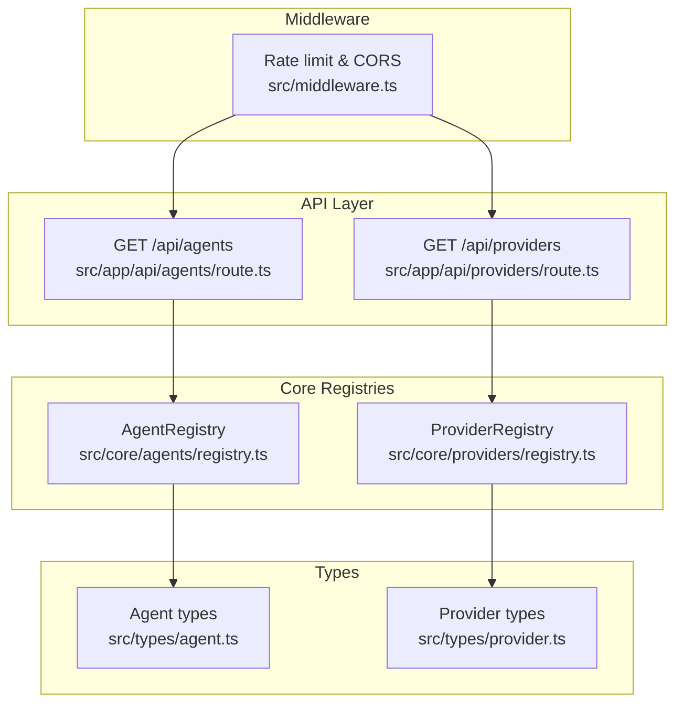
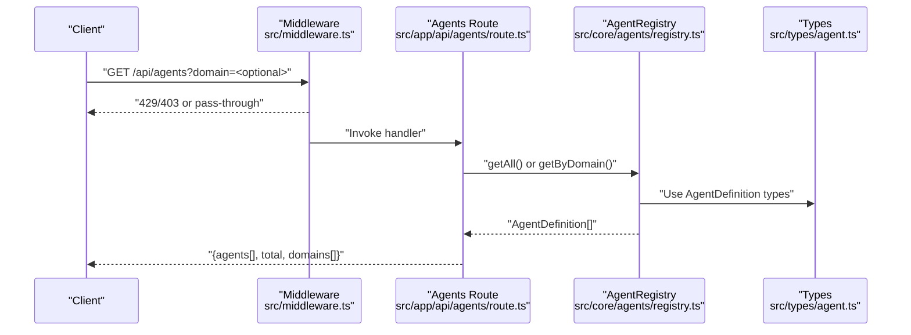
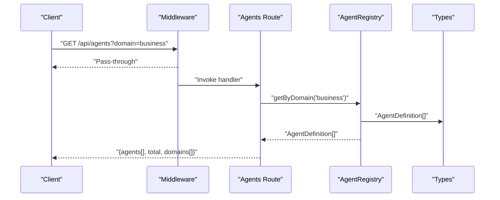
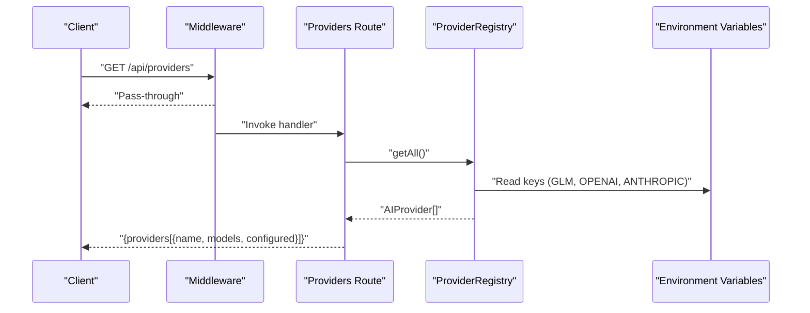
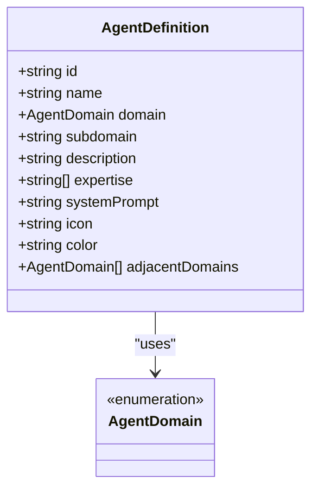
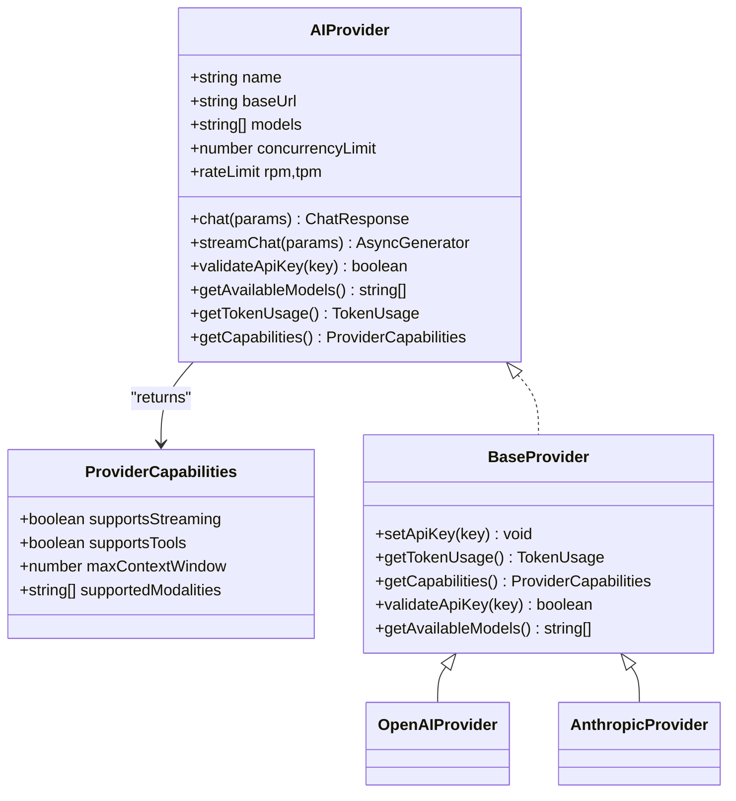
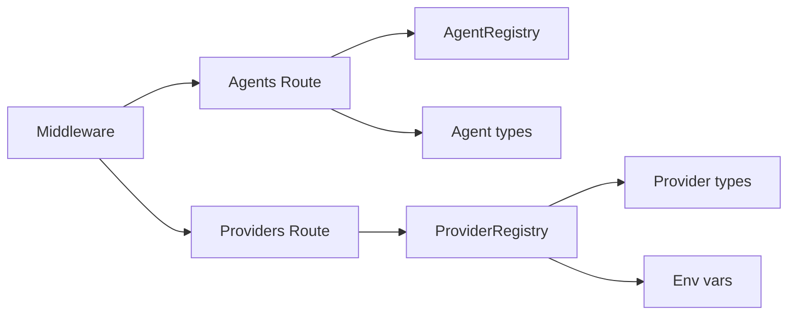

# Agent and Provider API

<cite>
**Referenced Files in This Document**
- [route.ts](file://src/app/api/agents/route.ts)
- [route.ts](file://src/app/api/providers/route.ts)
- [registry.ts](file://src/core/agents/registry.ts)
- [registry.ts](file://src/core/providers/registry.ts)
- [agent.ts](file://src/types/agent.ts)
- [provider.ts](file://src/types/provider.ts)
- [middleware.ts](file://src/middleware.ts)
- [cache.ts](file://src/lib/cache.ts)
- [base.ts](file://src/core/providers/base.ts)
- [openai.ts](file://src/core/providers/openai.ts)
- [anthropic.ts](file://src/core/providers/anthropic.ts)
- [index.ts](file://src/core/agents/definitions/index.ts)
- [business.ts](file://src/core/agents/definitions/business.ts)
- [technology.ts](file://src/core/agents/definitions/technology.ts)
</cite>

## Table of Contents
1. [Introduction](#introduction)
2. [Project Structure](#project-structure)
3. [Core Components](#core-components)
4. [Architecture Overview](#architecture-overview)
5. [Detailed Component Analysis](#detailed-component-analysis)
6. [Dependency Analysis](#dependency-analysis)
7. [Performance Considerations](#performance-considerations)
8. [Troubleshooting Guide](#troubleshooting-guide)
9. [Conclusion](#conclusion)

## Introduction
This document provides comprehensive API documentation for the agent and provider information endpoints. It explains:
- GET /api/agents: retrieves agent registry information including agent definitions, capabilities, and availability.
- GET /api/providers: retrieves provider configuration details, supported models, and authentication settings.

It also covers request parameters, response schemas, caching strategies, rate limiting considerations, and client integration patterns for dynamic agent selection and provider management.

## Project Structure
The API endpoints are implemented as Next.js App Router handlers under src/app/api. They delegate to core registries and types to assemble responses. Middleware enforces rate limits and CORS/CSP policies for API routes.

**Diagram sources**
- [route.ts:1-25](file://src/app/api/agents/route.ts#L1-L25)
- [route.ts:1-25](file://src/app/api/providers/route.ts#L1-L25)
- [registry.ts:1-58](file://src/core/agents/registry.ts#L1-L58)
- [registry.ts:1-83](file://src/core/providers/registry.ts#L1-L83)
- [agent.ts:1-57](file://src/types/agent.ts#L1-L57)
- [provider.ts:1-66](file://src/types/provider.ts#L1-L66)
- [middleware.ts:1-217](file://src/middleware.ts#L1-L217)

**Section sources**
- [route.ts:1-25](file://src/app/api/agents/route.ts#L1-L25)
- [route.ts:1-25](file://src/app/api/providers/route.ts#L1-L25)
- [registry.ts:1-58](file://src/core/agents/registry.ts#L1-L58)
- [registry.ts:1-83](file://src/core/providers/registry.ts#L1-L83)
- [agent.ts:1-57](file://src/types/agent.ts#L1-L57)
- [provider.ts:1-66](file://src/types/provider.ts#L1-L66)
- [middleware.ts:1-217](file://src/middleware.ts#L1-L217)

## Core Components
- Agent Registry: Loads and indexes agent definitions by domain, supports retrieval by ID/domain, always-active agents, search, and domain enumeration.
- Provider Registry: Auto-detects providers from environment variables, exposes registration and creation utilities, and enumerates providers.
- Types: Define AgentDefinition, AgentDomain, AIProvider, ProviderCapabilities, and related interfaces.
- Middleware: Applies rate limiting, origin validation, CORS, and CSP headers to API routes.

**Section sources**
- [registry.ts:1-58](file://src/core/agents/registry.ts#L1-L58)
- [registry.ts:1-83](file://src/core/providers/registry.ts#L1-L83)
- [agent.ts:1-57](file://src/types/agent.ts#L1-L57)
- [provider.ts:1-66](file://src/types/provider.ts#L1-L66)
- [middleware.ts:1-217](file://src/middleware.ts#L1-L217)

## Architecture Overview
The API endpoints are thin handlers that:
- Parse query parameters (domain filter for agents).
- Query registries for data.
- Transform responses to exclude sensitive fields and expose only public information.
- Return structured JSON responses with metadata such as total counts and domains.

**Diagram sources**
- [route.ts:1-25](file://src/app/api/agents/route.ts#L1-L25)
- [registry.ts:1-58](file://src/core/agents/registry.ts#L1-L58)
- [agent.ts:1-57](file://src/types/agent.ts#L1-L57)
- [middleware.ts:166-211](file://src/middleware.ts#L166-L211)

**Section sources**
- [route.ts:1-25](file://src/app/api/agents/route.ts#L1-L25)
- [registry.ts:1-58](file://src/core/agents/registry.ts#L1-L58)
- [agent.ts:1-57](file://src/types/agent.ts#L1-L57)
- [middleware.ts:166-211](file://src/middleware.ts#L166-L211)

## Detailed Component Analysis

### GET /api/agents
- Purpose: Retrieve agent registry information.
- Request
  - Method: GET
  - Path: /api/agents
  - Query parameters:
    - domain: Optional. Filters agents by AgentDomain.
- Processing logic:
  - Reads domain from query parameters.
  - Calls agentRegistry.getByDomain(domain) if domain is provided; otherwise agentRegistry.getAll().
  - Strips systemPrompt from each agent definition to produce a public payload.
  - Returns an object containing agents array, total count, and domains list.
- Response schema:
  - agents: Array of AgentDefinition without systemPrompt.
  - total: Number of returned agents.
  - domains: Array of AgentDomain strings.
- Example usage:
  - List all agents: GET /api/agents
  - Filter by domain: GET /api/agents?domain=business
- Notes:
  - The handler does not implement caching or rate limiting internally; middleware applies global policy.

**Diagram sources**
- [route.ts:4-23](file://src/app/api/agents/route.ts#L4-L23)
- [registry.ts:25-27](file://src/core/agents/registry.ts#L25-L27)
- [agent.ts:25-36](file://src/types/agent.ts#L25-L36)

**Section sources**
- [route.ts:1-25](file://src/app/api/agents/route.ts#L1-L25)
- [registry.ts:17-50](file://src/core/agents/registry.ts#L17-L50)
- [agent.ts:1-57](file://src/types/agent.ts#L1-L57)

### GET /api/providers
- Purpose: Retrieve provider configuration details, supported models, and authentication readiness.
- Request
  - Method: GET
  - Path: /api/providers
- Processing logic:
  - Queries providerRegistry.getAll() to enumerate providers.
  - Maps each provider to a simplified shape: name, models, configured.
  - configured is derived from environment variables:
    - GLM: GLM_API_KEY
    - OpenAI: OPENAI_API_KEY
    - Anthropic: ANTHROPIC_API_KEY
- Response schema:
  - providers: Array of provider summaries with fields:
    - name: string
    - models: string[]
    - configured: boolean
- Example usage:
  - GET /api/providers

**Diagram sources**
- [route.ts:1-24](file://src/app/api/providers/route.ts#L1-L24)
- [registry.ts:19-37](file://src/core/providers/registry.ts#L19-L37)
- [provider.ts:45-57](file://src/types/provider.ts#L45-L57)

**Section sources**
- [route.ts:1-25](file://src/app/api/providers/route.ts#L1-L25)
- [registry.ts:1-83](file://src/core/providers/registry.ts#L1-L83)

### Agent Definition Model
AgentDefinition includes metadata used for discovery and selection:
- id, name, domain, subdomain, description, expertise[], icon, color, adjacentDomains[], systemPrompt (excluded from public API response).

**Diagram sources**
- [agent.ts:25-36](file://src/types/agent.ts#L25-L36)

**Section sources**
- [agent.ts:1-57](file://src/types/agent.ts#L1-L57)
- [index.ts:11-23](file://src/core/agents/definitions/index.ts#L11-L23)
- [business.ts:4-101](file://src/core/agents/definitions/business.ts#L4-L101)
- [technology.ts:4-295](file://src/core/agents/definitions/technology.ts#L4-L295)

### Provider Model and Capabilities
AIProvider defines the contract for providers, including:
- name, baseUrl, models[], concurrencyLimit, rateLimit { rpm, tpm }, chat(), streamChat(), validateApiKey(), getAvailableModels(), getTokenUsage(), getCapabilities().

ProviderCapabilities describes provider abilities:
- supportsStreaming, supportsTools, maxContextWindow, supportedModalities[].

Concrete providers demonstrate capabilities and streaming support.

**Diagram sources**
- [provider.ts:45-57](file://src/types/provider.ts#L45-L57)
- [base.ts:3-82](file://src/core/providers/base.ts#L3-L82)
- [openai.ts:4-24](file://src/core/providers/openai.ts#L4-L24)
- [anthropic.ts:9-29](file://src/core/providers/anthropic.ts#L9-L29)

**Section sources**
- [provider.ts:1-66](file://src/types/provider.ts#L1-L66)
- [base.ts:1-83](file://src/core/providers/base.ts#L1-L83)
- [openai.ts:1-134](file://src/core/providers/openai.ts#L1-L134)
- [anthropic.ts:1-215](file://src/core/providers/anthropic.ts#L1-L215)

### Client Integration Patterns
- Dynamic agent selection:
  - Call GET /api/agents to discover agents and filter by domain.
  - Use agent metadata (id, name, domain, subdomain, expertise[]) to build UI selections or programmatic routing.
- Provider management:
  - Call GET /api/providers to discover configured providers and supported models.
  - Use configured flag to enable/disable provider options in UI.
  - Select models from models[] for chat requests.
- Streaming and capabilities:
  - Inspect provider capabilities via provider implementations to decide streaming or tool usage.

**Section sources**
- [route.ts:1-25](file://src/app/api/agents/route.ts#L1-L25)
- [route.ts:1-25](file://src/app/api/providers/route.ts#L1-L25)
- [openai.ts:17-24](file://src/core/providers/openai.ts#L17-L24)
- [anthropic.ts:22-29](file://src/core/providers/anthropic.ts#L22-L29)

## Dependency Analysis
- API handlers depend on registries and types.
- Middleware applies globally to API routes (/api/:path*).
- Providers rely on BaseProvider and environment variables for configuration.

**Diagram sources**
- [route.ts:1-2](file://src/app/api/agents/route.ts#L1-L2)
- [route.ts](file://src/app/api/providers/route.ts#L1)
- [registry.ts:1-2](file://src/core/agents/registry.ts#L1-L2)
- [registry.ts:1-7](file://src/core/providers/registry.ts#L1-L7)
- [agent.ts:1-2](file://src/types/agent.ts#L1-L2)
- [provider.ts:1-7](file://src/types/provider.ts#L1-L7)
- [middleware.ts:214-216](file://src/middleware.ts#L214-L216)

**Section sources**
- [route.ts:1-25](file://src/app/api/agents/route.ts#L1-L25)
- [route.ts:1-25](file://src/app/api/providers/route.ts#L1-L25)
- [registry.ts:1-58](file://src/core/agents/registry.ts#L1-L58)
- [registry.ts:1-83](file://src/core/providers/registry.ts#L1-L83)
- [agent.ts:1-57](file://src/types/agent.ts#L1-L57)
- [provider.ts:1-66](file://src/types/provider.ts#L1-L66)
- [middleware.ts:1-217](file://src/middleware.ts#L1-L217)

## Performance Considerations
- Response caching:
  - The application includes a generic ResponseCache utility with normalization, hashing, TTL, and LRU eviction. While the agent/provider endpoints are not currently wrapped with caching, the cache utility can be leveraged to cache agent/provider listings for improved performance and reduced downstream provider load.
  - Recommended approach: Wrap GET /api/agents and GET /api/providers with cache.get/set using a stable query key and sensible TTL.
- Rate limiting:
  - Middleware enforces a sliding-window rate limit per IP for API routes. Clients should handle 429 responses and Retry-After headers.
- Streaming and concurrency:
  - Providers declare concurrencyLimit and rateLimit (rpm, tpm). Clients should respect provider capabilities and avoid exceeding limits.

[No sources needed since this section provides general guidance]

## Troubleshooting Guide
- 429 Too Many Requests:
  - The middleware applies a sliding-window rate limit. Retry after the interval indicated by Retry-After and reduce request frequency.
- 403 Forbidden (origin):
  - Origin validation restricts requests to allowed origins. Configure ALLOWED_ORIGINS or ensure same-origin requests.
- Provider not appearing in /api/providers:
  - Providers are auto-detected from environment variables. Ensure GLM_API_KEY, OPENAI_API_KEY, or ANTHROPIC_API_KEY is set appropriately.
- Agents missing domain filter:
  - Confirm the domain value matches AgentDomain enumeration. Case-sensitive and must be one of the defined domains.

**Section sources**
- [middleware.ts:166-211](file://src/middleware.ts#L166-L211)
- [registry.ts:19-37](file://src/core/providers/registry.ts#L19-L37)
- [agent.ts:1-12](file://src/types/agent.ts#L1-L12)

## Conclusion
The agent and provider information endpoints provide a concise, typed interface for discovering agents and providers. The API responses exclude sensitive fields, and middleware ensures secure and rate-limited access. Clients can integrate dynamically by filtering agents by domain and selecting providers based on configuration and capabilities.