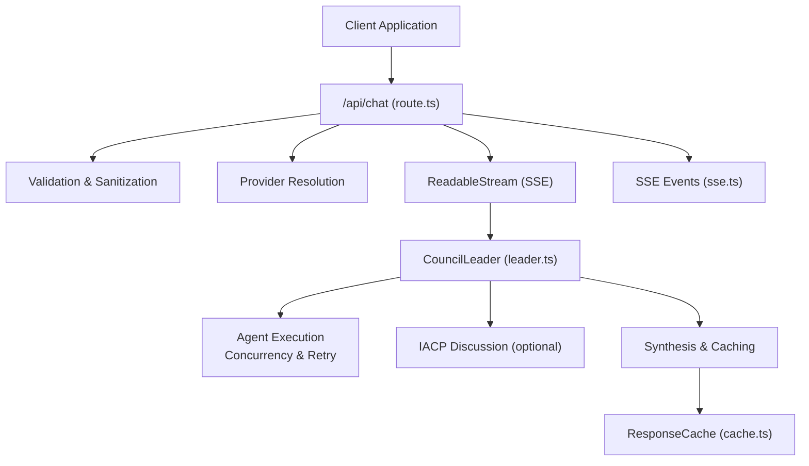
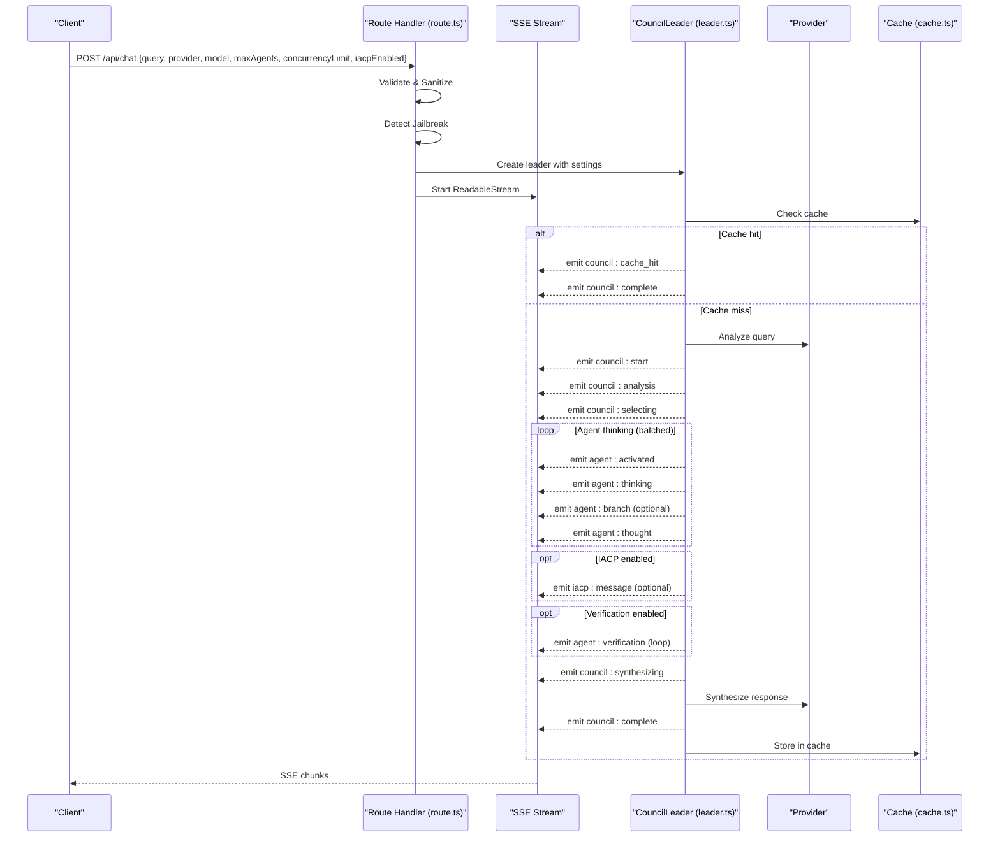
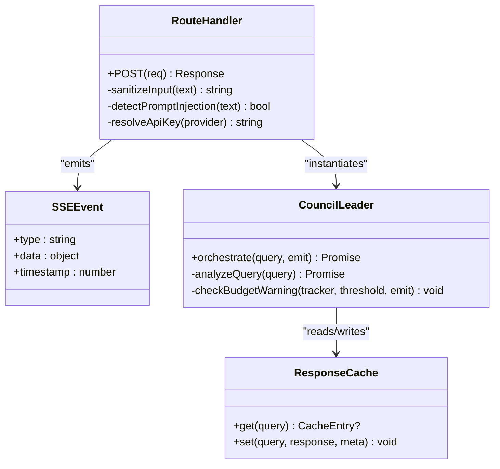
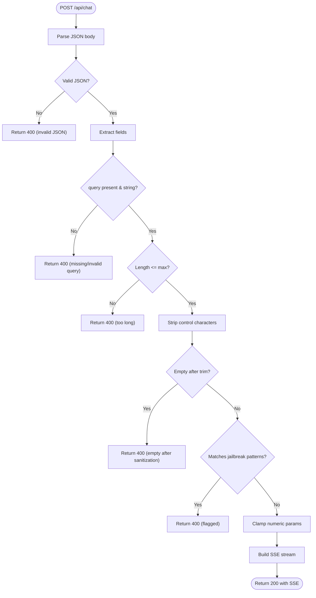
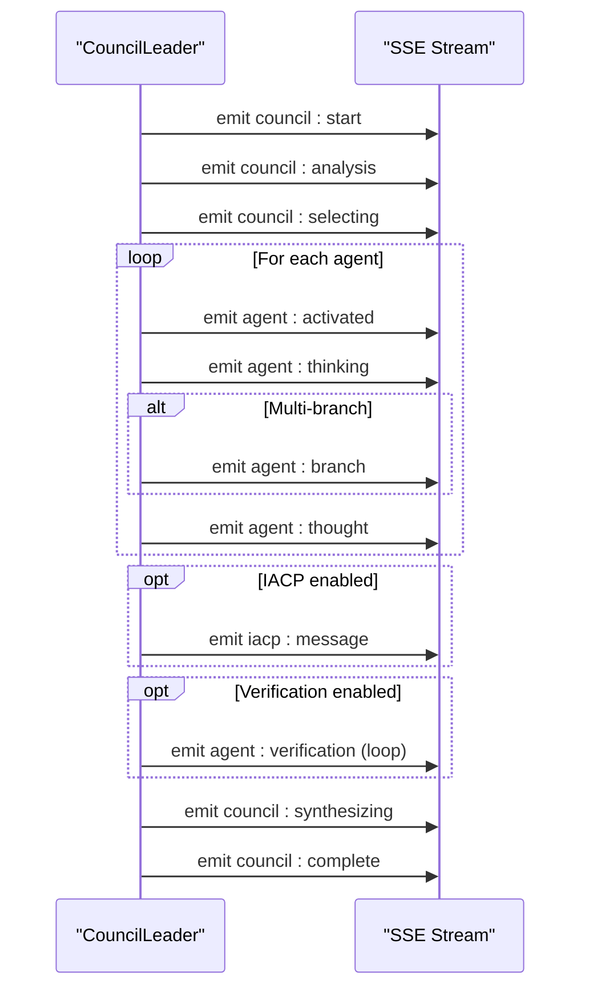
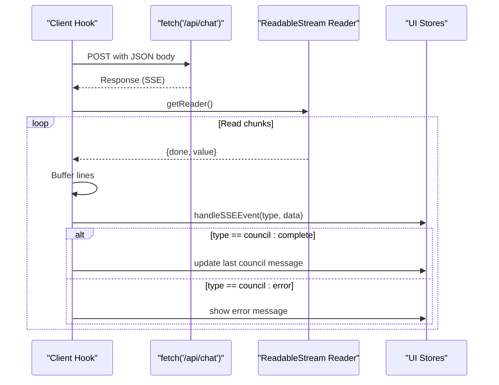
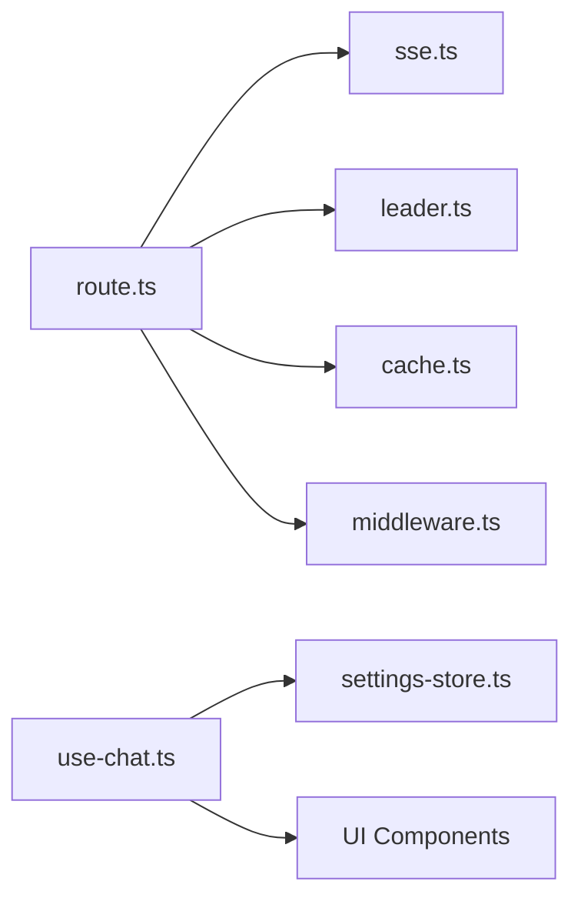

# Chat API

<cite>
**Referenced Files in This Document**
- [route.ts](file://src/app/api/chat/route.ts)
- [sse.ts](file://src/types/sse.ts)
- [leader.ts](file://src/core/council/leader.ts)
- [rate-limiter.ts](file://src/core/concurrency/rate-limiter.ts)
- [use-chat.ts](file://src/hooks/use-chat.ts)
- [chat-input.tsx](file://src/components/chat/chat-input.tsx)
- [settings-store.ts](file://src/stores/settings-store.ts)
- [middleware.ts](file://src/middleware.ts)
- [cache.ts](file://src/lib/cache.ts)
- [query-intelligence.ts](file://src/lib/query-intelligence.ts)
</cite>

## Table of Contents
1. [Introduction](#introduction)
2. [Project Structure](#project-structure)
3. [Core Components](#core-components)
4. [Architecture Overview](#architecture-overview)
5. [Detailed Component Analysis](#detailed-component-analysis)
6. [Dependency Analysis](#dependency-analysis)
7. [Performance Considerations](#performance-considerations)
8. [Troubleshooting Guide](#troubleshooting-guide)
9. [Conclusion](#conclusion)
10. [Appendices](#appendices)

## Introduction
This document provides comprehensive API documentation for the chat endpoint (/api/chat). It covers the POST method for submitting queries, the Server-Sent Events (SSE) streaming response format, input validation and safety controls, response schemas, error handling, rate limiting, and security measures. It also includes example requests/responses, client implementation guidelines for SSE event handling, and integration patterns for real-time chat applications.

## Project Structure
The chat API is implemented as a Next.js route handler that streams structured events to clients. The flow integrates with the council orchestration engine, concurrency and budget controls, caching, and frontend hooks for SSE consumption.

**Diagram sources**
- [route.ts:88-221](file://src/app/api/chat/route.ts#L88-L221)
- [leader.ts:42-604](file://src/core/council/leader.ts#L42-L604)
- [sse.ts:6-24](file://src/types/sse.ts#L6-L24)
- [cache.ts:34-205](file://src/lib/cache.ts#L34-L205)

**Section sources**
- [route.ts:1-222](file://src/app/api/chat/route.ts#L1-L222)
- [leader.ts:1-714](file://src/core/council/leader.ts#L1-L714)
- [sse.ts:1-112](file://src/types/sse.ts#L1-L112)
- [cache.ts:1-206](file://src/lib/cache.ts#L1-L206)

## Core Components
- Route handler: Parses request body, validates and sanitizes input, detects prompt injection, resolves provider credentials, orchestrates council execution via SSE, and returns a streaming response.
- SSE event types and schemas: Defines the canonical event types and payload shapes emitted during orchestration.
- Council leader: Orchestrates query analysis, agent selection, concurrent reasoning, optional IACP discussion, verification, synthesis, and caching.
- Frontend hook: Implements SSE parsing, updates UI state, and supports cancellation.
- Middleware: Applies CORS, CSP, and rate limiting to API routes.

**Section sources**
- [route.ts:88-221](file://src/app/api/chat/route.ts#L88-L221)
- [sse.ts:6-111](file://src/types/sse.ts#L6-L111)
- [leader.ts:42-604](file://src/core/council/leader.ts#L42-L604)
- [use-chat.ts:22-128](file://src/hooks/use-chat.ts#L22-L128)
- [middleware.ts:166-211](file://src/middleware.ts#L166-L211)

## Architecture Overview
The chat endpoint accepts a JSON payload, validates and sanitizes it, and streams structured events to the client. Internally, the council orchestrator coordinates multiple agents, optionally performs IACP discussions and verifications, and synthesizes a final response. Caching is used to accelerate repeated queries.

**Diagram sources**
- [route.ts:88-221](file://src/app/api/chat/route.ts#L88-L221)
- [leader.ts:42-604](file://src/core/council/leader.ts#L42-L604)
- [cache.ts:70-93](file://src/lib/cache.ts#L70-L93)

## Detailed Component Analysis

### Endpoint Definition
- Method: POST
- Path: /api/chat
- Purpose: Submit a query to the council of agents and receive a streaming response.

Request body parameters:
- query: string (required). Maximum length enforced server-side.
- provider: string (optional). One of openai, anthropic, ollama, glm, mock. Defaults to glm.
- model: string (optional). Model identifier. Defaults vary by provider.
- maxAgents: number (optional). Agent pool size clamped to [1, 20]. Defaults to 7.
- concurrencyLimit: number (optional). Concurrent agent batches clamped to [1, 10]. Defaults to 3.
- iacpEnabled: boolean (optional). Enables inter-agent collaborative discussion. Defaults to true.
- ollamaBaseUrl: string (optional). Overrides base URL for Ollama provider.

Response:
- Content-Type: text/event-stream
- Streaming events: See “SSE Event Types” below.

Security and validation:
- JSON parse failure returns 400.
- Query presence and type checks return 400.
- Query length check returns 400 if exceeded.
- Control character stripping; empty query after sanitization returns 400.
- Jailbreak pattern detection returns 400.
- Numeric parameters sanitized to safe ranges.
- Provider API keys resolved server-side only; client-provided keys are ignored.

Rate limiting:
- Sliding-window in-memory limiter: 100 requests per minute per IP.
- Headers: X-RateLimit-Limit, X-RateLimit-Remaining.
- On limit: 429 with Retry-After.

CORS and CSP:
- Origin validation and allowlist support.
- Security headers applied to all API responses.

**Section sources**
- [route.ts:88-221](file://src/app/api/chat/route.ts#L88-L221)
- [middleware.ts:7-80](file://src/middleware.ts#L7-L80)
- [middleware.ts:166-211](file://src/middleware.ts#L166-L211)

### SSE Event Types and Payloads
The server emits structured events with type and data fields. The canonical event types include lifecycle and progress notifications.

Core event types:
- council:start: Session initialization.
- council:analysis: Query analysis result.
- council:selecting: Agent selection outcome.
- agent:activated: Agent instance started.
- agent:thinking: Agent begins reasoning.
- agent:branch: Multi-branch reasoning outputs.
- agent:thought: Final thought from an agent.
- agent:verification: Verification results for claims.
- iacp:message: Inter-agent collaboration messages.
- council:synthesizing: Synthesis phase start.
- council:synthesis_progress: Progress during synthesis.
- council:complete: Final aggregated response and usage stats.
- council:cache_hit: Cached response served.
- council:clarification_needed: Query needs refinement.
- council:error: Error encountered during orchestration.

Event schema:
- type: string (one of the above)
- data: object (per-type shape)
- timestamp: number (Unix milliseconds)

Example event shapes:
- council:start: { sessionId, query }
- council:analysis: { analysis: QueryAnalysis }
- council:selecting: { selection: AgentSelection }
- agent:activated: { agentId, agentName, domain, role, batchIndex }
- agent:thinking: { agentId, branch?, totalBranches? }
- agent:branch: { agentId, branch, thought, confidence }
- agent:thought: { agentId, thought, confidence, processingTime, branches?, selectedBranch? }
- agent:verification: { agentId, targetAgentId, claim, score, status, issues, round }
- iacp:message: { message: IACPMessage }
- council:synthesizing: { agentCount, reason? }
- council:synthesis_progress: { phase, content, agentsProcessed, totalAgents, consensusScore? }
- council:complete: { response, totalTime, agentsActivated, agentsSucceeded, totalTokens, tokenUsage? }
- council:cache_hit: { query, response, cachedAt }
- council:clarification_needed: { suggestions, reasons, complexity }
- council:error: { error }

Note: The complete type definitions and payloads are declared in the SSE types module.

**Section sources**
- [sse.ts:6-111](file://src/types/sse.ts#L6-L111)

### Input Validation, Sanitization, and Safety
Validation and sanitization steps performed server-side:
- JSON parsing; invalid JSON yields 400.
- Presence and type check for query; returns 400 if missing or not a string.
- Length check against a maximum; returns 400 if exceeded.
- Control character removal (preserving newline, tab, carriage return); empty query after trimming returns 400.
- Jailbreak pattern detection using a curated set of regular expressions; returns 400 if matched.
- Numeric parameters clamped to safe ranges for agent count and concurrency.

Prompt injection detection:
- Uses a predefined list of patterns targeting instruction bypass attempts and system prompt extraction.

Provider key resolution:
- Server-side environment variables are used; client-provided keys are ignored.

**Section sources**
- [route.ts:17-82](file://src/app/api/chat/route.ts#L17-L82)
- [route.ts:113-138](file://src/app/api/chat/route.ts#L113-L138)

### Concurrency, Retry, and Budget Controls
- Concurrency batching: Agents are grouped into batches controlled by concurrencyLimit; tasks are executed with a concurrency manager.
- Retry with exponential backoff: Operations are retried with jitter for transient failures; authentication errors are not retried.
- Token budget tracking: Tracks usage across agents and synthesis; emits budget warnings near thresholds.
- Optional verification loop: Optional verification rounds can be enabled; budget checked before each stage.

**Section sources**
- [leader.ts:182-324](file://src/core/council/leader.ts#L182-L324)
- [rate-limiter.ts:13-40](file://src/core/concurrency/rate-limiter.ts#L13-L40)
- [leader.ts:606-624](file://src/core/council/leader.ts#L606-L624)

### Caching and Query Intelligence
- Response cache: Stores normalized queries with hashing and TTL; serves cache hits early and emits cache-hit events.
- Query intelligence: Provides ambiguity detection, topic classification, complexity estimation, and suggested clarifications; used to refine queries before orchestration.

**Section sources**
- [cache.ts:34-205](file://src/lib/cache.ts#L34-L205)
- [query-intelligence.ts:55-239](file://src/lib/query-intelligence.ts#L55-L239)

### Frontend Integration and SSE Handling
Client-side behavior:
- Sends POST with JSON body containing query and settings.
- Reads SSE stream, parses event and data lines, and dispatches events to UI stores.
- Supports cancellation via AbortController.
- On completion, auto-saves session.

Recommended client implementation:
- Use fetch with a readable stream reader.
- Accumulate partial lines until a blank line delimiter; parse event/data pairs.
- Dispatch events to UI state; render incremental updates.
- Handle “council:error” to surface errors to users.
- Support cancellation to abort long-running requests.

**Section sources**
- [use-chat.ts:22-128](file://src/hooks/use-chat.ts#L22-L128)
- [chat-input.tsx:13-84](file://src/components/chat/chat-input.tsx#L13-L84)

## Architecture Overview

**Diagram sources**
- [route.ts:88-221](file://src/app/api/chat/route.ts#L88-L221)
- [sse.ts:107-111](file://src/types/sse.ts#L107-L111)
- [leader.ts:42-604](file://src/core/council/leader.ts#L42-L604)
- [cache.ts:70-128](file://src/lib/cache.ts#L70-L128)

## Detailed Component Analysis

### Request Validation Flow

**Diagram sources**
- [route.ts:88-145](file://src/app/api/chat/route.ts#L88-L145)

**Section sources**
- [route.ts:113-145](file://src/app/api/chat/route.ts#L113-L145)

### SSE Emission Sequence

**Diagram sources**
- [leader.ts:98-594](file://src/core/council/leader.ts#L98-L594)
- [sse.ts:6-24](file://src/types/sse.ts#L6-L24)

**Section sources**
- [leader.ts:98-594](file://src/core/council/leader.ts#L98-L594)

### Frontend SSE Consumption

**Diagram sources**
- [use-chat.ts:48-128](file://src/hooks/use-chat.ts#L48-L128)

**Section sources**
- [use-chat.ts:22-128](file://src/hooks/use-chat.ts#L22-L128)

## Dependency Analysis
- Route handler depends on:
  - SSE types for event typing.
  - Council leader for orchestration.
  - Providers (resolved server-side) for model calls.
  - Cache for response caching.
  - Middleware for CORS/CSP/rate limiting.
- Frontend hook depends on:
  - Settings store for provider/model/concurrency choices.
  - Chat store for UI state.
  - Council store for SSE event handling.

**Diagram sources**
- [route.ts:1-10](file://src/app/api/chat/route.ts#L1-L10)
- [sse.ts:1-5](file://src/types/sse.ts#L1-L5)
- [leader.ts:1-22](file://src/core/council/leader.ts#L1-L22)
- [cache.ts:1-4](file://src/lib/cache.ts#L1-L4)
- [middleware.ts:1-10](file://src/middleware.ts#L1-L10)
- [use-chat.ts:1-7](file://src/hooks/use-chat.ts#L1-L7)
- [settings-store.ts:1-25](file://src/stores/settings-store.ts#L1-L25)

**Section sources**
- [route.ts:1-10](file://src/app/api/chat/route.ts#L1-L10)
- [use-chat.ts:1-7](file://src/hooks/use-chat.ts#L1-L7)
- [settings-store.ts:1-25](file://src/stores/settings-store.ts#L1-L25)

## Performance Considerations
- Concurrency batching reduces provider latency and cost by controlling parallel agent workloads.
- Retry with exponential backoff mitigates transient provider issues.
- Response caching accelerates repeated queries; normalization and hashing improve hit rates.
- Token budget tracking prevents runaway costs; budget warnings proactively inform clients.
- Frontend rendering updates incrementally via SSE to minimize perceived latency.

[No sources needed since this section provides general guidance]

## Troubleshooting Guide
Common issues and resolutions:
- 400 Bad Request
  - Invalid JSON body: Verify request payload is valid JSON.
  - Missing or invalid query: Ensure query is a non-empty string within length limits.
  - Query too long: Reduce query length.
  - Empty after sanitization: Remove control characters and ensure meaningful content.
  - Flagged by safety filter: Rephrase query to avoid jailbreak patterns.
- 403 Forbidden (CORS)
  - Origin not allowed: Configure ALLOWED_ORIGINS or call from same origin.
- 429 Too Many Requests
  - Rate limit exceeded: Wait for the reset window indicated by Retry-After.
- SSE Parsing Errors
  - Malformed event lines: Ensure client properly splits on newlines and handles partial buffers.
  - Missing data: Expect paired event/data lines before emitting the event.
- Provider Failures
  - Authentication errors are not retried; verify server-side API keys.
  - Transient errors are retried automatically; monitor budgets and warnings.

**Section sources**
- [route.ts:90-95](file://src/app/api/chat/route.ts#L90-L95)
- [route.ts:114-138](file://src/app/api/chat/route.ts#L114-L138)
- [middleware.ts:176-199](file://src/middleware.ts#L176-L199)
- [use-chat.ts:113-125](file://src/hooks/use-chat.ts#L113-L125)

## Conclusion
The /api/chat endpoint provides a robust, secure, and efficient real-time chat experience powered by a council of specialized agents. Its SSE-based streaming, strict input validation, safety filters, caching, and concurrency controls deliver responsive, transparent, and scalable interactions suitable for production environments.

[No sources needed since this section summarizes without analyzing specific files]

## Appendices

### API Definition
- Method: POST
- Path: /api/chat
- Headers:
  - Content-Type: application/json
- Request Body Fields:
  - query: string (required)
  - provider: string (optional; default glm)
  - model: string (optional; default varies by provider)
  - maxAgents: number (optional; default 7; range 1–20)
  - concurrencyLimit: number (optional; default 3; range 1–10)
  - iacpEnabled: boolean (optional; default true)
  - ollamaBaseUrl: string (optional; for Ollama provider)
- Response:
  - Status: 200 OK with text/event-stream
  - Events: See “SSE Event Types and Payloads”

**Section sources**
- [route.ts:88-111](file://src/app/api/chat/route.ts#L88-L111)
- [route.ts:213-220](file://src/app/api/chat/route.ts#L213-L220)

### Example Requests and Responses
- Example request (JSON):
  - query: "How can I improve my productivity?"
  - provider: "openai"
  - model: "gpt-4o"
  - maxAgents: 7
  - concurrencyLimit: 3
  - iacpEnabled: true
- Example SSE events:
  - event: council:start; data: { sessionId, query }
  - event: council:analysis; data: { analysis }
  - event: council:selecting; data: { selection }
  - event: agent:activated; data: { agentId, agentName, domain, role, batchIndex }
  - event: agent:thinking; data: { agentId, branch?, totalBranches? }
  - event: agent:branch; data: { agentId, branch, thought, confidence }
  - event: agent:thought; data: { agentId, thought, confidence, processingTime, branches?, selectedBranch? }
  - event: iacp:message; data: { message }
  - event: agent:verification; data: { agentId, targetAgentId, claim, score, status, issues, round }
  - event: council:synthesizing; data: { agentCount, reason? }
  - event: council:complete; data: { response, totalTime, agentsActivated, agentsSucceeded, totalTokens, tokenUsage? }
  - event: council:cache_hit; data: { query, response, cachedAt }
  - event: council:clarification_needed; data: { suggestions, reasons, complexity }
  - event: council:error; data: { error }

**Section sources**
- [route.ts:88-111](file://src/app/api/chat/route.ts#L88-L111)
- [sse.ts:26-104](file://src/types/sse.ts#L26-L104)

### Client Implementation Guidelines
- Use fetch with a readable stream reader.
- Accumulate decoded text until a blank line separates events.
- Parse event and data lines; JSON-parse data payloads.
- Update UI progressively for each event type.
- Handle “council:error” to display errors.
- Support cancellation via AbortController.
- Persist sessions on completion.

**Section sources**
- [use-chat.ts:48-128](file://src/hooks/use-chat.ts#L48-L128)

### Security Measures
- Input validation and sanitization.
- Jailbreak pattern detection.
- Server-side provider key resolution.
- CORS allowlist and CSP headers.
- Rate limiting with sliding window.

**Section sources**
- [route.ts:50-58](file://src/app/api/chat/route.ts#L50-L58)
- [route.ts:71-82](file://src/app/api/chat/route.ts#L71-L82)
- [middleware.ts:116-160](file://src/middleware.ts#L116-L160)
- [middleware.ts:45-80](file://src/middleware.ts#L45-L80)