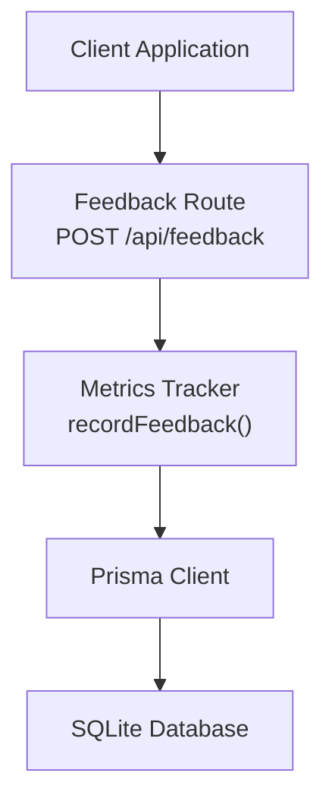
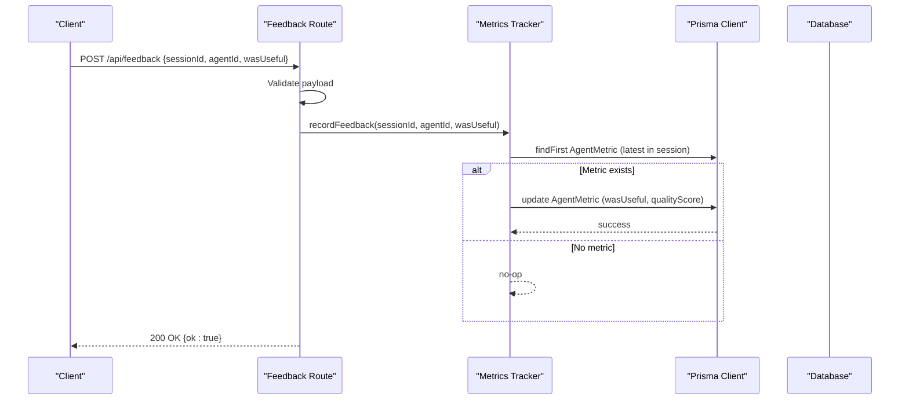
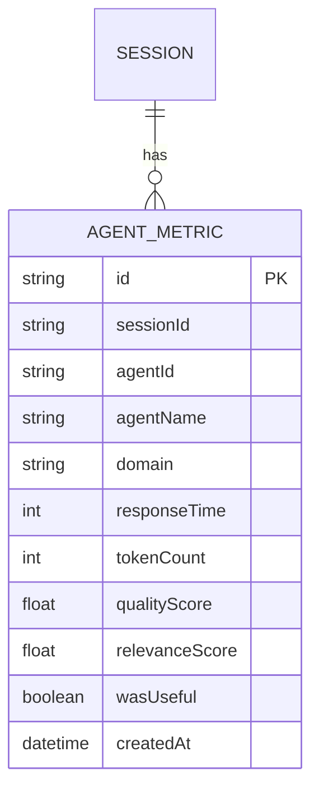
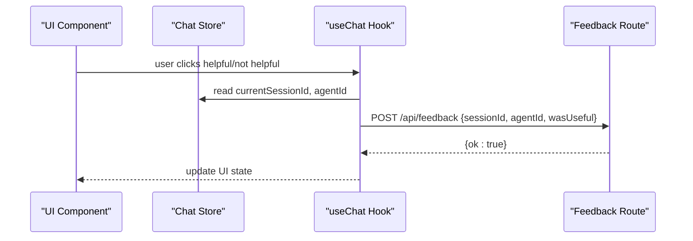
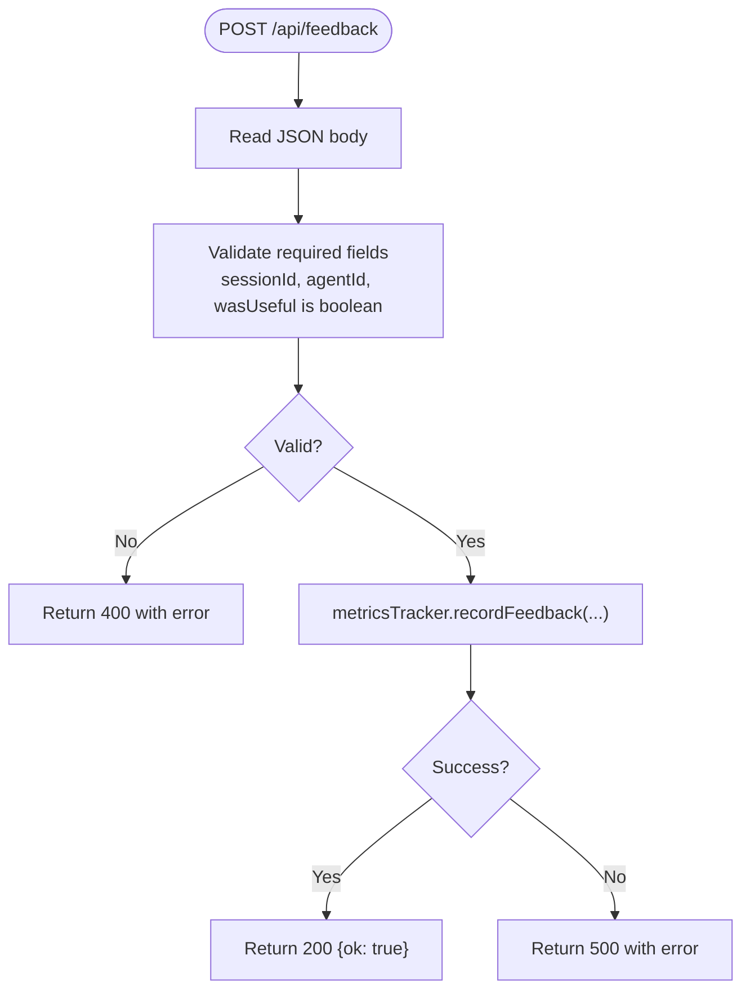
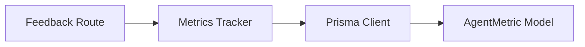

# Feedback Collection API

<cite>
**Referenced Files in This Document**
- [route.ts](file://src/app/api/feedback/route.ts)
- [metrics.ts](file://src/lib/metrics.ts)
- [schema.prisma](file://prisma/schema.prisma)
- [chat-store.ts](file://src/stores/chat-store.ts)
- [use-chat.ts](file://src/hooks/use-chat.ts)
- [route.ts](file://src/app/api/sessions/route.ts)
</cite>

## Table of Contents
1. [Introduction](#introduction)
2. [Project Structure](#project-structure)
3. [Core Components](#core-components)
4. [Architecture Overview](#architecture-overview)
5. [Detailed Component Analysis](#detailed-component-analysis)
6. [Dependency Analysis](#dependency-analysis)
7. [Performance Considerations](#performance-considerations)
8. [Troubleshooting Guide](#troubleshooting-guide)
9. [Conclusion](#conclusion)
10. [Appendices](#appendices)

## Introduction
This document provides comprehensive API documentation for the feedback collection endpoint that captures user sentiment about agent responses during a conversational session. It covers request and response schemas, validation rules, data modeling, storage considerations, and client integration patterns. The endpoint supports recording whether a response was useful and updates internal quality metrics accordingly.

## Project Structure
The feedback API is implemented as a Next.js App Router API route. It integrates with a metrics tracking service that persists feedback into the database via Prisma ORM.

**Diagram sources**
- [route.ts:1-26](file://src/app/api/feedback/route.ts#L1-L26)
- [metrics.ts:134-159](file://src/lib/metrics.ts#L134-L159)
- [schema.prisma:35-48](file://prisma/schema.prisma#L35-L48)

**Section sources**
- [route.ts:1-26](file://src/app/api/feedback/route.ts#L1-L26)
- [metrics.ts:134-159](file://src/lib/metrics.ts#L134-L159)
- [schema.prisma:35-48](file://prisma/schema.prisma#L35-L48)

## Core Components
- Feedback Route: Validates incoming request payload and delegates feedback recording to the metrics tracker.
- Metrics Tracker: Persists feedback to the AgentMetric model and adjusts quality scoring heuristics.
- Data Model: AgentMetric stores per-session agent performance including feedback.

Key behaviors:
- Accepts a boolean flag indicating usefulness.
- Associates feedback with a specific session and agent.
- Updates the associated agent metric with feedback and inferred quality adjustments.

**Section sources**
- [route.ts:4-25](file://src/app/api/feedback/route.ts#L4-L25)
- [metrics.ts:134-159](file://src/lib/metrics.ts#L134-L159)
- [schema.prisma:35-48](file://prisma/schema.prisma#L35-L48)

## Architecture Overview
The feedback submission flow connects the client to the server, validates inputs, and records feedback against the most recent agent metric for the given session.

**Diagram sources**
- [route.ts:4-25](file://src/app/api/feedback/route.ts#L4-L25)
- [metrics.ts:134-159](file://src/lib/metrics.ts#L134-L159)
- [schema.prisma:35-48](file://prisma/schema.prisma#L35-L48)

## Detailed Component Analysis

### Endpoint Definition
- Method: POST
- Path: /api/feedback
- Purpose: Submit user feedback for a specific agent response within a session.

Request Body Parameters
- sessionId: string (required)
  - Identifies the session to which the feedback applies.
- agentId: string (required)
  - Identifies the agent whose response is being rated.
- wasUseful: boolean (required)
  - Indicates whether the response was useful to the user.

Validation Rules
- Returns 400 Bad Request if any required field is missing or if wasUseful is not a boolean.
- Returns 500 Internal Server Error if recording fails.

Response Schema
- On success: { ok: true }
- On failure: { error: string }

Notes
- The current implementation does not support free-text feedback, categorization, or sentiment analysis triggers.
- Metadata collection is not part of the request payload.

**Section sources**
- [route.ts:4-25](file://src/app/api/feedback/route.ts#L4-L25)

### Storage and Data Model
Feedback is recorded against the most recent AgentMetric for the given session and agent combination. The model includes:
- sessionId: string
- agentId: string
- agentName: string
- domain: string
- responseTime: integer (milliseconds)
- tokenCount: integer
- qualityScore: float (0–1)
- relevanceScore: float (0–1)
- wasUseful: boolean
- createdAt: datetime

Behavior
- The metrics tracker finds the latest metric in the session for the agent.
- If found, it updates wasUseful and adjusts qualityScore based on the feedback direction.

**Diagram sources**
- [schema.prisma:10-21](file://prisma/schema.prisma#L10-L21)
- [schema.prisma:35-48](file://prisma/schema.prisma#L35-L48)

**Section sources**
- [metrics.ts:134-159](file://src/lib/metrics.ts#L134-L159)
- [schema.prisma:35-48](file://prisma/schema.prisma#L35-L48)

### Client Integration Patterns
Recommended client-side flow
- Capture user action (e.g., click “helpful” or “not helpful”) and collect the current session identifier and agent identifier.
- Send a POST request to /api/feedback with the validated payload.
- Handle success silently or show a confirmation; handle errors by retrying or notifying the user.

Session and agent identifiers
- The client maintains the current session ID in state and passes it with feedback.
- Agent identification is available from the active agent context in the UI.

**Diagram sources**
- [chat-store.ts:44-131](file://src/stores/chat-store.ts#L44-L131)
- [use-chat.ts:22-128](file://src/hooks/use-chat.ts#L22-L128)
- [route.ts:4-25](file://src/app/api/feedback/route.ts#L4-L25)

**Section sources**
- [chat-store.ts:44-131](file://src/stores/chat-store.ts#L44-L131)
- [use-chat.ts:22-128](file://src/hooks/use-chat.ts#L22-L128)
- [route.ts:4-25](file://src/app/api/feedback/route.ts#L4-L25)

### Validation and Error Handling
Validation
- Required fields: sessionId, agentId, wasUseful.
- wasUseful must be a boolean; non-boolean values cause a 400 error.

Error Handling
- 400: Missing or invalid fields.
- 500: Recording failure (database or processing error).

**Diagram sources**
- [route.ts:4-25](file://src/app/api/feedback/route.ts#L4-L25)
- [metrics.ts:134-159](file://src/lib/metrics.ts#L134-L159)

**Section sources**
- [route.ts:4-25](file://src/app/api/feedback/route.ts#L4-L25)

### Spam Prevention and Rate Limiting
- The feedback route does not implement explicit rate limiting or spam detection.
- Consider adding IP-based limits, user session caps, or CAPTCHA for high-volume deployments.

[No sources needed since this section provides general guidance]

### Feedback Analysis and Reporting
- The metrics tracker computes composite scores and can suppress underperforming agents based on historical feedback.
- Use the metrics APIs to derive insights and reports.

**Section sources**
- [metrics.ts:73-132](file://src/lib/metrics.ts#L73-L132)

## Dependency Analysis
The feedback route depends on the metrics tracker, which in turn uses Prisma to access the AgentMetric model.

**Diagram sources**
- [route.ts:1-2](file://src/app/api/feedback/route.ts#L1-L2)
- [metrics.ts:1-4](file://src/lib/metrics.ts#L1-L4)
- [schema.prisma:35-48](file://prisma/schema.prisma#L35-L48)

**Section sources**
- [route.ts:1-2](file://src/app/api/feedback/route.ts#L1-L2)
- [metrics.ts:1-4](file://src/lib/metrics.ts#L1-L4)
- [schema.prisma:35-48](file://prisma/schema.prisma#L35-L48)

## Performance Considerations
- The feedback operation performs a single database read followed by an update; it is lightweight but still synchronous.
- For high-throughput scenarios, consider batching feedback submissions or offloading to a queue.

[No sources needed since this section provides general guidance]

## Troubleshooting Guide
Common issues and resolutions
- 400 Bad Request: Ensure sessionId, agentId are present and wasUseful is a boolean.
- 500 Internal Server Error: Inspect backend logs for database errors; retry submission after resolving underlying issues.
- No effect on metrics: Verify that an AgentMetric exists for the given session and agent; feedback is only applied if a matching metric is found.

**Section sources**
- [route.ts:9-24](file://src/app/api/feedback/route.ts#L9-L24)
- [metrics.ts:134-159](file://src/lib/metrics.ts#L134-L159)

## Conclusion
The feedback collection endpoint provides a minimal yet effective mechanism to capture user sentiment and influence agent quality scoring. Extending the API to support richer feedback (categories, free-text, metadata) and integrating spam controls would further strengthen the system for production use.

[No sources needed since this section summarizes without analyzing specific files]

## Appendices

### API Reference
- Endpoint: POST /api/feedback
- Request Body:
  - sessionId: string (required)
  - agentId: string (required)
  - wasUseful: boolean (required)
- Responses:
  - 200 OK: { ok: true }
  - 400 Bad Request: { error: string }
  - 500 Internal Server Error: { error: string }

**Section sources**
- [route.ts:4-25](file://src/app/api/feedback/route.ts#L4-L25)

### Example Payloads
- Useful response:
  - { "sessionId": "...", "agentId": "...", "wasUseful": true }
- Not useful response:
  - { "sessionId": "...", "agentId": "...", "wasUseful": false }

[No sources needed since this section provides general guidance]

### Related Sessions API
- The sessions API manages session lifecycle and can be used to create or update sessions before or after feedback submission.

**Section sources**
- [route.ts:37-64](file://src/app/api/sessions/route.ts#L37-L64)