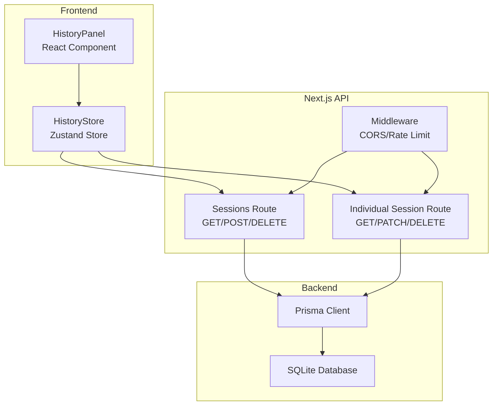
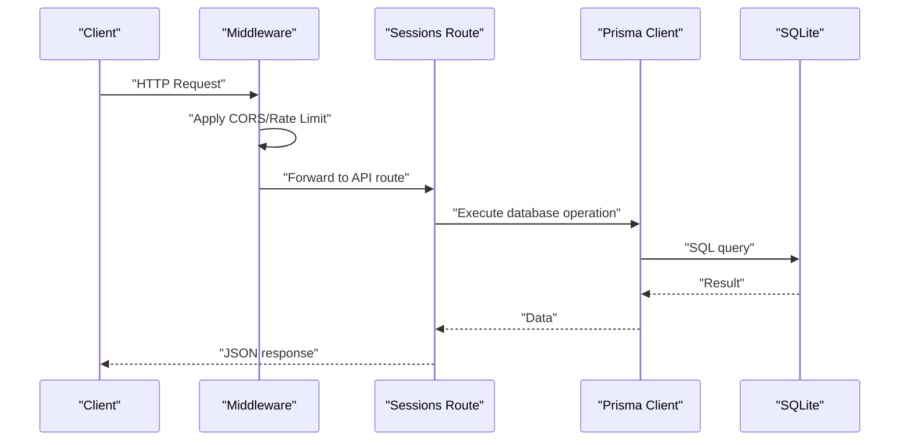
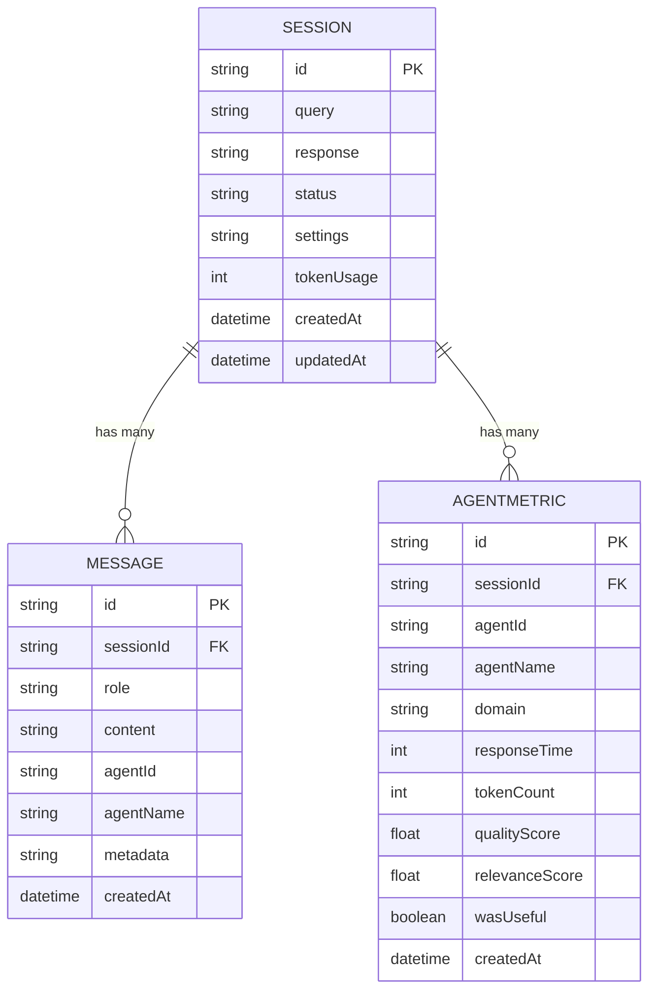
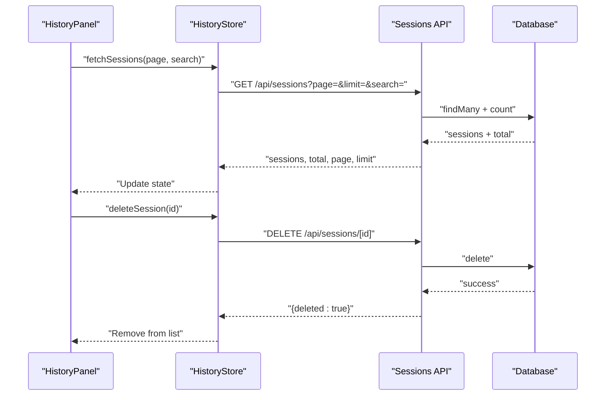
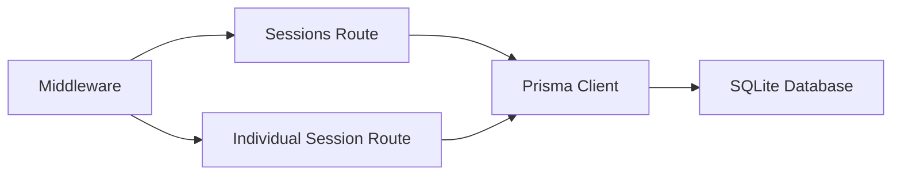

# Session Management API

<cite>
**Referenced Files in This Document**
- [route.ts](file://src/app/api/sessions/route.ts)
- [route.ts](file://src/app/api/sessions/[id]/route.ts)
- [db.ts](file://src/lib/db.ts)
- [schema.prisma](file://prisma/schema.prisma)
- [history-store.ts](file://src/stores/history-store.ts)
- [middleware.ts](file://src/middleware.ts)
- [history-panel.tsx](file://src/components/chat/history-panel.tsx)
</cite>

## Table of Contents
1. [Introduction](#introduction)
2. [Project Structure](#project-structure)
3. [Core Components](#core-components)
4. [Architecture Overview](#architecture-overview)
5. [Detailed Component Analysis](#detailed-component-analysis)
6. [Dependency Analysis](#dependency-analysis)
7. [Performance Considerations](#performance-considerations)
8. [Troubleshooting Guide](#trouboubleshooting-guide)
9. [Conclusion](#conclusion)

## Introduction
This document provides comprehensive API documentation for the session management endpoints. It covers:
- Retrieving all sessions with pagination and filtering
- Creating new sessions with validation
- Retrieving individual session details
- Deleting sessions
- Request/response schemas, authentication requirements, data validation rules, and error handling
- Client implementation patterns and integration guidelines for session persistence and retrieval

## Project Structure
The session management API is implemented as Next.js App Router API routes under `/src/app/api/sessions`. The backend uses Prisma with a SQLite database, and the frontend integrates with a Zustand store and React components.

**Diagram sources**
- [route.ts:1-91](file://src/app/api/sessions/route.ts#L1-L91)
- [route.ts:1-119](file://src/app/api/sessions/[id]/route.ts#L1-L119)
- [db.ts:1-22](file://src/lib/db.ts#L1-L22)
- [middleware.ts:166-211](file://src/middleware.ts#L166-L211)
- [history-store.ts:1-108](file://src/stores/history-store.ts#L1-L108)
- [history-panel.tsx:1-288](file://src/components/chat/history-panel.tsx#L1-L288)

**Section sources**
- [route.ts:1-91](file://src/app/api/sessions/route.ts#L1-L91)
- [route.ts:1-119](file://src/app/api/sessions/[id]/route.ts#L1-L119)
- [db.ts:1-22](file://src/lib/db.ts#L1-L22)
- [middleware.ts:166-211](file://src/middleware.ts#L166-L211)
- [history-store.ts:1-108](file://src/stores/history-store.ts#L1-L108)
- [history-panel.tsx:1-288](file://src/components/chat/history-panel.tsx#L1-L288)

## Core Components
- Sessions API routes: Implements GET /api/sessions, POST /api/sessions, and DELETE /api/sessions
- Individual session API routes: Implements GET /api/sessions/[id], PATCH /api/sessions/[id], and DELETE /api/sessions/[id]
- Prisma client: Provides database access and type-safe operations
- Middleware: Applies CORS, rate limiting, and security headers
- Frontend store and components: Manage session lists, pagination, and deletion

**Section sources**
- [route.ts:1-91](file://src/app/api/sessions/route.ts#L1-L91)
- [route.ts:1-119](file://src/app/api/sessions/[id]/route.ts#L1-L119)
- [db.ts:1-22](file://src/lib/db.ts#L1-L22)
- [middleware.ts:166-211](file://src/middleware.ts#L166-L211)
- [history-store.ts:1-108](file://src/stores/history-store.ts#L1-L108)

## Architecture Overview
The API follows a layered architecture:
- Presentation layer: Next.js API routes
- Application layer: Business logic and validation
- Data access layer: Prisma client
- Persistence layer: SQLite database

**Diagram sources**
- [route.ts:1-91](file://src/app/api/sessions/route.ts#L1-L91)
- [db.ts:1-22](file://src/lib/db.ts#L1-L22)
- [middleware.ts:166-211](file://src/middleware.ts#L166-L211)

## Detailed Component Analysis

### GET /api/sessions
Retrieves paginated sessions with optional search filtering.

- Method: GET
- Path: /api/sessions
- Query parameters:
  - page: integer, default 1, min 1
  - limit: integer, default 20, min 1, max 100
  - search: string, optional substring filter on query
- Response schema:
  - sessions: array of session objects
  - total: number of matching sessions
  - page: current page number
  - limit: items per page
- Pagination logic:
  - skip = (page - 1) × limit
  - take = limit
  - orderBy: createdAt desc
- Filtering:
  - where clause filters sessions by query containing the search term
- Error handling:
  - 500 Internal Server Error on database failure

**Section sources**
- [route.ts:4-35](file://src/app/api/sessions/route.ts#L4-L35)

### POST /api/sessions
Creates a new session with validation.

- Method: POST
- Path: /api/sessions
- Request body:
  - query: string, required
  - settings: object, optional (serialized to JSON string)
- Validation rules:
  - query is required and must be a string
  - settings is optional; if present, must be serializable to JSON
- Response:
  - 201 Created with the created session object
- Error handling:
  - 400 Bad Request for invalid input
  - 500 Internal Server Error on database failure

**Section sources**
- [route.ts:37-64](file://src/app/api/sessions/route.ts#L37-L64)

### DELETE /api/sessions
Deletes multiple sessions by ID.

- Method: DELETE
- Path: /api/sessions
- Request body:
  - ids: array of strings, required, non-empty
- Response:
  - deleted: number of sessions deleted
- Error handling:
  - 400 Bad Request for invalid input
  - 500 Internal Server Error on database failure

**Section sources**
- [route.ts:66-90](file://src/app/api/sessions/route.ts#L66-L90)

### GET /api/sessions/[id]
Retrieves an individual session with associated messages and agent metrics.

- Method: GET
- Path: /api/sessions/[id]
- Path parameter:
  - id: string, required
- Response includes:
  - Session object with nested messages (ordered by createdAt asc)
  - Session object with nested agentMetrics (ordered by createdAt asc)
- Error handling:
  - 404 Not Found if session does not exist
  - 500 Internal Server Error on database failure

**Section sources**
- [route.ts:6-36](file://src/app/api/sessions/[id]/route.ts#L6-L36)

### PATCH /api/sessions/[id]
Updates allowed fields of a session.

- Method: PATCH
- Path: /api/sessions/[id]
- Path parameter:
  - id: string, required
- Request body fields:
  - status: string, allowed
  - response: string, allowed
  - tokenUsage: number, allowed
- Validation:
  - At least one allowed field must be provided
- Response:
  - Updated session object
- Error handling:
  - 400 Bad Request for invalid fields
  - 404 Not Found if session does not exist
  - 500 Internal Server Error on database failure

**Section sources**
- [route.ts:38-86](file://src/app/api/sessions/[id]/route.ts#L38-L86)

### DELETE /api/sessions/[id]
Deletes a single session by ID.

- Method: DELETE
- Path: /api/sessions/[id]
- Path parameter:
  - id: string, required
- Response:
  - deleted: boolean (true)
- Error handling:
  - 404 Not Found if session does not exist
  - 500 Internal Server Error on database failure

**Section sources**
- [route.ts:88-118](file://src/app/api/sessions/[id]/route.ts#L88-L118)

### Data Models and Schemas
The session model is defined in Prisma with the following structure:

**Diagram sources**
- [schema.prisma:10-21](file://prisma/schema.prisma#L10-L21)
- [schema.prisma:23-33](file://prisma/schema.prisma#L23-L33)
- [schema.prisma:35-48](file://prisma/schema.prisma#L35-L48)

**Section sources**
- [schema.prisma:10-21](file://prisma/schema.prisma#L10-L21)
- [schema.prisma:23-33](file://prisma/schema.prisma#L23-L33)
- [schema.prisma:35-48](file://prisma/schema.prisma#L35-L48)

### Authentication and Security
- Authentication: No authentication requirement for session endpoints
- CORS: Configured via middleware with allowed methods GET, POST, OPTIONS and headers Content-Type, Authorization
- Rate limiting: Sliding window rate limiter (100 requests per minute) with X-RateLimit headers
- Security headers: CSP, X-Content-Type-Options, X-Frame-Options, Referrer-Policy, X-XSS-Protection
- Origin validation: Controlled by ALLOWED_ORIGINS environment variable

**Section sources**
- [middleware.ts:166-211](file://src/middleware.ts#L166-L211)

### Client Implementation Patterns
Frontend integration uses a Zustand store and React components:

- HistoryStore actions:
  - fetchSessions(page?, search?): Retrieves paginated sessions with search filtering
  - deleteSession(id): Deletes a single session
  - deleteSessions(ids[]): Bulk deletes sessions
- HistoryPanel component:
  - Renders session list with search and pagination
  - Integrates with HistoryStore for data fetching and deletion
  - Supports loading states and debounced search

**Diagram sources**
- [history-store.ts:37-64](file://src/stores/history-store.ts#L37-L64)
- [history-store.ts:66-78](file://src/stores/history-store.ts#L66-L78)
- [history-store.ts:80-98](file://src/stores/history-store.ts#L80-L98)
- [history-panel.tsx:89-130](file://src/components/chat/history-panel.tsx#L89-L130)

**Section sources**
- [history-store.ts:1-108](file://src/stores/history-store.ts#L1-L108)
- [history-panel.tsx:1-288](file://src/components/chat/history-panel.tsx#L1-L288)

## Dependency Analysis
The API routes depend on:
- Prisma client for database operations
- Middleware for CORS, rate limiting, and security headers
- Environment variables for database configuration

**Diagram sources**
- [route.ts:1-91](file://src/app/api/sessions/route.ts#L1-L91)
- [route.ts:1-119](file://src/app/api/sessions/[id]/route.ts#L1-L119)
- [db.ts:1-22](file://src/lib/db.ts#L1-L22)
- [middleware.ts:166-211](file://src/middleware.ts#L166-L211)

**Section sources**
- [route.ts:1-91](file://src/app/api/sessions/route.ts#L1-L91)
- [route.ts:1-119](file://src/app/api/sessions/[id]/route.ts#L1-L119)
- [db.ts:1-22](file://src/lib/db.ts#L1-L22)
- [middleware.ts:166-211](file://src/middleware.ts#L166-L211)

## Performance Considerations
- Pagination limits: Maximum 100 items per page to prevent heavy queries
- Parallel operations: Session retrieval uses Promise.all for findMany and count
- Indexing: Prisma schema defines relations and indexes for efficient queries
- Rate limiting: Prevents abuse and ensures fair resource usage
- Client caching: Frontend store manages local state to reduce redundant requests

## Troubleshooting Guide
Common issues and resolutions:
- 400 Bad Request:
  - Missing or invalid query in POST
  - Empty or invalid ids array in bulk DELETE
  - Invalid fields in PATCH
- 404 Not Found:
  - Session not found during GET/PATCH/DELETE
- 429 Too Many Requests:
  - Exceeded rate limit; wait for Retry-After period
- 500 Internal Server Error:
  - Database failures; check connection and Prisma client configuration

**Section sources**
- [route.ts:42-47](file://src/app/api/sessions/route.ts#L42-L47)
- [route.ts:71-76](file://src/app/api/sessions/route.ts#L71-L76)
- [route.ts:55-60](file://src/app/api/sessions/[id]/route.ts#L55-L60)
- [route.ts:69-79](file://src/app/api/sessions/[id]/route.ts#L69-L79)
- [middleware.ts:188-199](file://src/middleware.ts#L188-L199)

## Conclusion
The session management API provides a robust foundation for chat session lifecycle operations with built-in pagination, filtering, validation, and security measures. The frontend integration demonstrates practical patterns for session persistence and retrieval, enabling scalable client-server interactions.