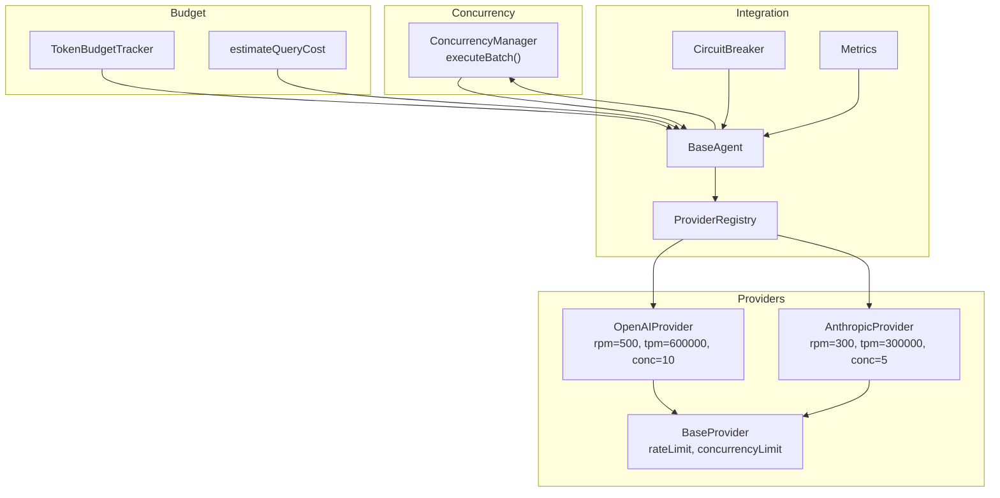
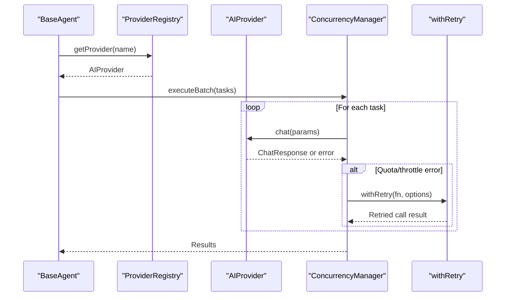
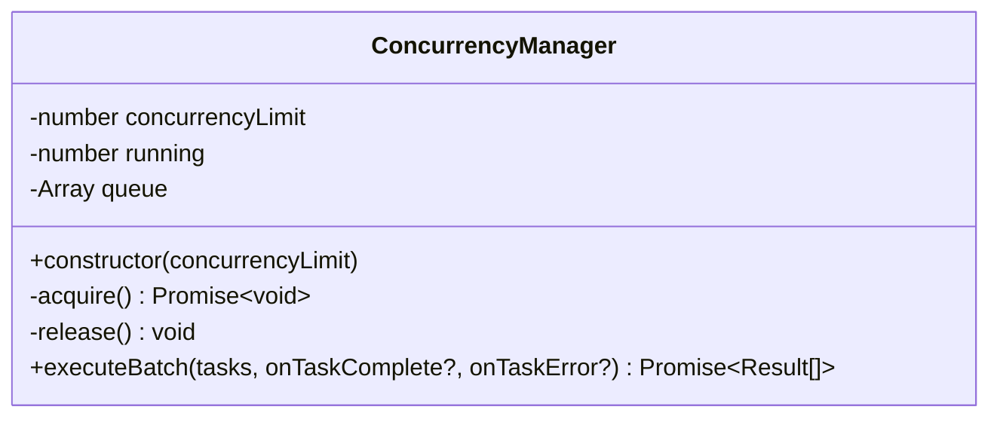
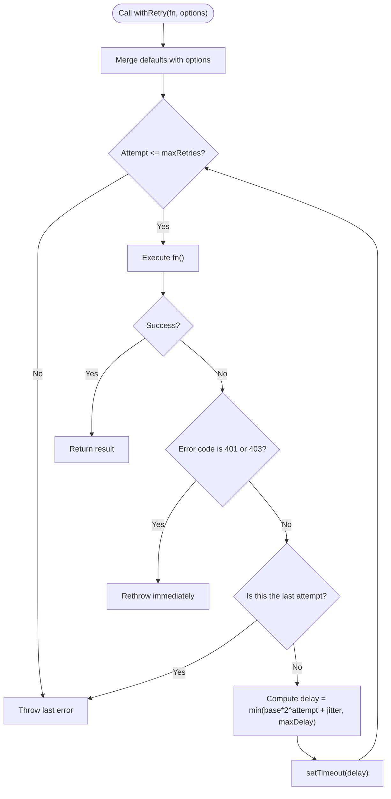
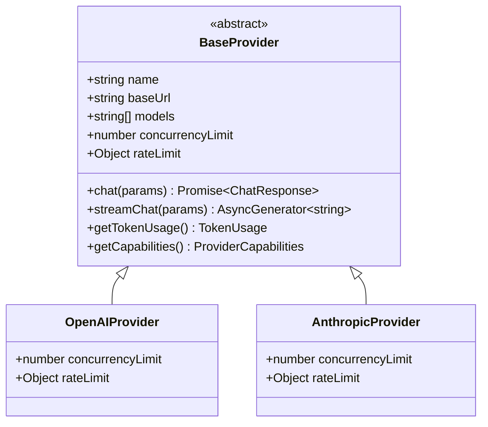
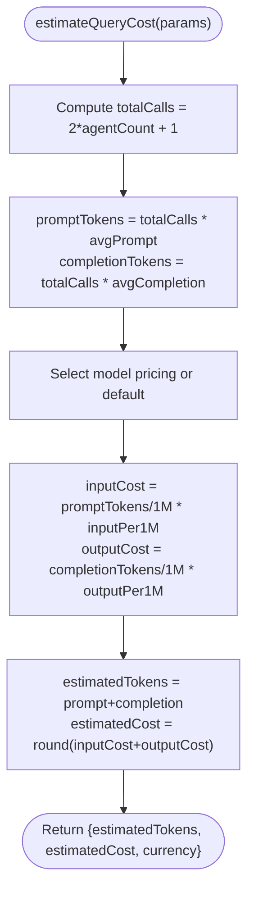
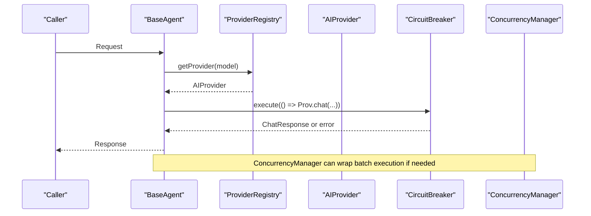
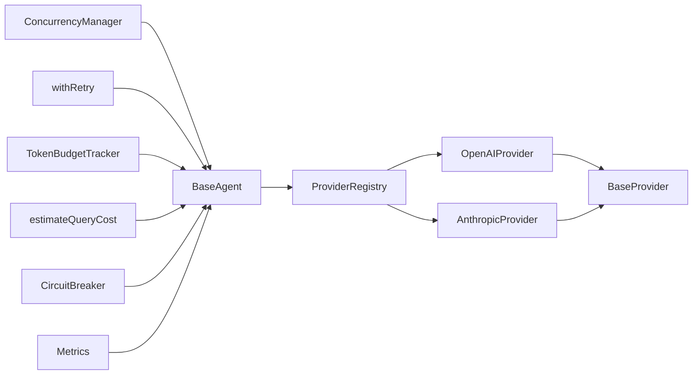

# Concurrency Management and Rate Limiting

<cite>
**Referenced Files in This Document**
- [manager.ts](file://src/core/concurrency/manager.ts)
- [rate-limiter.ts](file://src/core/concurrency/rate-limiter.ts)
- [tracker.ts](file://src/core/budget/tracker.ts)
- [estimator.ts](file://src/core/budget/estimator.ts)
- [base.ts](file://src/core/providers/base.ts)
- [openai.ts](file://src/core/providers/openai.ts)
- [anthropic.ts](file://src/core/providers/anthropic.ts)
- [base-agent.ts](file://src/core/agents/base-agent.ts)
- [provider.ts](file://src/types/provider.ts)
- [registry.ts](file://src/core/providers/registry.ts)
- [circuit-breaker.ts](file://src/lib/circuit-breaker.ts)
- [metrics.ts](file://src/lib/metrics.ts)
- [manager.test.ts](file://src/__tests__/core/concurrency/manager.test.ts)
- [tracker.test.ts](file://src/__tests__/core/budget/tracker.test.ts)
- [estimator.test.ts](file://src/__tests__/core/budget/estimator.test.ts)
</cite>

## Table of Contents
1. [Introduction](#introduction)
2. [Project Structure](#project-structure)
3. [Core Components](#core-components)
4. [Architecture Overview](#architecture-overview)
5. [Detailed Component Analysis](#detailed-component-analysis)
6. [Dependency Analysis](#dependency-analysis)
7. [Performance Considerations](#performance-considerations)
8. [Troubleshooting Guide](#troubleshooting-guide)
9. [Conclusion](#conclusion)
10. [Appendices](#appendices)

## Introduction
This document explains the concurrency management and rate limiting system used to coordinate parallel agent execution while balancing performance and cost efficiency. It covers:
- ConcurrencyManager: a lightweight semaphore-like mechanism that serializes task acquisition and releases to enforce a concurrency limit.
- Rate limiting via provider capabilities and retry logic: how provider-defined limits and exponential backoff with jitter prevent quota violations.
- Budget tracking and cost estimation: how token usage and estimated costs inform throughput decisions.
- Worker pool management and resource allocation strategies: how concurrency limits and provider caps guide task scheduling.
- Thread safety, performance monitoring, and scaling strategies for high-load scenarios.

## Project Structure
The concurrency and rate limiting system spans several modules:
- Concurrency control: ConcurrencyManager orchestrates task execution with bounded concurrency.
- Rate limiting: Providers expose rate limits and concurrency caps; retry logic handles transient failures.
- Budgeting: TokenBudgetTracker monitors usage; estimateQueryCost predicts cost for planning.
- Integration: BaseAgent invokes providers; ProviderRegistry manages provider instances; CircuitBreaker protects external calls; Metrics tracks performance.

**Diagram sources**
- [manager.ts:1-55](file://src/core/concurrency/manager.ts#L1-L55)
- [base.ts:3-83](file://src/core/providers/base.ts#L3-L83)
- [openai.ts:4-15](file://src/core/providers/openai.ts#L4-L15)
- [anthropic.ts:9-29](file://src/core/providers/anthropic.ts#L9-L29)
- [tracker.ts:1-78](file://src/core/budget/tracker.ts#L1-L78)
- [estimator.ts:25-55](file://src/core/budget/estimator.ts#L25-L55)
- [base-agent.ts:1-449](file://src/core/agents/base-agent.ts#L1-L449)
- [registry.ts:1-83](file://src/core/providers/registry.ts#L1-L83)
- [circuit-breaker.ts:21-137](file://src/lib/circuit-breaker.ts#L21-L137)
- [metrics.ts:42-225](file://src/lib/metrics.ts#L42-L225)

**Section sources**
- [manager.ts:1-55](file://src/core/concurrency/manager.ts#L1-L55)
- [base.ts:3-83](file://src/core/providers/base.ts#L3-L83)
- [openai.ts:4-15](file://src/core/providers/openai.ts#L4-L15)
- [anthropic.ts:9-29](file://src/core/providers/anthropic.ts#L9-L29)
- [tracker.ts:1-78](file://src/core/budget/tracker.ts#L1-L78)
- [estimator.ts:25-55](file://src/core/budget/estimator.ts#L25-L55)
- [base-agent.ts:1-449](file://src/core/agents/base-agent.ts#L1-L449)
- [registry.ts:1-83](file://src/core/providers/registry.ts#L1-L83)
- [circuit-breaker.ts:21-137](file://src/lib/circuit-breaker.ts#L21-L137)
- [metrics.ts:42-225](file://src/lib/metrics.ts#L42-L225)

## Core Components
- ConcurrencyManager: Enforces a hard concurrency limit using an internal counter and a FIFO queue. Tasks are wrapped to acquire/release slots around execution, ensuring predictable parallelism and orderly queue draining.
- RateLimiter utilities: withRetry applies exponential backoff with jitter and respects provider-specific quotas by avoiding retries on auth failures.
- Provider capabilities: BaseProvider defines rateLimit (rpm, tpm) and concurrencyLimit per provider, enabling informed scheduling.
- Budgeting: TokenBudgetTracker aggregates usage per agent and globally; estimateQueryCost projects cost for planning.
- Integration: BaseAgent calls providers; ProviderRegistry selects providers; CircuitBreaker guards external calls; Metrics records performance.

**Section sources**
- [manager.ts:1-55](file://src/core/concurrency/manager.ts#L1-L55)
- [rate-limiter.ts:13-41](file://src/core/concurrency/rate-limiter.ts#L13-L41)
- [base.ts:3-83](file://src/core/providers/base.ts#L3-L83)
- [tracker.ts:1-78](file://src/core/budget/tracker.ts#L1-L78)
- [estimator.ts:25-55](file://src/core/budget/estimator.ts#L25-L55)
- [base-agent.ts:1-449](file://src/core/agents/base-agent.ts#L1-L449)
- [registry.ts:1-83](file://src/core/providers/registry.ts#L1-L83)
- [circuit-breaker.ts:21-137](file://src/lib/circuit-breaker.ts#L21-L137)
- [metrics.ts:42-225](file://src/lib/metrics.ts#L42-L225)

## Architecture Overview
The system coordinates three axes:
- Concurrency control: ConcurrencyManager ensures tasks run within a configured limit.
- Provider quotas: Providers define per-minute and per-token limits; withRetry avoids quota violations by backing off on throttles.
- Cost control: TokenBudgetTracker and estimateQueryCost help plan workloads to stay within budget.

**Diagram sources**
- [base-agent.ts:1-449](file://src/core/agents/base-agent.ts#L1-L449)
- [registry.ts:43-83](file://src/core/providers/registry.ts#L43-L83)
- [manager.ts:29-53](file://src/core/concurrency/manager.ts#L29-L53)
- [rate-limiter.ts:13-41](file://src/core/concurrency/rate-limiter.ts#L13-L41)
- [openai.ts:26-62](file://src/core/providers/openai.ts#L26-L62)
- [anthropic.ts:51-92](file://src/core/providers/anthropic.ts#L51-L92)

## Detailed Component Analysis

### ConcurrencyManager
ConcurrencyManager implements a fair, FIFO-controlled concurrency gate:
- acquire: Increments running count if under limit; otherwise enqueues a resolver.
- release: Decrements running count and dispatches the next queued task.
- executeBatch: Wraps tasks to acquire before execution and release after completion; collects per-task results and invokes optional callbacks.

**Diagram sources**
- [manager.ts:1-55](file://src/core/concurrency/manager.ts#L1-L55)

**Section sources**
- [manager.ts:1-55](file://src/core/concurrency/manager.ts#L1-L55)
- [manager.test.ts:1-98](file://src/__tests__/core/concurrency/manager.test.ts#L1-L98)

### RateLimiter Utilities
The withRetry function implements exponential backoff with jitter and respects provider quotas:
- Options: maxRetries, baseDelay, maxDelay.
- Behavior: On error, checks for auth failures (do not retry); otherwise retries with capped exponential delay plus jitter; stops after maxRetries.

**Diagram sources**
- [rate-limiter.ts:13-41](file://src/core/concurrency/rate-limiter.ts#L13-L41)

**Section sources**
- [rate-limiter.ts:13-41](file://src/core/concurrency/rate-limiter.ts#L13-L41)

### Provider Capabilities and Quotas
Providers declare:
- concurrencyLimit: Maximum concurrent requests per provider.
- rateLimit: rpm (requests per minute) and tpm (tokens per minute) caps.

**Diagram sources**
- [base.ts:3-83](file://src/core/providers/base.ts#L3-L83)
- [openai.ts:4-15](file://src/core/providers/openai.ts#L4-L15)
- [anthropic.ts:9-29](file://src/core/providers/anthropic.ts#L9-L29)

**Section sources**
- [base.ts:3-83](file://src/core/providers/base.ts#L3-L83)
- [openai.ts:4-15](file://src/core/providers/openai.ts#L4-L15)
- [anthropic.ts:9-29](file://src/core/providers/anthropic.ts#L9-L29)
- [provider.ts:45-66](file://src/types/provider.ts#L45-L66)

### Budget Tracking and Estimation
TokenBudgetTracker:
- Records per-agent usage and aggregates totals.
- Provides remaining budget, exceeded detection, and summaries.

estimateQueryCost:
- Estimates total tokens and cost for a given agent configuration and model.
- Uses model-specific pricing and default assumptions.

**Diagram sources**
- [estimator.ts:25-55](file://src/core/budget/estimator.ts#L25-L55)

**Section sources**
- [tracker.ts:1-78](file://src/core/budget/tracker.ts#L1-L78)
- [estimator.ts:25-55](file://src/core/budget/estimator.ts#L25-L55)
- [tracker.test.ts:1-80](file://src/__tests__/core/budget/tracker.test.ts#L1-L80)
- [estimator.test.ts:1-53](file://src/__tests__/core/budget/estimator.test.ts#L1-L53)

### Integration with BaseAgent and ProviderRegistry
- BaseAgent invokes provider.chat for thinking, discussion, and verification phases.
- ProviderRegistry auto-detects and instantiates providers based on environment variables.
- CircuitBreaker wraps provider calls to protect against outages.
- Metrics records performance for tuning.

**Diagram sources**
- [base-agent.ts:1-449](file://src/core/agents/base-agent.ts#L1-L449)
- [registry.ts:19-83](file://src/core/providers/registry.ts#L19-L83)
- [circuit-breaker.ts:42-63](file://src/lib/circuit-breaker.ts#L42-L63)
- [manager.ts:29-53](file://src/core/concurrency/manager.ts#L29-L53)

**Section sources**
- [base-agent.ts:1-449](file://src/core/agents/base-agent.ts#L1-L449)
- [registry.ts:1-83](file://src/core/providers/registry.ts#L1-L83)
- [circuit-breaker.ts:21-137](file://src/lib/circuit-breaker.ts#L21-L137)
- [metrics.ts:42-225](file://src/lib/metrics.ts#L42-L225)

## Dependency Analysis
- ConcurrencyManager depends on task functions and internal queueing; it does not depend on providers.
- Providers define their own concurrencyLimit and rateLimit; BaseAgent uses provider capabilities to schedule work.
- withRetry is independent but commonly applied around provider calls to handle throttles.
- TokenBudgetTracker and estimateQueryCost are planning aids; they do not enforce limits but inform decisions.
- ProviderRegistry centralizes provider creation and discovery.
- CircuitBreaker and Metrics are orthogonal concerns that improve resilience and observability.

**Diagram sources**
- [manager.ts:1-55](file://src/core/concurrency/manager.ts#L1-L55)
- [base-agent.ts:1-449](file://src/core/agents/base-agent.ts#L1-L449)
- [registry.ts:1-83](file://src/core/providers/registry.ts#L1-L83)
- [openai.ts:4-15](file://src/core/providers/openai.ts#L4-L15)
- [anthropic.ts:9-29](file://src/core/providers/anthropic.ts#L9-L29)
- [base.ts:3-83](file://src/core/providers/base.ts#L3-L83)
- [rate-limiter.ts:13-41](file://src/core/concurrency/rate-limiter.ts#L13-L41)
- [tracker.ts:1-78](file://src/core/budget/tracker.ts#L1-L78)
- [estimator.ts:25-55](file://src/core/budget/estimator.ts#L25-L55)
- [circuit-breaker.ts:21-137](file://src/lib/circuit-breaker.ts#L21-L137)
- [metrics.ts:42-225](file://src/lib/metrics.ts#L42-L225)

**Section sources**
- [manager.ts:1-55](file://src/core/concurrency/manager.ts#L1-L55)
- [base-agent.ts:1-449](file://src/core/agents/base-agent.ts#L1-L449)
- [registry.ts:1-83](file://src/core/providers/registry.ts#L1-L83)
- [openai.ts:4-15](file://src/core/providers/openai.ts#L4-L15)
- [anthropic.ts:9-29](file://src/core/providers/anthropic.ts#L9-L29)
- [base.ts:3-83](file://src/core/providers/base.ts#L3-L83)
- [rate-limiter.ts:13-41](file://src/core/concurrency/rate-limiter.ts#L13-L41)
- [tracker.ts:1-78](file://src/core/budget/tracker.ts#L1-L78)
- [estimator.ts:25-55](file://src/core/budget/estimator.ts#L25-L55)
- [circuit-breaker.ts:21-137](file://src/lib/circuit-breaker.ts#L21-L137)
- [metrics.ts:42-225](file://src/lib/metrics.ts#L42-L225)

## Performance Considerations
- Concurrency tuning:
  - Set ConcurrencyManager concurrencyLimit to align with provider concurrencyLimit and system capacity.
  - Batch tasks to amortize overhead; use executeBatch to maintain per-task callbacks and results.
- Provider quotas:
  - Respect rpm and tpm caps; throttle via withRetry with conservative delays.
  - Prefer streaming when supported to reduce latency-to-first-byte.
- Cost efficiency:
  - Use estimateQueryCost to pre-plan agentCount and model selection.
  - Monitor TokenBudgetTracker to avoid exceeding budget; adjust agentCount dynamically.
- Observability:
  - Record metrics for response time, token usage, quality, and relevance; use metrics to tune agent selection and prompts.
- Resilience:
  - Wrap provider calls with CircuitBreaker to prevent cascading failures during provider outages.

[No sources needed since this section provides general guidance]

## Troubleshooting Guide
- Symptom: Tasks stall or never start.
  - Cause: Running count equals concurrencyLimit and queue is blocked.
  - Action: Increase concurrencyLimit or reduce provider concurrencyLimit; ensure release is called after each task.
- Symptom: Frequent rate limit errors.
  - Cause: Exceeding rpm or tpm.
  - Action: Apply withRetry with exponential backoff; reduce agentCount or increase baseDelay; consider switching to a higher-tier provider.
- Symptom: Budget exceeded unexpectedly.
  - Cause: High token usage per agent.
  - Action: Review estimateQueryCost inputs; reduce agentCount or average tokens; monitor TokenBudgetTracker.
- Symptom: Provider calls fail frequently.
  - Action: Enable CircuitBreaker; inspect error codes; avoid retrying auth failures.

**Section sources**
- [manager.ts:10-27](file://src/core/concurrency/manager.ts#L10-L27)
- [rate-limiter.ts:13-41](file://src/core/concurrency/rate-limiter.ts#L13-L41)
- [tracker.ts:46-53](file://src/core/budget/tracker.ts#L46-L53)
- [circuit-breaker.ts:42-63](file://src/lib/circuit-breaker.ts#L42-L63)

## Conclusion
The concurrency and rate limiting system balances throughput and cost by combining:
- ConcurrencyManager for controlled parallelism,
- Provider-defined rate limits and concurrency caps,
- Retry logic with exponential backoff,
- Budget tracking and cost estimation,
- Circuit breaker protection and metrics-driven tuning.

Together, these components enable scalable, resilient execution under real-world provider constraints.

[No sources needed since this section summarizes without analyzing specific files]

## Appendices

### Practical Configuration Examples
- Configure concurrency limit:
  - Initialize ConcurrencyManager with a concurrencyLimit aligned with provider concurrencyLimit.
  - Example path: [manager.ts:6-8](file://src/core/concurrency/manager.ts#L6-L8)
- Handle rate limit responses:
  - Wrap provider calls with withRetry to automatically backoff on throttles.
  - Example path: [rate-limiter.ts:13-41](file://src/core/concurrency/rate-limiter.ts#L13-L41)
- Optimize throughput while maintaining cost efficiency:
  - Use estimateQueryCost to choose agentCount and model.
  - Monitor TokenBudgetTracker and adjust agentCount dynamically.
  - Example paths: [estimator.ts:25-55](file://src/core/budget/estimator.ts#L25-L55), [tracker.ts:11-22](file://src/core/budget/tracker.ts#L11-L22)
- Thread safety:
  - ConcurrencyManager uses a simple integer counter and array queue; safe for single-threaded JS event loop usage.
  - Example path: [manager.ts:2-4](file://src/core/concurrency/manager.ts#L2-L4)
- Performance monitoring:
  - Record metrics for response time, token usage, quality, and relevance; compute composite scores.
  - Example path: [metrics.ts:162-221](file://src/lib/metrics.ts#L162-L221)

**Section sources**
- [manager.ts:6-8](file://src/core/concurrency/manager.ts#L6-L8)
- [rate-limiter.ts:13-41](file://src/core/concurrency/rate-limiter.ts#L13-L41)
- [estimator.ts:25-55](file://src/core/budget/estimator.ts#L25-L55)
- [tracker.ts:11-22](file://src/core/budget/tracker.ts#L11-L22)
- [metrics.ts:162-221](file://src/lib/metrics.ts#L162-L221)