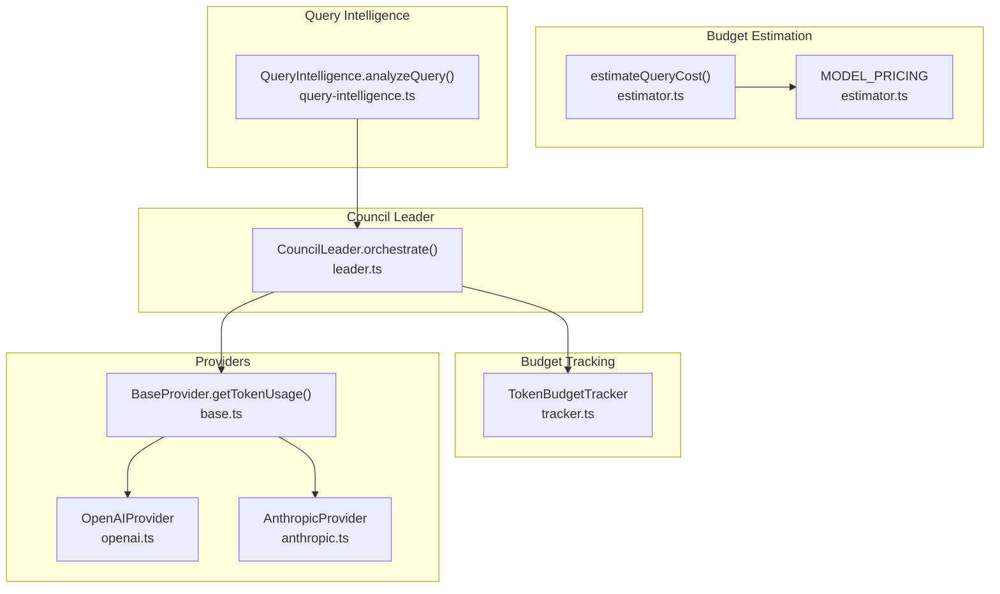
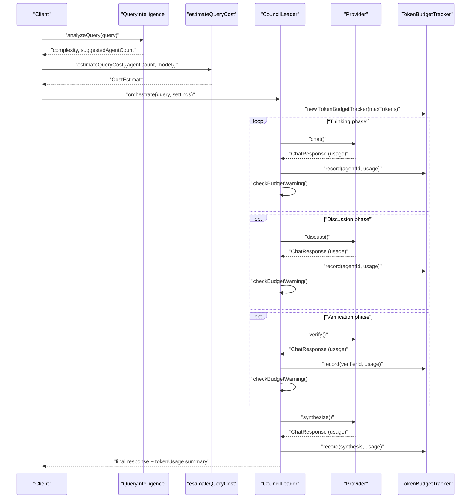
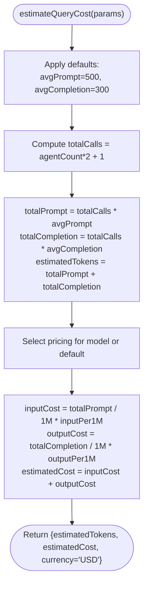
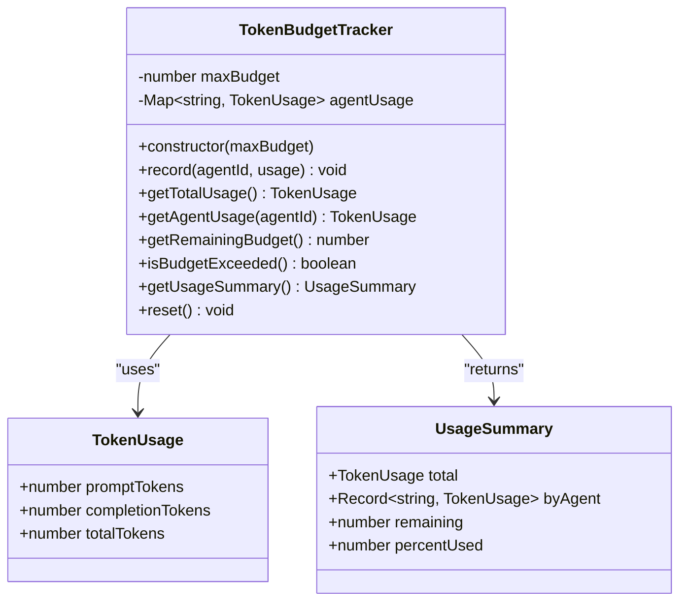
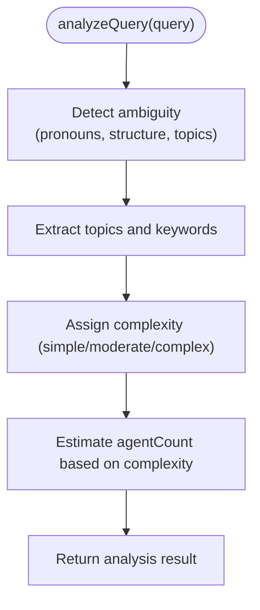
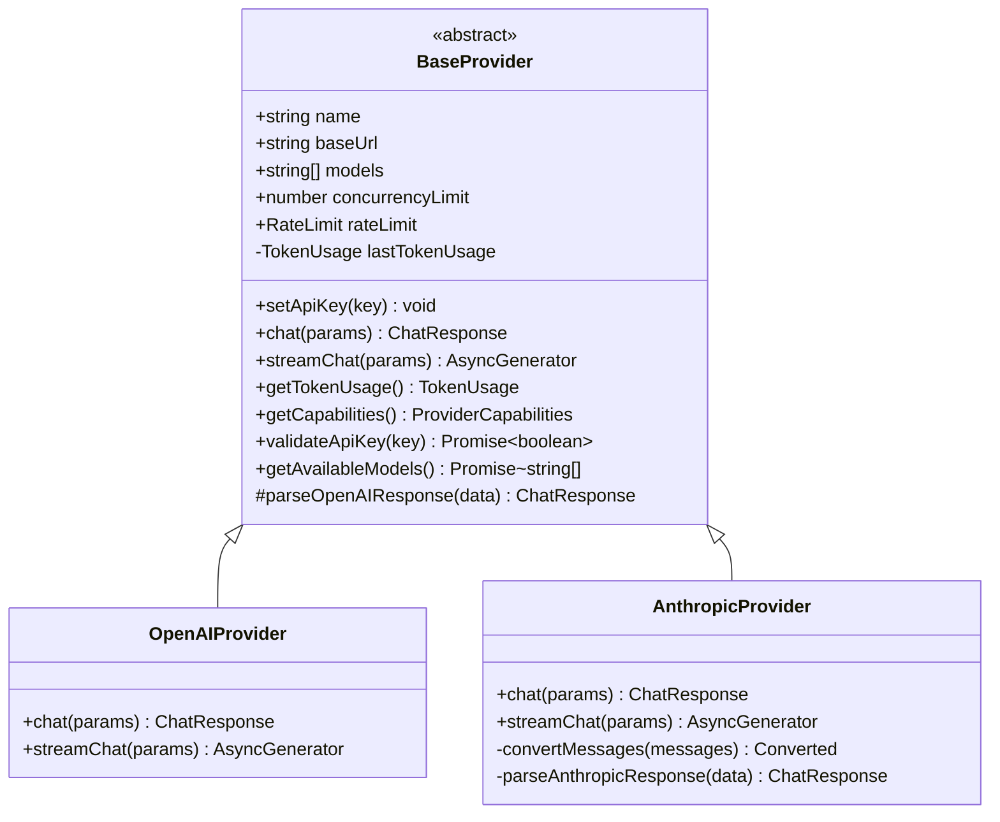
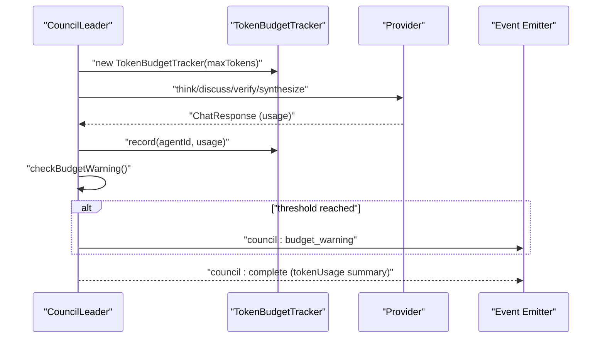
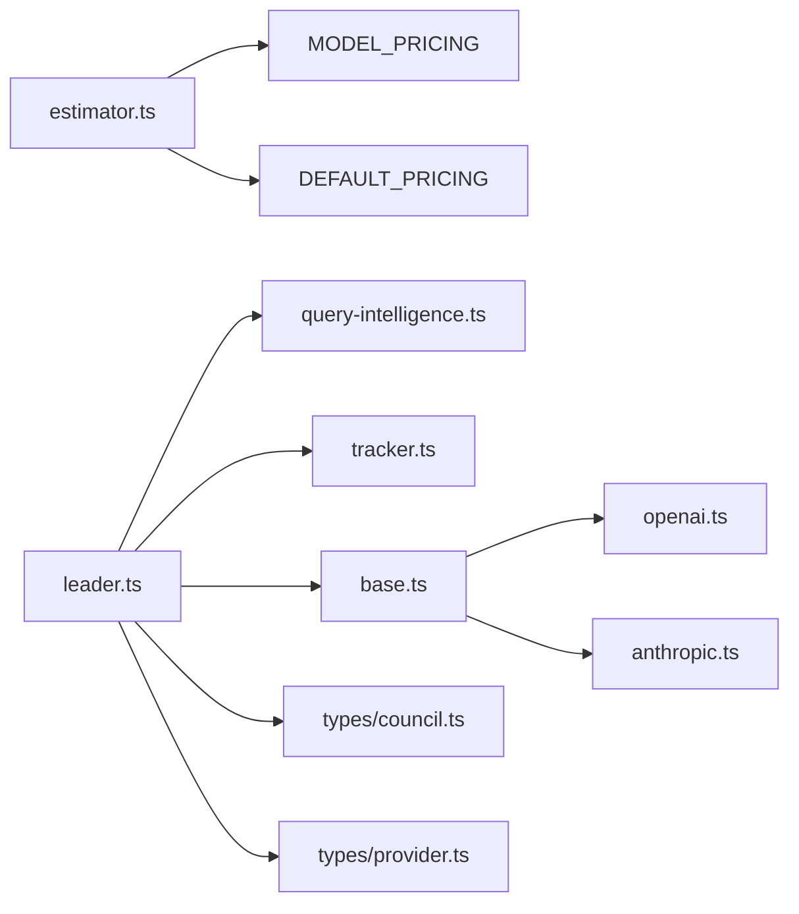

# Cost Estimation and Prediction

<cite>
**Referenced Files in This Document**
- [estimator.ts](file://src/core/budget/estimator.ts)
- [tracker.ts](file://src/core/budget/tracker.ts)
- [leader.ts](file://src/core/council/leader.ts)
- [query-intelligence.ts](file://src/lib/query-intelligence.ts)
- [base.ts](file://src/core/providers/base.ts)
- [openai.ts](file://src/core/providers/openai.ts)
- [anthropic.ts](file://src/core/providers/anthropic.ts)
- [council.ts](file://src/types/council.ts)
- [provider.ts](file://src/types/provider.ts)
- [estimator.test.ts](file://src/__tests__/core/budget/estimator.test.ts)
- [tracker.test.ts](file://src/__tests__/core/budget/tracker.test.ts)
</cite>

## Table of Contents
1. [Introduction](#introduction)
2. [Project Structure](#project-structure)
3. [Core Components](#core-components)
4. [Architecture Overview](#architecture-overview)
5. [Detailed Component Analysis](#detailed-component-analysis)
6. [Dependency Analysis](#dependency-analysis)
7. [Performance Considerations](#performance-considerations)
8. [Troubleshooting Guide](#troubleshooting-guide)
9. [Conclusion](#conclusion)
10. [Appendices](#appendices)

## Introduction
This document explains the cost estimation and prediction system that enables pre-execution budget validation for complex multi-agent workflows. It covers how the system estimates costs based on query complexity, agent selection patterns, and provider pricing models, and how it integrates with the council leader to enforce budget constraints during execution. It also documents estimation algorithms, provider-specific cost variations, dynamic pricing considerations, and practical strategies for staying within budget constraints.

## Project Structure
The cost estimation system spans several modules:
- Budget estimation: computes approximate token usage and cost for a given agent count and model.
- Token budget tracking: accumulates actual token usage per agent and enforces budget limits.
- Query intelligence: analyzes query characteristics to inform agent selection and initial cost estimates.
- Provider integration: captures token usage from provider responses and streams.
- Council leader orchestration: coordinates multi-agent workflows and checks budget thresholds at key phases.

**Diagram sources**
- [estimator.ts:1-56](file://src/core/budget/estimator.ts#L1-L56)
- [tracker.ts:1-78](file://src/core/budget/tracker.ts#L1-L78)
- [query-intelligence.ts:1-240](file://src/lib/query-intelligence.ts#L1-L240)
- [base.ts:1-83](file://src/core/providers/base.ts#L1-L83)
- [openai.ts:1-134](file://src/core/providers/openai.ts#L1-L134)
- [anthropic.ts:1-215](file://src/core/providers/anthropic.ts#L1-L215)
- [leader.ts:1-714](file://src/core/council/leader.ts#L1-L714)

**Section sources**
- [estimator.ts:1-56](file://src/core/budget/estimator.ts#L1-L56)
- [tracker.ts:1-78](file://src/core/budget/tracker.ts#L1-L78)
- [query-intelligence.ts:1-240](file://src/lib/query-intelligence.ts#L1-L240)
- [base.ts:1-83](file://src/core/providers/base.ts#L1-L83)
- [openai.ts:1-134](file://src/core/providers/openai.ts#L1-L134)
- [anthropic.ts:1-215](file://src/core/providers/anthropic.ts#L1-L215)
- [leader.ts:1-714](file://src/core/council/leader.ts#L1-L714)

## Core Components
- CostEstimate and pricing model: The estimator defines a pricing structure per model and computes estimated tokens and cost for a given agent count and model. It accounts for thinking, discussion, and synthesis phases.
- TokenBudgetTracker: Tracks per-agent token usage and provides budget enforcement and reporting.
- QueryIntelligence: Provides query analysis, complexity assessment, and agent count estimation to guide budget planning.
- Providers: Capture token usage from chat responses and streaming, enabling real-time budget updates.
- CouncilLeader: Orchestrates the multi-agent workflow, integrates budget checks, and emits budget warnings.

**Section sources**
- [estimator.ts:1-56](file://src/core/budget/estimator.ts#L1-L56)
- [tracker.ts:1-78](file://src/core/budget/tracker.ts#L1-L78)
- [query-intelligence.ts:1-240](file://src/lib/query-intelligence.ts#L1-L240)
- [base.ts:1-83](file://src/core/providers/base.ts#L1-L83)
- [leader.ts:1-714](file://src/core/council/leader.ts#L1-L714)

## Architecture Overview
The system separates estimation from execution:
- Pre-execution: QueryIntelligence determines complexity and suggested agent count; estimateQueryCost computes approximate cost using provider pricing.
- Execution: CouncilLeader runs agents, records token usage via providers, and enforces budget thresholds.

**Diagram sources**
- [query-intelligence.ts:55-137](file://src/lib/query-intelligence.ts#L55-L137)
- [estimator.ts:25-55](file://src/core/budget/estimator.ts#L25-L55)
- [leader.ts:42-624](file://src/core/council/leader.ts#L42-L624)
- [base.ts:25-27](file://src/core/providers/base.ts#L25-L27)
- [openai.ts:26-62](file://src/core/providers/openai.ts#L26-L62)
- [anthropic.ts:51-92](file://src/core/providers/anthropic.ts#L51-L92)

## Detailed Component Analysis

### Cost Estimation Algorithm
The estimator computes approximate cost before execution:
- Phases considered: thinking (agentCount calls), discussion (agentCount calls), synthesis (1 call).
- Total calls = 2 × agentCount + 1.
- Total prompt and completion tokens computed from average token sizes.
- Cost derived from provider pricing per million input/output tokens.

**Diagram sources**
- [estimator.ts:25-55](file://src/core/budget/estimator.ts#L25-L55)

**Section sources**
- [estimator.ts:1-56](file://src/core/budget/estimator.ts#L1-L56)
- [estimator.test.ts:1-53](file://src/__tests__/core/budget/estimator.test.ts#L1-L53)

### Token Budget Tracking
The tracker maintains per-agent usage and enforces budget limits:
- Records cumulative usage per agent and total usage.
- Provides remaining budget, exceeded flag, and usage summary.
- Supports resetting and default budget initialization.

**Diagram sources**
- [tracker.ts:3-77](file://src/core/budget/tracker.ts#L3-L77)
- [provider.ts:19-24](file://src/types/provider.ts#L19-L24)

**Section sources**
- [tracker.ts:1-78](file://src/core/budget/tracker.ts#L1-L78)
- [tracker.test.ts:1-80](file://src/__tests__/core/budget/tracker.test.ts#L1-L80)

### Query Intelligence and Agent Count Estimation
QueryIntelligence analyzes queries to inform agent selection and cost planning:
- Detects ambiguity, complexity, and topics.
- Estimates agent count based on complexity.
- Suggests clarifications and optimizes query text.

**Diagram sources**
- [query-intelligence.ts:59-137](file://src/lib/query-intelligence.ts#L59-L137)

**Section sources**
- [query-intelligence.ts:1-240](file://src/lib/query-intelligence.ts#L1-L240)

### Provider Integration and Token Usage Capture
Providers capture token usage from responses and streams:
- BaseProvider exposes getTokenUsage to retrieve the last recorded usage.
- OpenAIProvider and AnthropicProvider parse usage from API responses and streaming events.

**Diagram sources**
- [base.ts:3-82](file://src/core/providers/base.ts#L3-L82)
- [openai.ts:4-134](file://src/core/providers/openai.ts#L4-L134)
- [anthropic.ts:9-215](file://src/core/providers/anthropic.ts#L9-L215)

**Section sources**
- [base.ts:1-83](file://src/core/providers/base.ts#L1-L83)
- [openai.ts:1-134](file://src/core/providers/openai.ts#L1-L134)
- [anthropic.ts:1-215](file://src/core/providers/anthropic.ts#L1-L215)

### Council Leader Orchestration and Budget Validation
The council leader coordinates multi-agent workflows and enforces budget constraints:
- Initializes TokenBudgetTracker from settings.
- Emits budget warnings when usage reaches threshold.
- Records token usage after each agent operation and at synthesis.
- Skips discussion/verification if budget exceeded.

**Diagram sources**
- [leader.ts:42-624](file://src/core/council/leader.ts#L42-L624)
- [tracker.ts:606-624](file://src/core/budget/tracker.ts#L606-L624)

**Section sources**
- [leader.ts:1-714](file://src/core/council/leader.ts#L1-L714)
- [council.ts:60-63](file://src/types/council.ts#L60-L63)

## Dependency Analysis
- Estimator depends on provider pricing constants and defaults.
- Tracker depends on TokenUsage type.
- Leader depends on QueryIntelligence, TokenBudgetTracker, providers, and emits budget events.
- Providers depend on BaseProvider and expose getTokenUsage.

**Diagram sources**
- [estimator.ts:12-20](file://src/core/budget/estimator.ts#L12-L20)
- [leader.ts:13-22](file://src/core/council/leader.ts#L13-L22)
- [base.ts:1-2](file://src/core/providers/base.ts#L1-L2)
- [openai.ts:1-2](file://src/core/providers/openai.ts#L1-L2)
- [anthropic.ts:1-2](file://src/core/providers/anthropic.ts#L1-L2)
- [council.ts:1-3](file://src/types/council.ts#L1-L3)
- [provider.ts:19-24](file://src/types/provider.ts#L19-L24)

**Section sources**
- [estimator.ts:1-56](file://src/core/budget/estimator.ts#L1-L56)
- [leader.ts:1-714](file://src/core/council/leader.ts#L1-L714)
- [base.ts:1-83](file://src/core/providers/base.ts#L1-L83)
- [provider.ts:1-66](file://src/types/provider.ts#L1-L66)
- [council.ts:1-114](file://src/types/council.ts#L1-L114)

## Performance Considerations
- Estimation is O(1) and lightweight; suitable for pre-execution checks.
- Token tracking is O(n) per agent update; minimal overhead.
- Provider usage capture occurs after each call; streaming support reduces latency.
- Budget warnings are checked after major phases to avoid frequent emissions.

[No sources needed since this section provides general guidance]

## Troubleshooting Guide
Common issues and resolutions:
- Unknown model in estimation: Uses default pricing; verify model availability and pricing configuration.
- Budget exceeded mid-workflow: Review agent count and reasoning depth; reduce agent count or increase budget.
- Streaming token usage not captured: Ensure provider implements streaming usage parsing; otherwise rely on non-streaming usage.
- Inaccurate cost estimates: Adjust average prompt/completion token defaults or supply explicit token averages.

**Section sources**
- [estimator.ts:45-48](file://src/core/budget/estimator.ts#L45-L48)
- [leader.ts:606-624](file://src/core/council/leader.ts#L606-L624)
- [anthropic.ts:158-174](file://src/core/providers/anthropic.ts#L158-L174)

## Conclusion
The cost estimation and prediction system provides a robust framework for pre-execution budget planning and runtime enforcement. By combining query intelligence, provider-aware pricing, and per-call token tracking, it enables predictable and controllable multi-agent workflows. Operators can optimize costs by tuning agent counts, reasoning depth, and provider models, and by leveraging budget warnings to adjust execution strategies.

[No sources needed since this section summarizes without analyzing specific files]

## Appendices

### Example Cost Prediction Scenarios
- Scenario A: 3 agents with GPT-4o
  - Estimate tokens: 5600; Estimated cost: ~$0.02975
  - Provider pricing: $2.5/input per million, $10/output per million
- Scenario B: 3 agents with Claude Sonnet
  - Estimate tokens: 5600; Estimated cost: ~$0.042
  - Provider pricing: $3/input per million, $15/output per million
- Scenario C: 1 agent with custom token averages
  - Prompt: 1000, Completion: 500; Estimated tokens: 4500
  - Default pricing applies for unknown model

**Section sources**
- [estimator.test.ts:3-51](file://src/__tests__/core/budget/estimator.test.ts#L3-L51)
- [estimator.ts:12-18](file://src/core/budget/estimator.ts#L12-L18)

### Estimation Accuracy Metrics
- Token estimation accuracy depends on representative average prompt/completion sizes and agent count.
- Actual usage may vary due to provider-specific tokenization, model differences, and streaming vs. non-streaming responses.
- Use historical token usage to refine average token assumptions over time.

[No sources needed since this section provides general guidance]

### Strategies for Staying Within Budget
- Reduce agent count for simple queries; increase for complex ones.
- Choose cost-effective models for initial phases; reserve higher-capability models for synthesis.
- Enable budget warnings and pause early if approaching limits.
- Optimize queries to reduce token usage (QueryIntelligence.optimizeQuery).
- Limit reasoning depth and verification rounds when budget-constrained.

[No sources needed since this section provides general guidance]

### Dynamic Pricing and Provider Variations
- Pricing per million tokens differs by provider and model; ensure MODEL_PRICING reflects current rates.
- Providers may offer different capabilities and context windows affecting token efficiency.
- Streaming responses can improve responsiveness and reduce latency; usage still contributes to budget.

**Section sources**
- [estimator.ts:12-20](file://src/core/budget/estimator.ts#L12-L20)
- [openai.ts:17-24](file://src/core/providers/openai.ts#L17-L24)
- [anthropic.ts:22-29](file://src/core/providers/anthropic.ts#L22-L29)