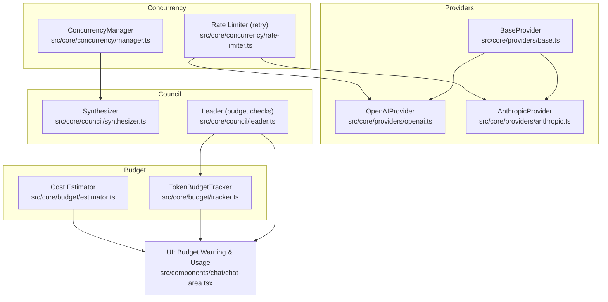
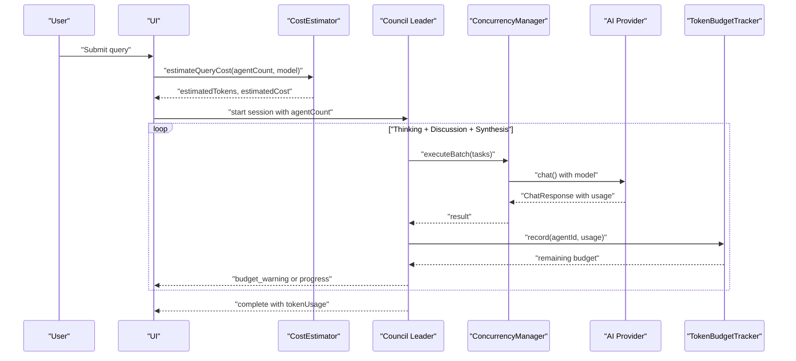
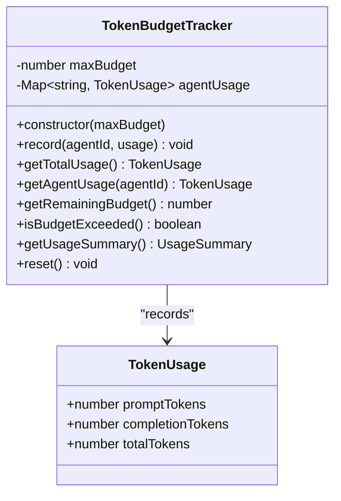
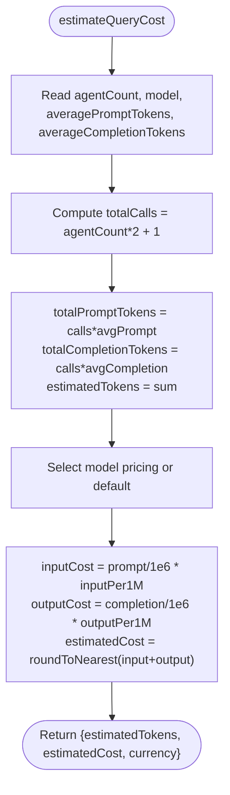
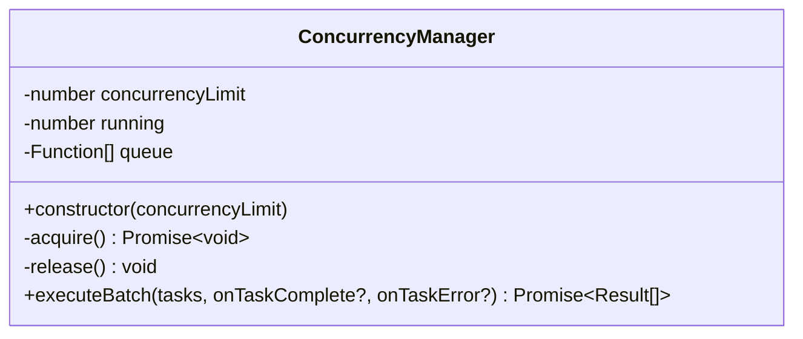
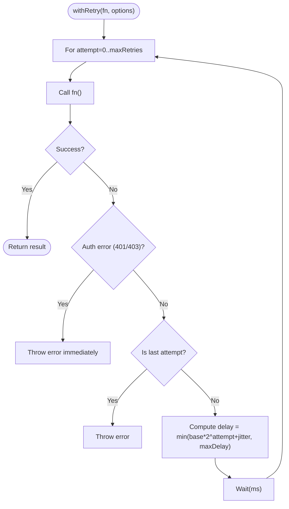
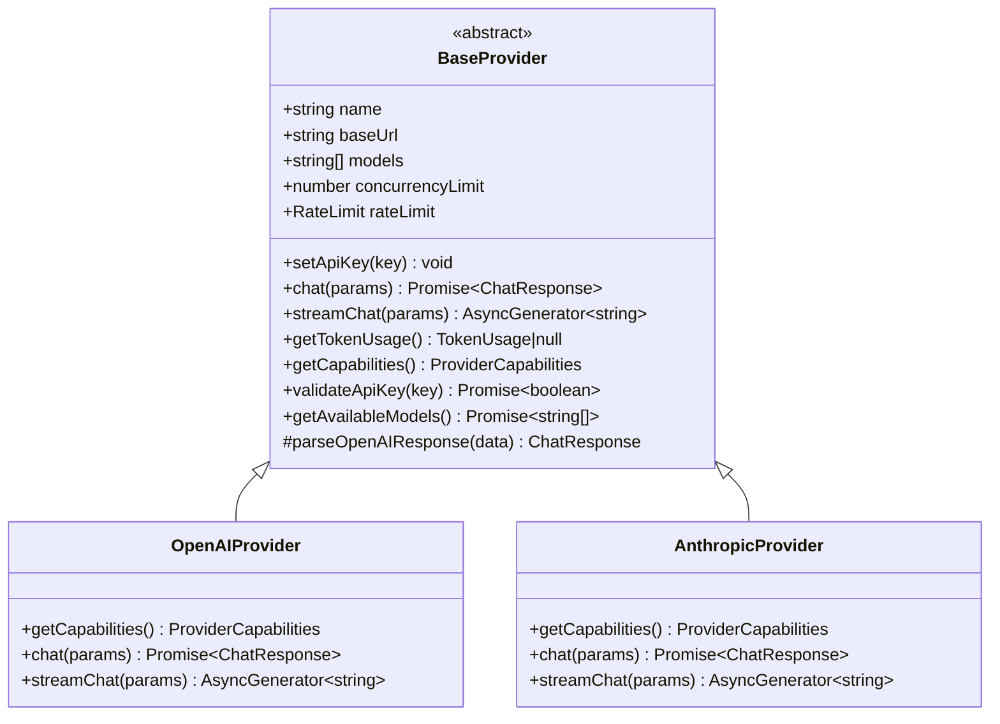
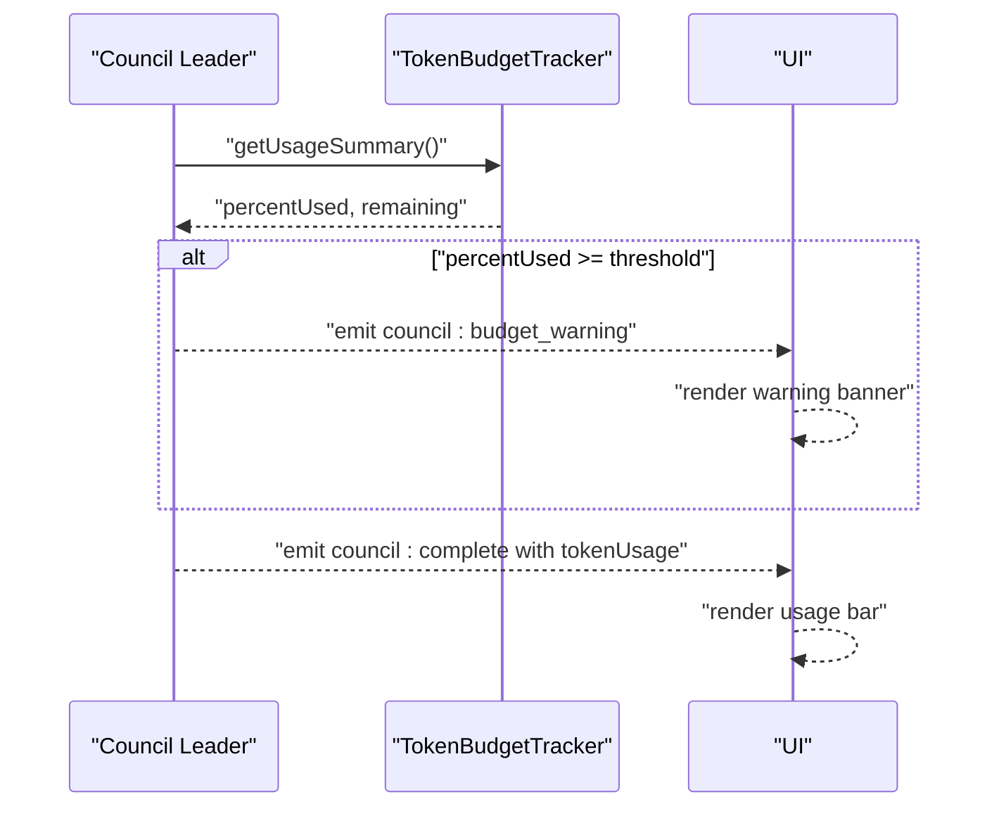
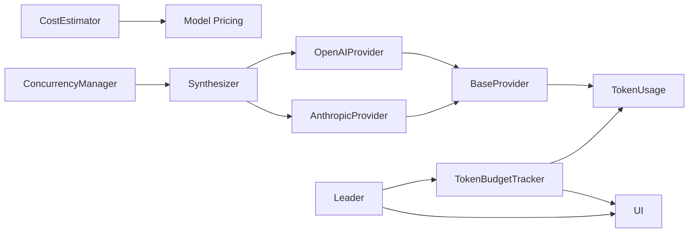

# Cost Management and Optimization

<cite>
**Referenced Files in This Document**
- [tracker.ts](file://src/core/budget/tracker.ts)
- [estimator.ts](file://src/core/budget/estimator.ts)
- [manager.ts](file://src/core/concurrency/manager.ts)
- [rate-limiter.ts](file://src/core/concurrency/rate-limiter.ts)
- [provider.ts](file://src/types/provider.ts)
- [council.ts](file://src/types/council.ts)
- [base.ts](file://src/core/providers/base.ts)
- [openai.ts](file://src/core/providers/openai.ts)
- [anthropic.ts](file://src/core/providers/anthropic.ts)
- [synthesizer.ts](file://src/core/council/synthesizer.ts)
- [leader.ts](file://src/core/council/leader.ts)
- [chat-area.tsx](file://src/components/chat/chat-area.tsx)
- [tracker.test.ts](file://src/__tests__/core/budget/tracker.test.ts)
- [estimator.test.ts](file://src/__tests__/core/budget/estimator.test.ts)
- [manager.test.ts](file://src/__tests__/core/concurrency/manager.test.ts)
</cite>

## Table of Contents
1. [Introduction](#introduction)
2. [Project Structure](#project-structure)
3. [Core Components](#core-components)
4. [Architecture Overview](#architecture-overview)
5. [Detailed Component Analysis](#detailed-component-analysis)
6. [Dependency Analysis](#dependency-analysis)
7. [Performance Considerations](#performance-considerations)
8. [Troubleshooting Guide](#troubleshooting-guide)
9. [Conclusion](#conclusion)
10. [Appendices](#appendices)

## Introduction
This document explains the cost management and optimization system that tracks token usage across AI provider interactions and agent executions, estimates costs before running complex multi-agent workflows, manages concurrency to balance performance and cost, and enforces rate limits for provider quotas. It also covers budget exceeded handling, optimization recommendations, and performance tuning guidelines with practical examples and configuration options.

## Project Structure
The cost management system spans several modules:
- Budget tracking: aggregates token usage per agent and computes remaining budget
- Cost estimation: predicts total tokens and USD cost for multi-agent workflows
- Concurrency control: limits simultaneous agent execution
- Rate limiting: retries with exponential backoff and respects provider quotas
- Providers: OpenAI and Anthropic integrations with token usage reporting
- UI integration: displays budget warnings and usage summaries

**Diagram sources**
- [tracker.ts:1-78](file://src/core/budget/tracker.ts#L1-L78)
- [estimator.ts:1-56](file://src/core/budget/estimator.ts#L1-L56)
- [manager.ts:1-55](file://src/core/concurrency/manager.ts#L1-L55)
- [rate-limiter.ts:1-41](file://src/core/concurrency/rate-limiter.ts#L1-L41)
- [base.ts:1-83](file://src/core/providers/base.ts#L1-L83)
- [openai.ts:1-134](file://src/core/providers/openai.ts#L1-L134)
- [anthropic.ts:1-215](file://src/core/providers/anthropic.ts#L1-L215)
- [synthesizer.ts:1-591](file://src/core/council/synthesizer.ts#L1-L591)
- [leader.ts:600-642](file://src/core/council/leader.ts#L600-L642)
- [chat-area.tsx:83-157](file://src/components/chat/chat-area.tsx#L83-L157)

**Section sources**
- [tracker.ts:1-78](file://src/core/budget/tracker.ts#L1-L78)
- [estimator.ts:1-56](file://src/core/budget/estimator.ts#L1-L56)
- [manager.ts:1-55](file://src/core/concurrency/manager.ts#L1-L55)
- [rate-limiter.ts:1-41](file://src/core/concurrency/rate-limiter.ts#L1-L41)
- [base.ts:1-83](file://src/core/providers/base.ts#L1-L83)
- [openai.ts:1-134](file://src/core/providers/openai.ts#L1-L134)
- [anthropic.ts:1-215](file://src/core/providers/anthropic.ts#L1-L215)
- [synthesizer.ts:1-591](file://src/core/council/synthesizer.ts#L1-L591)
- [leader.ts:600-642](file://src/core/council/leader.ts#L600-L642)
- [chat-area.tsx:83-157](file://src/components/chat/chat-area.tsx#L83-L157)

## Core Components
- TokenBudgetTracker: records per-agent token usage, computes totals, remaining budget, and provides usage summaries
- CostEstimator: estimates total tokens and USD cost for multi-agent workflows based on model pricing and call counts
- ConcurrencyManager: executes tasks with bounded concurrency and collects per-task results
- Rate Limiter (retry): wraps operations with exponential backoff and jitter, with authentication error short-circuit
- Providers: OpenAI and Anthropic implementations report token usage and enforce provider-specific rate limits and concurrency caps
- UI: displays budget warnings and usage bars during council sessions

**Section sources**
- [tracker.ts:3-77](file://src/core/budget/tracker.ts#L3-L77)
- [estimator.ts:25-55](file://src/core/budget/estimator.ts#L25-L55)
- [manager.ts:1-55](file://src/core/concurrency/manager.ts#L1-L55)
- [rate-limiter.ts:13-40](file://src/core/concurrency/rate-limiter.ts#L13-L40)
- [openai.ts:4-24](file://src/core/providers/openai.ts#L4-L24)
- [anthropic.ts:9-29](file://src/core/providers/anthropic.ts#L9-L29)
- [chat-area.tsx:83-157](file://src/components/chat/chat-area.tsx#L83-L157)

## Architecture Overview
The system orchestrates multi-agent reasoning with cost-awareness:
- Cost estimation runs before execution to decide agent count and model
- Providers return token usage after each call
- TokenBudgetTracker aggregates usage and emits budget warnings
- ConcurrencyManager controls parallelism to balance throughput and cost
- Rate limiter handles transient failures and respects provider quotas
- UI surfaces budget status and usage progress

**Diagram sources**
- [estimator.ts:25-55](file://src/core/budget/estimator.ts#L25-L55)
- [manager.ts:29-53](file://src/core/concurrency/manager.ts#L29-L53)
- [openai.ts:26-62](file://src/core/providers/openai.ts#L26-L62)
- [anthropic.ts:51-92](file://src/core/providers/anthropic.ts#L51-L92)
- [tracker.ts:11-22](file://src/core/budget/tracker.ts#L11-L22)
- [leader.ts:606-624](file://src/core/council/leader.ts#L606-L624)
- [chat-area.tsx:109-157](file://src/components/chat/chat-area.tsx#L109-L157)

## Detailed Component Analysis

### Token Budget Tracking
TokenBudgetTracker maintains per-agent usage and global totals, exposes remaining budget, and detects budget exceeded conditions. It supports reset and summary generation for UI and logging.

**Diagram sources**
- [tracker.ts:3-77](file://src/core/budget/tracker.ts#L3-L77)
- [provider.ts:19-24](file://src/types/provider.ts#L19-L24)

**Section sources**
- [tracker.ts:11-72](file://src/core/budget/tracker.ts#L11-L72)
- [tracker.test.ts:10-78](file://src/__tests__/core/budget/tracker.test.ts#L10-L78)

### Cost Estimation
CostEstimator predicts total tokens and USD cost for a multi-agent workflow. It computes total calls (thinking + discussion + synthesis), multiplies by average token counts, and applies model-specific pricing per 1M tokens.

**Diagram sources**
- [estimator.ts:25-55](file://src/core/budget/estimator.ts#L25-L55)

**Section sources**
- [estimator.ts:25-55](file://src/core/budget/estimator.ts#L25-L55)
- [estimator.test.ts:4-51](file://src/__tests__/core/budget/estimator.test.ts#L4-L51)

### Concurrency Management
ConcurrencyManager enforces a hard cap on concurrent tasks, queuing extras and releasing slots as tasks finish. It reports per-task outcomes via callbacks and ensures predictable resource usage.

**Diagram sources**
- [manager.ts:1-55](file://src/core/concurrency/manager.ts#L1-L55)

**Section sources**
- [manager.ts:10-53](file://src/core/concurrency/manager.ts#L10-L53)
- [manager.test.ts:20-35](file://src/__tests__/core/concurrency/manager.test.ts#L20-L35)

### Rate Limiting and Retries
The retry utility implements exponential backoff with jitter and a maximum retry policy. Authentication errors are not retried. Providers also define per-provider rate limits and concurrency caps.

**Diagram sources**
- [rate-limiter.ts:13-40](file://src/core/concurrency/rate-limiter.ts#L13-L40)

**Section sources**
- [rate-limiter.ts:13-40](file://src/core/concurrency/rate-limiter.ts#L13-L40)
- [openai.ts:8-9](file://src/core/providers/openai.ts#L8-L9)
- [anthropic.ts:13-14](file://src/core/providers/anthropic.ts#L13-L14)

### Provider Integrations and Token Usage
Providers implement BaseProvider and report token usage per call. OpenAI and Anthropic expose capabilities and enforce provider-specific rate limits and concurrency.

**Diagram sources**
- [base.ts:3-82](file://src/core/providers/base.ts#L3-L82)
- [openai.ts:4-134](file://src/core/providers/openai.ts#L4-L134)
- [anthropic.ts:9-215](file://src/core/providers/anthropic.ts#L9-L215)

**Section sources**
- [base.ts:17-82](file://src/core/providers/base.ts#L17-L82)
- [openai.ts:17-134](file://src/core/providers/openai.ts#L17-L134)
- [anthropic.ts:22-215](file://src/core/providers/anthropic.ts#L22-L215)

### Budget Warning and UI Integration
The council leader periodically checks budget usage against a configured threshold and emits a budget warning event. The UI listens for this event and renders a banner and usage bar.

**Diagram sources**
- [leader.ts:606-624](file://src/core/council/leader.ts#L606-L624)
- [tracker.ts:60-71](file://src/core/budget/tracker.ts#L60-L71)
- [chat-area.tsx:109-157](file://src/components/chat/chat-area.tsx#L109-L157)

**Section sources**
- [leader.ts:606-624](file://src/core/council/leader.ts#L606-L624)
- [chat-area.tsx:83-157](file://src/components/chat/chat-area.tsx#L83-L157)

## Dependency Analysis
- CostEstimator depends on model pricing constants and call-count logic
- ConcurrencyManager coordinates task execution and releases slots
- Providers depend on BaseProvider and report TokenUsage
- TokenBudgetTracker aggregates usage from providers
- UI subscribes to SSE events emitted by the council leader

**Diagram sources**
- [estimator.ts:12-18](file://src/core/budget/estimator.ts#L12-L18)
- [manager.ts:29-53](file://src/core/concurrency/manager.ts#L29-L53)
- [synthesizer.ts:333-371](file://src/core/council/synthesizer.ts#L333-L371)
- [openai.ts:26-62](file://src/core/providers/openai.ts#L26-L62)
- [anthropic.ts:51-92](file://src/core/providers/anthropic.ts#L51-L92)
- [base.ts:58-81](file://src/core/providers/base.ts#L58-L81)
- [tracker.ts:11-22](file://src/core/budget/tracker.ts#L11-L22)
- [leader.ts:606-624](file://src/core/council/leader.ts#L606-L624)
- [chat-area.tsx:109-157](file://src/components/chat/chat-area.tsx#L109-L157)

**Section sources**
- [estimator.ts:12-18](file://src/core/budget/estimator.ts#L12-L18)
- [manager.ts:29-53](file://src/core/concurrency/manager.ts#L29-L53)
- [synthesizer.ts:333-371](file://src/core/council/synthesizer.ts#L333-L371)
- [openai.ts:26-62](file://src/core/providers/openai.ts#L26-L62)
- [anthropic.ts:51-92](file://src/core/providers/anthropic.ts#L51-L92)
- [base.ts:58-81](file://src/core/providers/base.ts#L58-L81)
- [tracker.ts:11-22](file://src/core/budget/tracker.ts#L11-L22)
- [leader.ts:606-624](file://src/core/council/leader.ts#L606-L624)
- [chat-area.tsx:109-157](file://src/components/chat/chat-area.tsx#L109-L157)

## Performance Considerations
- Concurrency tuning: Lower concurrency reduces peak token usage and cost; higher concurrency increases throughput but may raise cost and risk quota violations. Adjust the concurrency limit based on provider RPM/TPM and model prices.
- Retry strategy: Use conservative maxRetries and baseDelay to avoid amplifying cost spikes from repeated failed requests.
- Token averaging: Accurate averagePromptTokens and averageCompletionTokens improve estimation precision and reduce over-allocation.
- Provider selection: Choose models with lower input/output costs per 1M tokens for budget-sensitive workflows.
- Early termination: Stop execution when budget warning threshold is reached to prevent further spending.

[No sources needed since this section provides general guidance]

## Troubleshooting Guide
- Budget exceeded: Verify TokenBudgetTracker totals and remaining budget. Check per-agent usage and adjust agent count or model.
- Excessive retries: Review retry options and provider error codes. Authentication errors are intentionally not retried.
- Provider quota exceeded: Respect provider rate limits and concurrency caps; consider switching providers or reducing parallelism.
- UI not showing warnings: Ensure the SSE handler captures budget_warning events and updates state.

**Section sources**
- [tracker.ts:46-53](file://src/core/budget/tracker.ts#L46-L53)
- [rate-limiter.ts:25-28](file://src/core/concurrency/rate-limiter.ts#L25-L28)
- [openai.ts:8-9](file://src/core/providers/openai.ts#L8-L9)
- [anthropic.ts:13-14](file://src/core/providers/anthropic.ts#L13-L14)
- [chat-area.tsx:114-138](file://src/components/chat/chat-area.tsx#L114-L138)

## Conclusion
The system combines precise token accounting, forward-looking cost estimation, controlled concurrency, and robust retry logic to keep multi-agent workflows both performant and cost-efficient. By monitoring budget warnings and aligning concurrency with provider quotas, teams can optimize for cost while maintaining responsiveness.

[No sources needed since this section summarizes without analyzing specific files]

## Appendices

### Budget Configuration Options
- Max tokens: set via TokenBudgetConfig.maxTokens
- Warning threshold: set via TokenBudgetConfig.warnThreshold (fraction 0..1)
- Defaults: TokenBudgetTracker default max is 100000

**Section sources**
- [council.ts:60-63](file://src/types/council.ts#L60-L63)
- [tracker.ts:7-8](file://src/core/budget/tracker.ts#L7-L8)
- [tracker.test.ts:75-78](file://src/__tests__/core/budget/tracker.test.ts#L75-L78)

### Cost Calculation Scenarios
- Scenario A: 3 agents with GPT-4o
  - totalCalls = 7
  - promptTokens = 3500, completionTokens = 2100
  - estimatedTokens = 5600
  - estimatedCost ≈ $0.02975
- Scenario B: 5 agents with Claude Sonnet
  - totalCalls = 11
  - promptTokens = 5500, completionTokens = 3300
  - estimatedTokens = 8800
  - estimatedCost ≈ $0.042
- Scenario C: Unknown model fallback
  - Default pricing applied
  - estimatedCost computed using default inputPer1M and outputPer1M

**Section sources**
- [estimator.test.ts:4-51](file://src/__tests__/core/budget/estimator.test.ts#L4-L51)

### Optimization Strategies by Use Case
- Low-cost exploration: Reduce agentCount, choose cheaper models, lower concurrency, and increase retry delays conservatively
- High-throughput synthesis: Increase concurrency up to provider limits, monitor budget warnings, and consider batching with ConcurrencyManager
- Stability-first: Use smaller average token sizes, enable early termination on budget warning, and prefer providers with higher RPM/TPM

[No sources needed since this section provides general guidance]