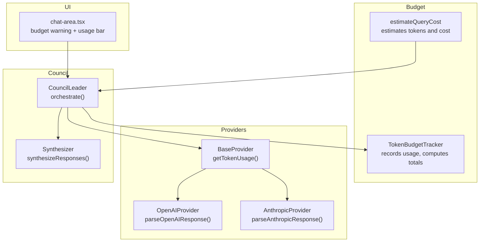
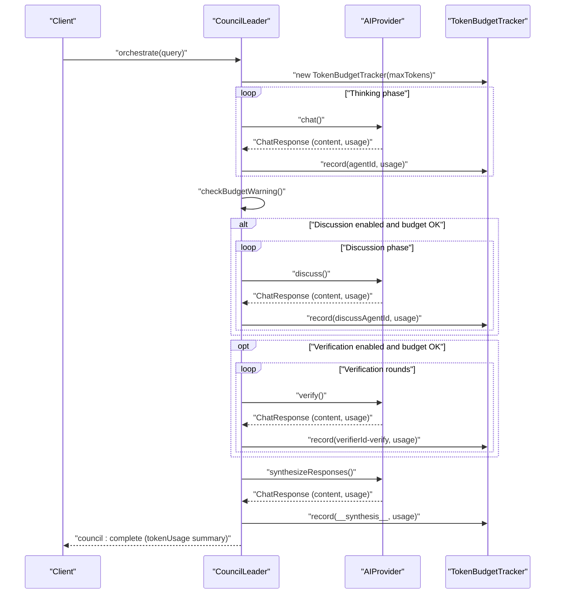
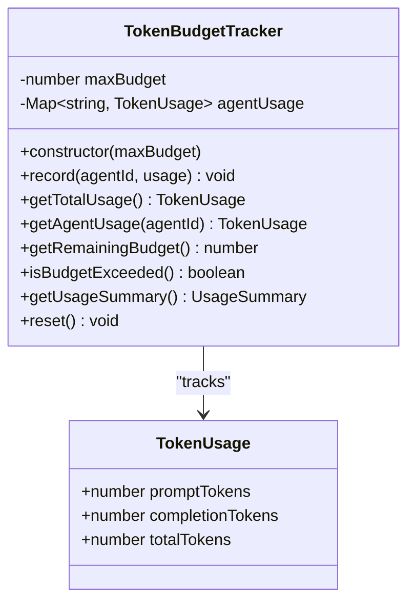
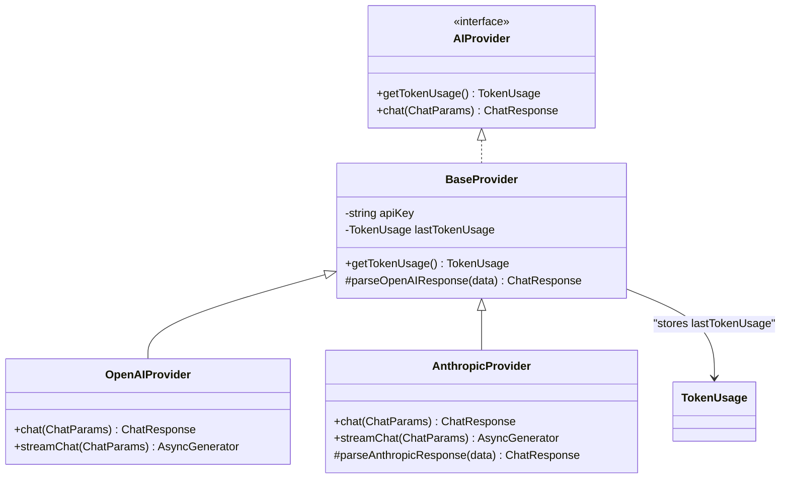
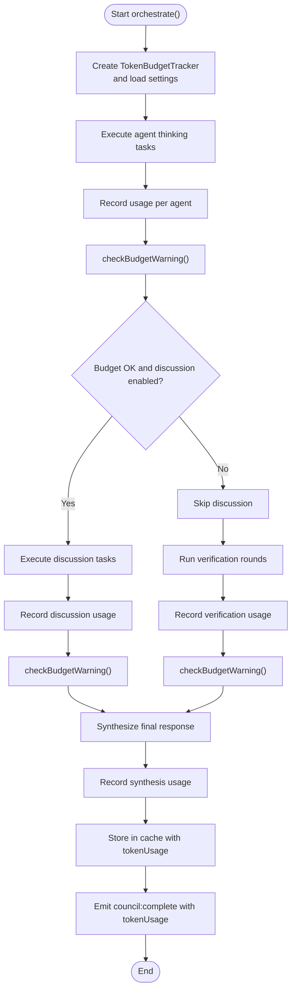
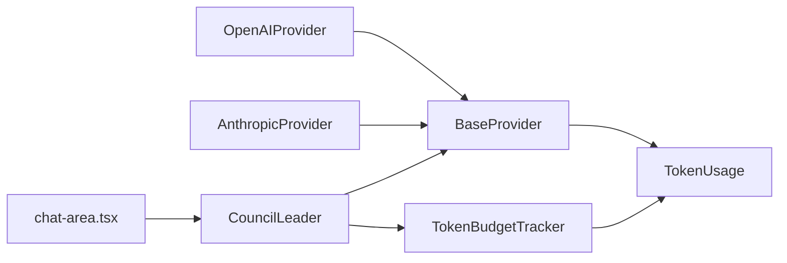

# Token Budget Tracking

<cite>
**Referenced Files in This Document**
- [tracker.ts](file://src/core/budget/tracker.ts)
- [estimator.ts](file://src/core/budget/estimator.ts)
- [provider.ts](file://src/types/provider.ts)
- [base.ts](file://src/core/providers/base.ts)
- [openai.ts](file://src/core/providers/openai.ts)
- [anthropic.ts](file://src/core/providers/anthropic.ts)
- [leader.ts](file://src/core/council/leader.ts)
- [synthesizer.ts](file://src/core/council/synthesizer.ts)
- [chat-area.tsx](file://src/components/chat/chat-area.tsx)
- [index.ts](file://src/types/index.ts)
- [tracker.test.ts](file://src/__tests__/core/budget/tracker.test.ts)
- [estimator.test.ts](file://src/__tests__/core/budget/estimator.test.ts)
</cite>

## Table of Contents
1. [Introduction](#introduction)
2. [Project Structure](#project-structure)
3. [Core Components](#core-components)
4. [Architecture Overview](#architecture-overview)
5. [Detailed Component Analysis](#detailed-component-analysis)
6. [Dependency Analysis](#dependency-analysis)
7. [Performance Considerations](#performance-considerations)
8. [Troubleshooting Guide](#troubleshooting-guide)
9. [Conclusion](#conclusion)
10. [Appendices](#appendices)

## Introduction
This document explains the token budget tracking system used to monitor token usage across AI provider interactions and agent executions in the Deep Thinking AI council. It focuses on the TokenBudgetTracker class, the TokenUsage interface, and how budget enforcement integrates with the council leadership system to provide real-time warnings and enforce limits during multi-agent workflows.

## Project Structure
The token budget tracking spans several modules:
- Budget tracking core: TokenBudgetTracker
- Cost estimation: estimateQueryCost
- Provider integrations: OpenAIProvider, AnthropicProvider, and BaseProvider
- Council leadership: TokenBudgetTracker instantiation and usage checks
- UI integration: Budget warning and usage display
- Type definitions: TokenUsage interface

**Diagram sources**
- [tracker.ts:1-77](file://src/core/budget/tracker.ts#L1-L77)
- [estimator.ts:1-56](file://src/core/budget/estimator.ts#L1-L56)
- [base.ts:1-83](file://src/core/providers/base.ts#L1-L83)
- [openai.ts:1-134](file://src/core/providers/openai.ts#L1-L134)
- [anthropic.ts:1-215](file://src/core/providers/anthropic.ts#L1-L215)
- [leader.ts:1-714](file://src/core/council/leader.ts#L1-L714)
- [synthesizer.ts:1-591](file://src/core/council/synthesizer.ts#L1-L591)
- [chat-area.tsx:83-157](file://src/components/chat/chat-area.tsx#L83-L157)

**Section sources**
- [tracker.ts:1-77](file://src/core/budget/tracker.ts#L1-L77)
- [estimator.ts:1-56](file://src/core/budget/estimator.ts#L1-L56)
- [provider.ts:1-66](file://src/types/provider.ts#L1-L66)
- [base.ts:1-83](file://src/core/providers/base.ts#L1-L83)
- [openai.ts:1-134](file://src/core/providers/openai.ts#L1-L134)
- [anthropic.ts:1-215](file://src/core/providers/anthropic.ts#L1-L215)
- [leader.ts:1-714](file://src/core/council/leader.ts#L1-L714)
- [synthesizer.ts:1-591](file://src/core/council/synthesizer.ts#L1-L591)
- [chat-area.tsx:83-157](file://src/components/chat/chat-area.tsx#L83-L157)
- [index.ts:1-7](file://src/types/index.ts#L1-L7)

## Core Components
- TokenBudgetTracker: central class that accumulates per-agent token usage, computes totals, detects budget exceeded, calculates remaining budget, and generates usage summaries. It exposes methods to record usage, query totals, query per-agent usage, check budget status, and reset.
- TokenUsage interface: defines the shape of token usage statistics returned by providers and tracked by the system: promptTokens, completionTokens, totalTokens.
- Provider integrations: Providers implement getTokenUsage() to expose the latest usage captured after each call. OpenAIProvider and AnthropicProvider parse provider responses and update lastTokenUsage accordingly.
- CouncilLeader: orchestrates multi-agent workflows, instantiates TokenBudgetTracker, records usage after agent thinking, discussion, verification, and synthesis, and emits budget warnings and final usage summaries.
- UI integration: chat-area.tsx subscribes to SSE events to show budget warnings and usage bars.

**Section sources**
- [tracker.ts:1-77](file://src/core/budget/tracker.ts#L1-L77)
- [provider.ts:19-24](file://src/types/provider.ts#L19-L24)
- [base.ts:25-27](file://src/core/providers/base.ts#L25-L27)
- [openai.ts:58-80](file://src/core/providers/openai.ts#L58-L80)
- [anthropic.ts:188-213](file://src/core/providers/anthropic.ts#L188-L213)
- [leader.ts:49-624](file://src/core/council/leader.ts#L49-L624)
- [chat-area.tsx:83-157](file://src/components/chat/chat-area.tsx#L83-L157)

## Architecture Overview
The budget tracking system is integrated into the council leadership pipeline. After each major step (thinking, discussion, verification, synthesis), the system queries the provider for the latest token usage and records it against the agent ID or special keys. It periodically checks budget thresholds and emits warnings. At the end of the session, it emits a complete usage summary.

**Diagram sources**
- [leader.ts:42-604](file://src/core/council/leader.ts#L42-L604)
- [tracker.ts:11-22](file://src/core/budget/tracker.ts#L11-L22)
- [base.ts:25-27](file://src/core/providers/base.ts#L25-L27)
- [openai.ts:26-62](file://src/core/providers/openai.ts#L26-L62)
- [anthropic.ts:51-92](file://src/core/providers/anthropic.ts#L51-L92)

## Detailed Component Analysis

### TokenBudgetTracker
TokenBudgetTracker maintains:
- maxBudget: configured budget limit
- agentUsage: a map from agentId to TokenUsage

Key behaviors:
- record(agentId, usage): merges usage into existing or creates a new entry
- getTotalUsage(): sums all agent usages
- getAgentUsage(agentId): returns per-agent usage or zeros
- getRemainingBudget(): max(0, maxBudget - totalTokens)
- isBudgetExceeded(): compares totalTokens to maxBudget
- getUsageSummary(): returns total, per-agent map, remaining, and percentUsed
- reset(): clears all recorded usage

**Diagram sources**
- [tracker.ts:3-77](file://src/core/budget/tracker.ts#L3-L77)
- [provider.ts:19-24](file://src/types/provider.ts#L19-L24)

**Section sources**
- [tracker.ts:1-77](file://src/core/budget/tracker.ts#L1-L77)
- [tracker.test.ts:1-79](file://src/__tests__/core/budget/tracker.test.ts#L1-L79)

### TokenUsage Interface
TokenUsage is the standardized representation of token consumption:
- promptTokens: tokens consumed by prompts
- completionTokens: tokens consumed by completions
- totalTokens: sum of promptTokens and completionTokens

It is defined in the provider types and used throughout the system.

**Section sources**
- [provider.ts:19-24](file://src/types/provider.ts#L19-L24)
- [index.ts:1-7](file://src/types/index.ts#L1-L7)

### Provider Integrations and Token Usage Capture
Providers implement getTokenUsage() to expose the last captured usage. BaseProvider stores lastTokenUsage and returns it. Concrete providers parse API responses and update lastTokenUsage:
- OpenAIProvider.parseOpenAIResponse(): extracts usage fields and updates lastTokenUsage
- AnthropicProvider.parseAnthropicResponse(): extracts input/output tokens and updates lastTokenUsage
- AnthropicProvider.streamChat(): updates lastTokenUsage incrementally during streaming

**Diagram sources**
- [provider.ts:45-57](file://src/types/provider.ts#L45-L57)
- [base.ts:3-83](file://src/core/providers/base.ts#L3-L83)
- [openai.ts:4-134](file://src/core/providers/openai.ts#L4-L134)
- [anthropic.ts:9-215](file://src/core/providers/anthropic.ts#L9-L215)

**Section sources**
- [base.ts:25-27](file://src/core/providers/base.ts#L25-L27)
- [openai.ts:58-80](file://src/core/providers/openai.ts#L58-L80)
- [anthropic.ts:188-213](file://src/core/providers/anthropic.ts#L188-L213)
- [anthropic.ts:158-174](file://src/core/providers/anthropic.ts#L158-L174)

### Council Leadership Integration
CouncilLeader coordinates multi-agent workflows and integrates budget tracking:
- Instantiates TokenBudgetTracker with settings.tokenBudget?.maxTokens or default
- Records usage after each agent thinking, discussion, verification, and synthesis
- Emits budget warnings when usage reaches warnThreshold without exceeding budget
- Emits final usage summary on completion

**Diagram sources**
- [leader.ts:42-604](file://src/core/council/leader.ts#L42-L604)
- [leader.ts:606-624](file://src/core/council/leader.ts#L606-L624)

**Section sources**
- [leader.ts:49-624](file://src/core/council/leader.ts#L49-L624)

### Cost Estimation
estimateQueryCost provides a high-level projection of tokens and cost for a council session given:
- agentCount: number of agents
- model: provider model identifier
- averagePromptTokens, averageCompletionTokens: defaults applied if not provided

It estimates total calls (thinking + discussion + synthesis), multiplies by averages, selects pricing per model, and computes estimated cost.

**Section sources**
- [estimator.ts:25-55](file://src/core/budget/estimator.ts#L25-L55)
- [estimator.test.ts:1-53](file://src/__tests__/core/budget/estimator.test.ts#L1-L53)

### UI Integration
The UI displays budget warnings and usage:
- BudgetWarningBanner: shows a warning when council:budget_warning is emitted
- TokenUsageBar: shows remaining tokens and usage summary when available

**Section sources**
- [chat-area.tsx:83-157](file://src/components/chat/chat-area.tsx#L83-L157)

## Dependency Analysis
- TokenBudgetTracker depends on TokenUsage from types.
- Providers depend on BaseProvider and update lastTokenUsage.
- CouncilLeader depends on TokenBudgetTracker and providers to record usage.
- UI depends on SSE events emitted by CouncilLeader.

**Diagram sources**
- [tracker.ts:1-77](file://src/core/budget/tracker.ts#L1-L77)
- [provider.ts:19-24](file://src/types/provider.ts#L19-L24)
- [base.ts:1-83](file://src/core/providers/base.ts#L1-L83)
- [openai.ts:1-134](file://src/core/providers/openai.ts#L1-L134)
- [anthropic.ts:1-215](file://src/core/providers/anthropic.ts#L1-L215)
- [leader.ts:1-714](file://src/core/council/leader.ts#L1-L714)
- [chat-area.tsx:83-157](file://src/components/chat/chat-area.tsx#L83-L157)

**Section sources**
- [tracker.ts:1-77](file://src/core/budget/tracker.ts#L1-L77)
- [provider.ts:19-24](file://src/types/provider.ts#L19-L24)
- [base.ts:1-83](file://src/core/providers/base.ts#L1-L83)
- [openai.ts:1-134](file://src/core/providers/openai.ts#L1-L134)
- [anthropic.ts:1-215](file://src/core/providers/anthropic.ts#L1-L215)
- [leader.ts:1-714](file://src/core/council/leader.ts#L1-L714)
- [chat-area.tsx:83-157](file://src/components/chat/chat-area.tsx#L83-L157)

## Performance Considerations
- TokenBudgetTracker uses a Map for O(1) average-time lookups and updates; total aggregation is linear in the number of agents.
- Providers update lastTokenUsage synchronously after each call; streaming providers update usage incrementally.
- Budget checks occur at key stages; keep warnThreshold reasonable to avoid excessive SSE emissions.

[No sources needed since this section provides general guidance]

## Troubleshooting Guide
Common issues and resolutions:
- Unexpected budget exceeded: verify that providers return accurate usage via getTokenUsage() and that record() is called after each provider call.
- Zero or missing per-agent usage: ensure agentId matches the ID used when recording; unknown agents return zeros.
- Budget warnings not shown: confirm warnThreshold is set appropriately and checkBudgetWarning() is invoked after each major stage.
- Reset not working: ensure reset() is called at the start of a new session and that new TokenBudgetTracker is instantiated.

**Section sources**
- [tracker.ts:38-44](file://src/core/budget/tracker.ts#L38-L44)
- [leader.ts:606-624](file://src/core/council/leader.ts#L606-L624)
- [chat-area.tsx:114-138](file://src/components/chat/chat-area.tsx#L114-L138)

## Conclusion
The token budget tracking system provides robust monitoring of token usage across AI provider interactions and multi-agent workflows. TokenBudgetTracker centralizes accumulation and reporting, while providers consistently expose usage via getTokenUsage(). The council leadership system integrates these capabilities to enforce budgets, emit warnings, and produce comprehensive usage summaries. The UI surfaces real-time budget insights to users.

[No sources needed since this section summarizes without analyzing specific files]

## Appendices

### Example Workflows

- Recording usage after agent thinking:
  - Call provider.chat() to get a response
  - Retrieve usage via provider.getTokenUsage()
  - Record usage with tracker.record(agentId, usage)

- Querying agent-specific statistics:
  - Use tracker.getAgentUsage(agentId) to retrieve per-agent totals

- Implementing budget monitoring in multi-agent workflows:
  - Instantiate TokenBudgetTracker at the start of orchestrate()
  - Record usage after thinking, discussion, verification, and synthesis
  - Emit budget warnings via checkBudgetWarning() at key stages
  - On completion, emit council:complete with tokenUsage summary

- Resetting usage:
  - Call tracker.reset() to clear all accumulated usage

**Section sources**
- [leader.ts:293-297](file://src/core/council/leader.ts#L293-L297)
- [leader.ts:399-403](file://src/core/council/leader.ts#L399-L403)
- [leader.ts:469-473](file://src/core/council/leader.ts#L469-L473)
- [leader.ts:571-575](file://src/core/council/leader.ts#L571-L575)
- [tracker.ts:74-76](file://src/core/budget/tracker.ts#L74-L76)