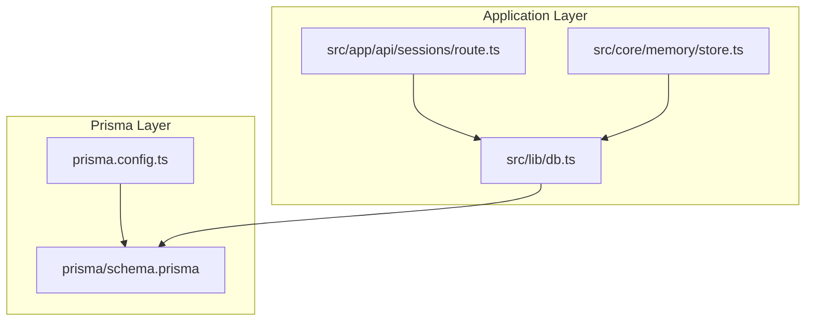
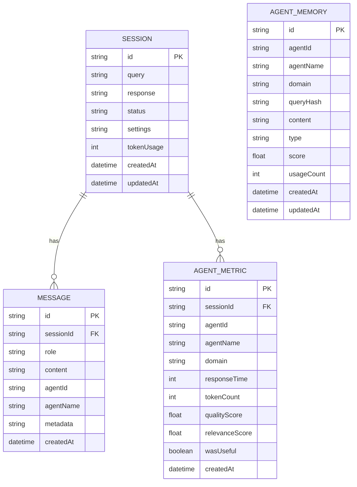
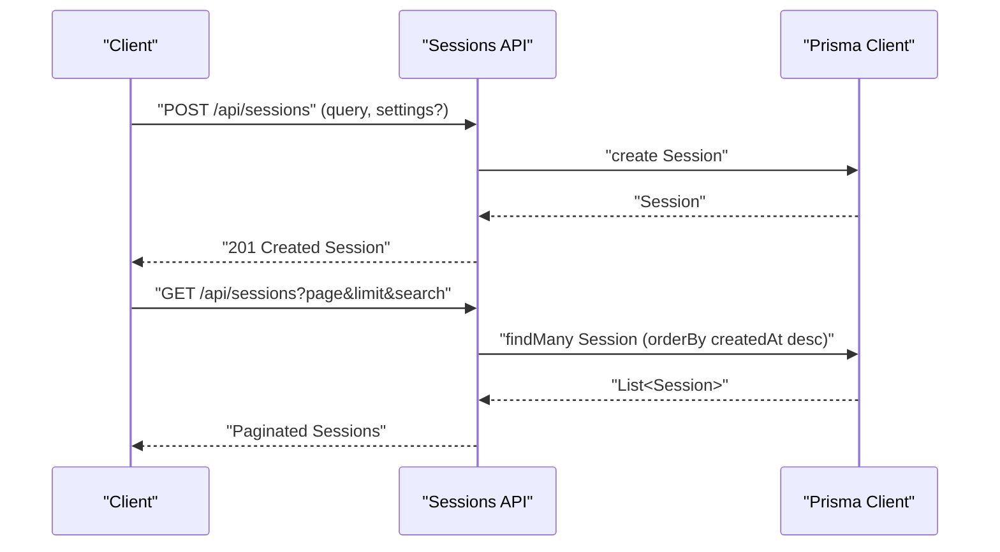
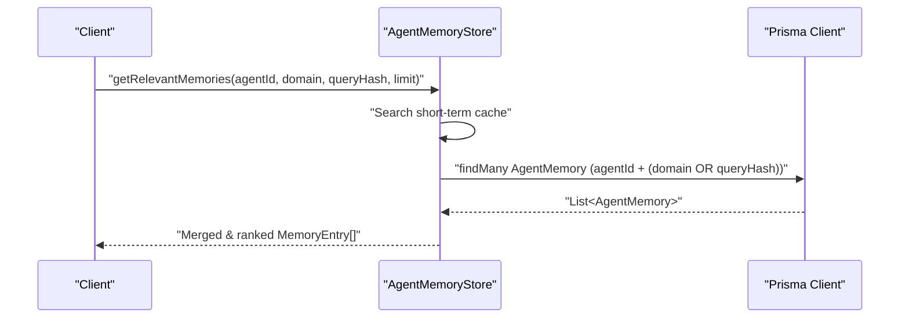
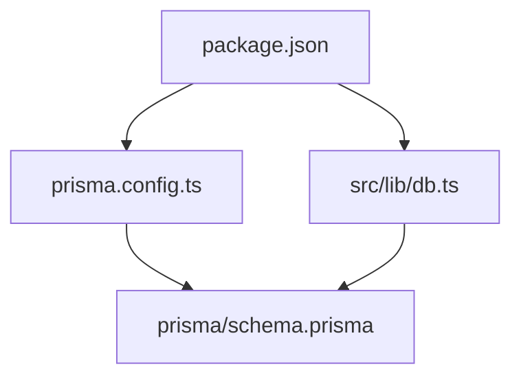

# Database Schema Design

<cite>
**Referenced Files in This Document**
- [schema.prisma](file://prisma/schema.prisma)
- [prisma.config.ts](file://prisma.config.ts)
- [db.ts](file://src/lib/db.ts)
- [store.ts](file://src/core/memory/store.ts)
- [route.ts](file://src/app/api/sessions/route.ts)
- [package.json](file://package.json)
</cite>

## Table of Contents
1. [Introduction](#introduction)
2. [Project Structure](#project-structure)
3. [Core Components](#core-components)
4. [Architecture Overview](#architecture-overview)
5. [Detailed Component Analysis](#detailed-component-analysis)
6. [Dependency Analysis](#dependency-analysis)
7. [Performance Considerations](#performance-considerations)
8. [Troubleshooting Guide](#troubleshooting-guide)
9. [Conclusion](#conclusion)
10. [Appendices](#appendices)

## Introduction
This document provides comprehensive data model documentation for the Prisma ORM schema used by the application. It covers the database schema for Session, Message, AgentMetric, and AgentMemory models, including field definitions, data types, constraints, relationships, indexing strategy, foreign key constraints, cascade deletion policies, JSON field usage, default value configurations, and timestamp management. It also explains how these relationships support the multi-agent system’s operational requirements, outlines common database queries, migration processes, and data integrity considerations for the SQLite-based architecture.

## Project Structure
The database schema is defined in a single Prisma schema file and configured via a dedicated Prisma config. The application uses a SQLite adapter for Prisma and exposes REST endpoints that interact with the database through the Prisma client.

**Diagram sources**
- [prisma.config.ts:1-15](file://prisma.config.ts#L1-L15)
- [schema.prisma:1-66](file://prisma/schema.prisma#L1-L66)
- [db.ts:1-22](file://src/lib/db.ts#L1-L22)
- [route.ts:1-91](file://src/app/api/sessions/route.ts#L1-L91)
- [store.ts:1-253](file://src/core/memory/store.ts#L1-L253)

**Section sources**
- [prisma.config.ts:1-15](file://prisma.config.ts#L1-L15)
- [schema.prisma:1-66](file://prisma/schema.prisma#L1-L66)
- [db.ts:1-22](file://src/lib/db.ts#L1-L22)
- [route.ts:1-91](file://src/app/api/sessions/route.ts#L1-L91)
- [store.ts:1-253](file://src/core/memory/store.ts#L1-L253)

## Core Components
This section documents each model in the schema, including fields, types, defaults, and constraints.

- Session
  - Purpose: Represents a conversational session with lifecycle and configuration.
  - Fields:
    - id: String (primary key, default cuid)
    - query: String
    - response: String? (nullable)
    - status: String (default "active")
    - settings: String? (JSON string of council settings)
    - tokenUsage: Int (default 0)
    - createdAt: DateTime (default now)
    - updatedAt: DateTime (@updatedAt)
    - relations: messages (one-to-many), agentMetrics (one-to-many)

- Message
  - Purpose: Stores individual messages exchanged during a session.
  - Fields:
    - id: String (primary key, default cuid)
    - sessionId: String (foreign key)
    - role: String (values: user, assistant, system, agent)
    - content: String
    - agentId: String? (nullable; null for user/system)
    - agentName: String?
    - metadata: String? (JSON string for extra data)
    - createdAt: DateTime (default now)
    - relation: session (many-to-one, onDelete Cascade)

- AgentMetric
  - Purpose: Tracks per-agent performance and feedback metrics within a session.
  - Fields:
    - id: String (primary key, default cuid)
    - sessionId: String (foreign key)
    - agentId: String
    - agentName: String
    - domain: String
    - responseTime: Int (milliseconds)
    - tokenCount: Int (default 0)
    - qualityScore: Float? (0–1, set by feedback)
    - relevanceScore: Float? (0–1)
    - wasUseful: Boolean? (user feedback)
    - createdAt: DateTime (default now)
    - relation: session (many-to-one, onDelete Cascade)

- AgentMemory
  - Purpose: Stores reusable knowledge items for agents with relevance scoring and usage tracking.
  - Fields:
    - id: String (primary key, default cuid)
    - agentId: String
    - agentName: String
    - domain: String
    - queryHash: String (hash of the query this memory relates to)
    - content: String (memory content)
    - type: String ("response", "pattern", "few_shot")
    - score: Float (default 0)
    - usageCount: Int (default 0)
    - createdAt: DateTime (default now)
    - updatedAt: DateTime (@updatedAt)
    - indexes: composite (agentId, domain), single (queryHash)

Constraints and defaults:
- All primary keys use String with cuid() default.
- Timestamps use DateTime with default now() and updatedAt where applicable.
- JSON fields are stored as Strings and intended to hold serialized JSON payloads.
- Foreign keys enforce referential integrity with onDelete Cascade for Message and AgentMetric.

**Section sources**
- [schema.prisma:10-65](file://prisma/schema.prisma#L10-L65)

## Architecture Overview
The database architecture centers around the Session model as the root entity. Messages and AgentMetrics are child entities linked to a Session via foreign keys with cascade deletion enabled. AgentMemory is a standalone persistence model for long-term knowledge with targeted indexes to optimize lookups by agent and query hash.

**Diagram sources**
- [schema.prisma:10-65](file://prisma/schema.prisma#L10-L65)

## Detailed Component Analysis

### Session Model
- Responsibilities:
  - Encapsulates a single conversational thread.
  - Tracks lifecycle via status and timestamps.
  - Stores optional configuration (settings) as JSON.
- Typical operations:
  - Create with query and optional settings.
  - List with pagination and filtering by query substring.
  - Delete multiple sessions by ID.

Common queries:
- Create a session with optional settings serialization.
- Paginated listing with search term filtering.
- Bulk deletion by IDs.

Operational notes:
- Settings are stored as JSON strings; consumers should serialize/deserialize appropriately.
- Token usage is tracked at the session level.

**Section sources**
- [schema.prisma:10-21](file://prisma/schema.prisma#L10-L21)
- [route.ts:37-64](file://src/app/api/sessions/route.ts#L37-L64)
- [route.ts:4-35](file://src/app/api/sessions/route.ts#L4-L35)

### Message Model
- Responsibilities:
  - Records all messages in a session, including user, system, assistant, and agent-generated messages.
  - Supports optional agent attribution and metadata.
- Relationships:
  - Many-to-one with Session; deletion of a session cascades to messages.
- Indexing:
  - No explicit indexes; cascade deletion ensures referential integrity.

Common queries:
- Fetch all messages for a session.
- Insert a new message with role, content, and optional agent metadata.

Operational notes:
- Metadata is stored as JSON strings; consumers should handle serialization.
- agentId is null for user/system messages.

**Section sources**
- [schema.prisma:23-33](file://prisma/schema.prisma#L23-L33)

### AgentMetric Model
- Responsibilities:
  - Captures per-agent performance metrics (response time, token count) and feedback scores.
  - Facilitates multi-agent evaluation and governance.
- Relationships:
  - Many-to-one with Session; deletion of a session cascades to metrics.

Common queries:
- Aggregate metrics per agent within a session.
- Compute averages and counts for reporting.

Operational notes:
- Scores are optional floats; feedback-driven updates populate quality and relevance metrics.

**Section sources**
- [schema.prisma:35-48](file://prisma/schema.prisma#L35-L48)

### AgentMemory Model
- Responsibilities:
  - Persists reusable knowledge items (responses, patterns, few-shot examples) for agents.
  - Maintains relevance score and usage count for retrieval prioritization.
- Indexing strategy:
  - Composite index on (agentId, domain) for efficient domain-scoped retrieval.
  - Single index on queryHash for fast lookup by query fingerprint.
- Persistence pattern:
  - Short-term in-memory cache per agent; asynchronous persistence to database.
  - Retrieval merges short-term and long-term results, sorting by score and recency.

Common queries:
- Find memories by agentId and either domain or queryHash.
- Retrieve top-N memories for an agent.
- Increment usageCount for a memory.
- Prune low-score memories beyond a threshold.

Operational notes:
- Content is stored as a JSON string; consumers should serialize structured data.
- Score and usageCount drive ranking and pruning strategies.

**Section sources**
- [schema.prisma:50-65](file://prisma/schema.prisma#L50-L65)
- [store.ts:46-83](file://src/core/memory/store.ts#L46-L83)
- [store.ts:88-118](file://src/core/memory/store.ts#L88-L118)
- [store.ts:123-142](file://src/core/memory/store.ts#L123-L142)
- [store.ts:159-175](file://src/core/memory/store.ts#L159-L175)

### Relationship Flow: Sessions → Messages and AgentMetrics

**Diagram sources**
- [route.ts:37-64](file://src/app/api/sessions/route.ts#L37-L64)
- [route.ts:4-35](file://src/app/api/sessions/route.ts#L4-L35)

### AgentMemory Retrieval Flow

**Diagram sources**
- [store.ts:46-83](file://src/core/memory/store.ts#L46-L83)

### Indexing Strategy
- AgentMemory
  - Composite index: (agentId, domain)
  - Single index: queryHash
- Message and AgentMetric
  - No explicit indexes; cascade deletion is enforced via foreign keys.
- Recommendations:
  - Consider adding indexes on Message(sessionId) and AgentMetric(sessionId) if frequent lookups by parent ID become a bottleneck.

**Section sources**
- [schema.prisma:63-64](file://prisma/schema.prisma#L63-L64)
- [schema.prisma:32](file://prisma/schema.prisma#L32)
- [schema.prisma:47](file://prisma/schema.prisma#L47)

### Foreign Keys and Cascade Deletion
- Message.sessionId → Session.id with onDelete Cascade
- AgentMetric.sessionId → Session.id with onDelete Cascade
- Implications:
  - Deleting a Session automatically deletes all associated Messages and AgentMetrics.
  - Ensures data consistency and simplifies cleanup.

**Section sources**
- [schema.prisma:32](file://prisma/schema.prisma#L32)
- [schema.prisma:47](file://prisma/schema.prisma#L47)

### JSON Field Usage
- Session.settings: JSON string of council settings.
- Message.metadata: JSON string for extra data.
- AgentMemory.content: JSON string for structured memory content.
- Best practices:
  - Validate JSON before insertion.
  - Use typed serialization/deserialization to avoid malformed payloads.

**Section sources**
- [schema.prisma:15](file://prisma/schema.prisma#L15)
- [schema.prisma:30](file://prisma/schema.prisma#L30)
- [schema.prisma:56](file://prisma/schema.prisma#L56)

### Default Values and Timestamp Management
- All String primary keys use cuid() default.
- Timestamps use DateTime with default now().
- updatedAt is managed automatically for Session and AgentMemory.
- Implications:
  - Consistent identity generation and auditability.
  - Automatic last-modified tracking for editable entities.

**Section sources**
- [schema.prisma:11](file://prisma/schema.prisma#L11)
- [schema.prisma:17](file://prisma/schema.prisma#L17)
- [schema.prisma:18](file://prisma/schema.prisma#L18)
- [schema.prisma:46](file://prisma/schema.prisma#L46)
- [schema.prisma:61](file://prisma/schema.prisma#L61)

### Multi-Agent Operational Requirements
- Sessions encapsulate multi-agent orchestration runs.
- Messages capture the conversation flow across roles.
- AgentMetrics quantify agent performance and feedback.
- AgentMemory enables persistent knowledge reuse across sessions.
- Cascade deletion ensures clean removal of ephemeral artifacts when a session ends.

**Section sources**
- [schema.prisma:19](file://prisma/schema.prisma#L19)
- [schema.prisma:20](file://prisma/schema.prisma#L20)
- [schema.prisma:42](file://prisma/schema.prisma#L42)
- [schema.prisma:58](file://prisma/schema.prisma#L58)

## Dependency Analysis
The application depends on Prisma for schema definition and client generation, and on the better-sqlite3 adapter for SQLite connectivity. The Prisma config defines the schema location and migration path, while the database client resolves the connection URL from environment variables.

**Diagram sources**
- [package.json:13-39](file://package.json#L13-L39)
- [prisma.config.ts:6-14](file://prisma.config.ts#L6-L14)
- [schema.prisma:1-4](file://prisma/schema.prisma#L1-L4)
- [db.ts:1-22](file://src/lib/db.ts#L1-L22)

**Section sources**
- [package.json:13-39](file://package.json#L13-L39)
- [prisma.config.ts:6-14](file://prisma.config.ts#L6-L14)
- [schema.prisma:1-4](file://prisma/schema.prisma#L1-L4)
- [db.ts:1-22](file://src/lib/db.ts#L1-L22)

## Performance Considerations
- Indexing:
  - AgentMemory has targeted indexes for agent-scoped and query-hash lookups.
  - Consider adding indexes on Message.sessionId and AgentMetric.sessionId for frequent parent-child queries.
- JSON storage:
  - Storing JSON as strings avoids relational normalization but increases parsing overhead; keep payloads concise.
- Cascade deletion:
  - Efficient for cleanup but can cause bulk deletions; monitor transaction sizes.
- SQLite adapter:
  - Better-sqlite3 provides excellent performance for local development; consider connection pooling and WAL mode for production-grade deployments.

[No sources needed since this section provides general guidance]

## Troubleshooting Guide
- Connection URL resolution:
  - The database URL defaults to a local file path and supports environment overrides.
  - Relative file paths are resolved against the working directory for framework compatibility.
- Migration directory:
  - The Prisma config expects a migrations folder; if missing, initialize migrations before applying schema changes.
- JSON payload validation:
  - Ensure settings and metadata are valid JSON before insertion to prevent runtime parsing errors.
- Cascade deletion impact:
  - Deleting a Session removes all related Messages and AgentMetrics; confirm before bulk operations.

**Section sources**
- [db.ts:9-16](file://src/lib/db.ts#L9-L16)
- [prisma.config.ts:8-13](file://prisma.config.ts#L8-L13)
- [route.ts:49-54](file://src/app/api/sessions/route.ts#L49-L54)

## Conclusion
The schema establishes a clear, cohesive foundation for the multi-agent system: Sessions orchestrate conversations, Messages capture interactions, AgentMetrics quantify performance, and AgentMemory persists reusable knowledge. The SQLite-based architecture, combined with Prisma and the better-sqlite3 adapter, offers a robust and efficient development experience. Proper indexing, JSON handling, and cascade deletion policies ensure data integrity and operational scalability.

[No sources needed since this section summarizes without analyzing specific files]

## Appendices

### Appendix A: Common Queries and Examples
- Create a session with settings:
  - Use the sessions API POST endpoint to insert a new Session with optional settings serialized to JSON.
- List sessions with pagination and search:
  - Use the sessions API GET endpoint with page, limit, and search parameters.
- Retrieve session messages:
  - Query Message by sessionId; consider adding an index on Message.sessionId if frequently accessed.
- Retrieve agent memories:
  - Use AgentMemory queries by agentId and domain or queryHash; leverage the provided store methods for merged retrieval.
- Increment memory usage:
  - Use update with increment on AgentMemory.usageCount.
- Prune memories:
  - Use deleteMany on AgentMemory after identifying bottom-tier records by score.

**Section sources**
- [route.ts:37-64](file://src/app/api/sessions/route.ts#L37-L64)
- [route.ts:4-35](file://src/app/api/sessions/route.ts#L4-L35)
- [store.ts:64-83](file://src/core/memory/store.ts#L64-L83)
- [store.ts:134-142](file://src/core/memory/store.ts#L134-L142)
- [store.ts:168-171](file://src/core/memory/store.ts#L168-L171)

### Appendix B: Migration Process
- Initialize migrations:
  - Configure the migrations path in the Prisma config and run migration commands to scaffold the initial migration.
- Apply schema changes:
  - After updating the Prisma schema, generate and apply migrations to update the database.
- SQLite considerations:
  - SQLite has limited DDL support compared to other databases; plan schema changes carefully and test thoroughly.

**Section sources**
- [prisma.config.ts:8-10](file://prisma.config.ts#L8-L10)