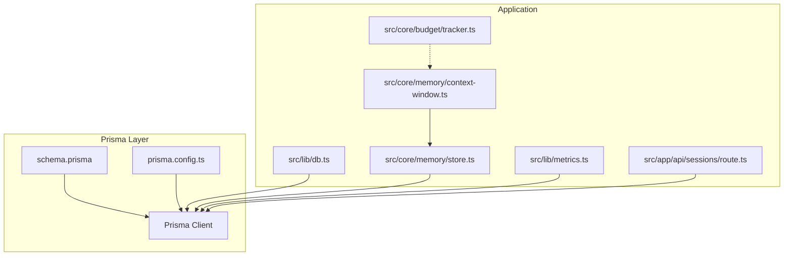
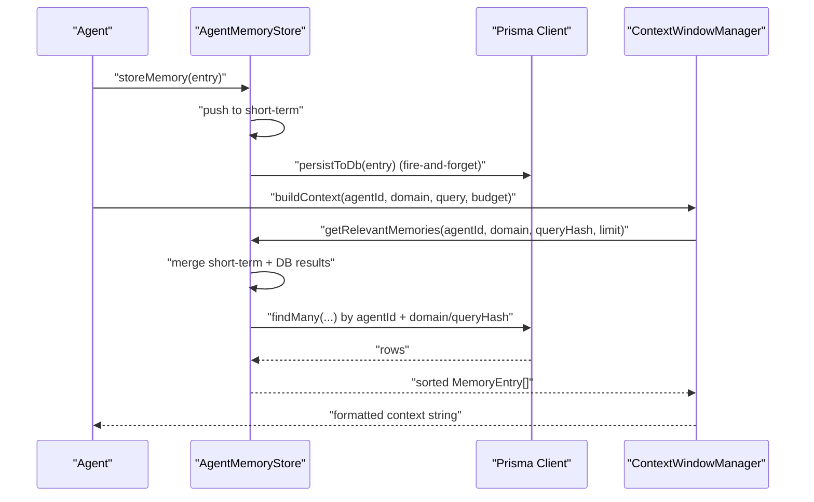
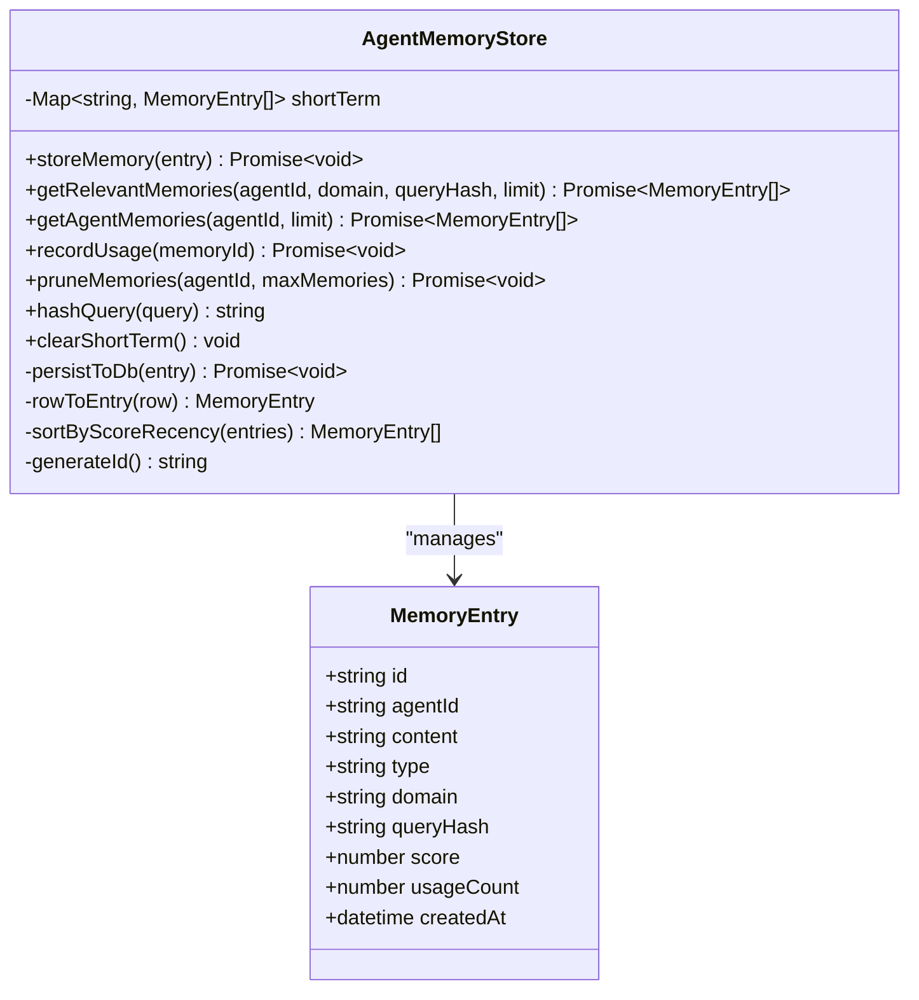
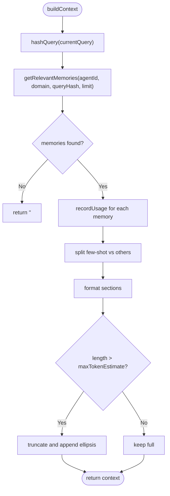
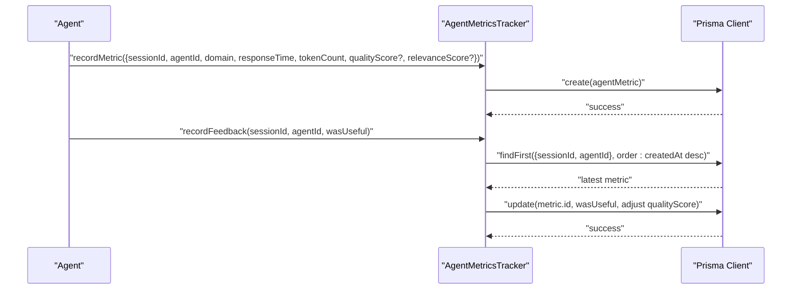
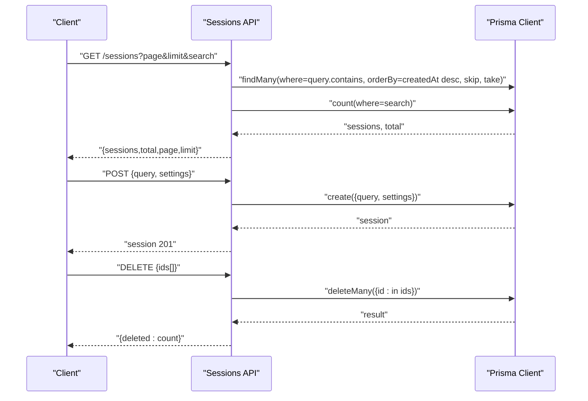
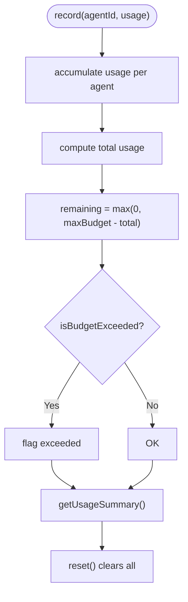
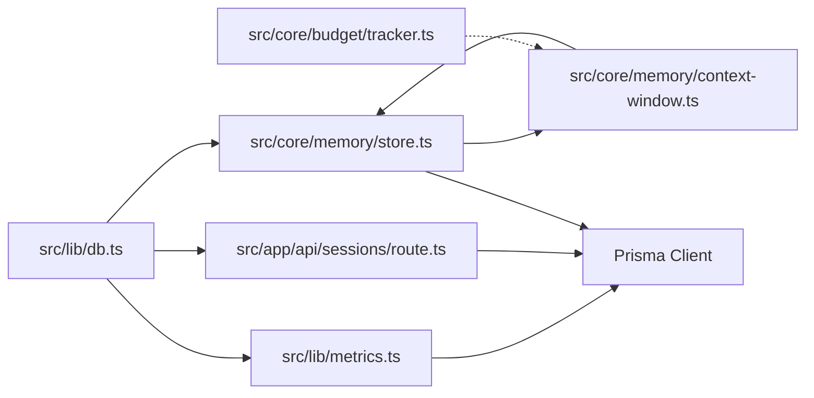

# Database Schema and Memory Management

<cite>
**Referenced Files in This Document**
- [schema.prisma](file://prisma/schema.prisma)
- [prisma.config.ts](file://prisma.config.ts)
- [db.ts](file://src/lib/db.ts)
- [store.ts](file://src/core/memory/store.ts)
- [context-window.ts](file://src/core/memory/context-window.ts)
- [metrics.ts](file://src/lib/metrics.ts)
- [route.ts](file://src/app/api/sessions/route.ts)
- [tracker.ts](file://src/core/budget/tracker.ts)
- [provider.ts](file://src/types/provider.ts)
</cite>

## Table of Contents
1. [Introduction](#introduction)
2. [Project Structure](#project-structure)
3. [Core Components](#core-components)
4. [Architecture Overview](#architecture-overview)
5. [Detailed Component Analysis](#detailed-component-analysis)
6. [Dependency Analysis](#dependency-analysis)
7. [Performance Considerations](#performance-considerations)
8. [Troubleshooting Guide](#troubleshooting-guide)
9. [Conclusion](#conclusion)
10. [Appendices](#appendices)

## Introduction
This document describes the database schema and memory management system for a multi-agent AI platform. It covers:
- The Prisma ORM schema defining entities for sessions, messages, agent metrics, and agent memory
- Entity relationships, field definitions, indexes, and constraints
- Context window management for controlling memory usage and retrieval
- Agent memory storage mechanisms combining short-term in-memory storage and long-term persistence
- Performance optimization strategies and budget controls
- Database migration and lifecycle management
- Backup considerations and common query patterns

## Project Structure
The database layer is defined via Prisma with a SQLite datasource and a generated client. Memory management is implemented in TypeScript with a hybrid short-term/in-memory store and persistent storage. Metrics tracking complements memory usage by recording agent performance and feedback.



**Diagram sources**
- [schema.prisma:1-66](file://prisma/schema.prisma#L1-L66)
- [prisma.config.ts:1-15](file://prisma.config.ts#L1-L15)
- [db.ts:1-22](file://src/lib/db.ts#L1-L22)
- [store.ts:1-254](file://src/core/memory/store.ts#L1-L254)
- [context-window.ts:1-112](file://src/core/memory/context-window.ts#L1-L112)
- [metrics.ts:1-225](file://src/lib/metrics.ts#L1-L225)
- [route.ts:1-91](file://src/app/api/sessions/route.ts#L1-L91)
- [tracker.ts:1-77](file://src/core/budget/tracker.ts#L1-L77)

**Section sources**
- [schema.prisma:1-66](file://prisma/schema.prisma#L1-L66)
- [prisma.config.ts:1-15](file://prisma.config.ts#L1-L15)
- [db.ts:1-22](file://src/lib/db.ts#L1-L22)

## Core Components
- Prisma ORM schema defines four models: Session, Message, AgentMetric, and AgentMemory. Sessions are parent entities with relations to Messages and AgentMetrics. AgentMemory is a standalone persistence model for agent knowledge.
- Memory store combines short-term in-memory storage keyed by agentId with asynchronous persistence to the AgentMemory table. It merges short-term and long-term results, ranks by score and recency, and supports pruning and usage counting.
- Context window manager builds prompt context from relevant memories, separates few-shot examples, and truncates to a configurable token budget.
- Metrics tracker records agent performance and feedback, computes composite scores, and supports suppression of underperforming agents.
- Session API provides CRUD operations for sessions with pagination and filtering.
- Budget tracker monitors token usage across agents to prevent runaway consumption.

**Section sources**
- [store.ts:15-254](file://src/core/memory/store.ts#L15-L254)
- [context-window.ts:3-112](file://src/core/memory/context-window.ts#L3-L112)
- [metrics.ts:42-225](file://src/lib/metrics.ts#L42-L225)
- [route.ts:1-91](file://src/app/api/sessions/route.ts#L1-L91)
- [tracker.ts:1-77](file://src/core/budget/tracker.ts#L1-L77)

## Architecture Overview
The system integrates three primary flows:
- Memory ingestion and retrieval: Agent produces insights/patterns, stored in short-term memory and asynchronously persisted. Retrieval merges short-term and long-term, ranks by score and recency, and injects context into prompts.
- Metrics and feedback: After agent completion, metrics are recorded and feedback updates quality scores. Composite performance is computed for selection and suppression decisions.
- Session lifecycle: Sessions are created, paginated, searched, and bulk-deleted through the API.



**Diagram sources**
- [store.ts:23-83](file://src/core/memory/store.ts#L23-L83)
- [store.ts:64-82](file://src/core/memory/store.ts#L64-L82)
- [context-window.ts:8-62](file://src/core/memory/context-window.ts#L8-L62)

## Detailed Component Analysis

### Database Schema and Entities
The Prisma schema defines the following entities and relationships:

- Session
  - Fields: id, query, response?, status, settings?, tokenUsage, createdAt, updatedAt; relations: messages[], agentMetrics[]
  - Indexes/constraints: none explicitly declared; defaults applied for status and tokenUsage
- Message
  - Fields: id, sessionId, role, content, agentId?, agentName?, metadata?, createdAt
  - Relation: belongs to Session via foreign key with cascade deletion
- AgentMetric
  - Fields: id, sessionId, agentId, agentName, domain, responseTime, tokenCount, qualityScore?, relevanceScore?, wasUseful?, createdAt
  - Relation: belongs to Session via foreign key with cascade deletion
- AgentMemory
  - Fields: id, agentId, agentName, domain, queryHash, content, type, score, usageCount, createdAt, updatedAt
  - Indexes: compound (agentId, domain), single (queryHash)

```mermaid
erDiagram
SESSION {
string id PK
string query
string status
string settings
int tokenUsage
datetime createdAt
datetime updatedAt
}
MESSAGE {
string id PK
string sessionId FK
string role
string content
string agentId
string agentName
string metadata
datetime createdAt
}
AGENTMETRIC {
string id PK
string sessionId FK
string agentId
string agentName
string domain
int responseTime
int tokenCount
float qualityScore
float relevanceScore
boolean wasUseful
datetime createdAt
}
AGENTMEMORY {
string id PK
string agentId
string agentName
string domain
string queryHash
string content
string type
float score
int usageCount
datetime createdAt
datetime updatedAt
}
SESSION ||--o{ MESSAGE : "has"
SESSION ||--o{ AGENTMETRIC : "has"
AGENTMEMORY |||| ||--o{ AGENTMEMORY : "indexed by (agentId,domain), (queryHash)"
```

**Diagram sources**
- [schema.prisma:10-65](file://prisma/schema.prisma#L10-L65)

**Section sources**
- [schema.prisma:10-65](file://prisma/schema.prisma#L10-L65)

### Memory Storage and Retrieval
The AgentMemoryStore implements a hybrid memory system:
- Short-term storage: In-memory Map keyed by agentId, enabling fast retrieval during a session.
- Persistence: Asynchronous write-through to the AgentMemory table; failures are swallowed to avoid blocking.
- Retrieval:
  - getRelevantMemories: Merges short-term and long-term results, filters by domain or queryHash, sorts by score and recency, and applies a limit.
  - getAgentMemories: Aggregates short-term and long-term, sorts by score descending.
  - recordUsage: Increments usageCount in both short-term and DB.
  - pruneMemories: Retains top-N by score across both short-term and DB.
  - hashQuery: Normalizes and hashes queries for efficient lookup.
  - clearShortTerm: Resets session-scoped short-term memory.



**Diagram sources**
- [store.ts:15-254](file://src/core/memory/store.ts#L15-L254)

**Section sources**
- [store.ts:15-254](file://src/core/memory/store.ts#L15-L254)

### Context Window Management
The ContextWindowManager constructs prompt context from relevant memories:
- Builds a query hash from the current query.
- Retrieves memories via memoryStore and marks them as used.
- Separates few-shot examples from other insights.
- Formats sections and truncates to a character budget derived from a token estimate.
- Provides summarization of memory collections.



**Diagram sources**
- [context-window.ts:8-62](file://src/core/memory/context-window.ts#L8-L62)

**Section sources**
- [context-window.ts:3-112](file://src/core/memory/context-window.ts#L3-L112)

### Metrics Tracking and Feedback
The AgentMetricsTracker records agent performance and feedback:
- Records metrics with sessionId, agentId/name, domain, responseTime, tokenCount, and optional quality/relevance scores.
- Computes composite performance scores per agent, including quality, relevance, speed, and consistency.
- Supports retrieving top agents per domain, suppressing poor performers, and updating feedback.



**Diagram sources**
- [metrics.ts:44-159](file://src/lib/metrics.ts#L44-L159)

**Section sources**
- [metrics.ts:42-225](file://src/lib/metrics.ts#L42-L225)

### Session API
The session endpoint provides:
- GET: Paginated listing with search filter on query, ordered by creation time.
- POST: Create a new session with query and optional settings.
- DELETE: Bulk delete sessions by id list.



**Diagram sources**
- [route.ts:4-90](file://src/app/api/sessions/route.ts#L4-L90)

**Section sources**
- [route.ts:1-91](file://src/app/api/sessions/route.ts#L1-L91)

### Token Budget Control
The TokenBudgetTracker enforces a global token budget:
- Tracks per-agent usage and aggregates totals.
- Provides remaining budget calculation and budget exceeded detection.
- Offers usage summaries and reset capability.



**Diagram sources**
- [tracker.ts:11-77](file://src/core/budget/tracker.ts#L11-L77)

**Section sources**
- [tracker.ts:1-77](file://src/core/budget/tracker.ts#L1-L77)

## Dependency Analysis
Key dependencies and coupling:
- Prisma client is initialized in a singleton pattern and used across memory store, metrics tracker, and session API.
- Memory store depends on Prisma for persistence and on the context window manager for retrieval.
- Metrics tracker depends on Prisma for storing and aggregating performance data.
- Session API depends on Prisma for CRUD operations.
- Budget tracker is independent but informs context window sizing and resource allocation.



**Diagram sources**
- [db.ts:1-22](file://src/lib/db.ts#L1-L22)
- [store.ts:1-254](file://src/core/memory/store.ts#L1-L254)
- [metrics.ts:1-225](file://src/lib/metrics.ts#L1-L225)
- [route.ts:1-91](file://src/app/api/sessions/route.ts#L1-L91)
- [tracker.ts:1-77](file://src/core/budget/tracker.ts#L1-L77)

**Section sources**
- [db.ts:1-22](file://src/lib/db.ts#L1-L22)
- [store.ts:1-254](file://src/core/memory/store.ts#L1-L254)
- [metrics.ts:1-225](file://src/lib/metrics.ts#L1-L225)
- [route.ts:1-91](file://src/app/api/sessions/route.ts#L1-L91)
- [tracker.ts:1-77](file://src/core/budget/tracker.ts#L1-L77)

## Performance Considerations
- Hybrid memory model:
  - Short-term in-memory storage reduces DB load and latency for session-scoped queries.
  - Over-fetching in getRelevantMemories compensates for potential duplicates when merging short-term and long-term results.
- Scoring and recency:
  - Recency decay favors newer memories while preserving high-score items, improving relevance.
- Indexing:
  - Compound index on (agentId, domain) and single index on (queryHash) optimize retrieval by agent and query similarity.
- Asynchronous persistence:
  - Fire-and-forget writes reduce latency; failures are handled gracefully to preserve short-term memory.
- Pagination and limits:
  - Session listing uses skip/take for pagination; memory retrieval caps results to manageable sizes.
- Token budgeting:
  - Budget tracker prevents excessive token consumption; context window truncation ensures prompt fits provider limits.

[No sources needed since this section provides general guidance]

## Troubleshooting Guide
- Database connectivity issues:
  - If Prisma operations fail, short-term memory remains intact; long-term persistence is deferred. Check DATABASE_URL and datasource configuration.
- Missing or stale metrics:
  - Verify that recordMetric is called after agent completion and that feedback updates are applied.
- Context window empty:
  - Ensure getRelevantMemories is invoked with the correct agentId, domain, and queryHash; confirm that memoryStore.storeMemory was called for relevant insights.
- Excessive token usage:
  - Monitor TokenBudgetTracker usage and adjust budgets or context window sizes accordingly.
- Session listing anomalies:
  - Confirm pagination parameters and search filter usage; verify Prisma client initialization and datasource URL.

**Section sources**
- [db.ts:9-21](file://src/lib/db.ts#L9-L21)
- [store.ts:35-39](file://src/core/memory/store.ts#L35-L39)
- [metrics.ts:54-70](file://src/lib/metrics.ts#L54-L70)
- [route.ts:17-35](file://src/app/api/sessions/route.ts#L17-L35)

## Conclusion
The system combines a compact Prisma schema with a robust hybrid memory architecture. AgentMemoryStore and ContextWindowManager enable efficient, scalable memory retrieval and injection into prompts, while metrics and budget controls ensure quality and resource safety. Indexes and pagination support performance at scale.

[No sources needed since this section summarizes without analyzing specific files]

## Appendices

### Database Migration and Lifecycle
- Migration configuration:
  - Prisma config specifies the schema path and migrations directory, and sets the datasource URL from an environment variable.
- Migration process:
  - Use Prisma CLI to generate and apply migrations; ensure DATABASE_URL points to the target environment.
- Data lifecycle:
  - Sessions are created with defaults and can be bulk-deleted; messages and metrics are cascaded with sessions.
  - AgentMemory entries persist independently and are pruned by score to manage growth.
- Backup considerations:
  - For SQLite, back up the database file regularly; consider WAL mode for improved concurrency and crash safety.
  - For production, consider migrating to a managed database with automated backups and replication.

**Section sources**
- [prisma.config.ts:6-14](file://prisma.config.ts#L6-L14)
- [schema.prisma:10-65](file://prisma/schema.prisma#L10-L65)
- [route.ts:66-90](file://src/app/api/sessions/route.ts#L66-L90)
- [store.ts:147-175](file://src/core/memory/store.ts#L147-L175)

### Common Queries and Access Patterns
- Retrieve recent sessions with pagination and optional search:
  - Use GET with page, limit, and search parameters; leverages count and findMany with ordering.
- Create a new session:
  - POST with query and optional settings; stores JSON settings if provided.
- Store a memory entry:
  - Call storeMemory with agentId, domain, queryHash, content, type, score; persists asynchronously.
- Retrieve relevant memories:
  - Call getRelevantMemories with agentId, domain, queryHash, and limit; merges short-term and long-term.
- Record memory usage:
  - Call recordUsage with memoryId; increments usageCount in both memory store and DB.
- Compute performance scores:
  - Use getPerformanceScores or getAgentScore to retrieve composite scores; optionally filter by domain.

**Section sources**
- [route.ts:4-35](file://src/app/api/sessions/route.ts#L4-L35)
- [route.ts:37-64](file://src/app/api/sessions/route.ts#L37-L64)
- [store.ts:23-83](file://src/core/memory/store.ts#L23-L83)
- [store.ts:123-142](file://src/core/memory/store.ts#L123-L142)
- [metrics.ts:73-116](file://src/lib/metrics.ts#L73-L116)

### Memory Optimization Techniques for Large-Scale Deployments
- Tune pruning thresholds:
  - Adjust pruneMemories maxMemories to balance recall and storage costs.
- Optimize scoring and recency:
  - Calibrate score weights and recency decay to match domain characteristics.
- Limit context window size:
  - Reduce maxTokenEstimate to fit provider constraints and reduce latency.
- Batch operations:
  - Use bulk delete for sessions and targeted deletes for memory entries to maintain performance.
- Provider capabilities:
  - Respect provider maxContextWindow and adjust token budgets accordingly.

**Section sources**
- [store.ts:147-175](file://src/core/memory/store.ts#L147-L175)
- [context-window.ts:8-62](file://src/core/memory/context-window.ts#L8-L62)
- [provider.ts:38-43](file://src/types/provider.ts#L38-L43)