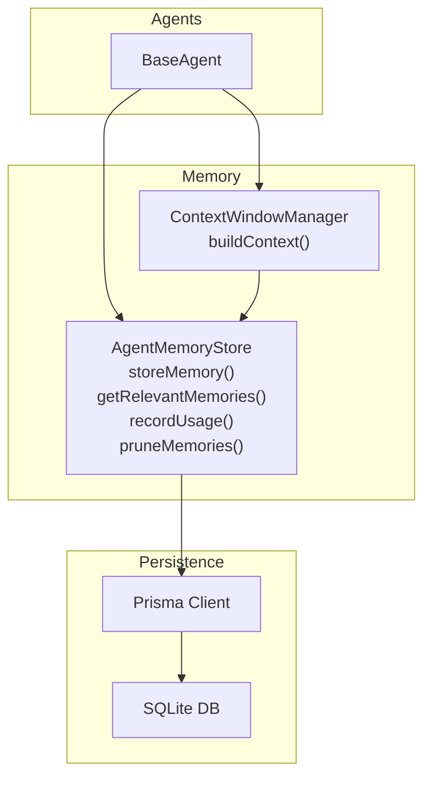
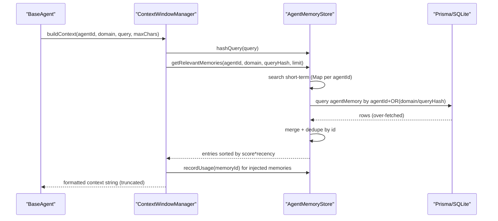
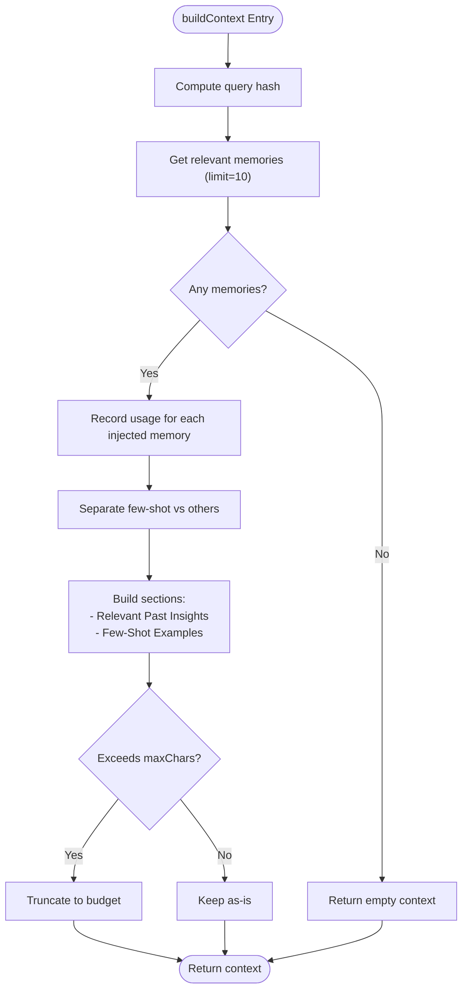
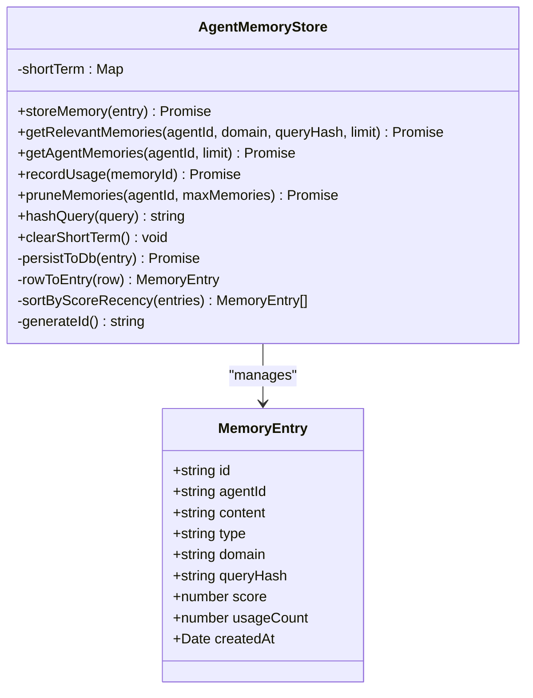
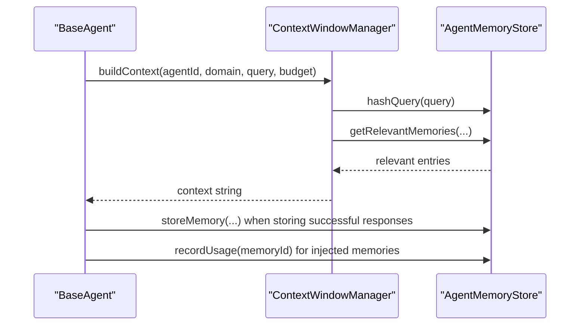
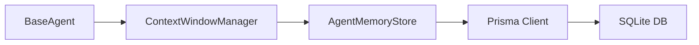

# Memory Management System

<cite>
**Referenced Files in This Document**
- [context-window.ts](file://src/core/memory/context-window.ts)
- [store.ts](file://src/core/memory/store.ts)
- [base-agent.ts](file://src/core/agents/base-agent.ts)
- [schema.prisma](file://prisma/schema.prisma)
- [db.ts](file://src/lib/db.ts)
</cite>

## Table of Contents
1. [Introduction](#introduction)
2. [Project Structure](#project-structure)
3. [Core Components](#core-components)
4. [Architecture Overview](#architecture-overview)
5. [Detailed Component Analysis](#detailed-component-analysis)
6. [Dependency Analysis](#dependency-analysis)
7. [Performance Considerations](#performance-considerations)
8. [Troubleshooting Guide](#troubleshooting-guide)
9. [Conclusion](#conclusion)

## Introduction
This document explains the memory management system that controls context window limits and agent memory storage. It covers how the system manages memory usage and retrieval efficiency, prevents memory overflow during multi-agent reasoning, persists successful responses and patterns with scoring and usage tracking, and integrates with the agent system. It also documents memory retrieval algorithms, relevance scoring, lifecycle management, query hash matching, cleanup policies, storage optimization, and production scaling considerations.

## Project Structure
The memory system resides under the core memory module and integrates with the agent system and the database layer:
- Memory store and context window manager: src/core/memory
- Agent integration: src/core/agents/base-agent.ts
- Database schema and client: prisma/schema.prisma, src/lib/db.ts

**Diagram sources**
- [base-agent.ts](file://src/core/agents/base-agent.ts)
- [context-window.ts](file://src/core/memory/context-window.ts)
- [store.ts](file://src/core/memory/store.ts)
- [db.ts](file://src/lib/db.ts)
- [schema.prisma](file://prisma/schema.prisma)

**Section sources**
- [context-window.ts](file://src/core/memory/context-window.ts)
- [store.ts](file://src/core/memory/store.ts)
- [base-agent.ts](file://src/core/agents/base-agent.ts)
- [schema.prisma](file://prisma/schema.prisma)
- [db.ts](file://src/lib/db.ts)

## Core Components
- ContextWindowManager: Builds contextual memory for prompts, formats few-shot examples, and truncates output to stay within token budgets.
- AgentMemoryStore: Provides in-memory short-term storage per agent, persistence to SQLite via Prisma, retrieval with hybrid short-term + long-term search, scoring and recency sorting, usage tracking, pruning, and query hashing.

Key capabilities:
- Context building with relevance filtering by domain or query hash, and usage recording.
- Hybrid retrieval combining in-memory and persistent memory with over-fetch and deduplication.
- Scoring and recency-aware ranking to prioritize relevant and recent memories.
- Usage tracking and pruning to prevent unbounded growth.
- Query hash normalization for efficient recall.

**Section sources**
- [context-window.ts](file://src/core/memory/context-window.ts)
- [store.ts](file://src/core/memory/store.ts)

## Architecture Overview
The memory system is designed around two layers:
- Short-term (in-memory) per-agent cache for fast access and immediate persistence.
- Long-term (persistent) storage via Prisma/SQLite for durability and broader recall.

**Diagram sources**
- [base-agent.ts](file://src/core/agents/base-agent.ts)
- [context-window.ts](file://src/core/memory/context-window.ts)
- [store.ts](file://src/core/memory/store.ts)
- [db.ts](file://src/lib/db.ts)
- [schema.prisma](file://prisma/schema.prisma)

## Detailed Component Analysis

### ContextWindowManager
Responsibilities:
- Build contextual prompt text from relevant memories.
- Normalize queries via hashing to enable reuse across similar queries.
- Separate and format few-shot examples distinctly from other insights.
- Truncate final context to a character budget to respect token limits.
- Record usage for each memory injected into the context.

Processing logic highlights:
- Query hash computation for deduplication and recall.
- Retrieval with fallback to empty string on failure.
- Usage increments for injected memories to track value.
- Structured sections for “Past Insights” and “Few-Shot Examples”.

**Diagram sources**
- [context-window.ts](file://src/core/memory/context-window.ts)
- [store.ts](file://src/core/memory/store.ts)

**Section sources**
- [context-window.ts](file://src/core/memory/context-window.ts)

### AgentMemoryStore
Responsibilities:
- In-memory short-term cache per agentId for fast retrieval and immediate availability.
- Asynchronous persistence to SQLite via Prisma with fire-and-forget error handling.
- Hybrid retrieval: short-term first, then long-term DB with over-fetch and deduplication.
- Sorting by score multiplied by recency to favor recent and relevant memories.
- Usage tracking across in-memory and persistent layers.
- Pruning to cap memory counts per agent by score.
- Query hashing for similarity-based recall.
- Utility to clear short-term memory.

Data model and indices:
- Memory entries include agentId, domain, queryHash, content, type, score, usageCount, and timestamps.
- Indices on agentId+domain and queryHash support efficient retrieval.

**Diagram sources**
- [store.ts](file://src/core/memory/store.ts)
- [schema.prisma](file://prisma/schema.prisma)

**Section sources**
- [store.ts](file://src/core/memory/store.ts)
- [schema.prisma](file://prisma/schema.prisma)

### Integration with the Agent System
The BaseAgent orchestrates memory usage across reasoning modes:
- Think, thinkMultiplePaths, thinkWithCoT, verify, and discuss all conditionally attach memory context.
- Memory context is built with a domain-specific and query-aware context window.
- Successful thoughts are stored as memories with confidence-based scores.
- Memory usage increments are recorded when memories are injected into prompts.

**Diagram sources**
- [base-agent.ts](file://src/core/agents/base-agent.ts)
- [context-window.ts](file://src/core/memory/context-window.ts)
- [store.ts](file://src/core/memory/store.ts)

**Section sources**
- [base-agent.ts](file://src/core/agents/base-agent.ts)

## Dependency Analysis
- BaseAgent depends on ContextWindowManager and AgentMemoryStore.
- ContextWindowManager depends on AgentMemoryStore for retrieval and usage tracking.
- AgentMemoryStore depends on Prisma client and SQLite for persistence.
- Prisma client initialization resolves a local SQLite file path and uses an adapter.

**Diagram sources**
- [base-agent.ts](file://src/core/agents/base-agent.ts)
- [context-window.ts](file://src/core/memory/context-window.ts)
- [store.ts](file://src/core/memory/store.ts)
- [db.ts](file://src/lib/db.ts)
- [schema.prisma](file://prisma/schema.prisma)

**Section sources**
- [base-agent.ts](file://src/core/agents/base-agent.ts)
- [context-window.ts](file://src/core/memory/context-window.ts)
- [store.ts](file://src/core/memory/store.ts)
- [db.ts](file://src/lib/db.ts)
- [schema.prisma](file://prisma/schema.prisma)

## Performance Considerations
- Hybrid retrieval strategy:
  - Short-term lookup is O(n) per agent with n being in-memory entries; bounded by pruning.
  - Long-term lookup uses Prisma findMany with OR(domain, queryHash) and ordering by score desc, taking a larger batch and merging to deduplicate.
- Over-fetch and deduplication:
  - Long-term queries fetch 2x the requested limit to merge with short-term, reducing repeated scans.
  - Deduplication by memory id ensures a single result set.
- Sorting cost:
  - Final sort by score × recency adds overhead proportional to merged results; keep limits reasonable.
- Persistence:
  - Persist to DB is fire-and-forget to avoid blocking agent operations; failures are swallowed to maintain resilience.
- Indexing:
  - Indices on agentId+domain and queryHash improve retrieval performance for large datasets.

Recommendations:
- Tune retrieval limits per mode (e.g., 300–500 chars for context windows) to balance richness and token budget.
- Monitor average memory per agent and adjust pruning thresholds accordingly.
- Consider precomputing and caching query hashes for repeated queries to reduce hashing overhead.

**Section sources**
- [store.ts](file://src/core/memory/store.ts)
- [schema.prisma](file://prisma/schema.prisma)

## Troubleshooting Guide
Common issues and mitigations:
- Memory unavailable or DB errors:
  - ContextWindowManager catches retrieval errors and returns empty context to avoid blocking.
  - Agent flows continue without memory when unavailable.
- DB connectivity problems:
  - Prisma client initialization supports local file paths; ensure DATABASE_URL resolves correctly.
  - Fire-and-forget persistence avoids runtime failures but may temporarily lose writes if DB is down.
- Unexpectedly large contexts:
  - Adjust max token estimate for each mode and rely on truncation to stay within budget.
- Memory growth:
  - Use pruneMemories to cap per-agent memory by score; clearShortTerm to reset session memory.
- Usage tracking inconsistencies:
  - recordUsage updates both in-memory and DB; if DB is down, usageCount may lag until persistence succeeds.

Operational checks:
- Verify indices exist on agentId+domain and queryHash for efficient retrieval.
- Confirm Prisma client connects to the expected SQLite file path.

**Section sources**
- [context-window.ts](file://src/core/memory/context-window.ts)
- [store.ts](file://src/core/memory/store.ts)
- [db.ts](file://src/lib/db.ts)
- [schema.prisma](file://prisma/schema.prisma)

## Conclusion
The memory management system combines short-term in-memory caching with long-term persistent storage to deliver efficient, context-aware reasoning for agents. It enforces context window limits, prioritizes relevant and recent memories via scoring and recency, tracks usage, and prunes growth to prevent overflow. Integration with the agent system is seamless, enabling robust multi-agent reasoning while maintaining performance and reliability. For production, monitor growth, tune retrieval limits, and leverage indexing and pruning to scale effectively.