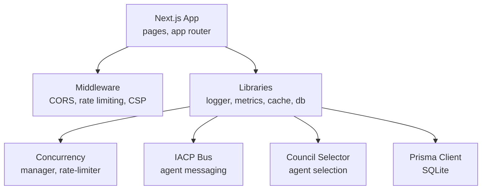
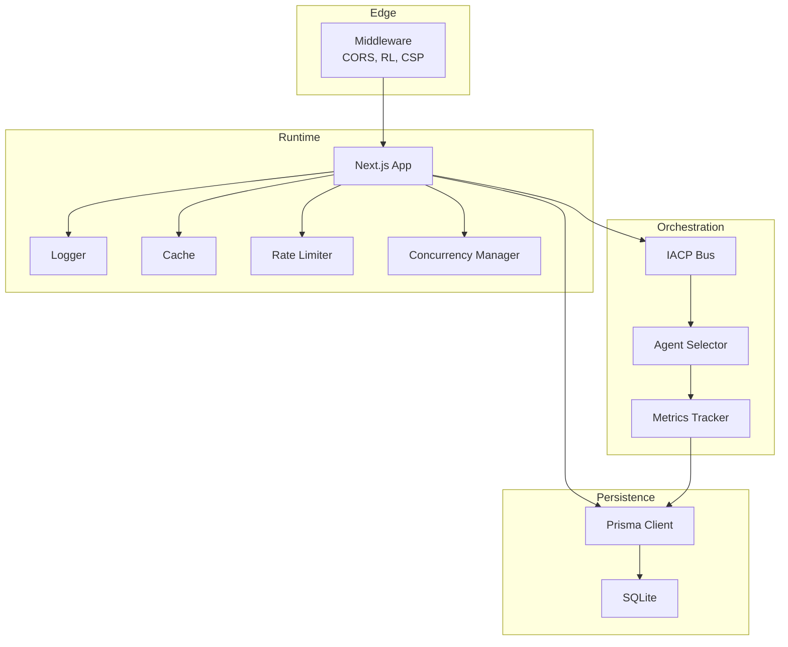
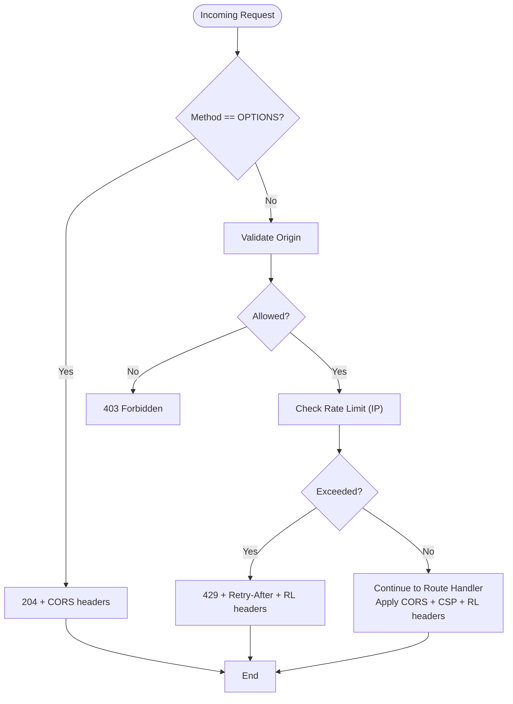
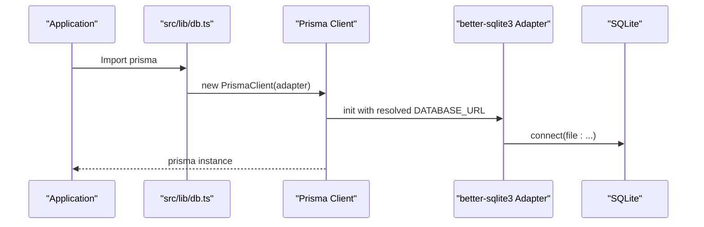
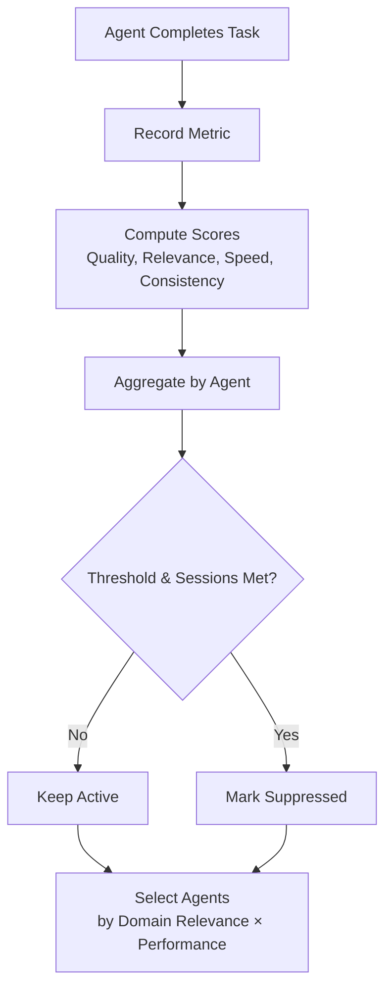
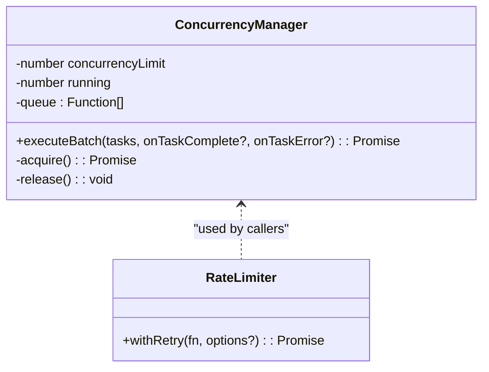
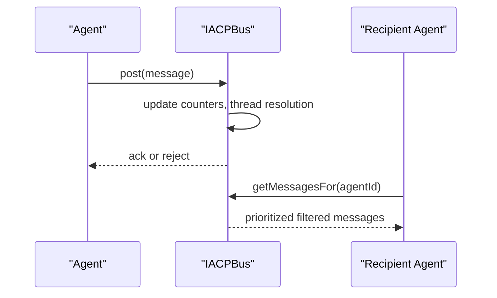
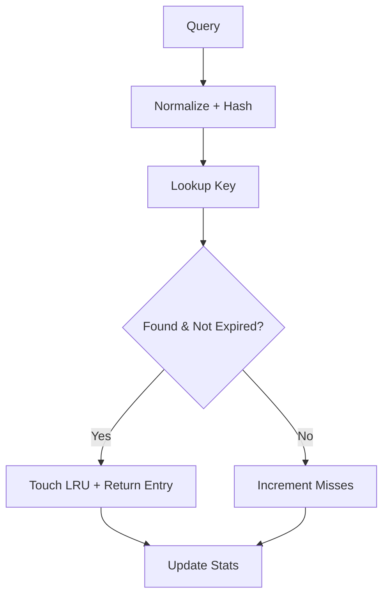
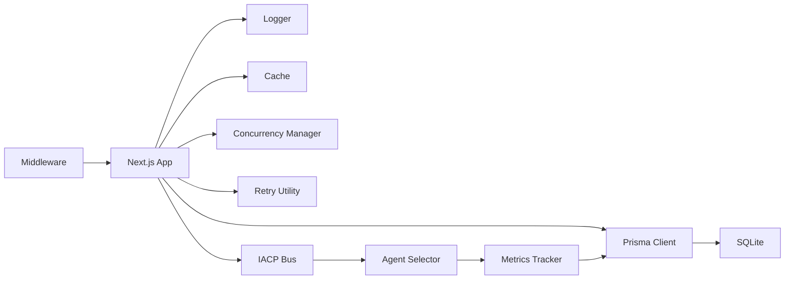

# Deployment and Production

<cite>
**Referenced Files in This Document**
- [package.json](file://package.json)
- [next.config.ts](file://next.config.ts)
- [prisma.config.ts](file://prisma.config.ts)
- [prisma/schema.prisma](file://prisma/schema.prisma)
- [src/lib/db.ts](file://src/lib/db.ts)
- [src/middleware.ts](file://src/middleware.ts)
- [src/lib/logger.ts](file://src/lib/logger.ts)
- [src/lib/metrics.ts](file://src/lib/metrics.ts)
- [src/lib/cache.ts](file://src/lib/cache.ts)
- [src/core/concurrency/manager.ts](file://src/core/concurrency/manager.ts)
- [src/core/concurrency/rate-limiter.ts](file://src/core/concurrency/rate-limiter.ts)
- [src/core/council/selector.ts](file://src/core/council/selector.ts)
- [src/core/iacp/bus.ts](file://src/core/iacp/bus.ts)
</cite>

## Table of Contents
1. [Introduction](#introduction)
2. [Project Structure](#project-structure)
3. [Core Components](#core-components)
4. [Architecture Overview](#architecture-overview)
5. [Detailed Component Analysis](#detailed-component-analysis)
6. [Dependency Analysis](#dependency-analysis)
7. [Performance Considerations](#performance-considerations)
8. [Monitoring and Logging](#monitoring-and-logging)
9. [Security Considerations](#security-considerations)
10. [Database Migration and Prisma in Production](#database-migration-and-prisma-in-production)
11. [Scaling Considerations for Multi-Agent AI Systems](#scaling-considerations-for-multi-agent-ai-systems)
12. [Containerization and Cloud Deployment](#containerization-and-cloud-deployment)
13. [Infrastructure Requirements](#infrastructure-requirements)
14. [Backup and Disaster Recovery](#backup-and-disaster-recovery)
15. [Deployment Checklists](#deployment-checklists)
16. [Rollback Procedures](#rollback-procedures)
17. [Production Troubleshooting Guide](#production-troubleshooting-guide)
18. [Conclusion](#conclusion)

## Introduction
This document provides comprehensive deployment and production guidance for Deep Thinking AI. It covers build configuration with Next.js, environment variable management, production optimization, database migrations with Prisma, multi-agent system scaling, containerization, cloud deployment strategies, infrastructure requirements, monitoring and logging, performance tuning, security, backup and disaster recovery, and operational checklists and troubleshooting.

## Project Structure
Deep Thinking AI is a Next.js application with a modular TypeScript codebase. Key areas relevant to production:
- Application runtime and middleware for CORS, rate limiting, and security headers
- Prisma schema and client configuration for SQLite-backed persistence
- Core concurrency and rate-limiting utilities
- Metrics and caching layers for observability and performance
- Multi-agent orchestration via IACP bus and agent selection

**Section sources**
- [package.json:1-60](file://package.json#L1-L60)
- [next.config.ts:1-8](file://next.config.ts#L1-L8)
- [prisma/schema.prisma:1-66](file://prisma/schema.prisma#L1-L66)
- [src/lib/db.ts:1-22](file://src/lib/db.ts#L1-L22)
- [src/middleware.ts:1-217](file://src/middleware.ts#L1-L217)
- [src/lib/logger.ts:1-97](file://src/lib/logger.ts#L1-L97)
- [src/lib/metrics.ts:1-225](file://src/lib/metrics.ts#L1-L225)
- [src/lib/cache.ts:1-206](file://src/lib/cache.ts#L1-L206)
- [src/core/concurrency/manager.ts:1-55](file://src/core/concurrency/manager.ts#L1-L55)
- [src/core/concurrency/rate-limiter.ts:1-41](file://src/core/concurrency/rate-limiter.ts#L1-L41)
- [src/core/iacp/bus.ts:1-210](file://src/core/iacp/bus.ts#L1-L210)
- [src/core/council/selector.ts:1-169](file://src/core/council/selector.ts#L1-L169)

## Core Components
- Next.js runtime and build pipeline
- Middleware for CORS, rate limiting, and security headers
- Prisma client with better-sqlite3 adapter and SQLite datasource
- Metrics collection and suppression logic
- Response caching with TTL and LRU eviction
- Concurrency control and retry with exponential backoff
- IACP bus for agent messaging and routing
- Agent selection based on domain relevance and performance

**Section sources**
- [package.json:1-60](file://package.json#L1-L60)
- [next.config.ts:1-8](file://next.config.ts#L1-L8)
- [prisma.config.ts:1-15](file://prisma.config.ts#L1-L15)
- [prisma/schema.prisma:1-66](file://prisma/schema.prisma#L1-L66)
- [src/lib/db.ts:1-22](file://src/lib/db.ts#L1-L22)
- [src/middleware.ts:1-217](file://src/middleware.ts#L1-L217)
- [src/lib/logger.ts:1-97](file://src/lib/logger.ts#L1-L97)
- [src/lib/metrics.ts:1-225](file://src/lib/metrics.ts#L1-L225)
- [src/lib/cache.ts:1-206](file://src/lib/cache.ts#L1-L206)
- [src/core/concurrency/manager.ts:1-55](file://src/core/concurrency/manager.ts#L1-L55)
- [src/core/concurrency/rate-limiter.ts:1-41](file://src/core/concurrency/rate-limiter.ts#L1-L41)
- [src/core/iacp/bus.ts:1-210](file://src/core/iacp/bus.ts#L1-L210)
- [src/core/council/selector.ts:1-169](file://src/core/council/selector.ts#L1-L169)

## Architecture Overview
The production runtime integrates Next.js with middleware-driven security and rate limiting, a SQLite-backed Prisma layer, and internal concurrency controls. The multi-agent system orchestrates agents via the IACP bus and selects agents based on performance and domain relevance.

**Diagram sources**
- [src/middleware.ts:166-211](file://src/middleware.ts#L166-L211)
- [src/lib/logger.ts:76-96](file://src/lib/logger.ts#L76-L96)
- [src/lib/cache.ts:34-206](file://src/lib/cache.ts#L34-L206)
- [src/core/concurrency/rate-limiter.ts:13-40](file://src/core/concurrency/rate-limiter.ts#L13-L40)
- [src/core/concurrency/manager.ts:1-55](file://src/core/concurrency/manager.ts#L1-L55)
- [src/lib/db.ts:9-21](file://src/lib/db.ts#L9-L21)
- [src/core/iacp/bus.ts:15-210](file://src/core/iacp/bus.ts#L15-L210)
- [src/core/council/selector.ts:27-164](file://src/core/council/selector.ts#L27-L164)
- [src/lib/metrics.ts:42-225](file://src/lib/metrics.ts#L42-L225)

## Detailed Component Analysis

### Middleware: CORS, Rate Limiting, and Security Headers
- Origin validation supports explicit allow-lists and same-origin fallback
- Sliding-window in-memory rate limiter per IP with cleanup interval
- Preflight handling for CORS OPTIONS
- Security headers including CSP, X-Content-Type-Options, X-Frame-Options, Referrer-Policy, and X-XSS-Protection
- Rate limit headers exposed for client awareness

**Diagram sources**
- [src/middleware.ts:166-211](file://src/middleware.ts#L166-L211)

**Section sources**
- [src/middleware.ts:1-217](file://src/middleware.ts#L1-L217)

### Prisma Client and SQLite Adapter
- Prisma client initialized with better-sqlite3 adapter
- DATABASE_URL resolves relative file paths against process.cwd() for Next.js compatibility
- Default fallback to local file path when DATABASE_URL is unset
- Prisma config defines schema path, migrations path, and datasource URL resolution

**Diagram sources**
- [src/lib/db.ts:9-21](file://src/lib/db.ts#L9-L21)
- [prisma.config.ts:6-14](file://prisma.config.ts#L6-L14)

**Section sources**
- [src/lib/db.ts:1-22](file://src/lib/db.ts#L1-L22)
- [prisma.config.ts:1-15](file://prisma.config.ts#L1-L15)
- [prisma/schema.prisma:1-66](file://prisma/schema.prisma#L1-L66)

### Metrics and Suppression Logic
- Records agent metrics per session and computes composite scores
- Tracks quality, relevance, speed, and consistency
- Provides suppression of consistently underperforming agents
- Feedback updates metrics with user thumbs-up/down

**Diagram sources**
- [src/lib/metrics.ts:42-225](file://src/lib/metrics.ts#L42-L225)
- [src/core/council/selector.ts:27-164](file://src/core/council/selector.ts#L27-L164)

**Section sources**
- [src/lib/metrics.ts:1-225](file://src/lib/metrics.ts#L1-L225)
- [src/core/council/selector.ts:1-169](file://src/core/council/selector.ts#L1-L169)

### Concurrency Control and Retries
- Concurrency manager limits concurrent executions and queues overflow
- Batch execution tracks completion and errors per task
- Retry utility with exponential backoff and jitter, with auth error short-circuit

**Diagram sources**
- [src/core/concurrency/manager.ts:1-55](file://src/core/concurrency/manager.ts#L1-L55)
- [src/core/concurrency/rate-limiter.ts:13-40](file://src/core/concurrency/rate-limiter.ts#L13-L40)

**Section sources**
- [src/core/concurrency/manager.ts:1-55](file://src/core/concurrency/manager.ts#L1-L55)
- [src/core/concurrency/rate-limiter.ts:1-41](file://src/core/concurrency/rate-limiter.ts#L1-L41)

### IACP Bus: Messaging and Routing
- Maintains message backlog with priority ordering
- Supports direct, broadcast, and routing-hint delivery
- Thread-aware queries and stats aggregation
- Agent registry for domain/expertise-based routing

**Diagram sources**
- [src/core/iacp/bus.ts:39-94](file://src/core/iacp/bus.ts#L39-L94)
- [src/core/iacp/bus.ts:176-208](file://src/core/iacp/bus.ts#L176-L208)

**Section sources**
- [src/core/iacp/bus.ts:1-210](file://src/core/iacp/bus.ts#L1-L210)

### Response Cache
- Normalizes and hashes queries
- LRU eviction with TTL checks
- Optional fuzzy similarity search
- Hit/miss statistics and cleanup

**Diagram sources**
- [src/lib/cache.ts:70-93](file://src/lib/cache.ts#L70-L93)
- [src/lib/cache.ts:195-201](file://src/lib/cache.ts#L195-L201)

**Section sources**
- [src/lib/cache.ts:1-206](file://src/lib/cache.ts#L1-L206)

## Dependency Analysis
- Next.js runtime depends on middleware for request preprocessing
- Application libraries depend on Prisma client for persistence
- Metrics and agent selection depend on Prisma for historical data
- Concurrency and retries are used by agent orchestration flows
- Cache is used across request handling to reduce load

**Diagram sources**
- [src/middleware.ts:166-211](file://src/middleware.ts#L166-L211)
- [src/lib/db.ts:9-21](file://src/lib/db.ts#L9-L21)
- [src/lib/metrics.ts:42-225](file://src/lib/metrics.ts#L42-L225)
- [src/core/iacp/bus.ts:15-210](file://src/core/iacp/bus.ts#L15-L210)
- [src/core/council/selector.ts:27-164](file://src/core/council/selector.ts#L27-L164)

**Section sources**
- [src/middleware.ts:1-217](file://src/middleware.ts#L1-L217)
- [src/lib/db.ts:1-22](file://src/lib/db.ts#L1-L22)
- [src/lib/metrics.ts:1-225](file://src/lib/metrics.ts#L1-L225)
- [src/core/iacp/bus.ts:1-210](file://src/core/iacp/bus.ts#L1-L210)
- [src/core/council/selector.ts:1-169](file://src/core/council/selector.ts#L1-L169)

## Performance Considerations
- Enable Next.js production build and start scripts
- Tune concurrency limits for agent workloads
- Configure cache size and TTL to balance freshness and throughput
- Use rate limiting to protect upstream providers and downstream clients
- Monitor metrics to identify slow agents and adjust selection weights
- Apply database indexes and optimize queries where needed

[No sources needed since this section provides general guidance]

## Monitoring and Logging
- Structured logging with configurable minimum levels
- JSON output in production for centralized log ingestion
- Metrics tracking for agent performance and suppression decisions
- Middleware exposes rate limit headers for client-side telemetry

**Section sources**
- [src/lib/logger.ts:19-29](file://src/lib/logger.ts#L19-L29)
- [src/lib/logger.ts:31-43](file://src/lib/logger.ts#L31-L43)
- [src/lib/metrics.ts:42-225](file://src/lib/metrics.ts#L42-L225)
- [src/middleware.ts:184-210](file://src/middleware.ts#L184-L210)

## Security Considerations
- Origin allow-list enforcement with same-origin fallback
- Preflight handling for CORS
- Comprehensive CSP headers
- Strict security headers (X-Content-Type-Options, X-Frame-Options, Referrer-Policy, X-XSS-Protection)
- Rate limiting to mitigate abuse

**Section sources**
- [src/middleware.ts:94-160](file://src/middleware.ts#L94-L160)
- [src/middleware.ts:166-211](file://src/middleware.ts#L166-L211)

## Database Migration and Prisma in Production
- Prisma schema defines SQLite datasource
- Prisma config sets schema and migrations paths and resolves datasource URL from environment
- Client generation path is configured under generated output
- For production, ensure DATABASE_URL points to a persistent SQLite file or migrate to a supported relational database provider

Recommended steps:
- Initialize migrations and apply them in CI/CD before deploy
- Keep migrations immutable and versioned
- Back up the database before applying migrations in production

**Section sources**
- [prisma/schema.prisma:1-66](file://prisma/schema.prisma#L1-L66)
- [prisma.config.ts:6-14](file://prisma.config.ts#L6-L14)
- [src/lib/db.ts:9-21](file://src/lib/db.ts#L9-L21)

## Scaling Considerations for Multi-Agent AI Systems
- Concurrency manager limits concurrent agent invocations; tune based on provider quotas and latency targets
- Retry utility with exponential backoff handles transient failures
- Metrics inform agent selection and suppression to maintain quality
- Cache reduces repeated computation and API calls
- Horizontal scaling requires stateless instances behind a load balancer; persist state in the database

**Section sources**
- [src/core/concurrency/manager.ts:1-55](file://src/core/concurrency/manager.ts#L1-L55)
- [src/core/concurrency/rate-limiter.ts:13-40](file://src/core/concurrency/rate-limiter.ts#L13-L40)
- [src/lib/metrics.ts:42-225](file://src/lib/metrics.ts#L42-L225)
- [src/lib/cache.ts:34-206](file://src/lib/cache.ts#L34-L206)

## Containerization and Cloud Deployment
- Build and start scripts for Next.js are available in package.json
- Use a minimal Node.js base image and copy built artifacts
- Mount persistent storage for the SQLite database file when using file-based SQLite
- Set environment variables for DATABASE_URL and middleware configuration (ALLOWED_ORIGINS)
- Deploy behind a reverse proxy or CDN with TLS termination

[No sources needed since this section provides general guidance]

## Infrastructure Requirements
- Node.js runtime aligned with Next.js version
- Persistent storage for the SQLite database file
- Reverse proxy or CDN for HTTPS termination and caching
- Secrets management for API keys and sensitive environment variables
- Health checks and readiness probes for load balancers

[No sources needed since this section provides general guidance]

## Backup and Disaster Recovery
- Regular snapshots of the SQLite database file
- Versioned backups with retention policies
- Test restore procedures in staging
- Document migration rollback steps and prerequisites

[No sources needed since this section provides general guidance]

## Deployment Checklists
- Build artifacts with Next.js build script
- Verify Prisma migrations applied and database reachable
- Confirm environment variables (DATABASE_URL, ALLOWED_ORIGINS)
- Run health checks and basic smoke tests
- Deploy behind a load balancer and monitor logs and metrics

[No sources needed since this section provides general guidance]

## Rollback Procedures
- Keep previous artifact versions and database backups
- Re-deploy previous version if health checks fail
- Rollback database migrations if necessary
- Revert configuration changes incrementally

[No sources needed since this section provides general guidance]

## Production Troubleshooting Guide
Common issues and remedies:
- 429 Too Many Requests: Adjust middleware rate limits or client-side backoff
- Origin Forbidden: Add origin to ALLOWED_ORIGINS or configure same-origin
- Slow responses: Review agent metrics, adjust concurrency, enable cache, and optimize provider calls
- Database connectivity: Verify DATABASE_URL and file permissions for SQLite
- CSP violations: Align frontend assets and external resources with CSP directives

**Section sources**
- [src/middleware.ts:166-211](file://src/middleware.ts#L166-L211)
- [src/lib/db.ts:9-21](file://src/lib/db.ts#L9-L21)
- [src/lib/metrics.ts:42-225](file://src/lib/metrics.ts#L42-L225)
- [src/lib/cache.ts:34-206](file://src/lib/cache.ts#L34-L206)

## Conclusion
This guide consolidates production deployment practices for Deep Thinking AI, focusing on Next.js configuration, environment management, Prisma migrations, middleware security, concurrency and retries, metrics and caching, and operational procedures. Adopt the recommended practices to ensure a secure, scalable, and observable deployment.