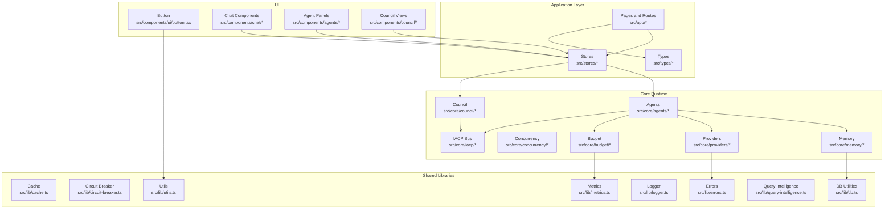
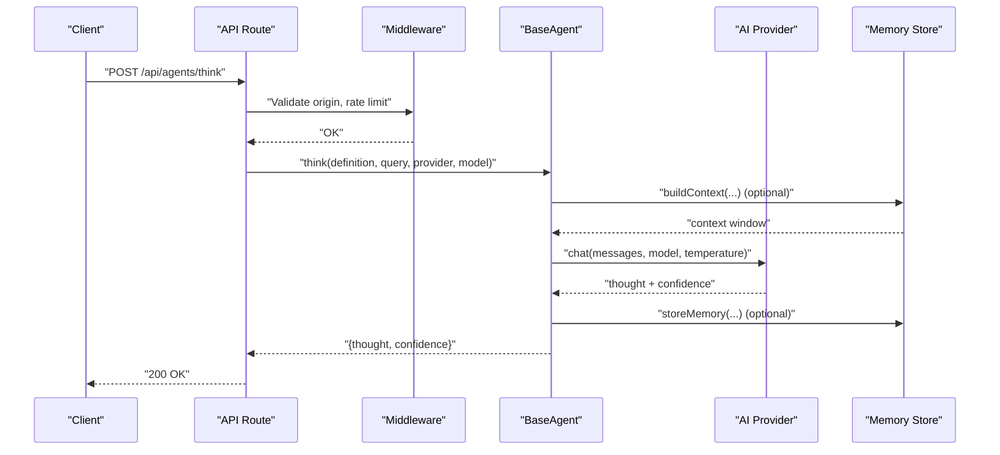
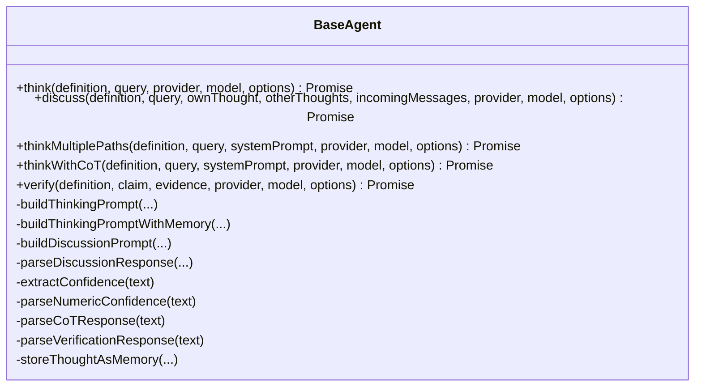
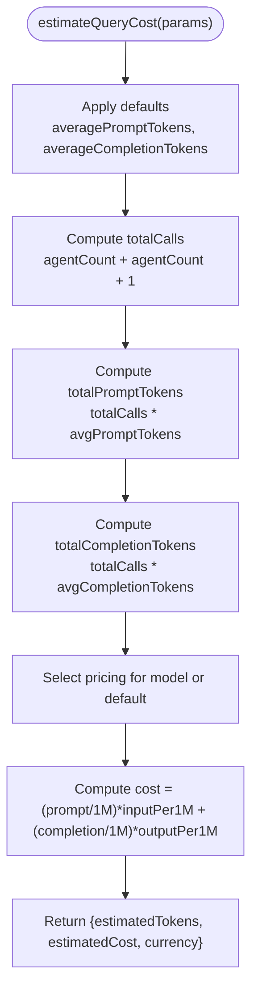
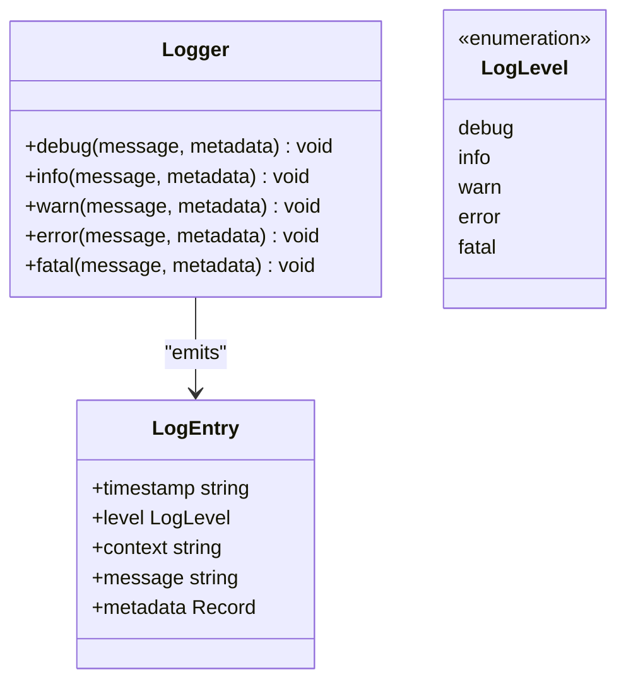
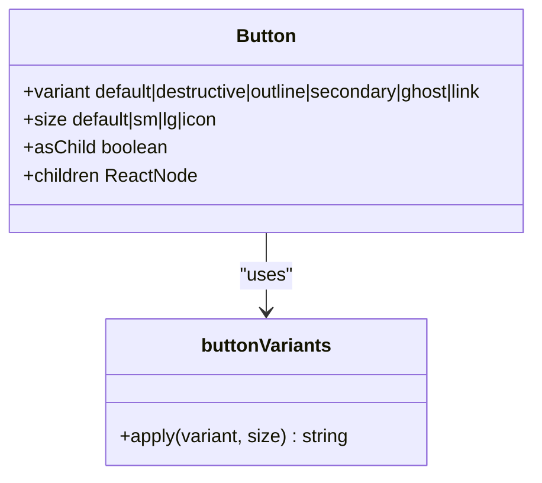
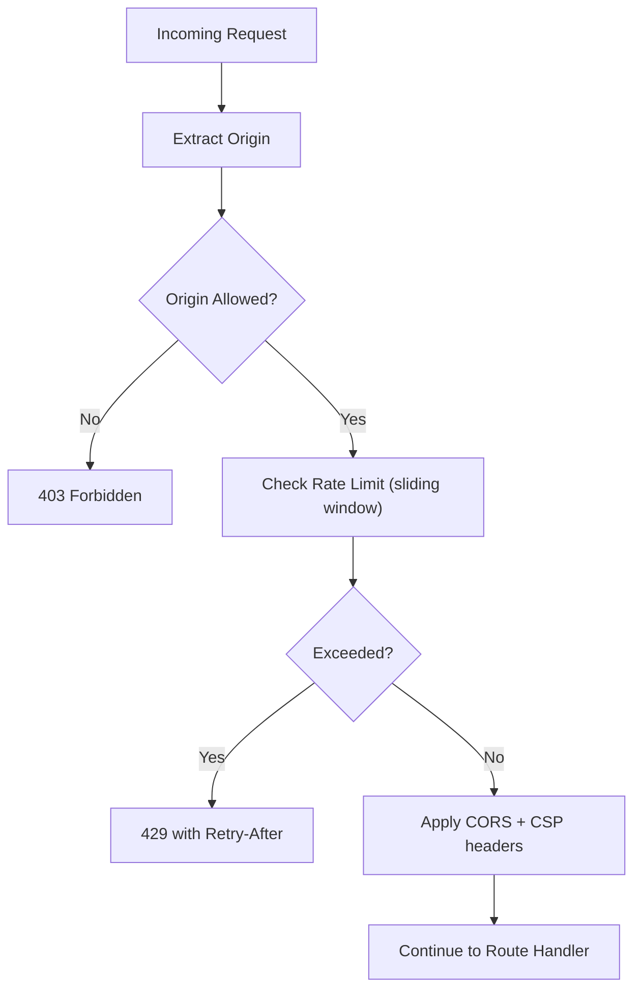
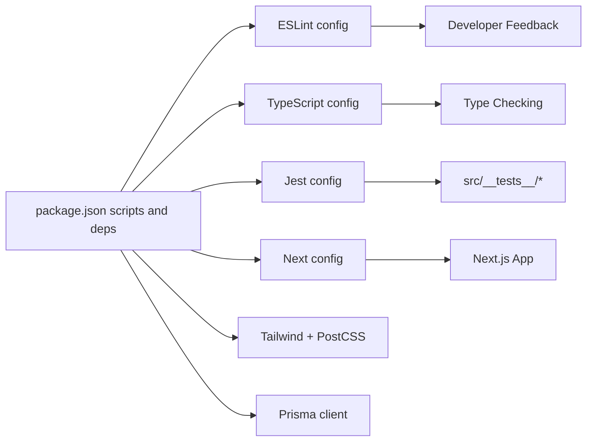

# Development Guidelines and Contributing

<cite>
**Referenced Files in This Document**
- [package.json](file://package.json)
- [eslint.config.mjs](file://eslint.config.mjs)
- [tsconfig.json](file://tsconfig.json)
- [jest.config.ts](file://jest.config.ts)
- [jest.setup.ts](file://jest.setup.ts)
- [next.config.ts](file://next.config.ts)
- [components.json](file://components.json)
- [postcss.config.mjs](file://postcss.config.mjs)
- [prisma.config.ts](file://prisma.config.ts)
- [README.md](file://README.md)
- [src/core/agents/base-agent.ts](file://src/core/agents/base-agent.ts)
- [src/core/budget/estimator.ts](file://src/core/budget/estimator.ts)
- [src/lib/logger.ts](file://src/lib/logger.ts)
- [src/components/ui/button.tsx](file://src/components/ui/button.tsx)
- [src/middleware.ts](file://src/middleware.ts)
- [src/types/index.ts](file://src/types/index.ts)
- [src/__tests__/core/budget/estimator.test.ts](file://src/__tests__/core/budget/estimator.test.ts)
- [src/__tests__/lib/logger.test.ts](file://src/__tests__/lib/logger.test.ts)
</cite>

## Table of Contents
1. [Introduction](#introduction)
2. [Project Structure](#project-structure)
3. [Core Components](#core-components)
4. [Architecture Overview](#architecture-overview)
5. [Detailed Component Analysis](#detailed-component-analysis)
6. [Dependency Analysis](#dependency-analysis)
7. [Performance Considerations](#performance-considerations)
8. [Troubleshooting Guide](#troubleshooting-guide)
9. [Contribution Guidelines](#contribution-guidelines)
10. [Quality Gates and Testing Requirements](#quality-gates-and-testing-requirements)
11. [Code Review Guidelines](#code-review-guidelines)
12. [Development Workflow](#development-workflow)
13. [Setup and Environment](#setup-and-environment)
14. [Debugging and Profiling](#debugging-and-profiling)
15. [Conclusion](#conclusion)

## Introduction
This document provides comprehensive development guidelines for contributors to the Deep Thinking AI project. It covers code standards (TypeScript configuration, ESLint rules, naming conventions), development workflow (branches, commits, pull requests), code review expectations, testing and quality gates, project structure conventions, architectural decisions, contribution and issue reporting practices, and environment setup with debugging and performance profiling tailored for the multi-agent system.

## Project Structure
The project follows a Next.js application layout with a clear separation of concerns:
- Core runtime logic under src/core (agents, budget, concurrency, council, iacp, memory, providers)
- Shared libraries under src/lib (cache, circuit-breaker, db, errors, logger, metrics, query-intelligence)
- UI components under src/components (agents, chat, council, effects, layout, ui)
- Application pages and routing under src/app
- Stores under src/stores
- Types under src/types
- Middleware under src/middleware.ts
- Tests under src/__tests__

**Diagram sources**
- [src/core/agents/base-agent.ts](file://src/core/agents/base-agent.ts)
- [src/core/budget/estimator.ts](file://src/core/budget/estimator.ts)
- [src/lib/logger.ts](file://src/lib/logger.ts)
- [src/components/ui/button.tsx](file://src/components/ui/button.tsx)
- [src/middleware.ts](file://src/middleware.ts)
- [src/types/index.ts](file://src/types/index.ts)

**Section sources**
- [README.md](file://README.md)
- [components.json](file://components.json)

## Core Components
This section documents the foundational building blocks used across the multi-agent system.

- BaseAgent: Implements thinking, discussion, verification, and parsing helpers for multi-agent reasoning. Supports Tree-of-Thought, Chain-of-Thought, and confidence scoring.
- Budget Estimator: Computes token and cost estimates for multi-agent runs based on model pricing and call counts.
- Logger: Provides structured logging with configurable levels and production-safe JSON formatting.
- Middleware: Enforces CORS, CSP, origin validation, and sliding-window rate limiting for API routes.

Key implementation patterns:
- Centralized prompt construction and memory-aware context building
- Robust parsing of structured outputs (discussion responses, verification results)
- Configurable provider abstractions and domain-specific agent definitions

**Section sources**
- [src/core/agents/base-agent.ts](file://src/core/agents/base-agent.ts)
- [src/core/budget/estimator.ts](file://src/core/budget/estimator.ts)
- [src/lib/logger.ts](file://src/lib/logger.ts)
- [src/middleware.ts](file://src/middleware.ts)

## Architecture Overview
The system orchestrates multiple specialized agents that reason independently, discuss, and synthesize conclusions. A central bus (IACP) facilitates inter-agent communication. Budget estimation and rate limiting ensure resource safety and fair usage.

**Diagram sources**
- [src/core/agents/base-agent.ts](file://src/core/agents/base-agent.ts)
- [src/middleware.ts](file://src/middleware.ts)

## Detailed Component Analysis

### BaseAgent Analysis
- Responsibilities:
  - Construct prompts with optional memory context
  - Invoke provider chat with tuned parameters
  - Parse structured outputs and confidence scores
  - Store high-confidence thoughts as reusable memories
- Design highlights:
  - Static methods enable stateless reasoning workflows
  - Extensible prompt templates per agent domain
  - Fallback mechanisms for memory unavailability

**Diagram sources**
- [src/core/agents/base-agent.ts](file://src/core/agents/base-agent.ts)

**Section sources**
- [src/core/agents/base-agent.ts](file://src/core/agents/base-agent.ts)

### Budget Estimator Analysis
- Responsibilities:
  - Estimate total tokens and cost across agent thinking, discussion, and synthesis phases
  - Support multiple provider models with fixed pricing tiers
- Design highlights:
  - Configurable defaults and extensible model pricing
  - Clear separation of prompt/completion token assumptions

**Diagram sources**
- [src/core/budget/estimator.ts](file://src/core/budget/estimator.ts)

**Section sources**
- [src/core/budget/estimator.ts](file://src/core/budget/estimator.ts)

### Logger Analysis
- Responsibilities:
  - Provide structured logging with configurable minimum levels
  - Emit logs in production-safe JSON or development-friendly formats
- Design highlights:
  - Environment-driven log level selection
  - Metadata support for contextual tracing

**Diagram sources**
- [src/lib/logger.ts](file://src/lib/logger.ts)

**Section sources**
- [src/lib/logger.ts](file://src/lib/logger.ts)

### UI Button Component Analysis
- Responsibilities:
  - Provide a reusable, themeable button with variants and sizes
  - Support radix slot composition and SVG sizing
- Design highlights:
  - Variants and sizes defined via class-variance-authority
  - ForwardRef pattern for native button attributes

**Diagram sources**
- [src/components/ui/button.tsx](file://src/components/ui/button.tsx)

**Section sources**
- [src/components/ui/button.tsx](file://src/components/ui/button.tsx)

### Middleware Analysis
- Responsibilities:
  - Validate request origins against configured allow-list or same-origin
  - Apply CORS and CSP headers
  - Enforce sliding-window rate limiting for API routes
- Design highlights:
  - In-memory store with periodic cleanup
  - Preflight OPTIONS handling

**Diagram sources**
- [src/middleware.ts](file://src/middleware.ts)

**Section sources**
- [src/middleware.ts](file://src/middleware.ts)

## Dependency Analysis
External and internal dependencies shape the project’s runtime and tooling.

- Tooling and Linting:
  - ESLint with Next.js recommended configs and TypeScript support
  - TypeScript strict mode and bundler resolution
- Testing:
  - Jest with JSDOM environment and next/jest integration
  - Module name mapping to src/*
- Build and UI:
  - Next.js, Tailwind CSS v4, Radix UI, shadcn/ui components
- Data and Persistence:
  - Prisma client and adapter for SQLite

**Diagram sources**
- [package.json](file://package.json)
- [eslint.config.mjs](file://eslint.config.mjs)
- [tsconfig.json](file://tsconfig.json)
- [jest.config.ts](file://jest.config.ts)
- [next.config.ts](file://next.config.ts)
- [postcss.config.mjs](file://postcss.config.mjs)
- [prisma.config.ts](file://prisma.config.ts)

**Section sources**
- [package.json](file://package.json)
- [eslint.config.mjs](file://eslint.config.mjs)
- [tsconfig.json](file://tsconfig.json)
- [jest.config.ts](file://jest.config.ts)
- [next.config.ts](file://next.config.ts)
- [postcss.config.mjs](file://postcss.config.mjs)
- [prisma.config.ts](file://prisma.config.ts)

## Performance Considerations
- Token and cost estimation:
  - Use the budget estimator to pre-compute costs for multi-agent runs and avoid unexpected provider charges.
- Rate limiting:
  - Middleware enforces a sliding-window policy; tune thresholds and cleanup intervals as needed.
- Memory context:
  - BaseAgent optionally builds memory context windows; ensure memory availability to reduce repeated prompt tokens.
- Provider temperature and token limits:
  - Adjust provider parameters per agent phase to balance quality and throughput.

[No sources needed since this section provides general guidance]

## Troubleshooting Guide
Common areas to inspect during development and debugging:
- Logging:
  - Verify log level via environment variable and confirm JSON vs. formatted output in production.
- Middleware:
  - Confirm allowed origins, rate-limit headers, and CSP policies when encountering CORS or throttling issues.
- Tests:
  - Run unit tests for budget estimation and logger behavior to validate assumptions and environment overrides.

**Section sources**
- [src/lib/logger.ts](file://src/lib/logger.ts)
- [src/middleware.ts](file://src/middleware.ts)
- [src/__tests__/core/budget/estimator.test.ts](file://src/__tests__/core/budget/estimator.test.ts)
- [src/__tests__/lib/logger.test.ts](file://src/__tests__/lib/logger.test.ts)

## Contribution Guidelines
- Issue reporting:
  - Use repository issues to report bugs, request features, or propose changes. Include environment details, reproduction steps, and expected vs. actual behavior.
- Community engagement:
  - Keep discussions respectful and focused on improving the multi-agent system. Reference related issues and PRs for context.
- Pull requests:
  - Open PRs against the default branch. Include a clear description, rationale, and links to related issues. Ensure tests pass and code adheres to style and naming conventions.

[No sources needed since this section summarizes general practices]

## Quality Gates and Testing Requirements
- Test coverage:
  - Core and lib modules are included in coverage collection; maintain or improve coverage for new features.
- Unit tests:
  - Validate budget calculations, logger behavior, and agent parsing logic.
- Linting:
  - Run ESLint to enforce style and correctness rules aligned with Next.js and TypeScript recommendations.
- Type checking:
  - Ensure TypeScript compilation succeeds and strict mode remains enabled.

**Section sources**
- [jest.config.ts](file://jest.config.ts)
- [jest.setup.ts](file://jest.setup.ts)
- [eslint.config.mjs](file://eslint.config.mjs)
- [tsconfig.json](file://tsconfig.json)

## Code Review Guidelines
- Clarity and correctness:
  - Prefer explicit prompt construction and robust parsing helpers. Validate provider responses and handle fallbacks gracefully.
- Performance and safety:
  - Use budget estimation to bound resource usage. Apply rate limiting and origin checks in middleware.
- Maintainability:
  - Keep agent logic modular and reusable. Centralize shared utilities in lib and core modules.
- Documentation:
  - Add comments for complex parsing or estimation logic; update types when extending capabilities.

[No sources needed since this section provides general guidance]

## Development Workflow
- Branching:
  - Use feature branches for new work; rebase or merge after review.
- Commits:
  - Keep commits focused and descriptive. Reference issues in commit messages.
- Pull requests:
  - Include a summary, motivation, and testing plan. Address reviewer feedback promptly.

[No sources needed since this section provides general guidance]

## Setup and Environment
- Install dependencies:
  - Use your preferred package manager to install dependencies declared in the project configuration.
- Development server:
  - Start the Next.js dev server and navigate to the local port to verify the UI.
- Environment variables:
  - Configure database URL for Prisma and any provider credentials required by agents.
- UI component library:
  - Follow shadcn/ui setup to register components and aliases.

**Section sources**
- [README.md](file://README.md)
- [package.json](file://package.json)
- [prisma.config.ts](file://prisma.config.ts)
- [components.json](file://components.json)

## Debugging and Profiling
- Local debugging:
  - Use console logging with the logger utility and adjust log levels via environment variables.
- Profiling:
  - Monitor token usage and cost via the budget estimator; correlate with agent phases to identify hotspots.
- Middleware diagnostics:
  - Inspect rate-limit headers and origin validation outcomes to troubleshoot API access issues.

**Section sources**
- [src/lib/logger.ts](file://src/lib/logger.ts)
- [src/core/budget/estimator.ts](file://src/core/budget/estimator.ts)
- [src/middleware.ts](file://src/middleware.ts)

## Conclusion
These guidelines establish a consistent foundation for developing the Deep Thinking AI multi-agent system. By adhering to the documented standards, workflows, and quality practices, contributors can collaborate effectively, maintain high code quality, and deliver reliable enhancements to the platform.