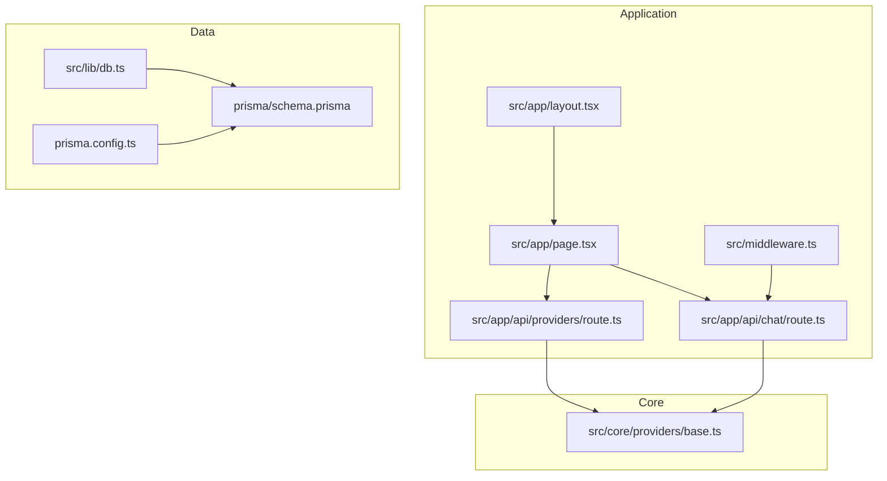
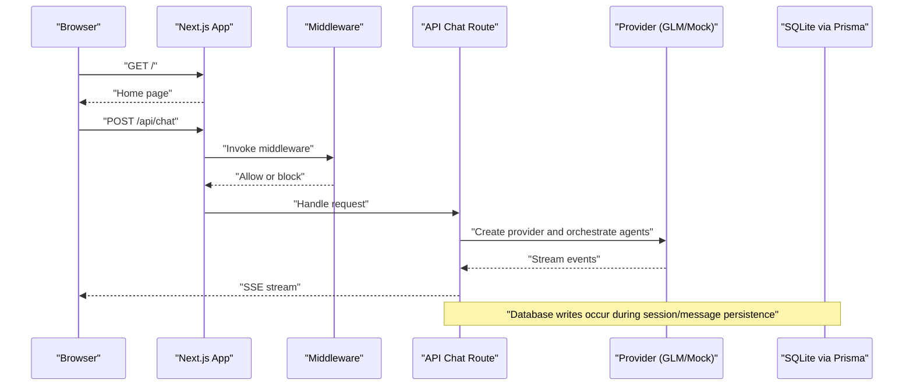
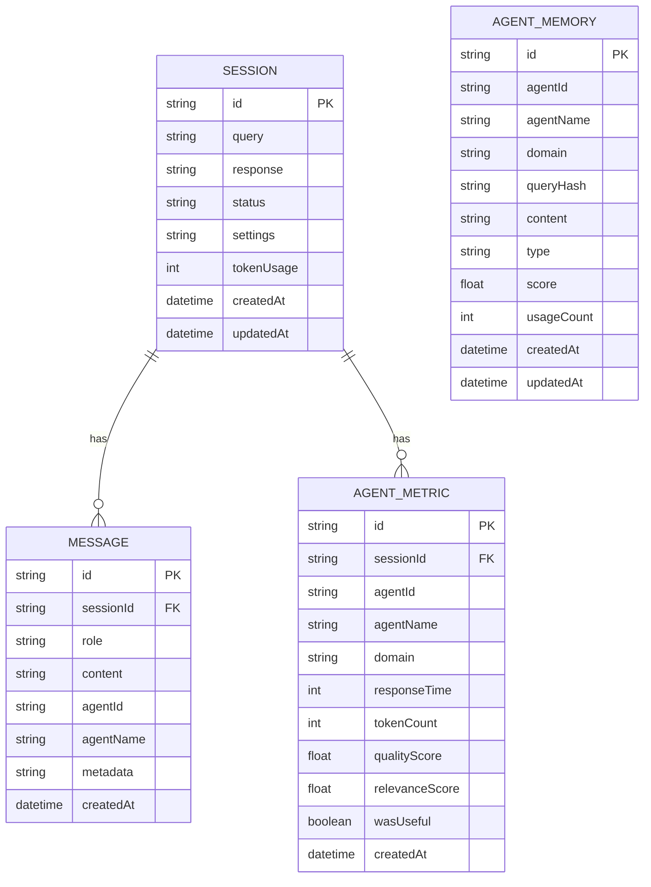
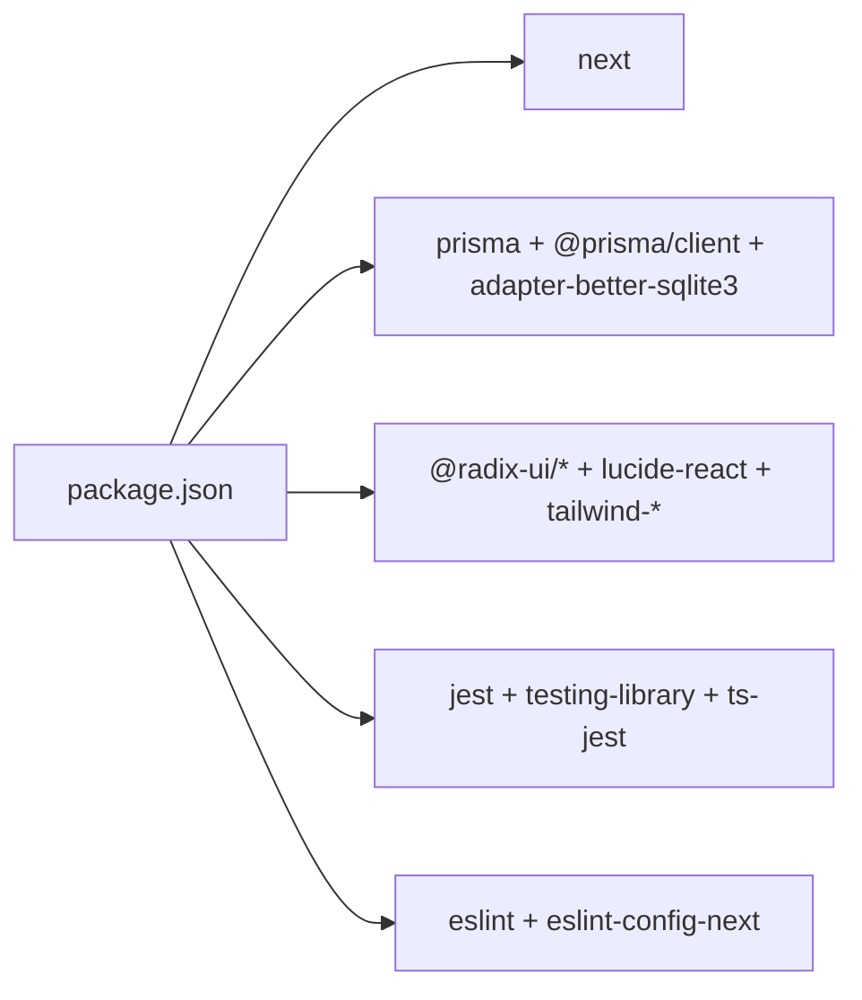

# Getting Started

<cite>
**Referenced Files in This Document**
- [README.md](file://README.md)
- [package.json](file://package.json)
- [tsconfig.json](file://tsconfig.json)
- [next.config.ts](file://next.config.ts)
- [prisma.config.ts](file://prisma.config.ts)
- [prisma/schema.prisma](file://prisma/schema.prisma)
- [src/lib/db.ts](file://src/lib/db.ts)
- [src/middleware.ts](file://src/middleware.ts)
- [src/app/layout.tsx](file://src/app/layout.tsx)
- [src/app/page.tsx](file://src/app/page.tsx)
- [src/app/api/chat/route.ts](file://src/app/api/chat/route.ts)
- [src/app/api/providers/route.ts](file://src/app/api/providers/route.ts)
- [src/core/providers/base.ts](file://src/core/providers/base.ts)
</cite>

## Table of Contents
1. [Introduction](#introduction)
2. [Project Structure](#project-structure)
3. [Core Components](#core-components)
4. [Architecture Overview](#architecture-overview)
5. [Detailed Component Analysis](#detailed-component-analysis)
6. [Dependency Analysis](#dependency-analysis)
7. [Performance Considerations](#performance-considerations)
8. [Troubleshooting Guide](#troubleshooting-guide)
9. [Conclusion](#conclusion)
10. [Appendices](#appendices)

## Introduction
This guide helps you install, configure, and run Deep Thinking AI locally for the first time. You will set up prerequisites, install dependencies, initialize the local SQLite database with Prisma, configure environment variables, start the development server with hot reload, and complete a first-run tutorial to submit a query, observe multi-agent interactions, and interpret results. It also includes troubleshooting tips and verification steps to ensure everything works as expected.

## Project Structure
Deep Thinking AI is a Next.js application with a TypeScript codebase, a SQLite database via Prisma, and a modular core for agents and providers. Key areas:
- Application shell and routing under src/app
- Core systems for agents, providers, budgeting, concurrency, and council orchestration under src/core
- UI components under src/components
- Utilities and stores under src/lib and src/stores
- Prisma schema and configuration under prisma
- Environment and middleware under src

**Diagram sources**
- [src/app/layout.tsx:1-28](file://src/app/layout.tsx#L1-L28)
- [src/app/page.tsx:1-68](file://src/app/page.tsx#L1-L68)
- [src/app/api/chat/route.ts:1-200](file://src/app/api/chat/route.ts#L1-L200)
- [src/app/api/providers/route.ts:1-25](file://src/app/api/providers/route.ts#L1-L25)
- [src/middleware.ts:1-217](file://src/middleware.ts#L1-L217)
- [prisma.config.ts:1-15](file://prisma.config.ts#L1-L15)
- [prisma/schema.prisma:1-66](file://prisma/schema.prisma#L1-L66)
- [src/lib/db.ts:1-18](file://src/lib/db.ts#L1-L18)
- [src/core/providers/base.ts:1-83](file://src/core/providers/base.ts#L1-L83)

**Section sources**
- [README.md:1-37](file://README.md#L1-L37)
- [package.json:1-60](file://package.json#L1-L60)
- [tsconfig.json:1-35](file://tsconfig.json#L1-L35)
- [next.config.ts:1-8](file://next.config.ts#L1-L8)
- [prisma.config.ts:1-15](file://prisma.config.ts#L1-L15)
- [prisma/schema.prisma:1-66](file://prisma/schema.prisma#L1-L66)
- [src/lib/db.ts:1-18](file://src/lib/db.ts#L1-L18)
- [src/middleware.ts:1-217](file://src/middleware.ts#L1-L217)
- [src/app/layout.tsx:1-28](file://src/app/layout.tsx#L1-L28)
- [src/app/page.tsx:1-68](file://src/app/page.tsx#L1-L68)
- [src/app/api/chat/route.ts:1-200](file://src/app/api/chat/route.ts#L1-L200)
- [src/app/api/providers/route.ts:1-25](file://src/app/api/providers/route.ts#L1-L25)
- [src/core/providers/base.ts:1-83](file://src/core/providers/base.ts#L1-L83)

## Core Components
- Prisma client and adapter: Uses a better-sqlite3 adapter to connect to a local SQLite database file.
- Middleware: Applies CORS, CSP, origin validation, and rate limiting for API routes.
- Providers: Pluggable AI providers (e.g., GLM, OpenAI, Anthropic) with a base class defining capabilities and streaming support.
- API routes: Chat endpoint streams multi-agent reasoning via Server-Sent Events; providers endpoint reports configured providers.

**Section sources**
- [src/lib/db.ts:1-18](file://src/lib/db.ts#L1-L18)
- [src/middleware.ts:1-217](file://src/middleware.ts#L1-L217)
- [src/core/providers/base.ts:1-83](file://src/core/providers/base.ts#L1-L83)
- [src/app/api/chat/route.ts:1-200](file://src/app/api/chat/route.ts#L1-L200)
- [src/app/api/providers/route.ts:1-25](file://src/app/api/providers/route.ts#L1-L25)

## Architecture Overview
The system runs as a Next.js app with a front-end UI and serverless-style API routes. Requests are processed through middleware for security and rate limiting, then routed to provider-specific logic that orchestrates multiple agents to produce streamed responses.

**Diagram sources**
- [src/app/api/chat/route.ts:85-199](file://src/app/api/chat/route.ts#L85-L199)
- [src/middleware.ts:166-211](file://src/middleware.ts#L166-L211)
- [src/lib/db.ts:1-18](file://src/lib/db.ts#L1-L18)

## Detailed Component Analysis

### Prerequisites and Environment Setup
- Node.js: The project targets ES2017 and uses Next.js 16. Ensure your Node.js version satisfies the project’s compiler target and runtime expectations.
- Package managers: The project supports npm, yarn, pnpm, and bun for development scripts.
- Environment variables:
  - Required for providers: GLM_API_KEY, OPENAI_API_KEY, ANTHROPIC_API_KEY
  - Optional: ALLOWED_ORIGINS (comma-separated), GLM_BASE_URL, GLM_MODEL
  - Database URL: DATABASE_URL (defaults to a local SQLite file if unset)

Verification steps:
- Confirm Node.js version meets the TS target and Next.js version.
- Verify environment variables are present in your shell or a .env file.
- Confirm Prisma configuration resolves the database URL.

**Section sources**
- [tsconfig.json:3-4](file://tsconfig.json#L3-L4)
- [package.json:5-14](file://package.json#L5-L14)
- [prisma.config.ts:11-14](file://prisma.config.ts#L11-L14)
- [src/app/api/providers/route.ts:7-21](file://src/app/api/providers/route.ts#L7-L21)
- [src/app/api/chat/route.ts:68-79](file://src/app/api/chat/route.ts#L68-L79)
- [src/middleware.ts:10-16](file://src/middleware.ts#L10-L16)

### Installation Steps
1. Install dependencies
   - Run your preferred package manager install command.
2. Initialize the database
   - Prisma generates client bindings and uses a SQLite file by default.
   - Ensure the SQLite file path exists and is writable.
3. Configure environment variables
   - Set provider keys and optional overrides as needed.
4. Start the development server
   - Use the dev script to launch Next.js with hot reload on the default port.

Verification:
- Visit http://localhost:3000 to confirm the home page loads.
- Navigate to the chat interface and test the providers endpoint.

**Section sources**
- [package.json:5-14](file://package.json#L5-L14)
- [prisma.config.ts:1-15](file://prisma.config.ts#L1-15)
- [prisma/schema.prisma:1-66](file://prisma/schema.prisma#L1-L66)
- [src/lib/db.ts:1-18](file://src/lib/db.ts#L1-L18)
- [README.md:5-17](file://README.md#L5-L17)

### Development Server and Hot Reload
- The dev script starts Next.js in development mode with automatic reloading.
- The default port is 3000; change it via Next.js configuration if needed.

**Section sources**
- [package.json:6](file://package.json#L6)
- [next.config.ts:1-8](file://next.config.ts#L1-L8)
- [README.md:17](file://README.md#L17)

### First-Run Tutorial
Goal: Submit a query, observe multi-agent interactions, and interpret results.

Steps:
1. Open the home page and click the “Start a conversation” button.
2. Enter a query in the chat input and submit.
3. Observe the SSE stream as agents discuss and refine the answer.
4. Review the final response and any agent metrics or messages recorded in the database.

What happens behind the scenes:
- The chat route validates and sanitizes the query, detects unsafe prompts, and enforces limits.
- It selects a provider (GLM by default) and orchestrates a small council of agents.
- Responses are streamed via Server-Sent Events for real-time updates.

**Section sources**
- [src/app/page.tsx:42-48](file://src/app/page.tsx#L42-L48)
- [src/app/api/chat/route.ts:85-199](file://src/app/api/chat/route.ts#L85-L199)
- [src/app/api/providers/route.ts:1-25](file://src/app/api/providers/route.ts#L1-L25)
- [src/middleware.ts:166-211](file://src/middleware.ts#L166-L211)

### Database Initialization with Prisma
- Prisma client is generated and stored under src/generated/prisma.
- The schema defines models for sessions, messages, agent metrics, and agent memory.
- The adapter connects to a local SQLite file; the path is resolved from the project root.

**Diagram sources**
- [prisma/schema.prisma:10-65](file://prisma/schema.prisma#L10-L65)

**Section sources**
- [prisma/schema.prisma:1-66](file://prisma/schema.prisma#L1-L66)
- [src/lib/db.ts:1-18](file://src/lib/db.ts#L1-L18)
- [prisma.config.ts:1-15](file://prisma.config.ts#L1-L15)

### Environment Variable Configuration
- Provider keys: Set GLM_API_KEY, OPENAI_API_KEY, ANTHROPIC_API_KEY to enable respective providers.
- Origins: ALLOWED_ORIGINS controls CORS behavior for API routes.
- Model and base URL: GLM_MODEL and GLM_BASE_URL customize provider behavior.
- Database: DATABASE_URL can override the default SQLite file location.

**Section sources**
- [src/app/api/providers/route.ts:7-21](file://src/app/api/providers/route.ts#L7-L21)
- [src/app/api/chat/route.ts:68-79](file://src/app/api/chat/route.ts#L68-L79)
- [src/middleware.ts:10-16](file://src/middleware.ts#L10-L16)
- [prisma.config.ts:11-14](file://prisma.config.ts#L11-L14)

## Dependency Analysis
High-level dependencies:
- Next.js runtime and app router
- Prisma client and adapter for SQLite
- UI primitives and design system packages
- Testing and linting toolchains

**Diagram sources**
- [package.json:13-58](file://package.json#L13-L58)

**Section sources**
- [package.json:13-58](file://package.json#L13-L58)

## Performance Considerations
- Streaming responses: The chat endpoint emits Server-Sent Events to reduce perceived latency.
- Concurrency control: The chat route accepts a concurrency limit parameter to cap simultaneous agent work.
- Rate limiting: Middleware applies an in-memory sliding window to protect the API.
- SQLite sizing: For local development, the default SQLite file is sufficient; scale considerations apply for production deployments.

[No sources needed since this section provides general guidance]

## Troubleshooting Guide
Common issues and resolutions:
- Port conflicts
  - Change the port in Next.js configuration if 3000 is in use.
- Provider key errors
  - Ensure GLM_API_KEY (or other provider keys) is set; the providers endpoint reflects configured providers.
- Database connection failures
  - Verify DATABASE_URL or the default SQLite path; ensure write permissions to the project directory.
- CORS or origin errors
  - Set ALLOWED_ORIGINS to include trusted origins; otherwise, same-origin policy applies.
- Rate limit exceeded
  - The middleware enforces a per-IP sliding window; wait for the window to slide or adjust client behavior.

Verification checklist:
- Confirm the home page loads at http://localhost:3000.
- Call the providers endpoint to verify configured providers.
- Submit a short test query and watch the SSE stream.

**Section sources**
- [next.config.ts:1-8](file://next.config.ts#L1-L8)
- [src/app/api/providers/route.ts:1-25](file://src/app/api/providers/route.ts#L1-L25)
- [src/middleware.ts:10-16](file://src/middleware.ts#L10-L16)
- [src/middleware.ts:45-80](file://src/middleware.ts#L45-L80)
- [prisma.config.ts:11-14](file://prisma.config.ts#L11-L14)

## Conclusion
You are now ready to run Deep Thinking AI locally, configure providers and environment variables, and explore multi-agent reasoning through the chat interface. Use the troubleshooting guide to resolve typical setup issues and rely on the verification steps to confirm a successful installation.

[No sources needed since this section summarizes without analyzing specific files]

## Appendices

### Appendix A: Environment Variables Reference
- GLM_API_KEY: API key for GLM provider
- OPENAI_API_KEY: API key for OpenAI provider
- ANTHROPIC_API_KEY: API key for Anthropic provider
- ALLOWED_ORIGINS: Comma-separated list of allowed origins for CORS
- GLM_BASE_URL: Override base URL for GLM provider
- GLM_MODEL: Default model identifier for GLM
- DATABASE_URL: Prisma datasource URL (SQLite file path by default)

**Section sources**
- [src/app/api/providers/route.ts:7-21](file://src/app/api/providers/route.ts#L7-L21)
- [src/app/api/chat/route.ts:68-79](file://src/app/api/chat/route.ts#L68-L79)
- [src/middleware.ts:10-16](file://src/middleware.ts#L10-L16)
- [prisma.config.ts:11-14](file://prisma.config.ts#L11-L14)