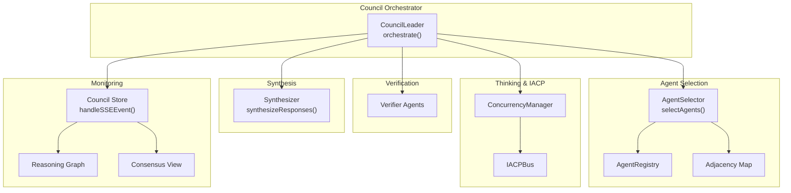
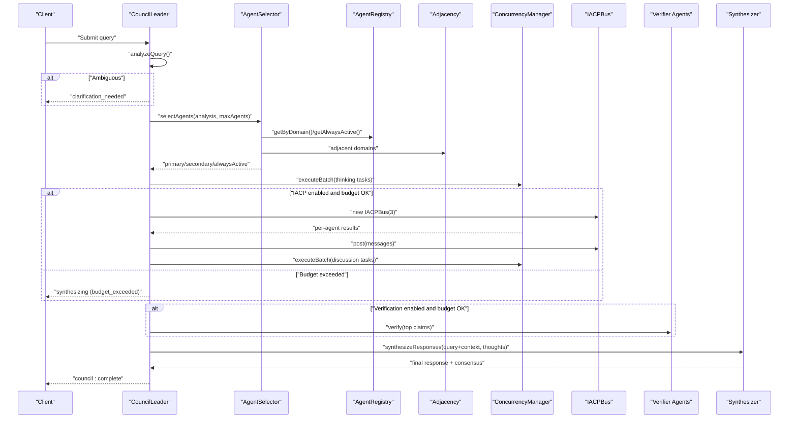
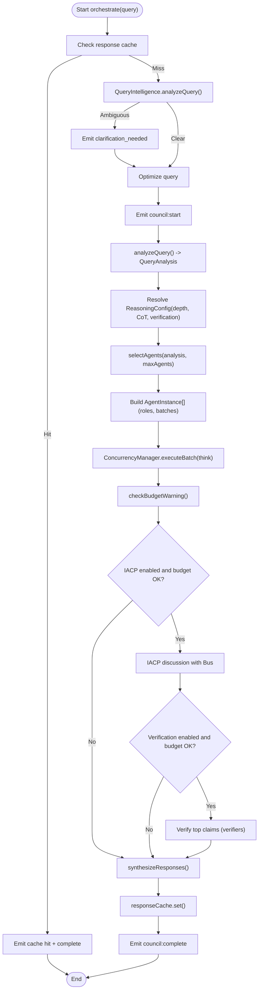
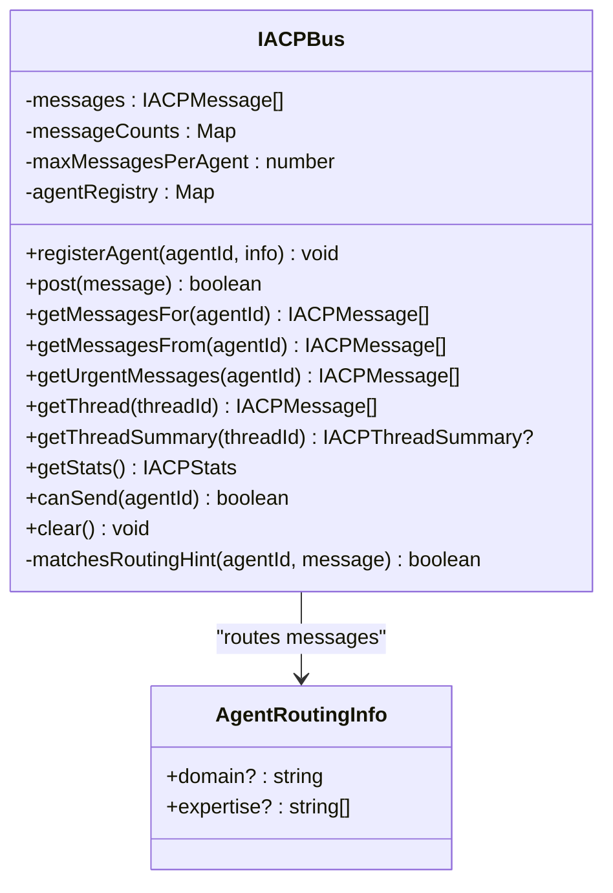
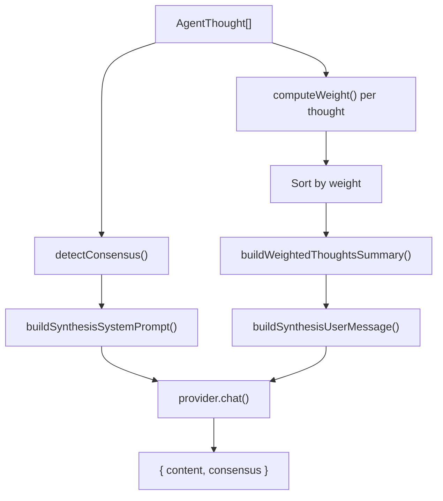
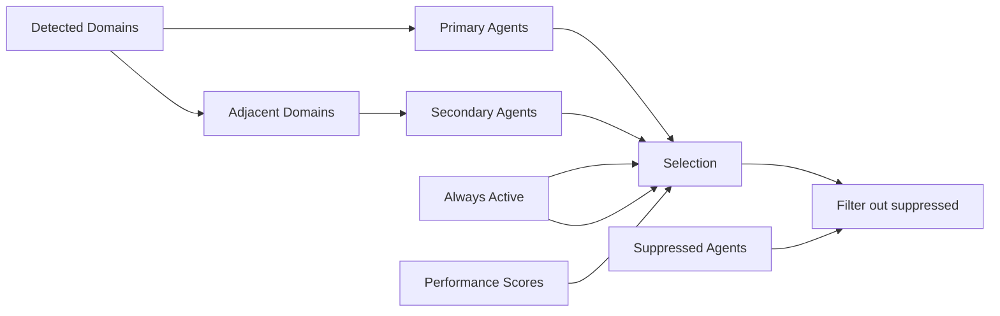
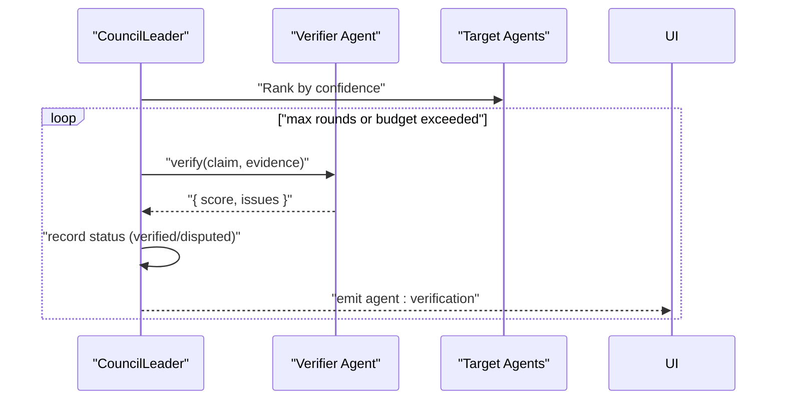
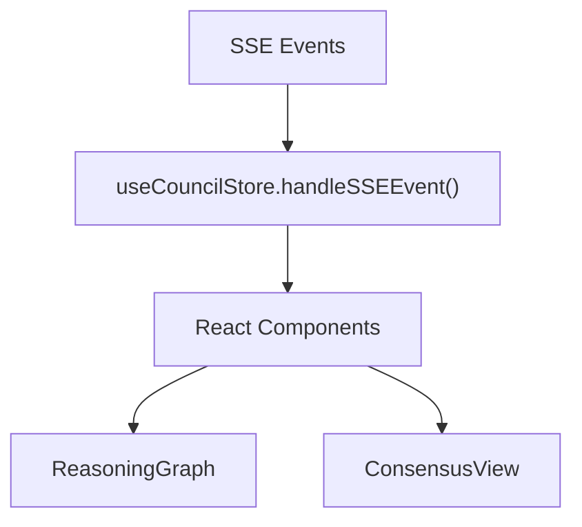
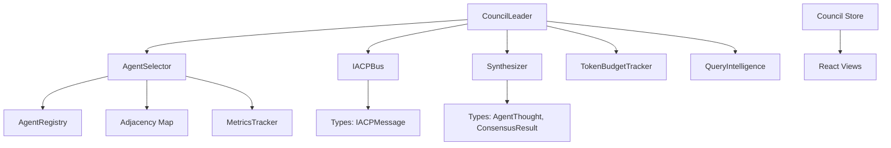

# Agent Discussion Coordination

<cite>
**Referenced Files in This Document**
- [leader.ts](file://src/core/council/leader.ts)
- [synthesizer.ts](file://src/core/council/synthesizer.ts)
- [bus.ts](file://src/core/iacp/bus.ts)
- [selector.ts](file://src/core/council/selector.ts)
- [adjacency.ts](file://src/core/council/adjacency.ts)
- [registry.ts](file://src/core/agents/registry.ts)
- [query-intelligence.ts](file://src/lib/query-intelligence.ts)
- [tracker.ts](file://src/core/budget/tracker.ts)
- [metrics.ts](file://src/lib/metrics.ts)
- [council-store.ts](file://src/stores/council-store.ts)
- [reasoning-graph.tsx](file://src/components/council/reasoning-graph.tsx)
- [consensus-view.tsx](file://src/components/council/consensus-view.tsx)
- [agent.ts](file://src/types/agent.ts)
- [council.ts](file://src/types/council.ts)
- [iacp.ts](file://src/types/iacp.ts)
</cite>

## Table of Contents
1. [Introduction](#introduction)
2. [Project Structure](#project-structure)
3. [Core Components](#core-components)
4. [Architecture Overview](#architecture-overview)
5. [Detailed Component Analysis](#detailed-component-analysis)
6. [Dependency Analysis](#dependency-analysis)
7. [Performance Considerations](#performance-considerations)
8. [Troubleshooting Guide](#troubleshooting-guide)
9. [Conclusion](#conclusion)
10. [Appendices](#appendices)

## Introduction
This document explains how the IACP (Inter-Agent Communication Protocol) framework coordinates multi-agent discussions within the Deep Thinking AI council. It covers how the council leader orchestrates agent thinking, manages discussion threads, performs verification loops, and synthesizes diverse perspectives into a unified response. It also documents message exchange patterns, budget-aware operation, and monitoring capabilities for assessing discussion quality.

## Project Structure
The agent discussion coordination spans several core modules:
- Council leader: orchestrates phases, manages concurrency, and triggers IACP discussion and verification.
- IACP bus: routes and threads messages among agents with priority and limits.
- Synthesizer: integrates agent thoughts, detects consensus, and produces a unified response.
- Agent selection and adjacency: selects agents by domain relevance and adjacent domains.
- Query intelligence: clarifies ambiguous queries and optimizes input.
- Budget tracking and metrics: enforces token budgets and improves agent selection over time.
- Frontend stores and views: render progress, reasoning trees, and consensus.

**Diagram sources**
- [leader.ts:42-604](file://src/core/council/leader.ts#L42-L604)
- [selector.ts:27-164](file://src/core/council/selector.ts#L27-L164)
- [registry.ts:4-58](file://src/core/agents/registry.ts#L4-L58)
- [adjacency.ts:3-15](file://src/core/council/adjacency.ts#L3-L15)
- [bus.ts:15-210](file://src/core/iacp/bus.ts#L15-L210)
- [synthesizer.ts:333-371](file://src/core/council/synthesizer.ts#L333-L371)
- [council-store.ts:54-171](file://src/stores/council-store.ts#L54-L171)
- [reasoning-graph.tsx:229-257](file://src/components/council/reasoning-graph.tsx#L229-L257)
- [consensus-view.tsx:244-265](file://src/components/council/consensus-view.tsx#L244-L265)

**Section sources**
- [leader.ts:42-604](file://src/core/council/leader.ts#L42-L604)
- [bus.ts:15-210](file://src/core/iacp/bus.ts#L15-L210)
- [synthesizer.ts:333-371](file://src/core/council/synthesizer.ts#L333-L371)
- [selector.ts:27-164](file://src/core/council/selector.ts#L27-L164)
- [registry.ts:4-58](file://src/core/agents/registry.ts#L4-L58)
- [adjacency.ts:3-15](file://src/core/council/adjacency.ts#L3-L15)
- [council-store.ts:54-171](file://src/stores/council-store.ts#L54-L171)
- [reasoning-graph.tsx:229-257](file://src/components/council/reasoning-graph.tsx#L229-L257)
- [consensus-view.tsx:244-265](file://src/components/council/consensus-view.tsx#L244-L265)

## Core Components
- CouncilLeader: Drives the full lifecycle from query analysis to final synthesis, including optional IACP discussion and verification loops. It emits structured SSE events for UI updates and budget monitoring.
- IACPBus: Manages message posting, routing, threading, and priority. It supports domain-based routing hints and per-agent message caps.
- Synthesizer: Compresses and weights agent thoughts, detects consensus/disagreement, and produces a structured synthesis with confidence.
- AgentSelector: Selects primary and secondary agents based on detected domains, adjacency, and historical performance metrics.
- QueryIntelligence: Clarifies ambiguous queries, estimates complexity and agent count, and optimizes query text.
- TokenBudgetTracker: Tracks token usage per agent and overall to enforce budget thresholds.
- MetricsTracker: Computes agent performance scores and suppression lists to improve selection quality.
- Frontend Stores and Views: Render real-time orchestration state, reasoning trees, and consensus results.

**Section sources**
- [leader.ts:33-604](file://src/core/council/leader.ts#L33-L604)
- [bus.ts:15-210](file://src/core/iacp/bus.ts#L15-L210)
- [synthesizer.ts:17-591](file://src/core/council/synthesizer.ts#L17-L591)
- [selector.ts:27-164](file://src/core/council/selector.ts#L27-L164)
- [query-intelligence.ts:55-240](file://src/lib/query-intelligence.ts#L55-L240)
- [tracker.ts:3-78](file://src/core/budget/tracker.ts#L3-L78)
- [metrics.ts:42-225](file://src/lib/metrics.ts#L42-L225)
- [council-store.ts:41-188](file://src/stores/council-store.ts#L41-L188)

## Architecture Overview
The council leader coordinates a multi-phase process:
1. Query analysis and optional clarification
2. Agent selection (primary, secondary, always-active)
3. Concurrent agent thinking (single or multiple reasoning branches)
4. Optional IACP discussion among participating agents
5. Verification loop with dedicated verifier agents
6. Synthesis with consensus detection and weighting
7. Final response with caching and budget reporting

**Diagram sources**
- [leader.ts:42-604](file://src/core/council/leader.ts#L42-L604)
- [selector.ts:27-164](file://src/core/council/selector.ts#L27-L164)
- [registry.ts:4-58](file://src/core/agents/registry.ts#L4-L58)
- [adjacency.ts:3-15](file://src/core/council/adjacency.ts#L3-L15)
- [bus.ts:15-210](file://src/core/iacp/bus.ts#L15-L210)
- [synthesizer.ts:333-371](file://src/core/council/synthesizer.ts#L333-L371)

## Detailed Component Analysis

### Council Leader Orchestration
The council leader drives the entire workflow:
- Query analysis and optional clarification via QueryIntelligence
- Agent selection with domain relevance, adjacency, and performance metrics
- Concurrent thinking with optional Tree-of-Thought branching and optional Chain-of-Thought refinement
- IACP discussion among primary and always-active agents
- Verification loop with dedicated verifier agents
- Synthesis with consensus and weighting
- Budget enforcement and warnings
- Caching and SSE event emission for UI updates

**Diagram sources**
- [leader.ts:42-604](file://src/core/council/leader.ts#L42-L604)
- [query-intelligence.ts:59-137](file://src/lib/query-intelligence.ts#L59-L137)
- [selector.ts:27-164](file://src/core/council/selector.ts#L27-L164)
- [tracker.ts:51-72](file://src/core/budget/tracker.ts#L51-L72)

**Section sources**
- [leader.ts:42-604](file://src/core/council/leader.ts#L42-L604)
- [query-intelligence.ts:59-137](file://src/lib/query-intelligence.ts#L59-L137)
- [selector.ts:27-164](file://src/core/council/selector.ts#L27-L164)
- [tracker.ts:51-72](file://src/core/budget/tracker.ts#L51-L72)

### IACP Message Bus and Discussion Threads
The IACP bus enables controlled, prioritized, and threaded communication:
- Message posting with automatic thread resolution
- Priority-based sorting (urgent → normal → low)
- Routing hints for domain and expertise targeting
- Per-agent message caps to prevent flooding
- Thread summaries and statistics

**Diagram sources**
- [bus.ts:15-210](file://src/core/iacp/bus.ts#L15-L210)
- [iacp.ts:21-47](file://src/types/iacp.ts#L21-L47)

**Section sources**
- [bus.ts:15-210](file://src/core/iacp/bus.ts#L15-L210)
- [iacp.ts:21-47](file://src/types/iacp.ts#L21-L47)

### Synthesizer: Consensus Detection and Weighted Integration
The synthesizer transforms raw agent thoughts into a unified response:
- Thought compression and grouping
- Weight computation (confidence × domain relevance)
- Consensus and disagreement detection
- Progressive synthesis support for streaming insights

**Diagram sources**
- [synthesizer.ts:137-371](file://src/core/council/synthesizer.ts#L137-L371)
- [synthesizer.ts:390-503](file://src/core/council/synthesizer.ts#L390-L503)

**Section sources**
- [synthesizer.ts:17-591](file://src/core/council/synthesizer.ts#L17-L591)

### Agent Selection and Adjacency
Agent selection balances domain relevance, adjacency, and performance:
- Primary agents from detected domains
- Secondary agents from adjacent domains
- Always-active agents (verifiers, devil’s advocate)
- Suppression of consistently underperforming agents
- Confidence scoring based on performance metrics

**Diagram sources**
- [selector.ts:27-164](file://src/core/council/selector.ts#L27-L164)
- [adjacency.ts:3-15](file://src/core/council/adjacency.ts#L3-L15)
- [registry.ts:29-35](file://src/core/agents/registry.ts#L29-L35)
- [metrics.ts:122-132](file://src/lib/metrics.ts#L122-L132)

**Section sources**
- [selector.ts:27-164](file://src/core/council/selector.ts#L27-L164)
- [adjacency.ts:3-15](file://src/core/council/adjacency.ts#L3-L15)
- [registry.ts:29-35](file://src/core/agents/registry.ts#L29-L35)
- [metrics.ts:122-132](file://src/lib/metrics.ts#L122-L132)

### Verification Loop and Debate Resolution
The leader runs a configurable verification loop:
- Selects top claims by confidence
- Uses dedicated verifier agents to assess validity and issues
- Records verification status (verified/disputed/unverified)
- Emits agent:verification events for UI and audit

**Diagram sources**
- [leader.ts:412-503](file://src/core/council/leader.ts#L412-L503)

**Section sources**
- [leader.ts:412-503](file://src/core/council/leader.ts#L412-L503)

### Frontend Monitoring and Visualization
The frontend consumes SSE events and renders:
- Real-time orchestration status and agent states
- Reasoning graphs showing branches and confidence
- Consensus views highlighting agreement and disagreement

**Diagram sources**
- [council-store.ts:54-171](file://src/stores/council-store.ts#L54-L171)
- [reasoning-graph.tsx:229-257](file://src/components/council/reasoning-graph.tsx#L229-L257)
- [consensus-view.tsx:244-265](file://src/components/council/consensus-view.tsx#L244-L265)

**Section sources**
- [council-store.ts:54-171](file://src/stores/council-store.ts#L54-L171)
- [reasoning-graph.tsx:229-257](file://src/components/council/reasoning-graph.tsx#L229-L257)
- [consensus-view.tsx:244-265](file://src/components/council/consensus-view.tsx#L244-L265)

## Dependency Analysis
Key dependencies and interactions:
- CouncilLeader depends on AgentSelector, IACPBus, Synthesizer, TokenBudgetTracker, and QueryIntelligence.
- IACPBus depends on agent routing info and message types.
- Synthesizer depends on AgentThought and ConsensusResult types.
- AgentSelector depends on AgentRegistry and adjacency map, and metrics for suppression.
- Frontend components depend on Zustand store and types.

**Diagram sources**
- [leader.ts:33-604](file://src/core/council/leader.ts#L33-L604)
- [selector.ts:27-164](file://src/core/council/selector.ts#L27-L164)
- [registry.ts:4-58](file://src/core/agents/registry.ts#L4-L58)
- [adjacency.ts:3-15](file://src/core/council/adjacency.ts#L3-L15)
- [metrics.ts:42-225](file://src/lib/metrics.ts#L42-L225)
- [synthesizer.ts:17-591](file://src/core/council/synthesizer.ts#L17-L591)
- [bus.ts:15-210](file://src/core/iacp/bus.ts#L15-L210)
- [council-store.ts:41-188](file://src/stores/council-store.ts#L41-L188)
- [agent.ts:25-57](file://src/types/agent.ts#L25-L57)
- [council.ts:5-114](file://src/types/council.ts#L5-L114)
- [iacp.ts:27-67](file://src/types/iacp.ts#L27-L67)

**Section sources**
- [leader.ts:33-604](file://src/core/council/leader.ts#L33-L604)
- [selector.ts:27-164](file://src/core/council/selector.ts#L27-L164)
- [registry.ts:4-58](file://src/core/agents/registry.ts#L4-L58)
- [adjacency.ts:3-15](file://src/core/council/adjacency.ts#L3-L15)
- [metrics.ts:42-225](file://src/lib/metrics.ts#L42-L225)
- [synthesizer.ts:17-591](file://src/core/council/synthesizer.ts#L17-L591)
- [bus.ts:15-210](file://src/core/iacp/bus.ts#L15-L210)
- [council-store.ts:41-188](file://src/stores/council-store.ts#L41-L188)
- [agent.ts:25-57](file://src/types/agent.ts#L25-L57)
- [council.ts:5-114](file://src/types/council.ts#L5-L114)
- [iacp.ts:27-67](file://src/types/iacp.ts#L27-L67)

## Performance Considerations
- Concurrency control: The leader uses a concurrency manager to throttle agent thinking and discussion tasks, preventing resource contention.
- Budget awareness: TokenBudgetTracker records usage per agent and provides warnings when approaching thresholds; the leader checks budget before enabling IACP discussion and verification.
- Progressive synthesis: The synthesizer supports streaming insights to reduce perceived latency.
- Agent selection quality: MetricsTracker informs selection to avoid consistently low-performing agents, reducing wasted tokens and retries.
- Message caps: IACPBus limits per-agent messages to maintain fairness and prevent overload.

[No sources needed since this section provides general guidance]

## Troubleshooting Guide
Common issues and remedies:
- Budget exceeded: The leader emits warnings and may skip IACP discussion or verification. Reduce maxAgents, adjust reasoning depth, or increase budget thresholds.
- Ambiguous queries: QueryIntelligence suggests clarifications; guide users to refine questions.
- Slow or failing agents: The leader falls back to a safe response and marks status as error; monitor agent:errors in the UI.
- IACP flooding: Adjust maxMessagesPerAgent on IACPBus to limit noisy agents.
- Low consensus: Review verifier results and adjust verifier agents or reasoningConfig to strengthen claims.

**Section sources**
- [leader.ts:606-624](file://src/core/council/leader.ts#L606-L624)
- [query-intelligence.ts:124-137](file://src/lib/query-intelligence.ts#L124-L137)
- [bus.ts:108-111](file://src/core/iacp/bus.ts#L108-L111)
- [council-store.ts:130-141](file://src/stores/council-store.ts#L130-L141)

## Conclusion
The IACP framework provides a robust, budget-aware mechanism for multi-agent collaboration. The council leader coordinates agent thinking, manages discussion threads, enforces verification, and synthesizes diverse perspectives into a unified, confident response. The system’s observability and progressive synthesis help maintain responsiveness and transparency, while metrics-driven selection and message routing improve long-term reliability and quality.

[No sources needed since this section summarizes without analyzing specific files]

## Appendices

### Typical Discussion Workflows
- Multi-domain problem: Detected domains trigger primary agents; adjacency populates secondaries; IACP discussion resolves conflicts; verification strengthens claims; synthesis integrates perspectives.
- Single-domain problem: Fewer agents; quick reasoning depth; optional IACP for deeper debate; synthesis highlights consensus.
- Ambiguous query: Clarification requested; optimized query re-run with adjusted agent count.

**Section sources**
- [leader.ts:97-118](file://src/core/council/leader.ts#L97-L118)
- [query-intelligence.ts:107-137](file://src/lib/query-intelligence.ts#L107-L137)
- [selector.ts:129-164](file://src/core/council/selector.ts#L129-L164)

### Conflict Resolution Strategies
- Debates: IACP threads capture challenges and counterarguments; synthesizer weights high-confidence, high-relevance insights.
- Verification: Dedicated verifiers flag disputed claims; synthesis notes minority perspectives.
- Consensus detection: Strong agreement reduces ambiguity; disagreement prompts explicit disclaimers.

**Section sources**
- [bus.ts:72-94](file://src/core/iacp/bus.ts#L72-L94)
- [synthesizer.ts:137-188](file://src/core/council/synthesizer.ts#L137-L188)
- [leader.ts:412-503](file://src/core/council/leader.ts#L412-L503)

### Decision-Making Processes
- ReasoningConfig controls depth, Chain-of-Thought enablement, and verification rounds.
- Agent confidence labels (HIGH/MEDIUM/LOW) inform selection and synthesis weighting.
- Consensus score and disagreement points guide recommendation framing.

**Section sources**
- [leader.ts:121-127](file://src/core/council/leader.ts#L121-L127)
- [synthesizer.ts:8-13](file://src/core/council/synthesizer.ts#L8-L13)
- [council.ts:69-92](file://src/types/council.ts#L69-L92)

### Impact on Performance, Ordering, and Fault Tolerance
- Performance: Concurrency batching, budget checks, and progressive synthesis reduce latency and resource waste.
- Message ordering: IACPBus sorts by priority and maintains thread ordering; routing hints ensure targeted delivery.
- Fault tolerance: Retries around agent thinking and discussion; fallback responses on error; best-effort caching; graceful degradation when budget is exceeded.

**Section sources**
- [leader.ts:182-324](file://src/core/council/leader.ts#L182-L324)
- [bus.ts:88-94](file://src/core/iacp/bus.ts#L88-L94)
- [bus.ts:108-111](file://src/core/iacp/bus.ts#L108-L111)
- [leader.ts:561-570](file://src/core/council/leader.ts#L561-L570)