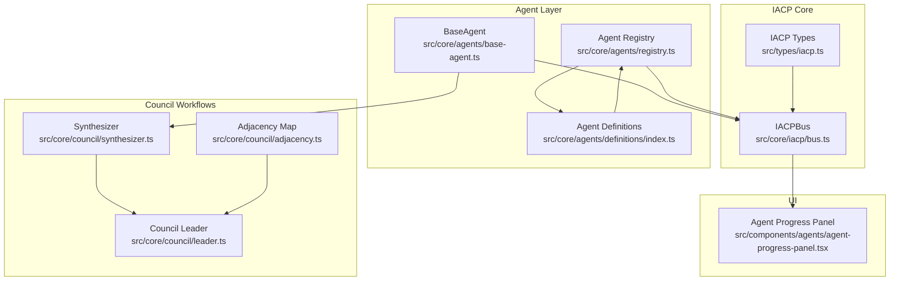
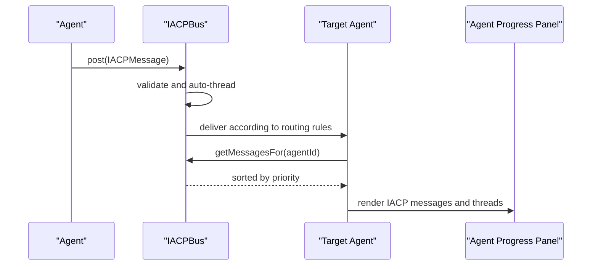
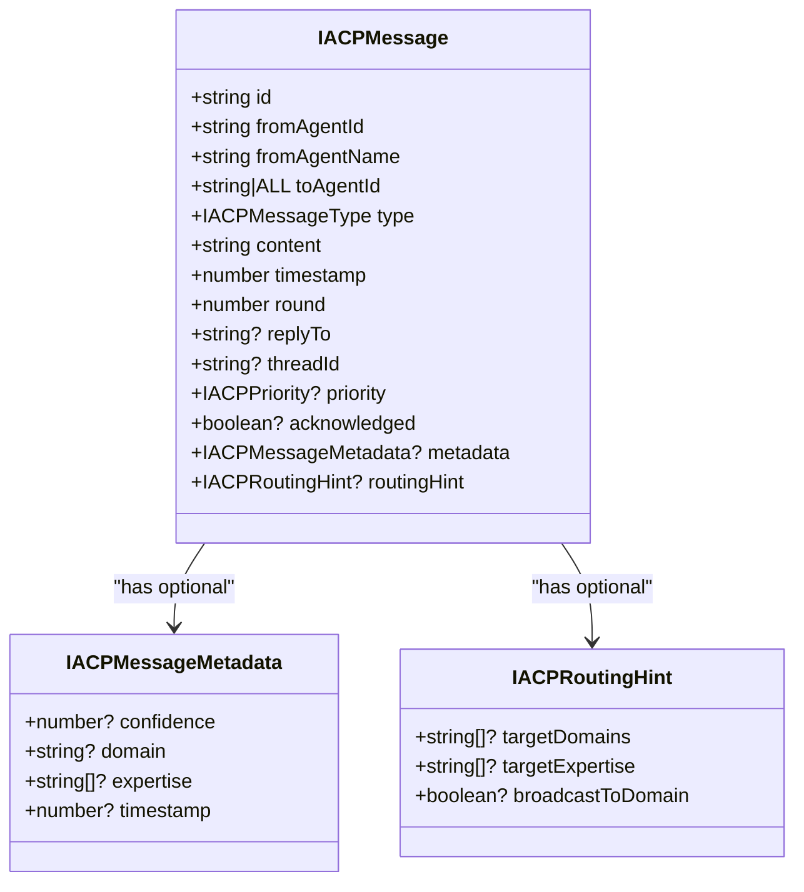
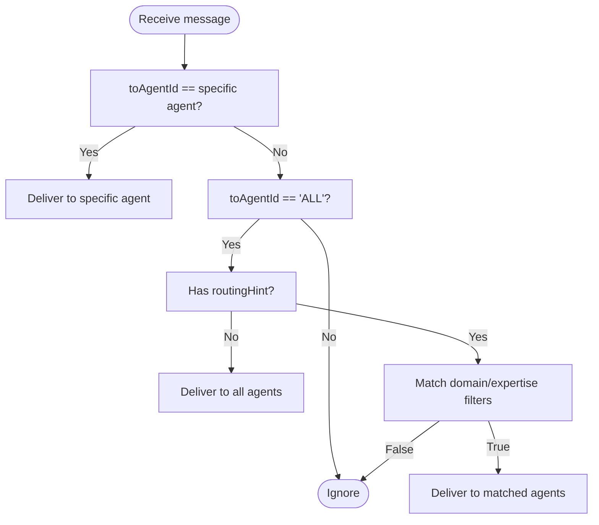
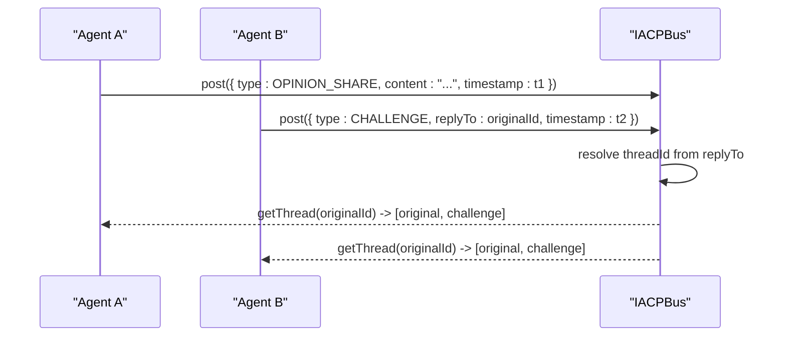
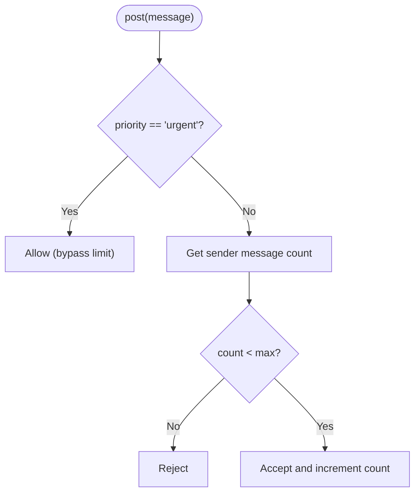
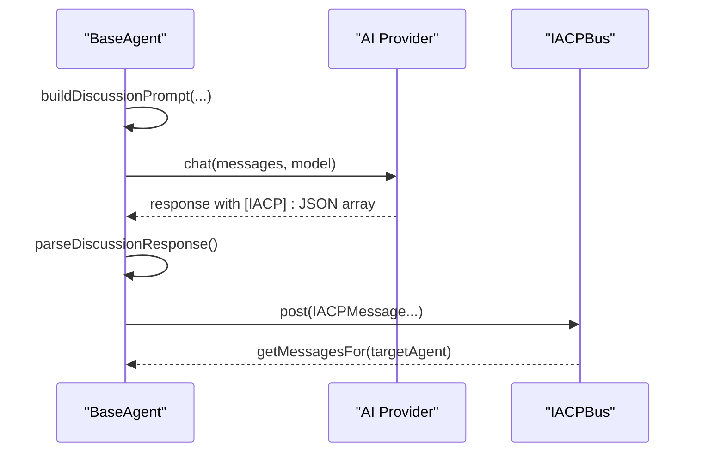
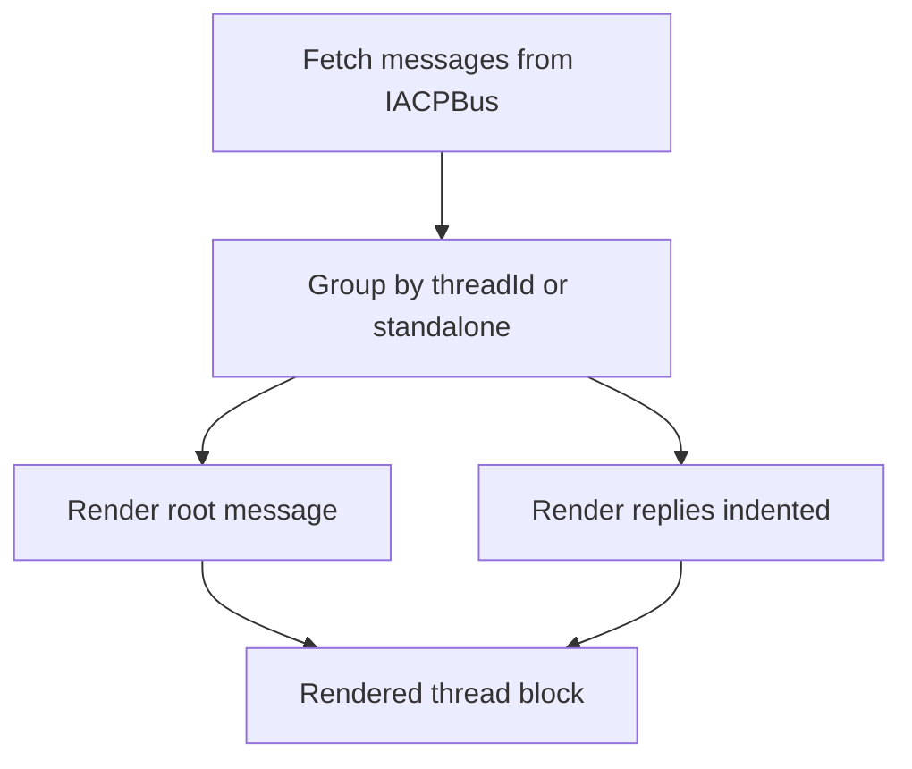
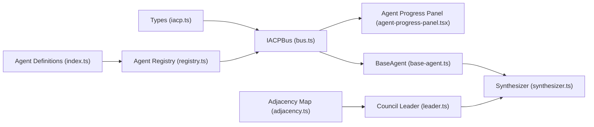

# Communication Patterns and Message Types

<cite>
**Referenced Files in This Document**
- [bus.ts](file://src/core/iacp/bus.ts)
- [iacp.ts](file://src/types/iacp.ts)
- [base-agent.ts](file://src/core/agents/base-agent.ts)
- [bus.test.ts](file://src/__tests__/core/iacp/bus.test.ts)
- [agent-progress-panel.tsx](file://src/components/agents/agent-progress-panel.tsx)
- [synthesizer.ts](file://src/core/council/synthesizer.ts)
- [registry.ts](file://src/core/agents/registry.ts)
- [index.ts](file://src/core/agents/definitions/index.ts)
- [cross-domain.ts](file://src/core/agents/definitions/cross-domain.ts)
- [creativity.ts](file://src/core/agents/definitions/creativity.ts)
- [adjacency.ts](file://src/core/council/adjacency.ts)
- [leader.ts](file://src/core/council/leader.ts)
</cite>

## Table of Contents
1. [Introduction](#introduction)
2. [Project Structure](#project-structure)
3. [Core Components](#core-components)
4. [Architecture Overview](#architecture-overview)
5. [Detailed Component Analysis](#detailed-component-analysis)
6. [Dependency Analysis](#dependency-analysis)
7. [Performance Considerations](#performance-considerations)
8. [Troubleshooting Guide](#troubleshooting-guide)
9. [Conclusion](#conclusion)

## Introduction
This document specifies the Intelligent Agent Communication Protocol (IACP) message types and communication patterns used in the multi-agent system. It covers message formats, routing and priority mechanisms, threading for iterative discussions, broadcast and direct messaging, and how messages integrate with synthesis and verification workflows. It also documents validation rules, acknowledgment fields, and extensibility for future enhancements.

## Project Structure
The IACP implementation centers around a message bus that routes, prioritizes, and organizes agent-to-agent communications. Supporting types define message schemas and routing hints. Agents use these messages to collaborate during reasoning, verification, and synthesis phases.

**Diagram sources**
- [bus.ts:15-210](file://src/core/iacp/bus.ts#L15-L210)
- [iacp.ts:1-67](file://src/types/iacp.ts#L1-L67)
- [base-agent.ts:1-449](file://src/core/agents/base-agent.ts#L1-L449)
- [registry.ts:1-58](file://src/core/agents/registry.ts#L1-L58)
- [index.ts:1-37](file://src/core/agents/definitions/index.ts#L1-L37)
- [synthesizer.ts:1-591](file://src/core/council/synthesizer.ts#L1-L591)
- [adjacency.ts:1-15](file://src/core/council/adjacency.ts#L1-L15)
- [leader.ts:436-500](file://src/core/council/leader.ts#L436-L500)
- [agent-progress-panel.tsx:127-206](file://src/components/agents/agent-progress-panel.tsx#L127-L206)

**Section sources**
- [bus.ts:15-210](file://src/core/iacp/bus.ts#L15-L210)
- [iacp.ts:1-67](file://src/types/iacp.ts#L1-L67)

## Core Components
- IACPBus: Central message router and scheduler. Supports direct messaging, broadcast with routing hints, priority ordering, threading, and statistics.
- IACP Types: Strongly typed message schema, priorities, routing hints, and metadata.
- BaseAgent: Builds prompts that embed IACP messages and parses structured IACP responses from agent reasoning.
- Synthesizer: Aggregates agent thoughts and produces synthesized responses; integrates with IACP message threads.
- Agent Registry and Definitions: Provide agent domain and expertise metadata used by the bus for routing.
- UI Panel: Renders IACP messages and threads for visibility.

**Section sources**
- [bus.ts:15-210](file://src/core/iacp/bus.ts#L15-L210)
- [iacp.ts:1-67](file://src/types/iacp.ts#L1-L67)
- [base-agent.ts:33-185](file://src/core/agents/base-agent.ts#L33-L185)
- [synthesizer.ts:1-591](file://src/core/council/synthesizer.ts#L1-L591)
- [registry.ts:1-58](file://src/core/agents/registry.ts#L1-L58)
- [index.ts:1-37](file://src/core/agents/definitions/index.ts#L1-L37)
- [agent-progress-panel.tsx:143-206](file://src/components/agents/agent-progress-panel.tsx#L143-L206)

## Architecture Overview
The IACP architecture separates concerns across three layers:
- Transport and Scheduling: IACPBus manages message posting, retrieval, priority sorting, and routing.
- Message Schema: IACP types define message fields, routing hints, and metadata.
- Application Integration: Agents compose IACP messages during discussion and synthesis; UI renders threads.

**Diagram sources**
- [bus.ts:39-94](file://src/core/iacp/bus.ts#L39-L94)
- [agent-progress-panel.tsx:143-206](file://src/components/agents/agent-progress-panel.tsx#L143-L206)

## Detailed Component Analysis

### IACP Message Types and Serialization
IACP defines a set of semantic message types used for multi-agent collaboration:
- INFO_REQUEST: Request contextual information from peers.
- INFO_RESPONSE: Provide supporting data or facts.
- OPINION_SHARE: Share a reasoned perspective.
- CHALLENGE: Present a counterpoint or critique.
- AGREEMENT: Signal alignment or endorsement.
- CLARIFICATION: Ask for or provide clarification.
- EVIDENCE: Attach or reference evidence.
- SYNTHESIS: Summarize or consolidate prior discussion.
- ACKNOWLEDGMENT: Confirm receipt or completion.

Serialization and validation:
- Messages are strongly typed with required fields: id, fromAgentId, fromAgentName, toAgentId, type, content, timestamp, round.
- Optional fields enable advanced features: replyTo, threadId, priority, acknowledged, metadata, routingHint.
- Validation rules:
  - replyTo implies thread resolution: threadId is auto-set to the referenced message’s threadId or id.
  - priority defaults to normal if unspecified.
  - urgent messages bypass per-agent sending limits.
  - toAgentId supports "ALL" for broadcast; routingHint enables domain/expertise targeting.

**Diagram sources**
- [iacp.ts:14-47](file://src/types/iacp.ts#L14-L47)

**Section sources**
- [iacp.ts:1-67](file://src/types/iacp.ts#L1-L67)
- [bus.ts:39-66](file://src/core/iacp/bus.ts#L39-L66)

### Routing and Delivery Patterns
- Direct messaging: toAgentId equals a specific agent id; only that agent receives the message.
- Broadcast to all: toAgentId is "ALL"; all agents receive the message.
- Domain/expertise routing: when broadcasting, routingHint filters recipients by:
  - broadcastToDomain: deliver to agents sharing the sender’s domain.
  - targetDomains: deliver to agents whose domain is included in the hint list.
  - targetExpertise: deliver to agents whose expertise intersects with the hint list.
- Priority-based delivery: messages are sorted by urgency (urgent, normal, low) before delivery to an agent.

**Diagram sources**
- [bus.ts:72-94](file://src/core/iacp/bus.ts#L72-L94)
- [bus.ts:176-208](file://src/core/iacp/bus.ts#L176-L208)

**Section sources**
- [bus.ts:72-94](file://src/core/iacp/bus.ts#L72-L94)
- [bus.ts:176-208](file://src/core/iacp/bus.ts#L176-L208)

### Threading and Iterative Discussions
- Thread resolution: replyTo references a prior message id; threadId is auto-set to the referenced message’s threadId or id.
- Thread retrieval: getThread returns all messages in a thread ordered by timestamp.
- Thread summary: getThreadSummary aggregates message count, participants, and latest message.

**Diagram sources**
- [bus.ts:46-52](file://src/core/iacp/bus.ts#L46-L52)
- [bus.ts:121-137](file://src/core/iacp/bus.ts#L121-L137)
- [bus.test.ts:71-97](file://src/__tests__/core/iacp/bus.test.ts#L71-L97)

**Section sources**
- [bus.ts:46-52](file://src/core/iacp/bus.ts#L46-L52)
- [bus.ts:121-137](file://src/core/iacp/bus.ts#L121-L137)
- [bus.test.ts:71-97](file://src/__tests__/core/iacp/bus.test.ts#L71-L97)

### Priority-Based Delivery and Limits
- Priority ordering: urgent messages are delivered before normal, which are delivered before low.
- Per-agent sending limit: agents are tracked to prevent message flooding; urgent messages bypass the limit.
- Utility methods: canSend indicates whether an agent can send under current limits; getUrgentMessages retrieves urgent broadcasts or directed urgent messages.

**Diagram sources**
- [bus.ts:39-66](file://src/core/iacp/bus.ts#L39-L66)
- [bus.ts:108-111](file://src/core/iacp/bus.ts#L108-L111)

**Section sources**
- [bus.ts:39-66](file://src/core/iacp/bus.ts#L39-L66)
- [bus.ts:108-111](file://src/core/iacp/bus.ts#L108-L111)
- [bus.test.ts:51-69](file://src/__tests__/core/iacp/bus.test.ts#L51-L69)

### Message Acknowledgment and Metadata
- acknowledged: optional boolean flag indicating receipt or completion.
- metadata: optional field containing confidence, domain, expertise, and timestamp for contextual enrichment.
- These fields are part of the message schema and can be used by agents and UI for richer interactions.

**Section sources**
- [iacp.ts:42-47](file://src/types/iacp.ts#L42-L47)

### Agent-Initiated IACP Messages
Agents embed IACP messages inside structured reasoning prompts and parse agent-generated IACP responses. The parser extracts IACP messages from agent outputs and constructs typed IACPMessage instances for transport.

**Diagram sources**
- [base-agent.ts:100-185](file://src/core/agents/base-agent.ts#L100-L185)
- [bus.ts:39-94](file://src/core/iacp/bus.ts#L39-L94)

**Section sources**
- [base-agent.ts:100-185](file://src/core/agents/base-agent.ts#L100-L185)

### UI Rendering of IACP Threads
The progress panel groups messages by thread and renders standalone messages, preserving conversation context and priority indicators.

**Diagram sources**
- [agent-progress-panel.tsx:143-206](file://src/components/agents/agent-progress-panel.tsx#L143-L206)

**Section sources**
- [agent-progress-panel.tsx:143-206](file://src/components/agents/agent-progress-panel.tsx#L143-L206)

### Extensibility and Protocol Evolution
- New message types: Extend IACPMessageType to introduce new semantics (e.g., verification requests, consensus votes).
- Routing enhancements: Add new routingHint fields to refine delivery policies.
- Metadata expansion: Enrich IACPMessageMetadata for domain-specific attributes.
- Validation hooks: Add pre/post-processing in IACPBus to enforce new rules.

**Section sources**
- [iacp.ts:1-67](file://src/types/iacp.ts#L1-L67)

## Dependency Analysis
IACPBus depends on IACP types and maintains an internal registry of agent metadata for routing. Agents depend on IACPBus for message transport and on synthesis utilities for higher-level workflows. The UI depends on IACPBus to render threads.

**Diagram sources**
- [bus.ts:1-210](file://src/core/iacp/bus.ts#L1-L210)
- [iacp.ts:1-67](file://src/types/iacp.ts#L1-L67)
- [agent-progress-panel.tsx:143-206](file://src/components/agents/agent-progress-panel.tsx#L143-L206)
- [base-agent.ts:1-449](file://src/core/agents/base-agent.ts#L1-L449)
- [synthesizer.ts:1-591](file://src/core/council/synthesizer.ts#L1-L591)
- [registry.ts:1-58](file://src/core/agents/registry.ts#L1-L58)
- [index.ts:1-37](file://src/core/agents/definitions/index.ts#L1-L37)
- [adjacency.ts:1-15](file://src/core/council/adjacency.ts#L1-L15)
- [leader.ts:436-500](file://src/core/council/leader.ts#L436-L500)

**Section sources**
- [bus.ts:1-210](file://src/core/iacp/bus.ts#L1-L210)
- [base-agent.ts:1-449](file://src/core/agents/base-agent.ts#L1-L449)
- [synthesizer.ts:1-591](file://src/core/council/synthesizer.ts#L1-L591)
- [registry.ts:1-58](file://src/core/agents/registry.ts#L1-L58)
- [index.ts:1-37](file://src/core/agents/definitions/index.ts#L1-L37)
- [adjacency.ts:1-15](file://src/core/council/adjacency.ts#L1-L15)
- [leader.ts:436-500](file://src/core/council/leader.ts#L436-L500)

## Performance Considerations
- Message filtering and sorting: getMessagesFor performs filtering and sorts by priority; keep routingHint conditions minimal to reduce filter overhead.
- Threading retrieval: getThread sorts by timestamp; avoid extremely large threads for frequent retrieval.
- Per-agent limits: Tune maxMessagesPerAgent to balance throughput and fairness.
- UI rendering: Limit visible threads/messages to improve responsiveness.

## Troubleshooting Guide
Common issues and resolutions:
- Messages not delivered:
  - Verify toAgentId and routingHint correctness.
  - Ensure agent registration includes domain and expertise for targeted routing.
- Unexpected broadcast:
  - Confirm routingHint presence when "ALL" broadcast is intended.
- Priority ordering anomalies:
  - Check priority field values; missing priority defaults to normal.
- Thread confusion:
  - Ensure replyTo references a valid existing message id; threadId is auto-resolved.
- Exceeded sending limits:
  - Urgent messages bypass limits; otherwise, wait for counts to reset or increase maxMessagesPerAgent.

**Section sources**
- [bus.ts:72-94](file://src/core/iacp/bus.ts#L72-L94)
- [bus.ts:176-208](file://src/core/iacp/bus.ts#L176-L208)
- [bus.test.ts:31-49](file://src/__tests__/core/iacp/bus.test.ts#L31-L49)
- [bus.test.ts:99-107](file://src/__tests__/core/iacp/bus.test.ts#L99-L107)

## Conclusion
IACP provides a robust, extensible foundation for multi-agent communication with explicit message types, routing hints, priority scheduling, and threading. By leveraging IACPBus, agents can engage in structured, iterative discussions, and synthesis workflows can integrate these messages seamlessly. The schema and routing rules ensure predictable delivery and scalability, while UI components offer transparency into ongoing conversations.