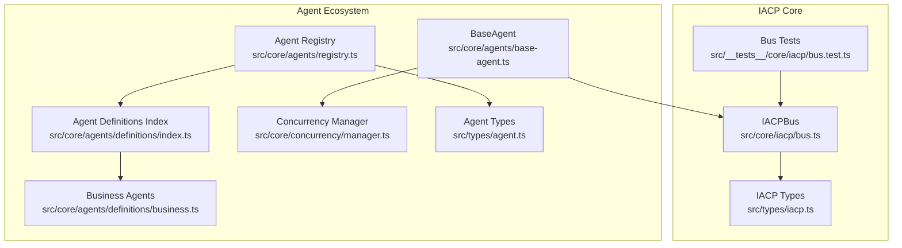
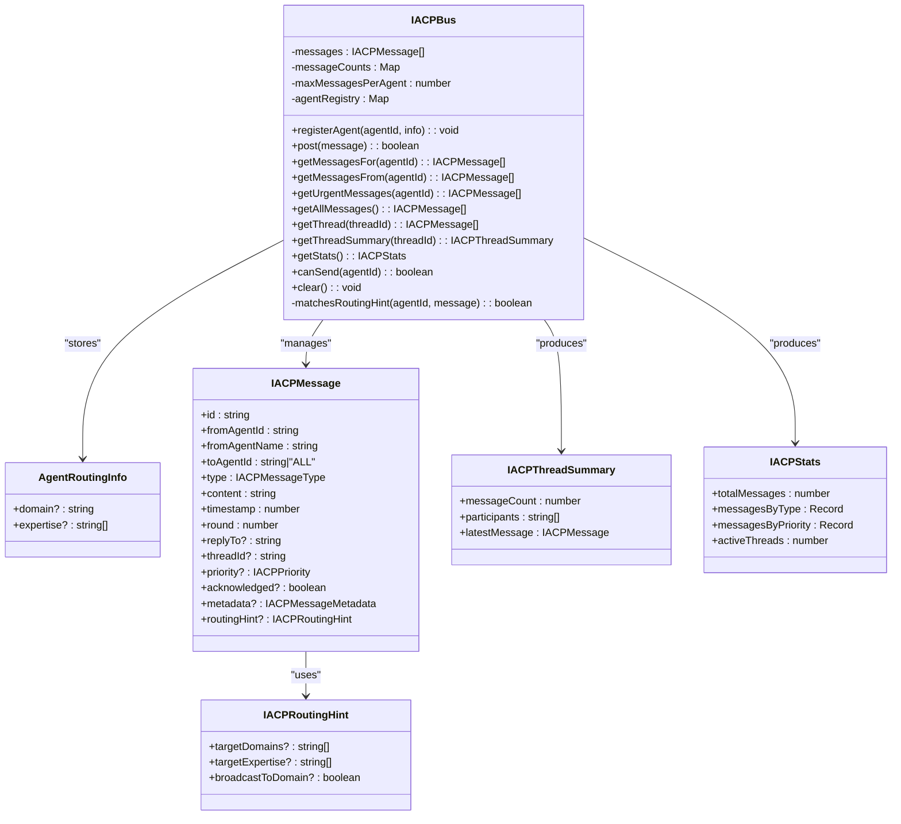
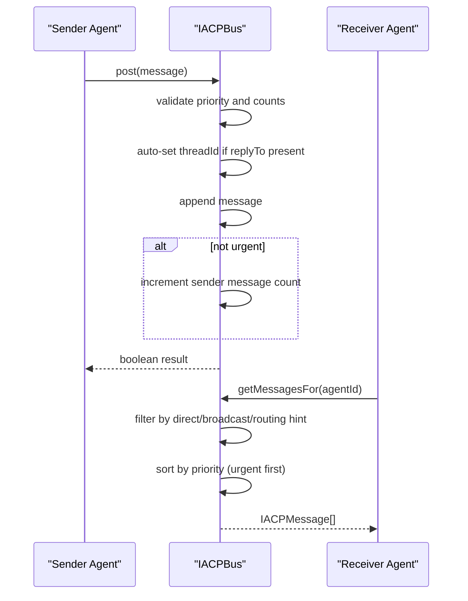
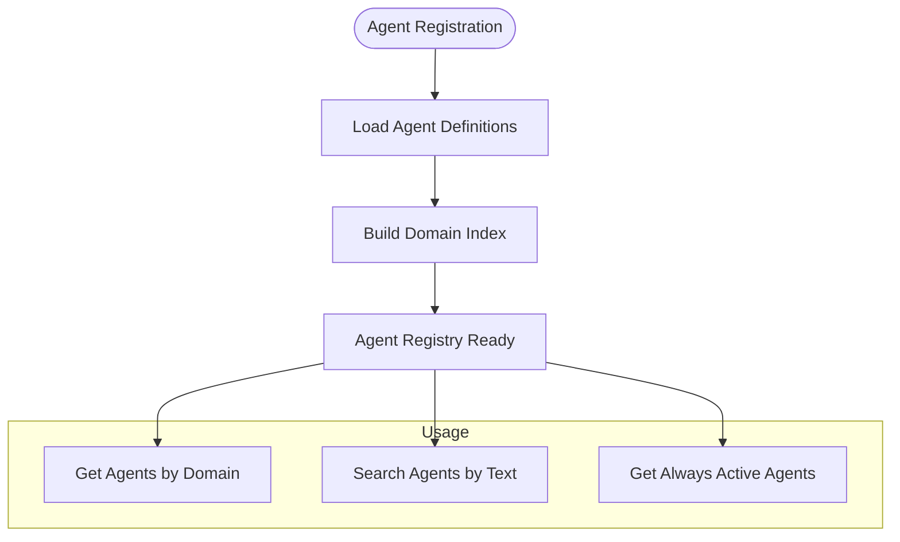
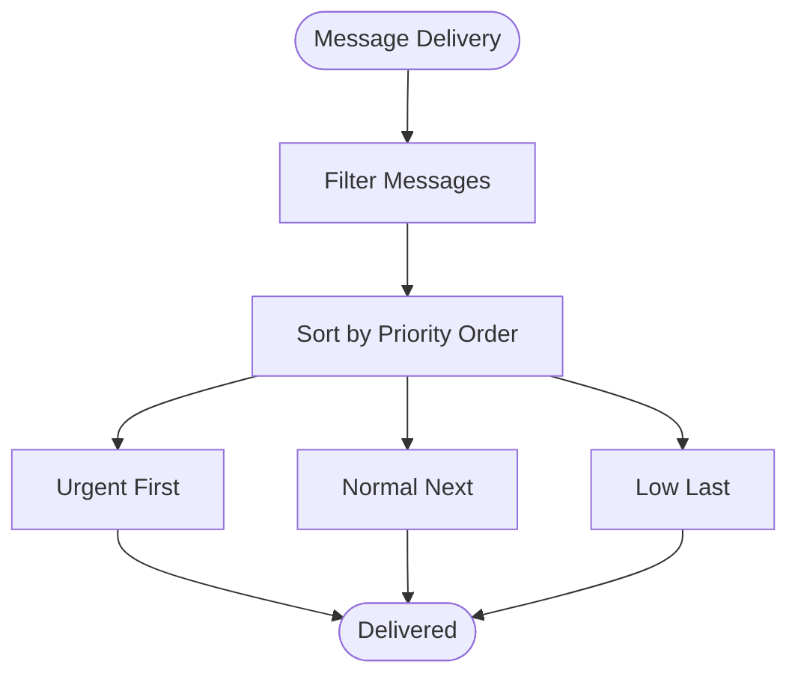
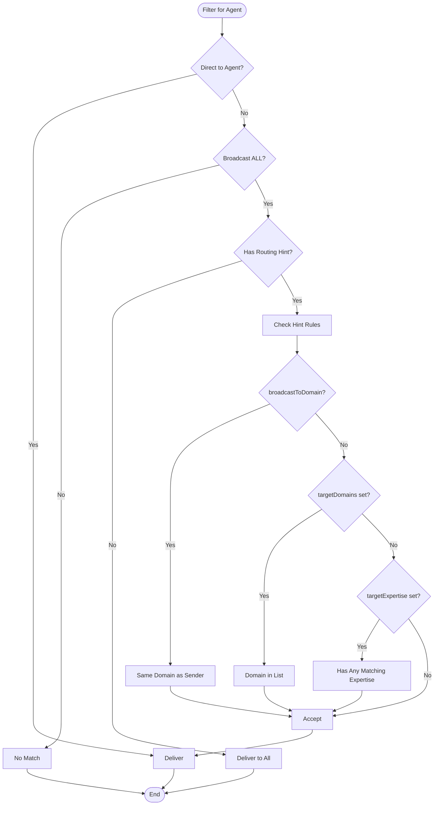
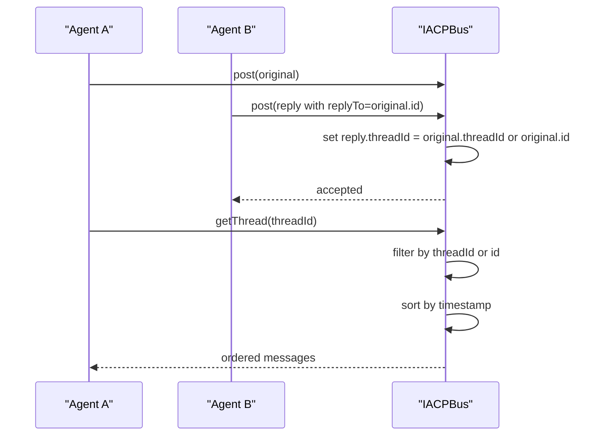
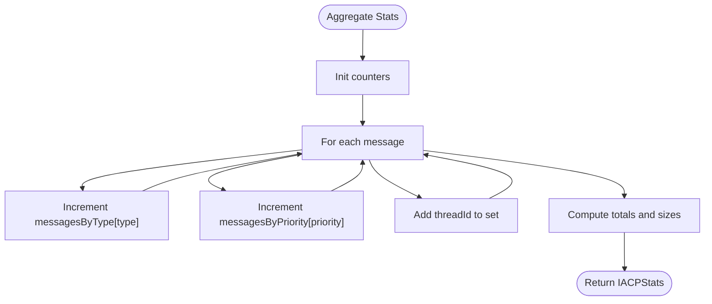
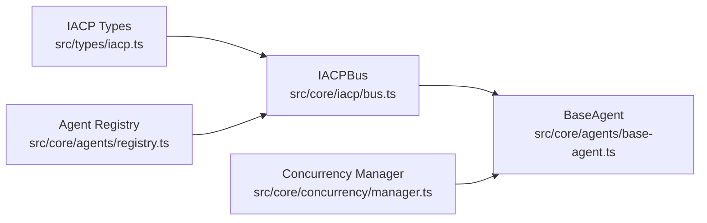

# IACP Bus Implementation

<cite>
**Referenced Files in This Document**
- [bus.ts](file://src/core/iacp/bus.ts)
- [iacp.ts](file://src/types/iacp.ts)
- [bus.test.ts](file://src/__tests__/core/iacp/bus.test.ts)
- [base-agent.ts](file://src/core/agents/base-agent.ts)
- [registry.ts](file://src/core/agents/registry.ts)
- [index.ts](file://src/core/agents/definitions/index.ts)
- [business.ts](file://src/core/agents/definitions/business.ts)
- [manager.ts](file://src/core/concurrency/manager.ts)
- [agent.ts](file://src/types/agent.ts)
</cite>

## Table of Contents
1. [Introduction](#introduction)
2. [Project Structure](#project-structure)
3. [Core Components](#core-components)
4. [Architecture Overview](#architecture-overview)
5. [Detailed Component Analysis](#detailed-component-analysis)
6. [Dependency Analysis](#dependency-analysis)
7. [Performance Considerations](#performance-considerations)
8. [Troubleshooting Guide](#troubleshooting-guide)
9. [Conclusion](#conclusion)
10. [Appendices](#appendices)

## Introduction
This document provides comprehensive documentation for the IACP Bus implementation, a central messaging backbone for a multi-agent system. It covers the IACPBus class architecture, including message posting, retrieval, routing, and thread management. It also documents the agent registry system for domain and expertise-based routing, message priority handling (urgent, normal, low), message counting to prevent agent overload, thread summarization, and statistical reporting. Practical examples demonstrate message posting, agent registration, and thread creation. Finally, it outlines internal data structures, performance characteristics, and integration patterns with the broader multi-agent ecosystem.

## Project Structure
The IACP Bus resides in the core IACP module alongside type definitions and tests. Supporting agent infrastructure includes agent registries, agent definitions, and concurrency controls.

**Diagram sources**
- [bus.ts:15-210](file://src/core/iacp/bus.ts#L15-L210)
- [iacp.ts:1-67](file://src/types/iacp.ts#L1-L67)
- [bus.test.ts:1-127](file://src/__tests__/core/iacp/bus.test.ts#L1-L127)
- [base-agent.ts:1-449](file://src/core/agents/base-agent.ts#L1-L449)
- [registry.ts:1-58](file://src/core/agents/registry.ts#L1-L58)
- [index.ts:1-38](file://src/core/agents/definitions/index.ts#L1-L38)
- [business.ts:1-102](file://src/core/agents/definitions/business.ts#L1-L102)
- [manager.ts:1-55](file://src/core/concurrency/manager.ts#L1-L55)
- [agent.ts:1-57](file://src/types/agent.ts#L1-L57)

**Section sources**
- [bus.ts:15-210](file://src/core/iacp/bus.ts#L15-L210)
- [iacp.ts:1-67](file://src/types/iacp.ts#L1-L67)
- [bus.test.ts:1-127](file://src/__tests__/core/iacp/bus.test.ts#L1-L127)
- [base-agent.ts:1-449](file://src/core/agents/base-agent.ts#L1-L449)
- [registry.ts:1-58](file://src/core/agents/registry.ts#L1-L58)
- [index.ts:1-38](file://src/core/agents/definitions/index.ts#L1-L38)
- [business.ts:1-102](file://src/core/agents/definitions/business.ts#L1-L102)
- [manager.ts:1-55](file://src/core/concurrency/manager.ts#L1-L55)
- [agent.ts:1-57](file://src/types/agent.ts#L1-L57)

## Core Components
- IACPBus: Central message bus implementing posting, retrieval, routing, threading, and statistics.
- IACP Types: Strongly typed message, thread summary, stats, and routing hint interfaces.
- Agent Registry: Maintains agent definitions and domain indices for discovery and selection.
- BaseAgent: Provides agent-side logic for parsing IACP messages and generating IACP payloads.
- Concurrency Manager: Controls concurrent execution of tasks to avoid overload.

Key responsibilities:
- Message lifecycle: post, filter, sort by priority, and retrieve.
- Routing: direct, broadcast, and domain/expertise-based targeting via routing hints.
- Safety: per-agent message limits with urgent bypass.
- Thread management: auto-threading from replies, thread retrieval, and summaries.
- Observability: statistics collection and lifecycle cleanup.

**Section sources**
- [bus.ts:15-210](file://src/core/iacp/bus.ts#L15-L210)
- [iacp.ts:14-67](file://src/types/iacp.ts#L14-L67)
- [registry.ts:4-58](file://src/core/agents/registry.ts#L4-L58)
- [base-agent.ts:152-185](file://src/core/agents/base-agent.ts#L152-L185)
- [manager.ts:1-55](file://src/core/concurrency/manager.ts#L1-L55)

## Architecture Overview
The IACP Bus orchestrates inter-agent communication. Agents post IACP messages with optional routing hints. The bus enforces limits, auto-threads replies, and routes messages to recipients based on destination and hints. Statistics and thread summaries provide operational visibility.

**Diagram sources**
- [bus.ts:15-210](file://src/core/iacp/bus.ts#L15-L210)
- [iacp.ts:21-67](file://src/types/iacp.ts#L21-L67)

**Section sources**
- [bus.ts:15-210](file://src/core/iacp/bus.ts#L15-L210)
- [iacp.ts:21-67](file://src/types/iacp.ts#L21-L67)

## Detailed Component Analysis

### IACPBus Class
The IACPBus encapsulates:
- In-memory message storage and counters
- Agent registry for routing hints
- Message posting with safety checks and auto-threading
- Filtering and sorting for delivery
- Thread retrieval and summaries
- Statistics aggregation
- Lifecycle operations (clear)

**Diagram sources**
- [bus.ts:39-94](file://src/core/iacp/bus.ts#L39-L94)

Key behaviors:
- Message posting:
  - Enforces per-sender limit except for urgent messages.
  - Auto-sets thread identifiers when replying to an existing message.
  - Assigns default priority if unspecified.
- Retrieval:
  - Direct delivery to specific agent ID.
  - Broadcast to all agents ("ALL").
  - Conditional routing via routing hints when broadcasting.
  - Sorting by priority order.
- Routing hints:
  - Domain-scoped broadcast or targeted domains.
  - Expertise intersection checks.
- Thread management:
  - Retrieve thread by threadId or original message id.
  - Produce thread summaries with participant set and latest message.
- Statistics:
  - Count messages by type and priority, and track active threads.

Practical examples (paths):
- Post a direct message: [bus.test.ts:22-29](file://src/__tests__/core/iacp/bus.test.ts#L22-L29)
- Broadcast to all: [bus.test.ts:31-37](file://src/__tests__/core/iacp/bus.test.ts#L31-L37)
- Enforce per-agent limit: [bus.test.ts:51-59](file://src/__tests__/core/iacp/bus.test.ts#L51-L59)
- Allow urgent bypass: [bus.test.ts:61-69](file://src/__tests__/core/iacp/bus.test.ts#L61-L69)
- Auto-threading from replyTo: [bus.test.ts:71-81](file://src/__tests__/core/iacp/bus.test.ts#L71-L81)
- Thread ordering by timestamp: [bus.test.ts:83-97](file://src/__tests__/core/iacp/bus.test.ts#L83-L97)
- Priority sorting (urgent first): [bus.test.ts:99-107](file://src/__tests__/core/iacp/bus.test.ts#L99-L107)
- Statistics tracking: [bus.test.ts:109-118](file://src/__tests__/core/iacp/bus.test.ts#L109-L118)
- Clear messages: [bus.test.ts:120-125](file://src/__tests__/core/iacp/bus.test.ts#L120-L125)

**Section sources**
- [bus.ts:15-210](file://src/core/iacp/bus.ts#L15-L210)
- [bus.test.ts:15-127](file://src/__tests__/core/iacp/bus.test.ts#L15-L127)

### Agent Registry and Routing
The agent registry supports discovery and selection by domain and expertise. While distinct from the IACPBus routing, it complements domain-based targeting via routing hints.

**Diagram sources**
- [registry.ts:8-35](file://src/core/agents/registry.ts#L8-L35)
- [index.ts:11-23](file://src/core/agents/definitions/index.ts#L11-L23)
- [business.ts:4-101](file://src/core/agents/definitions/business.ts#L4-L101)
- [agent.ts:25-36](file://src/types/agent.ts#L25-L36)

Integration with IACPBus:
- Agents register routing info with the bus to enable domain/expertise targeting.
- Routing hints in messages leverage the registry to match agents by domain and expertise.

**Section sources**
- [registry.ts:4-58](file://src/core/agents/registry.ts#L4-L58)
- [index.ts:1-38](file://src/core/agents/definitions/index.ts#L1-L38)
- [business.ts:1-102](file://src/core/agents/definitions/business.ts#L1-L102)
- [agent.ts:1-57](file://src/types/agent.ts#L1-L57)

### Message Priority Handling
Priority order ensures urgent messages are delivered first. Normal is default when unspecified.

**Diagram sources**
- [bus.ts:88-94](file://src/core/iacp/bus.ts#L88-L94)
- [bus.ts:9-13](file://src/core/iacp/bus.ts#L9-L13)

**Section sources**
- [bus.ts:88-94](file://src/core/iacp/bus.ts#L88-L94)
- [bus.ts:9-13](file://src/core/iacp/bus.ts#L9-L13)

### Message Filtering and Routing Hints
The bus applies filters based on destination and routing hints:
- Direct: toAgentId equals recipient agentId.
- Broadcast: toAgentId equals "ALL".
- Conditional broadcast: routingHint enables domain/expertise targeting.

**Diagram sources**
- [bus.ts:72-94](file://src/core/iacp/bus.ts#L72-L94)
- [bus.ts:176-208](file://src/core/iacp/bus.ts#L176-L208)

**Section sources**
- [bus.ts:72-94](file://src/core/iacp/bus.ts#L72-L94)
- [bus.ts:176-208](file://src/core/iacp/bus.ts#L176-L208)

### Thread Management and Summarization
Auto-threading resolves threadId from replyTo, ensuring continuity. Threads are retrieved sorted by timestamp and summarized with participant set and latest message.

**Diagram sources**
- [bus.ts:46-52](file://src/core/iacp/bus.ts#L46-L52)
- [bus.ts:121-137](file://src/core/iacp/bus.ts#L121-L137)

**Section sources**
- [bus.ts:46-52](file://src/core/iacp/bus.ts#L46-L52)
- [bus.ts:121-137](file://src/core/iacp/bus.ts#L121-L137)

### Statistical Reporting
The bus aggregates:
- Total messages
- Counts by message type
- Counts by priority
- Active threads

**Diagram sources**
- [bus.ts:143-161](file://src/core/iacp/bus.ts#L143-L161)

**Section sources**
- [bus.ts:143-161](file://src/core/iacp/bus.ts#L143-L161)

### Practical Examples
- Posting a direct message: [bus.test.ts:22-29](file://src/__tests__/core/iacp/bus.test.ts#L22-L29)
- Broadcasting to all: [bus.test.ts:31-37](file://src/__tests__/core/iacp/bus.test.ts#L31-L37)
- Enforcing per-agent message limit: [bus.test.ts:51-59](file://src/__tests__/core/iacp/bus.test.ts#L51-L59)
- Allowing urgent messages to bypass limit: [bus.test.ts:61-69](file://src/__tests__/core/iacp/bus.test.ts#L61-L69)
- Auto-threading replyTo: [bus.test.ts:71-81](file://src/__tests__/core/iacp/bus.test.ts#L71-L81)
- Retrieving and ordering thread messages: [bus.test.ts:83-97](file://src/__tests__/core/iacp/bus.test.ts#L83-L97)
- Priority sorting (urgent first): [bus.test.ts:99-107](file://src/__tests__/core/iacp/bus.test.ts#L99-L107)
- Capturing statistics: [bus.test.ts:109-118](file://src/__tests__/core/iacp/bus.test.ts#L109-L118)
- Clearing messages: [bus.test.ts:120-125](file://src/__tests__/core/iacp/bus.test.ts#L120-L125)

**Section sources**
- [bus.test.ts:15-127](file://src/__tests__/core/iacp/bus.test.ts#L15-L127)

## Dependency Analysis
The IACP Bus depends on IACP types for message contracts and integrates with agent infrastructure for routing and concurrency.

**Diagram sources**
- [bus.ts:1-2](file://src/core/iacp/bus.ts#L1-L2)
- [iacp.ts:1-67](file://src/types/iacp.ts#L1-L67)
- [base-agent.ts:1-449](file://src/core/agents/base-agent.ts#L1-L449)
- [registry.ts:1-58](file://src/core/agents/registry.ts#L1-L58)
- [manager.ts:1-55](file://src/core/concurrency/manager.ts#L1-L55)

**Section sources**
- [bus.ts:1-2](file://src/core/iacp/bus.ts#L1-L2)
- [iacp.ts:1-67](file://src/types/iacp.ts#L1-L67)
- [base-agent.ts:1-449](file://src/core/agents/base-agent.ts#L1-L449)
- [registry.ts:1-58](file://src/core/agents/registry.ts#L1-L58)
- [manager.ts:1-55](file://src/core/concurrency/manager.ts#L1-L55)

## Performance Considerations
- Storage: Linear-time filtering and sorting per query; suitable for moderate message volumes.
- Priority sorting: O(n log n) per retrieval; keep retrieval windows bounded.
- Message counting: O(1) per post; effective for preventing sender overload.
- Routing hints: O(1) lookup per agent plus small checks; cost scales with broadcast fan-out.
- Thread retrieval: O(n) filtering plus O(k log k) sorting for k thread messages.
- Recommendations:
  - Limit maxMessagesPerAgent to balance throughput and fairness.
  - Use urgent sparingly to maintain responsiveness.
  - Apply pagination or time bounds when retrieving large histories.
  - Offload heavy processing to background tasks using the Concurrency Manager.

[No sources needed since this section provides general guidance]

## Troubleshooting Guide
Common issues and resolutions:
- Messages not delivered:
  - Verify destination: direct agentId vs "ALL".
  - Check routing hints correctness (domain, expertise lists).
  - Confirm agent registration in the bus registry.
- Excessive throttling:
  - Review per-agent message limit and urgent policy.
  - Monitor canSend() to identify overloaded agents.
- Incorrect thread ordering:
  - Ensure replyTo references a prior message id.
  - Confirm timestamps are set consistently.
- Unexpected broadcast scope:
  - Validate routingHint fields and agent domain/expertise.
- Stats discrepancies:
  - Confirm threadId presence for thread-aware stats.

**Section sources**
- [bus.ts:72-94](file://src/core/iacp/bus.ts#L72-L94)
- [bus.ts:176-208](file://src/core/iacp/bus.ts#L176-L208)
- [bus.ts:108-111](file://src/core/iacp/bus.ts#L108-L111)

## Conclusion
The IACP Bus provides a robust foundation for multi-agent messaging with explicit routing, priority handling, safety limits, threading, and observability. Combined with agent registries and concurrency controls, it enables scalable, structured collaboration among diverse agents. Proper configuration of routing hints, limits, and priorities ensures efficient and fair operation across the system.

[No sources needed since this section summarizes without analyzing specific files]

## Appendices

### Internal Data Structures
- Messages: array of IACPMessage
- Message counts: Map from agentId to sent count
- Agent registry: Map from agentId to AgentRoutingInfo
- Priority order: mapping of priority to sort rank

**Section sources**
- [bus.ts:15-24](file://src/core/iacp/bus.ts#L15-L24)
- [bus.ts:9-13](file://src/core/iacp/bus.ts#L9-L13)

### Integration Patterns
- Agent-to-agent direct messaging: set toAgentId to recipient agentId.
- Broadcast to all: set toAgentId to "ALL".
- Domain/expertise targeting: set routingHint with targetDomains/targetExpertise.
- Domain-scoped broadcast: set routingHint.broadcastToDomain to true.
- IACP payload generation: BaseAgent parses and emits IACP messages.

**Section sources**
- [bus.ts:72-94](file://src/core/iacp/bus.ts#L72-L94)
- [bus.ts:176-208](file://src/core/iacp/bus.ts#L176-L208)
- [base-agent.ts:152-185](file://src/core/agents/base-agent.ts#L152-L185)