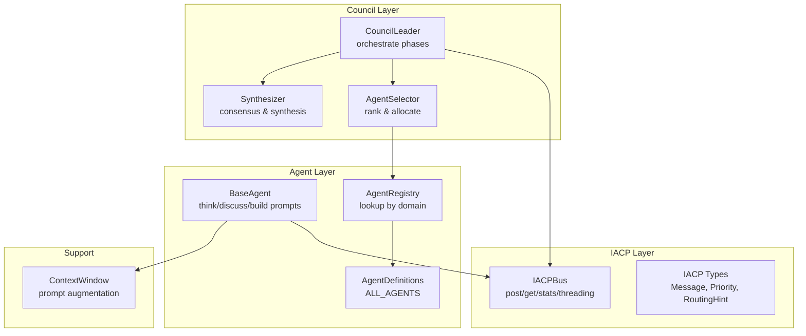
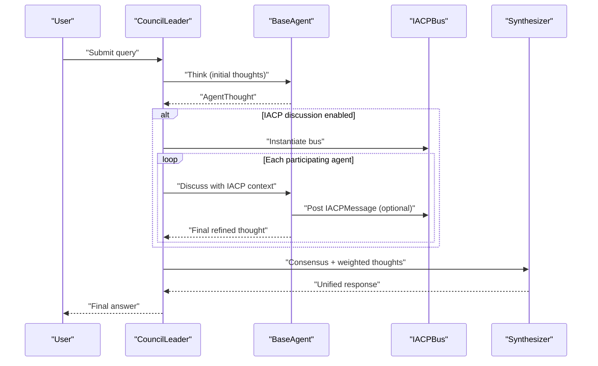
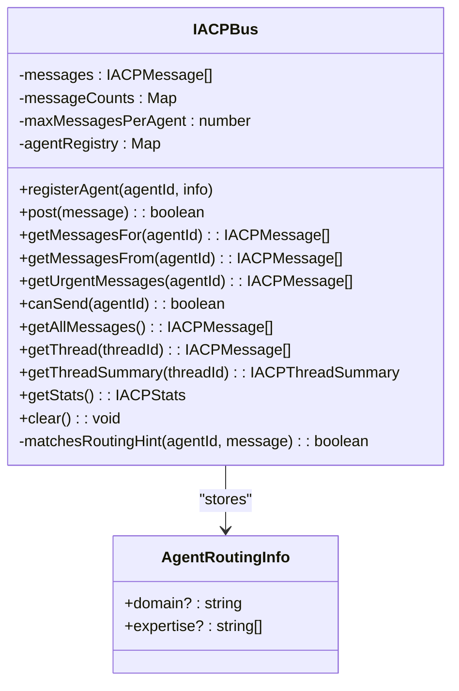
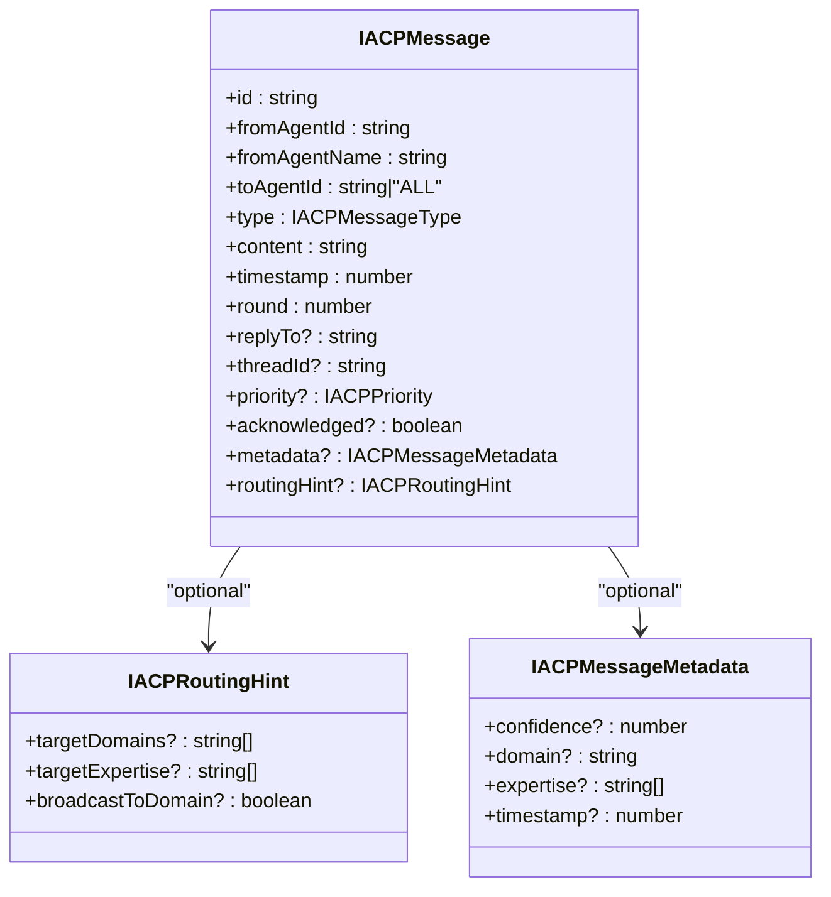
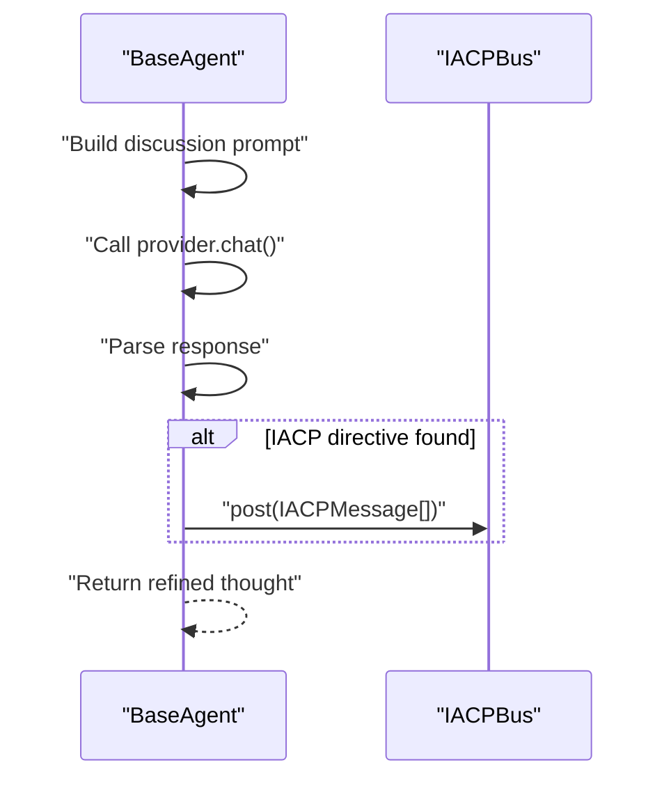
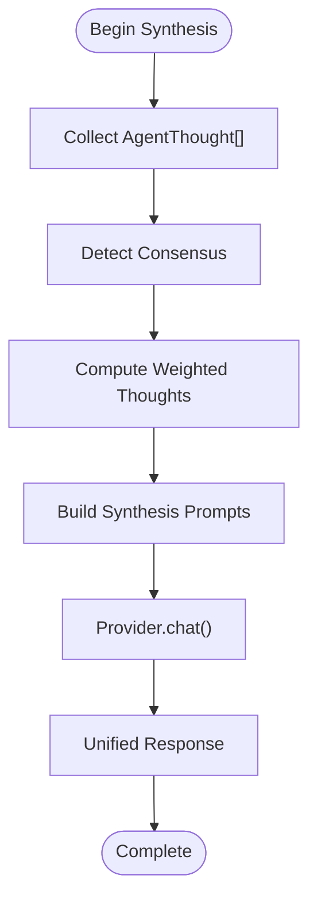
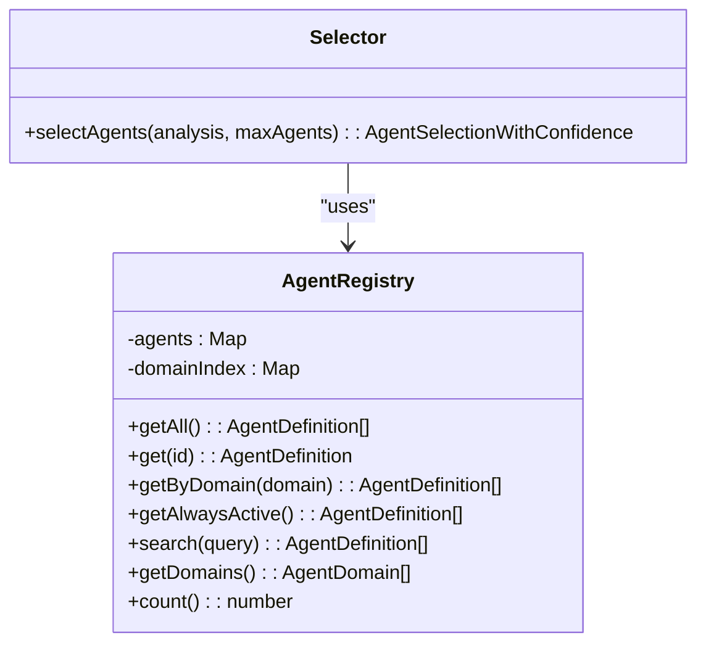
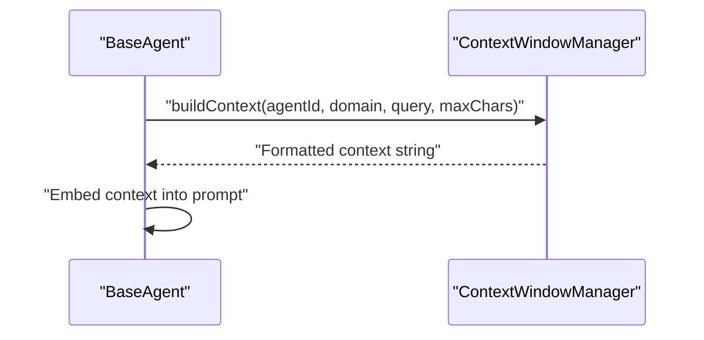
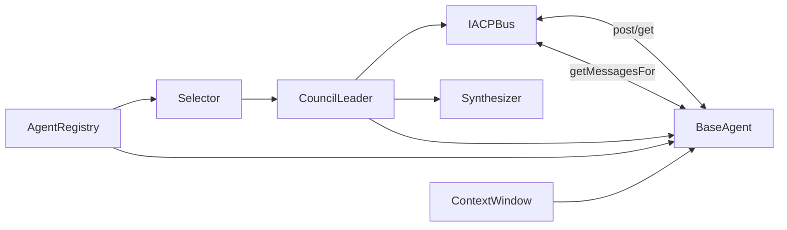

# Inter-Agent Communication Protocol (IACP)

<cite>
**Referenced Files in This Document**
- [bus.ts](file://src/core/iacp/bus.ts)
- [iacp.ts](file://src/types/iacp.ts)
- [base-agent.ts](file://src/core/agents/base-agent.ts)
- [leader.ts](file://src/core/council/leader.ts)
- [synthesizer.ts](file://src/core/council/synthesizer.ts)
- [selector.ts](file://src/core/council/selector.ts)
- [registry.ts](file://src/core/agents/registry.ts)
- [context-window.ts](file://src/core/memory/context-window.ts)
- [bus.test.ts](file://src/__tests__/core/iacp/bus.test.ts)
- [index.ts](file://src/core/agents/definitions/index.ts)
- [council.ts](file://src/types/council.ts)
</cite>

## Table of Contents
1. [Introduction](#introduction)
2. [Project Structure](#project-structure)
3. [Core Components](#core-components)
4. [Architecture Overview](#architecture-overview)
5. [Detailed Component Analysis](#detailed-component-analysis)
6. [Dependency Analysis](#dependency-analysis)
7. [Performance Considerations](#performance-considerations)
8. [Troubleshooting Guide](#troubleshooting-guide)
9. [Conclusion](#conclusion)
10. [Appendices](#appendices)

## Introduction
The Inter-Agent Communication Protocol (IACP) enables structured, event-driven collaboration among specialized AI agents during complex reasoning tasks. It provides a shared in-memory bus for posting, routing, and retrieving messages with priority, threading, and domain-aware targeting. The protocol supports:
- Direct agent-to-agent messaging
- Broadcast to all agents
- Domain- and expertise-based routing hints
- Message prioritization (urgent, normal, low)
- Threaded conversations with automatic thread ID resolution
- Statistics and lifecycle controls

This documentation explains how the IACP bus is implemented, how agents exchange messages during collaborative reasoning, and how the system builds consensus and synthesizes results.

## Project Structure
The IACP system spans several core modules:
- IACP bus: in-memory message storage, routing, and statistics
- Agent base class: constructs prompts, parses IACP messages from agent responses, and posts outgoing messages
- Council leader: orchestrates agent thinking, optional discussion with IACP, verification, and synthesis
- Synthesizer: detects consensus, weights contributions, and produces a unified response
- Selector and registry: choose agents and maintain agent metadata
- Memory context window: augments prompts with relevant past insights

**Diagram sources**
- [bus.ts:15-210](file://src/core/iacp/bus.ts#L15-L210)
- [iacp.ts:1-67](file://src/types/iacp.ts#L1-L67)
- [base-agent.ts:1-448](file://src/core/agents/base-agent.ts#L1-L448)
- [leader.ts:1-714](file://src/core/council/leader.ts#L1-L714)
- [synthesizer.ts:1-591](file://src/core/council/synthesizer.ts#L1-L591)
- [selector.ts:1-169](file://src/core/council/selector.ts#L1-L169)
- [registry.ts:1-58](file://src/core/agents/registry.ts#L1-L58)
- [context-window.ts:1-112](file://src/core/memory/context-window.ts#L1-L112)
- [index.ts:1-38](file://src/core/agents/definitions/index.ts#L1-L38)

**Section sources**
- [bus.ts:15-210](file://src/core/iacp/bus.ts#L15-L210)
- [iacp.ts:1-67](file://src/types/iacp.ts#L1-L67)
- [base-agent.ts:1-448](file://src/core/agents/base-agent.ts#L1-L448)
- [leader.ts:1-714](file://src/core/council/leader.ts#L1-L714)
- [synthesizer.ts:1-591](file://src/core/council/synthesizer.ts#L1-L591)
- [selector.ts:1-169](file://src/core/council/selector.ts#L1-L169)
- [registry.ts:1-58](file://src/core/agents/registry.ts#L1-L58)
- [context-window.ts:1-112](file://src/core/memory/context-window.ts#L1-L112)
- [index.ts:1-38](file://src/core/agents/definitions/index.ts#L1-L38)

## Core Components
- IACPBus: central in-memory message bus with agent registry, priority sorting, threading, and stats
- IACPMessage/IACP types: standardized message schema, routing hints, and priority
- BaseAgent: constructs prompts for thinking and discussion, parses IACP directives from agent responses
- CouncilLeader: coordinates the end-to-end pipeline, optionally enabling IACP discussion and verification
- Synthesizer: computes weighted consensus and produces a final synthesized response
- Selector and Registry: select agents by domain adjacency and performance, and provide agent metadata

Key responsibilities:
- Message posting, retrieval, and filtering by recipient and priority
- Domain/expertise routing hints for targeted broadcasts
- Thread creation and ordering for multi-turn discussions
- Statistics for monitoring and observability
- Integration with agent prompts and parsing of IACP directives

**Section sources**
- [bus.ts:15-210](file://src/core/iacp/bus.ts#L15-L210)
- [iacp.ts:1-67](file://src/types/iacp.ts#L1-L67)
- [base-agent.ts:33-185](file://src/core/agents/base-agent.ts#L33-L185)
- [leader.ts:339-410](file://src/core/council/leader.ts#L339-L410)
- [synthesizer.ts:137-188](file://src/core/council/synthesizer.ts#L137-L188)
- [selector.ts:27-164](file://src/core/council/selector.ts#L27-L164)
- [registry.ts:4-58](file://src/core/agents/registry.ts#L4-L58)

## Architecture Overview
The IACP architecture integrates tightly with the council orchestration pipeline. Agents first think independently, then optionally engage in a discussion phase where they exchange IACP messages. After discussion, verification may challenge claims, and finally, synthesis aggregates weighted insights into a unified response.

**Diagram sources**
- [leader.ts:339-410](file://src/core/council/leader.ts#L339-L410)
- [base-agent.ts:33-65](file://src/core/agents/base-agent.ts#L33-L65)
- [bus.ts:39-66](file://src/core/iacp/bus.ts#L39-L66)
- [synthesizer.ts:333-371](file://src/core/council/synthesizer.ts#L333-L371)

## Detailed Component Analysis

### IACPBus: Message Routing, Priority, and Threading
The IACPBus maintains:
- An in-memory message queue
- Per-agent sent-message counters with a configurable limit
- An agent registry keyed by domain and expertise for routing hints
- Priority ordering (urgent → normal → low)
- Automatic thread ID resolution from replyTo references
- Filtering by recipient (direct or broadcast) and routing hints

**Diagram sources**
- [bus.ts:15-210](file://src/core/iacp/bus.ts#L15-L210)
- [iacp.ts:21-25](file://src/types/iacp.ts#L21-L25)

Key behaviors validated by tests:
- Direct messaging and broadcast to ALL
- Message limit enforcement per agent (except urgent)
- Priority sorting for delivered messages
- Thread auto-resolution via replyTo
- Stats aggregation by type and priority

**Section sources**
- [bus.ts:39-208](file://src/core/iacp/bus.ts#L39-L208)
- [bus.test.ts:22-125](file://src/__tests__/core/iacp/bus.test.ts#L22-L125)

### Message Schema and Routing Hints
IACPMessage defines the canonical message structure, including:
- Identity: id, fromAgentId, fromAgentName, toAgentId
- Content: type, content, timestamp, round
- Threading: replyTo, threadId
- Priority: urgent, normal, low
- Acknowledgment and metadata
- Routing hints: targetDomains, targetExpertise, broadcastToDomain

**Diagram sources**
- [iacp.ts:27-47](file://src/types/iacp.ts#L27-L47)

**Section sources**
- [iacp.ts:1-67](file://src/types/iacp.ts#L1-L67)

### Agent Discussion and IACP Directive Parsing
During the discussion phase, agents receive:
- Own initial thought
- Other agents’ thoughts
- Incoming IACP messages from the bus

They can emit IACP directives embedded in their response, which the BaseAgent parser extracts and posts to the bus. The parser ensures only valid JSON arrays are accepted.

**Diagram sources**
- [base-agent.ts:100-185](file://src/core/agents/base-agent.ts#L100-L185)
- [bus.ts:39-66](file://src/core/iacp/bus.ts#L39-L66)

**Section sources**
- [base-agent.ts:100-185](file://src/core/agents/base-agent.ts#L100-L185)

### Consensus Building and Synthesis
The Synthesizer:
- Detects consensus and disagreement points across agent thoughts
- Computes weighted thoughts considering confidence and domain relevance
- Produces a structured synthesis prompt and response

**Diagram sources**
- [synthesizer.ts:137-371](file://src/core/council/synthesizer.ts#L137-L371)

**Section sources**
- [synthesizer.ts:137-371](file://src/core/council/synthesizer.ts#L137-L371)

### Agent Selection and Registry
The Selector chooses agents based on:
- Detected domains and adjacency
- Performance scores and suppression policies
- Always-active agents (e.g., fact-checker, devil’s advocate, critical thinking)

The Registry provides agent definitions and domain indexing.

**Diagram sources**
- [registry.ts:4-58](file://src/core/agents/registry.ts#L4-L58)
- [selector.ts:27-164](file://src/core/council/selector.ts#L27-L164)

**Section sources**
- [registry.ts:4-58](file://src/core/agents/registry.ts#L4-L58)
- [selector.ts:27-164](file://src/core/council/selector.ts#L27-L164)
- [index.ts:11-23](file://src/core/agents/definitions/index.ts#L11-L23)

### Memory-Augmented Reasoning Context
The ContextWindowManager augments prompts with relevant memories and few-shot examples, truncating to fit token budgets.

**Diagram sources**
- [context-window.ts:8-62](file://src/core/memory/context-window.ts#L8-L62)
- [base-agent.ts:74-98](file://src/core/agents/base-agent.ts#L74-L98)

**Section sources**
- [context-window.ts:8-62](file://src/core/memory/context-window.ts#L8-L62)
- [base-agent.ts:74-98](file://src/core/agents/base-agent.ts#L74-L98)

## Dependency Analysis
The IACP bus is consumed by the CouncilLeader during the discussion phase and by BaseAgent during the discussion prompt construction. The Synthesizer consumes agent thoughts produced by the thinking phase. The Selector and Registry influence which agents participate in discussion and synthesis.

**Diagram sources**
- [bus.ts:72-115](file://src/core/iacp/bus.ts#L72-L115)
- [base-agent.ts:33-65](file://src/core/agents/base-agent.ts#L33-L65)
- [leader.ts:339-410](file://src/core/council/leader.ts#L339-L410)
- [synthesizer.ts:333-371](file://src/core/council/synthesizer.ts#L333-L371)
- [selector.ts:27-164](file://src/core/council/selector.ts#L27-L164)
- [registry.ts:4-58](file://src/core/agents/registry.ts#L4-L58)
- [context-window.ts:1-112](file://src/core/memory/context-window.ts#L1-L112)

**Section sources**
- [bus.ts:72-115](file://src/core/iacp/bus.ts#L72-L115)
- [base-agent.ts:33-65](file://src/core/agents/base-agent.ts#L33-L65)
- [leader.ts:339-410](file://src/core/council/leader.ts#L339-L410)
- [synthesizer.ts:333-371](file://src/core/council/synthesizer.ts#L333-L371)
- [selector.ts:27-164](file://src/core/council/selector.ts#L27-L164)
- [registry.ts:4-58](file://src/core/agents/registry.ts#L4-L58)
- [context-window.ts:1-112](file://src/core/memory/context-window.ts#L1-L112)

## Performance Considerations
- Throughput and latency: The bus is in-memory and linear-time filters per query. Sorting by priority is O(n log n) per agent’s inbox.
- Rate limiting: The bus enforces a per-agent message limit, allowing urgent messages to bypass limits.
- Scalability: With many agents, broadcast and routing hint evaluation scale with agent counts. Consider reducing maxAgents or tuning routing hints.
- Memory footprint: Messages and thread summaries grow with conversation length; use thread pruning and summarization externally if needed.
- Token budget: The council tracks token usage across phases; budget thresholds trigger warnings and may skip discussion or verification.

[No sources needed since this section provides general guidance]

## Troubleshooting Guide
Common issues and remedies:
- Messages not delivered: Verify recipient IDs and routing hints. Use “ALL” for broadcast or specify exact agent IDs.
- Unexpected message volume: Adjust maxMessagesPerAgent or rely on urgent priority for critical messages.
- Misrouted messages: Confirm agent registry entries include correct domain and expertise.
- Parser failures: Ensure agent responses include a valid JSON array for IACP directives when emitting messages.
- Budget exceeded: Reduce maxAgents, disable discussion, or increase budget thresholds.

**Section sources**
- [bus.ts:39-66](file://src/core/iacp/bus.ts#L39-L66)
- [bus.ts:176-208](file://src/core/iacp/bus.ts#L176-L208)
- [base-agent.ts:152-185](file://src/core/agents/base-agent.ts#L152-L185)
- [leader.ts:606-624](file://src/core/council/leader.ts#L606-L624)

## Conclusion
The IACP system provides a robust foundation for structured, event-driven collaboration among specialized agents. It supports direct and broadcast communication, domain-aware routing, priority handling, and threaded discussions. Combined with agent selection, verification, and synthesis, it enables scalable, consensus-driven reasoning with strong observability and budget controls.

[No sources needed since this section summarizes without analyzing specific files]

## Appendices

### Typical Agent Interaction Patterns
- Initial thinking: Each agent produces a thought independently.
- Discussion phase: Agents exchange IACP messages (e.g., challenges, agreements, evidence) based on incoming messages and other agents’ thoughts.
- Verification: Claims are evaluated for accuracy and logical soundness.
- Synthesis: A final response is produced by weighting agent contributions and highlighting consensus and disagreement.

**Section sources**
- [leader.ts:339-503](file://src/core/council/leader.ts#L339-L503)
- [base-agent.ts:33-65](file://src/core/agents/base-agent.ts#L33-L65)
- [synthesizer.ts:333-371](file://src/core/council/synthesizer.ts#L333-L371)

### Message Serialization Formats
- IACPMessage: JSON-compatible fields including id, fromAgentId, toAgentId, type, content, timestamp, round, optional threading and routing fields.
- IACP directive payload: A JSON array emitted by agents inside a specific response block, parsed into IACPMessage entries.

**Section sources**
- [iacp.ts:27-47](file://src/types/iacp.ts#L27-L47)
- [base-agent.ts:152-185](file://src/core/agents/base-agent.ts#L152-L185)

### Event-Driven Architecture Notes
- The council emits structured events (e.g., agent activations, thoughts, verifications, synthesis) that can be consumed by clients.
- IACPBus complements this by providing a lightweight, in-process event channel for agent-to-agent coordination.

**Section sources**
- [leader.ts:42-604](file://src/core/council/leader.ts#L42-L604)
- [council.ts:19-58](file://src/types/council.ts#L19-L58)