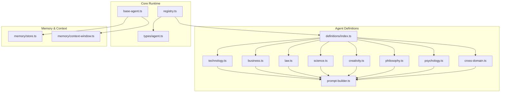
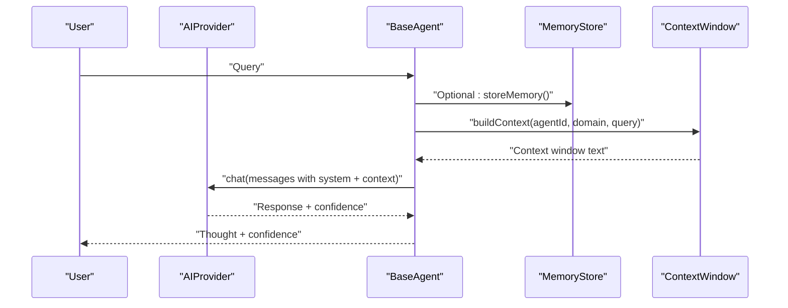
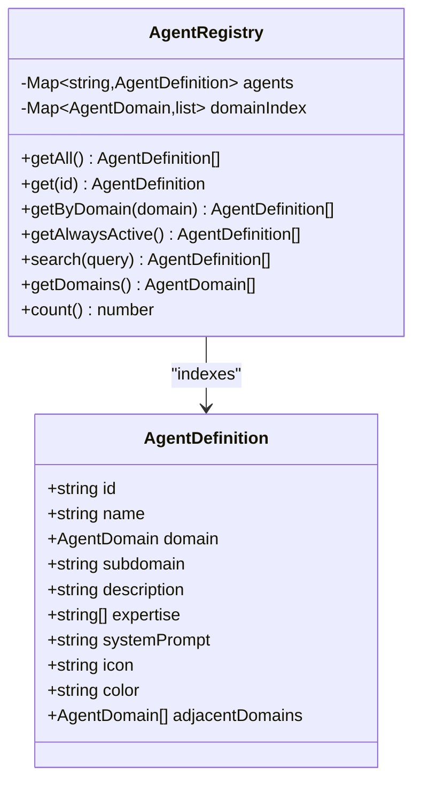
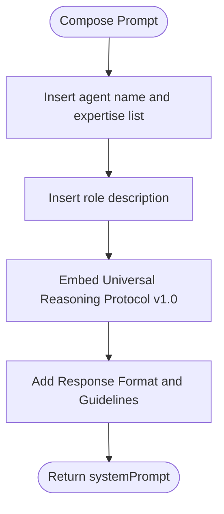
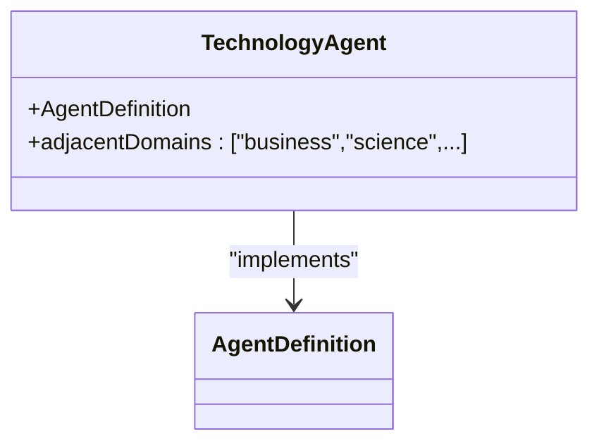
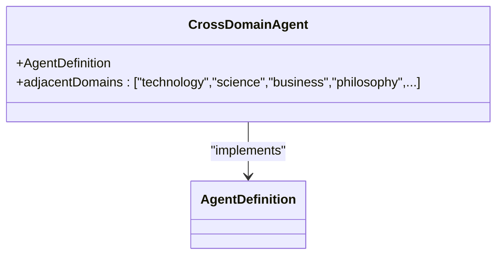
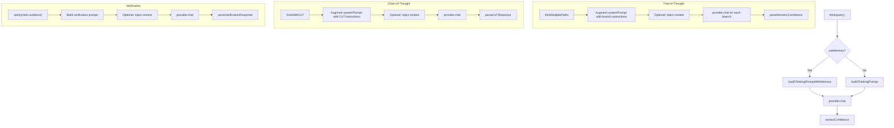
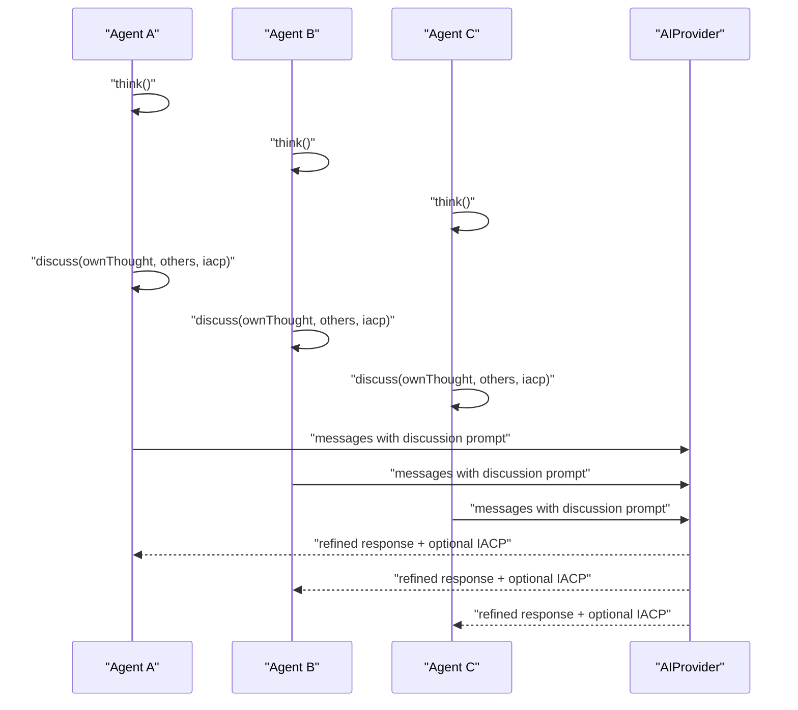
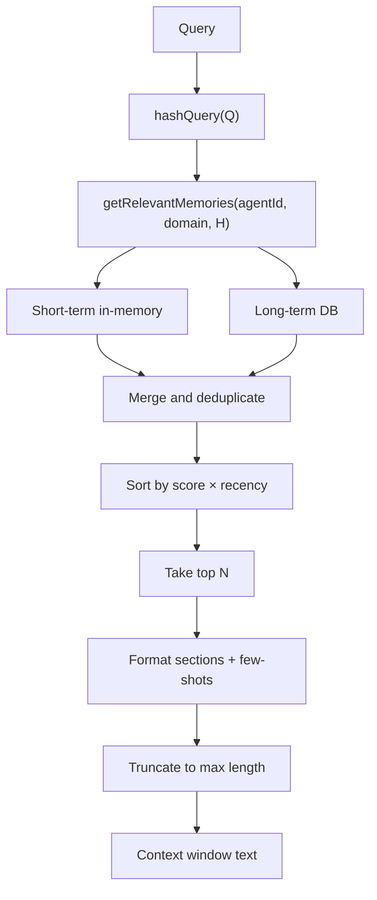
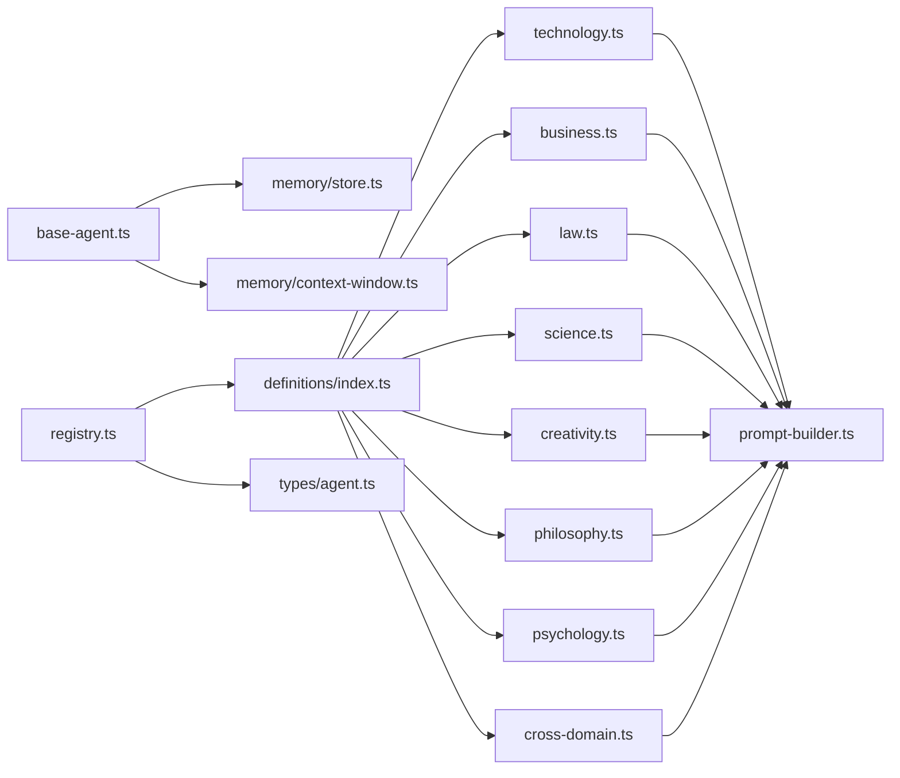

# Agent Definitions and Domains

<cite>
**Referenced Files in This Document**
- [index.ts](file://src/core/agents/definitions/index.ts)
- [technology.ts](file://src/core/agents/definitions/technology.ts)
- [business.ts](file://src/core/agents/definitions/business.ts)
- [law.ts](file://src/core/agents/definitions/law.ts)
- [science.ts](file://src/core/agents/definitions/science.ts)
- [creativity.ts](file://src/core/agents/definitions/creativity.ts)
- [philosophy.ts](file://src/core/agents/definitions/philosophy.ts)
- [psychology.ts](file://src/core/agents/definitions/psychology.ts)
- [cross-domain.ts](file://src/core/agents/definitions/cross-domain.ts)
- [prompt-builder.ts](file://src/core/agents/definitions/prompt-builder.ts)
- [base-agent.ts](file://src/core/agents/base-agent.ts)
- [registry.ts](file://src/core/agents/registry.ts)
- [agent.ts](file://src/types/agent.ts)
- [context-window.ts](file://src/core/memory/context-window.ts)
- [store.ts](file://src/core/memory/store.ts)
</cite>

## Table of Contents
1. [Introduction](#introduction)
2. [Project Structure](#project-structure)
3. [Core Components](#core-components)
4. [Architecture Overview](#architecture-overview)
5. [Detailed Component Analysis](#detailed-component-analysis)
6. [Dependency Analysis](#dependency-analysis)
7. [Performance Considerations](#performance-considerations)
8. [Troubleshooting Guide](#troubleshooting-guide)
9. [Conclusion](#conclusion)
10. [Appendices](#appendices)

## Introduction
This document describes the agent definitions system that powers the Deep Thinking AI Council. It covers all 10+ specialized agent domains: technology, business, law, science, creativity, philosophy, psychology, economics, education, communication, and cross-domain. It explains how agents are defined, how they reason using shared protocols, how they interact during council discussions, and how memory and context influence their behavior. It also documents the prompt builder system, agent capabilities specification, and domain-specific reasoning patterns. Finally, it provides examples of agent configuration, domain matching, and cross-domain coordination.

## Project Structure
The agent system is organized around a central registry that aggregates agent definitions across domains. Each domain module exports a set of AgentDefinition objects. A shared prompt builder composes each agent’s system prompt with a universal reasoning protocol. Base reasoning utilities encapsulate thinking, discussion, verification, and parsing logic. Memory and context management augment prompts with relevant past insights.

**Diagram sources**
- [index.ts:11-23](file://src/core/agents/definitions/index.ts#L11-L23)
- [technology.ts:19-29](file://src/core/agents/definitions/technology.ts#L19-L29)
- [business.ts:12](file://src/core/agents/definitions/business.ts#L12)
- [law.ts:9](file://src/core/agents/definitions/law.ts#L9)
- [science.ts:9](file://src/core/agents/definitions/science.ts#L9)
- [creativity.ts:9](file://src/core/agents/definitions/creativity.ts#L9)
- [philosophy.ts:9](file://src/core/agents/definitions/philosophy.ts#L9)
- [psychology.ts:8](file://src/core/agents/definitions/psychology.ts#L8)
- [cross-domain.ts:9](file://src/core/agents/definitions/cross-domain.ts#L9)
- [prompt-builder.ts:128-149](file://src/core/agents/definitions/prompt-builder.ts#L128-L149)
- [base-agent.ts:1-449](file://src/core/agents/base-agent.ts#L1-L449)
- [registry.ts:1-58](file://src/core/agents/registry.ts#L1-L58)
- [agent.ts:25-36](file://src/types/agent.ts#L25-L36)
- [store.ts:15-254](file://src/core/memory/store.ts#L15-L254)
- [context-window.ts:3-112](file://src/core/memory/context-window.ts#L3-L112)

**Section sources**
- [index.ts:11-23](file://src/core/agents/definitions/index.ts#L11-L23)
- [prompt-builder.ts:128-149](file://src/core/agents/definitions/prompt-builder.ts#L128-L149)
- [base-agent.ts:67-98](file://src/core/agents/base-agent.ts#L67-L98)
- [registry.ts:8-15](file://src/core/agents/registry.ts#L8-L15)
- [agent.ts:25-36](file://src/types/agent.ts#L25-L36)

## Core Components
- AgentDefinition: Defines the identity, domain, subdomain, description, expertise keywords, system prompt, icon/color metadata, and adjacent domains for each agent.
- AgentRegistry: Builds an in-memory index of agents by ID and domain, supports lookup, filtering, and always-active agent retrieval.
- BaseAgent: Provides reasoning primitives: single-thought thinking, multi-branch tree-of-thought, chain-of-thought, verification, and discussion parsing. It also manages memory injection via context windows.
- Prompt Builder: Generates a standardized system prompt per agent by combining domain expertise, role description, and the Universal Reasoning Protocol.
- Memory and Context: Stores agent insights and retrieves relevant memories to augment prompts, with scoring and recency-aware sorting.

**Section sources**
- [agent.ts:25-36](file://src/types/agent.ts#L25-L36)
- [registry.ts:8-15](file://src/core/agents/registry.ts#L8-L15)
- [base-agent.ts:6-31](file://src/core/agents/base-agent.ts#L6-L31)
- [prompt-builder.ts:128-149](file://src/core/agents/definitions/prompt-builder.ts#L128-L149)
- [store.ts:46-83](file://src/core/memory/store.ts#L46-L83)
- [context-window.ts:8-62](file://src/core/memory/context-window.ts#L8-L62)

## Architecture Overview
The system orchestrates reasoning across multiple agent specializations. Each agent uses a shared prompt template and a universal protocol. During a council session:
- Each agent thinks independently using either a single prompt or memory-augmented prompts.
- Agents then discuss, reviewing peers’ thoughts and optionally sending inter-agent messages.
- A verifier and a devil’s advocate are always active to ensure quality and challenge assumptions.

**Diagram sources**
- [base-agent.ts:12-31](file://src/core/agents/base-agent.ts#L12-L31)
- [base-agent.ts:74-98](file://src/core/agents/base-agent.ts#L74-L98)
- [context-window.ts:8-62](file://src/core/memory/context-window.ts#L8-L62)
- [store.ts:23-39](file://src/core/memory/store.ts#L23-L39)

## Detailed Component Analysis

### Agent Definition Schema and Registry
- AgentDefinition fields include identifiers, domain/subdomain taxonomy, description, expertise keywords, systemPrompt, icon/color metadata, and adjacentDomains for cross-domain collaboration.
- AgentRegistry constructs maps for fast lookup by ID and domain, exposes search by name/description/expertise/subdomain, and enumerates always-active agents.

**Diagram sources**
- [agent.ts:25-36](file://src/types/agent.ts#L25-L36)
- [registry.ts:4-57](file://src/core/agents/registry.ts#L4-L57)

**Section sources**
- [agent.ts:25-36](file://src/types/agent.ts#L25-L36)
- [registry.ts:8-15](file://src/core/agents/registry.ts#L8-L15)
- [registry.ts:37-46](file://src/core/agents/registry.ts#L37-L46)

### Prompt Builder and Universal Reasoning Protocol
- Each agent’s systemPrompt is built by the prompt builder, which embeds:
  - Agent name and expertise list
  - Role description
  - Universal Reasoning Protocol v1.0 (three-layer reasoning and verification gates)
- The protocol enforces structured understanding, reasoning traps scanning, alternative generation, and verification before delivering a response.

**Diagram sources**
- [prompt-builder.ts:128-149](file://src/core/agents/definitions/prompt-builder.ts#L128-L149)
- [prompt-builder.ts:6-126](file://src/core/agents/definitions/prompt-builder.ts#L6-L126)

**Section sources**
- [prompt-builder.ts:128-149](file://src/core/agents/definitions/prompt-builder.ts#L128-L149)
- [prompt-builder.ts:6-126](file://src/core/agents/definitions/prompt-builder.ts#L6-L126)

### Technology Agents
- Specializations include software architecture, frontend/backend development, DevOps, cybersecurity, AI/ML, data engineering, mobile development, databases, and performance.
- Adjacency: Often connects to business, science, and psychology domains.
- Example configuration pattern: expertise arrays, systemPrompt composed via prompt builder, icon/color metadata, and adjacentDomains.

**Diagram sources**
- [technology.ts:4-296](file://src/core/agents/definitions/technology.ts#L4-L296)
- [prompt-builder.ts:128-149](file://src/core/agents/definitions/prompt-builder.ts#L128-L149)

**Section sources**
- [technology.ts:4-296](file://src/core/agents/definitions/technology.ts#L4-L296)

### Business Agents
- Specializations include strategy, project/product management, marketing, financial analysis, entrepreneurship, HR/leadership, and operations.
- Adjacency: Often connects to technology, economics, and law.

**Section sources**
- [business.ts:4-102](file://src/core/agents/definitions/business.ts#L4-L102)

### Law Agents
- Specializations include general law, intellectual property, privacy/data law, contract law, and compliance.
- Adjacency: Often connects to technology and business.

**Section sources**
- [law.ts:4-41](file://src/core/agents/definitions/law.ts#L4-L41)

### Science Agents
- Specializations include research methodology, statistics/analytics, mathematics, physics/engineering, biology/medicine, environmental science, and chemistry.
- Adjacency: Often connects to education, philosophy, and technology.

**Section sources**
- [science.ts:4-55](file://src/core/agents/definitions/science.ts#L4-L55)

### Creativity and Education Agents
- Creativity: UI/UX design, graphic design, creative writing, branding, video/media, game design.
- Education: pedagogy, e-learning design, assessment, academic writing, career development.
- Adjacency: Cross-links to technology, psychology, communication, and business.

**Section sources**
- [creativity.ts:4-86](file://src/core/agents/definitions/creativity.ts#L4-L86)

### Philosophy and Communication Agents
- Philosophy: logic/reasoning, ethics, critical thinking, philosophy of science, decision theory.
- Communication: general communication, Arabic language, English language, technical writing, public relations.
- Adjacency: Bridges to science, education, psychology, and law.

**Section sources**
- [philosophy.ts:4-79](file://src/core/agents/definitions/philosophy.ts#L4-L79)

### Psychology and Economics Agents
- Psychology: cognitive psychology, behavioral science, social psychology, UX psychology, motivation/productivity.
- Economics: macroeconomics, microeconomics, investment analysis, cryptocurrency/blockchain, risk management.
- Adjacency: Connects to business, communication, and technology.

**Section sources**
- [psychology.ts:4-79](file://src/core/agents/definitions/psychology.ts#L4-L79)

### Cross-Domain Agents
- Systems thinking, innovation, futurism, QA, documentation, accessibility, internationalization, fact-checking, devil’s advocate.
- Always-active agents: Fact Checker and Devil’s Advocate participate in every council session.

**Diagram sources**
- [cross-domain.ts:4-69](file://src/core/agents/definitions/cross-domain.ts#L4-L69)

**Section sources**
- [cross-domain.ts:4-69](file://src/core/agents/definitions/cross-domain.ts#L4-L69)
- [registry.ts:29-35](file://src/core/agents/registry.ts#L29-L35)

### Reasoning Modes and Verification
- Single-thought: BaseAgent.think builds a minimal system + user prompt and extracts confidence.
- Multi-branch Tree-of-Thought: BaseAgent.thinkMultiplePaths runs several reasoning branches with varying temperatures and memory contexts.
- Chain-of-Thought: BaseAgent.thinkWithCoT requests stepwise reasoning with confidence scores and parses structured results.
- Verification: BaseAgent.verify evaluates claims against evidence and returns accuracy, validity, issues, and suggestions.

**Diagram sources**
- [base-agent.ts:6-31](file://src/core/agents/base-agent.ts#L6-L31)
- [base-agent.ts:206-258](file://src/core/agents/base-agent.ts#L206-L258)
- [base-agent.ts:262-300](file://src/core/agents/base-agent.ts#L262-L300)
- [base-agent.ts:304-342](file://src/core/agents/base-agent.ts#L304-L342)

**Section sources**
- [base-agent.ts:6-31](file://src/core/agents/base-agent.ts#L6-L31)
- [base-agent.ts:206-258](file://src/core/agents/base-agent.ts#L206-L258)
- [base-agent.ts:262-300](file://src/core/agents/base-agent.ts#L262-L300)
- [base-agent.ts:304-342](file://src/core/agents/base-agent.ts#L304-L342)

### Discussion and Inter-Agent Coordination
- BaseAgent.discuss composes a discussion prompt that includes:
  - Own initial thought
  - Peers’ perspectives
  - Optional incoming IACP messages
  - Memory context
- Response parsing extracts a refined discussion response and optional IACP messages formatted as JSON.

**Diagram sources**
- [base-agent.ts:33-65](file://src/core/agents/base-agent.ts#L33-L65)
- [base-agent.ts:100-150](file://src/core/agents/base-agent.ts#L100-L150)
- [base-agent.ts:152-185](file://src/core/agents/base-agent.ts#L152-L185)

**Section sources**
- [base-agent.ts:33-65](file://src/core/agents/base-agent.ts#L33-L65)
- [base-agent.ts:100-150](file://src/core/agents/base-agent.ts#L100-L150)
- [base-agent.ts:152-185](file://src/core/agents/base-agent.ts#L152-L185)

### Domain Matching and Search
- AgentRegistry.search performs substring matching across agent name, description, expertise, and subdomain to surface relevant agents for a query.
- AgentRegistry.getByDomain returns all agents within a given domain for targeted council composition.

**Section sources**
- [registry.ts:37-46](file://src/core/agents/registry.ts#L37-L46)
- [registry.ts:25-27](file://src/core/agents/registry.ts#L25-L27)

### Memory Augmentation and Context Windows
- BaseAgent integrates memory via contextManager.buildContext, which:
  - Retrieves relevant memories by agentId/domain/queryHash
  - Separates few-shot examples from other insights
  - Formats a context string and truncates to token budget
- MemoryStore persists and retrieves memories, sorts by score × recency, and tracks usage.

**Diagram sources**
- [context-window.ts:8-62](file://src/core/memory/context-window.ts#L8-L62)
- [store.ts:46-83](file://src/core/memory/store.ts#L46-L83)
- [store.ts:239-246](file://src/core/memory/store.ts#L239-L246)

**Section sources**
- [context-window.ts:8-62](file://src/core/memory/context-window.ts#L8-L62)
- [store.ts:46-83](file://src/core/memory/store.ts#L46-L83)
- [store.ts:239-246](file://src/core/memory/store.ts#L239-L246)

## Dependency Analysis
- definitions/index.ts aggregates all domain modules and exports a flat list of AgentDefinition instances.
- Each domain module depends on the prompt builder to construct system prompts.
- BaseAgent depends on memoryStore and contextManager to augment prompts.
- AgentRegistry depends on the unified list of agents and types.

**Diagram sources**
- [index.ts:2-9](file://src/core/agents/definitions/index.ts#L2-L9)
- [technology.ts:19](file://src/core/agents/definitions/technology.ts#L19)
- [business.ts:12](file://src/core/agents/definitions/business.ts#L12)
- [law.ts:9](file://src/core/agents/definitions/law.ts#L9)
- [science.ts:9](file://src/core/agents/definitions/science.ts#L9)
- [creativity.ts:9](file://src/core/agents/definitions/creativity.ts#L9)
- [philosophy.ts:9](file://src/core/agents/definitions/philosophy.ts#L9)
- [psychology.ts:8](file://src/core/agents/definitions/psychology.ts#L8)
- [cross-domain.ts:9](file://src/core/agents/definitions/cross-domain.ts#L9)
- [base-agent.ts:2-4](file://src/core/agents/base-agent.ts#L2-L4)
- [registry.ts:2](file://src/core/agents/registry.ts#L2)
- [agent.ts:1-1](file://src/types/agent.ts#L1-L1)

**Section sources**
- [index.ts:2-9](file://src/core/agents/definitions/index.ts#L2-L9)
- [registry.ts:2](file://src/core/agents/registry.ts#L2)
- [base-agent.ts:2-4](file://src/core/agents/base-agent.ts#L2-L4)

## Performance Considerations
- Token budgeting: Context windows truncate to a character estimate to keep prompts within model limits.
- Memory pruning: Limit retained memories per agent to avoid excessive context inflation.
- Parallelization: Multiple agents can think concurrently; discussion phases can be parallelized with careful IACP message routing.
- Temperature scheduling: Tree-of-thought increases temperature per branch to encourage exploration while maintaining coherence.

## Troubleshooting Guide
- Memory unavailable: Context augmentation falls back gracefully if memory subsystem fails.
- Parsing failures: Discussion response parsing tolerates malformed IACP JSON; the system still returns a cleaned discussion response.
- Confidence extraction: Numeric confidence parsing estimates from hedging language when explicit scores are absent.
- Verification: Accuracy and validity are derived from structured output; issues and suggestions are extracted from bullet lists.

**Section sources**
- [base-agent.ts:48-56](file://src/core/agents/base-agent.ts#L48-L56)
- [base-agent.ts:156-179](file://src/core/agents/base-agent.ts#L156-L179)
- [base-agent.ts:346-358](file://src/core/agents/base-agent.ts#L346-L358)
- [base-agent.ts:391-427](file://src/core/agents/base-agent.ts#L391-L427)

## Conclusion
The agent definitions system provides a modular, extensible framework for multi-domain reasoning. By standardizing prompts with a universal protocol, enabling robust memory augmentation, and supporting structured reasoning modes, it facilitates high-quality council deliberations. The registry and cross-domain agents ensure flexible composition and continuous quality checks through always-active roles.

## Appendices

### Agent Configuration Examples (by file reference)
- Technology: [technology.ts:4-296](file://src/core/agents/definitions/technology.ts#L4-L296)
- Business: [business.ts:4-102](file://src/core/agents/definitions/business.ts#L4-L102)
- Law: [law.ts:4-41](file://src/core/agents/definitions/law.ts#L4-L41)
- Science: [science.ts:4-55](file://src/core/agents/definitions/science.ts#L4-L55)
- Creativity/Education: [creativity.ts:4-86](file://src/core/agents/definitions/creativity.ts#L4-L86)
- Philosophy/Communication: [philosophy.ts:4-79](file://src/core/agents/definitions/philosophy.ts#L4-L79)
- Psychology/Economics: [psychology.ts:4-79](file://src/core/agents/definitions/psychology.ts#L4-L79)
- Cross-Domain: [cross-domain.ts:4-69](file://src/core/agents/definitions/cross-domain.ts#L4-L69)
- Prompt Builder: [prompt-builder.ts:128-149](file://src/core/agents/definitions/prompt-builder.ts#L128-L149)

### Domain Matching and Search
- Search: [registry.ts:37-46](file://src/core/agents/registry.ts#L37-L46)
- Domain lookup: [registry.ts:25-27](file://src/core/agents/registry.ts#L25-L27)

### Cross-Domain Coordination
- Adjacent domains: [technology.ts:32](file://src/core/agents/definitions/technology.ts#L32), [business.ts:15](file://src/core/agents/definitions/business.ts#L15), [law.ts:10](file://src/core/agents/definitions/law.ts#L10), [science.ts:10](file://src/core/agents/definitions/science.ts#L10), [cross-domain.ts:10](file://src/core/agents/definitions/cross-domain.ts#L10)
- Always-active agents: [registry.ts:29-35](file://src/core/agents/registry.ts#L29-L35)