# Agent Registry and Management

<cite>
**Referenced Files in This Document**
- [registry.ts](file://src/core/agents/registry.ts)
- [base-agent.ts](file://src/core/agents/base-agent.ts)
- [agent.ts](file://src/types/agent.ts)
- [route.ts](file://src/app/api/agents/route.ts)
- [index.ts](file://src/core/agents/definitions/index.ts)
- [technology.ts](file://src/core/agents/definitions/technology.ts)
- [business.ts](file://src/core/agents/definitions/business.ts)
- [cross-domain.ts](file://src/core/agents/definitions/cross-domain.ts)
- [prompt-builder.ts](file://src/core/agents/definitions/prompt-builder.ts)
- [store.ts](file://src/core/memory/store.ts)
- [manager.ts](file://src/core/concurrency/manager.ts)
- [metrics.ts](file://src/lib/metrics.ts)
</cite>

## Table of Contents
1. [Introduction](#introduction)
2. [Project Structure](#project-structure)
3. [Core Components](#core-components)
4. [Architecture Overview](#architecture-overview)
5. [Detailed Component Analysis](#detailed-component-analysis)
6. [Dependency Analysis](#dependency-analysis)
7. [Performance Considerations](#performance-considerations)
8. [Troubleshooting Guide](#troubleshooting-guide)
9. [Conclusion](#conclusion)
10. [Appendices](#appendices)

## Introduction
This document describes the agent registry and management system that powers a centralized, extensible framework for 70+ specialized agents. It explains how agents are registered, discovered, and searched; how the base agent implementation provides shared capabilities; how memory and performance monitoring integrate; and how concurrency and lifecycle management are coordinated. The goal is to enable both developers and operators to understand, extend, and operate the agent ecosystem effectively.

## Project Structure
The agent system is organized around a central registry that aggregates agent definitions from domain-specific modules, exposes discovery APIs, and integrates with memory, concurrency, and metrics subsystems.

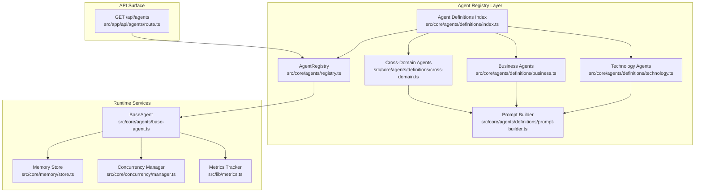

**Diagram sources**
- [registry.ts:1-58](file://src/core/agents/registry.ts#L1-L58)
- [index.ts:1-38](file://src/core/agents/definitions/index.ts#L1-L38)
- [technology.ts:1-200](file://src/core/agents/definitions/technology.ts#L1-L200)
- [business.ts:1-102](file://src/core/agents/definitions/business.ts#L1-L102)
- [cross-domain.ts:1-69](file://src/core/agents/definitions/cross-domain.ts#L1-L69)
- [prompt-builder.ts:1-150](file://src/core/agents/definitions/prompt-builder.ts#L1-L150)
- [base-agent.ts:1-449](file://src/core/agents/base-agent.ts#L1-L449)
- [store.ts:1-254](file://src/core/memory/store.ts#L1-L254)
- [manager.ts:1-55](file://src/core/concurrency/manager.ts#L1-L55)
- [metrics.ts:1-225](file://src/lib/metrics.ts#L1-L225)
- [route.ts:1-25](file://src/app/api/agents/route.ts#L1-L25)

**Section sources**
- [registry.ts:1-58](file://src/core/agents/registry.ts#L1-L58)
- [index.ts:1-38](file://src/core/agents/definitions/index.ts#L1-L38)
- [route.ts:1-25](file://src/app/api/agents/route.ts#L1-L25)

## Core Components
- Centralized Agent Registry: Maintains in-memory maps for fast lookup by ID, domain indexing for efficient filtering, and search across names, descriptions, expertise, and subdomains. Exposes counts, domain enumeration, and retrieval of always-active agents.
- Base Agent Implementation: Provides standardized reasoning workflows (single-path thinking, multi-branch tree-of-thought, chain-of-thought), discussion orchestration with IACP messaging, confidence extraction, and memory integration.
- Agent Definitions: Organized by domain and cross-domain categories, each definition includes metadata (id, name, domain, subdomain, description, expertise), system prompts built via a universal protocol, and UI attributes.
- Runtime Integrations: Memory store for session-aware recall and persistence; concurrency manager for controlled parallel execution; metrics tracker for performance scoring and suppression decisions.

**Section sources**
- [registry.ts:4-55](file://src/core/agents/registry.ts#L4-L55)
- [base-agent.ts:5-448](file://src/core/agents/base-agent.ts#L5-L448)
- [agent.ts:25-57](file://src/types/agent.ts#L25-L57)
- [index.ts:11-23](file://src/core/agents/definitions/index.ts#L11-L23)
- [prompt-builder.ts:6-149](file://src/core/agents/definitions/prompt-builder.ts#L6-L149)
- [store.ts:15-251](file://src/core/memory/store.ts#L15-L251)
- [manager.ts:1-55](file://src/core/concurrency/manager.ts#L1-L55)
- [metrics.ts:42-224](file://src/lib/metrics.ts#L42-L224)

## Architecture Overview
The system follows a layered architecture:
- Definition Layer: Domain-specific agent lists and a unified index compose the canonical agent catalog.
- Registry Layer: Central registry loads definitions at startup and maintains indices for quick retrieval and search.
- API Layer: HTTP endpoint serves agent catalogs and domain-filtered views, stripping sensitive fields for public consumption.
- Runtime Layer: Base agent orchestrates reasoning, discussion, and memory, coordinating with concurrency and metrics.

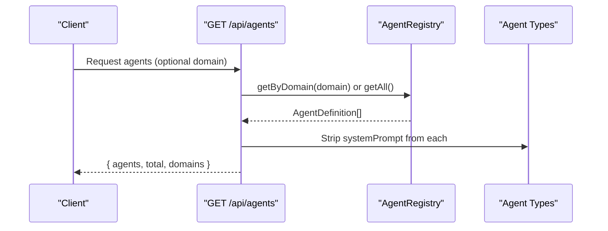

**Diagram sources**
- [route.ts:4-24](file://src/app/api/agents/route.ts#L4-L24)
- [registry.ts:17-27](file://src/core/agents/registry.ts#L17-L27)
- [agent.ts:25-36](file://src/types/agent.ts#L25-L36)

## Detailed Component Analysis

### Agent Registry
Responsibilities:
- Load and index all agents from the definitions index.
- Provide getters for all agents, by ID, by domain, and always-active agents.
- Implement a text-based search across agent metadata.
- Expose domain enumeration and total count.

Key behaviors:
- Construction builds two indices: a flat map by ID and a domain-keyed array map.
- Search filters across name, description, expertise, and subdomain using case-insensitive containment checks.
- Always-active agents are explicitly returned for council sessions.

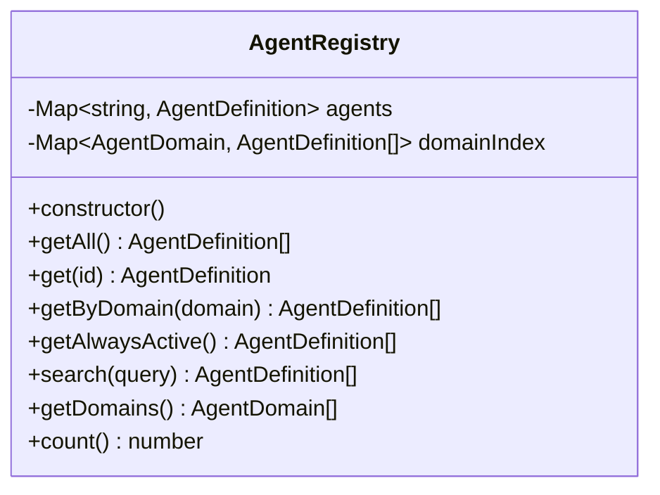

**Diagram sources**
- [registry.ts:4-55](file://src/core/agents/registry.ts#L4-L55)

**Section sources**
- [registry.ts:8-15](file://src/core/agents/registry.ts#L8-L15)
- [registry.ts:37-46](file://src/core/agents/registry.ts#L37-L46)
- [registry.ts:29-35](file://src/core/agents/registry.ts#L29-L35)

### Base Agent Implementation
Capabilities:
- Single-path reasoning with optional memory context augmentation.
- Multi-branch tree-of-thought reasoning with confidence estimation per branch.
- Chain-of-thought structured analysis with stepwise confidence scoring.
- Discussion orchestration with IACP message parsing and propagation.
- Verification workflow for claims with structured scoring and suggestions.
- Memory integration for storing high-confidence thoughts and pruning by score.
- Confidence extraction helpers for qualitative and quantitative estimates.

```mermaid
classDiagram
class BaseAgent {
+think(definition, query, provider, model, options) Promise~{thought, confidence}~
+thinkMultiplePaths(definition, query, systemPrompt, provider, model, options) Promise~ReasoningBranch[]~
+thinkWithCoT(definition, query, systemPrompt, provider, model, options) Promise~CoTResult~
+discuss(definition, query, ownThought, otherThoughts, incomingMessages, provider, model, options) Promise~{response, iacpMessages}~
+verify(definition, claim, evidence, provider, model, options) Promise~VerificationResult~
+extractConfidence(text) "HIGH|MEDIUM|LOW"
+parseNumericConfidence(text) number
+parseCoTResponse(text) CoTResult
+parseVerificationResponse(text) VerificationResult
-storeThoughtAsMemory(definition, query, thought, confidence) Promise~void~
}
```

**Diagram sources**
- [base-agent.ts:5-448](file://src/core/agents/base-agent.ts#L5-L448)

**Section sources**
- [base-agent.ts:6-31](file://src/core/agents/base-agent.ts#L6-L31)
- [base-agent.ts:206-258](file://src/core/agents/base-agent.ts#L206-L258)
- [base-agent.ts:262-300](file://src/core/agents/base-agent.ts#L262-L300)
- [base-agent.ts:304-342](file://src/core/agents/base-agent.ts#L304-L342)
- [base-agent.ts:100-185](file://src/core/agents/base-agent.ts#L100-L185)
- [base-agent.ts:431-447](file://src/core/agents/base-agent.ts#L431-L447)

### Agent Definitions and Prompt Builder
- Definitions are grouped by domain and cross-domain categories, each exporting arrays of AgentDefinition objects.
- A shared prompt builder composes a universal reasoning protocol with domain-specific expertise and role statements.
- Cross-domain agents include always-active roles such as Fact Checker and Devil’s Advocate.

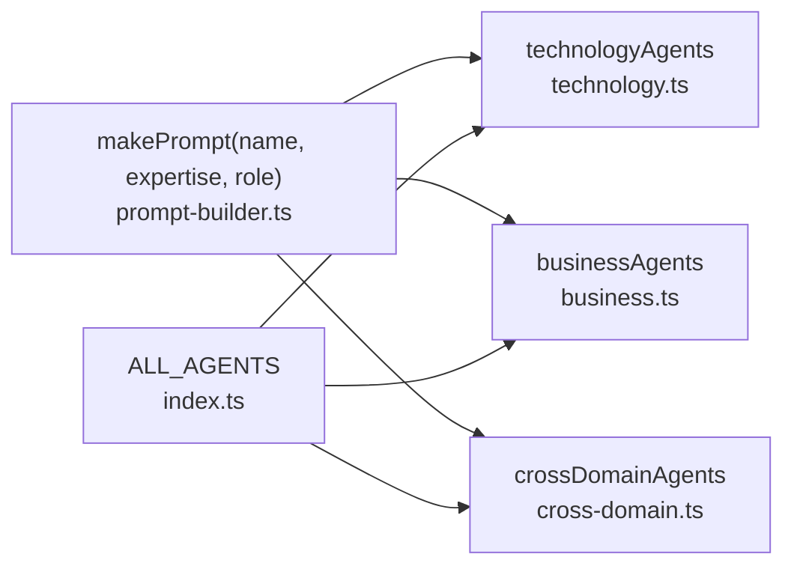

**Diagram sources**
- [prompt-builder.ts:128-149](file://src/core/agents/definitions/prompt-builder.ts#L128-L149)
- [technology.ts:4-33](file://src/core/agents/definitions/technology.ts#L4-L33)
- [business.ts:4-16](file://src/core/agents/definitions/business.ts#L4-L16)
- [cross-domain.ts:4-68](file://src/core/agents/definitions/cross-domain.ts#L4-L68)
- [index.ts:11-23](file://src/core/agents/definitions/index.ts#L11-L23)

**Section sources**
- [index.ts:11-23](file://src/core/agents/definitions/index.ts#L11-L23)
- [prompt-builder.ts:6-149](file://src/core/agents/definitions/prompt-builder.ts#L6-L149)
- [cross-domain.ts:55-67](file://src/core/agents/definitions/cross-domain.ts#L55-L67)

### Memory Integration
- Memory store maintains short-term in-memory entries per agent and asynchronously persists to the database.
- Retrieval merges short-term and long-term entries, sorts by a score-recency composite, and enforces pruning limits.
- Base agent writes high-confidence thoughts to memory and tolerates failures silently.

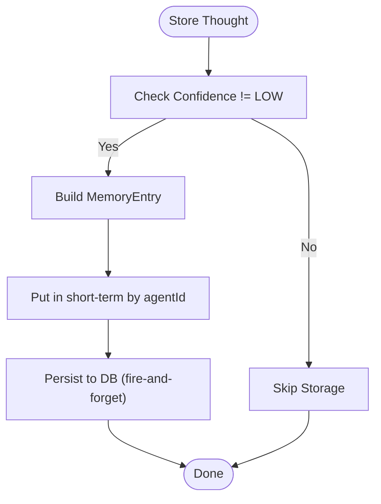

**Diagram sources**
- [base-agent.ts:25-31](file://src/core/agents/base-agent.ts#L25-L31)
- [base-agent.ts:431-447](file://src/core/agents/base-agent.ts#L431-L447)
- [store.ts:23-39](file://src/core/memory/store.ts#L23-L39)

**Section sources**
- [store.ts:15-83](file://src/core/memory/store.ts#L15-L83)
- [store.ts:147-175](file://src/core/memory/store.ts#L147-L175)
- [base-agent.ts:25-31](file://src/core/agents/base-agent.ts#L25-L31)

### Concurrency Coordination
- Concurrency manager enforces a soft limit on simultaneous tasks, queuing excess and releasing slots as workers finish.
- Batch execution wraps tasks to ensure acquisition/release semantics and optional callbacks for completion/error handling.

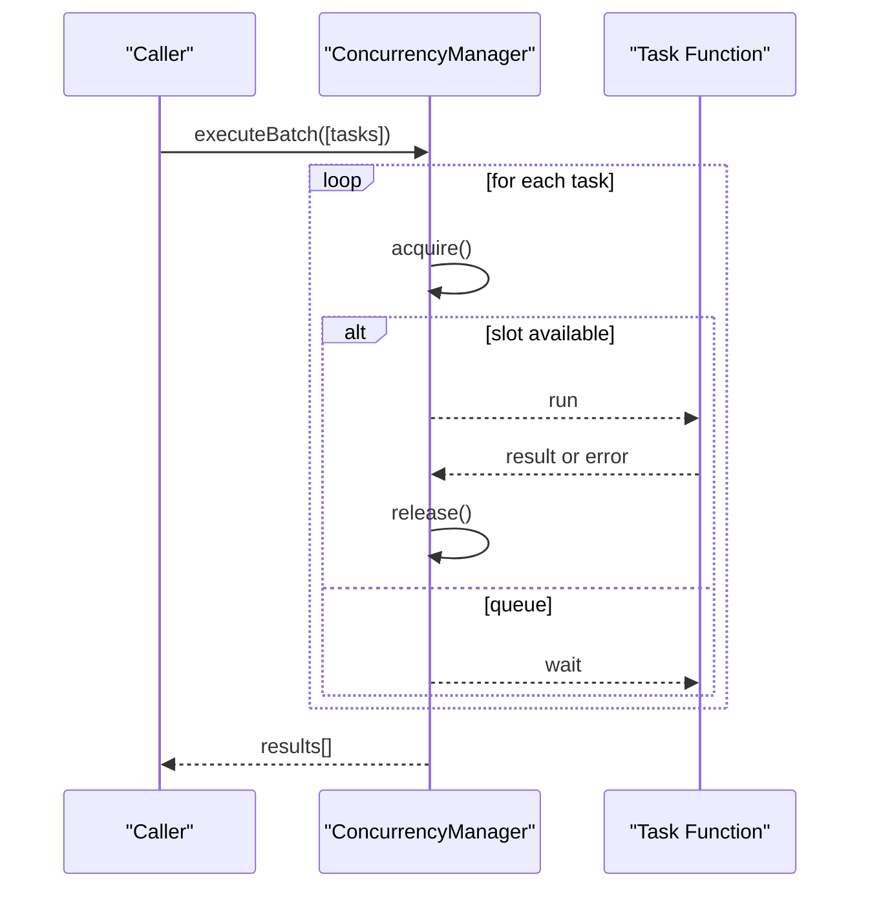

**Diagram sources**
- [manager.ts:34-53](file://src/core/concurrency/manager.ts#L34-L53)

**Section sources**
- [manager.ts:10-27](file://src/core/concurrency/manager.ts#L10-L27)
- [manager.ts:29-53](file://src/core/concurrency/manager.ts#L29-L53)

### Performance Monitoring and Resource Allocation
- Metrics tracker records per-session agent metrics and computes composite scores across quality, relevance, speed, and consistency.
- Provides top-N rankings by domain, suppression detection for consistently low performers, and user feedback integration.
- Resource allocation strategies include:
  - Concurrency limiting to prevent provider saturation.
  - Memory pruning to cap per-agent memory footprint.
  - Suppression of underperforming agents to protect user experience.

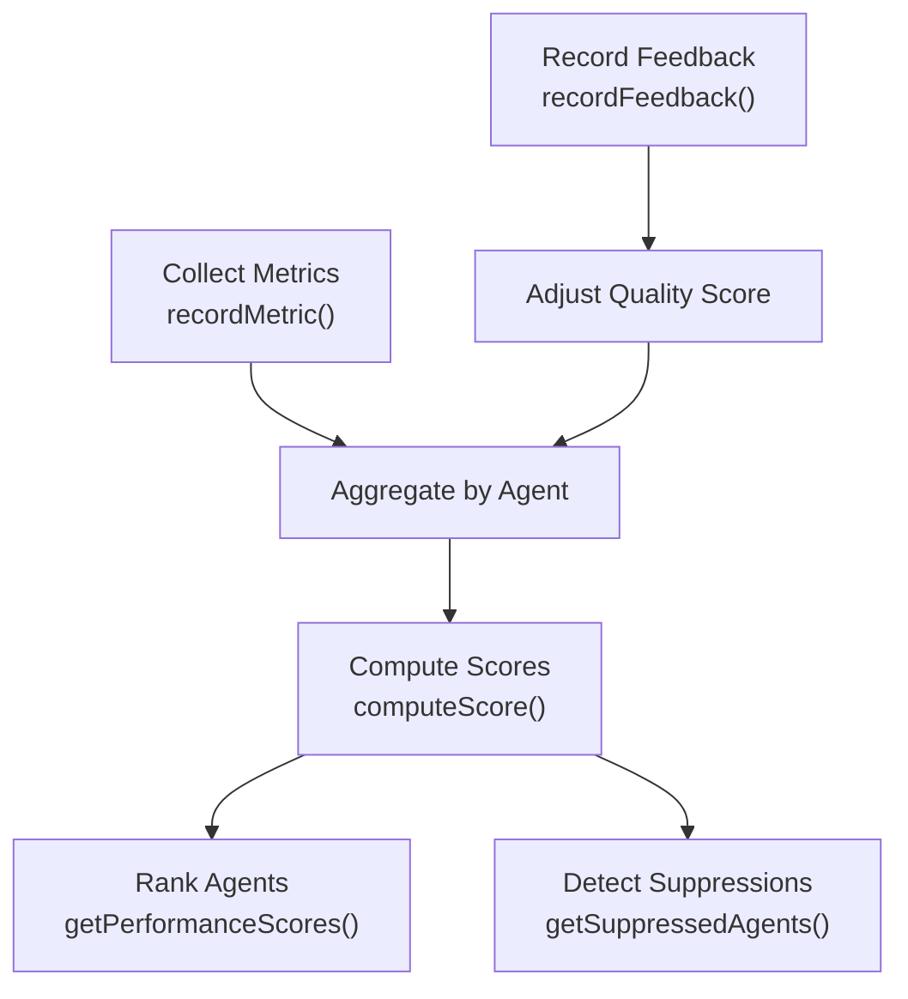

**Diagram sources**
- [metrics.ts:44-116](file://src/lib/metrics.ts#L44-L116)
- [metrics.ts:162-221](file://src/lib/metrics.ts#L162-L221)

**Section sources**
- [metrics.ts:42-224](file://src/lib/metrics.ts#L42-L224)

### Agent Discovery and Search
- API endpoint supports domain-filtered retrieval and returns sanitized agent definitions.
- Registry search enables free-text discovery across agent metadata.

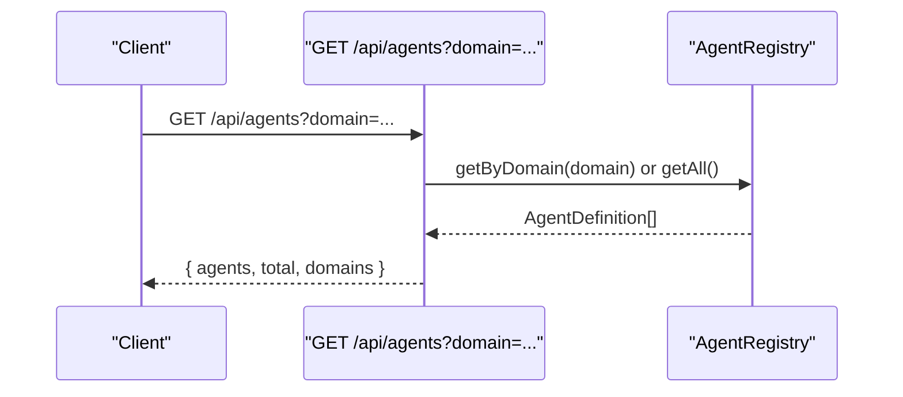

**Diagram sources**
- [route.ts:4-24](file://src/app/api/agents/route.ts#L4-L24)
- [registry.ts:17-27](file://src/core/agents/registry.ts#L17-L27)

**Section sources**
- [route.ts:4-24](file://src/app/api/agents/route.ts#L4-L24)
- [registry.ts:37-46](file://src/core/agents/registry.ts#L37-L46)

### Agent Lifecycle
- Registration: Agents are statically defined and aggregated into ALL_AGENTS during module initialization.
- Activation: Agents are activated implicitly by selection for a council or task; cross-domain always-active agents participate in every session.
- Execution: Base agent methods orchestrate reasoning, discussion, and verification workflows.
- Cleanup: Memory pruning and short-term clearing; metrics tracking for performance oversight.

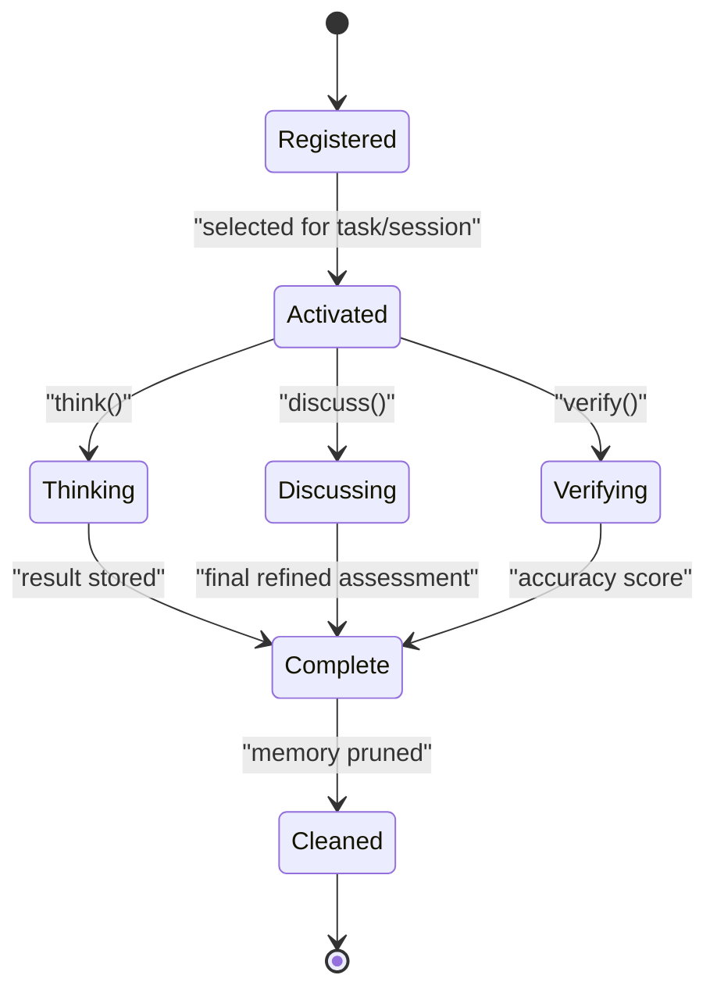

[No sources needed since this diagram shows conceptual workflow, not actual code structure]

## Dependency Analysis
- Registry depends on the definitions index and types.
- Base agent depends on memory store, context window, and provider abstractions.
- API route depends on the registry and returns sanitized agent data.
- Metrics tracker depends on persistence and logs failures without breaking runtime.
- Concurrency manager is independent and used by runtime workflows.

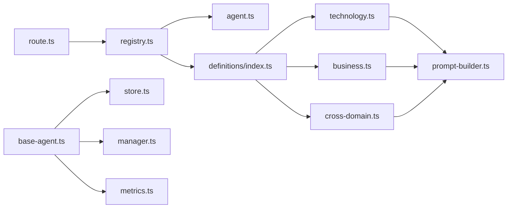

**Diagram sources**
- [route.ts:1-2](file://src/app/api/agents/route.ts#L1-L2)
- [registry.ts:1-2](file://src/core/agents/registry.ts#L1-L2)
- [index.ts:1-9](file://src/core/agents/definitions/index.ts#L1-L9)
- [technology.ts:1-2](file://src/core/agents/definitions/technology.ts#L1-L2)
- [business.ts:1-2](file://src/core/agents/definitions/business.ts#L1-L2)
- [cross-domain.ts:1-2](file://src/core/agents/definitions/cross-domain.ts#L1-L2)
- [prompt-builder.ts:1-4](file://src/core/agents/definitions/prompt-builder.ts#L1-L4)
- [base-agent.ts:1-4](file://src/core/agents/base-agent.ts#L1-L4)
- [store.ts:1](file://src/core/memory/store.ts#L1)
- [manager.ts:1](file://src/core/concurrency/manager.ts#L1)
- [metrics.ts:1](file://src/lib/metrics.ts#L1)

**Section sources**
- [route.ts:1-2](file://src/app/api/agents/route.ts#L1-L2)
- [registry.ts:1-2](file://src/core/agents/registry.ts#L1-L2)
- [base-agent.ts:1-4](file://src/core/agents/base-agent.ts#L1-L4)

## Performance Considerations
- Concurrency control prevents provider throttling and reduces tail latency spikes.
- Memory pruning caps long-term storage and improves retrieval performance.
- Metrics-driven suppression protects users from consistently poor-quality outputs.
- Short-term memory accelerates retrieval for the current session; DB fallback ensures resilience.

[No sources needed since this section provides general guidance]

## Troubleshooting Guide
- Registry search returns empty: Verify query terms align with agent metadata (name, description, expertise, subdomain).
- Memory store failures: Operations are resilient; confirm DB connectivity and schema availability.
- Concurrency stalls: Check limits and queued tasks; ensure tasks properly resolve to release slots.
- Metrics computation errors: Tracker logs failures and returns defaults; inspect persistence layer and data integrity.

**Section sources**
- [store.ts:35-38](file://src/core/memory/store.ts#L35-L38)
- [manager.ts:10-18](file://src/core/concurrency/manager.ts#L10-L18)
- [metrics.ts:67-69](file://src/lib/metrics.ts#L67-L69)

## Conclusion
The agent registry and management system provides a scalable, discoverable, and performant foundation for orchestrating diverse specialized agents. Its centralized registry, shared base agent capabilities, memory integration, concurrency controls, and metrics-driven operations collectively support robust agent lifecycle management and high-quality user experiences.

## Appendices

### Agent Metadata Model
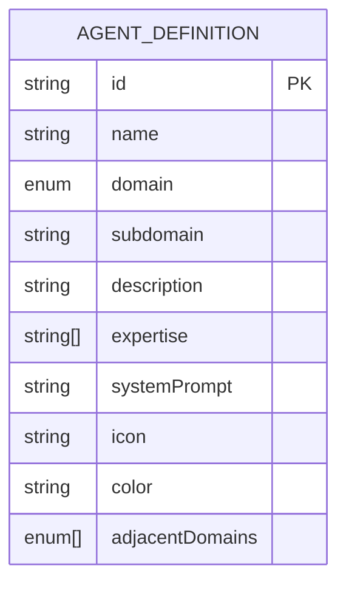

**Diagram sources**
- [agent.ts:25-36](file://src/types/agent.ts#L25-L36)

### Example Registration Patterns
- Add a new domain agent by extending the appropriate domain array and including it in the index aggregation.
- Extend cross-domain agents for always-active roles participating in every council.
- Use the prompt builder to ensure consistent system prompts aligned with the universal reasoning protocol.

**Section sources**
- [technology.ts:4-33](file://src/core/agents/definitions/technology.ts#L4-L33)
- [business.ts:4-16](file://src/core/agents/definitions/business.ts#L4-L16)
- [cross-domain.ts:4-68](file://src/core/agents/definitions/cross-domain.ts#L4-L68)
- [index.ts:11-23](file://src/core/agents/definitions/index.ts#L11-L23)
- [prompt-builder.ts:128-149](file://src/core/agents/definitions/prompt-builder.ts#L128-L149)

### Dynamic Instantiation and Querying
- Instantiate reasoning workflows via BaseAgent static methods, optionally leveraging memory context.
- Query the registry for domain-filtered agents or always-active agents for council composition.
- Use the API endpoint to fetch sanitized agent catalogs for UI rendering.

**Section sources**
- [base-agent.ts:6-31](file://src/core/agents/base-agent.ts#L6-L31)
- [base-agent.ts:206-258](file://src/core/agents/base-agent.ts#L206-L258)
- [registry.ts:25-35](file://src/core/agents/registry.ts#L25-L35)
- [route.ts:4-24](file://src/app/api/agents/route.ts#L4-L24)

### Graceful Shutdown Procedures
- Clear short-term memory to release session state.
- Allow in-flight tasks to complete or cancel based on application policy.
- Persist any pending metrics or logs.

**Section sources**
- [store.ts:193-195](file://src/core/memory/store.ts#L193-L195)
- [manager.ts:34-53](file://src/core/concurrency/manager.ts#L34-L53)