# Agent Selection and Coordination

<cite>
**Referenced Files in This Document**
- [selector.ts](file://src/core/council/selector.ts)
- [adjacency.ts](file://src/core/council/adjacency.ts)
- [synthesizer.ts](file://src/core/council/synthesizer.ts)
- [query-intelligence.ts](file://src/lib/query-intelligence.ts)
- [registry.ts](file://src/core/agents/registry.ts)
- [base-agent.ts](file://src/core/agents/base-agent.ts)
- [bus.ts](file://src/core/iacp/bus.ts)
- [manager.ts](file://src/core/concurrency/manager.ts)
- [estimator.ts](file://src/core/budget/estimator.ts)
- [tracker.ts](file://src/core/budget/tracker.ts)
- [route.ts](file://src/app/api/chat/route.ts)
- [use-chat.ts](file://src/hooks/use-chat.ts)
- [council-store.ts](file://src/stores/council-store.ts)
- [metrics.ts](file://src/lib/metrics.ts)
- [index.ts](file://src/types/index.ts)
- [council.ts](file://src/types/council.ts)
- [reasoning-graph.tsx](file://src/components/council/reasoning-graph.tsx)
</cite>

## Table of Contents
1. [Introduction](#introduction)
2. [Project Structure](#project-structure)
3. [Core Components](#core-components)
4. [Architecture Overview](#architecture-overview)
5. [Detailed Component Analysis](#detailed-component-analysis)
6. [Dependency Analysis](#dependency-analysis)
7. [Performance Considerations](#performance-considerations)
8. [Troubleshooting Guide](#troubleshooting-guide)
9. [Conclusion](#conclusion)
10. [Appendices](#appendices)

## Introduction
This document explains the agent selection and coordination system that powers the Deep Thinking AI council. It covers how user queries are analyzed to determine complexity and required expertise, how agents are selected and combined into teams, how parallel execution and inter-agent communication are orchestrated, how responses are evaluated and synthesized, and how budget and performance constraints are integrated. It also provides examples, diagrams, and guidance for optimization and quality assurance.

## Project Structure
The system is organized around a few core areas:
- Query analysis and complexity estimation
- Agent selection and adjacency-aware team building
- Parallel execution and inter-agent communication (IACP)
- Synthesis and consensus detection
- Budget estimation and token tracking
- Frontend orchestration via API streaming and UI stores

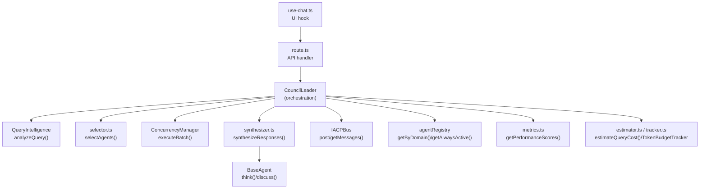

**Diagram sources**
- [route.ts:190-195](file://src/app/api/chat/route.ts#L190-L195)
- [selector.ts:27-164](file://src/core/council/selector.ts#L27-L164)
- [synthesizer.ts:333-371](file://src/core/council/synthesizer.ts#L333-L371)
- [base-agent.ts:6-31](file://src/core/agents/base-agent.ts#L6-L31)
- [bus.ts:39-94](file://src/core/iacp/bus.ts#L39-L94)
- [registry.ts:25-35](file://src/core/agents/registry.ts#L25-L35)
- [metrics.ts:72-96](file://src/lib/metrics.ts#L72-L96)
- [estimator.ts:25-55](file://src/core/budget/estimator.ts#L25-L55)
- [tracker.ts:3-77](file://src/core/budget/tracker.ts#L3-L77)
- [use-chat.ts:48-126](file://src/hooks/use-chat.ts#L48-L126)

**Section sources**
- [route.ts:88-221](file://src/app/api/chat/route.ts#L88-L221)
- [use-chat.ts:8-157](file://src/hooks/use-chat.ts#L8-L157)

## Core Components
- Query Intelligence: Determines ambiguity, complexity, and topic domains; estimates agent count.
- Agent Registry: Provides agent definitions by domain and always-active roles.
- Selector: Builds primary and secondary agent lists using domain adjacency and performance metrics; allocates slots and computes confidence.
- Adjacency Map: Encodes domain relationships to expand secondary coverage.
- Metrics Tracker: Supplies performance scores and suppression lists.
- Concurrency Manager: Executes agent tasks in parallel with controlled concurrency.
- IACP Bus: Routes inter-agent messages with priority and threading.
- Synthesizer: Compresses, weights, detects consensus, and builds synthesis prompts; supports progressive refinement.
- Budget Estimator and Tracker: Estimates cost/tokens and tracks usage per agent/session.
- Base Agent: Implements thinking, discussion, verification, and parsing helpers.
- UI Orchestration: Streams events from the API and updates the UI store.

**Section sources**
- [query-intelligence.ts:59-137](file://src/lib/query-intelligence.ts#L59-L137)
- [registry.ts:25-35](file://src/core/agents/registry.ts#L25-L35)
- [selector.ts:27-164](file://src/core/council/selector.ts#L27-L164)
- [adjacency.ts:3-15](file://src/core/council/adjacency.ts#L3-L15)
- [metrics.ts:72-132](file://src/lib/metrics.ts#L72-L132)
- [manager.ts:29-53](file://src/core/concurrency/manager.ts#L29-L53)
- [bus.ts:39-208](file://src/core/iacp/bus.ts#L39-L208)
- [synthesizer.ts:333-503](file://src/core/council/synthesizer.ts#L333-L503)
- [estimator.ts:25-55](file://src/core/budget/estimator.ts#L25-L55)
- [tracker.ts:3-77](file://src/core/budget/tracker.ts#L3-L77)
- [base-agent.ts:6-31](file://src/core/agents/base-agent.ts#L6-L31)
- [council-store.ts:54-171](file://src/stores/council-store.ts#L54-L171)

## Architecture Overview
The end-to-end flow:
1. UI sends a query via SSE endpoint.
2. API validates, sanitizes, and constructs a leader with provider/model/concurrency.
3. Leader orchestrates analysis, selection, thinking, discussion, verification, and synthesis.
4. Events are streamed to the UI via SSE and rendered in real-time.

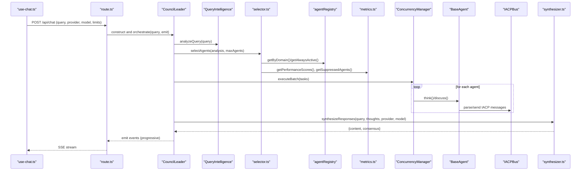

**Diagram sources**
- [route.ts:190-197](file://src/app/api/chat/route.ts#L190-L197)
- [query-intelligence.ts:59-137](file://src/lib/query-intelligence.ts#L59-L137)
- [selector.ts:27-164](file://src/core/council/selector.ts#L27-L164)
- [registry.ts:25-35](file://src/core/agents/registry.ts#L25-L35)
- [metrics.ts:72-96](file://src/lib/metrics.ts#L72-L96)
- [manager.ts:29-53](file://src/core/concurrency/manager.ts#L29-L53)
- [base-agent.ts:6-65](file://src/core/agents/base-agent.ts#L6-L65)
- [bus.ts:39-94](file://src/core/iacp/bus.ts#L39-L94)
- [synthesizer.ts:333-371](file://src/core/council/synthesizer.ts#L333-L371)

## Detailed Component Analysis

### Query Analysis and Complexity Estimation
- Detects ambiguity (pronouns, structure), extracts topics, computes complexity (simple/moderate/complex), and estimates agent count accordingly.
- Provides suggested clarifications and finds similar historical queries.

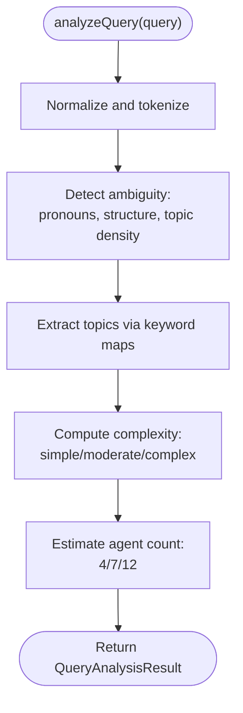

**Diagram sources**
- [query-intelligence.ts:59-137](file://src/lib/query-intelligence.ts#L59-L137)

**Section sources**
- [query-intelligence.ts:59-137](file://src/lib/query-intelligence.ts#L59-L137)

### Agent Selection Strategy
- Primary agents: from detected domains.
- Secondary agents: from adjacent domains (domain adjacency map) not already in primary.
- Filters suppressed agents and ranks by domain relevance × performance score; boosts high performers.
- Allocates slots: always-active agents first, then primary, then secondary.

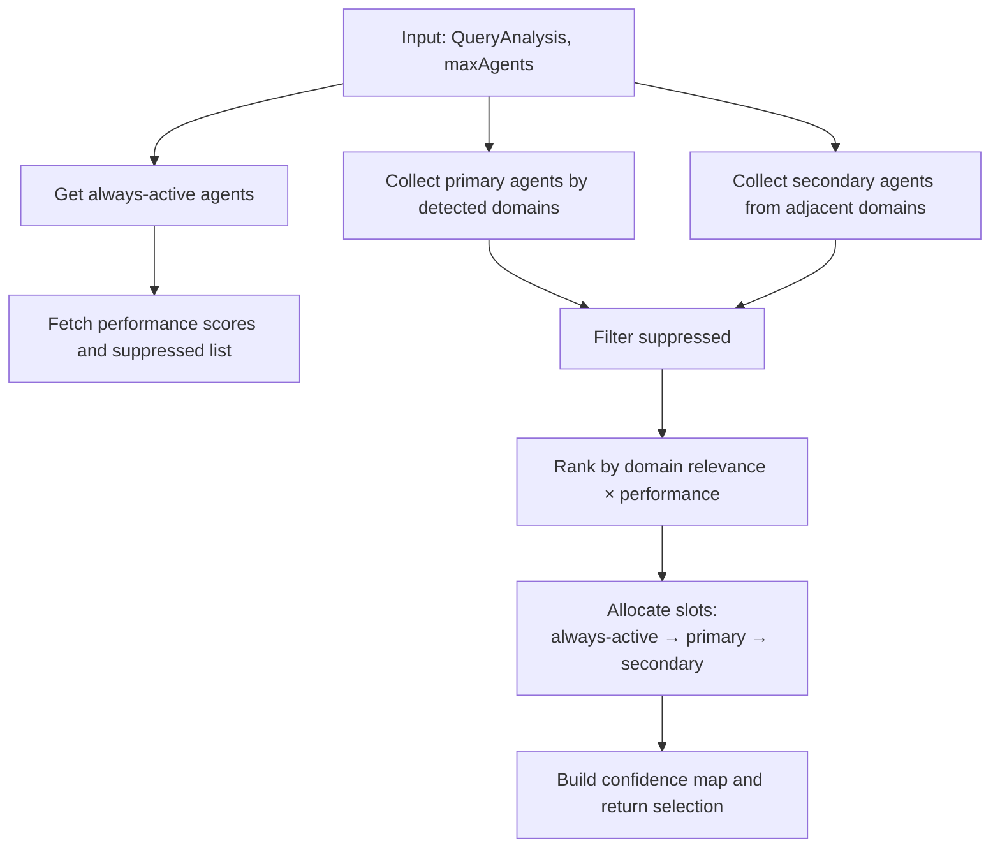

**Diagram sources**
- [selector.ts:27-164](file://src/core/council/selector.ts#L27-L164)
- [adjacency.ts:3-15](file://src/core/council/adjacency.ts#L3-L15)
- [metrics.ts:72-132](file://src/lib/metrics.ts#L72-L132)
- [registry.ts:25-35](file://src/core/agents/registry.ts#L25-L35)

**Section sources**
- [selector.ts:27-164](file://src/core/council/selector.ts#L27-L164)
- [adjacency.ts:3-15](file://src/core/council/adjacency.ts#L3-L15)
- [metrics.ts:72-132](file://src/lib/metrics.ts#L72-L132)
- [registry.ts:25-35](file://src/core/agents/registry.ts#L25-L35)

### Parallel Execution and Concurrency Control
- Batches agent tasks and executes them with a concurrency limiter.
- Tracks per-task completion and errors; ensures throughput without overwhelming providers.

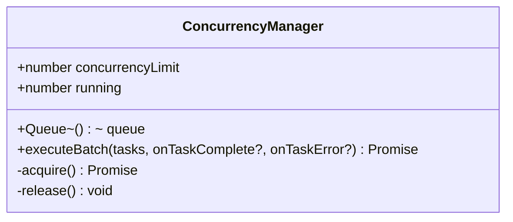

**Diagram sources**
- [manager.ts:1-55](file://src/core/concurrency/manager.ts#L1-L55)

**Section sources**
- [manager.ts:29-53](file://src/core/concurrency/manager.ts#L29-L53)

### Inter-Agent Communication (IACP)
- Posts and retrieves messages with priority, threading, and routing hints.
- Supports domain-based broadcast and targeted expertise routing.

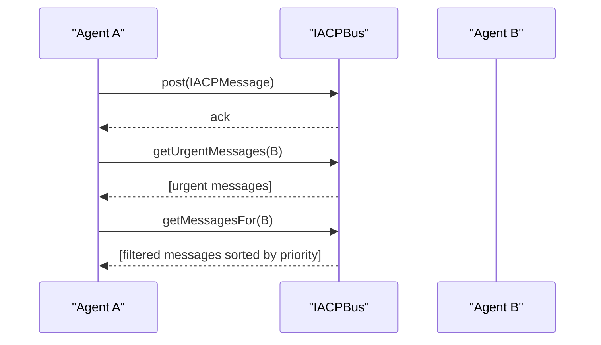

**Diagram sources**
- [bus.ts:39-111](file://src/core/iacp/bus.ts#L39-L111)
- [bus.ts:176-208](file://src/core/iacp/bus.ts#L176-L208)

**Section sources**
- [bus.ts:39-208](file://src/core/iacp/bus.ts#L39-L208)

### Synthesis, Consensus, and Progressive Refinement
- Compresses verbose thoughts, groups similar ones, and computes weighted scores.
- Detects consensus/disagreement and builds synthesis prompts with thresholds.
- Progressive synthesis yields early/developing/complete phases as thoughts arrive.

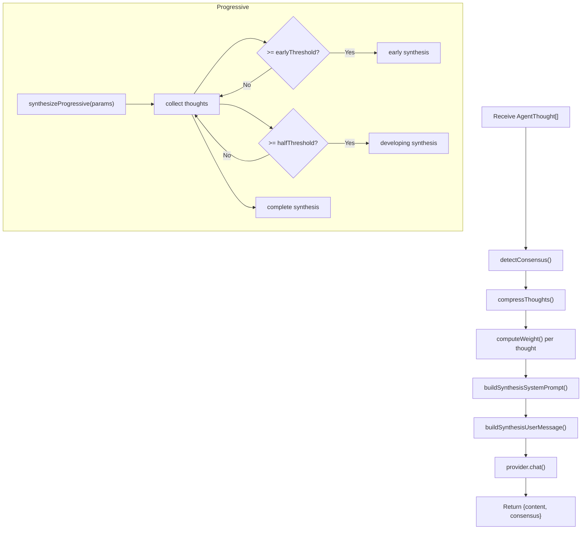

**Diagram sources**
- [synthesizer.ts:137-188](file://src/core/council/synthesizer.ts#L137-L188)
- [synthesizer.ts:333-371](file://src/core/council/synthesizer.ts#L333-L371)
- [synthesizer.ts:390-503](file://src/core/council/synthesizer.ts#L390-L503)

**Section sources**
- [synthesizer.ts:333-503](file://src/core/council/synthesizer.ts#L333-L503)

### Decision-Making and Conflict Resolution
- Consensus detection identifies majority/minority points and computes a consensus score.
- Weighted synthesis emphasizes high-confidence, high-relevance insights.
- IACP enables agents to challenge, agree, or share evidence, supporting iterative refinement.

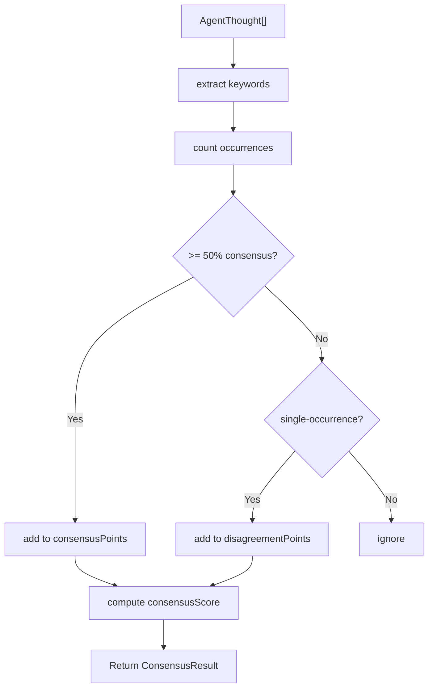

**Diagram sources**
- [synthesizer.ts:137-188](file://src/core/council/synthesizer.ts#L137-L188)

**Section sources**
- [synthesizer.ts:137-188](file://src/core/council/synthesizer.ts#L137-L188)

### Budget Management Integration
- Estimator projects tokens and cost across agent thinking/discussion/synthesis phases.
- Tracker records per-agent usage and exposes remaining budget and summaries.

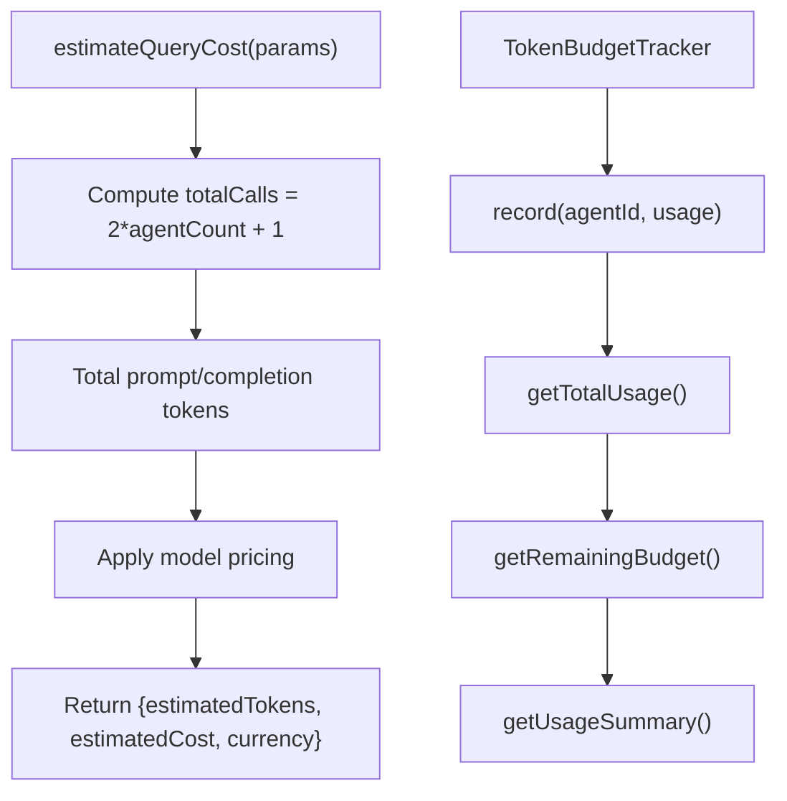

**Diagram sources**
- [estimator.ts:25-55](file://src/core/budget/estimator.ts#L25-L55)
- [tracker.ts:11-77](file://src/core/budget/tracker.ts#L11-L77)

**Section sources**
- [estimator.ts:25-55](file://src/core/budget/estimator.ts#L25-L55)
- [tracker.ts:3-77](file://src/core/budget/tracker.ts#L3-L77)

### Agent Execution and Reasoning Modes
- BaseAgent supports:
  - Single-path thinking with confidence extraction
  - Multi-branch reasoning (Tree-of-Thought)
  - Chain-of-Thought with stepwise confidence
  - Verification with structured parsing
  - Discussion with IACP message parsing

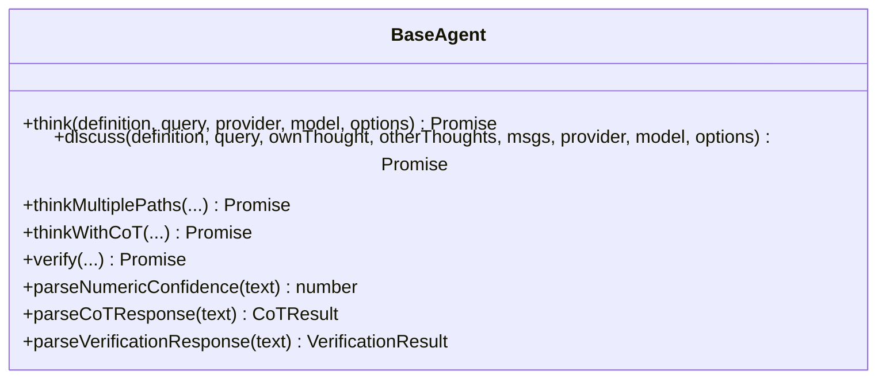

**Diagram sources**
- [base-agent.ts:6-31](file://src/core/agents/base-agent.ts#L6-L31)
- [base-agent.ts:206-258](file://src/core/agents/base-agent.ts#L206-L258)
- [base-agent.ts:262-300](file://src/core/agents/base-agent.ts#L262-L300)
- [base-agent.ts:304-342](file://src/core/agents/base-agent.ts#L304-L342)
- [base-agent.ts:346-427](file://src/core/agents/base-agent.ts#L346-L427)

**Section sources**
- [base-agent.ts:6-449](file://src/core/agents/base-agent.ts#L6-L449)

### UI Orchestration and Streaming
- The UI sends a request and streams events via SSE.
- The API constructs a leader and emits lifecycle events (analysis, selecting, thinking, discussion, synthesizing, complete/error).
- The UI store updates state and renders progress, reasoning graphs, and final response.

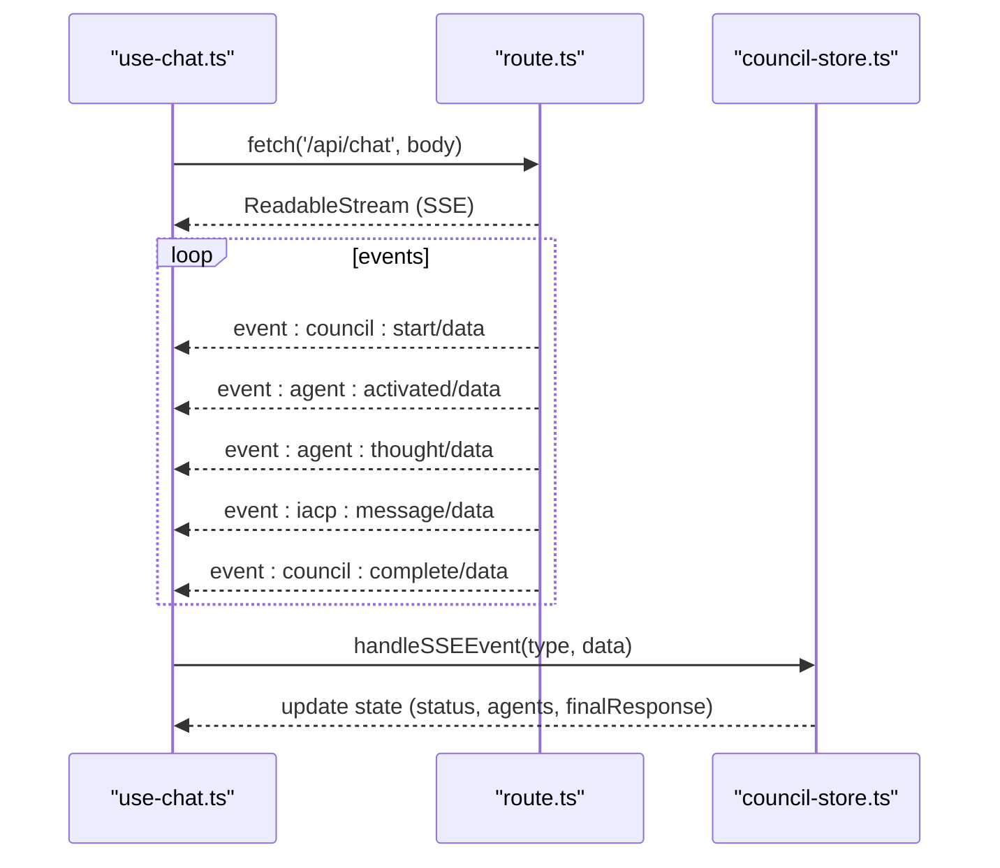

**Diagram sources**
- [use-chat.ts:48-126](file://src/hooks/use-chat.ts#L48-L126)
- [route.ts:150-211](file://src/app/api/chat/route.ts#L150-L211)
- [council-store.ts:54-171](file://src/stores/council-store.ts#L54-L171)

**Section sources**
- [use-chat.ts:48-126](file://src/hooks/use-chat.ts#L48-L126)
- [route.ts:150-211](file://src/app/api/chat/route.ts#L150-L211)
- [council-store.ts:54-171](file://src/stores/council-store.ts#L54-L171)

## Dependency Analysis
- Selector depends on:
  - AgentRegistry for domain-based lookup
  - Adjacency map for secondary domain expansion
  - Metrics tracker for performance and suppression
- Synthesizer depends on:
  - Consensus detection and weighting utilities
  - Provider for final LLM synthesis
- Concurrency Manager coordinates BaseAgent tasks
- IACPBus integrates with BaseAgent discussion parsing
- Budget estimator/tracker informs selection and runtime decisions

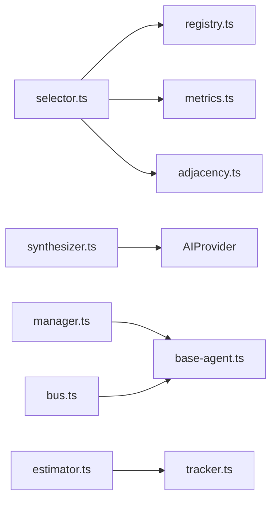

**Diagram sources**
- [selector.ts:27-164](file://src/core/council/selector.ts#L27-L164)
- [registry.ts:25-35](file://src/core/agents/registry.ts#L25-L35)
- [metrics.ts:72-132](file://src/lib/metrics.ts#L72-L132)
- [adjacency.ts:3-15](file://src/core/council/adjacency.ts#L3-L15)
- [synthesizer.ts:333-371](file://src/core/council/synthesizer.ts#L333-L371)
- [manager.ts:29-53](file://src/core/concurrency/manager.ts#L29-L53)
- [base-agent.ts:6-65](file://src/core/agents/base-agent.ts#L6-L65)
- [bus.ts:39-94](file://src/core/iacp/bus.ts#L39-L94)
- [estimator.ts:25-55](file://src/core/budget/estimator.ts#L25-L55)
- [tracker.ts:3-77](file://src/core/budget/tracker.ts#L3-L77)

**Section sources**
- [selector.ts:27-164](file://src/core/council/selector.ts#L27-L164)
- [synthesizer.ts:333-371](file://src/core/council/synthesizer.ts#L333-L371)
- [manager.ts:29-53](file://src/core/concurrency/manager.ts#L29-L53)
- [bus.ts:39-94](file://src/core/iacp/bus.ts#L39-L94)
- [estimator.ts:25-55](file://src/core/budget/estimator.ts#L25-L55)
- [tracker.ts:3-77](file://src/core/budget/tracker.ts#L3-L77)

## Performance Considerations
- Concurrency control prevents provider throttling and improves throughput.
- Domain adjacency expands coverage without over-selection.
- Performance-aware ranking prioritizes high-quality agents.
- Progressive synthesis reduces perceived latency by emitting early insights.
- Thought compression and grouping reduce synthesis prompt sizes.
- Budget estimation helps cap resource usage; tracker enforces limits.

[No sources needed since this section provides general guidance]

## Troubleshooting Guide
- Safety filtering: The API rejects queries matching jailbreak patterns and sanitizes input.
- Error propagation: API emits “council:error” events; UI displays error messages.
- Metrics failures: Selector falls back to default scores if metrics retrieval fails.
- Suppression: Low-performing agents may be suppressed automatically.
- IACP limits: Prevents message flooding per agent; urgent messages bypass limits.

**Section sources**
- [route.ts:56-82](file://src/app/api/chat/route.ts#L56-L82)
- [route.ts:198-207](file://src/app/api/chat/route.ts#L198-L207)
- [selector.ts:74-85](file://src/core/council/selector.ts#L74-L85)
- [metrics.ts:122-132](file://src/lib/metrics.ts#L122-L132)
- [bus.ts:40-46](file://src/core/iacp/bus.ts#L40-L46)

## Conclusion
The agent selection and coordination system combines rule-based query analysis, adjacency-aware agent selection, performance-driven ranking, parallel execution, and robust synthesis with consensus detection. Budget-aware estimation and tracking ensure efficient resource utilization, while IACP enables dynamic inter-agent collaboration. Progressive synthesis and UI streaming provide responsive user experiences, and comprehensive metrics support continuous improvement.

[No sources needed since this section summarizes without analyzing specific files]

## Appendices

### Example Scenarios and Workflows
- Simple query with one clear domain:
  - Query Intelligence: moderate complexity, 4 agents suggested.
  - Selector: primary from detected domain; no secondary needed.
  - Synthesis: consensus high, minimal disagreement.
- Complex multi-domain query:
  - Query Intelligence: complex, 12 agents suggested.
  - Selector: primary + secondary from adjacent domains; always-active included.
  - Synthesis: progressive yielding early insights, developing analysis, then complete.
- Fallback and suppression:
  - Selector filters suppressed agents and falls back to default performance scores if metrics fail.
- Budget-aware tuning:
  - Estimator suggests cost; tracker monitors usage; UI settings adjust concurrency and agent count.

**Section sources**
- [query-intelligence.ts:108-122](file://src/lib/query-intelligence.ts#L108-L122)
- [selector.ts:74-164](file://src/core/council/selector.ts#L74-L164)
- [synthesizer.ts:390-503](file://src/core/council/synthesizer.ts#L390-L503)
- [estimator.ts:25-55](file://src/core/budget/estimator.ts#L25-L55)
- [tracker.ts:3-77](file://src/core/budget/tracker.ts#L3-L77)

### UI Reasoning Visualization
- The reasoning graph displays agent branches, confidence bars, and verification outcomes, enabling transparency into multi-path reasoning and verification.

**Section sources**
- [reasoning-graph.tsx:90-225](file://src/components/council/reasoning-graph.tsx#L90-L225)