# Multi-Agent System

<cite>
**Referenced Files in This Document**
- [base-agent.ts](file://src/core/agents/base-agent.ts)
- [registry.ts](file://src/core/agents/registry.ts)
- [index.ts](file://src/core/agents/definitions/index.ts)
- [technology.ts](file://src/core/agents/definitions/technology.ts)
- [business.ts](file://src/core/agents/definitions/business.ts)
- [law.ts](file://src/core/agents/definitions/law.ts)
- [science.ts](file://src/core/agents/definitions/science.ts)
- [creativity.ts](file://src/core/agents/definitions/creativity.ts)
- [philosophy.ts](file://src/core/agents/definitions/philosophy.ts)
- [psychology.ts](file://src/core/agents/definitions/psychology.ts)
- [cross-domain.ts](file://src/core/agents/definitions/cross-domain.ts)
- [agent.ts](file://src/types/agent.ts)
- [selector.ts](file://src/core/council/selector.ts)
- [adjacency.ts](file://src/core/council/adjacency.ts)
- [synthesizer.ts](file://src/core/council/synthesizer.ts)
- [store.ts](file://src/core/memory/store.ts)
- [context-window.ts](file://src/core/memory/context-window.ts)
- [query-intelligence.ts](file://src/lib/query-intelligence.ts)
</cite>

## Table of Contents
1. [Introduction](#introduction)
2. [Project Structure](#project-structure)
3. [Core Components](#core-components)
4. [Architecture Overview](#architecture-overview)
5. [Detailed Component Analysis](#detailed-component-analysis)
6. [Dependency Analysis](#dependency-analysis)
7. [Performance Considerations](#performance-considerations)
8. [Troubleshooting Guide](#troubleshooting-guide)
9. [Conclusion](#conclusion)

## Introduction
This document describes the multi-agent system architecture that orchestrates a dynamic ecosystem of 70+ specialized agents across 10+ domains. It explains how agents are registered and discovered, how the base agent implementation provides shared capabilities, how domain-specific agents are defined, and how the agent selection algorithm analyzes queries, assesses complexity, and coordinates collaboration. It also documents the agent lifecycle from registration through execution to result synthesis, the communication patterns between agents, memory integration, and performance optimization strategies. Finally, it provides examples of agent interactions and their roles in the overall reasoning process.

## Project Structure
The multi-agent system is composed of:
- Agent registry and definitions: centralized discovery and domain-specific agent catalogs
- Base agent implementation: shared reasoning, discussion, verification, and parsing utilities
- Council components: selection, adjacency mapping, and synthesis
- Memory subsystem: short-term and persistent storage with context window management
- Query intelligence: pre-processing, ambiguity detection, and complexity estimation
- Types: shared interfaces for agents, thoughts, and council operations

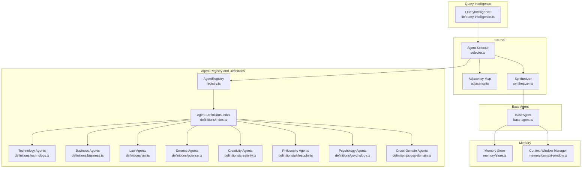

**Diagram sources**
- [registry.ts:1-58](file://src/core/agents/registry.ts#L1-L58)
- [index.ts:1-38](file://src/core/agents/definitions/index.ts#L1-L38)
- [technology.ts:1-296](file://src/core/agents/definitions/technology.ts#L1-L296)
- [business.ts:1-102](file://src/core/agents/definitions/business.ts#L1-L102)
- [law.ts:1-41](file://src/core/agents/definitions/law.ts#L1-L41)
- [science.ts:1-55](file://src/core/agents/definitions/science.ts#L1-L55)
- [creativity.ts:1-86](file://src/core/agents/definitions/creativity.ts#L1-L86)
- [philosophy.ts:1-79](file://src/core/agents/definitions/philosophy.ts#L1-L79)
- [psychology.ts:1-79](file://src/core/agents/definitions/psychology.ts#L1-L79)
- [cross-domain.ts:1-69](file://src/core/agents/definitions/cross-domain.ts#L1-L69)
- [base-agent.ts:1-448](file://src/core/agents/base-agent.ts#L1-L448)
- [selector.ts:1-169](file://src/core/council/selector.ts#L1-L169)
- [adjacency.ts:1-16](file://src/core/council/adjacency.ts#L1-L16)
- [synthesizer.ts:1-591](file://src/core/council/synthesizer.ts#L1-L591)
- [store.ts:1-254](file://src/core/memory/store.ts#L1-L254)
- [context-window.ts:1-112](file://src/core/memory/context-window.ts#L1-L112)
- [query-intelligence.ts:1-240](file://src/lib/query-intelligence.ts#L1-L240)

**Section sources**
- [registry.ts:1-58](file://src/core/agents/registry.ts#L1-L58)
- [index.ts:1-38](file://src/core/agents/definitions/index.ts#L1-L38)
- [base-agent.ts:1-448](file://src/core/agents/base-agent.ts#L1-L448)
- [selector.ts:1-169](file://src/core/council/selector.ts#L1-L169)
- [synthesizer.ts:1-591](file://src/core/council/synthesizer.ts#L1-L591)
- [store.ts:1-254](file://src/core/memory/store.ts#L1-L254)
- [context-window.ts:1-112](file://src/core/memory/context-window.ts#L1-L112)
- [query-intelligence.ts:1-240](file://src/lib/query-intelligence.ts#L1-L240)

## Core Components
- Agent registry and definitions: central catalog of agents grouped by domain, enabling discovery and filtering by domain, expertise, and subdomain.
- Base agent: provides shared reasoning modes (single-path, tree-of-thought, chain-of-thought), verification, parsing utilities, and memory integration.
- Selection and synthesis: detects query complexity and domains, selects primary and secondary agents, and synthesizes weighted, consensus-driven results.
- Memory and context: stores agent insights, retrieves relevant memories, and injects contextual information into prompts.
- Query intelligence: performs fast, rule-based analysis to estimate complexity, detect topics, and suggest clarifications.

**Section sources**
- [registry.ts:1-58](file://src/core/agents/registry.ts#L1-L58)
- [index.ts:1-38](file://src/core/agents/definitions/index.ts#L1-L38)
- [base-agent.ts:1-448](file://src/core/agents/base-agent.ts#L1-L448)
- [selector.ts:1-169](file://src/core/council/selector.ts#L1-L169)
- [synthesizer.ts:1-591](file://src/core/council/synthesizer.ts#L1-L591)
- [store.ts:1-254](file://src/core/memory/store.ts#L1-L254)
- [context-window.ts:1-112](file://src/core/memory/context-window.ts#L1-L112)
- [query-intelligence.ts:1-240](file://src/lib/query-intelligence.ts#L1-L240)

## Architecture Overview
The system orchestrates agents through a council workflow:
- Query intelligence analyzes the input to estimate complexity and detected domains.
- The selector chooses agents: always-active agents plus primary agents from detected domains and secondary agents from adjacent domains, weighted by performance scores.
- Agents execute reasoning tasks using the base agent’s shared capabilities (thinking, discussion, verification).
- The synthesizer aggregates agent thoughts, computes weights, detects consensus/disagreement, and produces a unified response.
- Memory integrates across the lifecycle to inform future reasoning and maintain continuity.

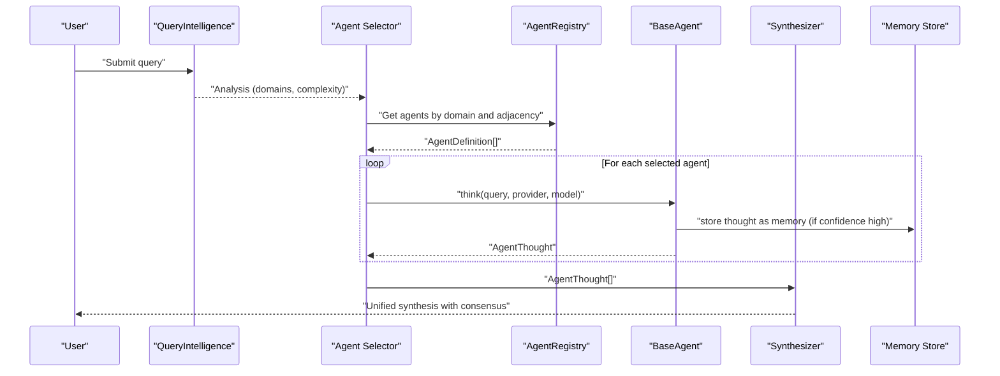

**Diagram sources**
- [query-intelligence.ts:1-240](file://src/lib/query-intelligence.ts#L1-L240)
- [selector.ts:1-169](file://src/core/council/selector.ts#L1-L169)
- [registry.ts:1-58](file://src/core/agents/registry.ts#L1-L58)
- [base-agent.ts:1-448](file://src/core/agents/base-agent.ts#L1-L448)
- [synthesizer.ts:1-591](file://src/core/council/synthesizer.ts#L1-L591)
- [store.ts:1-254](file://src/core/memory/store.ts#L1-L254)

## Detailed Component Analysis

### Agent Registry and Dynamic Management
The registry maintains:
- An in-memory map of all agents by ID
- A domain-indexed list of agents
- Always-active agents (e.g., fact checker, devil’s advocate, critical thinking)
- Search by name, description, expertise, or subdomain
- Domain enumeration and counts

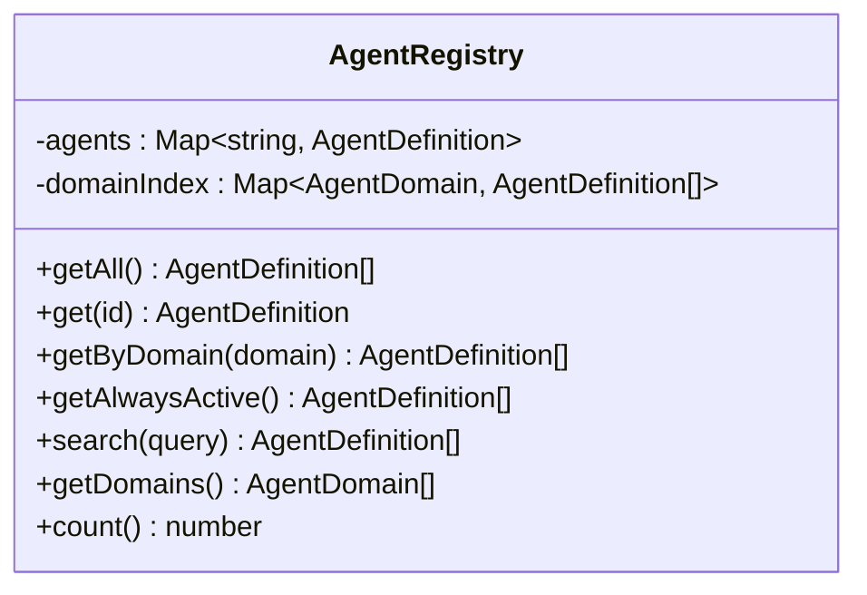

**Diagram sources**
- [registry.ts:1-58](file://src/core/agents/registry.ts#L1-L58)

**Section sources**
- [registry.ts:1-58](file://src/core/agents/registry.ts#L1-L58)
- [index.ts:1-38](file://src/core/agents/definitions/index.ts#L1-L38)

### Base Agent Implementation
The base agent provides:
- Thinking: single-path reasoning with optional memory context
- Discussion: multi-agent debate with IACP message parsing
- Tree-of-thought and Chain-of-thought reasoning with confidence extraction
- Verification: structured claim validation with scoring and suggestions
- Memory integration: storing high-confidence thoughts and building context windows
- Parsing helpers: extracting numeric confidence, CoT steps, and verification results

```mermaid
classDiagram
class BaseAgent {
+think(definition, query, provider, model, options) Promise~{thought, confidence}~
+discuss(definition, query, ownThought, otherThoughts, incomingMessages, provider, model, options) Promise~{response, iacpMessages}~
+thinkMultiplePaths(definition, query, systemPrompt, provider, model, options) Promise~ReasoningBranch[]~
+thinkWithCoT(definition, query, systemPrompt, provider, model, options) Promise~CoTResult~
+verify(definition, claim, evidence, provider, model, options) Promise~VerificationResult~
-parseNumericConfidence(text) number
-parseCoTResponse(text) CoTResult
-parseVerificationResponse(text) VerificationResult
-storeThoughtAsMemory(definition, query, thought, confidence) Promise~void~
}
```

**Diagram sources**
- [base-agent.ts:1-448](file://src/core/agents/base-agent.ts#L1-L448)

**Section sources**
- [base-agent.ts:1-448](file://src/core/agents/base-agent.ts#L1-L448)

### Domain-Specific Agent Definitions
Agents are defined per domain with:
- Unique identifiers and names
- Domain, subdomain, and expertise keywords
- System prompts built via a shared prompt builder
- Adjacent domains for cross-domain collaboration
- Icons and colors for UI representation

Representative domains include:
- Technology: software architecture, frontend/backend, DevOps, cybersecurity, AI/ML, data engineering, mobile, databases, performance
- Business: strategy, project/product management, marketing, finance, entrepreneurship, HR, operations
- Law: general law, IP, privacy/data, contracts, compliance
- Science: research methodology, statistics, mathematics, physics/engineering, biology/medicine, environmental science, chemistry
- Creativity and Education: UI/UX, graphic design, creative writing, branding, video/media, game design, pedagogy, e-learning, assessment, academic writing, career development
- Philosophy and Communication: logic, ethics, critical thinking, philosophy of science, decision theory, general communication, Arabic/English, technical writing, PR
- Psychology and Economics: cognitive/social/UX psychology, motivation/productivity, macro/microeconomics, investment analysis, cryptocurrency/blockchain, risk management
- Cross-domain: systems thinking, innovation, futurism, QA, documentation, accessibility, internationalization, fact checking, devil’s advocate

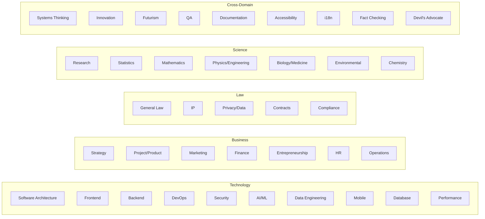

**Diagram sources**
- [technology.ts:1-296](file://src/core/agents/definitions/technology.ts#L1-L296)
- [business.ts:1-102](file://src/core/agents/definitions/business.ts#L1-L102)
- [law.ts:1-41](file://src/core/agents/definitions/law.ts#L1-L41)
- [science.ts:1-55](file://src/core/agents/definitions/science.ts#L1-L55)
- [cross-domain.ts:1-69](file://src/core/agents/definitions/cross-domain.ts#L1-L69)

**Section sources**
- [technology.ts:1-296](file://src/core/agents/definitions/technology.ts#L1-L296)
- [business.ts:1-102](file://src/core/agents/definitions/business.ts#L1-L102)
- [law.ts:1-41](file://src/core/agents/definitions/law.ts#L1-L41)
- [science.ts:1-55](file://src/core/agents/definitions/science.ts#L1-L55)
- [creativity.ts:1-86](file://src/core/agents/definitions/creativity.ts#L1-L86)
- [philosophy.ts:1-79](file://src/core/agents/definitions/philosophy.ts#L1-L79)
- [psychology.ts:1-79](file://src/core/agents/definitions/psychology.ts#L1-L79)
- [cross-domain.ts:1-69](file://src/core/agents/definitions/cross-domain.ts#L1-L69)

### Agent Selection Algorithm
The selector:
- Identifies always-active agents
- Selects primary agents from detected domains
- Adds secondary agents from adjacent domains (using adjacency map)
- Filters suppressed agents and ranks by domain relevance × performance score
- Allocates slots to always-active and selected agents
- Returns confidence per agent (clamped to [0,1])

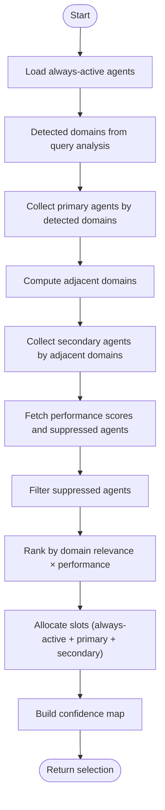

**Diagram sources**
- [selector.ts:1-169](file://src/core/council/selector.ts#L1-L169)
- [adjacency.ts:1-16](file://src/core/council/adjacency.ts#L1-L16)

**Section sources**
- [selector.ts:1-169](file://src/core/council/selector.ts#L1-L169)
- [adjacency.ts:1-16](file://src/core/council/adjacency.ts#L1-L16)

### Agent Lifecycle Management
Lifecycle stages:
- Registration: agents defined centrally and indexed by registry
- Discovery: selector queries registry by domain and adjacency
- Execution: agents think, optionally discuss, and produce thoughts
- Collaboration: agents exchange IACP messages during discussion phase
- Synthesis: synthesizer aggregates, weights, and composes final response
- Memory: high-quality thoughts are stored and reused via context window

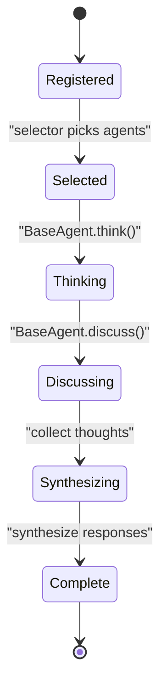

**Diagram sources**
- [base-agent.ts:1-448](file://src/core/agents/base-agent.ts#L1-L448)
- [selector.ts:1-169](file://src/core/council/selector.ts#L1-L169)
- [synthesizer.ts:1-591](file://src/core/council/synthesizer.ts#L1-L591)

**Section sources**
- [base-agent.ts:1-448](file://src/core/agents/base-agent.ts#L1-L448)
- [synthesizer.ts:1-591](file://src/core/council/synthesizer.ts#L1-L591)

### Agent Communication Patterns and IACP
During discussion, agents can exchange inter-agent communication protocol (IACP) messages:
- Responses include a structured IACP block containing target agent, message type, and content
- The base agent parses IACP JSON and emits typed messages
- These messages propagate through the council for targeted collaboration

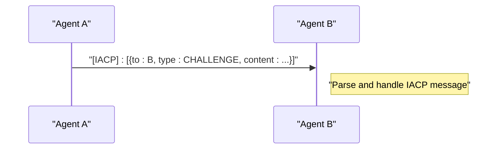

**Diagram sources**
- [base-agent.ts:152-185](file://src/core/agents/base-agent.ts#L152-L185)

**Section sources**
- [base-agent.ts:152-185](file://src/core/agents/base-agent.ts#L152-L185)

### Memory Integration and Context Windows
Memory subsystem:
- Stores agent memories (responses, patterns, few-shot examples, insights) with scores and usage counts
- Retrieves relevant memories by agent, domain, and query hash
- Builds context windows with prioritized few-shot examples and recent insights
- Integrates memory into agent prompts to improve reasoning continuity

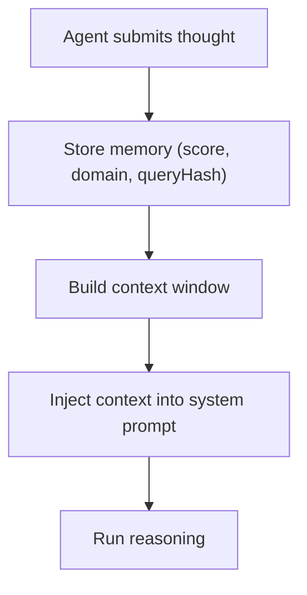

**Diagram sources**
- [store.ts:1-254](file://src/core/memory/store.ts#L1-L254)
- [context-window.ts:1-112](file://src/core/memory/context-window.ts#L1-L112)
- [base-agent.ts:74-98](file://src/core/agents/base-agent.ts#L74-L98)

**Section sources**
- [store.ts:1-254](file://src/core/memory/store.ts#L1-L254)
- [context-window.ts:1-112](file://src/core/memory/context-window.ts#L1-L112)
- [base-agent.ts:74-98](file://src/core/agents/base-agent.ts#L74-L98)

### Query Intelligence and Preprocessing
Query intelligence:
- Detects ambiguity (short queries, vague pronouns, missing question structure)
- Identifies topics and estimated complexity
- Suggests clarifications and similar historical queries
- Provides estimated agent count for selection sizing

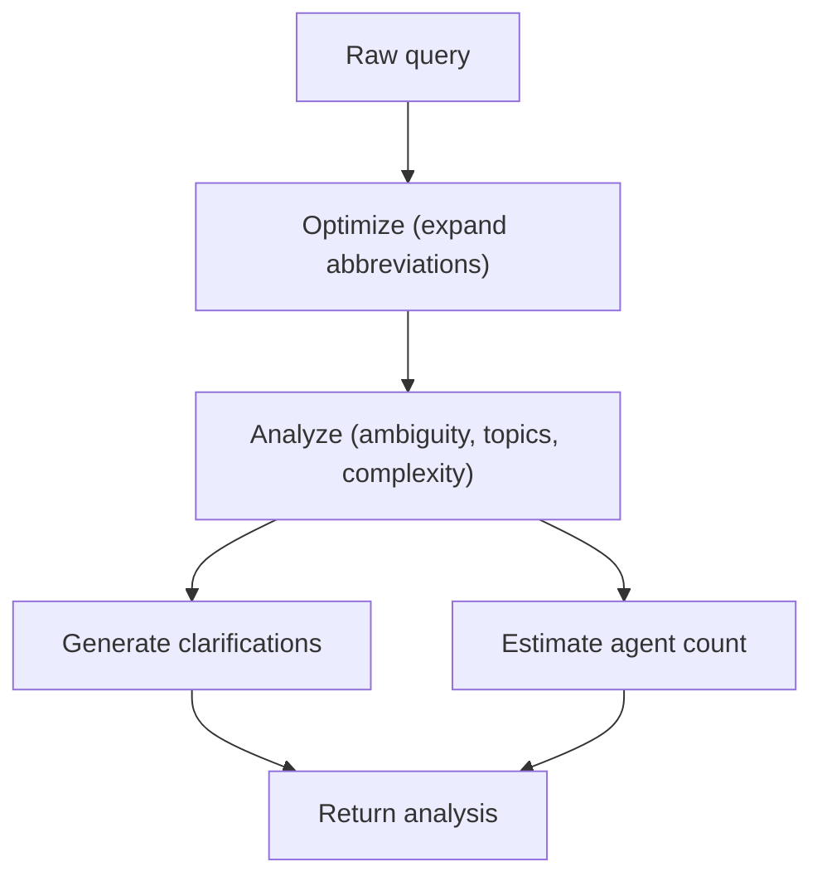

**Diagram sources**
- [query-intelligence.ts:1-240](file://src/lib/query-intelligence.ts#L1-L240)

**Section sources**
- [query-intelligence.ts:1-240](file://src/lib/query-intelligence.ts#L1-L240)

### Synthesis and Consensus Detection
Synthesizer:
- Computes weighted thoughts (confidence × domain relevance)
- Detects consensus and disagreement points across agent thoughts
- Produces progressive synthesis updates as more thoughts arrive
- Generates a final, unified response emphasizing consensus and noting minority views

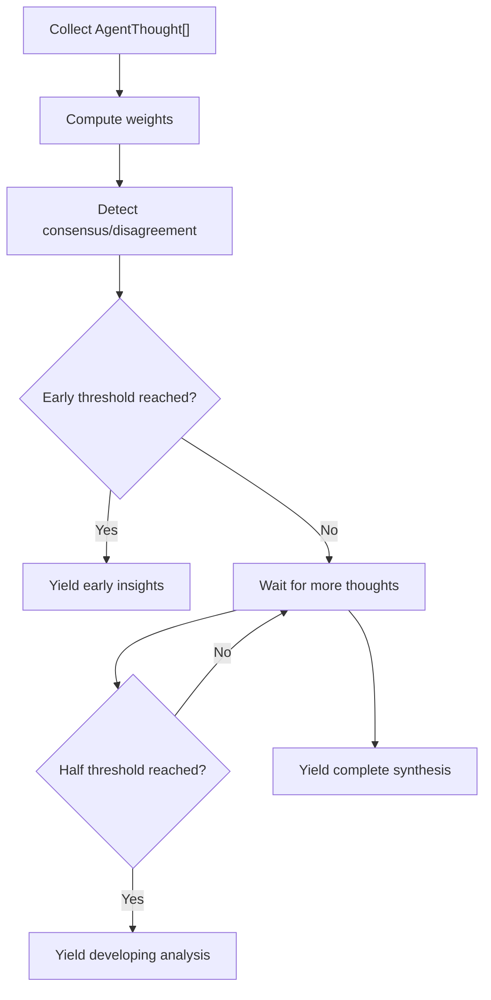

**Diagram sources**
- [synthesizer.ts:390-503](file://src/core/council/synthesizer.ts#L390-L503)

**Section sources**
- [synthesizer.ts:1-591](file://src/core/council/synthesizer.ts#L1-L591)

## Dependency Analysis
Key dependencies:
- Selector depends on registry, adjacency map, and metrics/tracker
- Base agent depends on memory store and context window
- Synthesizer depends on agent thought types and provider
- Query intelligence is standalone and feeds selector
- Agent definitions depend on a shared prompt builder and types

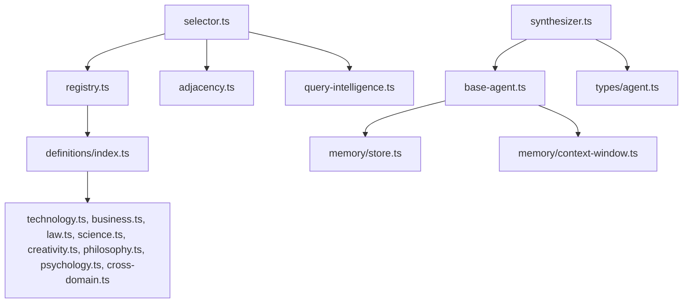

**Diagram sources**
- [selector.ts:1-169](file://src/core/council/selector.ts#L1-L169)
- [registry.ts:1-58](file://src/core/agents/registry.ts#L1-L58)
- [adjacency.ts:1-16](file://src/core/council/adjacency.ts#L1-L16)
- [query-intelligence.ts:1-240](file://src/lib/query-intelligence.ts#L1-L240)
- [base-agent.ts:1-448](file://src/core/agents/base-agent.ts#L1-L448)
- [store.ts:1-254](file://src/core/memory/store.ts#L1-L254)
- [context-window.ts:1-112](file://src/core/memory/context-window.ts#L1-L112)
- [synthesizer.ts:1-591](file://src/core/council/synthesizer.ts#L1-L591)
- [index.ts:1-38](file://src/core/agents/definitions/index.ts#L1-L38)
- [technology.ts:1-296](file://src/core/agents/definitions/technology.ts#L1-L296)
- [business.ts:1-102](file://src/core/agents/definitions/business.ts#L1-L102)
- [law.ts:1-41](file://src/core/agents/definitions/law.ts#L1-L41)
- [science.ts:1-55](file://src/core/agents/definitions/science.ts#L1-L55)
- [creativity.ts:1-86](file://src/core/agents/definitions/creativity.ts#L1-L86)
- [philosophy.ts:1-79](file://src/core/agents/definitions/philosophy.ts#L1-L79)
- [psychology.ts:1-79](file://src/core/agents/definitions/psychology.ts#L1-L79)
- [cross-domain.ts:1-69](file://src/core/agents/definitions/cross-domain.ts#L1-L69)

**Section sources**
- [selector.ts:1-169](file://src/core/council/selector.ts#L1-L169)
- [registry.ts:1-58](file://src/core/agents/registry.ts#L1-L58)
- [adjacency.ts:1-16](file://src/core/council/adjacency.ts#L1-L16)
- [query-intelligence.ts:1-240](file://src/lib/query-intelligence.ts#L1-L240)
- [base-agent.ts:1-448](file://src/core/agents/base-agent.ts#L1-L448)
- [synthesizer.ts:1-591](file://src/core/council/synthesizer.ts#L1-L591)
- [index.ts:1-38](file://src/core/agents/definitions/index.ts#L1-L38)

## Performance Considerations
- Parallel execution: selector and base agent methods can be invoked concurrently for multiple agents
- Memory caching: short-term in-memory storage reduces latency; asynchronous persistence avoids blocking
- Token budgeting: context window truncation and thought compression keep prompts within limits
- Confidence gating: only high-confidence thoughts are persisted to memory to reduce noise
- Progressive synthesis: early and developing phases provide faster feedback while collecting more thoughts
- Adjacency-based selection: limits search space to relevant domains and adjacent domains

[No sources needed since this section provides general guidance]

## Troubleshooting Guide
Common issues and mitigations:
- Memory unavailability: context window falls back to empty; base agent continues without memory context
- DB failures: memory store persists asynchronously and swallows errors; short-term storage remains intact
- Selector metrics unavailable: defaults are used for performance scores and suppression checks
- IACP parsing failures: malformed IACP blocks are ignored without affecting the agent’s response
- Low-confidence thoughts: not persisted to memory; consider adjusting confidence thresholds or prompting strategies

**Section sources**
- [base-agent.ts:46-57](file://src/core/agents/base-agent.ts#L46-L57)
- [base-agent.ts:176-179](file://src/core/agents/base-agent.ts#L176-L179)
- [store.ts:35-39](file://src/core/memory/store.ts#L35-L39)
- [store.ts:78-80](file://src/core/memory/store.ts#L78-L80)
- [selector.ts:81-85](file://src/core/council/selector.ts#L81-L85)

## Conclusion
The multi-agent system combines a robust registry and domain-specific agent definitions with a powerful base agent that supports diverse reasoning modes and memory integration. The selector leverages domain adjacency and performance metrics to assemble a balanced council, while the synthesizer transforms fragmented insights into a cohesive, consensus-driven response. Together, these components enable scalable, cross-domain collaboration and continuous learning through memory.