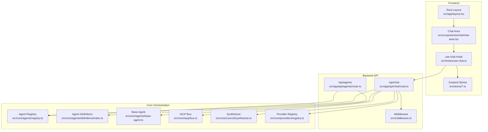
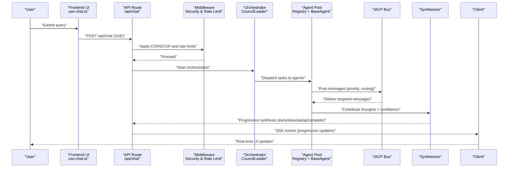
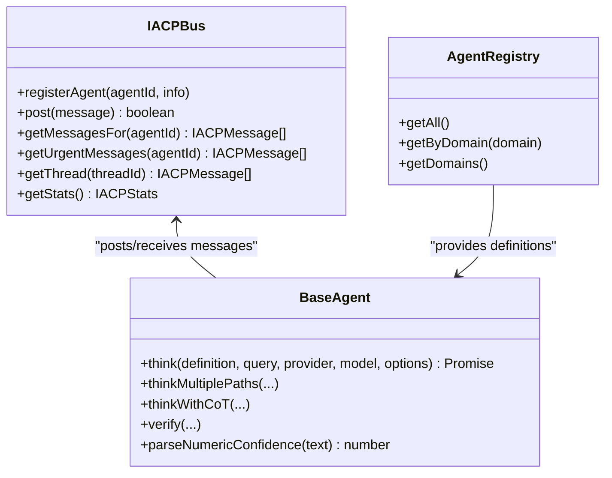
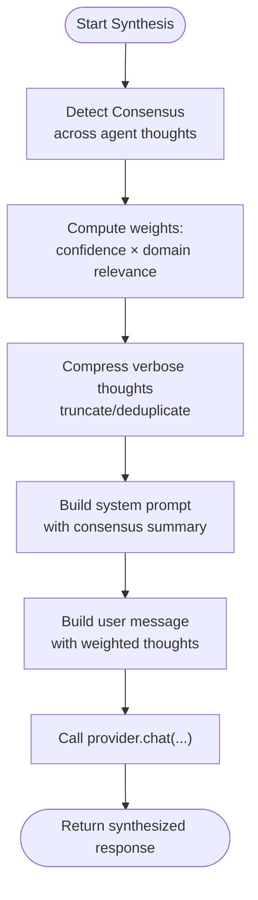
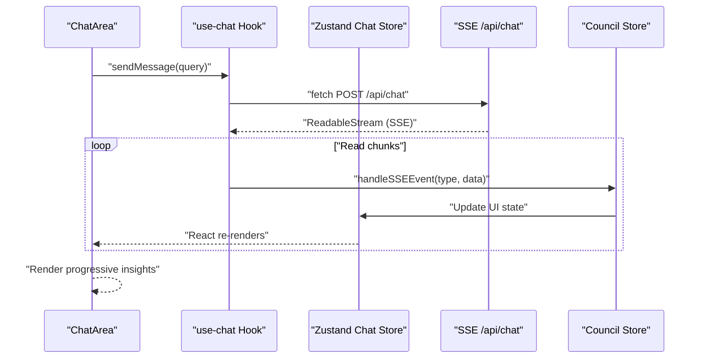
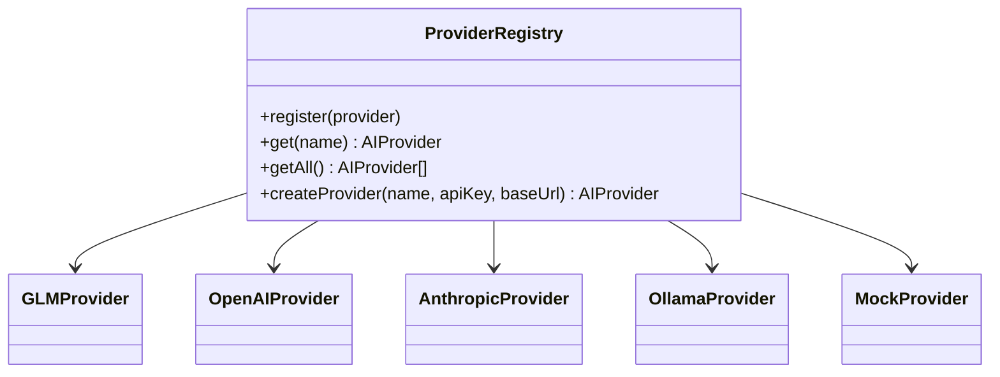
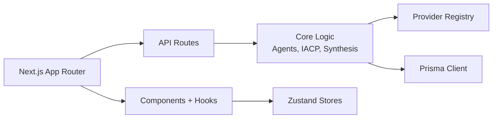

# Project Overview

<cite>
**Referenced Files in This Document**
- [README.md](file://README.md)
- [package.json](file://package.json)
- [src/middleware.ts](file://src/middleware.ts)
- [src/app/layout.tsx](file://src/app/layout.tsx)
- [src/types/index.ts](file://src/types/index.ts)
- [src/types/agent.ts](file://src/types/agent.ts)
- [src/core/agents/base-agent.ts](file://src/core/agents/base-agent.ts)
- [src/core/agents/definitions/index.ts](file://src/core/agents/definitions/index.ts)
- [src/core/agents/registry.ts](file://src/core/agents/registry.ts)
- [src/core/iacp/bus.ts](file://src/core/iacp/bus.ts)
- [src/core/council/synthesizer.ts](file://src/core/council/synthesizer.ts)
- [src/core/providers/registry.ts](file://src/core/providers/registry.ts)
- [src/stores/chat-store.ts](file://src/stores/chat-store.ts)
- [src/hooks/use-chat.ts](file://src/hooks/use-chat.ts)
- [src/components/chat/chat-area.tsx](file://src/components/chat/chat-area.tsx)
- [src/app/api/chat/route.ts](file://src/app/api/chat/route.ts)
- [src/app/api/agents/route.ts](file://src/app/api/agents/route.ts)
</cite>

## Table of Contents
1. [Introduction](#introduction)
2. [Project Structure](#project-structure)
3. [Core Components](#core-components)
4. [Architecture Overview](#architecture-overview)
5. [Detailed Component Analysis](#detailed-component-analysis)
6. [Dependency Analysis](#dependency-analysis)
7. [Performance Considerations](#performance-considerations)
8. [Troubleshooting Guide](#troubleshooting-guide)
9. [Conclusion](#conclusion)

## Introduction
Deep Thinking AI is a multi-agent AI system designed to orchestrate up to 70 specialized AI agents across 10+ domains. It moves beyond traditional chat applications by enabling collaborative reasoning, inter-agent communication, and structured synthesis with confidence scoring. The system emphasizes transparency and depth: agents discuss among themselves, reach consensus or highlight disagreement, and produce a unified, weighted synthesis. Real-time streaming delivers early insights, evolving analysis, and the final comprehensive response.

Key value propositions:
- Collaborative reasoning: Multiple agents analyze queries from distinct domains and debate perspectives.
- Inter-Agent Communication Protocol (IACP): A structured messaging bus enables targeted, prioritized, and threaded communication.
- Tree-of-thought and Chain-of-Thought reasoning: Agents employ branching and stepwise logic with confidence estimation.
- Real-time streaming: Users receive progressive insights as agents contribute, improving perceived responsiveness.
- Transparency: The system surfaces consensus/disagreement, confidence levels, and agent contributions.

Target use cases:
- Strategic decision-making requiring multi-perspective analysis
- Risk and compliance assessments across legal, ethical, and technical domains
- Research synthesis and idea generation with structured evaluation
- Enterprise knowledge work that benefits from expert-council-style deliberation

## Project Structure
The project follows a modern Next.js 16.2.3 App Router architecture with a clear separation of concerns:
- Frontend pages and components under src/app and src/components
- Core orchestration logic under src/core
- State management with Zustand stores under src/stores
- API routes under src/app/api
- Shared types under src/types
- Middleware for security and rate limiting under src/middleware.ts

**Diagram sources**
- [src/app/layout.tsx:1-28](file://src/app/layout.tsx#L1-L28)
- [src/components/chat/chat-area.tsx:1-332](file://src/components/chat/chat-area.tsx#L1-L332)
- [src/hooks/use-chat.ts:1-158](file://src/hooks/use-chat.ts#L1-L158)
- [src/stores/chat-store.ts:1-132](file://src/stores/chat-store.ts#L1-L132)
- [src/app/api/chat/route.ts:1-200](file://src/app/api/chat/route.ts#L1-L200)
- [src/app/api/agents/route.ts:1-25](file://src/app/api/agents/route.ts#L1-L25)
- [src/middleware.ts:1-217](file://src/middleware.ts#L1-L217)
- [src/core/agents/registry.ts](file://src/core/agents/registry.ts)
- [src/core/agents/definitions/index.ts](file://src/core/agents/definitions/index.ts)
- [src/core/agents/base-agent.ts:1-448](file://src/core/agents/base-agent.ts#L1-L448)
- [src/core/iacp/bus.ts:1-210](file://src/core/iacp/bus.ts#L1-L210)
- [src/core/council/synthesizer.ts:1-591](file://src/core/council/synthesizer.ts#L1-L591)
- [src/core/providers/registry.ts:1-83](file://src/core/providers/registry.ts#L1-L83)

**Section sources**
- [README.md:1-37](file://README.md#L1-L37)
- [package.json:1-60](file://package.json#L1-L60)
- [src/app/layout.tsx:1-28](file://src/app/layout.tsx#L1-L28)

## Core Components
- Multi-agent orchestration: Agents are defined with roles, domains, and expertise. The system selects and coordinates agents per query, enabling diverse perspectives and deep reasoning.
- Inter-Agent Communication Protocol (IACP): A message bus supports directed and broadcast messages, threading, priority ordering, and routing hints by domain or expertise.
- Reasoning engines: Agents implement tree-of-thought and chain-of-thought reasoning, returning structured thoughts with confidence scores.
- Synthesis and consensus: The synthesizer weights agent thoughts by confidence and domain relevance, detects consensus and disagreement, and produces a unified response.
- Streaming delivery: The API streams progressive insights as agents complete, allowing users to see early and developing analyses.
- Frontend state and UX: Zustand manages chat/session state; the UI renders progressive updates, token usage, and contextual banners for clarification and caching.

**Section sources**
- [src/core/agents/registry.ts](file://src/core/agents/registry.ts)
- [src/core/agents/definitions/index.ts](file://src/core/agents/definitions/index.ts)
- [src/core/agents/base-agent.ts:1-448](file://src/core/agents/base-agent.ts#L1-L448)
- [src/core/iacp/bus.ts:1-210](file://src/core/iacp/bus.ts#L1-L210)
- [src/core/council/synthesizer.ts:1-591](file://src/core/council/synthesizer.ts#L1-L591)
- [src/stores/chat-store.ts:1-132](file://src/stores/chat-store.ts#L1-L132)
- [src/components/chat/chat-area.tsx:1-332](file://src/components/chat/chat-area.tsx#L1-L332)

## Architecture Overview
The system integrates frontend, backend, and orchestration layers to deliver a responsive, transparent multi-agent experience.

**Diagram sources**
- [src/hooks/use-chat.ts:1-158](file://src/hooks/use-chat.ts#L1-L158)
- [src/app/api/chat/route.ts:1-200](file://src/app/api/chat/route.ts#L1-L200)
- [src/middleware.ts:1-217](file://src/middleware.ts#L1-L217)
- [src/core/agents/registry.ts](file://src/core/agents/registry.ts)
- [src/core/agents/base-agent.ts:1-448](file://src/core/agents/base-agent.ts#L1-L448)
- [src/core/iacp/bus.ts:1-210](file://src/core/iacp/bus.ts#L1-L210)
- [src/core/council/synthesizer.ts:1-591](file://src/core/council/synthesizer.ts#L1-L591)

## Detailed Component Analysis

### Multi-Agent Orchestration and IACP
The orchestration layer composes agents, coordinates their reasoning, and streams synthesis results. IACP governs inter-agent messaging with priority, routing hints, and threading.

**Diagram sources**
- [src/core/iacp/bus.ts:1-210](file://src/core/iacp/bus.ts#L1-L210)
- [src/core/agents/base-agent.ts:1-448](file://src/core/agents/base-agent.ts#L1-L448)
- [src/core/agents/registry.ts](file://src/core/agents/registry.ts)

**Section sources**
- [src/core/iacp/bus.ts:1-210](file://src/core/iacp/bus.ts#L1-L210)
- [src/core/agents/base-agent.ts:1-448](file://src/core/agents/base-agent.ts#L1-L448)
- [src/core/agents/registry.ts](file://src/core/agents/registry.ts)

### Synthesis and Consensus
The synthesizer computes weighted thoughts, detects consensus/disagreement, and builds prompts for the final synthesis.

**Diagram sources**
- [src/core/council/synthesizer.ts:1-591](file://src/core/council/synthesizer.ts#L1-L591)

**Section sources**
- [src/core/council/synthesizer.ts:1-591](file://src/core/council/synthesizer.ts#L1-L591)

### Frontend Streaming and State Management
The frontend uses Zustand for chat/session state and a custom hook to consume SSE events from the backend, updating the UI progressively.

**Diagram sources**
- [src/components/chat/chat-area.tsx:1-332](file://src/components/chat/chat-area.tsx#L1-L332)
- [src/hooks/use-chat.ts:1-158](file://src/hooks/use-chat.ts#L1-L158)
- [src/stores/chat-store.ts:1-132](file://src/stores/chat-store.ts#L1-L132)
- [src/app/api/chat/route.ts:1-200](file://src/app/api/chat/route.ts#L1-L200)

**Section sources**
- [src/components/chat/chat-area.tsx:1-332](file://src/components/chat/chat-area.tsx#L1-L332)
- [src/hooks/use-chat.ts:1-158](file://src/hooks/use-chat.ts#L1-L158)
- [src/stores/chat-store.ts:1-132](file://src/stores/chat-store.ts#L1-L132)

### Providers and Routing
The provider registry dynamically registers providers based on environment variables and resolves keys server-side for security.

**Diagram sources**
- [src/core/providers/registry.ts:1-83](file://src/core/providers/registry.ts#L1-L83)

**Section sources**
- [src/core/providers/registry.ts:1-83](file://src/core/providers/registry.ts#L1-L83)
- [src/app/api/chat/route.ts:68-79](file://src/app/api/chat/route.ts#L68-L79)

## Dependency Analysis
Technology stack highlights:
- Next.js 16.2.3 with App Router for scalable frontend/backend integration
- TypeScript for type safety across frontend, backend, and core logic
- Zustand for lightweight, scalable state management
- Prisma client for database interactions (schema present)
- Radix UI primitives and Tailwind for UI components

**Diagram sources**
- [package.json:13-40](file://package.json#L13-L40)
- [src/app/api/chat/route.ts:1-200](file://src/app/api/chat/route.ts#L1-L200)
- [src/core/providers/registry.ts:1-83](file://src/core/providers/registry.ts#L1-L83)
- [src/stores/chat-store.ts:1-132](file://src/stores/chat-store.ts#L1-L132)

**Section sources**
- [package.json:13-40](file://package.json#L13-L40)
- [src/app/layout.tsx:1-28](file://src/app/layout.tsx#L1-L28)

## Performance Considerations
- Concurrency control: The system limits concurrent agent invocations to balance throughput and cost.
- Streaming: Progressive synthesis reduces perceived latency by delivering early insights.
- Memory and context: Agents leverage context windows and memory to avoid redundant processing.
- Rate limiting and security: Middleware enforces rate limits and CSP headers to protect the service.
- Scalability levers: Horizontal scaling of the API layer, sharding agent pools, and offloading synthesis to higher-capacity models.

[No sources needed since this section provides general guidance]

## Troubleshooting Guide
Common issues and mitigations:
- Safety filtering: Queries flagged by prompt-injection patterns are rejected; rephrase and retry.
- Rate limiting: Excessive requests receive 429 responses; wait for the reset window.
- SSE connectivity: Ensure client supports ReadableStream and SSE; network interruptions can cancel the stream.
- Provider configuration: Verify environment variables for provider keys; server-side resolution prevents client misuse.
- Session persistence: Saving sessions is best-effort; failures are logged and do not block the UI.

**Section sources**
- [src/app/api/chat/route.ts:130-135](file://src/app/api/chat/route.ts#L130-L135)
- [src/middleware.ts:184-199](file://src/middleware.ts#L184-L199)
- [src/hooks/use-chat.ts:113-125](file://src/hooks/use-chat.ts#L113-L125)
- [src/stores/chat-store.ts:126-130](file://src/stores/chat-store.ts#L126-L130)

## Conclusion
Deep Thinking AI transforms conversational AI into a collaborative, transparent, and scalable multi-agent system. By combining structured reasoning, inter-agent communication, and real-time streaming, it delivers deeper insights than conventional chat experiences. Its modular architecture, robust middleware, and provider-agnostic design enable seamless integration and growth across diverse domains and workloads.

[No sources needed since this section summarizes without analyzing specific files]