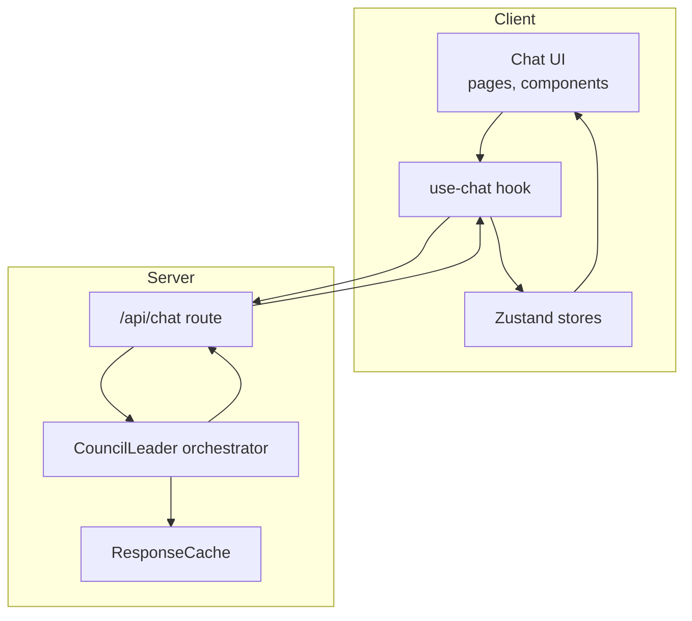
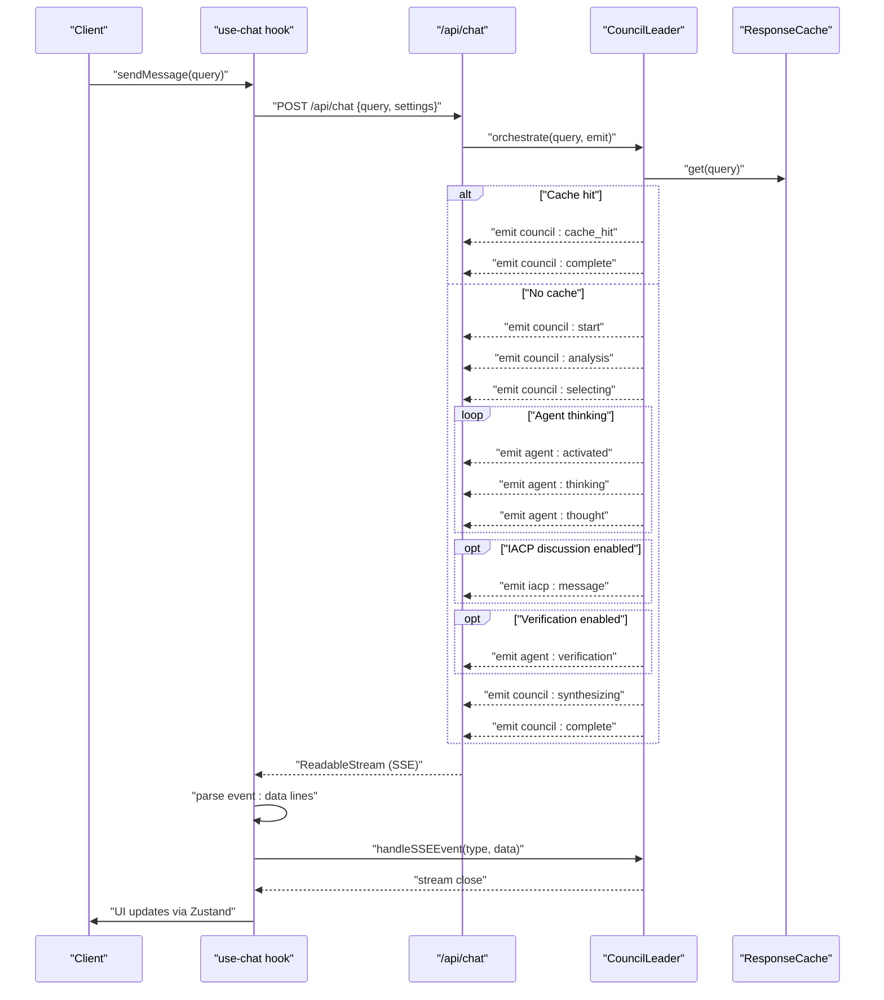
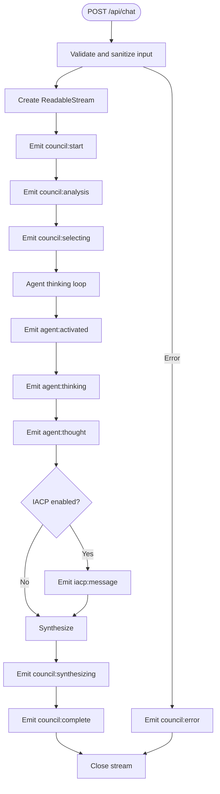
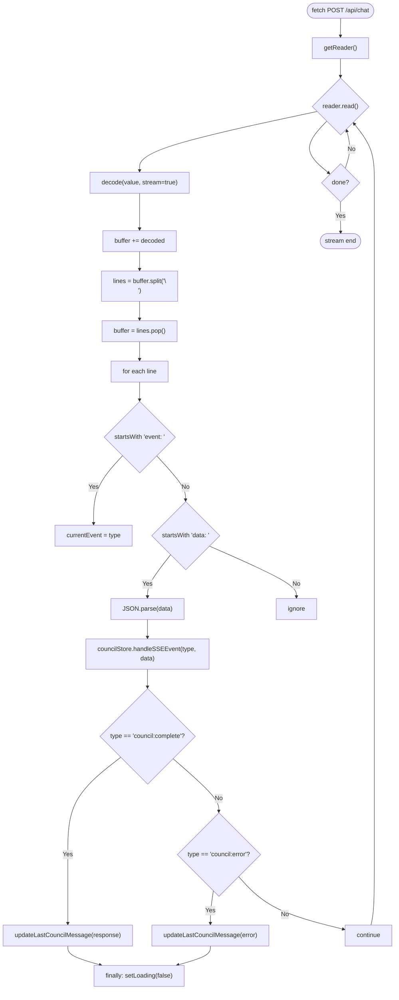
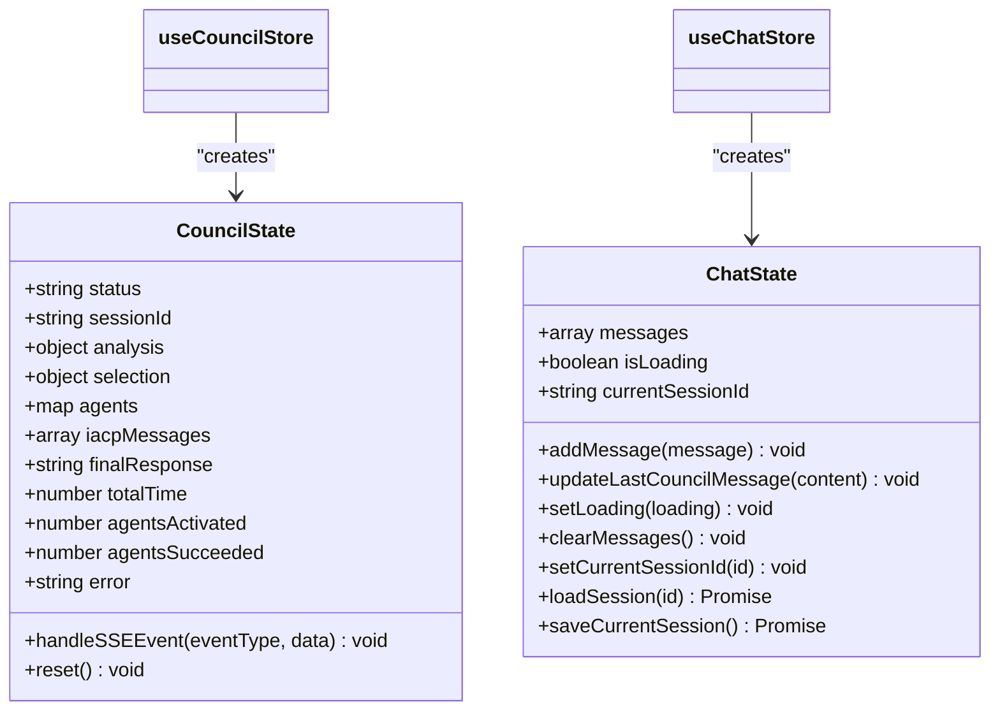
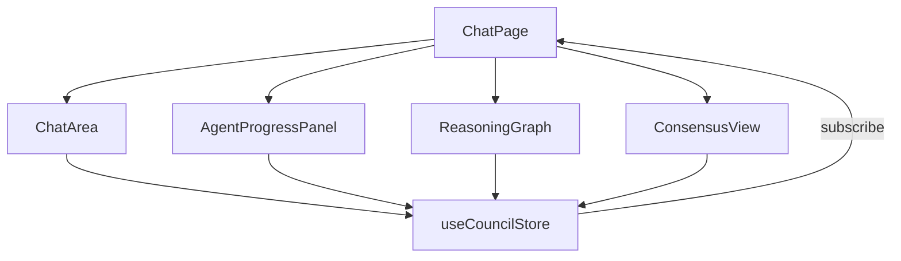
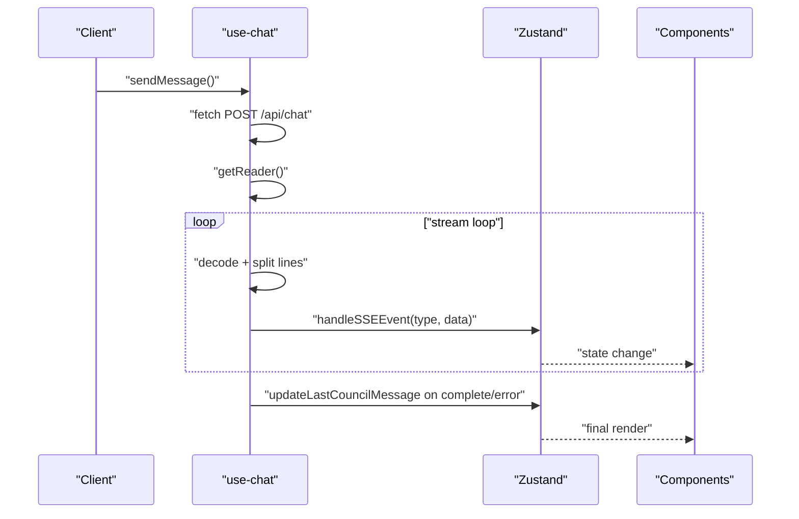
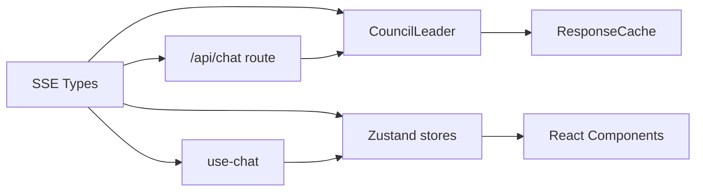

# Real-Time Communication

<cite>
**Referenced Files in This Document**
- [src\types\sse.ts](file://src\types\sse.ts)
- [src\app\api\chat\route.ts](file://src\app\api\chat\route.ts)
- [src\hooks\use-chat.ts](file://src\hooks\use-chat.ts)
- [src\stores\council-store.ts](file://src\stores\council-store.ts)
- [src\stores\chat-store.ts](file://src\stores\chat-store.ts)
- [src\core\council\leader.ts](file://src\core\council\leader.ts)
- [src\lib\cache.ts](file://src\lib\cache.ts)
- [src\components\chat\chat-area.tsx](file://src\components\chat\chat-area.tsx)
- [src\components\agents\agent-progress-panel.tsx](file://src\components\agents\agent-progress-panel.tsx)
- [src\components\council\reasoning-graph.tsx](file://src\components\council\reasoning-graph.tsx)
- [src\components\council\consensus-view.tsx](file://src\components\council\consensus-view.tsx)
- [src\app\chat\page.tsx](file://src\app\chat\page.tsx)
- [src\types\index.ts](file://src\types\index.ts)
- [package.json](file://package.json)
</cite>

## Table of Contents
1. [Introduction](#introduction)
2. [Project Structure](#project-structure)
3. [Core Components](#core-components)
4. [Architecture Overview](#architecture-overview)
5. [Detailed Component Analysis](#detailed-component-analysis)
6. [Dependency Analysis](#dependency-analysis)
7. [Performance Considerations](#performance-considerations)
8. [Troubleshooting Guide](#troubleshooting-guide)
9. [Conclusion](#conclusion)
10. [Appendices](#appendices)

## Introduction
This document explains the real-time communication system built around Server-Sent Events (SSE) that streams multi-agent reasoning and synthesis updates from the server to the client. It covers the event streaming architecture, client-side handling, Zustand store integration for state management, UI synchronization, connection lifecycle, error handling, and strategies for reliability and scalability. It also documents event types, message formats, and practical client integration patterns.

## Project Structure
The real-time pipeline spans backend routes, orchestration logic, SSE emission, and frontend consumption with React and Zustand stores.



**Diagram sources**
- [src\app\chat\page.tsx:1-368](file://src\app\chat\page.tsx#L1-368)
- [src\hooks\use-chat.ts:1-158](file://src\hooks\use-chat.ts#L1-158)
- [src\stores\council-store.ts:1-188](file://src\stores\council-store.ts#L1-188)
- [src\stores\chat-store.ts:1-132](file://src\stores\chat-store.ts#L1-132)
- [src\app\api\chat\route.ts:1-200](file://src\app\api\chat\route.ts#L1-200)
- [src\core\council\leader.ts:1-714](file://src\core\council\leader.ts#L1-714)
- [src\lib\cache.ts:1-206](file://src\lib\cache.ts#L1-206)

**Section sources**
- [src\app\chat\page.tsx:1-368](file://src\app\chat\page.tsx#L1-368)
- [src\hooks\use-chat.ts:1-158](file://src\hooks\use-chat.ts#L1-158)
- [src\stores\council-store.ts:1-188](file://src\stores\council-store.ts#L1-188)
- [src\stores\chat-store.ts:1-132](file://src\stores\chat-store.ts#L1-132)
- [src\app\api\chat\route.ts:1-200](file://src\app\api\chat\route.ts#L1-200)
- [src\core\council\leader.ts:1-714](file://src\core\council\leader.ts#L1-714)
- [src\lib\cache.ts:1-206](file://src\lib\cache.ts#L1-206)

## Core Components
- SSE event types and payload shapes define the contract between server and client.
- The server’s chat route builds an SSE stream and emits structured events.
- The client reads the stream, parses events, and dispatches them to Zustand stores.
- UI components subscribe to Zustand to render live updates.

Key files:
- Event types and shapes: [src\types\sse.ts:1-112](file://src\types\sse.ts#L1-112)
- SSE producer: [src\app\api\chat\route.ts:1-200](file://src\app\api\chat\route.ts#L1-200)
- SSE consumer and parsing: [src\hooks\use-chat.ts:1-158](file://src\hooks\use-chat.ts#L1-158)
- State stores: [src\stores\council-store.ts:1-188](file://src\stores\council-store.ts#L1-188), [src\stores\chat-store.ts:1-132](file://src\stores\chat-store.ts#L1-132)
- Orchestration and event emission: [src\core\council\leader.ts:1-714](file://src\core\council\leader.ts#L1-714)
- Caching for performance: [src\lib\cache.ts:1-206](file://src\lib\cache.ts#L1-206)

**Section sources**
- [src\types\sse.ts:1-112](file://src\types\sse.ts#L1-112)
- [src\app\api\chat\route.ts:1-200](file://src\app\api\chat\route.ts#L1-200)
- [src\hooks\use-chat.ts:1-158](file://src\hooks\use-chat.ts#L1-158)
- [src\stores\council-store.ts:1-188](file://src\stores\council-store.ts#L1-188)
- [src\stores\chat-store.ts:1-132](file://src\stores\chat-store.ts#L1-132)
- [src\core\council\leader.ts:1-714](file://src\core\council\leader.ts#L1-714)
- [src\lib\cache.ts:1-206](file://src\lib\cache.ts#L1-206)

## Architecture Overview
The system uses a streaming SSE channel initiated by the client sending a POST to the chat endpoint. The server constructs a ReadableStream, emits structured events, and closes the stream upon completion or error. The client consumes the stream incrementally, dispatches events to Zustand, and the UI updates reactively.



**Diagram sources**
- [src\hooks\use-chat.ts:22-128](file://src\hooks\use-chat.ts#L22-128)
- [src\app\api\chat\route.ts:85-199](file://src\app\api\chat\route.ts#L85-199)
- [src\core\council\leader.ts:42-604](file://src\core\council\leader.ts#L42-604)
- [src\lib\cache.ts:71-93](file://src\lib\cache.ts#L71-93)

**Section sources**
- [src\hooks\use-chat.ts:1-158](file://src\hooks\use-chat.ts#L1-158)
- [src\app\api\chat\route.ts:1-200](file://src\app\api\chat\route.ts#L1-200)
- [src\core\council\leader.ts:1-714](file://src\core\council\leader.ts#L1-714)
- [src\lib\cache.ts:1-206](file://src\lib\cache.ts#L1-206)

## Detailed Component Analysis

### SSE Event Model and Types
- Event types enumerate all server-emitted signals (e.g., council phases, agent lifecycle, IACP messages, verification, budget warnings, completion).
- Each event type maps to a strongly-typed payload shape ensuring client-side parsing safety.
- The generic SSEEvent type carries type, data, and timestamp.

```mermaid
classDiagram
class SSEEvent {
+string type
+Record~string, unknown~ data
+number timestamp
}
class SSEEventType {
<<enumeration>>
"council : start"
"council : analysis"
"council : selecting"
"agent : activated"
"agent : thinking"
"agent : thought"
"agent : branch"
"agent : verification"
"agent : error"
"iacp : message"
"council : synthesizing"
"council : synthesis_progress"
"council : budget_warning"
"council : complete"
"council : cache_hit"
"council : clarification_needed"
"council : error"
}
SSEEvent --> SSEEventType : "type"
```

**Diagram sources**
- [src\types\sse.ts:6-24](file://src\types\sse.ts#L6-24)
- [src\types\sse.ts:107-112](file://src\types\sse.ts#L107-112)

**Section sources**
- [src\types\sse.ts:1-112](file://src\types\sse.ts#L1-112)

### Server-Sent Events Producer
- The chat route validates and sanitizes input, resolves provider credentials, and constructs a ReadableStream.
- It emits formatted SSE lines: “event: <type>” followed by “data: <JSON>”, separated by blank lines.
- The route sets appropriate headers to prevent caching and buffering.
- On orchestration errors, it emits a “council:error” event and closes the stream.



**Diagram sources**
- [src\app\api\chat\route.ts:85-199](file://src\app\api\chat\route.ts#L85-199)
- [src\core\council\leader.ts:42-604](file://src\core\council\leader.ts#L42-604)

**Section sources**
- [src\app\api\chat\route.ts:1-200](file://src\app\api\chat\route.ts#L1-200)
- [src\core\council\leader.ts:1-714](file://src\core\council\leader.ts#L1-714)

### Client-Side SSE Consumer and Parsing
- The client sends a POST to the chat endpoint and reads the response body as a stream.
- It decodes chunks, splits on newlines, buffers partial lines, and parses “event: …” and “data: …” pairs.
- Parsed data is dispatched to the council store’s event handler, and special handling is applied for completion and error events.



**Diagram sources**
- [src\hooks\use-chat.ts:68-128](file://src\hooks\use-chat.ts#L68-128)

**Section sources**
- [src\hooks\use-chat.ts:1-158](file://src\hooks\use-chat.ts#L1-158)

### Zustand Store Integration
- Council store manages multi-agent state, IACP messages, and synthesis progress. It exposes a handleSSEEvent method that updates internal state based on event types.
- Chat store manages UI messages and loading state, including updating the last council message and saving/loading sessions.



**Diagram sources**
- [src\stores\council-store.ts:24-188](file://src\stores\council-store.ts#L24-188)
- [src\stores\chat-store.ts:4-16](file://src\stores\chat-store.ts#L4-16)

**Section sources**
- [src\stores\council-store.ts:1-188](file://src\stores\council-store.ts#L1-188)
- [src\stores\chat-store.ts:1-132](file://src\stores\chat-store.ts#L1-132)

### UI Synchronization and Rendering
- The chat page composes UI panels and subscribes to Zustand stores to render agent progress, reasoning graphs, and consensus views.
- The chat area listens for clarification and cache-hit events, and displays progress bars and summaries.
- The agent progress panel renders agent statuses, confidence, branches, and IACP messages.



**Diagram sources**
- [src\app\chat\page.tsx:101-158](file://src\app\chat\page.tsx#L101-158)
- [src\components\chat\chat-area.tsx:173-332](file://src\components\chat\chat-area.tsx#L173-332)
- [src\components\agents\agent-progress-panel.tsx:340-583](file://src\components\agents\agent-progress-panel.tsx#L340-583)
- [src\components\council\reasoning-graph.tsx:229-258](file://src\components\council\reasoning-graph.tsx#L229-258)
- [src\components\council\consensus-view.tsx:244-266](file://src\components\council\consensus-view.tsx#L244-266)

**Section sources**
- [src\app\chat\page.tsx:1-368](file://src\app\chat\page.tsx#L1-368)
- [src\components\chat\chat-area.tsx:1-332](file://src\components\chat\chat-area.tsx#L1-332)
- [src\components\agents\agent-progress-panel.tsx:1-583](file://src\components\agents\agent-progress-panel.tsx#L1-583)
- [src\components\council\reasoning-graph.tsx:1-258](file://src\components\council\reasoning-graph.tsx#L1-258)
- [src\components\council\consensus-view.tsx:1-266](file://src\components\council\consensus-view.tsx#L1-266)

### Event Types, Message Formats, and Client Integration
- Event types and payloads are defined centrally and consumed by both server and client.
- Client integration pattern:
  - Send POST to /api/chat with query and settings.
  - Read response body as stream.
  - Parse “event: …” and “data: …” lines.
  - Dispatch to Zustand store.
  - Update UI and persist session on completion.



**Diagram sources**
- [src\hooks\use-chat.ts:22-128](file://src\hooks\use-chat.ts#L22-128)
- [src\stores\council-store.ts:54-171](file://src\stores\council-store.ts#L54-171)
- [src\types\sse.ts:6-105](file://src\types\sse.ts#L6-105)

**Section sources**
- [src\types\sse.ts:1-112](file://src\types\sse.ts#L1-112)
- [src\hooks\use-chat.ts:1-158](file://src\hooks\use-chat.ts#L1-158)
- [src\stores\council-store.ts:1-188](file://src\stores\council-store.ts#L1-188)

## Dependency Analysis
- Backend depends on the orchestration leader and cache utilities.
- Frontend depends on Zustand stores and React components.
- The SSE event model is the central contract enabling loose coupling between client and server.



**Diagram sources**
- [src\types\sse.ts:1-112](file://src\types\sse.ts#L1-112)
- [src\app\api\chat\route.ts:1-200](file://src\app\api\chat\route.ts#L1-200)
- [src\core\council\leader.ts:1-714](file://src\core\council\leader.ts#L1-714)
- [src\lib\cache.ts:1-206](file://src\lib\cache.ts#L1-206)
- [src\hooks\use-chat.ts:1-158](file://src\hooks\use-chat.ts#L1-158)
- [src\stores\council-store.ts:1-188](file://src\stores\council-store.ts#L1-188)
- [src\stores\chat-store.ts:1-132](file://src\stores\chat-store.ts#L1-132)

**Section sources**
- [src\types\sse.ts:1-112](file://src\types\sse.ts#L1-112)
- [src\app\api\chat\route.ts:1-200](file://src\app\api\chat\route.ts#L1-200)
- [src\core\council\leader.ts:1-714](file://src\core\council\leader.ts#L1-714)
- [src\lib\cache.ts:1-206](file://src\lib\cache.ts#L1-206)
- [src\hooks\use-chat.ts:1-158](file://src\hooks\use-chat.ts#L1-158)
- [src\stores\council-store.ts:1-188](file://src\stores\council-store.ts#L1-188)
- [src\stores\chat-store.ts:1-132](file://src\stores\chat-store.ts#L1-132)

## Performance Considerations
- Streaming: SSE avoids buffering large payloads; the server emits incremental events and the client renders progressively.
- Caching: ResponseCache reduces repeated computation and network latency for similar queries.
- Concurrency: ConcurrencyManager limits simultaneous agent tasks to balance throughput and cost.
- Token budgeting: TokenBudgetTracker monitors usage and emits warnings to prevent excessive consumption.
- UI rendering: Components use memoization and selective updates to minimize re-renders.

Recommendations:
- Tune concurrencyLimit and maxAgents based on provider quotas and latency targets.
- Monitor budget warnings and adjust reasoning depth to stay within thresholds.
- Use ResponseCache tuning (max size, TTL) to optimize hit rates for domain-specific queries.

**Section sources**
- [src\lib\cache.ts:1-206](file://src\lib\cache.ts#L1-206)
- [src\core\council\leader.ts:182-324](file://src\core\council\leader.ts#L182-324)
- [src\components\chat\chat-area.tsx:109-171](file://src\components\chat\chat-area.tsx#L109-171)

## Troubleshooting Guide
Common issues and resolutions:
- Malformed events: Client skips malformed “data: …” lines; ensure server emits valid JSON.
- Aborted requests: Client cancels the fetch via AbortController; UI clears loading state.
- Network interruptions: SSE is designed for long-lived connections; implement client-side retry strategies if needed.
- Provider errors: Server emits “council:error”; client displays error in the last council message and updates state.
- Safety filtering: Queries flagged by prompt injection detection are rejected with an error response.

Operational tips:
- Inspect emitted events in browser DevTools Network tab under the SSE stream.
- Verify event types and payloads align with the SSE types definition.
- Confirm headers include “Content-Type: text/event-stream” and “Cache-Control: no-cache”.

**Section sources**
- [src\hooks\use-chat.ts:113-126](file://src\hooks\use-chat.ts#L113-126)
- [src\app\api\chat\route.ts:130-135](file://src\app\api\chat\route.ts#L130-135)
- [src\app\api\chat\route.ts:176-187](file://src\app\api\chat\route.ts#L176-187)

## Conclusion
The real-time communication system leverages SSE to stream a rich, multi-phase orchestration from the server to the client. The event model, server producer, client consumer, and Zustand stores form a cohesive pipeline that keeps the UI synchronized and responsive. With caching, budgeting, and concurrency controls, the system balances performance, reliability, and scalability for multi-agent reasoning scenarios.

## Appendices

### Appendix A: Event Types Reference
- council:start: Initiates the session with sessionId and query.
- council:analysis: Provides query analysis and suggested agent count.
- council:selecting: Lists selected agents for the session.
- agent:activated: Introduces an agent with role and batch index.
- agent:thinking: Signals agent entering reasoning.
- agent:thought: Final thought, confidence, processing time, optional branches.
- agent:branch: Individual branch thought and confidence.
- agent:verification: Verification outcome for a claim.
- agent:error: Agent-level error.
- iacp:message: Inter-Agent Communication Protocol message.
- council:synthesizing: Starts synthesis phase.
- council:synthesis_progress: Progress during synthesis.
- council:budget_warning: Budget threshold warning.
- council:complete: Final response and usage statistics.
- council:cache_hit: Cached response retrieved.
- council:clarification_needed: Suggestions to improve query.
- council:error: System-level error.

**Section sources**
- [src\types\sse.ts:6-105](file://src\types\sse.ts#L6-105)

### Appendix B: Client Integration Checklist
- Send POST to /api/chat with query and settings.
- Read response body as stream and parse event/data lines.
- Dispatch events to council store’s handleSSEEvent.
- Update UI and last council message on completion or error.
- Persist session after completion.

**Section sources**
- [src\hooks\use-chat.ts:22-128](file://src\hooks\use-chat.ts#L22-128)
- [src\stores\council-store.ts:54-171](file://src\stores\council-store.ts#L54-171)