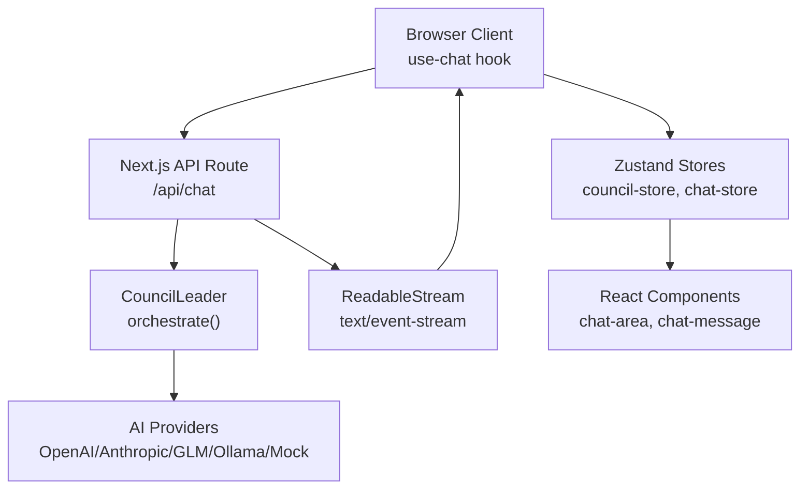
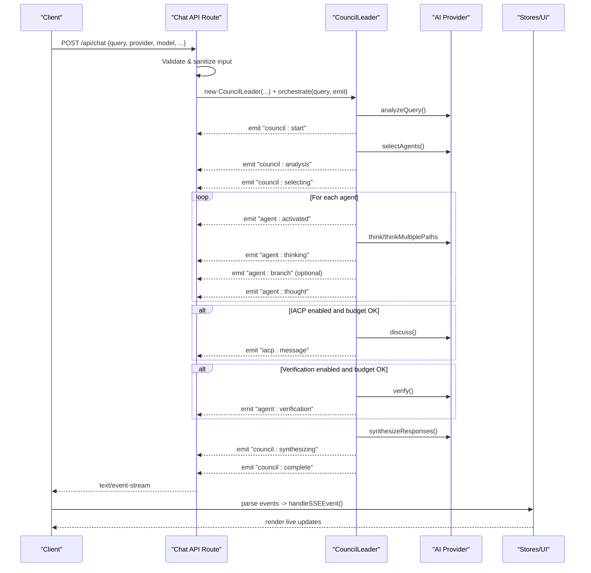
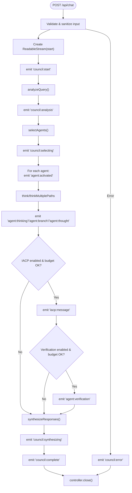
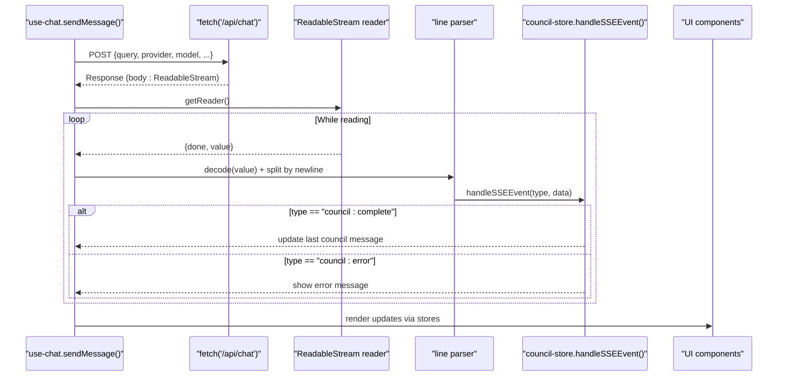
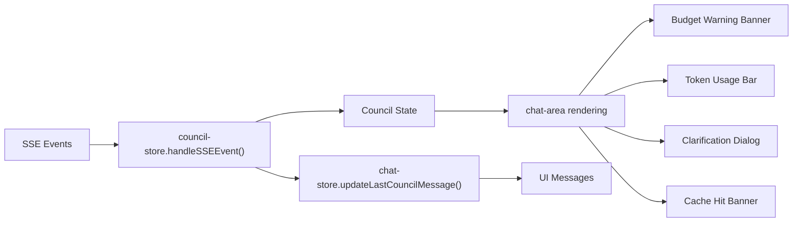
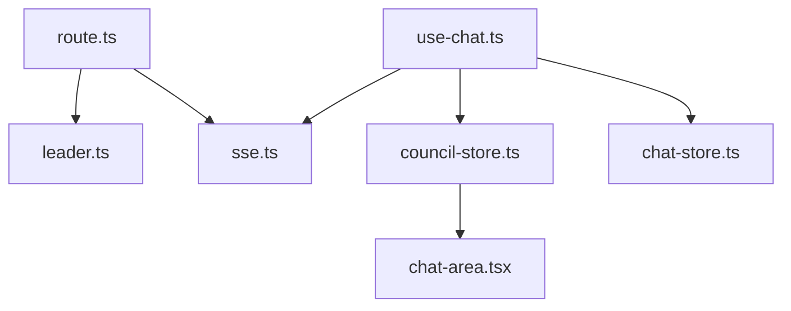

# Server-Sent Events (SSE)

<cite>
**Referenced Files in This Document**
- [route.ts](file://src/app/api/chat/route.ts)
- [use-chat.ts](file://src/hooks/use-chat.ts)
- [sse.ts](file://src/types/sse.ts)
- [leader.ts](file://src/core/council/leader.ts)
- [council-store.ts](file://src/stores/council-store.ts)
- [chat-store.ts](file://src/stores/chat-store.ts)
- [chat-area.tsx](file://src/components/chat/chat-area.tsx)
</cite>

## Table of Contents
1. [Introduction](#introduction)
2. [Project Structure](#project-structure)
3. [Core Components](#core-components)
4. [Architecture Overview](#architecture-overview)
5. [Detailed Component Analysis](#detailed-component-analysis)
6. [Dependency Analysis](#dependency-analysis)
7. [Performance Considerations](#performance-considerations)
8. [Troubleshooting Guide](#troubleshooting-guide)
9. [Conclusion](#conclusion)

## Introduction
This document explains the Server-Sent Events (SSE) implementation powering real-time streaming in the multi-agent AI system. It covers the server-side chat API route that emits structured events, the client-side event handling using a React hook, and the UI integration that renders live updates. It also documents the event types used throughout the multi-agent reasoning lifecycle, including agent activation, discussion updates, verification, and final response completion. Guidance is included for connection management, graceful termination, and error recovery.

## Project Structure
The SSE implementation spans several layers:
- API route: builds a streaming response and emits structured events
- Core orchestration: generates events during multi-agent reasoning
- Client hook: reads the stream, parses events, and updates stores
- Stores: manage UI state transitions based on events
- UI components: render progress, warnings, and final results



**Diagram sources**
- [route.ts:88-221](file://src/app/api/chat/route.ts#L88-L221)
- [leader.ts:42-604](file://src/core/council/leader.ts#L42-L604)
- [use-chat.ts:22-128](file://src/hooks/use-chat.ts#L22-L128)
- [council-store.ts:41-187](file://src/stores/council-store.ts#L41-L187)
- [chat-store.ts:18-131](file://src/stores/chat-store.ts#L18-L131)
- [chat-area.tsx:173-221](file://src/components/chat/chat-area.tsx#L173-L221)

**Section sources**
- [route.ts:88-221](file://src/app/api/chat/route.ts#L88-L221)
- [leader.ts:42-604](file://src/core/council/leader.ts#L42-L604)
- [use-chat.ts:22-128](file://src/hooks/use-chat.ts#L22-L128)
- [council-store.ts:41-187](file://src/stores/council-store.ts#L41-L187)
- [chat-store.ts:18-131](file://src/stores/chat-store.ts#L18-L131)
- [chat-area.tsx:173-221](file://src/components/chat/chat-area.tsx#L173-L221)

## Core Components
- Server API route: validates input, constructs a ReadableStream, emits structured SSE events, and sets SSE-compatible headers.
- SSE event types and payload shapes: strongly typed event definitions drive both server and client behavior.
- Client hook: initiates the SSE stream, parses event lines, dispatches events to stores, and handles errors.
- Stores: transform events into UI state and expose handlers for UI components to intercept special events.
- UI components: render live updates, warnings, and final results based on store state.

**Section sources**
- [route.ts:46-221](file://src/app/api/chat/route.ts#L46-L221)
- [sse.ts:6-111](file://src/types/sse.ts#L6-L111)
- [use-chat.ts:22-128](file://src/hooks/use-chat.ts#L22-L128)
- [council-store.ts:41-187](file://src/stores/council-store.ts#L41-L187)
- [chat-store.ts:18-131](file://src/stores/chat-store.ts#L18-L131)
- [chat-area.tsx:114-208](file://src/components/chat/chat-area.tsx#L114-L208)

## Architecture Overview
The SSE architecture follows a unidirectional data flow:
- Client sends a POST request to the chat API with configuration parameters.
- Server creates a streaming response with SSE headers and starts emitting events.
- The server orchestrator emits lifecycle events as the multi-agent reasoning progresses.
- The client reads the stream, parses event lines, and updates stores.
- UI components subscribe to store changes and render live updates.



**Diagram sources**
- [route.ts:88-221](file://src/app/api/chat/route.ts#L88-L221)
- [leader.ts:42-604](file://src/core/council/leader.ts#L42-L604)
- [use-chat.ts:48-128](file://src/hooks/use-chat.ts#L48-L128)
- [council-store.ts:54-170](file://src/stores/council-store.ts#L54-L170)
- [chat-area.tsx:114-208](file://src/components/chat/chat-area.tsx#L114-L208)

## Detailed Component Analysis

### Server-Side SSE Implementation
- Event formatting: Each event is formatted as a line-prefixed string with an event type and a JSON-encoded data payload, followed by a blank line separator.
- Stream construction: A ReadableStream is created with a start callback that receives a controller. Events are enqueued by encoding the formatted event string.
- Headers: The response uses SSE-compatible headers including Content-Type, Cache-Control, Connection, and X-Accel-Buffering for reverse proxy compatibility.
- Error handling: On exceptions, a structured error event is emitted, then the stream is closed.



**Diagram sources**
- [route.ts:148-221](file://src/app/api/chat/route.ts#L148-L221)
- [leader.ts:42-604](file://src/core/council/leader.ts#L42-L604)

**Section sources**
- [route.ts:46-221](file://src/app/api/chat/route.ts#L46-L221)
- [leader.ts:42-604](file://src/core/council/leader.ts#L42-L604)

### SSE Event Types and Payloads
The system defines a comprehensive set of event types and associated payloads that represent each phase of the multi-agent reasoning process. These types are strongly typed and include:
- Session lifecycle: start, analysis, selecting, synthesizing, complete, error
- Agent lifecycle: activated, thinking, thought, branch, verification, error
- IACP discussion: message exchange events
- Operational signals: budget warnings, cache hits, clarification needed

```mermaid
classDiagram
class SSEEvent {
+string type
+unknown data
+number timestamp
}
class SSEEventType {
<<enumeration>>
"council : start"
"council : analysis"
"council : selecting"
"council : phase"
"agent : activated"
"agent : thinking"
"agent : thought"
"agent : branch"
"agent : verification"
"agent : error"
"iacp : message"
"council : synthesizing"
"council : synthesis_progress"
"council : budget_warning"
"council : complete"
"council : cache_hit"
"council : clarification_needed"
"council : error"
}
class SSEEventData {
<<mapping>>
}
SSEEvent --> SSEEventType : "type"
SSEEvent --> SSEEventData : "data"
```

**Diagram sources**
- [sse.ts:6-111](file://src/types/sse.ts#L6-L111)

**Section sources**
- [sse.ts:6-111](file://src/types/sse.ts#L6-L111)

### Client-Side Event Handling (use-chat hook)
- Request initiation: Sends a POST to /api/chat with settings from the settings store and query text.
- Stream reading: Uses a TextDecoder and incremental buffering to parse event lines.
- Event parsing: Extracts event type and JSON data, then dispatches to the council store’s event handler.
- Completion and error handling: Updates the last council message on completion or error; ensures loading state is cleared; aborts on user stop.



**Diagram sources**
- [use-chat.ts:22-128](file://src/hooks/use-chat.ts#L22-L128)
- [council-store.ts:54-170](file://src/stores/council-store.ts#L54-L170)

**Section sources**
- [use-chat.ts:22-128](file://src/hooks/use-chat.ts#L22-L128)
- [council-store.ts:54-170](file://src/stores/council-store.ts#L54-L170)

### Store Integration and UI Rendering
- Council store: Translates SSE events into state changes (status, agents, iacp messages, final response, totals).
- Chat store: Manages UI messages and persists sessions.
- UI components: Wrap the council store’s event handler to intercept special events (budget warnings, token usage, cache hit, clarification prompts) and render contextual UI.



**Diagram sources**
- [council-store.ts:54-170](file://src/stores/council-store.ts#L54-L170)
- [chat-store.ts:26-36](file://src/stores/chat-store.ts#L26-L36)
- [chat-area.tsx:114-208](file://src/components/chat/chat-area.tsx#L114-L208)

**Section sources**
- [council-store.ts:54-170](file://src/stores/council-store.ts#L54-L170)
- [chat-store.ts:26-36](file://src/stores/chat-store.ts#L26-L36)
- [chat-area.tsx:114-208](file://src/components/chat/chat-area.tsx#L114-L208)

## Dependency Analysis
- The API route depends on the CouncilLeader to orchestrate multi-agent reasoning and emit events.
- The client hook depends on the SSE event types and the stores to interpret and render events.
- The UI components depend on the stores’ event handler to present contextual feedback.



**Diagram sources**
- [route.ts:88-221](file://src/app/api/chat/route.ts#L88-L221)
- [leader.ts:42-604](file://src/core/council/leader.ts#L42-L604)
- [sse.ts:6-111](file://src/types/sse.ts#L6-L111)
- [use-chat.ts:22-128](file://src/hooks/use-chat.ts#L22-L128)
- [council-store.ts:54-170](file://src/stores/council-store.ts#L54-L170)
- [chat-store.ts:26-36](file://src/stores/chat-store.ts#L26-L36)
- [chat-area.tsx:114-208](file://src/components/chat/chat-area.tsx#L114-L208)

**Section sources**
- [route.ts:88-221](file://src/app/api/chat/route.ts#L88-L221)
- [leader.ts:42-604](file://src/core/council/leader.ts#L42-L604)
- [use-chat.ts:22-128](file://src/hooks/use-chat.ts#L22-L128)
- [council-store.ts:54-170](file://src/stores/council-store.ts#L54-L170)
- [chat-store.ts:26-36](file://src/stores/chat-store.ts#L26-L36)
- [chat-area.tsx:114-208](file://src/components/chat/chat-area.tsx#L114-L208)

## Performance Considerations
- Streaming headers: The server sets headers to prevent caching and buffering, ensuring real-time delivery.
- Minimal parsing overhead: The client decodes chunks incrementally and splits on newlines to reconstruct complete events.
- Best-effort caching: The server checks a response cache before computation; on cache hit, it emits a cache hit event and completes quickly.
- Budget-aware orchestration: The server tracks token usage and emits budget warnings proactively to avoid exceeding limits.
- Concurrency control: Agents are executed with controlled concurrency to balance throughput and cost.

[No sources needed since this section provides general guidance]

## Troubleshooting Guide
Common issues and remedies:
- Network interruptions: The client catches errors and displays an error message; ensure the AbortController is used to cancel long-running requests.
- Malformed events: The client skips malformed data lines; verify server-side event formatting is consistent.
- Stream closure: The server closes the stream after emitting the final event; ensure clients handle the stream end gracefully.
- Provider errors: The server emits a structured error event; confirm provider credentials and model availability.
- UI not updating: Verify that the UI wraps the store’s event handler to intercept special events (budget warnings, token usage, cache hit).

**Section sources**
- [use-chat.ts:113-125](file://src/hooks/use-chat.ts#L113-L125)
- [route.ts:196-209](file://src/app/api/chat/route.ts#L196-L209)
- [chat-area.tsx:114-208](file://src/components/chat/chat-area.tsx#L114-L208)

## Conclusion
The SSE implementation provides a robust, real-time communication channel between the client and the multi-agent reasoning engine. The server emits well-defined events that drive the UI, enabling users to observe agent activations, discussions, verifications, and synthesis outcomes. The client integrates seamlessly with Zustand stores to render contextual feedback and persist sessions. With careful attention to headers, error handling, and stream termination, the system delivers a responsive and resilient real-time experience.