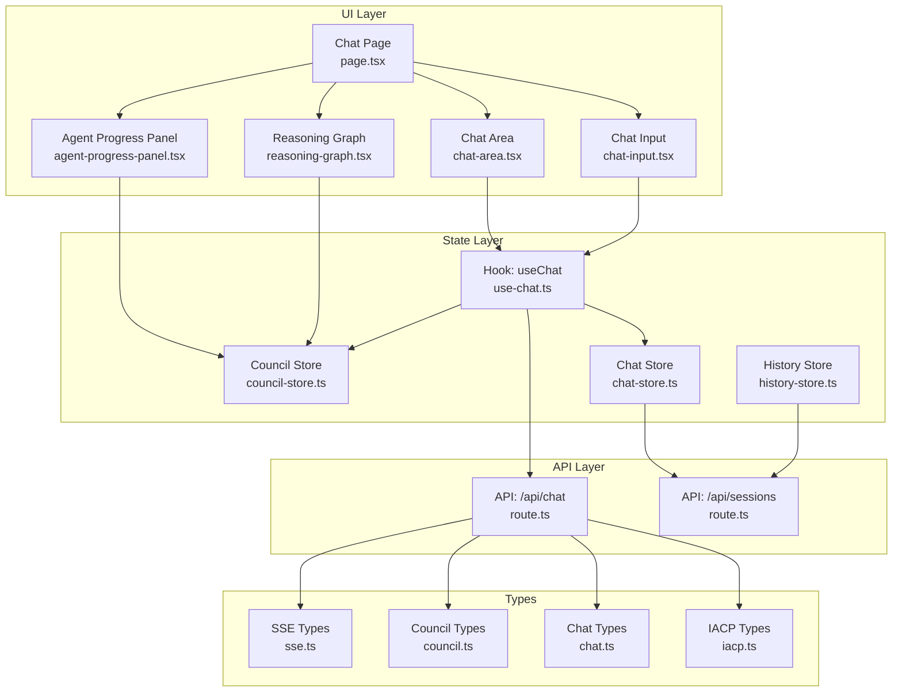
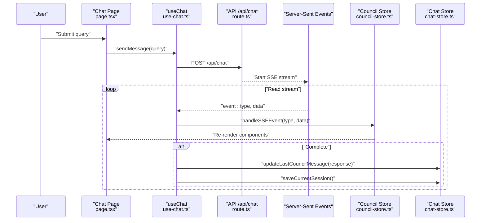
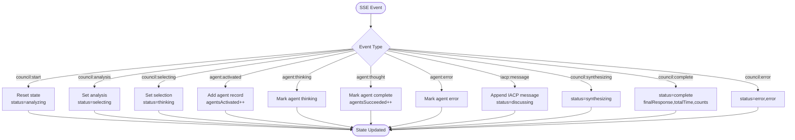
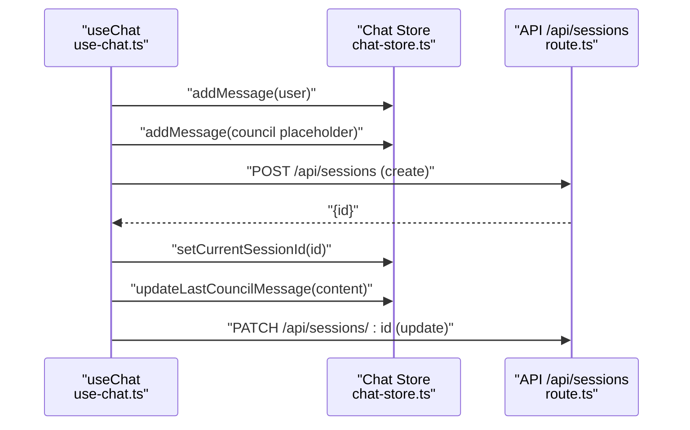
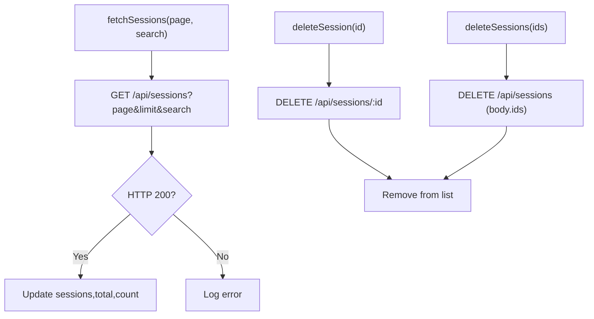
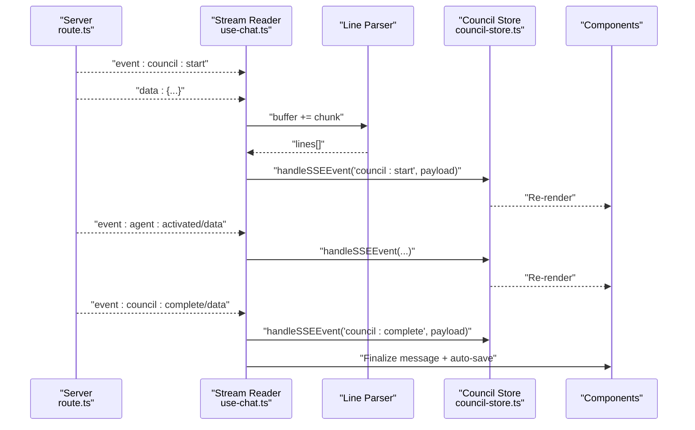
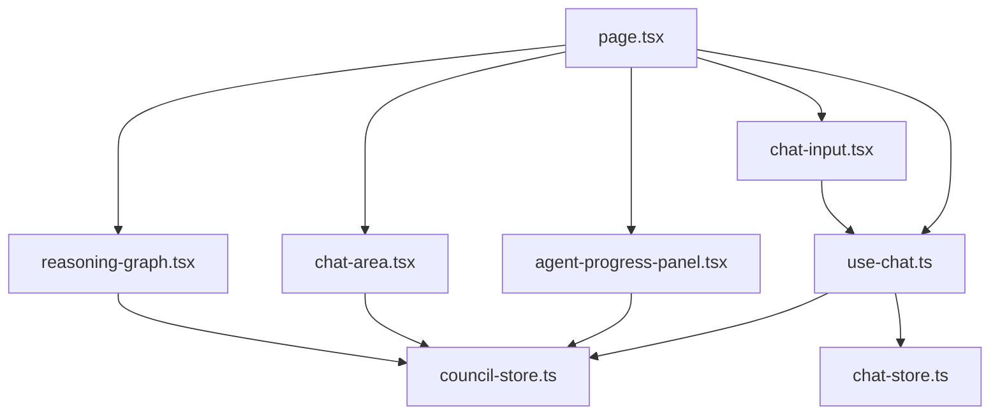
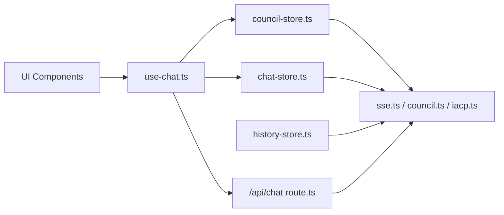

# State Management Integration

<cite>
**Referenced Files in This Document**
- [council-store.ts](file://src/stores/council-store.ts)
- [chat-store.ts](file://src/stores/chat-store.ts)
- [history-store.ts](file://src/stores/history-store.ts)
- [use-chat.ts](file://src/hooks/use-chat.ts)
- [page.tsx](file://src/app/chat/page.tsx)
- [route.ts](file://src/app/api/chat/route.ts)
- [route.ts](file://src/app/api/sessions/route.ts)
- [chat-area.tsx](file://src/components/chat/chat-area.tsx)
- [agent-progress-panel.tsx](file://src/components/agents/agent-progress-panel.tsx)
- [reasoning-graph.tsx](file://src/components/council/reasoning-graph.tsx)
- [chat-input.tsx](file://src/components/chat/chat-input.tsx)
- [sse.ts](file://src/types/sse.ts)
- [council.ts](file://src/types/council.ts)
- [chat.ts](file://src/types/chat.ts)
- [iacp.ts](file://src/types/iacp.ts)
</cite>

## Table of Contents
1. [Introduction](#introduction)
2. [Project Structure](#project-structure)
3. [Core Components](#core-components)
4. [Architecture Overview](#architecture-overview)
5. [Detailed Component Analysis](#detailed-component-analysis)
6. [Dependency Analysis](#dependency-analysis)
7. [Performance Considerations](#performance-considerations)
8. [Troubleshooting Guide](#troubleshooting-guide)
9. [Conclusion](#conclusion)
10. [Appendices](#appendices)

## Introduction
This document explains the Zustand-based state management integration that powers real-time multi-agent coordination and chat experiences. It covers:
- The council store for managing multi-agent coordination state (progress tracking, discussion status, synthesis results)
- The chat store for handling message streams, user input state, and conversation history
- The history store for persisting conversation data and enabling session replay
- The event processing pipeline transforming SSE events into state updates and UI synchronization
- Performance optimization techniques, memory management, and persistence strategies
- Store usage patterns, event handlers, and React component integrations

## Project Structure
The state management stack is organized around three Zustand stores and a cohesive SSE-driven pipeline:
- Stores: council-store, chat-store, history-store
- Hooks: use-chat orchestrates SSE streaming and integrates stores
- UI: chat page and components subscribe to stores for live updates
- API: server-side routes emit structured SSE events and manage session persistence

**Diagram sources**
- [page.tsx:1-368](file://src/app/chat/page.tsx#L1-L368)
- [chat-area.tsx:1-332](file://src/components/chat/chat-area.tsx#L1-L332)
- [agent-progress-panel.tsx:1-583](file://src/components/agents/agent-progress-panel.tsx#L1-L583)
- [reasoning-graph.tsx:1-258](file://src/components/council/reasoning-graph.tsx#L1-L258)
- [chat-input.tsx:1-86](file://src/components/chat/chat-input.tsx#L1-L86)
- [use-chat.ts:1-158](file://src/hooks/use-chat.ts#L1-L158)
- [council-store.ts:1-188](file://src/stores/council-store.ts#L1-L188)
- [chat-store.ts:1-132](file://src/stores/chat-store.ts#L1-L132)
- [history-store.ts:1-108](file://src/stores/history-store.ts#L1-L108)
- [route.ts:1-222](file://src/app/api/chat/route.ts#L1-L222)
- [route.ts:1-91](file://src/app/api/sessions/route.ts#L1-L91)
- [sse.ts:1-112](file://src/types/sse.ts#L1-L112)
- [council.ts:1-114](file://src/types/council.ts#L1-L114)
- [chat.ts:1-10](file://src/types/chat.ts#L1-L10)
- [iacp.ts:1-67](file://src/types/iacp.ts#L1-L67)

**Section sources**
- [page.tsx:1-368](file://src/app/chat/page.tsx#L1-L368)
- [use-chat.ts:1-158](file://src/hooks/use-chat.ts#L1-L158)
- [council-store.ts:1-188](file://src/stores/council-store.ts#L1-L188)
- [chat-store.ts:1-132](file://src/stores/chat-store.ts#L1-L132)
- [history-store.ts:1-108](file://src/stores/history-store.ts#L1-L108)
- [route.ts:1-222](file://src/app/api/chat/route.ts#L1-L222)
- [route.ts:1-91](file://src/app/api/sessions/route.ts#L1-L91)
- [sse.ts:1-112](file://src/types/sse.ts#L1-L112)
- [council.ts:1-114](file://src/types/council.ts#L1-L114)
- [chat.ts:1-10](file://src/types/chat.ts#L1-L10)
- [iacp.ts:1-67](file://src/types/iacp.ts#L1-L67)

## Core Components
- Council Store: Central state for multi-agent coordination lifecycle, agent progress, IACP messages, and synthesis results. Exposes a single event handler to normalize and apply SSE events.
- Chat Store: Manages UI chat messages, loading state, current session ID, and persistence actions for saving/loading sessions.
- History Store: Fetches paginated sessions, supports deletion, and exposes helpers to locate sessions by ID.

Key responsibilities:
- Normalize SSE event types into deterministic state transitions
- Mutate immutable state efficiently using functional updates
- Persist and load conversation sessions via API routes
- Provide reactive UI bindings through React components

**Section sources**
- [council-store.ts:1-188](file://src/stores/council-store.ts#L1-L188)
- [chat-store.ts:1-132](file://src/stores/chat-store.ts#L1-L132)
- [history-store.ts:1-108](file://src/stores/history-store.ts#L1-L108)

## Architecture Overview
The system uses a unidirectional data flow:
- Client initiates a chat request via the hook
- Server emits structured SSE events
- Hook parses and dispatches events to the council store
- UI components subscribe to stores and re-render reactively
- Chat store persists session state; history store manages session listings

**Diagram sources**
- [use-chat.ts:22-128](file://src/hooks/use-chat.ts#L22-L128)
- [route.ts:88-222](file://src/app/api/chat/route.ts#L88-L222)
- [council-store.ts:54-171](file://src/stores/council-store.ts#L54-L171)
- [chat-store.ts:26-130](file://src/stores/chat-store.ts#L26-L130)

**Section sources**
- [use-chat.ts:1-158](file://src/hooks/use-chat.ts#L1-L158)
- [route.ts:1-222](file://src/app/api/chat/route.ts#L1-L222)
- [council-store.ts:1-188](file://src/stores/council-store.ts#L1-L188)
- [chat-store.ts:1-132](file://src/stores/chat-store.ts#L1-L132)

## Detailed Component Analysis

### Council Store: Multi-Agent Coordination State
The council store encapsulates the entire lifecycle of multi-agent reasoning:
- Lifecycle: idle → analyzing → selecting → thinking → discussing → synthesizing → complete/error
- Agent tracking: per-agent status, thoughts, confidence, processing time, branching
- IACP messaging: threaded discussion records
- Final synthesis: response, timing, totals, and optional token usage

State mutations are pure and idempotent, keyed by SSE event types. The store exposes:
- handleSSEEvent(eventType, data): central dispatcher
- reset(): clears state to idle

**Diagram sources**
- [council-store.ts:54-171](file://src/stores/council-store.ts#L54-L171)

**Section sources**
- [council-store.ts:1-188](file://src/stores/council-store.ts#L1-L188)
- [sse.ts:6-112](file://src/types/sse.ts#L6-L112)

### Chat Store: Message Streams and Session Persistence
Responsibilities:
- Manage UI messages and loading state
- Append user and placeholder council messages
- Update the last council message as responses stream
- Save/load sessions via API endpoints

Persistence behavior:
- Creates a session on first response if none exists
- Updates existing session on subsequent saves
- Best-effort persistence: failures are logged and do not block UI

**Diagram sources**
- [use-chat.ts:22-128](file://src/hooks/use-chat.ts#L22-L128)
- [chat-store.ts:23-130](file://src/stores/chat-store.ts#L23-L130)
- [route.ts:37-91](file://src/app/api/sessions/route.ts#L37-L91)

**Section sources**
- [chat-store.ts:1-132](file://src/stores/chat-store.ts#L1-L132)
- [route.ts:1-91](file://src/app/api/sessions/route.ts#L1-L91)

### History Store: Session Listing and Deletion
Responsibilities:
- Paginate and filter sessions
- Delete single or multiple sessions
- Track loading state and total counts

**Diagram sources**
- [history-store.ts:37-98](file://src/stores/history-store.ts#L37-L98)
- [route.ts:4-35](file://src/app/api/sessions/route.ts#L4-L35)

**Section sources**
- [history-store.ts:1-108](file://src/stores/history-store.ts#L1-L108)
- [route.ts:1-91](file://src/app/api/sessions/route.ts#L1-L91)

### Event Processing Pipeline: SSE Normalization and UI Sync
End-to-end flow:
- Server emits structured SSE events with typed payloads
- Client reads stream line-by-line, buffers partial chunks, splits on newlines
- For each event/data pair, the hook invokes the council store’s event handler
- UI components re-render based on store subscriptions
- On completion, the last council message is finalized and session is saved

**Diagram sources**
- [route.ts:148-222](file://src/app/api/chat/route.ts#L148-L222)
- [use-chat.ts:74-128](file://src/hooks/use-chat.ts#L74-L128)
- [council-store.ts:54-171](file://src/stores/council-store.ts#L54-L171)

**Section sources**
- [use-chat.ts:1-158](file://src/hooks/use-chat.ts#L1-L158)
- [route.ts:1-222](file://src/app/api/chat/route.ts#L1-L222)
- [council-store.ts:1-188](file://src/stores/council-store.ts#L1-L188)

### UI Integration Patterns
- Chat Page composes panels and binds actions from the hook
- Agent Progress Panel subscribes to council store for agent lists and IACP messages
- Chat Area listens for clarification and cache-hit events, and displays summaries
- Reasoning Graph builds visualization data from agent state
- Chat Input handles user submission and loading states

**Diagram sources**
- [page.tsx:1-368](file://src/app/chat/page.tsx#L1-L368)
- [agent-progress-panel.tsx:1-583](file://src/components/agents/agent-progress-panel.tsx#L1-L583)
- [chat-area.tsx:1-332](file://src/components/chat/chat-area.tsx#L1-L332)
- [reasoning-graph.tsx:1-258](file://src/components/council/reasoning-graph.tsx#L1-L258)
- [chat-input.tsx:1-86](file://src/components/chat/chat-input.tsx#L1-L86)
- [use-chat.ts:1-158](file://src/hooks/use-chat.ts#L1-L158)
- [council-store.ts:1-188](file://src/stores/council-store.ts#L1-L188)
- [chat-store.ts:1-132](file://src/stores/chat-store.ts#L1-L132)

**Section sources**
- [page.tsx:1-368](file://src/app/chat/page.tsx#L1-L368)
- [agent-progress-panel.tsx:1-583](file://src/components/agents/agent-progress-panel.tsx#L1-L583)
- [chat-area.tsx:1-332](file://src/components/chat/chat-area.tsx#L1-L332)
- [reasoning-graph.tsx:1-258](file://src/components/council/reasoning-graph.tsx#L1-L258)
- [chat-input.tsx:1-86](file://src/components/chat/chat-input.tsx#L1-L86)

## Dependency Analysis
Stores and components exhibit low coupling and high cohesion:
- UI components depend on stores via hooks and direct state selectors
- The hook acts as a thin orchestration layer between UI and stores
- API routes are decoupled from UI and only emit standardized SSE events
- Types define a contract for event payloads and state shapes

**Diagram sources**
- [use-chat.ts:1-158](file://src/hooks/use-chat.ts#L1-L158)
- [council-store.ts:1-188](file://src/stores/council-store.ts#L1-L188)
- [chat-store.ts:1-132](file://src/stores/chat-store.ts#L1-L132)
- [history-store.ts:1-108](file://src/stores/history-store.ts#L1-L108)
- [route.ts:1-222](file://src/app/api/chat/route.ts#L1-L222)
- [sse.ts:1-112](file://src/types/sse.ts#L1-L112)
- [council.ts:1-114](file://src/types/council.ts#L1-L114)
- [iacp.ts:1-67](file://src/types/iacp.ts#L1-L67)

**Section sources**
- [use-chat.ts:1-158](file://src/hooks/use-chat.ts#L1-L158)
- [council-store.ts:1-188](file://src/stores/council-store.ts#L1-L188)
- [chat-store.ts:1-132](file://src/stores/chat-store.ts#L1-L132)
- [history-store.ts:1-108](file://src/stores/history-store.ts#L1-L108)
- [route.ts:1-222](file://src/app/api/chat/route.ts#L1-L222)
- [sse.ts:1-112](file://src/types/sse.ts#L1-L112)
- [council.ts:1-114](file://src/types/council.ts#L1-L114)
- [iacp.ts:1-67](file://src/types/iacp.ts#L1-L67)

## Performance Considerations
- Efficient state updates: Zustand’s functional updates avoid unnecessary renders by returning shallowly equal objects when unchanged
- Streaming parsing: Line-buffered decoding prevents partial event loss and reduces memory churn
- Minimal re-renders: Components subscribe to narrow slices of state (e.g., agents vs. messages)
- Best-effort persistence: Session save operations do not block UI; errors are logged and ignored to maintain responsiveness
- UI animations: Motion components use initial/animated transitions to avoid heavy computations during rapid updates

[No sources needed since this section provides general guidance]

## Troubleshooting Guide
Common issues and remedies:
- Malformed SSE data: The parser skips malformed lines and continues processing
- Aborted requests: Stop generation cancels the fetch and resets loading state
- Session save failures: Errors are caught and logged; UI remains usable
- Empty or sanitized queries: Server validates and sanitizes input, returning explicit errors

**Section sources**
- [use-chat.ts:113-126](file://src/hooks/use-chat.ts#L113-L126)
- [route.ts:113-138](file://src/app/api/chat/route.ts#L113-L138)
- [chat-store.ts:126-130](file://src/stores/chat-store.ts#L126-L130)

## Conclusion
The Zustand-based state management delivers a clean, scalable foundation for real-time multi-agent coordination:
- Clear separation of concerns across stores, hooks, and UI
- Robust SSE event normalization and UI synchronization
- Practical persistence and history management
- Optimized rendering and resilience against transient failures

[No sources needed since this section summarizes without analyzing specific files]

## Appendices

### Store Usage Patterns
- Initialize a new session: add user message, add placeholder council message, set loading, reset council store
- Handle SSE events: dispatch to council store’s event handler; on completion, finalize last council message and save session
- Load a session: fetch from API and hydrate chat store; reset council store

**Section sources**
- [use-chat.ts:22-128](file://src/hooks/use-chat.ts#L22-L128)
- [chat-store.ts:44-78](file://src/stores/chat-store.ts#L44-L78)
- [council-store.ts:54-171](file://src/stores/council-store.ts#L54-L171)

### Event Handlers and Contracts
- SSE event types and payloads are defined centrally and consumed by the store dispatcher
- UI components attach lightweight wrappers to capture auxiliary UI signals (e.g., budget warnings, cache hits)

**Section sources**
- [sse.ts:6-112](file://src/types/sse.ts#L6-L112)
- [chat-area.tsx:114-138](file://src/components/chat/chat-area.tsx#L114-L138)