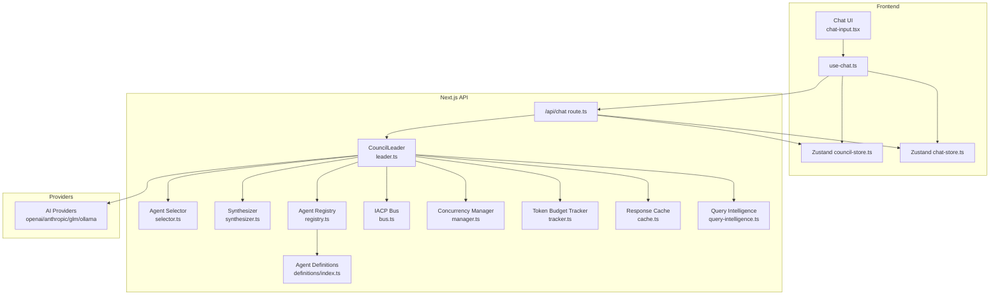
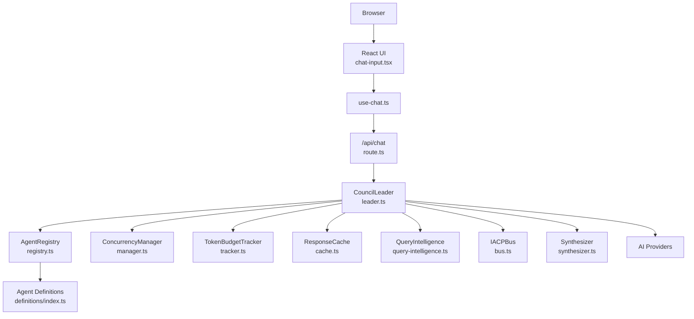
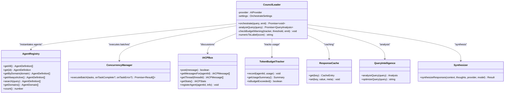
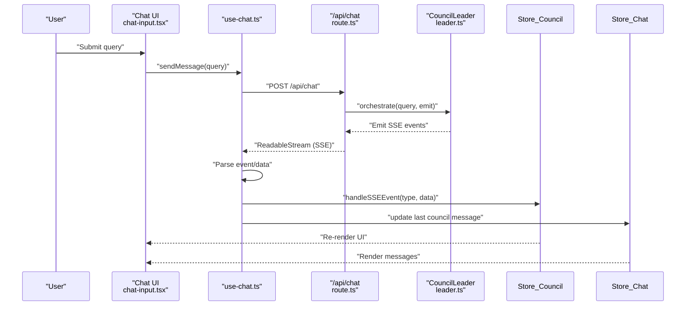
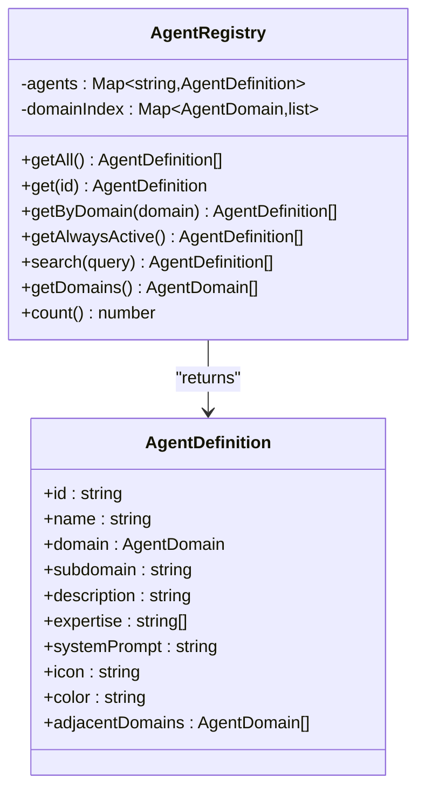
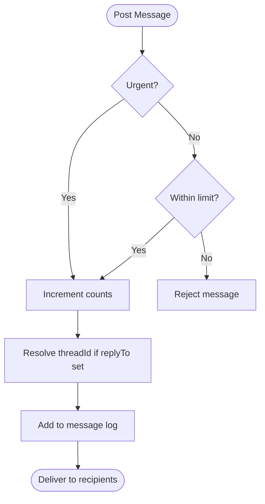
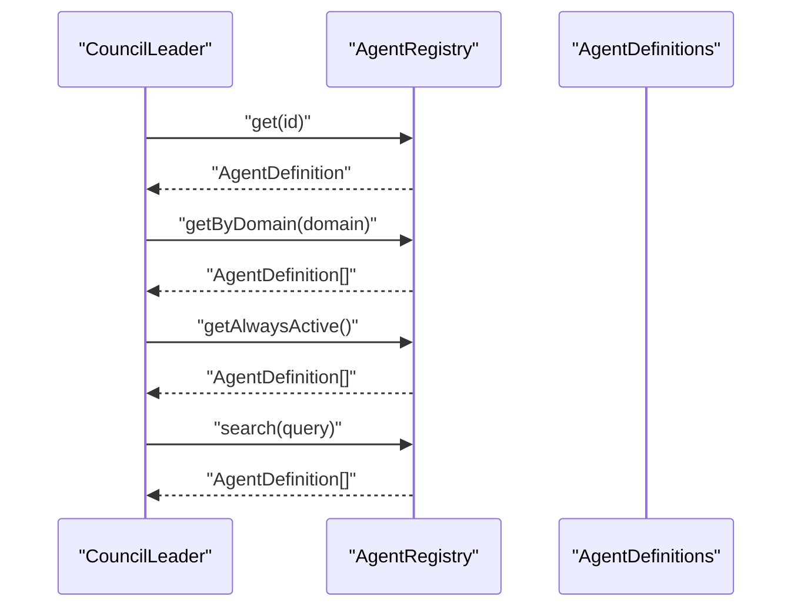
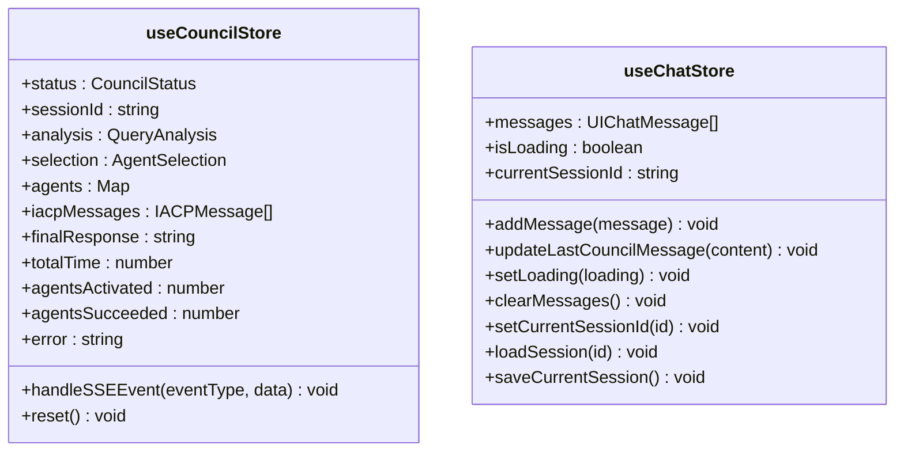
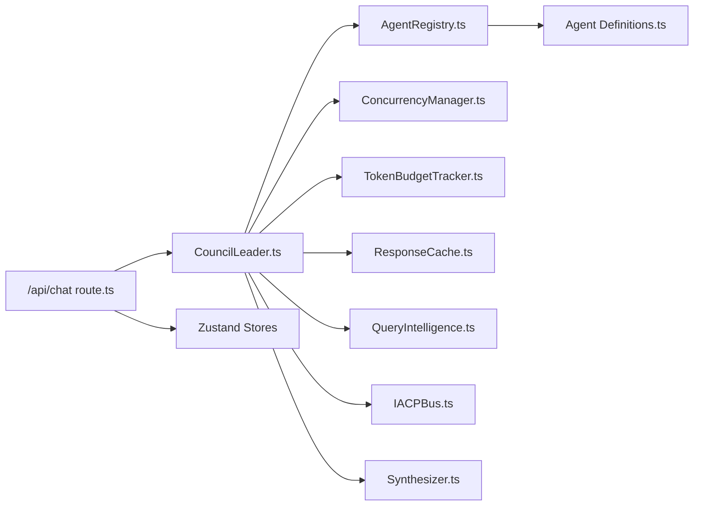
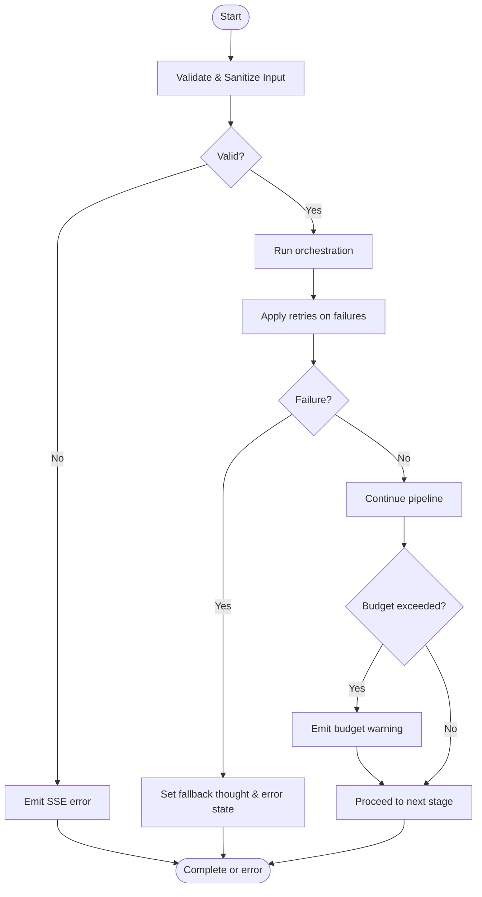

# Component Interaction Patterns

<cite>
**Referenced Files in This Document**
- [src/app/api/chat/route.ts](file://src/app/api/chat/route.ts)
- [src/core/council/leader.ts](file://src/core/council/leader.ts)
- [src/core/council/selector.ts](file://src/core/council/selector.ts)
- [src/core/council/synthesizer.ts](file://src/core/council/synthesizer.ts)
- [src/core/agents/registry.ts](file://src/core/agents/registry.ts)
- [src/core/agents/definitions/index.ts](file://src/core/agents/definitions/index.ts)
- [src/core/agents/base-agent.ts](file://src/core/agents/base-agent.ts)
- [src/core/iacp/bus.ts](file://src/core/iacp/bus.ts)
- [src/core/concurrency/manager.ts](file://src/core/concurrency/manager.ts)
- [src/core/budget/tracker.ts](file://src/core/budget/tracker.ts)
- [src/lib/cache.ts](file://src/lib/cache.ts)
- [src/lib/query-intelligence.ts](file://src/lib/query-intelligence.ts)
- [src/hooks/use-chat.ts](file://src/hooks/use-chat.ts)
- [src/stores/chat-store.ts](file://src/stores/chat-store.ts)
- [src/stores/council-store.ts](file://src/stores/council-store.ts)
- [src/components/chat/chat-input.tsx](file://src/components/chat/chat-input.tsx)
- [src/types/index.ts](file://src/types/index.ts)
- [src/types/council.ts](file://src/types/council.ts)
- [src/types/agent.ts](file://src/types/agent.ts)
- [src/types/iacp.ts](file://src/types/iacp.ts)
- [src/lib/errors.ts](file://src/lib/errors.ts)
</cite>

## Table of Contents
1. [Introduction](#introduction)
2. [Project Structure](#project-structure)
3. [Core Components](#core-components)
4. [Architecture Overview](#architecture-overview)
5. [Detailed Component Analysis](#detailed-component-analysis)
6. [Dependency Analysis](#dependency-analysis)
7. [Performance Considerations](#performance-considerations)
8. [Troubleshooting Guide](#troubleshooting-guide)
9. [Conclusion](#conclusion)

## Introduction
This document explains the component interaction patterns in the Deep Thinking AI system with a focus on:
- Mediator pattern via the Council Leader orchestrating multi-agent workflows
- Observer pattern for real-time event streaming using Server-Sent Events (SSE)
- Factory pattern for dynamic agent instantiation through the Agent Registry
- The IACP bus as a communication mediator among agents
- The agent registry managing component lifecycle
- Zustand stores facilitating state synchronization across components

It also includes sequence diagrams for typical user-to-response flows, error propagation patterns, and decoupling strategies.

## Project Structure
The system is organized around a frontend React application and a Next.js API layer. Core orchestration logic resides in the backend, while UI state is managed with Zustand stores. Agents are defined centrally and instantiated dynamically during runtime.

**Diagram sources**
- [src/app/api/chat/route.ts:1-222](file://src/app/api/chat/route.ts#L1-L222)
- [src/core/council/leader.ts:1-714](file://src/core/council/leader.ts#L1-L714)
- [src/core/council/selector.ts](file://src/core/council/selector.ts)
- [src/core/council/synthesizer.ts](file://src/core/council/synthesizer.ts)
- [src/core/agents/registry.ts:1-58](file://src/core/agents/registry.ts#L1-L58)
- [src/core/agents/definitions/index.ts:1-38](file://src/core/agents/definitions/index.ts#L1-L38)
- [src/core/iacp/bus.ts:1-210](file://src/core/iacp/bus.ts#L1-L210)
- [src/core/concurrency/manager.ts:1-55](file://src/core/concurrency/manager.ts#L1-L55)
- [src/core/budget/tracker.ts](file://src/core/budget/tracker.ts)
- [src/lib/cache.ts](file://src/lib/cache.ts)
- [src/lib/query-intelligence.ts](file://src/lib/query-intelligence.ts)
- [src/hooks/use-chat.ts:1-158](file://src/hooks/use-chat.ts#L1-L158)
- [src/stores/council-store.ts:1-188](file://src/stores/council-store.ts#L1-L188)
- [src/stores/chat-store.ts:1-132](file://src/stores/chat-store.ts#L1-L132)
- [src/components/chat/chat-input.tsx:1-86](file://src/components/chat/chat-input.tsx#L1-L86)

**Section sources**
- [src/app/api/chat/route.ts:1-222](file://src/app/api/chat/route.ts#L1-L222)
- [src/core/council/leader.ts:1-714](file://src/core/council/leader.ts#L1-L714)
- [src/core/agents/registry.ts:1-58](file://src/core/agents/registry.ts#L1-L58)
- [src/core/agents/definitions/index.ts:1-38](file://src/core/agents/definitions/index.ts#L1-L38)
- [src/stores/council-store.ts:1-188](file://src/stores/council-store.ts#L1-L188)
- [src/stores/chat-store.ts:1-132](file://src/stores/chat-store.ts#L1-L132)
- [src/hooks/use-chat.ts:1-158](file://src/hooks/use-chat.ts#L1-L158)
- [src/components/chat/chat-input.tsx:1-86](file://src/components/chat/chat-input.tsx#L1-L86)

## Core Components
- Council Leader: Central orchestrator implementing the mediator pattern. It coordinates query analysis, agent selection, concurrent thinking, optional IACP discussion, verification loops, and synthesis. It emits SSE events consumed by the UI.
- Agent Registry: Implements the factory pattern for dynamic agent instantiation. It indexes agents by domain and supports always-active agents.
- IACP Bus: Communication mediator enabling agent-to-agent messaging with routing hints, threading, and priority-based delivery.
- Concurrency Manager: Enforces concurrency limits across agent tasks.
- Token Budget Tracker: Tracks token usage and emits warnings when thresholds are approached.
- Zustand Stores: Provide reactive state synchronized across UI components (council and chat).
- SSE Streaming: Real-time event streaming from the API to the UI.

**Section sources**
- [src/core/council/leader.ts:33-714](file://src/core/council/leader.ts#L33-L714)
- [src/core/agents/registry.ts:4-58](file://src/core/agents/registry.ts#L4-L58)
- [src/core/iacp/bus.ts:15-210](file://src/core/iacp/bus.ts#L15-L210)
- [src/core/concurrency/manager.ts:1-55](file://src/core/concurrency/manager.ts#L1-L55)
- [src/core/budget/tracker.ts](file://src/core/budget/tracker.ts)
- [src/stores/council-store.ts:41-188](file://src/stores/council-store.ts#L41-L188)
- [src/stores/chat-store.ts:18-132](file://src/stores/chat-store.ts#L18-L132)

## Architecture Overview
The system follows a layered architecture:
- Presentation Layer: React UI components and Zustand stores
- Application Layer: Next.js API route handling requests and emitting SSE
- Orchestration Layer: Council Leader coordinating agents and workflows
- Infrastructure Layer: Agent Registry, IACP Bus, concurrency and budget controls

**Diagram sources**
- [src/app/api/chat/route.ts:88-222](file://src/app/api/chat/route.ts#L88-L222)
- [src/core/council/leader.ts:42-604](file://src/core/council/leader.ts#L42-L604)
- [src/core/agents/registry.ts:4-58](file://src/core/agents/registry.ts#L4-L58)
- [src/core/agents/definitions/index.ts:11-23](file://src/core/agents/definitions/index.ts#L11-L23)
- [src/core/concurrency/manager.ts:29-54](file://src/core/concurrency/manager.ts#L29-L54)
- [src/core/budget/tracker.ts](file://src/core/budget/tracker.ts)
- [src/lib/cache.ts](file://src/lib/cache.ts)
- [src/lib/query-intelligence.ts](file://src/lib/query-intelligence.ts)
- [src/core/iacp/bus.ts:15-210](file://src/core/iacp/bus.ts#L15-L210)
- [src/core/council/synthesizer.ts](file://src/core/council/synthesizer.ts)

## Detailed Component Analysis

### Mediator Pattern: Council Leader
The Council Leader coordinates multi-agent workflows:
- Query analysis and optimization
- Agent selection using the selector module
- Dynamic agent instantiation via the Agent Registry
- Concurrent execution with a concurrency manager
- Optional IACP discussion among agents
- Verification loops and synthesis
- SSE event emission for real-time UI updates

**Diagram sources**
- [src/core/council/leader.ts:33-714](file://src/core/council/leader.ts#L33-L714)
- [src/core/agents/registry.ts:4-58](file://src/core/agents/registry.ts#L4-L58)
- [src/core/concurrency/manager.ts:29-54](file://src/core/concurrency/manager.ts#L29-L54)
- [src/core/iacp/bus.ts:15-210](file://src/core/iacp/bus.ts#L15-L210)
- [src/core/budget/tracker.ts](file://src/core/budget/tracker.ts)
- [src/lib/cache.ts](file://src/lib/cache.ts)
- [src/lib/query-intelligence.ts](file://src/lib/query-intelligence.ts)
- [src/core/council/synthesizer.ts](file://src/core/council/synthesizer.ts)

**Section sources**
- [src/core/council/leader.ts:42-604](file://src/core/council/leader.ts#L42-L604)
- [src/core/council/selector.ts](file://src/core/council/selector.ts)
- [src/core/council/synthesizer.ts](file://src/core/council/synthesizer.ts)
- [src/core/agents/registry.ts:4-58](file://src/core/agents/registry.ts#L4-L58)

### Observer Pattern: Real-Time Event Streaming (SSE)
The API streams structured events to the client:
- Events include phases like analysis, selection, thinking, discussion, verification, synthesis, and completion
- The client’s hook parses SSE chunks and updates Zustand stores
- UI components subscribe to store state changes

**Diagram sources**
- [src/components/chat/chat-input.tsx:13-86](file://src/components/chat/chat-input.tsx#L13-L86)
- [src/hooks/use-chat.ts:22-128](file://src/hooks/use-chat.ts#L22-L128)
- [src/app/api/chat/route.ts:88-222](file://src/app/api/chat/route.ts#L88-L222)
- [src/core/council/leader.ts:42-604](file://src/core/council/leader.ts#L42-L604)
- [src/stores/council-store.ts:54-171](file://src/stores/council-store.ts#L54-L171)
- [src/stores/chat-store.ts:23-40](file://src/stores/chat-store.ts#L23-L40)

**Section sources**
- [src/hooks/use-chat.ts:22-128](file://src/hooks/use-chat.ts#L22-L128)
- [src/app/api/chat/route.ts:147-222](file://src/app/api/chat/route.ts#L147-L222)
- [src/stores/council-store.ts:54-171](file://src/stores/council-store.ts#L54-L171)
- [src/stores/chat-store.ts:23-40](file://src/stores/chat-store.ts#L23-L40)

### Factory Pattern: Dynamic Agent Instantiation
The Agent Registry centralizes agent definitions and provides factory-like methods:
- Indexes agents by domain for efficient selection
- Supplies always-active agents for verification and discussion
- Returns agent definitions used by the leader to build agent instances

**Diagram sources**
- [src/core/agents/registry.ts:4-58](file://src/core/agents/registry.ts#L4-L58)
- [src/core/agents/definitions/index.ts:11-23](file://src/core/agents/definitions/index.ts#L11-L23)
- [src/types/agent.ts:25-36](file://src/types/agent.ts#L25-L36)

**Section sources**
- [src/core/agents/registry.ts:4-58](file://src/core/agents/registry.ts#L4-L58)
- [src/core/agents/definitions/index.ts:11-23](file://src/core/agents/definitions/index.ts#L11-L23)
- [src/types/agent.ts:25-36](file://src/types/agent.ts#L25-L36)

### IACP Bus: Agent Communication Mediator
The IACP Bus enables agent-to-agent messaging:
- Posts messages with priority and routing hints
- Filters messages per agent with domain/expertise targeting
- Manages threading and statistics
- Integrates with the leader’s discussion phase

**Diagram sources**
- [src/core/iacp/bus.ts:39-66](file://src/core/iacp/bus.ts#L39-L66)
- [src/core/iacp/bus.ts:72-94](file://src/core/iacp/bus.ts#L72-L94)
- [src/core/iacp/bus.ts:176-208](file://src/core/iacp/bus.ts#L176-L208)

**Section sources**
- [src/core/iacp/bus.ts:15-210](file://src/core/iacp/bus.ts#L15-L210)
- [src/types/iacp.ts:27-47](file://src/types/iacp.ts#L27-L47)

### Agent Registry Lifecycle Management
The registry initializes from centralized definitions and exposes methods to:
- Retrieve agents by ID or domain
- Obtain always-active agents for verification and discussion
- Search agents by query terms
- Enumerate supported domains and total count

**Diagram sources**
- [src/core/council/leader.ts:146-179](file://src/core/council/leader.ts#L146-L179)
- [src/core/agents/registry.ts:21-46](file://src/core/agents/registry.ts#L21-L46)
- [src/core/agents/definitions/index.ts:11-23](file://src/core/agents/definitions/index.ts#L11-L23)

**Section sources**
- [src/core/agents/registry.ts:4-58](file://src/core/agents/registry.ts#L4-L58)
- [src/core/council/leader.ts:146-179](file://src/core/council/leader.ts#L146-L179)

### Zustand Stores: State Synchronization
Two stores synchronize UI state:
- Council Store: Tracks council phases, agent statuses, IACP messages, and final response
- Chat Store: Manages UI chat messages, loading state, and session persistence

**Diagram sources**
- [src/stores/council-store.ts:24-188](file://src/stores/council-store.ts#L24-L188)
- [src/stores/chat-store.ts:4-132](file://src/stores/chat-store.ts#L4-L132)

**Section sources**
- [src/stores/council-store.ts:41-188](file://src/stores/council-store.ts#L41-L188)
- [src/stores/chat-store.ts:18-132](file://src/stores/chat-store.ts#L18-L132)

## Dependency Analysis
The following diagram highlights key dependencies among orchestration components:

**Diagram sources**
- [src/app/api/chat/route.ts:88-222](file://src/app/api/chat/route.ts#L88-L222)
- [src/core/council/leader.ts:13-22](file://src/core/council/leader.ts#L13-L22)
- [src/core/agents/registry.ts:1-58](file://src/core/agents/registry.ts#L1-L58)
- [src/core/agents/definitions/index.ts:1-38](file://src/core/agents/definitions/index.ts#L1-L38)
- [src/core/concurrency/manager.ts:1-55](file://src/core/concurrency/manager.ts#L1-L55)
- [src/core/budget/tracker.ts](file://src/core/budget/tracker.ts)
- [src/lib/cache.ts](file://src/lib/cache.ts)
- [src/lib/query-intelligence.ts](file://src/lib/query-intelligence.ts)
- [src/core/iacp/bus.ts:1-210](file://src/core/iacp/bus.ts#L1-L210)
- [src/core/council/synthesizer.ts](file://src/core/council/synthesizer.ts)
- [src/stores/council-store.ts:1-188](file://src/stores/council-store.ts#L1-L188)
- [src/stores/chat-store.ts:1-132](file://src/stores/chat-store.ts#L1-L132)

**Section sources**
- [src/app/api/chat/route.ts:88-222](file://src/app/api/chat/route.ts#L88-L222)
- [src/core/council/leader.ts:13-22](file://src/core/council/leader.ts#L13-L22)
- [src/core/agents/registry.ts:1-58](file://src/core/agents/registry.ts#L1-L58)
- [src/core/agents/definitions/index.ts:1-38](file://src/core/agents/definitions/index.ts#L1-L38)
- [src/core/concurrency/manager.ts:1-55](file://src/core/concurrency/manager.ts#L1-L55)
- [src/core/budget/tracker.ts](file://src/core/budget/tracker.ts)
- [src/lib/cache.ts](file://src/lib/cache.ts)
- [src/lib/query-intelligence.ts](file://src/lib/query-intelligence.ts)
- [src/core/iacp/bus.ts:1-210](file://src/core/iacp/bus.ts#L1-L210)
- [src/core/council/synthesizer.ts](file://src/core/council/synthesizer.ts)
- [src/stores/council-store.ts:1-188](file://src/stores/council-store.ts#L1-L188)
- [src/stores/chat-store.ts:1-132](file://src/stores/chat-store.ts#L1-L132)

## Performance Considerations
- Concurrency control: The Concurrency Manager limits simultaneous agent tasks to prevent provider throttling and resource exhaustion.
- Token budgeting: The Token Budget Tracker records usage per agent and warns near thresholds; synthesis and verification usage are tracked separately.
- Caching: Response caching avoids recomputation for identical queries.
- Query intelligence: Preprocessing improves agent selection quality and reduces unnecessary agent activations.
- IACP batching: Discussion rounds are constrained by budget checks and agent participation rules.

[No sources needed since this section provides general guidance]

## Troubleshooting Guide
Common error propagation patterns:
- Validation and sanitization in the API route prevent malformed or unsafe inputs and surface errors as SSE “council:error” events.
- Provider failures are retried with retry wrappers; individual agent failures are handled gracefully with fallback responses and error state updates.
- Budget exceeded conditions trigger warnings and short-circuit later stages.
- UI handles AbortErrors for cancellation and displays error messages in the last council message.

**Diagram sources**
- [src/app/api/chat/route.ts:88-222](file://src/app/api/chat/route.ts#L88-L222)
- [src/core/council/leader.ts:278-285](file://src/core/council/leader.ts#L278-L285)
- [src/core/council/leader.ts:606-624](file://src/core/council/leader.ts#L606-L624)
- [src/lib/errors.ts:1-79](file://src/lib/errors.ts#L1-L79)

**Section sources**
- [src/app/api/chat/route.ts:88-222](file://src/app/api/chat/route.ts#L88-L222)
- [src/core/council/leader.ts:278-285](file://src/core/council/leader.ts#L278-L285)
- [src/core/council/leader.ts:606-624](file://src/core/council/leader.ts#L606-L624)
- [src/lib/errors.ts:1-79](file://src/lib/errors.ts#L1-L79)

## Conclusion
The Deep Thinking AI system achieves robust, decoupled interactions through:
- A central mediator (Council Leader) orchestrating heterogeneous agents
- An SSE-based observer pattern for real-time UI updates
- A factory-backed registry enabling dynamic agent instantiation
- An IACP bus mediating agent-to-agent communication
- Zustand stores synchronizing state across components
- Built-in error handling, retries, and budget controls ensuring resilience

These patterns collectively support scalable, maintainable multi-agent workflows with clear separation of concerns.