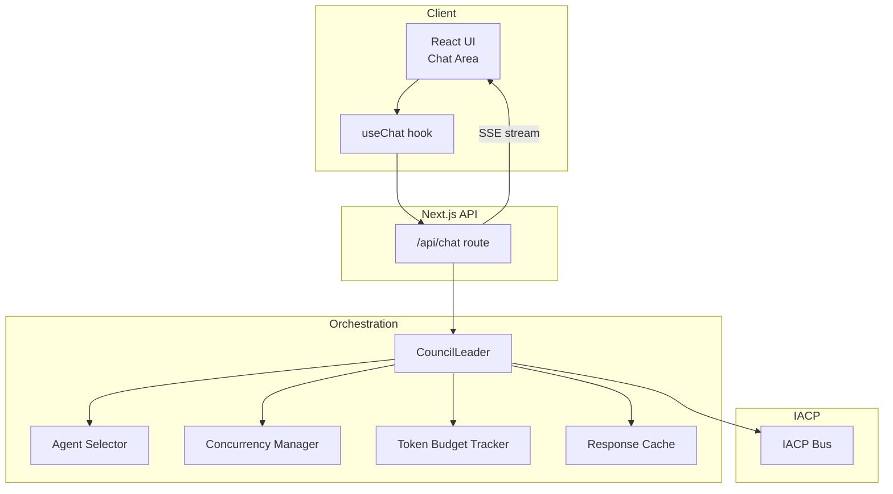
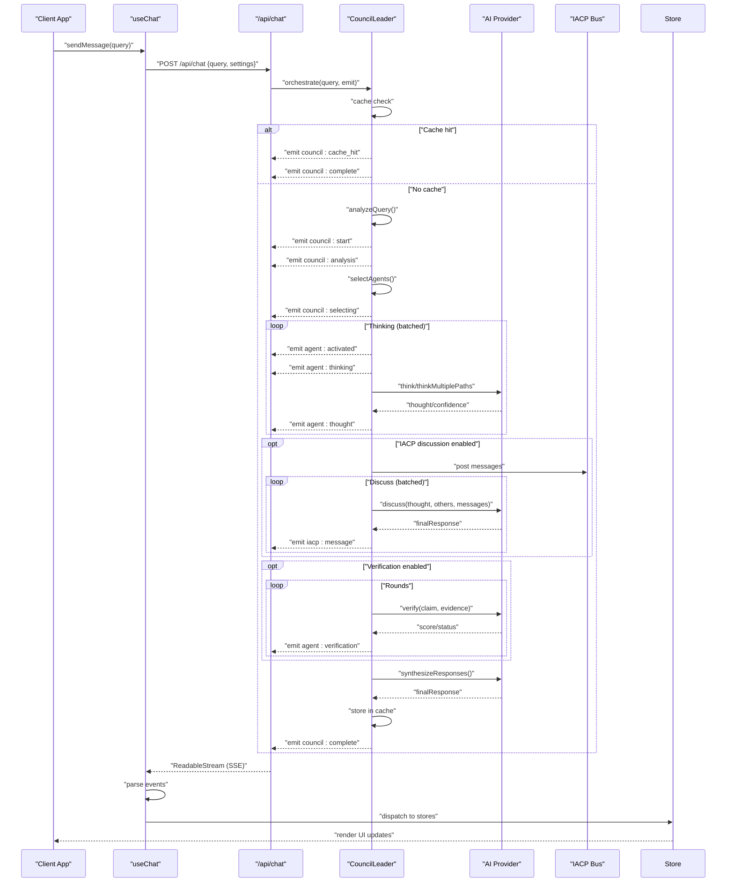
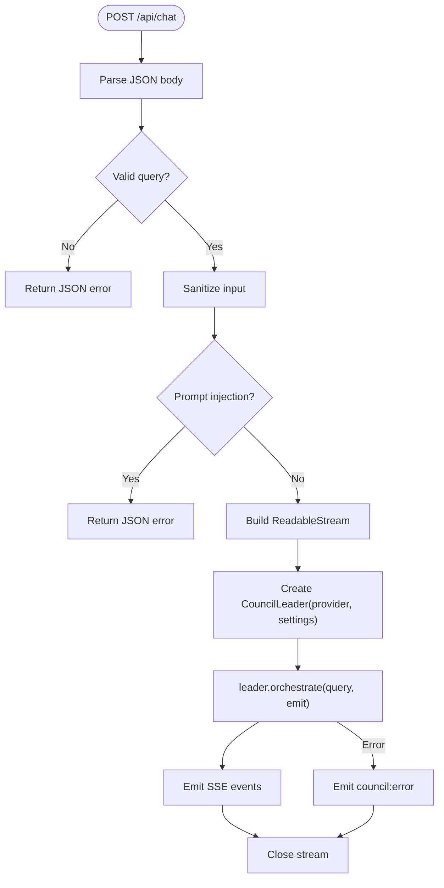
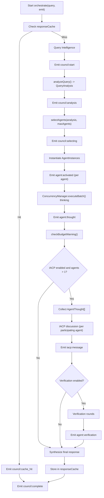
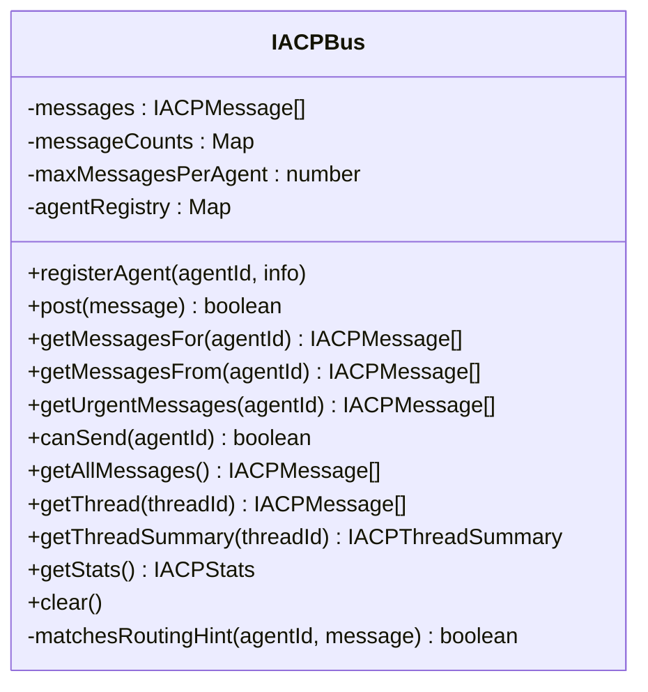
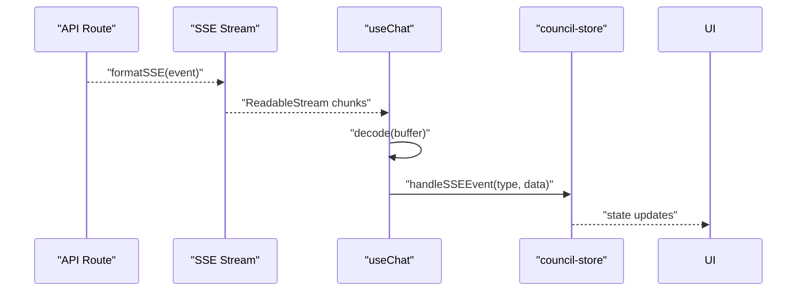
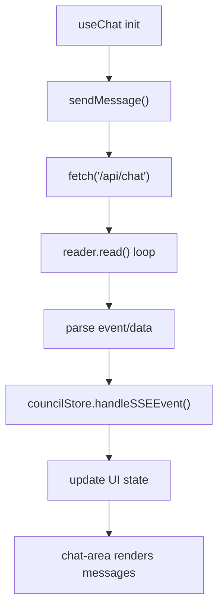
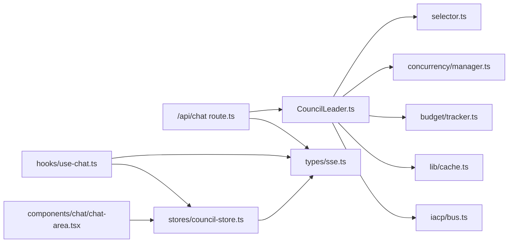

# Data Flow and Processing Pipeline

<cite>
**Referenced Files in This Document**
- [route.ts](file://src/app/api/chat/route.ts)
- [leader.ts](file://src/core/council/leader.ts)
- [bus.ts](file://src/core/iacp/bus.ts)
- [sse.ts](file://src/types/sse.ts)
- [use-chat.ts](file://src/hooks/use-chat.ts)
- [chat-area.tsx](file://src/components/chat/chat-area.tsx)
- [manager.ts](file://src/core/concurrency/manager.ts)
- [tracker.ts](file://src/core/budget/tracker.ts)
- [cache.ts](file://src/lib/cache.ts)
- [council-store.ts](file://src/stores/council-store.ts)
- [selector.ts](file://src/core/council/selector.ts)
- [index.ts](file://src/types/index.ts)
</cite>

## Table of Contents
1. [Introduction](#introduction)
2. [Project Structure](#project-structure)
3. [Core Components](#core-components)
4. [Architecture Overview](#architecture-overview)
5. [Detailed Component Analysis](#detailed-component-analysis)
6. [Dependency Analysis](#dependency-analysis)
7. [Performance Considerations](#performance-considerations)
8. [Troubleshooting Guide](#troubleshooting-guide)
9. [Conclusion](#conclusion)

## Introduction
This document explains the complete data flow and processing pipeline for the chat system, from a user’s query submission through the Next.js API route handler, into the Council Leader orchestration system, across IACP agent communication, and back to real-time streaming responses via Server-Sent Events (SSE). It documents SSE event types, payload structures, client-side handling, data transformation stages, state management patterns, and consistency mechanisms across distributed agent processing. Flowcharts illustrate typical processing paths and error handling scenarios.

## Project Structure
The chat pipeline spans several layers:
- API route handler: validates input, builds SSE stream, and delegates orchestration to the Council Leader.
- Orchestration: query analysis, agent selection, concurrent thinking, optional IACP discussion, verification loop, synthesis, and caching.
- SSE types: strongly typed event definitions and payloads.
- Client: fetches SSE stream, parses events, updates stores, and renders UI.

**Diagram sources**
- [route.ts:88-222](file://src/app/api/chat/route.ts#L88-L222)
- [leader.ts:42-604](file://src/core/council/leader.ts#L42-L604)
- [selector.ts:27-164](file://src/core/council/selector.ts#L27-L164)
- [manager.ts:29-53](file://src/core/concurrency/manager.ts#L29-L53)
- [tracker.ts:3-77](file://src/core/budget/tracker.ts#L3-L77)
- [cache.ts:34-205](file://src/lib/cache.ts#L34-L205)
- [bus.ts:15-209](file://src/core/iacp/bus.ts#L15-L209)

**Section sources**
- [route.ts:88-222](file://src/app/api/chat/route.ts#L88-L222)
- [leader.ts:42-604](file://src/core/council/leader.ts#L42-L604)
- [sse.ts:6-112](file://src/types/sse.ts#L6-L112)

## Core Components
- Next.js API route handler: Parses request, validates and sanitizes query, resolves provider, constructs SSE stream, and invokes the Council Leader.
- Council Leader: Orchestrates the full pipeline, emits structured SSE events, manages concurrency, tracks token budget, and coordinates IACP discussion and verification.
- IACP Bus: Manages agent messaging, threading, routing hints, and statistics.
- SSE Types: Defines event types and payloads for real-time updates.
- Client Hooks and Stores: Fetches SSE, parses events, updates Zustand stores, and renders UI.

**Section sources**
- [route.ts:88-222](file://src/app/api/chat/route.ts#L88-L222)
- [leader.ts:33-604](file://src/core/council/leader.ts#L33-L604)
- [bus.ts:15-209](file://src/core/iacp/bus.ts#L15-L209)
- [sse.ts:6-112](file://src/types/sse.ts#L6-L112)
- [use-chat.ts:22-128](file://src/hooks/use-chat.ts#L22-L128)
- [council-store.ts:41-187](file://src/stores/council-store.ts#L41-L187)

## Architecture Overview
The system uses a streaming SSE architecture to deliver incremental updates as the Council Leader orchestrates agents. The client decodes the stream line-by-line, parsing event names and JSON payloads, then dispatches events to Zustand stores for UI rendering.

**Diagram sources**
- [route.ts:88-222](file://src/app/api/chat/route.ts#L88-L222)
- [leader.ts:42-604](file://src/core/council/leader.ts#L42-L604)
- [bus.ts:39-111](file://src/core/iacp/bus.ts#L39-L111)
- [use-chat.ts:48-126](file://src/hooks/use-chat.ts#L48-L126)
- [council-store.ts:54-171](file://src/stores/council-store.ts#L54-L171)

## Detailed Component Analysis

### API Route Handler (/api/chat)
Responsibilities:
- Validate and sanitize input.
- Detect prompt injection attempts.
- Resolve provider credentials from environment variables.
- Build a ReadableStream emitting Server-Sent Events.
- Instantiate the Council Leader and delegate orchestration.
- Emit structured events and handle errors.

Key behaviors:
- Input validation and sanitization prevent malformed or unsafe queries.
- Provider resolution ensures client-provided keys are ignored.
- SSE stream uses a TextEncoder and a custom formatter.
- On error, emits a “council:error” event and closes the stream.

**Diagram sources**
- [route.ts:88-222](file://src/app/api/chat/route.ts#L88-L222)

**Section sources**
- [route.ts:88-222](file://src/app/api/chat/route.ts#L88-L222)

### Council Leader Orchestration
Responsibilities:
- Query intelligence and cache lookup.
- Query analysis to determine domains and agent count.
- Agent selection with performance-aware ranking.
- Concurrent agent thinking with batching and retries.
- Optional IACP discussion among agents.
- Verification loop for claims.
- Synthesis and caching of final response.
- Token budget tracking and warnings.

Processing highlights:
- Cache check emits “council:cache_hit” and “council:complete” early if matched.
- Emits lifecycle events: “council:start”, “council:analysis”, “council:selecting”.
- Emits per-agent events: “agent:activated”, “agent:thinking”, “agent:thought”, “agent:error”.
- Conditional IACP events: “iacp:message”.
- Verification events: “agent:verification”.
- Finalization: “council:synthesizing”, “council:complete”.

**Diagram sources**
- [leader.ts:42-604](file://src/core/council/leader.ts#L42-L604)
- [cache.ts:71-93](file://src/lib/cache.ts#L71-L93)
- [manager.ts:29-53](file://src/core/concurrency/manager.ts#L29-L53)
- [bus.ts:39-111](file://src/core/iacp/bus.ts#L39-L111)

**Section sources**
- [leader.ts:42-604](file://src/core/council/leader.ts#L42-L604)
- [selector.ts:27-164](file://src/core/council/selector.ts#L27-L164)
- [manager.ts:29-53](file://src/core/concurrency/manager.ts#L29-L53)
- [tracker.ts:3-77](file://src/core/budget/tracker.ts#L3-L77)
- [cache.ts:34-205](file://src/lib/cache.ts#L34-L205)

### IACP Agent Communication
The IACP Bus manages agent messaging, threading, routing, and statistics:
- Posting messages with priority and limits.
- Filtering messages per agent with routing hints.
- Threaded conversations and summaries.
- Statistics collection for monitoring.

**Diagram sources**
- [bus.ts:15-209](file://src/core/iacp/bus.ts#L15-L209)

**Section sources**
- [bus.ts:15-209](file://src/core/iacp/bus.ts#L15-L209)

### Server-Sent Events (SSE) Architecture
Event types and payloads are defined centrally and emitted by the Council Leader. The client decodes the stream and dispatches events to stores.

Event types and payloads:
- “council:start”: { sessionId, query }
- “council:analysis”: { analysis: QueryAnalysis }
- “council:selecting”: { selection: AgentSelection }
- “agent:activated”: { agentId, agentName, domain, role, batchIndex }
- “agent:thinking”: { agentId, branch?, totalBranches? }
- “agent:thought”: { agentId, thought, confidence, processingTime, branches?, selectedBranch? }
- “agent:branch”: { agentId, branch, thought, confidence }
- “agent:verification”: { agentId, targetAgentId, claim, score, status, issues, round }
- “agent:error”: { agentId, error }
- “iacp:message”: { message: IACPMessage }
- “council:synthesizing”: { agentCount, reason? }
- “council:synthesis_progress”: { phase, content, agentsProcessed, totalAgents, consensusScore? }
- “council:budget_warning”: { warning, percentUsed, remaining }
- “council:complete”: { response, totalTime, agentsActivated, agentsSucceeded, totalTokens, tokenUsage? }
- “council:cache_hit”: { query, response, cachedAt }
- “council:clarification_needed”: { suggestions, reasons, complexity }
- “council:error”: { error }

Client-side handling:
- Uses a TextDecoder and line-buffered parsing to reconstruct events.
- Dispatches events to Zustand stores and updates the last council message.
- Supports aborting generation and auto-saving sessions on completion.

**Diagram sources**
- [route.ts:46-48](file://src/app/api/chat/route.ts#L46-L48)
- [use-chat.ts:68-112](file://src/hooks/use-chat.ts#L68-L112)
- [council-store.ts:54-171](file://src/stores/council-store.ts#L54-L171)
- [sse.ts:6-112](file://src/types/sse.ts#L6-L112)

**Section sources**
- [sse.ts:6-112](file://src/types/sse.ts#L6-L112)
- [use-chat.ts:68-112](file://src/hooks/use-chat.ts#L68-L112)
- [council-store.ts:54-171](file://src/stores/council-store.ts#L54-L171)

### Client-Side State Management and Rendering
State management pattern:
- Zustand stores track council status, agents, IACP messages, and final response.
- The client hook fetches SSE, parses events, and dispatches to stores.
- UI components subscribe to stores and render progress, warnings, and final results.

**Diagram sources**
- [use-chat.ts:22-128](file://src/hooks/use-chat.ts#L22-L128)
- [council-store.ts:41-187](file://src/stores/council-store.ts#L41-L187)
- [chat-area.tsx:173-331](file://src/components/chat/chat-area.tsx#L173-L331)

**Section sources**
- [use-chat.ts:22-128](file://src/hooks/use-chat.ts#L22-L128)
- [council-store.ts:41-187](file://src/stores/council-store.ts#L41-L187)
- [chat-area.tsx:173-331](file://src/components/chat/chat-area.tsx#L173-L331)

## Dependency Analysis
High-level dependencies:
- The API route depends on the Council Leader, providers, and SSE types.
- The Council Leader depends on selector, concurrency manager, budget tracker, cache, and IACP bus.
- Client hooks depend on stores and SSE types.

**Diagram sources**
- [route.ts:1-11](file://src/app/api/chat/route.ts#L1-L11)
- [leader.ts:1-22](file://src/core/council/leader.ts#L1-L22)
- [selector.ts:1-5](file://src/core/council/selector.ts#L1-L5)
- [manager.ts:1-1](file://src/core/concurrency/manager.ts#L1-L1)
- [tracker.ts:1-2](file://src/core/budget/tracker.ts#L1-L2)
- [cache.ts:1-4](file://src/lib/cache.ts#L1-L4)
- [bus.ts:1-2](file://src/core/iacp/bus.ts#L1-L2)
- [use-chat.ts:1-7](file://src/hooks/use-chat.ts#L1-L7)
- [council-store.ts:1-9](file://src/stores/council-store.ts#L1-L9)
- [chat-area.tsx:1-10](file://src/components/chat/chat-area.tsx#L1-L10)
- [sse.ts:1-5](file://src/types/sse.ts#L1-L5)
- [index.ts:1-7](file://src/types/index.ts#L1-L7)

**Section sources**
- [index.ts:1-7](file://src/types/index.ts#L1-L7)

## Performance Considerations
- Concurrency control: Batching tasks with a concurrency manager prevents resource contention and improves throughput.
- Token budgeting: Real-time budget checks and warnings help avoid exceeding limits; usage is aggregated per agent and globally.
- Caching: Response cache reduces latency and cost for repeated queries; normalization and TTL ensure relevance.
- Retry strategy: With retry wrappers around provider calls, transient failures are mitigated without breaking the pipeline.
- SSE streaming: Incremental updates reduce perceived latency and enable responsive UI.

[No sources needed since this section provides general guidance]

## Troubleshooting Guide
Common issues and handling:
- Prompt injection detected: The API route rejects the request with a safety-filter error before orchestration begins.
- Invalid JSON body: The API route returns a JSON error response with a 400 status.
- Provider errors: The Council Leader emits a “council:error” event; the client displays an error message and sets loading to false.
- Client-side parsing errors: Malformed SSE lines are skipped; the client continues processing subsequent events.
- Abort generation: The client can cancel the fetch; the controller aborts the request and resets loading state.

**Section sources**
- [route.ts:56-65](file://src/app/api/chat/route.ts#L56-L65)
- [route.ts:198-207](file://src/app/api/chat/route.ts#L198-L207)
- [use-chat.ts:113-125](file://src/hooks/use-chat.ts#L113-L125)

## Conclusion
The chat system implements a robust, real-time orchestration pipeline using SSE to stream structured updates from the API route through the Council Leader to the client. Strong typing of events, centralized state management, and distributed agent processing with IACP discussion and verification ensure both transparency and quality. Token budgeting, caching, and concurrency controls maintain performance and reliability across complex reasoning workflows.