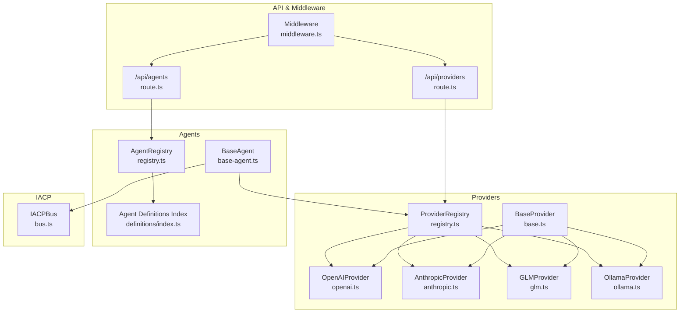
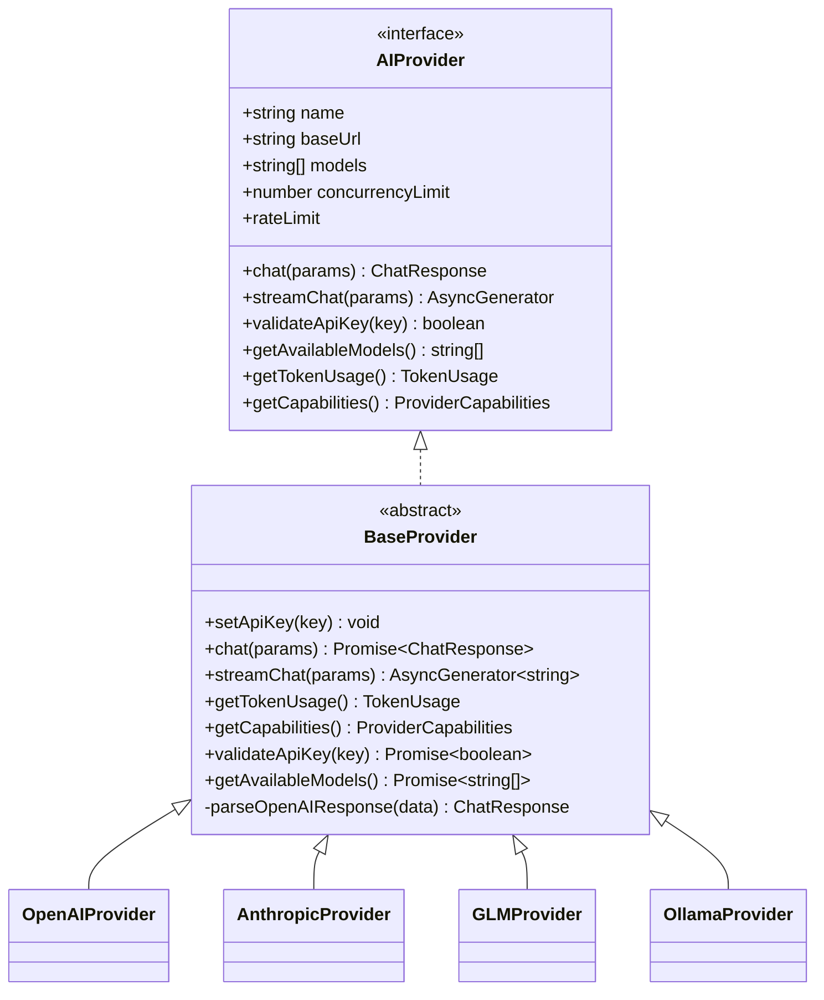
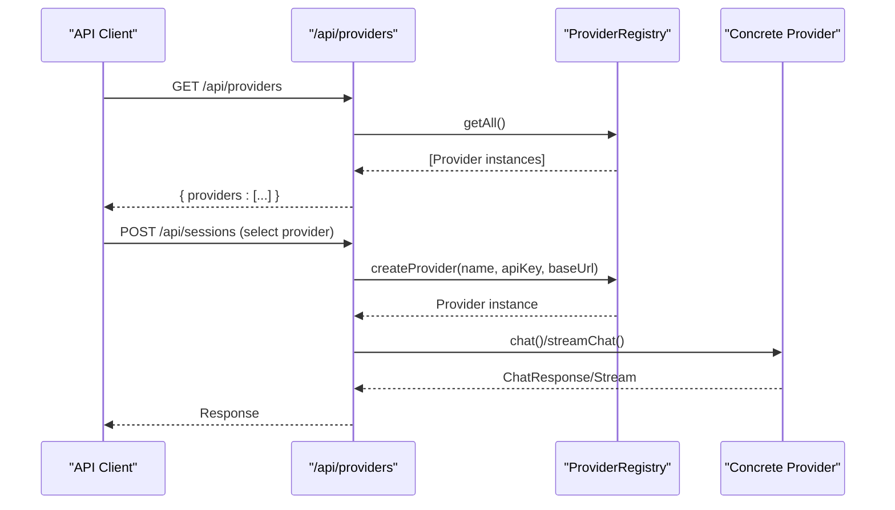
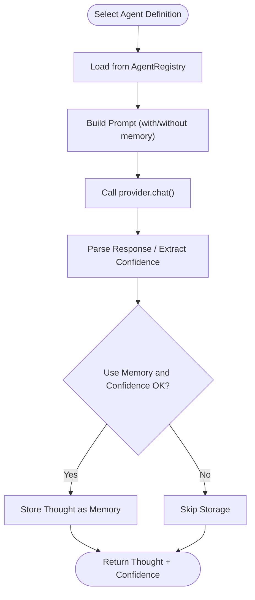
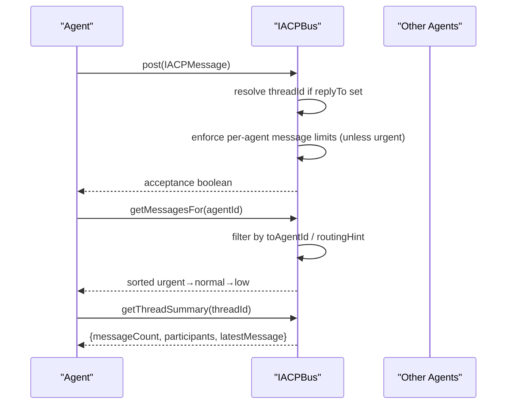
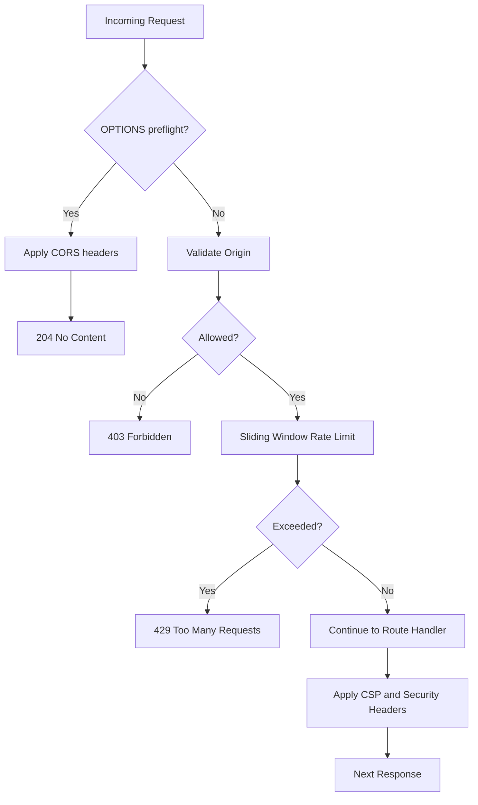
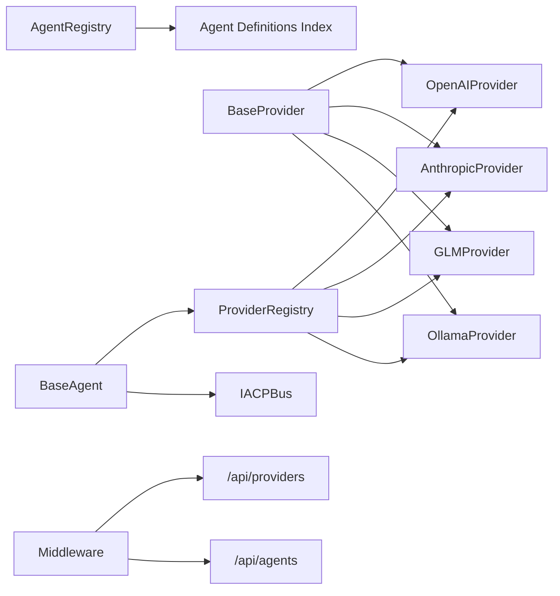

# Integration and Extension Patterns

<cite>
**Referenced Files in This Document**
- [registry.ts](file://src/core/providers/registry.ts)
- [base.ts](file://src/core/providers/base.ts)
- [openai.ts](file://src/core/providers/openai.ts)
- [anthropic.ts](file://src/core/providers/anthropic.ts)
- [glm.ts](file://src/core/providers/glm.ts)
- [ollama.ts](file://src/core/providers/ollama.ts)
- [registry.ts](file://src/core/agents/registry.ts)
- [base-agent.ts](file://src/core/agents/base-agent.ts)
- [index.ts](file://src/core/agents/definitions/index.ts)
- [bus.ts](file://src/core/iacp/bus.ts)
- [route.ts](file://src/app/api/providers/route.ts)
- [route.ts](file://src/app/api/agents/route.ts)
- [middleware.ts](file://src/middleware.ts)
- [provider.ts](file://src/types/provider.ts)
- [agent.ts](file://src/types/agent.ts)
</cite>

## Table of Contents
1. [Introduction](#introduction)
2. [Project Structure](#project-structure)
3. [Core Components](#core-components)
4. [Architecture Overview](#architecture-overview)
5. [Detailed Component Analysis](#detailed-component-analysis)
6. [Dependency Analysis](#dependency-analysis)
7. [Performance Considerations](#performance-considerations)
8. [Troubleshooting Guide](#troubleshooting-guide)
9. [Conclusion](#conclusion)
10. [Appendices](#appendices)

## Introduction
This document explains the integration and extension patterns used throughout the system, focusing on:
- Strategy pattern for pluggable AI providers
- Factory pattern for agent creation
- Plugin-style registry architecture enabling dynamic provider switching and agent discovery
- Middleware providing cross-cutting concerns (security, rate limiting, CORS)
- Guidelines for adding new AI providers, creating custom agents, and extending the IACP protocol
- Backward compatibility and versioning strategies for extensible components

## Project Structure
The system organizes extension points by domain:
- Providers: a strategy hierarchy under a shared interface with a central registry and factory
- Agents: a registry-driven discovery system backed by modular definitions
- IACP bus: a lightweight publish-subscribe mechanism for inter-agent messaging
- Middleware: global cross-cutting concerns applied to API routes
- API routes: thin endpoints delegating to registries and services

**Diagram sources**
- [registry.ts:1-83](file://src/core/providers/registry.ts#L1-L83)
- [base.ts:1-83](file://src/core/providers/base.ts#L1-L83)
- [openai.ts:1-134](file://src/core/providers/openai.ts#L1-L134)
- [anthropic.ts:1-215](file://src/core/providers/anthropic.ts#L1-L215)
- [glm.ts:1-132](file://src/core/providers/glm.ts#L1-L132)
- [ollama.ts:1-196](file://src/core/providers/ollama.ts#L1-L196)
- [registry.ts:1-58](file://src/core/agents/registry.ts#L1-L58)
- [base-agent.ts:1-449](file://src/core/agents/base-agent.ts#L1-L449)
- [index.ts:1-38](file://src/core/agents/definitions/index.ts#L1-L38)
- [bus.ts:1-210](file://src/core/iacp/bus.ts#L1-L210)
- [route.ts:1-25](file://src/app/api/providers/route.ts#L1-L25)
- [route.ts:1-25](file://src/app/api/agents/route.ts#L1-L25)
- [middleware.ts:1-217](file://src/middleware.ts#L1-L217)

**Section sources**
- [registry.ts:1-83](file://src/core/providers/registry.ts#L1-L83)
- [registry.ts:1-58](file://src/core/agents/registry.ts#L1-L58)
- [bus.ts:1-210](file://src/core/iacp/bus.ts#L1-L210)
- [middleware.ts:1-217](file://src/middleware.ts#L1-L217)
- [route.ts:1-25](file://src/app/api/providers/route.ts#L1-L25)
- [route.ts:1-25](file://src/app/api/agents/route.ts#L1-L25)

## Core Components
- Provider strategy pattern: a shared interface and base class define capabilities; concrete providers implement provider-specific logic while adhering to a common contract. A registry auto-detects and registers providers based on environment variables, and a factory constructs providers by name.
- Agent registry pattern: a centralized registry aggregates agent definitions from modular domains, enabling discovery, filtering, and always-active selection.
- IACP bus: a lightweight in-memory message bus supporting routing hints, threading, and priority-based delivery.
- Middleware: a global Next.js middleware applies CORS, CSP, origin validation, and rate limiting to API routes.

**Section sources**
- [provider.ts:45-57](file://src/types/provider.ts#L45-L57)
- [base.ts:3-83](file://src/core/providers/base.ts#L3-L83)
- [registry.ts:8-83](file://src/core/providers/registry.ts#L8-L83)
- [openai.ts:4-134](file://src/core/providers/openai.ts#L4-L134)
- [anthropic.ts:9-215](file://src/core/providers/anthropic.ts#L9-L215)
- [glm.ts:4-132](file://src/core/providers/glm.ts#L4-L132)
- [ollama.ts:4-196](file://src/core/providers/ollama.ts#L4-L196)
- [agent.ts:25-36](file://src/types/agent.ts#L25-L36)
- [registry.ts:4-58](file://src/core/agents/registry.ts#L4-L58)
- [index.ts:1-38](file://src/core/agents/definitions/index.ts#L1-L38)
- [bus.ts:15-210](file://src/core/iacp/bus.ts#L15-L210)
- [middleware.ts:166-211](file://src/middleware.ts#L166-L211)

## Architecture Overview
The system separates concerns across layers:
- Interface contracts define provider capabilities and agent metadata
- Strategy implementations encapsulate provider specifics behind a unified interface
- Registries provide discovery and factory-like construction
- Middleware ensures consistent cross-cutting policies
- API routes expose provider and agent catalogs and delegate to registries

**Diagram sources**
- [provider.ts:45-57](file://src/types/provider.ts#L45-L57)
- [base.ts:3-83](file://src/core/providers/base.ts#L3-L83)
- [openai.ts:4-134](file://src/core/providers/openai.ts#L4-L134)
- [anthropic.ts:9-215](file://src/core/providers/anthropic.ts#L9-L215)
- [glm.ts:4-132](file://src/core/providers/glm.ts#L4-L132)
- [ollama.ts:4-196](file://src/core/providers/ollama.ts#L4-L196)

## Detailed Component Analysis

### Provider Strategy Pattern and Registry
- Contract: AIProvider defines the capability surface for all providers.
- Base implementation: BaseProvider centralizes common behavior (API key handling, default streaming fallback, token usage tracking, capability reporting, and response parsing).
- Concrete providers: OpenAIProvider, AnthropicProvider, GLMProvider, and OllamaProvider specialize HTTP calls, streaming, and response parsing.
- Registry: ProviderRegistry auto-detects providers via environment variables, exposes registration, retrieval, and factory methods for constructing providers by name.

**Diagram sources**
- [route.ts:1-25](file://src/app/api/providers/route.ts#L1-L25)
- [registry.ts:39-80](file://src/core/providers/registry.ts#L39-L80)
- [base.ts:17-52](file://src/core/providers/base.ts#L17-L52)
- [openai.ts:26-62](file://src/core/providers/openai.ts#L26-L62)
- [anthropic.ts:51-92](file://src/core/providers/anthropic.ts#L51-L92)
- [glm.ts:26-62](file://src/core/providers/glm.ts#L26-L62)
- [ollama.ts:49-85](file://src/core/providers/ollama.ts#L49-L85)

**Section sources**
- [provider.ts:45-57](file://src/types/provider.ts#L45-L57)
- [base.ts:3-83](file://src/core/providers/base.ts#L3-L83)
- [registry.ts:8-83](file://src/core/providers/registry.ts#L8-L83)
- [openai.ts:4-134](file://src/core/providers/openai.ts#L4-L134)
- [anthropic.ts:9-215](file://src/core/providers/anthropic.ts#L9-L215)
- [glm.ts:4-132](file://src/core/providers/glm.ts#L4-L132)
- [ollama.ts:4-196](file://src/core/providers/ollama.ts#L4-L196)
- [route.ts:1-25](file://src/app/api/providers/route.ts#L1-L25)

### Agent Registry and Factory Pattern
- Agent definitions are grouped by domain and aggregated into a single list.
- AgentRegistry loads ALL_AGENTS, builds a reverse-lookup map, and domain-indexed lists.
- BaseAgent provides static orchestration methods (think, discuss, verification, parsing helpers) that accept an AgentDefinition and an AIProvider, enabling composition without hardcoding provider logic.

**Diagram sources**
- [registry.ts:4-58](file://src/core/agents/registry.ts#L4-L58)
- [index.ts:1-38](file://src/core/agents/definitions/index.ts#L1-L38)
- [base-agent.ts:6-31](file://src/core/agents/base-agent.ts#L6-L31)

**Section sources**
- [agent.ts:25-36](file://src/types/agent.ts#L25-L36)
- [registry.ts:1-58](file://src/core/agents/registry.ts#L1-L58)
- [index.ts:1-38](file://src/core/agents/definitions/index.ts#L1-L38)
- [base-agent.ts:1-449](file://src/core/agents/base-agent.ts#L1-L449)

### IACP Protocol Bus
- IACPBus manages message posting, routing, threading, and statistics.
- Routing supports direct, broadcast, and hint-based delivery (by domain or expertise).
- Priority ordering ensures urgent messages are delivered first.
- Thread resolution and summaries enable coordinated multi-agent discussions.

**Diagram sources**
- [bus.ts:15-210](file://src/core/iacp/bus.ts#L15-L210)

**Section sources**
- [bus.ts:1-210](file://src/core/iacp/bus.ts#L1-L210)

### Middleware Cross-Cutting Concerns
- Origin validation: allows same-origin by default or an explicit allow-list.
- Rate limiting: sliding-window in-memory limiter per IP.
- Security headers: CSP, frame options, XSS protection, referrer policy.
- CORS: configurable per-request origin with vary handling.

**Diagram sources**
- [middleware.ts:166-211](file://src/middleware.ts#L166-L211)

**Section sources**
- [middleware.ts:1-217](file://src/middleware.ts#L1-L217)

## Dependency Analysis
- Provider dependencies:
  - ProviderRegistry depends on concrete provider classes and environment variables.
  - BaseProvider is extended by all providers; providers depend on BaseProvider for shared behavior.
- Agent dependencies:
  - AgentRegistry depends on definitions index; BaseAgent depends on provider interface and memory subsystems.
- IACP bus:
  - Operates independently but integrates with agent orchestration via parsed IACP messages.
- Middleware:
  - Applies globally to API routes matched by the Next.js config.

**Diagram sources**
- [registry.ts:1-83](file://src/core/providers/registry.ts#L1-L83)
- [base.ts:1-83](file://src/core/providers/base.ts#L1-L83)
- [openai.ts:1-134](file://src/core/providers/openai.ts#L1-L134)
- [anthropic.ts:1-215](file://src/core/providers/anthropic.ts#L1-L215)
- [glm.ts:1-132](file://src/core/providers/glm.ts#L1-L132)
- [ollama.ts:1-196](file://src/core/providers/ollama.ts#L1-L196)
- [registry.ts:1-58](file://src/core/agents/registry.ts#L1-L58)
- [index.ts:1-38](file://src/core/agents/definitions/index.ts#L1-L38)
- [base-agent.ts:1-449](file://src/core/agents/base-agent.ts#L1-L449)
- [bus.ts:1-210](file://src/core/iacp/bus.ts#L1-L210)
- [middleware.ts:1-217](file://src/middleware.ts#L1-L217)
- [route.ts:1-25](file://src/app/api/providers/route.ts#L1-L25)
- [route.ts:1-25](file://src/app/api/agents/route.ts#L1-L25)

**Section sources**
- [registry.ts:1-83](file://src/core/providers/registry.ts#L1-L83)
- [base.ts:1-83](file://src/core/providers/base.ts#L1-L83)
- [registry.ts:1-58](file://src/core/agents/registry.ts#L1-L58)
- [index.ts:1-38](file://src/core/agents/definitions/index.ts#L1-L38)
- [bus.ts:1-210](file://src/core/iacp/bus.ts#L1-L210)
- [middleware.ts:1-217](file://src/middleware.ts#L1-L217)
- [route.ts:1-25](file://src/app/api/providers/route.ts#L1-L25)
- [route.ts:1-25](file://src/app/api/agents/route.ts#L1-L25)

## Performance Considerations
- Provider streaming: Prefer streaming where supported to reduce perceived latency and improve UX.
- Concurrency and rate limits: Respect provider concurrencyLimit and rateLimit to avoid throttling and errors.
- Memory usage: BaseAgent’s memory storage is fire-and-forget; ensure memory context building does not block main threads.
- Middleware cleanup: Sliding window rate limiter periodically cleans up stale entries to prevent memory growth.

[No sources needed since this section provides general guidance]

## Troubleshooting Guide
- Provider not detected:
  - Verify environment variables for the provider are set; ProviderRegistry auto-registers based on keys.
  - Confirm the provider’s baseUrl and credentials are correct.
- Streaming issues:
  - Some providers require specific headers or message formats; consult the provider’s implementation for differences.
- Rate limiting:
  - If receiving 429 responses, reduce client-side retry frequency or adjust middleware thresholds.
- CORS errors:
  - Configure ALLOWED_ORIGINS appropriately; ensure preflight OPTIONS handling is respected.

**Section sources**
- [registry.ts:19-37](file://src/core/providers/registry.ts#L19-L37)
- [openai.ts:33-55](file://src/core/providers/openai.ts#L33-L55)
- [anthropic.ts:67-85](file://src/core/providers/anthropic.ts#L67-L85)
- [glm.ts:33-55](file://src/core/providers/glm.ts#L33-L55)
- [ollama.ts:56-79](file://src/core/providers/ollama.ts#L56-L79)
- [middleware.ts:166-211](file://src/middleware.ts#L166-L211)

## Conclusion
The system leverages well-established patterns—strategy, factory, registry, and middleware—to achieve a flexible, extensible architecture. Providers and agents are decoupled from consumers via interfaces and registries, enabling dynamic selection and easy addition of new components. Middleware enforces consistent cross-cutting policies, while the IACP bus facilitates structured inter-agent collaboration. Following the guidelines below ensures backward-compatible extensions and smooth evolution of the platform.

[No sources needed since this section summarizes without analyzing specific files]

## Appendices

### How to Add a New AI Provider
- Implement a new provider class extending the base provider:
  - Define name, baseUrl, models, concurrencyLimit, and rateLimit.
  - Implement chat and optionally streamChat.
  - Override getCapabilities and parse response helpers if needed.
- Register the provider in the registry:
  - Add environment variable detection in the auto-detection routine.
  - Add a case in the factory method to construct the provider by name.
- Expose provider availability via the providers API:
  - Update the providers endpoint to reflect configuration status.

**Section sources**
- [base.ts:3-83](file://src/core/providers/base.ts#L3-L83)
- [registry.ts:19-37](file://src/core/providers/registry.ts#L19-L37)
- [registry.ts:55-80](file://src/core/providers/registry.ts#L55-L80)
- [route.ts:3-24](file://src/app/api/providers/route.ts#L3-L24)

### How to Create a Custom Agent
- Define the agent in a domain-specific file and export it:
  - Provide id, name, domain, subdomain, description, expertise, systemPrompt, icon, color, and adjacentDomains.
- Aggregate the agent in the definitions index:
  - Import and append the agent to the list.
- Optionally, use BaseAgent orchestration methods to integrate with your agent definition and a selected provider.

**Section sources**
- [agent.ts:25-36](file://src/types/agent.ts#L25-L36)
- [index.ts:11-23](file://src/core/agents/definitions/index.ts#L11-L23)
- [registry.ts:8-15](file://src/core/agents/registry.ts#L8-L15)
- [base-agent.ts:6-31](file://src/core/agents/base-agent.ts#L6-L31)

### How to Extend the IACP Protocol
- Define new IACP message types and routing hints as needed:
  - Extend the bus to support additional hints (e.g., broadcastToDomain, targetDomains, targetExpertise).
- Enforce priority semantics and thread resolution:
  - Use existing priority ordering and threadId resolution mechanisms.
- Integrate with agent parsing:
  - Extend BaseAgent’s parsing helpers to recognize new IACP markers and produce typed messages.

**Section sources**
- [bus.ts:176-208](file://src/core/iacp/bus.ts#L176-L208)
- [base-agent.ts:152-185](file://src/core/agents/base-agent.ts#L152-L185)

### Backward Compatibility and Versioning Strategies
- Provider interface stability:
  - Keep AIProvider contract fixed; introduce optional capabilities via getCapabilities and additive methods.
- Agent definitions:
  - Treat AgentDefinition as a stable contract; add optional fields with defaults to preserve older definitions.
- Registry and factory:
  - Maintain backward-compatible names in the provider factory; deprecate aliases gracefully.
- Middleware:
  - Keep headers and status codes stable; document breaking changes in release notes.
- API routes:
  - Version endpoints via path segments or headers; maintain backward compatibility windows.

[No sources needed since this section provides general guidance]