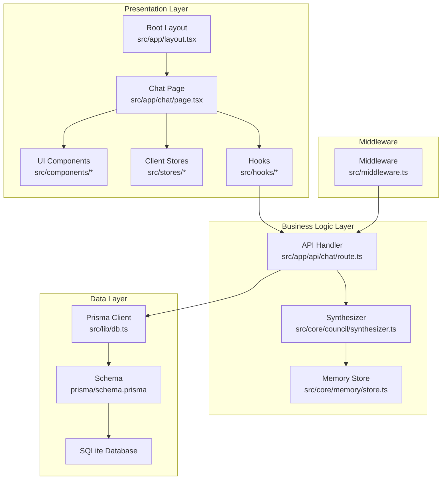
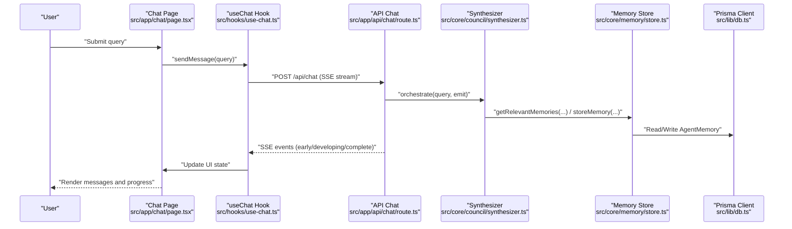
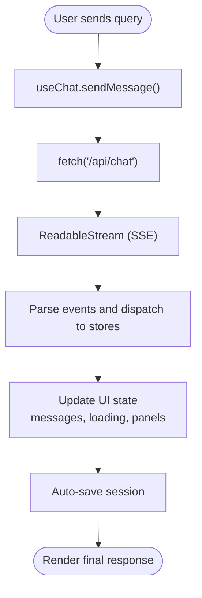
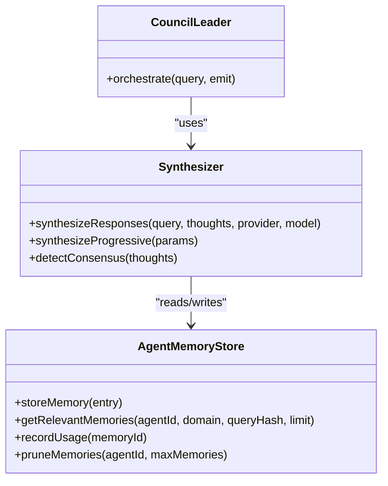
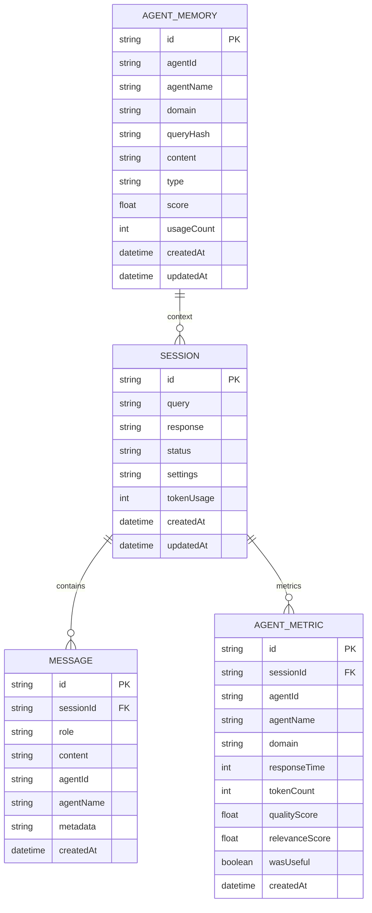
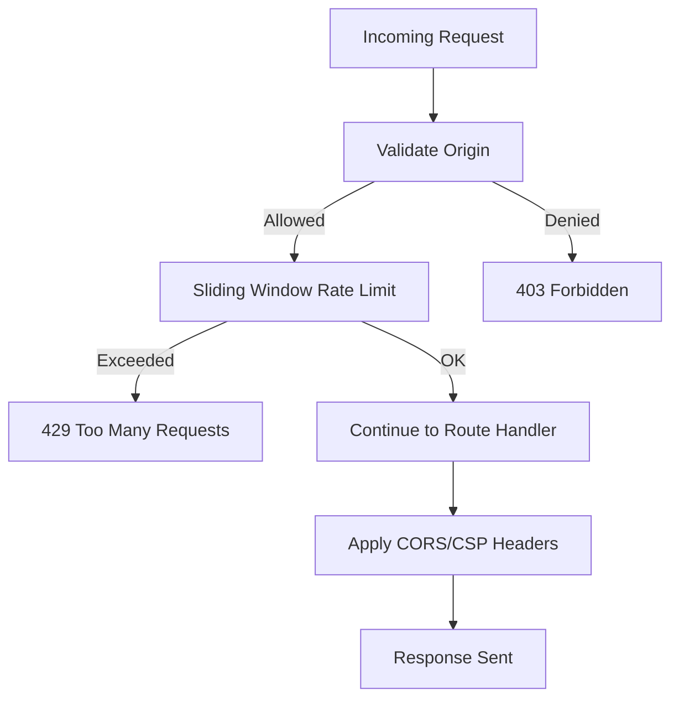
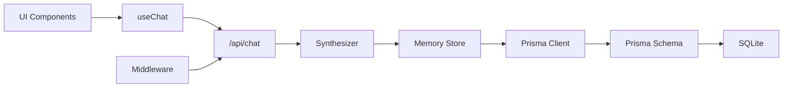

# Layered Architecture Design

<cite>
**Referenced Files in This Document**
- [README.md](file://README.md)
- [package.json](file://package.json)
- [src/middleware.ts](file://src/middleware.ts)
- [src/app/layout.tsx](file://src/app/layout.tsx)
- [src/app/chat/page.tsx](file://src/app/chat/page.tsx)
- [src/components/chat/chat-area.tsx](file://src/components/chat/chat-area.tsx)
- [src/hooks/use-chat.ts](file://src/hooks/use-chat.ts)
- [src/stores/chat-store.ts](file://src/stores/chat-store.ts)
- [src/lib/db.ts](file://src/lib/db.ts)
- [prisma/schema.prisma](file://prisma/schema.prisma)
- [src/app/api/chat/route.ts](file://src/app/api/chat/route.ts)
- [src/app/api/sessions/route.ts](file://src/app/api/sessions/route.ts)
- [src/core/council/synthesizer.ts](file://src/core/council/synthesizer.ts)
- [src/core/memory/store.ts](file://src/core/memory/store.ts)
- [src/types/index.ts](file://src/types/index.ts)
</cite>

## Table of Contents
1. [Introduction](#introduction)
2. [Project Structure](#project-structure)
3. [Core Components](#core-components)
4. [Architecture Overview](#architecture-overview)
5. [Detailed Component Analysis](#detailed-component-analysis)
6. [Dependency Analysis](#dependency-analysis)
7. [Performance Considerations](#performance-considerations)
8. [Troubleshooting Guide](#troubleshooting-guide)
9. [Conclusion](#conclusion)

## Introduction
This document describes the layered architecture of Deep Thinking AI, focusing on the clear separation between:
- Presentation layer (React/Next.js components and UI)
- Business logic layer (core orchestration modules)
- Data layer (Prisma ORM and SQLite)

It explains how the presentation layer handles user interface components and real-time updates, how the business logic layer coordinates multi-agent reasoning and synthesis, and how the data layer provides persistent storage and session management. It also documents how middleware integrates with the overall architecture and how each layer maintains separation of concerns while enabling seamless communication.

## Project Structure
The project follows a Next.js App Router structure with a clear separation of concerns:
- Presentation layer under src/app and src/components
- Business logic under src/core
- Data layer under src/lib and prisma
- Middleware under src/middleware.ts
- Stores under src/stores (client state)
- Types under src/types

**Diagram sources**
- [src/app/layout.tsx:1-28](file://src/app/layout.tsx#L1-L28)
- [src/app/chat/page.tsx:1-368](file://src/app/chat/page.tsx#L1-L368)
- [src/hooks/use-chat.ts:1-158](file://src/hooks/use-chat.ts#L1-L158)
- [src/app/api/chat/route.ts:1-222](file://src/app/api/chat/route.ts#L1-L222)
- [src/core/council/synthesizer.ts:1-591](file://src/core/council/synthesizer.ts#L1-L591)
- [src/core/memory/store.ts:1-254](file://src/core/memory/store.ts#L1-L254)
- [src/lib/db.ts:1-22](file://src/lib/db.ts#L1-L22)
- [prisma/schema.prisma:1-66](file://prisma/schema.prisma#L1-L66)
- [src/middleware.ts:1-217](file://src/middleware.ts#L1-L217)

**Section sources**
- [README.md:1-37](file://README.md#L1-L37)
- [package.json:1-60](file://package.json#L1-L60)

## Core Components
- Presentation layer
  - Root layout and chat page orchestrate UI composition and state.
  - UI components render messages, handle clarifications, and show progress.
  - Hooks encapsulate network and SSE handling.
  - Client stores manage UI state and session persistence.
- Business logic layer
  - API chat route validates inputs, selects providers, and streams synthesis events.
  - Synthesizer computes weighted thoughts, detects consensus, and builds prompts.
  - Memory store provides hybrid short-term and long-term memory with persistence.
- Data layer
  - Prisma client connects to SQLite; schema defines Session, Message, AgentMetric, AgentMemory.
  - Sessions API supports listing, creation, and deletion.

**Section sources**
- [src/app/layout.tsx:1-28](file://src/app/layout.tsx#L1-L28)
- [src/app/chat/page.tsx:1-368](file://src/app/chat/page.tsx#L1-L368)
- [src/components/chat/chat-area.tsx:1-332](file://src/components/chat/chat-area.tsx#L1-L332)
- [src/hooks/use-chat.ts:1-158](file://src/hooks/use-chat.ts#L1-L158)
- [src/stores/chat-store.ts:1-132](file://src/stores/chat-store.ts#L1-L132)
- [src/app/api/chat/route.ts:1-222](file://src/app/api/chat/route.ts#L1-L222)
- [src/core/council/synthesizer.ts:1-591](file://src/core/council/synthesizer.ts#L1-L591)
- [src/core/memory/store.ts:1-254](file://src/core/memory/store.ts#L1-L254)
- [src/lib/db.ts:1-22](file://src/lib/db.ts#L1-L22)
- [prisma/schema.prisma:1-66](file://prisma/schema.prisma#L1-L66)
- [src/app/api/sessions/route.ts:1-91](file://src/app/api/sessions/route.ts#L1-L91)

## Architecture Overview
The system uses a layered architecture:
- Presentation layer renders UI and reacts to real-time events via SSE.
- Business logic layer orchestrates multi-agent reasoning and synthesis.
- Data layer persists sessions, messages, agent metrics, and agent memory.

**Diagram sources**
- [src/app/chat/page.tsx:1-368](file://src/app/chat/page.tsx#L1-L368)
- [src/hooks/use-chat.ts:1-158](file://src/hooks/use-chat.ts#L1-L158)
- [src/app/api/chat/route.ts:1-222](file://src/app/api/chat/route.ts#L1-L222)
- [src/core/council/synthesizer.ts:1-591](file://src/core/council/synthesizer.ts#L1-L591)
- [src/core/memory/store.ts:1-254](file://src/core/memory/store.ts#L1-L254)
- [src/lib/db.ts:1-22](file://src/lib/db.ts#L1-L22)

## Detailed Component Analysis

### Presentation Layer: Real-Time UI and Events
- Chat page composes UI panels, keyboard shortcuts, and toggles panels.
- Chat area listens for SSE events (clarification, cache hit, budget warnings) and renders contextual UI.
- useChat hook manages streaming reads, aborts, and integrates with stores for persistence.

**Diagram sources**
- [src/hooks/use-chat.ts:1-158](file://src/hooks/use-chat.ts#L1-L158)
- [src/components/chat/chat-area.tsx:1-332](file://src/components/chat/chat-area.tsx#L1-L332)
- [src/stores/chat-store.ts:1-132](file://src/stores/chat-store.ts#L1-L132)

**Section sources**
- [src/app/chat/page.tsx:1-368](file://src/app/chat/page.tsx#L1-L368)
- [src/components/chat/chat-area.tsx:1-332](file://src/components/chat/chat-area.tsx#L1-L332)
- [src/hooks/use-chat.ts:1-158](file://src/hooks/use-chat.ts#L1-L158)
- [src/stores/chat-store.ts:1-132](file://src/stores/chat-store.ts#L1-L132)

### Business Logic Layer: Multi-Agent Orchestration and Synthesis
- API chat route validates inputs, resolves provider keys, and streams synthesis events.
- Synthesizer computes weighted thoughts, detects consensus, and builds progressive synthesis prompts.
- Memory store provides hybrid memory with short-term and long-term persistence.

**Diagram sources**
- [src/app/api/chat/route.ts:1-222](file://src/app/api/chat/route.ts#L1-L222)
- [src/core/council/synthesizer.ts:1-591](file://src/core/council/synthesizer.ts#L1-L591)
- [src/core/memory/store.ts:1-254](file://src/core/memory/store.ts#L1-L254)

**Section sources**
- [src/app/api/chat/route.ts:1-222](file://src/app/api/chat/route.ts#L1-L222)
- [src/core/council/synthesizer.ts:1-591](file://src/core/council/synthesizer.ts#L1-L591)
- [src/core/memory/store.ts:1-254](file://src/core/memory/store.ts#L1-L254)

### Data Layer: Persistence and Session Management
- Prisma client connects to SQLite; schema defines Session, Message, AgentMetric, AgentMemory.
- Sessions API supports listing, creation, and deletion; chat store persists sessions on completion.

**Diagram sources**
- [prisma/schema.prisma:1-66](file://prisma/schema.prisma#L1-L66)
- [src/lib/db.ts:1-22](file://src/lib/db.ts#L1-L22)
- [src/app/api/sessions/route.ts:1-91](file://src/app/api/sessions/route.ts#L1-L91)
- [src/stores/chat-store.ts:1-132](file://src/stores/chat-store.ts#L1-L132)

**Section sources**
- [prisma/schema.prisma:1-66](file://prisma/schema.prisma#L1-L66)
- [src/lib/db.ts:1-22](file://src/lib/db.ts#L1-L22)
- [src/app/api/sessions/route.ts:1-91](file://src/app/api/sessions/route.ts#L1-L91)
- [src/stores/chat-store.ts:1-132](file://src/stores/chat-store.ts#L1-L132)

### Middleware Integration
- Middleware enforces CORS, applies CSP headers, rate limits per IP with a sliding window, and only runs on API routes.
- It augments responses with rate-limit headers and security headers, ensuring safe and controlled access.

**Diagram sources**
- [src/middleware.ts:1-217](file://src/middleware.ts#L1-L217)

**Section sources**
- [src/middleware.ts:1-217](file://src/middleware.ts#L1-L217)

## Dependency Analysis
- Presentation depends on hooks and stores for state and persistence.
- Hooks depend on API routes for SSE streaming.
- API routes depend on synthesizer and memory store for orchestration and memory.
- Memory store depends on Prisma client; Prisma client depends on schema and SQLite.

**Diagram sources**
- [src/app/chat/page.tsx:1-368](file://src/app/chat/page.tsx#L1-L368)
- [src/hooks/use-chat.ts:1-158](file://src/hooks/use-chat.ts#L1-L158)
- [src/app/api/chat/route.ts:1-222](file://src/app/api/chat/route.ts#L1-L222)
- [src/core/council/synthesizer.ts:1-591](file://src/core/council/synthesizer.ts#L1-L591)
- [src/core/memory/store.ts:1-254](file://src/core/memory/store.ts#L1-L254)
- [src/lib/db.ts:1-22](file://src/lib/db.ts#L1-L22)
- [prisma/schema.prisma:1-66](file://prisma/schema.prisma#L1-L66)
- [src/middleware.ts:1-217](file://src/middleware.ts#L1-L217)

**Section sources**
- [src/types/index.ts:1-7](file://src/types/index.ts#L1-L7)

## Performance Considerations
- Streaming SSE reduces perceived latency and enables progressive UI updates.
- Sliding window rate limiting prevents abuse and stabilizes throughput.
- Hybrid memory (short-term + long-term) balances responsiveness and persistence.
- Prisma client initialization uses a singleton pattern to avoid reconnect overhead.

## Troubleshooting Guide
- If SSE events are not received:
  - Verify the hook’s event parsing loop and ensure the stream is readable.
  - Confirm the API route emits properly and the client connection remains open.
- If sessions are not saved:
  - Check chat-store save/load flows and network responses.
  - Ensure the backend sessions API endpoints are reachable.
- If rate-limited:
  - Review middleware rate-limit thresholds and client Retry-After headers.
- If memory retrieval fails:
  - Confirm Prisma client connectivity and that memory store falls back gracefully when DB is unavailable.

**Section sources**
- [src/hooks/use-chat.ts:1-158](file://src/hooks/use-chat.ts#L1-L158)
- [src/stores/chat-store.ts:1-132](file://src/stores/chat-store.ts#L1-L132)
- [src/middleware.ts:1-217](file://src/middleware.ts#L1-L217)
- [src/core/memory/store.ts:1-254](file://src/core/memory/store.ts#L1-L254)

## Conclusion
Deep Thinking AI’s layered architecture cleanly separates presentation, business logic, and data concerns. The presentation layer focuses on rendering and real-time updates, the business logic layer coordinates multi-agent reasoning and synthesis, and the data layer provides robust persistence. Middleware ensures secure and fair access. Together, these layers enable scalable, maintainable, and responsive functionality.