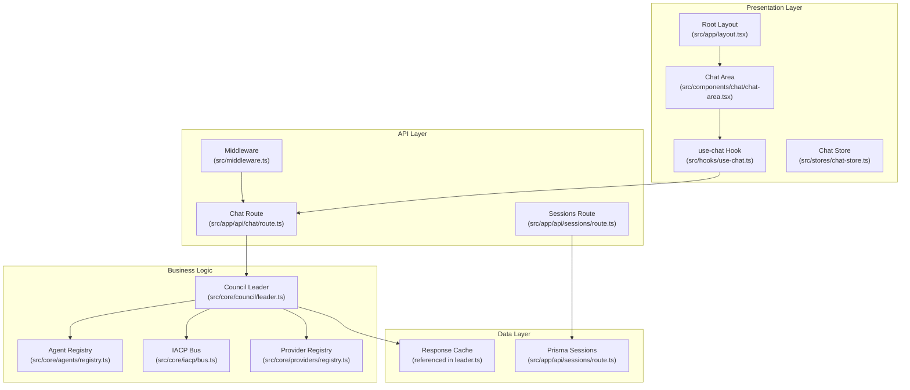
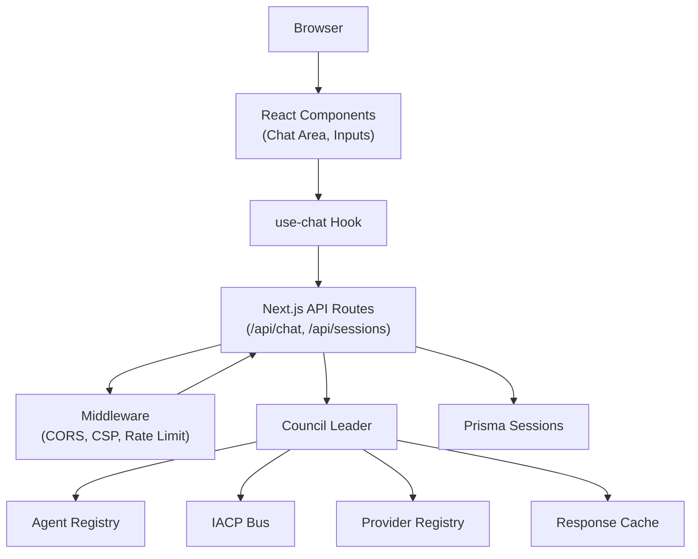
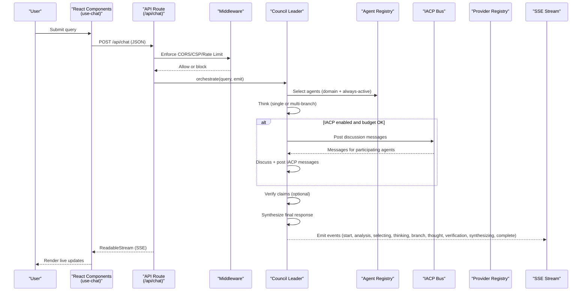
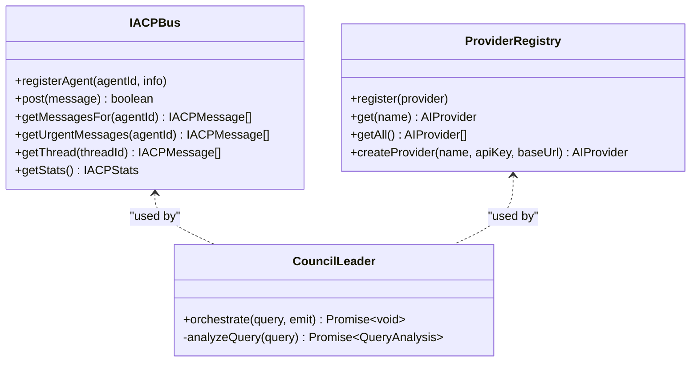
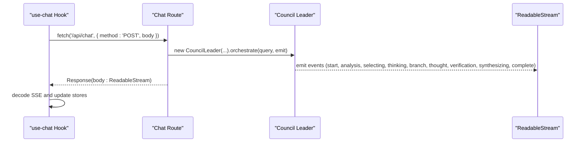
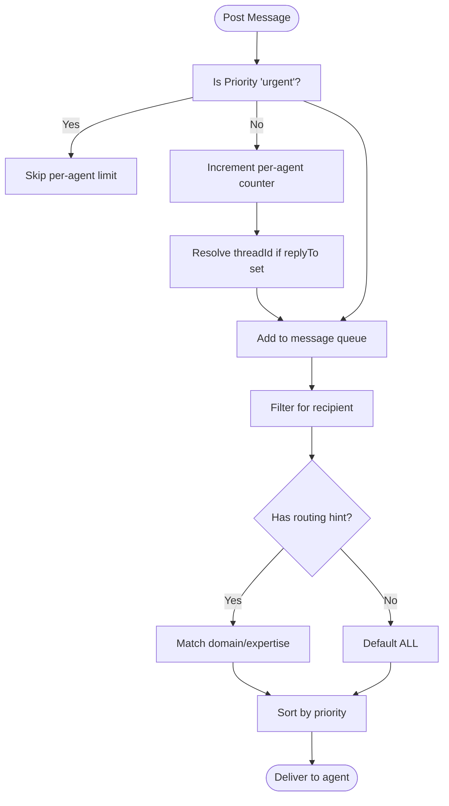
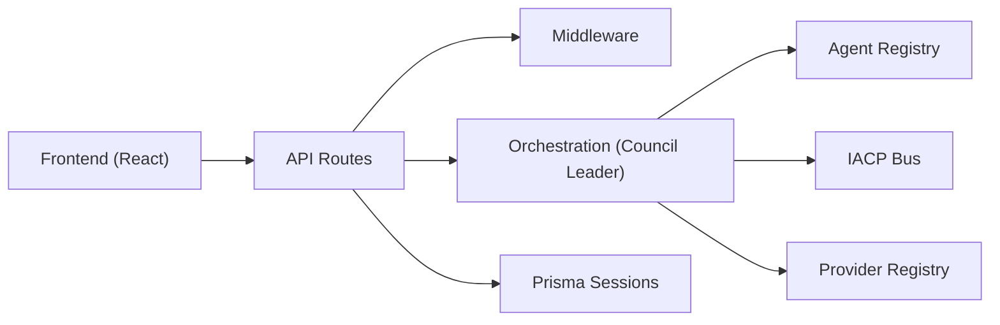

# System Architecture

<cite>
**Referenced Files in This Document**
- [README.md](file://README.md)
- [package.json](file://package.json)
- [src/middleware.ts](file://src/middleware.ts)
- [src/app/layout.tsx](file://src/app/layout.tsx)
- [src/app/api/chat/route.ts](file://src/app/api/chat/route.ts)
- [src/app/api/sessions/route.ts](file://src/app/api/sessions/route.ts)
- [src/hooks/use-chat.ts](file://src/hooks/use-chat.ts)
- [src/stores/chat-store.ts](file://src/stores/chat-store.ts)
- [src/components/chat/chat-area.tsx](file://src/components/chat/chat-area.tsx)
- [src/core/council/leader.ts](file://src/core/council/leader.ts)
- [src/core/agents/registry.ts](file://src/core/agents/registry.ts)
- [src/core/iacp/bus.ts](file://src/core/iacp/bus.ts)
- [src/core/providers/registry.ts](file://src/core/providers/registry.ts)
- [src/types/index.ts](file://src/types/index.ts)
- [src/types/agent.ts](file://src/types/agent.ts)
</cite>

## Table of Contents
1. [Introduction](#introduction)
2. [Project Structure](#project-structure)
3. [Core Components](#core-components)
4. [Architecture Overview](#architecture-overview)
5. [Detailed Component Analysis](#detailed-component-analysis)
6. [Dependency Analysis](#dependency-analysis)
7. [Performance Considerations](#performance-considerations)
8. [Troubleshooting Guide](#troubleshooting-guide)
9. [Conclusion](#conclusion)

## Introduction
This document describes the system architecture of the Deep Thinking AI multi-agent reasoning platform. The system is built with a layered design separating presentation, business logic, and data concerns. At its core is the Council Leader orchestrator that coordinates multiple AI agents via an IACP (Inter-Agent Communication Protocol) bus, enabling multi-perspective reasoning, optional intra-council discussion, verification loops, and synthesis into a final response. Real-time streaming of intermediate events is delivered to the frontend using Server-Sent Events (SSE). The architecture supports pluggable AI providers and includes robust middleware for security and rate limiting.

## Project Structure
The repository follows a Next.js App Router layout with a clear separation of concerns:
- Presentation layer: React components and Zustand stores for UI state and SSE event handling
- Business logic layer: Orchestration, agent selection, concurrency control, budget tracking, and provider abstraction
- Data layer: Prisma-backed session persistence and in-memory caches for query intelligence and response caching

**Diagram sources**
- [src/app/layout.tsx:15-27](file://src/app/layout.tsx#L15-L27)
- [src/components/chat/chat-area.tsx:173-331](file://src/components/chat/chat-area.tsx#L173-L331)
- [src/hooks/use-chat.ts:22-128](file://src/hooks/use-chat.ts#L22-L128)
- [src/stores/chat-store.ts:18-131](file://src/stores/chat-store.ts#L18-L131)
- [src/middleware.ts:166-211](file://src/middleware.ts#L166-L211)
- [src/app/api/chat/route.ts:85-199](file://src/app/api/chat/route.ts#L85-L199)
- [src/app/api/sessions/route.ts:4-90](file://src/app/api/sessions/route.ts#L4-L90)
- [src/core/council/leader.ts:33-714](file://src/core/council/leader.ts#L33-L714)
- [src/core/agents/registry.ts:4-57](file://src/core/agents/registry.ts#L4-L57)
- [src/core/iacp/bus.ts:15-210](file://src/core/iacp/bus.ts#L15-L210)
- [src/core/providers/registry.ts:8-82](file://src/core/providers/registry.ts#L8-L82)

**Section sources**
- [README.md:1-37](file://README.md#L1-L37)
- [package.json:1-60](file://package.json#L1-L60)
- [src/app/layout.tsx:15-27](file://src/app/layout.tsx#L15-L27)

## Core Components
- Council Leader: Central orchestrator that manages the lifecycle of multi-agent reasoning, including query analysis, agent selection, concurrent execution, optional IACP discussion, verification loops, and synthesis. It emits structured SSE events for real-time UI updates.
- IACP Bus: Mediates inter-agent messaging with routing hints, threading, priority ordering, and rate-limiting per agent to avoid hotspots.
- Agent Registry: Provides lookup, domain indexing, and discovery of available agents, including always-active agents.
- Provider Registry: Dynamically registers AI providers based on environment configuration and exposes a factory for creating provider instances.
- Frontend Hooks and Stores: Manage SSE event consumption, UI state transitions, and session persistence.

**Section sources**
- [src/core/council/leader.ts:33-714](file://src/core/council/leader.ts#L33-L714)
- [src/core/iacp/bus.ts:15-210](file://src/core/iacp/bus.ts#L15-L210)
- [src/core/agents/registry.ts:4-57](file://src/core/agents/registry.ts#L4-L57)
- [src/core/providers/registry.ts:8-82](file://src/core/providers/registry.ts#L8-L82)
- [src/hooks/use-chat.ts:22-128](file://src/hooks/use-chat.ts#L22-L128)
- [src/stores/chat-store.ts:18-131](file://src/stores/chat-store.ts#L18-L131)

## Architecture Overview
The system employs a layered architecture:
- Presentation: React components render chat UI, consume SSE events, and manage user interactions.
- API: Next.js routes expose REST endpoints and SSE streams, enforcing middleware policies.
- Orchestration: The Council Leader coordinates agent workflows, budgeting, concurrency, and optional IACP discussion.
- Providers: Pluggable AI providers abstract external LLM APIs behind a unified interface.
- Data: Sessions persisted via Prisma; caches support query intelligence and response caching.

**Diagram sources**
- [src/app/api/chat/route.ts:85-199](file://src/app/api/chat/route.ts#L85-L199)
- [src/app/api/sessions/route.ts:4-90](file://src/app/api/sessions/route.ts#L4-L90)
- [src/middleware.ts:166-211](file://src/middleware.ts#L166-L211)
- [src/core/council/leader.ts:33-714](file://src/core/council/leader.ts#L33-L714)
- [src/core/agents/registry.ts:4-57](file://src/core/agents/registry.ts#L4-L57)
- [src/core/iacp/bus.ts:15-210](file://src/core/iacp/bus.ts#L15-L210)
- [src/core/providers/registry.ts:8-82](file://src/core/providers/registry.ts#L8-L82)

## Detailed Component Analysis

### Data Flow: User Query Through Multi-Agent Processing to Real-Time Streaming
The end-to-end flow from user input to streaming response:

**Diagram sources**
- [src/hooks/use-chat.ts:48-128](file://src/hooks/use-chat.ts#L48-L128)
- [src/app/api/chat/route.ts:85-199](file://src/app/api/chat/route.ts#L85-L199)
- [src/middleware.ts:166-211](file://src/middleware.ts#L166-L211)
- [src/core/council/leader.ts:42-604](file://src/core/council/leader.ts#L42-L604)
- [src/core/agents/registry.ts:25-35](file://src/core/agents/registry.ts#L25-L35)
- [src/core/iacp/bus.ts:39-111](file://src/core/iacp/bus.ts#L39-L111)
- [src/core/providers/registry.ts:39-79](file://src/core/providers/registry.ts#L39-L79)

**Section sources**
- [src/hooks/use-chat.ts:22-128](file://src/hooks/use-chat.ts#L22-L128)
- [src/app/api/chat/route.ts:85-199](file://src/app/api/chat/route.ts#L85-L199)
- [src/middleware.ts:166-211](file://src/middleware.ts#L166-L211)
- [src/core/council/leader.ts:42-604](file://src/core/council/leader.ts#L42-L604)

### Architectural Patterns
- Mediator Pattern (IACP Coordination): The IACP Bus acts as a central mediator routing messages between agents based on routing hints, domain targeting, and priority ordering. It encapsulates message threading and statistics.
- Strategy Pattern (Provider Abstraction): The Provider Registry dynamically detects and instantiates different AI providers based on environment configuration, allowing runtime selection and easy extension.
- Observer Pattern (Real-Time Updates): The frontend observes SSE events emitted by the Council Leader, updating UI state reactively without polling.

**Diagram sources**
- [src/core/iacp/bus.ts:15-210](file://src/core/iacp/bus.ts#L15-L210)
- [src/core/providers/registry.ts:8-82](file://src/core/providers/registry.ts#L8-L82)
- [src/core/council/leader.ts:33-714](file://src/core/council/leader.ts#L33-L714)

**Section sources**
- [src/core/iacp/bus.ts:15-210](file://src/core/iacp/bus.ts#L15-L210)
- [src/core/providers/registry.ts:8-82](file://src/core/providers/registry.ts#L8-L82)
- [src/core/council/leader.ts:33-714](file://src/core/council/leader.ts#L33-L714)

### Component Interaction Diagrams

#### Frontend to Backend Orchestration

**Diagram sources**
- [src/hooks/use-chat.ts:48-128](file://src/hooks/use-chat.ts#L48-L128)
- [src/app/api/chat/route.ts:147-199](file://src/app/api/chat/route.ts#L147-L199)
- [src/core/council/leader.ts:42-604](file://src/core/council/leader.ts#L42-L604)

#### IACP Message Routing and Threading

**Diagram sources**
- [src/core/iacp/bus.ts:39-111](file://src/core/iacp/bus.ts#L39-L111)
- [src/core/iacp/bus.ts:176-208](file://src/core/iacp/bus.ts#L176-L208)

### System Boundaries and Integration Points
- External Dependencies: AI providers (OpenAI, Anthropic, Zhipu AI, Ollama), database via Prisma/Better SQLite adapter, and UI libraries (Radix UI, Tailwind).
- Integration Points:
  - AI Providers: Accessed through Provider Registry; keys resolved server-side to prevent client tampering.
  - Session Persistence: Prisma-backed storage for chat sessions.
  - Streaming: SSE endpoints for real-time orchestration events.

**Section sources**
- [src/core/providers/registry.ts:19-37](file://src/core/providers/registry.ts#L19-L37)
- [src/app/api/sessions/route.ts:4-35](file://src/app/api/sessions/route.ts#L4-L35)
- [package.json:13-40](file://package.json#L13-L40)

## Dependency Analysis
The system exhibits clean separation of concerns with explicit dependencies:
- Presentation depends on API routes and stores.
- API routes depend on middleware and orchestration logic.
- Orchestration depends on registries, concurrency controls, and providers.
- Providers are decoupled via a registry abstraction.
- Data access is centralized in API routes using Prisma.

**Diagram sources**
- [src/hooks/use-chat.ts:48-128](file://src/hooks/use-chat.ts#L48-L128)
- [src/app/api/chat/route.ts:85-199](file://src/app/api/chat/route.ts#L85-L199)
- [src/middleware.ts:166-211](file://src/middleware.ts#L166-L211)
- [src/core/council/leader.ts:33-714](file://src/core/council/leader.ts#L33-L714)
- [src/core/agents/registry.ts:4-57](file://src/core/agents/registry.ts#L4-L57)
- [src/core/iacp/bus.ts:15-210](file://src/core/iacp/bus.ts#L15-L210)
- [src/core/providers/registry.ts:8-82](file://src/core/providers/registry.ts#L8-L82)
- [src/app/api/sessions/route.ts:4-90](file://src/app/api/sessions/route.ts#L4-L90)

**Section sources**
- [src/core/council/leader.ts:33-714](file://src/core/council/leader.ts#L33-L714)
- [src/core/iacp/bus.ts:15-210](file://src/core/iacp/bus.ts#L15-L210)
- [src/core/agents/registry.ts:4-57](file://src/core/agents/registry.ts#L4-L57)
- [src/core/providers/registry.ts:8-82](file://src/core/providers/registry.ts#L8-L82)
- [src/app/api/chat/route.ts:85-199](file://src/app/api/chat/route.ts#L85-L199)
- [src/app/api/sessions/route.ts:4-90](file://src/app/api/sessions/route.ts#L4-L90)

## Performance Considerations
- Concurrency Control: The orchestration limits concurrent agent thinking to balance throughput and cost.
- Token Budgeting: A budget tracker monitors usage and emits warnings when thresholds are approached.
- Caching: Response cache avoids recomputation for repeated queries; query intelligence cache reduces downstream processing.
- Streaming: SSE ensures low-latency delivery of intermediate results without blocking the UI.
- Rate Limiting: Middleware enforces sliding-window rate limiting to protect backend resources.

[No sources needed since this section provides general guidance]

## Troubleshooting Guide
- SSE Not Received: Verify the API route is reachable and the client reads the stream correctly. Check for AbortController usage and ensure the stream is not prematurely closed.
- Provider Errors: Confirm environment variables for provider keys are set and the Provider Registry can instantiate the requested provider. The chat route resolves keys server-side and ignores client-provided keys.
- Session Persistence Failures: Inspect Prisma configuration and network connectivity; saving sessions is best-effort in stores.
- Middleware Blocking: Review allowed origins and rate limit headers; ensure the client origin is permitted and not throttled.

**Section sources**
- [src/hooks/use-chat.ts:113-126](file://src/hooks/use-chat.ts#L113-L126)
- [src/app/api/chat/route.ts:68-79](file://src/app/api/chat/route.ts#L68-L79)
- [src/middleware.ts:166-211](file://src/middleware.ts#L166-L211)
- [src/stores/chat-store.ts:80-130](file://src/stores/chat-store.ts#L80-L130)

## Conclusion
The Deep Thinking AI system demonstrates a robust layered architecture with clear separation between presentation, business logic, and data. The Council Leader orchestrates multi-agent reasoning, leveraging the IACP Bus for coordinated discussion, a Provider Registry for flexible AI integrations, and comprehensive SSE-driven observability. The design supports scalability, safety (via middleware), and resilience (through caching and retries), while maintaining a responsive, real-time user experience.