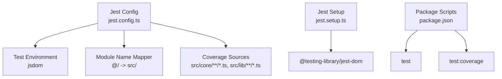
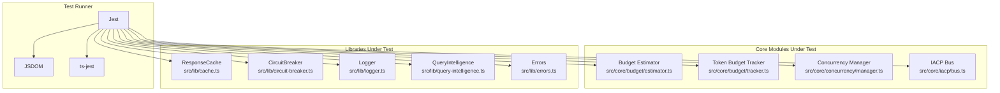
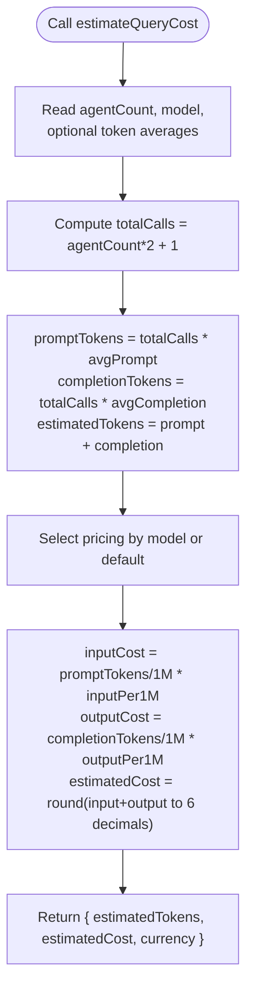
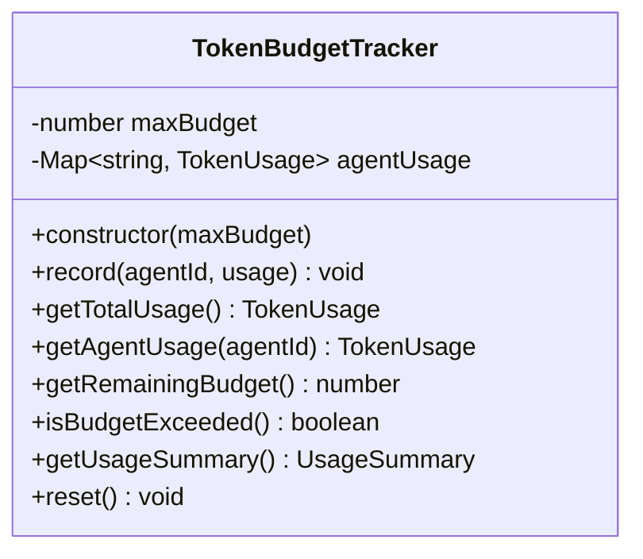
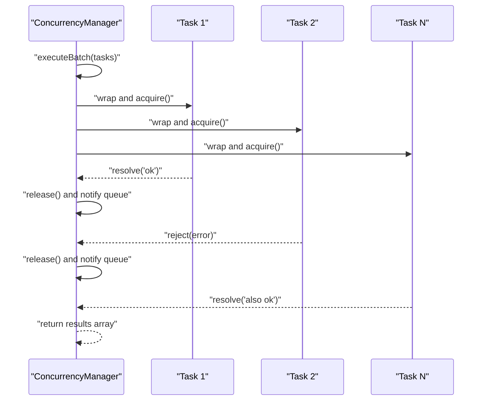
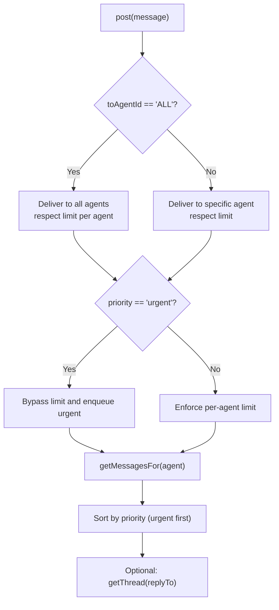
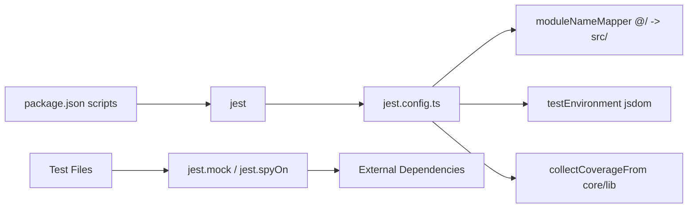

# Testing Strategy and Quality Assurance

<cite>
**Referenced Files in This Document**
- [jest.config.ts](file://jest.config.ts)
- [jest.setup.ts](file://jest.setup.ts)
- [package.json](file://package.json)
- [src/__tests__/core/budget/estimator.test.ts](file://src/__tests__/core/budget/estimator.test.ts)
- [src/__tests__/core/budget/tracker.test.ts](file://src/__tests__/core/budget/tracker.test.ts)
- [src/__tests__/core/concurrency/manager.test.ts](file://src/__tests__/core/concurrency/manager.test.ts)
- [src/__tests__/core/iacp/bus.test.ts](file://src/__tests__/core/iacp/bus.test.ts)
- [src/__tests__/lib/cache.test.ts](file://src/__tests__/lib/cache.test.ts)
- [src/__tests__/lib/circuit-breaker.test.ts](file://src/__tests__/lib/circuit-breaker.test.ts)
- [src/__tests__/lib/errors.test.ts](file://src/__tests__/lib/errors.test.ts)
- [src/__tests__/lib/logger.test.ts](file://src/__tests__/lib/logger.test.ts)
- [src/__tests__/lib/query-intelligence.test.ts](file://src/__tests__/lib/query-intelligence.test.ts)
- [src/core/budget/estimator.ts](file://src/core/budget/estimator.ts)
- [src/core/budget/tracker.ts](file://src/core/budget/tracker.ts)
- [src/core/concurrency/manager.ts](file://src/core/concurrency/manager.ts)
- [src/core/iacp/bus.ts](file://src/core/iacp/bus.ts)
- [src/lib/cache.ts](file://src/lib/cache.ts)
- [src/lib/circuit-breaker.ts](file://src/lib/circuit-breaker.ts)
- [src/lib/errors.ts](file://src/lib/errors.ts)
- [src/lib/logger.ts](file://src/lib/logger.ts)
- [src/lib/query-intelligence.ts](file://src/lib/query-intelligence.ts)
</cite>

## Table of Contents
1. [Introduction](#introduction)
2. [Project Structure](#project-structure)
3. [Core Components](#core-components)
4. [Architecture Overview](#architecture-overview)
5. [Detailed Component Analysis](#detailed-component-analysis)
6. [Dependency Analysis](#dependency-analysis)
7. [Performance Considerations](#performance-considerations)
8. [Troubleshooting Guide](#troubleshooting-guide)
9. [Conclusion](#conclusion)
10. [Appendices](#appendices)

## Introduction
This document provides comprehensive testing documentation for the Deep Thinking AI project. It covers the Jest-based testing framework setup, configuration, and utilities; unit testing strategies for core modules (budget tracking, concurrency management, and IACP bus); testing patterns for libraries and utilities; and guidance for UI components, API endpoints, and integration tests. It also documents mock providers, test data management, continuous integration considerations, best practices, coverage requirements, debugging strategies, and performance testing approaches tailored for the multi-agent system.

## Project Structure
The project uses Jest with JSDOM for DOM environment simulation and TypeScript compilation via ts-jest. Tests are organized under src/__tests__ grouped by feature areas (core, lib). The Jest configuration maps @/ aliases to src/, sets the test environment to jsdom, and collects coverage from core and lib modules while excluding declaration files.

**Diagram sources**
- [jest.config.ts:1-23](file://jest.config.ts#L1-L23)
- [jest.setup.ts:1-2](file://jest.setup.ts#L1-L2)
- [package.json:5-11](file://package.json#L5-L11)

**Section sources**
- [jest.config.ts:1-23](file://jest.config.ts#L1-L23)
- [jest.setup.ts:1-2](file://jest.setup.ts#L1-L2)
- [package.json:5-11](file://package.json#L5-L11)

## Core Components
This section outlines the testing approach for the core modules that power the multi-agent system.

- Budget Estimator and Tracker
  - Unit tests validate cost estimation formulas, scaling with agent counts, and default pricing fallbacks.
  - Tracker tests validate per-agent and cumulative usage, budget enforcement, remaining budget clamping, summaries, and resets.
- Concurrency Manager
  - Unit tests validate batch execution, concurrency limits, error handling, callbacks, and slot release mechanics.
- IACP Bus
  - Unit tests validate message posting, delivery semantics (direct and broadcast), per-agent message limits, urgent bypass, thread ID derivation, ordering, priority sorting, statistics, and clearing.

**Section sources**
- [src/__tests__/core/budget/estimator.test.ts:1-53](file://src/__tests__/core/budget/estimator.test.ts#L1-L53)
- [src/__tests__/core/budget/tracker.test.ts:1-80](file://src/__tests__/core/budget/tracker.test.ts#L1-L80)
- [src/__tests__/core/concurrency/manager.test.ts:1-98](file://src/__tests__/core/concurrency/manager.test.ts#L1-L98)
- [src/__tests__/core/iacp/bus.test.ts:1-127](file://src/__tests__/core/iacp/bus.test.ts#L1-L127)

## Architecture Overview
The testing architecture leverages Jest’s built-in mocking and spies, along with @testing-library/jest-dom for DOM assertions. Core modules are unit-tested independently, with targeted mocks for external dependencies (e.g., database client, logging) to isolate behavior and improve test speed.

**Diagram sources**
- [jest.config.ts:1-23](file://jest.config.ts#L1-L23)
- [src/core/budget/estimator.ts:1-56](file://src/core/budget/estimator.ts#L1-L56)
- [src/core/budget/tracker.ts:1-78](file://src/core/budget/tracker.ts#L1-L78)
- [src/core/concurrency/manager.ts:1-55](file://src/core/concurrency/manager.ts#L1-L55)
- [src/core/iacp/bus.ts:1-200](file://src/core/iacp/bus.ts#L1-L200)
- [src/lib/cache.ts:1-200](file://src/lib/cache.ts#L1-L200)
- [src/lib/circuit-breaker.ts:1-200](file://src/lib/circuit-breaker.ts#L1-L200)
- [src/lib/logger.ts:1-200](file://src/lib/logger.ts#L1-L200)
- [src/lib/query-intelligence.ts:1-200](file://src/lib/query-intelligence.ts#L1-L200)
- [src/lib/errors.ts:1-200](file://src/lib/errors.ts#L1-L200)

## Detailed Component Analysis

### Budget Estimator
- Purpose: Estimate token usage and cost for a multi-agent query based on model pricing and agent count.
- Test strategy:
  - Parameterized model pricing verification.
  - Scaling behavior with increasing agent counts.
  - Custom token averages override.
  - Unknown model fallback to default pricing.
- Assertion strategies:
  - Exact value checks for tokens.
  - Approximate equality for cost calculations.
  - Currency correctness.

**Diagram sources**
- [src/core/budget/estimator.ts:25-55](file://src/core/budget/estimator.ts#L25-L55)

**Section sources**
- [src/__tests__/core/budget/estimator.test.ts:1-53](file://src/__tests__/core/budget/estimator.test.ts#L1-L53)
- [src/core/budget/estimator.ts:1-56](file://src/core/budget/estimator.ts#L1-L56)

### Token Budget Tracker
- Purpose: Track per-agent and cumulative token usage against a global budget.
- Test strategy:
  - Cumulative totals and per-agent aggregation.
  - Budget exceeded detection.
  - Remaining budget clamping at zero.
  - Usage summary computation and percentage usage.
  - Reset behavior.
- Assertion strategies:
  - Numeric equality and comparison checks.
  - Zero-fallback for unknown agents.
  - Percentage rounding approximations.

**Diagram sources**
- [src/core/budget/tracker.ts:3-77](file://src/core/budget/tracker.ts#L3-L77)

**Section sources**
- [src/__tests__/core/budget/tracker.test.ts:1-80](file://src/__tests__/core/budget/tracker.test.ts#L1-L80)
- [src/core/budget/tracker.ts:1-78](file://src/core/budget/tracker.ts#L1-L78)

### Concurrency Manager
- Purpose: Execute tasks respecting a concurrency limit, queue overflow, and per-task callbacks.
- Test strategy:
  - Batch execution and result shape.
  - Concurrency limit enforcement.
  - Error propagation without failing other tasks.
  - Completion and error callbacks.
  - Slot release enabling queued tasks to run.
- Assertion strategies:
  - Result array length and success flags.
  - Max concurrent tracking during execution.
  - Error message capture.

**Diagram sources**
- [src/core/concurrency/manager.ts:29-53](file://src/core/concurrency/manager.ts#L29-L53)

**Section sources**
- [src/__tests__/core/concurrency/manager.test.ts:1-98](file://src/__tests__/core/concurrency/manager.test.ts#L1-L98)
- [src/core/concurrency/manager.ts:1-55](file://src/core/concurrency/manager.ts#L1-L55)

### IACP Bus
- Purpose: Agent messaging bus with per-agent message limits, priorities, threading, and statistics.
- Test strategy:
  - Direct and broadcast delivery.
  - Message limit per agent and urgent bypass.
  - Thread ID derivation from replyTo.
  - Ordered threads by timestamp.
  - Priority sorting (urgent first).
  - Statistics tracking and clearing.
- Assertion strategies:
  - Length checks for delivered messages.
  - Priority ordering verification.
  - Timestamp monotonicity in threads.

**Diagram sources**
- [src/core/iacp/bus.ts:1-200](file://src/core/iacp/bus.ts#L1-L200)

**Section sources**
- [src/__tests__/core/iacp/bus.test.ts:1-127](file://src/__tests__/core/iacp/bus.test.ts#L1-L127)
- [src/core/iacp/bus.ts:1-200](file://src/core/iacp/bus.ts#L1-L200)

### Library and Utility Tests
- ResponseCache
  - Validates set/get, TTL expiration, LRU eviction, normalization, fuzzy similarity, hit rate stats, cleanup, and clear/reset.
  - Uses jest.spyOn(Date, 'now') to simulate time passage for TTL and cleanup.
- CircuitBreaker
  - Validates state transitions (CLOSED → OPEN → HALF_OPEN → CLOSED), immediate rejection in OPEN, half-open success/failure thresholds, stats tracking, and manual reset.
  - Mocks logger to avoid noisy console output in tests.
- Logger
  - Validates method presence and console invocations across debug/info/warn/error/fatal.
  - Uses environment variables to control verbosity in tests.
- QueryIntelligence
  - Validates ambiguity detection, complexity classification, estimated agent count, query optimization, and clarification generation.
  - Mocks Prisma client to isolate logic.
- Error taxonomy
  - Validates constructors, defaults, operational flags, context inclusion, and JSON serialization for all error types.

**Section sources**
- [src/__tests__/lib/cache.test.ts:1-115](file://src/__tests__/lib/cache.test.ts#L1-L115)
- [src/__tests__/lib/circuit-breaker.test.ts:1-121](file://src/__tests__/lib/circuit-breaker.test.ts#L1-L121)
- [src/__tests__/lib/logger.test.ts:1-73](file://src/__tests__/lib/logger.test.ts#L1-L73)
- [src/__tests__/lib/query-intelligence.test.ts:1-132](file://src/__tests__/lib/query-intelligence.test.ts#L1-L132)
- [src/__tests__/lib/errors.test.ts:1-126](file://src/__tests__/lib/errors.test.ts#L1-L126)

## Dependency Analysis
- Test-time dependencies:
  - Jest and ts-jest compile and execute tests.
  - @testing-library/jest-dom extends matchers for DOM assertions.
  - Module name mapper resolves @/ aliases to src/.
  - Coverage configured for core and lib modules.
- Mocking strategy:
  - jest.mock is used to replace external modules (e.g., logger, db) with deterministic stubs.
  - jest.spyOn is used to intercept and control time-dependent behavior (Date.now).
- Coupling and cohesion:
  - Tests maintain high cohesion around single responsibilities.
  - Mocks reduce coupling to external systems, improving reliability and speed.

**Diagram sources**
- [package.json:5-11](file://package.json#L5-L11)
- [jest.config.ts:8-20](file://jest.config.ts#L8-L20)

**Section sources**
- [package.json:5-11](file://package.json#L5-L11)
- [jest.config.ts:8-20](file://jest.config.ts#L8-L20)

## Performance Considerations
- Asynchronous execution and concurrency:
  - ConcurrencyManager tests demonstrate batching and slot release; ensure real-world tasks are representative to avoid false positives.
- Time-sensitive logic:
  - Use jest.useFakeTimers/jest.runAllTimers or jest.spyOn(Date, 'now') judiciously to control time without slowing tests excessively.
- Cost estimation:
  - Keep model pricing constants and token averages stable to avoid flaky floating-point comparisons; prefer toBeCloseTo with appropriate precision.
- Caching and cleanup:
  - Cache tests show TTL and cleanup; ensure cleanup routines are invoked to prevent memory leaks in long-running suites.

## Troubleshooting Guide
- Common issues and resolutions:
  - Missing @/ alias resolution: Verify moduleNameMapper in Jest config.
  - DOM assertions failing: Confirm jsdom environment is active.
  - Mocked modules not applied: Ensure jest.mock appears before imports in the test file.
  - Time-dependent failures: Use jest.spyOn(Date, 'now') and restoreAllMocks() after tests.
  - Excessive flakiness in floating-point comparisons: Prefer toBeCloseTo with tolerance.
- Debugging strategies:
  - Add console logs inside tests temporarily to inspect intermediate values.
  - Run specific test files using jest <path-to-test-file>.
  - Use verbose output with jest --verbose or increase log level via environment variables in logger tests.

**Section sources**
- [jest.config.ts:11-14](file://jest.config.ts#L11-L14)
- [jest.setup.ts:1-2](file://jest.setup.ts#L1-L2)
- [src/__tests__/lib/circuit-breaker.test.ts:1-10](file://src/__tests__/lib/circuit-breaker.test.ts#L1-L10)
- [src/__tests__/lib/logger.test.ts:4-17](file://src/__tests__/lib/logger.test.ts#L4-L17)
- [src/__tests__/lib/cache.test.ts:22-34](file://src/__tests__/lib/cache.test.ts#L22-L34)

## Conclusion
The Deep Thinking AI project employs a robust Jest-based testing strategy with strong isolation via mocking and precise DOM simulation. Core modules (budget, concurrency, IACP bus) are comprehensively unit-tested, covering functional correctness, edge cases, and error handling. Libraries and utilities are validated for correctness, performance characteristics, and resilience. The documented patterns, best practices, and debugging strategies enable maintainable and reliable quality assurance for the multi-agent system.

## Appendices

### Testing Patterns and Best Practices
- Unit testing patterns:
  - Arrange-Act-Assert structure with descriptive test names.
  - Use beforeEach to initialize subject-under-test and spies/mocks.
  - Prefer exact assertions for discrete values and toBeCloseTo for floating-point computations.
- Mock providers:
  - Use jest.mock for external modules (e.g., logger, db).
  - Use jest.spyOn for time-dependent functions (e.g., Date.now).
- Test data management:
  - Centralize fixtures and helpers (e.g., IACP message builders) in test files to keep tests readable.
- Continuous integration:
  - Run npm test and npm run test:coverage in CI.
  - Enforce minimum coverage thresholds for core/lib modules via Jest configuration.
- Performance testing approaches:
  - Benchmark batch execution with varying concurrency limits and task sizes.
  - Measure cost estimation overhead for large agent counts.
  - Validate cache hit rates and cleanup performance under load.

### Coverage Requirements
- Current coverage targets:
  - Jest configuration collects coverage from core and lib modules while excluding type definition files.
- Recommendations:
  - Aim for high coverage in core business logic (budget, concurrency, IACP bus).
  - Maintain or improve coverage for libraries (cache, circuit-breaker, logger, query-intelligence).
  - Exclude generated or third-party code from coverage calculations.

**Section sources**
- [jest.config.ts:15-19](file://jest.config.ts#L15-L19)