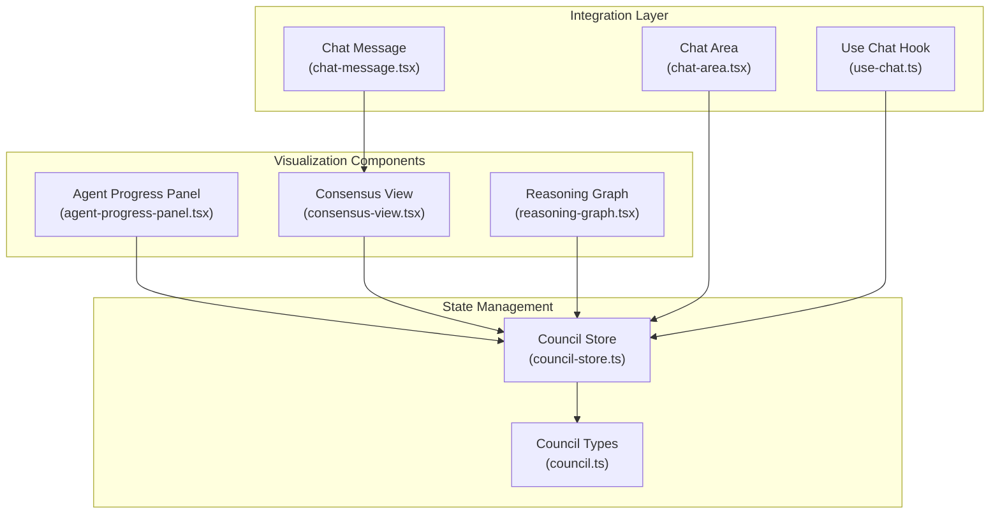
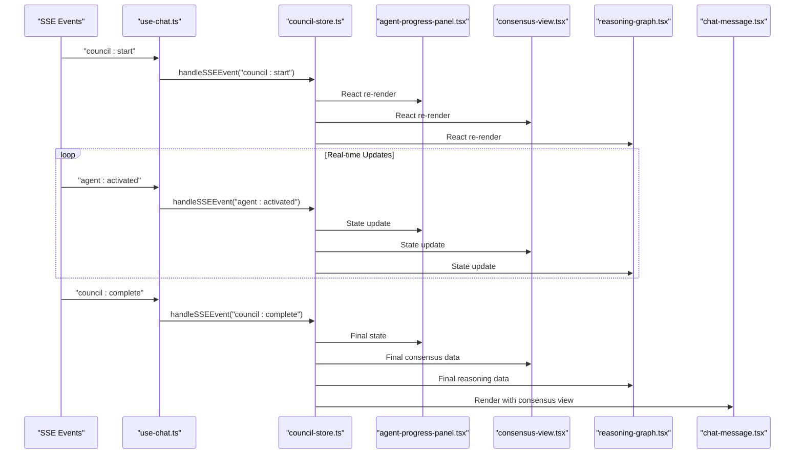
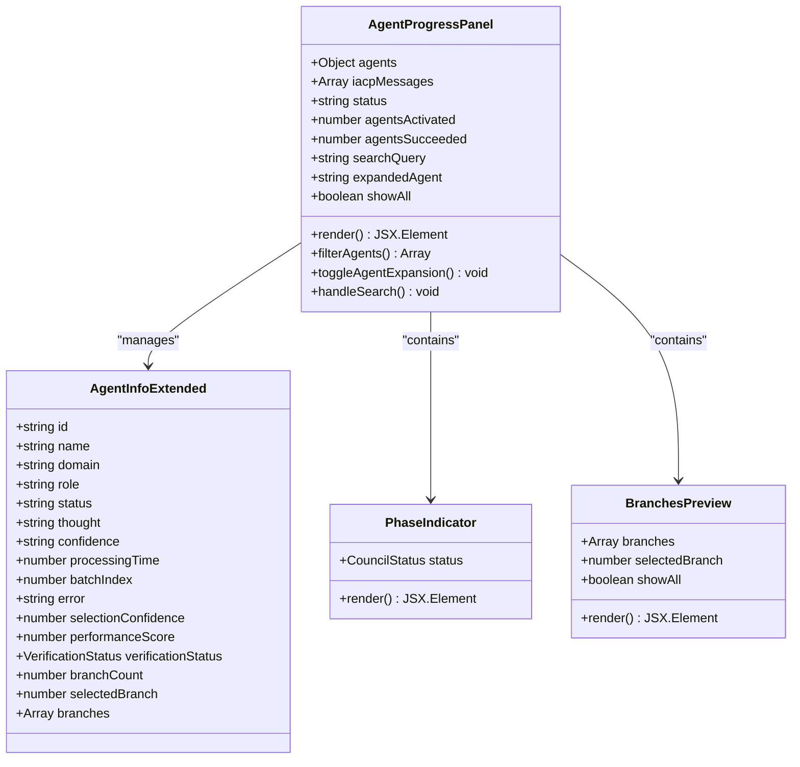
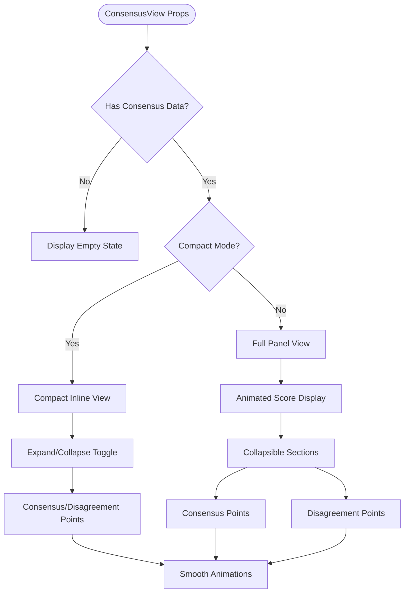
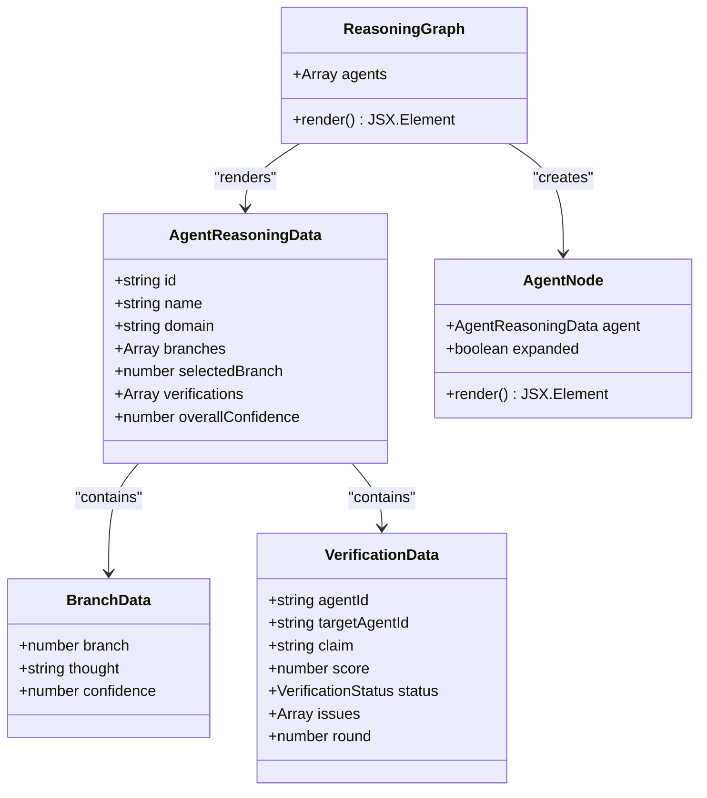
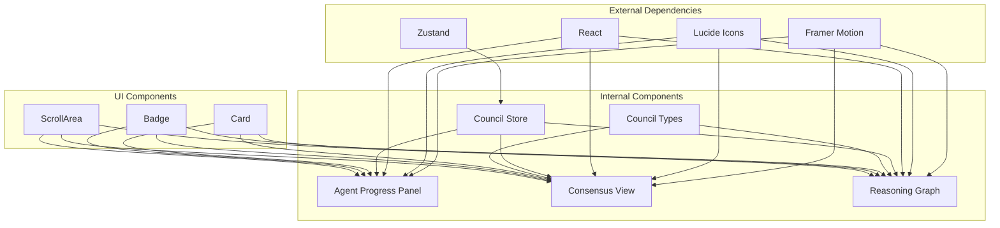

# Agent Visualization Components

<cite>
**Referenced Files in This Document**
- [consensus-view.tsx](file://src/components/council/consensus-view.tsx)
- [reasoning-graph.tsx](file://src/components/council/reasoning-graph.tsx)
- [agent-progress-panel.tsx](file://src/components/agents/agent-progress-panel.tsx)
- [council-store.ts](file://src/stores/council-store.ts)
- [council.ts](file://src/types/council.ts)
- [chat-area.tsx](file://src/components/chat/chat-area.tsx)
- [chat-message.tsx](file://src/components/chat/chat-message.tsx)
- [use-chat.ts](file://src/hooks/use-chat.ts)
</cite>

## Table of Contents
1. [Introduction](#introduction)
2. [Project Structure](#project-structure)
3. [Core Components](#core-components)
4. [Architecture Overview](#architecture-overview)
5. [Detailed Component Analysis](#detailed-component-analysis)
6. [Dependency Analysis](#dependency-analysis)
7. [Performance Considerations](#performance-considerations)
8. [Troubleshooting Guide](#troubleshooting-guide)
9. [Conclusion](#conclusion)

## Introduction
This document provides comprehensive technical documentation for the agent visualization components that display multi-agent collaboration and reasoning processes. The system consists of three primary visualization components: the Agent Progress Panel, the Consensus View, and the Reasoning Graph. These components work together to provide real-time visibility into the agent council's operations, enabling users to understand agent status, collaborative decision-making, and reasoning flows.

The visualization system integrates tightly with the council-store for real-time state synchronization and leverages Framer Motion for smooth animations. The components support both full-panel views and compact inline modes for embedding within chat conversations.

## Project Structure
The agent visualization components are organized within the Next.js application structure under the `src/components` directory. The key visualization components are located in dedicated subdirectories:

**Diagram sources**
- [agent-progress-panel.tsx:1-583](file://src/components/agents/agent-progress-panel.tsx#L1-L583)
- [consensus-view.tsx:1-266](file://src/components/council/consensus-view.tsx#L1-L266)
- [reasoning-graph.tsx:1-258](file://src/components/council/reasoning-graph.tsx#L1-L258)
- [council-store.ts:1-188](file://src/stores/council-store.ts#L1-L188)
- [council.ts:1-114](file://src/types/council.ts#L1-L114)

**Section sources**
- [agent-progress-panel.tsx:1-583](file://src/components/agents/agent-progress-panel.tsx#L1-L583)
- [consensus-view.tsx:1-266](file://src/components/council/consensus-view.tsx#L1-L266)
- [reasoning-graph.tsx:1-258](file://src/components/council/reasoning-graph.tsx#L1-L258)
- [council-store.ts:1-188](file://src/stores/council-store.ts#L1-L188)
- [council.ts:1-114](file://src/types/council.ts#L1-L114)

## Core Components

### Agent Progress Panel
The Agent Progress Panel serves as the central dashboard for monitoring agent activities and collaboration status. It displays individual agent information, current tasks, completion metrics, and real-time status updates.

Key features include:
- Real-time agent status tracking (waiting, thinking, complete, error)
- Domain-based color coding for visual differentiation
- Interactive agent expansion for detailed insights
- Search and filtering capabilities
- Performance metrics and verification status indicators
- IACP message threading for inter-agent communication

### Consensus View
The Consensus View component visualizes agreement among agents and decision-making processes. It presents consensus scores, agreement points, and disagreement indicators with animated progress bars and collapsible sections.

Key features include:
- Dynamic consensus scoring with color-coded thresholds
- Animated progress indicators for visual impact
- Collapsible sections for detailed point analysis
- Compact inline mode for chat integration
- Color-coded status indicators (green for high consensus, amber for moderate, red for low)

### Reasoning Graph
The Reasoning Graph component displays agent discussions, argument chains, and collaborative reasoning flows. It shows branching reasoning paths, confidence levels, and verification results across multiple agents.

Key features include:
- Multi-agent reasoning tree visualization
- Branch-based thought process representation
- Confidence level indicators with animated bars
- Verification status tracking with issue reporting
- Expandable agent nodes for detailed analysis

**Section sources**
- [agent-progress-panel.tsx:340-583](file://src/components/agents/agent-progress-panel.tsx#L340-L583)
- [consensus-view.tsx:244-266](file://src/components/council/consensus-view.tsx#L244-L266)
- [reasoning-graph.tsx:229-258](file://src/components/council/reasoning-graph.tsx#L229-L258)

## Architecture Overview

**Diagram sources**
- [use-chat.ts:85-120](file://src/hooks/use-chat.ts#L85-L120)
- [council-store.ts:54-171](file://src/stores/council-store.ts#L54-L171)
- [agent-progress-panel.tsx:340-345](file://src/components/agents/agent-progress-panel.tsx#L340-L345)
- [consensus-view.tsx:244-266](file://src/components/council/consensus-view.tsx#L244-L266)
- [reasoning-graph.tsx:229-258](file://src/components/council/reasoning-graph.tsx#L229-L258)
- [chat-message.tsx:183-185](file://src/components/chat/chat-message.tsx#L183-L185)

The architecture follows a unidirectional data flow pattern where SSE events trigger state updates in the council store, which automatically re-renders all connected visualization components. This ensures consistent state synchronization across all visualizations.

**Section sources**
- [use-chat.ts:85-120](file://src/hooks/use-chat.ts#L85-L120)
- [council-store.ts:54-171](file://src/stores/council-store.ts#L54-L171)

## Detailed Component Analysis

### Agent Progress Panel Analysis

**Diagram sources**
- [agent-progress-panel.tsx:340-583](file://src/components/agents/agent-progress-panel.tsx#L340-L583)
- [agent-progress-panel.tsx:32-49](file://src/components/agents/agent-progress-panel.tsx#L32-L49)
- [agent-progress-panel.tsx:82-133](file://src/components/agents/agent-progress-panel.tsx#L82-L133)
- [agent-progress-panel.tsx:259-335](file://src/components/agents/agent-progress-panel.tsx#L259-L335)

The Agent Progress Panel implements several sophisticated features:

#### State Management and Filtering
The component maintains local state for search queries, agent expansion, and display preferences. It implements intelligent collapsing mechanisms that show fewer agents initially and expand when needed, improving performance with large agent sets.

#### Domain-Based Color Coding
A comprehensive color mapping system assigns distinct colors to different agent domains, enabling quick visual identification of agent specializations. The color palette includes technology, business, law, science, creativity, and other specialized domains.

#### Interactive Elements
- Expandable agent cards with smooth animations
- Search and filter functionality with real-time updates
- Performance badges indicating agent effectiveness
- Verification status indicators for trustworthiness assessment

#### Data Binding Patterns
The panel binds to the council store through React hooks, automatically updating as agent states change. It handles complex data transformations including agent grouping by role and dynamic confidence score rendering.

**Section sources**
- [agent-progress-panel.tsx:340-583](file://src/components/agents/agent-progress-panel.tsx#L340-L583)
- [agent-progress-panel.tsx:51-63](file://src/components/agents/agent-progress-panel.tsx#L51-L63)
- [agent-progress-panel.tsx:349-365](file://src/components/agents/agent-progress-panel.tsx#L349-L365)

### Consensus View Analysis

**Diagram sources**
- [consensus-view.tsx:244-266](file://src/components/council/consensus-view.tsx#L244-L266)
- [consensus-view.tsx:131-194](file://src/components/council/consensus-view.tsx#L131-L194)
- [consensus-view.tsx:198-240](file://src/components/council/consensus-view.tsx#L198-L240)

The Consensus View implements sophisticated data visualization patterns:

#### Scoring and Threshold System
The component uses a three-tier scoring system with automatic color coding:
- High consensus (>0.7): Emerald green progression bars
- Moderate consensus (>0.4): Amber yellow progression bars  
- Low consensus (≤0.4): Red progression bars

#### Animation and Interaction
Framer Motion provides smooth transitions for:
- Animated progress bar fills
- Collapsible section expansions
- State changes between compact and full modes
- Hover effects and interactive elements

#### Data Structure Support
The component expects ConsensusResult objects containing:
- consensusPoints: Agreed-upon statements
- disagreementPoints: Disputed statements  
- consensusScore: Numerical agreement metric

**Section sources**
- [consensus-view.tsx:27-43](file://src/components/council/consensus-view.tsx#L27-L43)
- [consensus-view.tsx:47-72](file://src/components/council/consensus-view.tsx#L47-L72)
- [consensus-view.tsx:131-194](file://src/components/council/consensus-view.tsx#L131-L194)

### Reasoning Graph Analysis

**Diagram sources**
- [reasoning-graph.tsx:229-258](file://src/components/council/reasoning-graph.tsx#L229-L258)
- [reasoning-graph.tsx:36-44](file://src/components/council/reasoning-graph.tsx#L36-L44)
- [reasoning-graph.tsx:20-34](file://src/components/council/reasoning-graph.tsx#L20-L34)
- [reasoning-graph.tsx:90-225](file://src/components/council/reasoning-graph.tsx#L90-L225)

The Reasoning Graph provides comprehensive visualization of agent reasoning processes:

#### Multi-Agent Tree Structure
Each agent is represented as a collapsible node containing:
- Overall confidence indicators
- Reasoning branches with confidence levels
- Verification results from peer agents
- Thought content previews with expand/collapse functionality

#### Verification System Integration
The component displays verification results with:
- Status icons (verified, disputed, unverified)
- Confidence scores out of 10
- Detailed issue lists for disputed claims
- Round-based tracking of verification cycles

#### Confidence Visualization
Confidence levels are rendered using:
- Color-coded bars (emerald, amber, red)
- Percentage displays with smooth animations
- Branch-specific confidence indicators
- Overall agent confidence assessment

**Section sources**
- [reasoning-graph.tsx:90-225](file://src/components/council/reasoning-graph.tsx#L90-L225)
- [reasoning-graph.tsx:52-62](file://src/components/council/reasoning-graph.tsx#L52-L62)
- [reasoning-graph.tsx:229-258](file://src/components/council/reasoning-graph.tsx#L229-L258)

## Dependency Analysis

**Diagram sources**
- [agent-progress-panel.tsx:3-27](file://src/components/agents/agent-progress-panel.tsx#L3-L27)
- [consensus-view.tsx:3-15](file://src/components/council/consensus-view.tsx#L3-L15)
- [reasoning-graph.tsx:3-16](file://src/components/council/reasoning-graph.tsx#L3-L16)
- [council-store.ts:1](file://src/stores/council-store.ts#L1)
- [council.ts:1-114](file://src/types/council.ts#L1-L114)

The visualization components have carefully managed dependencies:

### External Dependencies
- **Framer Motion**: Provides smooth animations and transitions for all interactive elements
- **Lucide Icons**: Consistent iconography across all components
- **React**: Core framework with hooks for state management
- **Zustand**: Lightweight state management for the council system

### Internal Dependencies
- **UI Components**: Shared components from the application's design system
- **Type Definitions**: Strongly typed interfaces for data consistency
- **Animation Libraries**: Consistent animation patterns across components

**Section sources**
- [agent-progress-panel.tsx:3-27](file://src/components/agents/agent-progress-panel.tsx#L3-L27)
- [consensus-view.tsx:3-15](file://src/components/council/consensus-view.tsx#L3-L15)
- [reasoning-graph.tsx:3-16](file://src/components/council/reasoning-graph.tsx#L3-L16)

## Performance Considerations

### State Synchronization Optimization
The components implement efficient state management patterns:

#### Efficient Re-rendering
- Individual components subscribe only to relevant state slices
- Memoization prevents unnecessary re-renders
- Local state management reduces global state pressure

#### Large Dataset Handling
- Intelligent collapsing for agent lists (8 visible, others hidden)
- Lazy loading of detailed content
- Optimized rendering for expanded agent cards

#### Animation Performance
- Hardware-accelerated animations via Framer Motion
- Optimized transition durations (0.2-0.6 seconds)
- Batched updates to minimize layout thrashing

### Real-time Update Strategies
- Debounced state updates prevent excessive re-renders
- Incremental state updates for partial data changes
- Efficient event handling in the SSE integration layer

## Troubleshooting Guide

### Common Issues and Solutions

#### State Synchronization Problems
**Issue**: Components not updating with new data
**Solution**: Verify SSE event handlers are properly registered and the council store is receiving events

#### Performance Degradation
**Issue**: Slow rendering with many agents
**Solution**: Check the collapse threshold configuration and ensure proper memoization usage

#### Animation Issues
**Issue**: Janky or inconsistent animations
**Solution**: Verify Framer Motion versions and check for conflicting CSS transitions

### Debugging Techniques

#### State Inspection
Use React DevTools to inspect component props and state at runtime. Monitor the council store state for proper event handling.

#### Event Flow Tracing
Enable console logging in the SSE event handlers to trace data flow from server to components.

#### Performance Profiling
Use React Profiler to identify components with excessive re-renders or expensive computations.

**Section sources**
- [council-store.ts:54-171](file://src/stores/council-store.ts#L54-L171)
- [use-chat.ts:85-120](file://src/hooks/use-chat.ts#L85-L120)

## Conclusion

The agent visualization components provide a comprehensive solution for displaying multi-agent collaboration and reasoning processes. The system successfully balances real-time responsiveness with visual clarity through careful state management, efficient rendering patterns, and thoughtful animation design.

Key strengths of the implementation include:
- **Real-time Synchronization**: Seamless integration with the council system via SSE events
- **Visual Clarity**: Color-coded systems and intuitive layouts for complex data
- **Performance Optimization**: Smart rendering strategies for large datasets
- **Accessibility**: Proper ARIA labels and keyboard navigation support
- **Extensibility**: Modular design allowing easy customization and enhancement

The components serve as effective bridges between complex agent orchestration systems and human understanding, enabling users to monitor, interpret, and act upon multi-agent reasoning processes effectively.