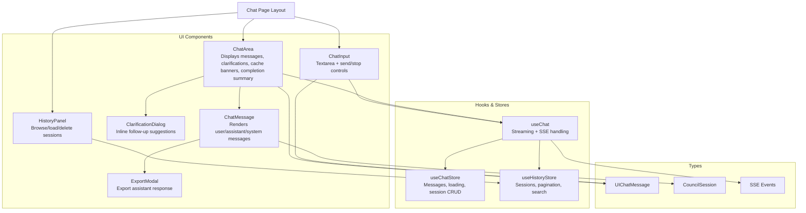
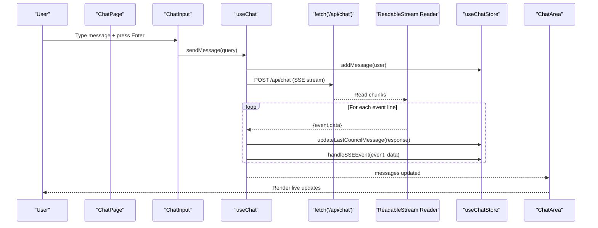
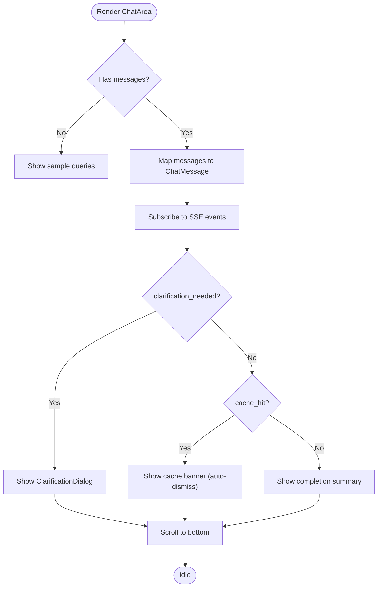
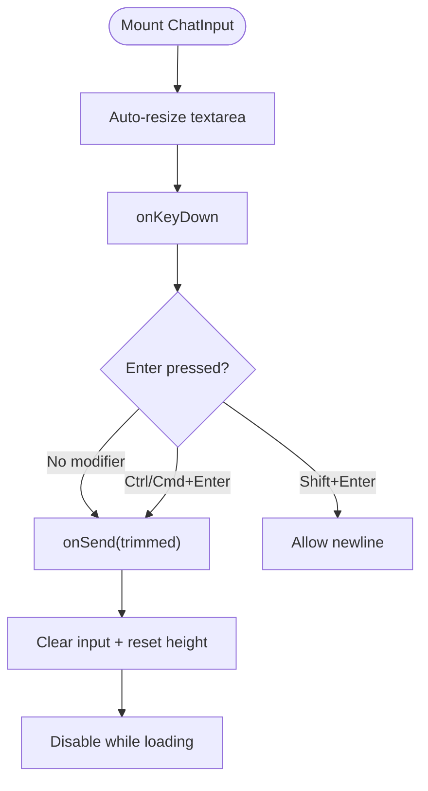
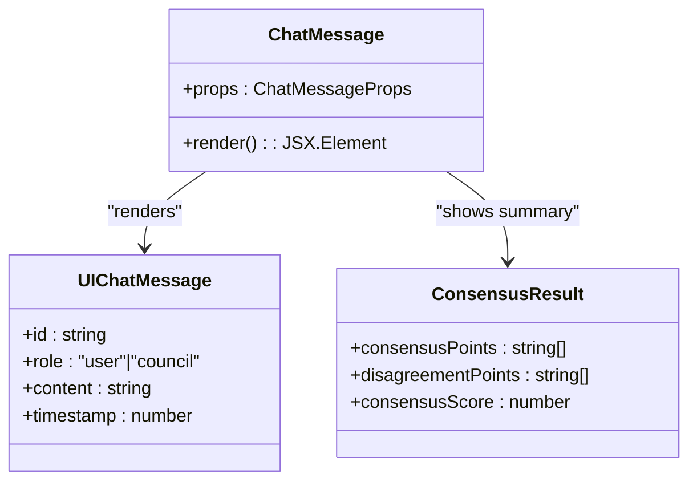
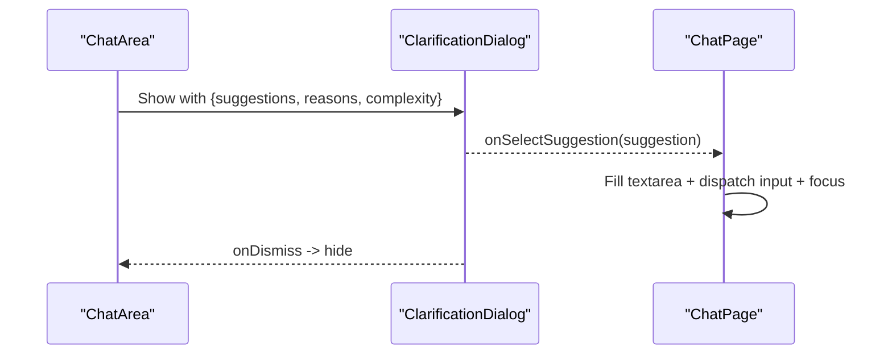
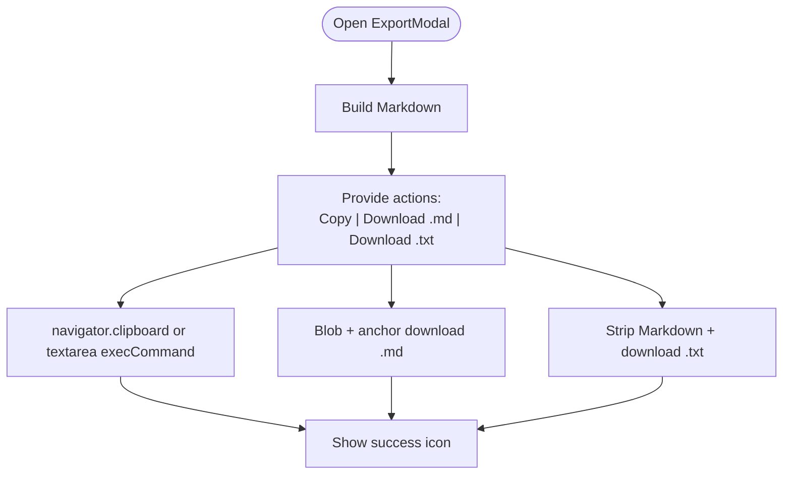
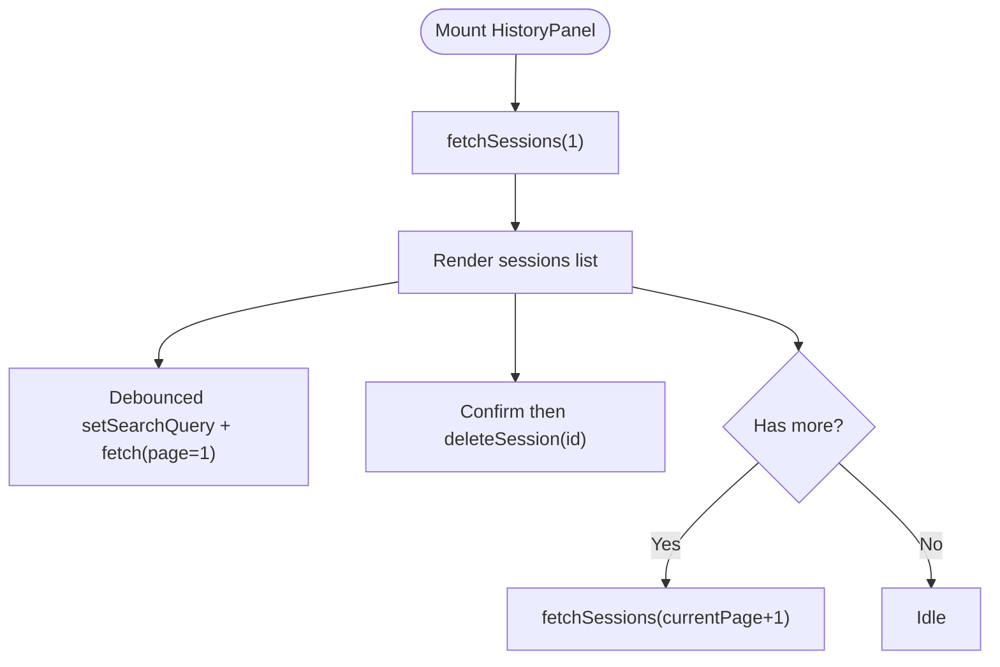
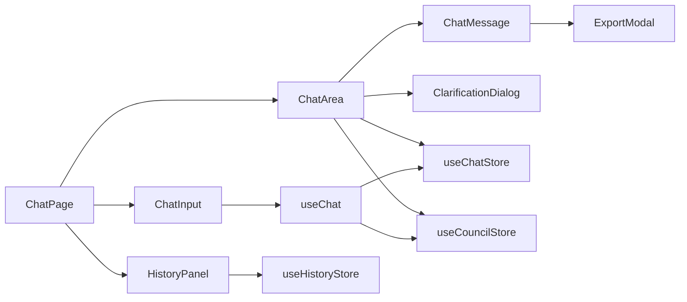

# Chat Interface Components

<cite>
**Referenced Files in This Document**
- [chat-area.tsx](file://src/components/chat/chat-area.tsx)
- [chat-input.tsx](file://src/components/chat/chat-input.tsx)
- [chat-message.tsx](file://src/components/chat/chat-message.tsx)
- [clarification-dialog.tsx](file://src/components/chat/clarification-dialog.tsx)
- [export-modal.tsx](file://src/components/chat/export-modal.tsx)
- [history-panel.tsx](file://src/components/chat/history-panel.tsx)
- [chat-store.ts](file://src/stores/chat-store.ts)
- [history-store.ts](file://src/stores/history-store.ts)
- [use-chat.ts](file://src/hooks/use-chat.ts)
- [page.tsx](file://src/app/chat/page.tsx)
- [chat.ts](file://src/types/chat.ts)
- [index.ts](file://src/types/index.ts)
- [council.ts](file://src/types/council.ts)
- [sse.ts](file://src/types/sse.ts)
- [keyboard-shortcuts.ts](file://src/lib/keyboard-shortcuts.ts)
</cite>

## Table of Contents
1. [Introduction](#introduction)
2. [Project Structure](#project-structure)
3. [Core Components](#core-components)
4. [Architecture Overview](#architecture-overview)
5. [Detailed Component Analysis](#detailed-component-analysis)
6. [Dependency Analysis](#dependency-analysis)
7. [Performance Considerations](#performance-considerations)
8. [Troubleshooting Guide](#troubleshooting-guide)
9. [Conclusion](#conclusion)
10. [Appendices](#appendices)

## Introduction
This document provides comprehensive documentation for the chat interface components in the Deep Thinking AI application. It covers the chat area for displaying conversation history and real-time streaming responses, the chat input with text area handling and keyboard shortcuts, the chat message renderer for different roles, the clarification dialog for follow-up questions, the export modal for saving responses, and the history panel for browsing previous sessions. It also explains component props, event handlers, state management integration with chat-store and history-store, styling customization, accessibility features, responsive design patterns, and examples of component composition and integration with the SSE streaming system.

## Project Structure
The chat UI is composed of modular React components under the chat folder, orchestrated by a page-level component and backed by Zustand stores for chat and history. The SSE streaming integrates with a dedicated hook and the chat store to render incremental updates.

**Diagram sources**
- [chat-area.tsx:173-331](file://src/components/chat/chat-area.tsx#L173-L331)
- [chat-input.tsx:13-85](file://src/components/chat/chat-input.tsx#L13-L85)
- [chat-message.tsx:116-232](file://src/components/chat/chat-message.tsx#L116-L232)
- [clarification-dialog.tsx:15-98](file://src/components/chat/clarification-dialog.tsx#L15-L98)
- [export-modal.tsx:80-194](file://src/components/chat/export-modal.tsx#L80-L194)
- [history-panel.tsx:89-287](file://src/components/chat/history-panel.tsx#L89-L287)
- [use-chat.ts:8-157](file://src/hooks/use-chat.ts#L8-L157)
- [chat-store.ts:18-131](file://src/stores/chat-store.ts#L18-L131)
- [history-store.ts:30-107](file://src/stores/history-store.ts#L30-L107)
- [chat.ts:3-9](file://src/types/chat.ts#L3-L9)
- [council.ts:38-58](file://src/types/council.ts#L38-L58)
- [sse.ts:6-24](file://src/types/sse.ts#L6-L24)
- [page.tsx:25-367](file://src/app/chat/page.tsx#L25-L367)

**Section sources**
- [page.tsx:25-367](file://src/app/chat/page.tsx#L25-L367)
- [chat-area.tsx:173-331](file://src/components/chat/chat-area.tsx#L173-L331)
- [chat-input.tsx:13-85](file://src/components/chat/chat-input.tsx#L13-L85)
- [chat-message.tsx:116-232](file://src/components/chat/chat-message.tsx#L116-L232)
- [clarification-dialog.tsx:15-98](file://src/components/chat/clarification-dialog.tsx#L15-L98)
- [export-modal.tsx:80-194](file://src/components/chat/export-modal.tsx#L80-L194)
- [history-panel.tsx:89-287](file://src/components/chat/history-panel.tsx#L89-L287)
- [use-chat.ts:8-157](file://src/hooks/use-chat.ts#L8-L157)
- [chat-store.ts:18-131](file://src/stores/chat-store.ts#L18-L131)
- [history-store.ts:30-107](file://src/stores/history-store.ts#L30-L107)
- [chat.ts:3-9](file://src/types/chat.ts#L3-L9)
- [council.ts:38-58](file://src/types/council.ts#L38-L58)
- [sse.ts:6-24](file://src/types/sse.ts#L6-L24)

## Core Components
- ChatArea: Renders the conversation history, handles SSE-driven clarifications and cache hits, and displays completion summaries and token usage.
- ChatInput: Manages a resizable textarea, handles Enter/Special key send behavior, and provides Stop generation control.
- ChatMessage: Renders individual messages with role-specific styling, synthesis phase badges, disagreement banners, consensus views, and export actions.
- ClarificationDialog: Presents contextual suggestions and reasons for clarification and allows selecting a refined query.
- ExportModal: Builds and exports assistant responses as Markdown or plain text, with copy-to-clipboard support.
- HistoryPanel: Lists paginated sessions, supports search, deletion, and loads sessions into the chat.

**Section sources**
- [chat-area.tsx:173-331](file://src/components/chat/chat-area.tsx#L173-L331)
- [chat-input.tsx:13-85](file://src/components/chat/chat-input.tsx#L13-L85)
- [chat-message.tsx:116-232](file://src/components/chat/chat-message.tsx#L116-L232)
- [clarification-dialog.tsx:15-98](file://src/components/chat/clarification-dialog.tsx#L15-L98)
- [export-modal.tsx:80-194](file://src/components/chat/export-modal.tsx#L80-L194)
- [history-panel.tsx:89-287](file://src/components/chat/history-panel.tsx#L89-L287)

## Architecture Overview
The chat UI integrates tightly with a streaming hook that reads Server-Sent Events and updates the chat store. The page composes the UI, manages panel visibility, and wires keyboard shortcuts.

**Diagram sources**
- [use-chat.ts:22-128](file://src/hooks/use-chat.ts#L22-L128)
- [chat-store.ts:23-42](file://src/stores/chat-store.ts#L23-L42)
- [page.tsx:25-367](file://src/app/chat/page.tsx#L25-L367)
- [chat-area.tsx:173-331](file://src/components/chat/chat-area.tsx#L173-L331)

## Detailed Component Analysis

### ChatArea
- Purpose: Central chat renderer that displays messages, handles clarification suggestions, cache hits, and completion summaries.
- Props:
  - messages: UIChatMessage[]
  - onClarificationSelect?: (suggestion: string) => void
- Key behaviors:
  - Renders sample queries when no messages exist.
  - Uses preceding user query to enrich assistant context.
  - Subscribes to SSE events to show clarification dialog and cache hit banners.
  - Displays token usage bar or agent stats upon completion.
  - Scrolls to bottom on updates.

**Diagram sources**
- [chat-area.tsx:173-331](file://src/components/chat/chat-area.tsx#L173-L331)

**Section sources**
- [chat-area.tsx:22-33](file://src/components/chat/chat-area.tsx#L22-L33)
- [chat-area.tsx:173-331](file://src/components/chat/chat-area.tsx#L173-L331)
- [chat.ts:3-9](file://src/types/chat.ts#L3-L9)
- [sse.ts:99-104](file://src/types/sse.ts#L99-L104)

### ChatInput
- Purpose: Text input with auto-resize, Enter/Special key send, and Stop generation.
- Props:
  - onSend: (message: string) => void
  - onStop: () => void
  - isLoading: boolean
- Key behaviors:
  - Auto-resizes textarea based on content height (up to a max).
  - Prevents submission when empty or loading.
  - Supports Enter and Ctrl/Cmd+Enter for send; Shift+Enter for newline.
  - Provides Stop button when loading.

**Diagram sources**
- [chat-input.tsx:13-85](file://src/components/chat/chat-input.tsx#L13-L85)

**Section sources**
- [chat-input.tsx:13-85](file://src/components/chat/chat-input.tsx#L13-L85)

### ChatMessage
- Purpose: Renders individual messages with role-aware styling, synthesis phase badges, disagreement notices, consensus view, and export actions.
- Props:
  - message: UIChatMessage
  - userQuery?: string
  - synthesisPhase?: SynthesisPhase
  - consensus?: ConsensusResult | null
  - agentCount?: number
- Key behaviors:
  - Role-based avatar and alignment.
  - Hover action bar with Copy and optional Export.
  - Markdown rendering for assistant content.
  - Live synthesis phase indicators.
  - Disagreement banner when consensus is low.
  - Export modal for assistant responses.

**Diagram sources**
- [chat-message.tsx:116-232](file://src/components/chat/chat-message.tsx#L116-L232)
- [chat.ts:3-9](file://src/types/chat.ts#L3-L9)
- [council.ts:105-109](file://src/types/council.ts#L105-L109)

**Section sources**
- [chat-message.tsx:116-232](file://src/components/chat/chat-message.tsx#L116-L232)
- [chat.ts:3-9](file://src/types/chat.ts#L3-L9)
- [council.ts:105-109](file://src/types/council.ts#L105-L109)

### ClarificationDialog
- Purpose: Presents contextual suggestions and reasons for clarification and lets users refine the query.
- Props:
  - suggestions: string[]
  - reasons: string[]
  - complexity: string
  - onSelectSuggestion: (suggestion: string) => void
  - onDismiss: () => void
- Key behaviors:
  - Animated entrance/exit.
  - Renders reasons and suggestion buttons with hover effects.
  - Dismiss option to keep original query.

**Diagram sources**
- [clarification-dialog.tsx:15-98](file://src/components/chat/clarification-dialog.tsx#L15-L98)
- [page.tsx:64-76](file://src/app/chat/page.tsx#L64-L76)

**Section sources**
- [clarification-dialog.tsx:15-98](file://src/components/chat/clarification-dialog.tsx#L15-L98)
- [page.tsx:64-76](file://src/app/chat/page.tsx#L64-L76)

### ExportModal
- Purpose: Allows exporting assistant responses as Markdown or plain text, with clipboard copy.
- Props:
  - open: boolean
  - onOpenChange: (open: boolean) => void
  - query: string
  - response: string
  - agentCount?: number
  - consensusScore?: number
- Key behaviors:
  - Builds Markdown with metadata.
  - Copy-to-clipboard with fallback.
  - Downloads .md and .txt files.
  - Success feedback icons.

**Diagram sources**
- [export-modal.tsx:80-194](file://src/components/chat/export-modal.tsx#L80-L194)

**Section sources**
- [export-modal.tsx:80-194](file://src/components/chat/export-modal.tsx#L80-L194)

### HistoryPanel
- Purpose: Browse, search, and load previous sessions; delete sessions; paginate.
- Props:
  - onLoadSession: (id: string) => void
  - onNewSession: () => void
- Key behaviors:
  - Debounced search updates.
  - Skeleton loader while loading.
  - Delete confirmation with undo-like cancel.
  - Load more pagination.

**Diagram sources**
- [history-panel.tsx:89-287](file://src/components/chat/history-panel.tsx#L89-L287)
- [history-store.ts:37-64](file://src/stores/history-store.ts#L37-L64)

**Section sources**
- [history-panel.tsx:89-287](file://src/components/chat/history-panel.tsx#L89-L287)
- [history-store.ts:30-107](file://src/stores/history-store.ts#L30-L107)

## Dependency Analysis
- ChatArea depends on:
  - ChatMessage for rendering.
  - ClarificationDialog for inline suggestions.
  - useCouncilStore for SSE event handling and completion summaries.
  - UIChatMessage type for message shape.
- ChatInput depends on:
  - Button and textarea UI primitives.
  - Keyboard handling for send/stop.
- ChatMessage depends on:
  - ExportModal for assistant exports.
  - ConsensusView for synthesis summaries.
  - UIChatMessage and ConsensusResult types.
- ClarificationDialog depends on:
  - Motion animations and Button.
- ExportModal depends on:
  - Dialog components and file download utilities.
- HistoryPanel depends on:
  - useHistoryStore for CRUD and pagination.
  - UI primitives for search, scroll, and badges.
- State management:
  - useChatStore manages messages, loading, and session persistence.
  - useChat orchestrates SSE streaming and integrates with stores.
  - useKeyboardShortcuts enables global shortcuts.

**Diagram sources**
- [chat-area.tsx:173-331](file://src/components/chat/chat-area.tsx#L173-L331)
- [chat-input.tsx:13-85](file://src/components/chat/chat-input.tsx#L13-L85)
- [chat-message.tsx:116-232](file://src/components/chat/chat-message.tsx#L116-L232)
- [clarification-dialog.tsx:15-98](file://src/components/chat/clarification-dialog.tsx#L15-L98)
- [export-modal.tsx:80-194](file://src/components/chat/export-modal.tsx#L80-L194)
- [history-panel.tsx:89-287](file://src/components/chat/history-panel.tsx#L89-L287)
- [use-chat.ts:8-157](file://src/hooks/use-chat.ts#L8-L157)
- [chat-store.ts:18-131](file://src/stores/chat-store.ts#L18-L131)
- [history-store.ts:30-107](file://src/stores/history-store.ts#L30-L107)
- [page.tsx:25-367](file://src/app/chat/page.tsx#L25-L367)

**Section sources**
- [use-chat.ts:8-157](file://src/hooks/use-chat.ts#L8-L157)
- [chat-store.ts:18-131](file://src/stores/chat-store.ts#L18-L131)
- [history-store.ts:30-107](file://src/stores/history-store.ts#L30-L107)
- [page.tsx:25-367](file://src/app/chat/page.tsx#L25-L367)

## Performance Considerations
- ChatArea
  - Efficiently maps messages and conditionally renders clarification and cache banners only when needed.
  - Uses smooth scroll to bottom on updates to avoid layout thrash.
- ChatInput
  - Auto-resizes textarea efficiently with min/max heights to prevent excessive reflows.
- ChatMessage
  - Uses motion animations selectively and only when necessary (e.g., synthesis phase label).
  - Markdown rendering is scoped to assistant content to minimize parsing overhead.
- HistoryPanel
  - Debounces search input to reduce network requests.
  - Skeleton loaders improve perceived performance during initial load.
- Streaming
  - Incremental updates via SSE reduce latency and memory pressure compared to monolithic responses.

[No sources needed since this section provides general guidance]

## Troubleshooting Guide
- Clarification dialog does not appear
  - Ensure SSE event "council:clarification_needed" is emitted and handled by the chat area subscription.
  - Verify that onClarificationSelect prop is passed down from the page.
- Cache hit banner disappears immediately
  - Confirm the 5-second auto-dismiss timeout and that the event "council:cache_hit" is received.
- Export modal shows empty content
  - Check that query and response props are provided and that the assistant message has content.
- History search not working
  - Confirm setSearchQuery is being called and fetchSessions is invoked with the updated search query.
- Stop generation not stopping
  - Ensure the AbortController is created and stopGeneration calls abort() and resets loading state.

**Section sources**
- [chat-area.tsx:179-208](file://src/components/chat/chat-area.tsx#L179-L208)
- [export-modal.tsx:80-194](file://src/components/chat/export-modal.tsx#L80-L194)
- [history-panel.tsx:109-116](file://src/components/chat/history-panel.tsx#L109-L116)
- [use-chat.ts:130-133](file://src/hooks/use-chat.ts#L130-L133)

## Conclusion
The chat interface components form a cohesive, accessible, and responsive system. They integrate seamlessly with SSE streaming, manage state through dedicated stores, and provide powerful features like clarification suggestions, export capabilities, and session history. The modular design allows for easy customization of styles, accessibility enhancements, and responsive layouts.

[No sources needed since this section summarizes without analyzing specific files]

## Appendices

### Component Composition Examples
- Integrating ChatArea with ChatInput and HistoryPanel in the page layout.
- Wiring useChat hook to drive streaming and update stores.
- Passing onClarificationSelect to ChatArea to refine queries.

**Section sources**
- [page.tsx:242-264](file://src/app/chat/page.tsx#L242-L264)
- [use-chat.ts:22-128](file://src/hooks/use-chat.ts#L22-L128)
- [chat-area.tsx:24-25](file://src/components/chat/chat-area.tsx#L24-L25)

### Accessibility Features
- Keyboard shortcuts for toggling panels and closing overlays.
- Proper aria-labels and semantic markup in inputs and dialogs.
- Focus management when filling clarifications into the textarea.

**Section sources**
- [keyboard-shortcuts.ts:18-52](file://src/lib/keyboard-shortcuts.ts#L18-L52)
- [chat-input.tsx:54-58](file://src/components/chat/chat-input.tsx#L54-L58)
- [page.tsx:78-99](file://src/app/chat/page.tsx#L78-L99)

### Responsive Design Patterns
- Sidebar history panel slides in on desktop; overlays on mobile.
- Right-side agent/consensus panels use tabbed interface and overlay on small screens.
- Auto-hide/show controls for mobile-friendly UX.

**Section sources**
- [page.tsx:183-363](file://src/app/chat/page.tsx#L183-L363)