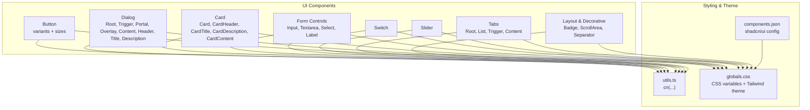
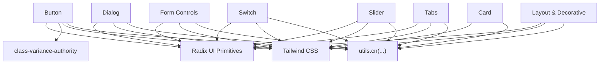
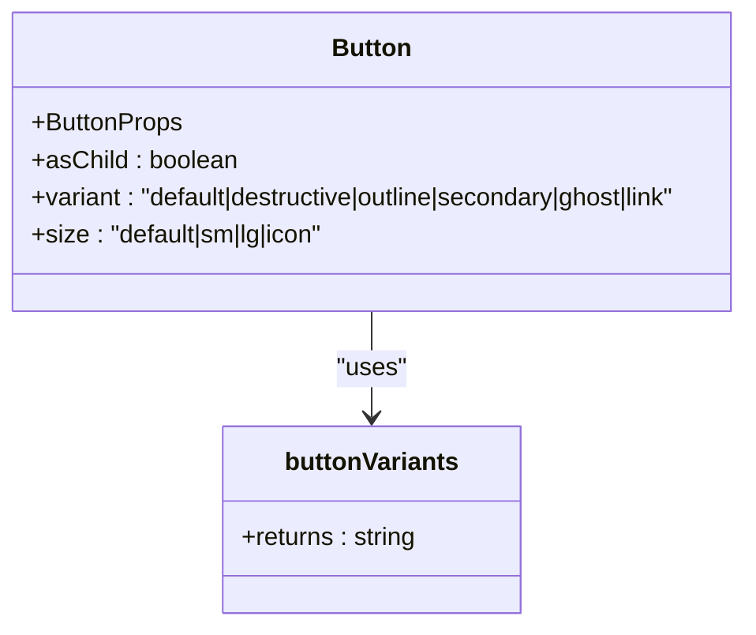
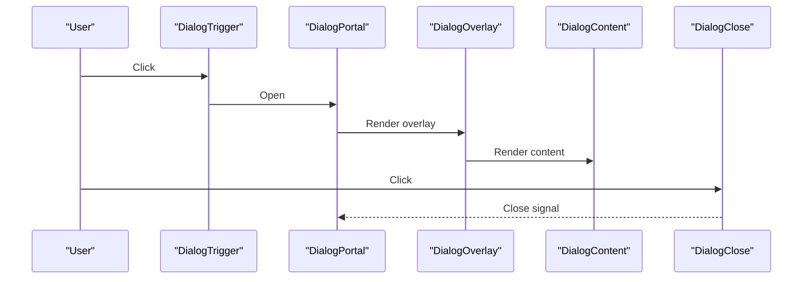
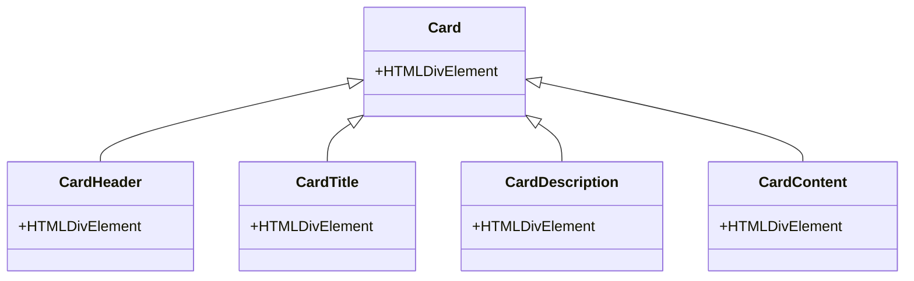
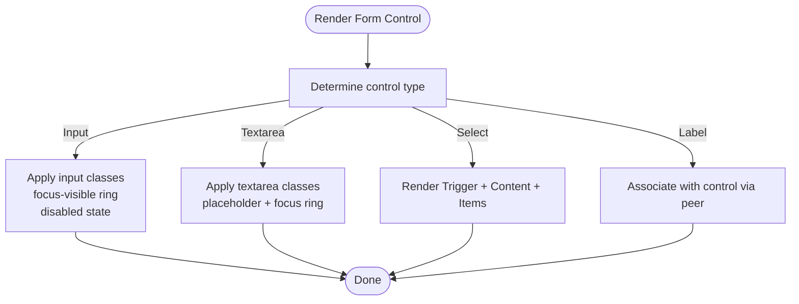
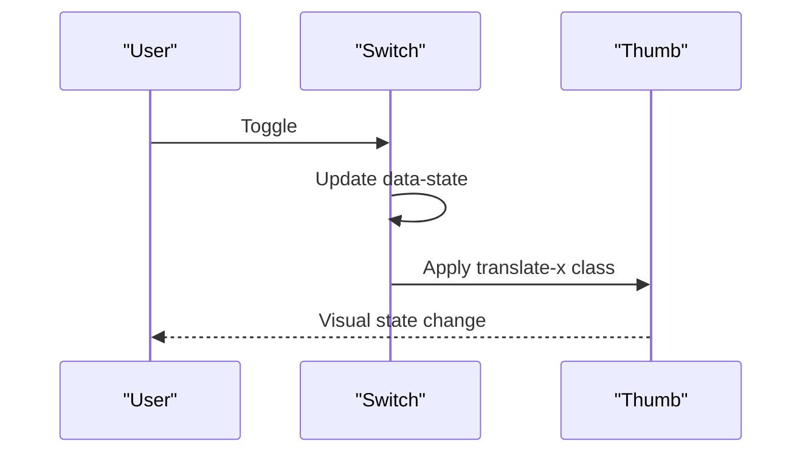
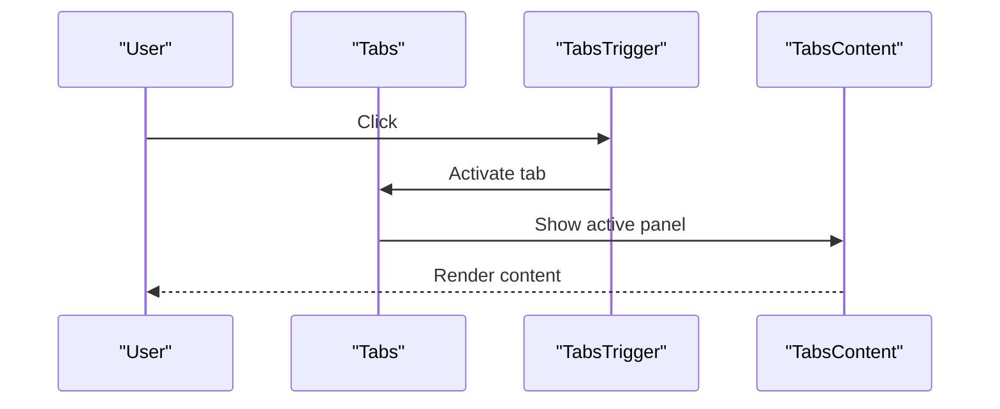
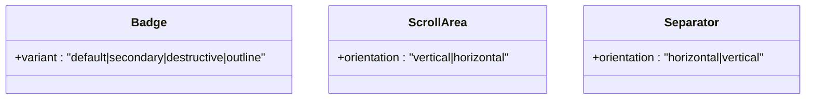
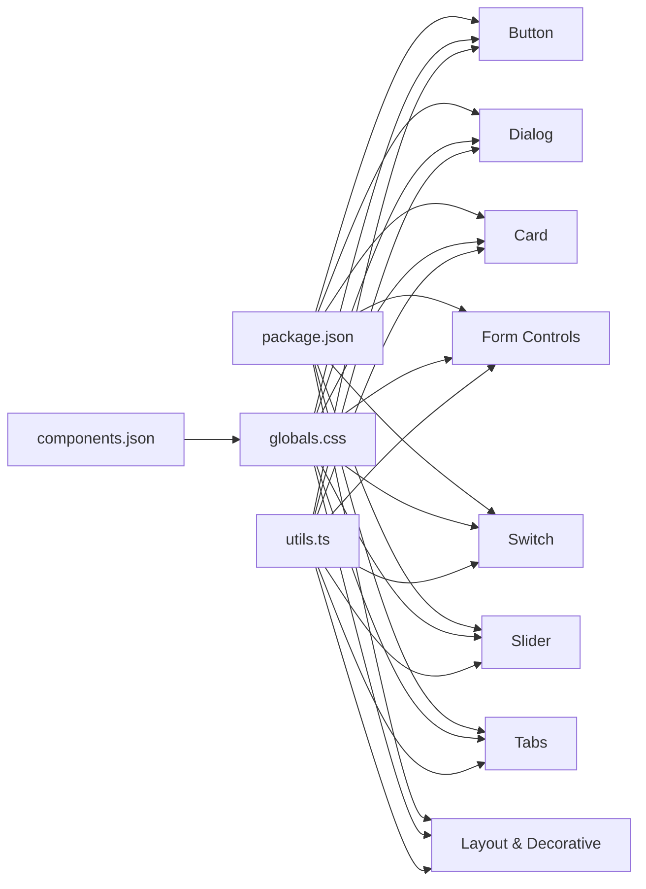

# Reusable UI Component Library

<cite>
**Referenced Files in This Document**
- [button.tsx](file://src/components/ui/button.tsx)
- [dialog.tsx](file://src/components/ui/dialog.tsx)
- [card.tsx](file://src/components/ui/card.tsx)
- [input.tsx](file://src/components/ui/input.tsx)
- [textarea.tsx](file://src/components/ui/textarea.tsx)
- [select.tsx](file://src/components/ui/select.tsx)
- [switch.tsx](file://src/components/ui/switch.tsx)
- [slider.tsx](file://src/components/ui/slider.tsx)
- [tabs.tsx](file://src/components/ui/tabs.tsx)
- [badge.tsx](file://src/components/ui/badge.tsx)
- [scroll-area.tsx](file://src/components/ui/scroll-area.tsx)
- [separator.tsx](file://src/components/ui/separator.tsx)
- [label.tsx](file://src/components/ui/label.tsx)
- [utils.ts](file://src/lib/utils.ts)
- [components.json](file://components.json)
- [package.json](file://package.json)
- [globals.css](file://src/app/globals.css)
- [next.config.ts](file://next.config.ts)
</cite>

## Table of Contents
1. [Introduction](#introduction)
2. [Project Structure](#project-structure)
3. [Core Components](#core-components)
4. [Architecture Overview](#architecture-overview)
5. [Detailed Component Analysis](#detailed-component-analysis)
6. [Dependency Analysis](#dependency-analysis)
7. [Performance Considerations](#performance-considerations)
8. [Troubleshooting Guide](#troubleshooting-guide)
9. [Conclusion](#conclusion)
10. [Appendices](#appendices)

## Introduction
This document describes a reusable UI component library built on Radix UI primitives and styled with Tailwind CSS. It covers component APIs, styling customization, accessibility, composition patterns, theme integration, and responsive design. The library emphasizes:
- Consistent design tokens via CSS variables and Tailwind theme configuration
- Accessible primitives powered by Radix UI
- Composable variants and sizes using class variance authority
- Utility-driven styling with a shared cn helper
- Extensibility guidelines for adding new components

## Project Structure
The UI components live under src/components/ui and are composed with:
- Radix UI primitives for accessibility and behavior
- Tailwind CSS for styling and design tokens
- class-variance-authority for variant systems
- lucide-react for icons
- A shared cn utility for merging Tailwind classes

**Diagram sources**
- [button.tsx:1-53](file://src/components/ui/button.tsx#L1-L53)
- [dialog.tsx:1-92](file://src/components/ui/dialog.tsx#L1-L92)
- [card.tsx:1-44](file://src/components/ui/card.tsx#L1-L44)
- [input.tsx:1-22](file://src/components/ui/input.tsx#L1-L22)
- [textarea.tsx:1-22](file://src/components/ui/textarea.tsx#L1-L22)
- [select.tsx:1-83](file://src/components/ui/select.tsx#L1-L83)
- [switch.tsx:1-29](file://src/components/ui/switch.tsx#L1-L29)
- [slider.tsx:1-25](file://src/components/ui/slider.tsx#L1-L25)
- [tabs.tsx:1-56](file://src/components/ui/tabs.tsx#L1-L56)
- [badge.tsx:1-31](file://src/components/ui/badge.tsx#L1-L31)
- [scroll-area.tsx:1-46](file://src/components/ui/scroll-area.tsx#L1-L46)
- [separator.tsx:1-26](file://src/components/ui/separator.tsx#L1-L26)
- [label.tsx:1-23](file://src/components/ui/label.tsx#L1-L23)
- [utils.ts:1-7](file://src/lib/utils.ts#L1-L7)
- [globals.css:1-239](file://src/app/globals.css#L1-L239)
- [components.json:1-22](file://components.json#L1-L22)

**Section sources**
- [components.json:1-22](file://components.json#L1-L22)
- [package.json:13-39](file://package.json#L13-L39)
- [globals.css:1-239](file://src/app/globals.css#L1-L239)

## Core Components
This section summarizes each component’s purpose, props, styling approach, and accessibility characteristics.

- Button
  - Purpose: Action element with variant and size variants.
  - Props: Inherits button attributes plus variant, size, and asChild.
  - Variants: default, destructive, outline, secondary, ghost, link.
  - Sizes: default, sm, lg, icon.
  - Accessibility: Inherits native button semantics; supports focus-visible ring via theme.
  - Composition: Uses class variance authority and cn for merging classes.
  - Reference: [button.tsx:32-50](file://src/components/ui/button.tsx#L32-L50)

- Dialog
  - Purpose: Modal overlay with content area and optional header/title/description.
  - Props: Root, Trigger, Portal, Overlay, Close accept standard attributes; Content accepts className and children.
  - Accessibility: Uses Radix UI dialog primitives; includes sr-only close label.
  - Animation: Fade/slide/zoom transitions driven by data-state attributes.
  - Reference: [dialog.tsx:8-91](file://src/components/ui/dialog.tsx#L8-L91)

- Card
  - Purpose: Container with header, title, description, and content slots.
  - Props: All components forward ref and className; no extra props.
  - Accessibility: Structural grouping via divs; no ARIA roles required.
  - Reference: [card.tsx:4-43](file://src/components/ui/card.tsx#L4-L43)

- Input
  - Purpose: Single-line text input with focus-visible ring and disabled states.
  - Props: Inherits input attributes; className supported.
  - Accessibility: Native input semantics; focus-visible ring from theme.
  - Reference: [input.tsx:4-19](file://src/components/ui/input.tsx#L4-L19)

- Textarea
  - Purpose: Multi-line text input with placeholder and focus-visible ring.
  - Props: Inherits textarea attributes; className supported.
  - Accessibility: Native textarea semantics; focus-visible ring from theme.
  - Reference: [textarea.tsx:4-19](file://src/components/ui/textarea.tsx#L4-L19)

- Select
  - Purpose: Dropdown selection with trigger, content, viewport, and items.
  - Props: Root, Trigger, Content, Item accept className and standard attributes; Content supports position.
  - Accessibility: Uses Radix UI Select; includes indicator and item text.
  - Reference: [select.tsx:8-82](file://src/components/ui/select.tsx#L8-L82)

- Switch
  - Purpose: Binary toggle with thumb animation.
  - Props: Inherits primitive root attributes; className supported.
  - Accessibility: Uses Radix UI Switch; supports focus-visible ring.
  - Reference: [switch.tsx:7-26](file://src/components/ui/switch.tsx#L7-L26)

- Slider
  - Purpose: Range slider with track and draggable thumb.
  - Props: Inherits primitive root attributes; className supported.
  - Accessibility: Uses Radix UI Slider; supports focus-visible ring.
  - Reference: [slider.tsx:7-22](file://src/components/ui/slider.tsx#L7-L22)

- Tabs
  - Purpose: Tabbed interface with list, triggers, and content panels.
  - Props: Root, List, Trigger, Content accept className and standard attributes.
  - Accessibility: Uses Radix UI Tabs; active state styling via data-state.
  - Reference: [tabs.tsx:8-55](file://src/components/ui/tabs.tsx#L8-L55)

- Badge
  - Purpose: Label-style indicator with variant system.
  - Props: Inherits HTML attributes plus variant.
  - Variants: default, secondary, destructive, outline.
  - Reference: [badge.tsx:22-28](file://src/components/ui/badge.tsx#L22-L28)

- ScrollArea
  - Purpose: Container with integrated scrollbar and corner.
  - Props: Root and ScrollBar accept className and orientation; ScrollBar supports vertical/horizontal.
  - Accessibility: Uses Radix UI ScrollArea; scrollbar is interactive.
  - Reference: [scroll-area.tsx:7-45](file://src/components/ui/scroll-area.tsx#L7-L45)

- Separator
  - Purpose: Divider with horizontal/vertical orientation.
  - Props: Inherits primitive root attributes; supports orientation and decorative.
  - Accessibility: Uses Radix UI Separator; decorative flag recommended.
  - Reference: [separator.tsx:7-22](file://src/components/ui/separator.tsx#L7-L22)

- Label
  - Purpose: Associated label for form controls.
  - Props: Inherits primitive root attributes; className supported.
  - Accessibility: Uses Radix UI Label; integrates with form controls via peer selectors.
  - Reference: [label.tsx:7-19](file://src/components/ui/label.tsx#L7-L19)

**Section sources**
- [button.tsx:32-50](file://src/components/ui/button.tsx#L32-L50)
- [dialog.tsx:8-91](file://src/components/ui/dialog.tsx#L8-L91)
- [card.tsx:4-43](file://src/components/ui/card.tsx#L4-L43)
- [input.tsx:4-19](file://src/components/ui/input.tsx#L4-L19)
- [textarea.tsx:4-19](file://src/components/ui/textarea.tsx#L4-L19)
- [select.tsx:8-82](file://src/components/ui/select.tsx#L8-L82)
- [switch.tsx:7-26](file://src/components/ui/switch.tsx#L7-L26)
- [slider.tsx:7-22](file://src/components/ui/slider.tsx#L7-L22)
- [tabs.tsx:8-55](file://src/components/ui/tabs.tsx#L8-L55)
- [badge.tsx:22-28](file://src/components/ui/badge.tsx#L22-L28)
- [scroll-area.tsx:7-45](file://src/components/ui/scroll-area.tsx#L7-L45)
- [separator.tsx:7-22](file://src/components/ui/separator.tsx#L7-L22)
- [label.tsx:7-19](file://src/components/ui/label.tsx#L7-L19)

## Architecture Overview
The library follows a consistent pattern:
- Each component composes Radix UI primitives for behavior and accessibility.
- Styling is applied via Tailwind classes merged with cn.
- Variants are defined with class-variance-authority for predictable overrides.
- Theme tokens are centralized in CSS variables and Tailwind theme configuration.

**Diagram sources**
- [button.tsx:6-30](file://src/components/ui/button.tsx#L6-L30)
- [dialog.tsx:3-26](file://src/components/ui/dialog.tsx#L3-L26)
- [card.tsx:1-13](file://src/components/ui/card.tsx#L1-L13)
- [input.tsx:1-21](file://src/components/ui/input.tsx#L1-L21)
- [textarea.tsx:1-21](file://src/components/ui/textarea.tsx#L1-L21)
- [select.tsx:3-29](file://src/components/ui/select.tsx#L3-L29)
- [switch.tsx:3-26](file://src/components/ui/switch.tsx#L3-L26)
- [slider.tsx:3-22](file://src/components/ui/slider.tsx#L3-L22)
- [tabs.tsx:3-23](file://src/components/ui/tabs.tsx#L3-L23)
- [badge.tsx:5-20](file://src/components/ui/badge.tsx#L5-L20)
- [scroll-area.tsx:3-43](file://src/components/ui/scroll-area.tsx#L3-L43)
- [separator.tsx:3-22](file://src/components/ui/separator.tsx#L3-L22)
- [label.tsx:3-19](file://src/components/ui/label.tsx#L3-L19)
- [utils.ts:4-6](file://src/lib/utils.ts#L4-L6)
- [globals.css:5-31](file://src/app/globals.css#L5-L31)

## Detailed Component Analysis

### Button
- Composition: Uses Slot when asChild is true to enable composition with links or other elements.
- Variants and sizes: Defined via class-variance-authority; default and size classes merge with className.
- Accessibility: Inherits button semantics; focus-visible ring from theme.
- Customization: Pass className to override styles; variant/size to change appearance.

**Diagram sources**
- [button.tsx:32-50](file://src/components/ui/button.tsx#L32-L50)
- [button.tsx:6-30](file://src/components/ui/button.tsx#L6-L30)

**Section sources**
- [button.tsx:32-50](file://src/components/ui/button.tsx#L32-L50)

### Dialog
- Composition: Exports Root, Trigger, Portal, Overlay, Content, Header, Title, Description, Close.
- Behavior: Overlay animates in/out; Content centers with max-width; Close button included with sr-only label.
- Accessibility: Uses Radix UI dialog; data-state attributes drive animations.

**Diagram sources**
- [dialog.tsx:8-91](file://src/components/ui/dialog.tsx#L8-L91)

**Section sources**
- [dialog.tsx:8-91](file://src/components/ui/dialog.tsx#L8-L91)

### Card
- Composition: Provides semantic sections for header, title, description, and content.
- Styling: Uses card background and foreground tokens; spacing via padding/margin utilities.

**Diagram sources**
- [card.tsx:4-43](file://src/components/ui/card.tsx#L4-L43)

**Section sources**
- [card.tsx:4-43](file://src/components/ui/card.tsx#L4-L43)

### Form Controls (Input, Textarea, Select, Label)
- Input and Textarea: Forward refs and className; focus-visible ring from theme; disabled states handled.
- Select: Trigger with icon, Content with viewport, Item with indicator and text.
- Label: Associates with form controls via peer selectors; inherits primitive behavior.

**Diagram sources**
- [input.tsx:4-19](file://src/components/ui/input.tsx#L4-L19)
- [textarea.tsx:4-19](file://src/components/ui/textarea.tsx#L4-L19)
- [select.tsx:12-82](file://src/components/ui/select.tsx#L12-L82)
- [label.tsx:7-19](file://src/components/ui/label.tsx#L7-L19)

**Section sources**
- [input.tsx:4-19](file://src/components/ui/input.tsx#L4-L19)
- [textarea.tsx:4-19](file://src/components/ui/textarea.tsx#L4-L19)
- [select.tsx:12-82](file://src/components/ui/select.tsx#L12-L82)
- [label.tsx:7-19](file://src/components/ui/label.tsx#L7-L19)

### Switch and Slider
- Switch: Toggle root with animated thumb; supports focus-visible ring.
- Slider: Track and range with draggable thumb; supports focus-visible ring.

**Diagram sources**
- [switch.tsx:7-26](file://src/components/ui/switch.tsx#L7-L26)

**Section sources**
- [switch.tsx:7-26](file://src/components/ui/switch.tsx#L7-L26)
- [slider.tsx:7-22](file://src/components/ui/slider.tsx#L7-L22)

### Tabs
- Composition: Root manages state; List holds triggers; Content panels.
- Active state: Uses data-state for active styling.

**Diagram sources**
- [tabs.tsx:8-55](file://src/components/ui/tabs.tsx#L8-L55)

**Section sources**
- [tabs.tsx:8-55](file://src/components/ui/tabs.tsx#L8-L55)

### Layout and Decorative (Badge, ScrollArea, Separator)
- Badge: Variant system for color/background/outline combinations.
- ScrollArea: Root with viewport and ScrollBar; supports vertical/horizontal orientation.
- Separator: Horizontal/vertical divider with orientation-aware sizing.

**Diagram sources**
- [badge.tsx:22-28](file://src/components/ui/badge.tsx#L22-L28)
- [scroll-area.tsx:25-43](file://src/components/ui/scroll-area.tsx#L25-L43)
- [separator.tsx:7-22](file://src/components/ui/separator.tsx#L7-L22)

**Section sources**
- [badge.tsx:22-28](file://src/components/ui/badge.tsx#L22-L28)
- [scroll-area.tsx:25-43](file://src/components/ui/scroll-area.tsx#L25-L43)
- [separator.tsx:7-22](file://src/components/ui/separator.tsx#L7-L22)

## Dependency Analysis
- External dependencies: Radix UI packages, class-variance-authority, lucide-react, Tailwind utilities.
- Internal dependencies: utils.cn for class merging; globals.css for theme tokens.
- Configuration: components.json aligns aliases and Tailwind settings; next.config.ts is minimal.

**Diagram sources**
- [package.json:13-39](file://package.json#L13-L39)
- [components.json:1-22](file://components.json#L1-L22)
- [globals.css:1-239](file://src/app/globals.css#L1-L239)
- [utils.ts:1-7](file://src/lib/utils.ts#L1-L7)

**Section sources**
- [package.json:13-39](file://package.json#L13-L39)
- [components.json:1-22](file://components.json#L1-L22)
- [globals.css:1-239](file://src/app/globals.css#L1-L239)
- [utils.ts:1-7](file://src/lib/utils.ts#L1-L7)

## Performance Considerations
- Prefer variant props over ad-hoc className merges to keep render paths predictable.
- Use asChild where appropriate to avoid unnecessary DOM nodes.
- Keep animations scoped to minimal elements (e.g., overlay/content) to reduce layout thrash.
- Avoid excessive re-renders by memoizing derived classes when composing variants.

## Troubleshooting Guide
- Focus rings not visible
  - Ensure focus-visible styles are present in the global stylesheet and theme variables are set.
  - Verify the component forwards ref and applies focus-visible ring classes.
  - Reference: [globals.css:198-213](file://src/app/globals.css#L198-L213)

- Disabled state not applying
  - Confirm disabled pointer-events and opacity classes are included in component styles.
  - Reference: [input.tsx:10](file://src/components/ui/input.tsx#L10), [textarea.tsx:11](file://src/components/ui/textarea.tsx#L11)

- Dialog not closing
  - Ensure DialogClose is rendered inside DialogContent and used to trigger close.
  - Reference: [dialog.tsx:43-46](file://src/components/ui/dialog.tsx#L43-L46)

- Select item not highlighted
  - Verify SelectItemIndicator is present and positioned correctly.
  - Reference: [select.tsx:72-76](file://src/components/ui/select.tsx#L72-L76)

- Scrollbar not visible
  - Confirm ScrollBar is rendered inside ScrollArea and orientation matches content.
  - Reference: [scroll-area.tsx:19](file://src/components/ui/scroll-area.tsx#L19)

**Section sources**
- [globals.css:198-213](file://src/app/globals.css#L198-L213)
- [input.tsx:10](file://src/components/ui/input.tsx#L10)
- [textarea.tsx:11](file://src/components/ui/textarea.tsx#L11)
- [dialog.tsx:43-46](file://src/components/ui/dialog.tsx#L43-L46)
- [select.tsx:72-76](file://src/components/ui/select.tsx#L72-L76)
- [scroll-area.tsx:19](file://src/components/ui/scroll-area.tsx#L19)

## Conclusion
This UI library leverages Radix UI for robust accessibility, class-variance-authority for consistent variants, and Tailwind for theme-driven styling. By centralizing design tokens in CSS variables and using a shared cn utility, components remain cohesive, customizable, and easy to extend. Following the composition patterns and guidelines herein ensures maintainable additions and consistent user experiences.

## Appendices

### Theme System Integration
- Design tokens: CSS variables define color palette and radii; applied via Tailwind theme.
- Dark mode: .dark class swaps tokens for contrast.
- High contrast mode: .high-contrast class overrides tokens for accessibility.
- Focus styles: Global focus-visible outlines use ring color token.

**Section sources**
- [globals.css:5-31](file://src/app/globals.css#L5-L31)
- [globals.css:61-81](file://src/app/globals.css#L61-L81)
- [globals.css:154-192](file://src/app/globals.css#L154-L192)
- [globals.css:198-213](file://src/app/globals.css#L198-L213)

### Responsive Design Considerations
- Use Tailwind responsive prefixes on className to adapt component sizes and layouts.
- Dialog content sets a max-width and centers with transforms; ensure breakpoints accommodate mobile.
- Tabs and Cards should scale padding and typography with responsive utilities.

### Best Practices for Extending Components
- Use class-variance-authority for variant systems; keep default variants explicit.
- Forward refs and className to preserve composition and styling flexibility.
- Leverage cn to merge incoming className with computed styles.
- Respect Radix UI data-state attributes for animations and active states.
- Maintain accessibility: include sr-only labels where needed, support focus-visible, and preserve native semantics.

### Guidelines for Adding New Components
- Define a clear purpose and composition model (slots vs. primitives).
- Export a Root component and any subcomponents (Header/List/Trigger/etc.).
- Provide variant/system definitions via class-variance-authority when applicable.
- Apply theme tokens via CSS variables and Tailwind utilities.
- Add tests covering accessibility and state transitions.