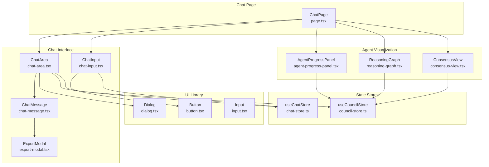
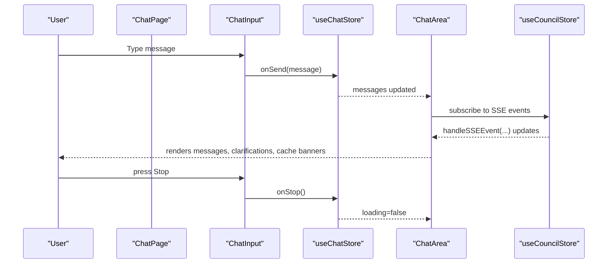
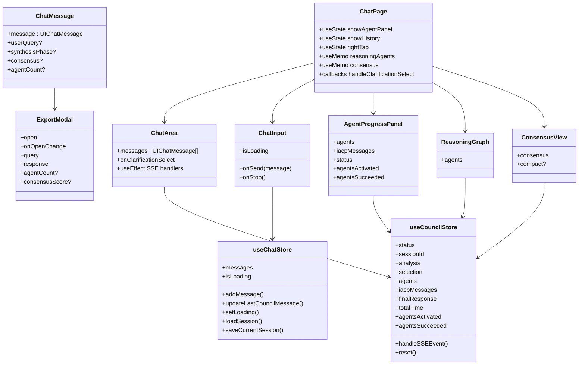
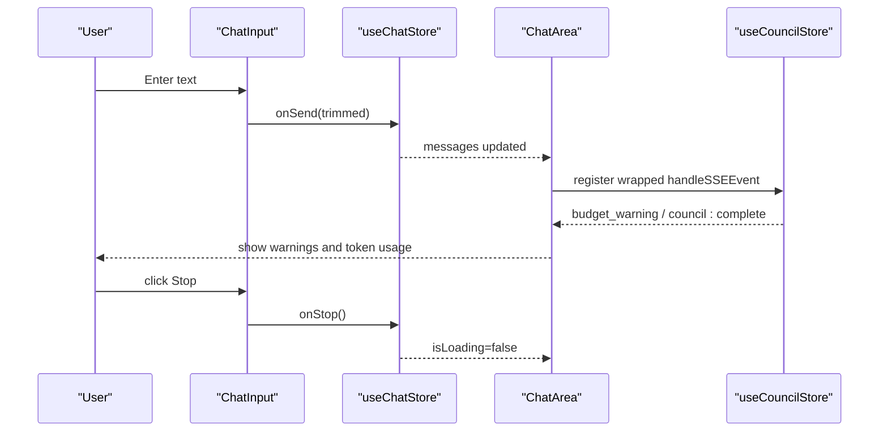
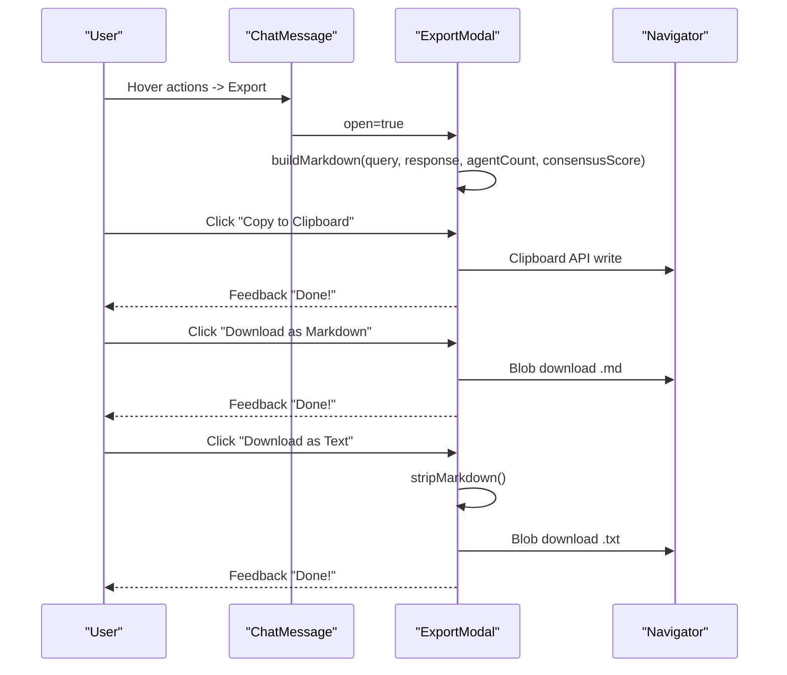
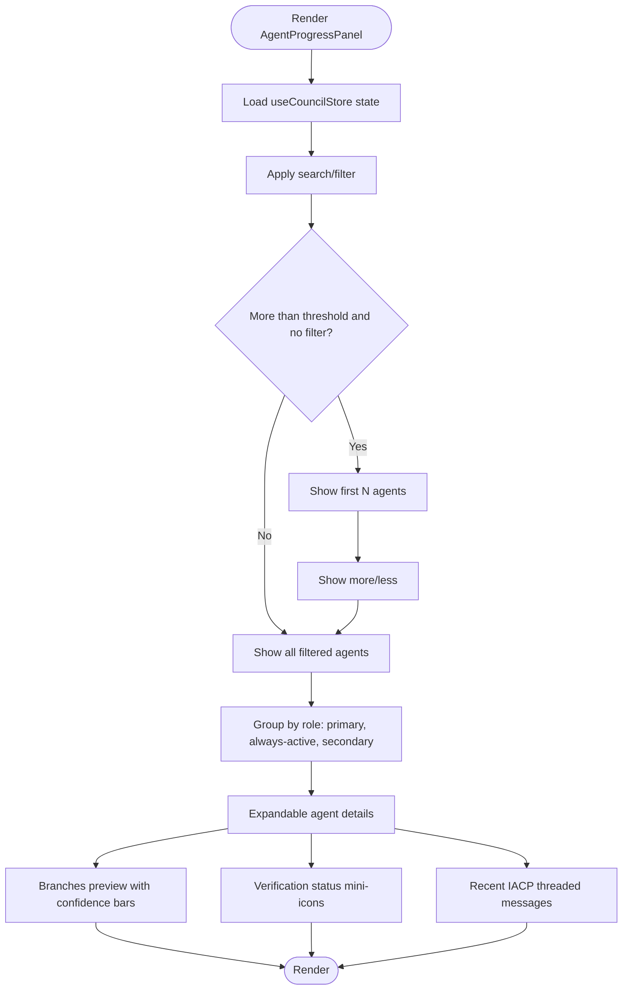
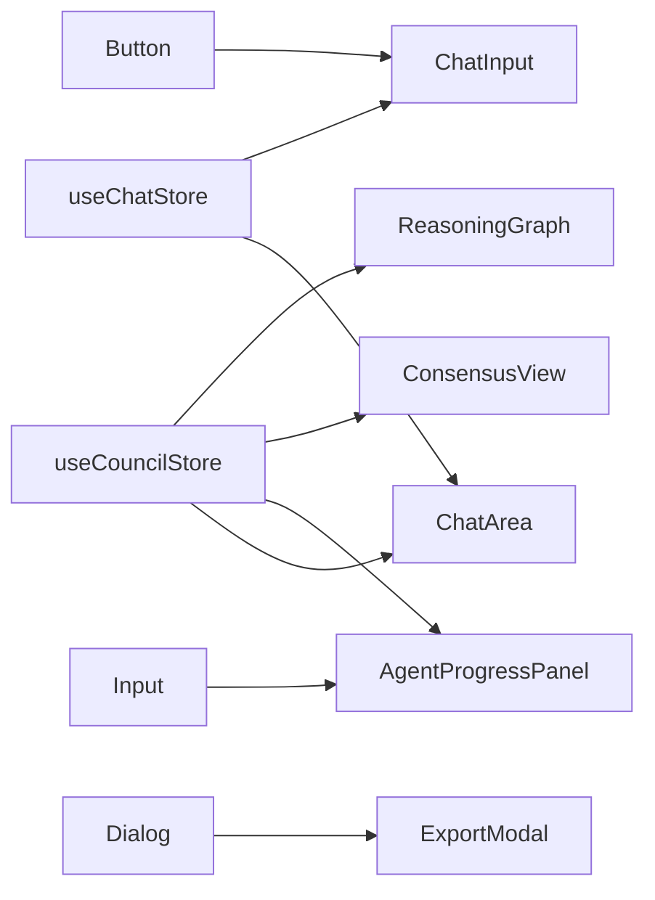

# UI Components and User Interface

<cite>
**Referenced Files in This Document**
- [chat-area.tsx](file://src/components/chat/chat-area.tsx)
- [chat-input.tsx](file://src/components/chat/chat-input.tsx)
- [chat-message.tsx](file://src/components/chat/chat-message.tsx)
- [export-modal.tsx](file://src/components/chat/export-modal.tsx)
- [agent-progress-panel.tsx](file://src/components/agents/agent-progress-panel.tsx)
- [consensus-view.tsx](file://src/components/council/consensus-view.tsx)
- [reasoning-graph.tsx](file://src/components/council/reasoning-graph.tsx)
- [button.tsx](file://src/components/ui/button.tsx)
- [dialog.tsx](file://src/components/ui/dialog.tsx)
- [input.tsx](file://src/components/ui/input.tsx)
- [page.tsx](file://src/app/chat/page.tsx)
- [chat-store.ts](file://src/stores/chat-store.ts)
- [council-store.ts](file://src/stores/council-store.ts)
- [index.ts](file://src/types/index.ts)
- [council.ts](file://src/types/council.ts)
</cite>

## Table of Contents
1. [Introduction](#introduction)
2. [Project Structure](#project-structure)
3. [Core Components](#core-components)
4. [Architecture Overview](#architecture-overview)
5. [Detailed Component Analysis](#detailed-component-analysis)
6. [Dependency Analysis](#dependency-analysis)
7. [Performance Considerations](#performance-considerations)
8. [Troubleshooting Guide](#troubleshooting-guide)
9. [Conclusion](#conclusion)
10. [Appendices](#appendices)

## Introduction
This document describes the UI components and user interface system of the Deep-Thinking-AI project. It focuses on:
- Chat interface components: chat area, input handling, message display, and export functionality
- Agent visualization components: progress panels, consensus views, and reasoning graphs
- Reusable UI component library built on Radix UI (buttons, dialogs, form controls, and layout components)
- Component composition patterns, state management integration with Zustand stores, and responsive design considerations
- Accessibility compliance, styling customization options, and component extension guidelines
- Examples of component usage, prop configurations, and integration patterns with the underlying data models

## Project Structure
The UI is organized around a central chat page that composes multiple specialized components:
- Chat page orchestrates the layout, panels, and state
- Chat area renders messages, handles clarification prompts, and shows runtime indicators
- Chat input manages user text input, auto-resize, and send/stop actions
- Chat message renders user and assistant messages, supports copy/export, and displays synthesis metadata
- Export modal provides Markdown and plain-text export options
- Agent progress panel visualizes agent activity, phases, and IACP messages
- Consensus view shows agreement/disagreement summaries and scores
- Reasoning graph displays agent branches and verification outcomes
- UI primitives (button, dialog, input) are thin wrappers around Radix UI with Tailwind-based variants

**Diagram sources**
- [page.tsx:25-367](file://src/app/chat/page.tsx#L25-L367)
- [chat-area.tsx:173-331](file://src/components/chat/chat-area.tsx#L173-L331)
- [chat-input.tsx:13-85](file://src/components/chat/chat-input.tsx#L13-L85)
- [chat-message.tsx:116-232](file://src/components/chat/chat-message.tsx#L116-L232)
- [export-modal.tsx:80-194](file://src/components/chat/export-modal.tsx#L80-L194)
- [agent-progress-panel.tsx:340-582](file://src/components/agents/agent-progress-panel.tsx#L340-L582)
- [consensus-view.tsx:244-265](file://src/components/council/consensus-view.tsx#L244-L265)
- [reasoning-graph.tsx:229-257](file://src/components/council/reasoning-graph.tsx#L229-L257)
- [button.tsx:38-52](file://src/components/ui/button.tsx#L38-L52)
- [dialog.tsx:8-91](file://src/components/ui/dialog.tsx#L8-L91)
- [input.tsx:4-21](file://src/components/ui/input.tsx#L4-L21)
- [chat-store.ts:18-131](file://src/stores/chat-store.ts#L18-L131)
- [council-store.ts:41-187](file://src/stores/council-store.ts#L41-L187)

**Section sources**
- [page.tsx:25-367](file://src/app/chat/page.tsx#L25-L367)

## Core Components
- ChatArea: Renders the chat history, handles clarification prompts, cache hits, and completion summaries. Integrates with the council store for live updates and with the chat store for messages.
- ChatInput: Manages multi-line text input with auto-resize, Enter/Send behavior, and stop generation.
- ChatMessage: Renders user/assistant messages, synthesis phase badges, disagreement banners, consensus summaries, and export actions.
- ExportModal: Provides copy-to-clipboard and download options for Markdown and plain text.
- AgentProgressPanel: Visualizes agent roles, statuses, confidence, verification, and branching; integrates with IACP messaging.
- ConsensusView: Displays consensus score and collapsible lists of consensus and disagreement points; supports compact inline mode.
- ReasoningGraph: Shows agent reasoning branches and verification outcomes with expandable nodes.
- UI Primitives: Button, Dialog, Input are thin wrappers around Radix UI with Tailwind variants and class composition.

**Section sources**
- [chat-area.tsx:173-331](file://src/components/chat/chat-area.tsx#L173-L331)
- [chat-input.tsx:13-85](file://src/components/chat/chat-input.tsx#L13-L85)
- [chat-message.tsx:116-232](file://src/components/chat/chat-message.tsx#L116-L232)
- [export-modal.tsx:80-194](file://src/components/chat/export-modal.tsx#L80-L194)
- [agent-progress-panel.tsx:340-582](file://src/components/agents/agent-progress-panel.tsx#L340-L582)
- [consensus-view.tsx:244-265](file://src/components/council/consensus-view.tsx#L244-L265)
- [reasoning-graph.tsx:229-257](file://src/components/council/reasoning-graph.tsx#L229-L257)
- [button.tsx:38-52](file://src/components/ui/button.tsx#L38-L52)
- [dialog.tsx:8-91](file://src/components/ui/dialog.tsx#L8-L91)
- [input.tsx:4-21](file://src/components/ui/input.tsx#L4-L21)

## Architecture Overview
The UI follows a unidirectional data flow:
- ChatPage composes child components and passes props
- ChatArea subscribes to the council store for live updates and to the chat store for messages
- ChatInput triggers actions in the chat hook/store
- AgentProgressPanel, ConsensusView, and ReasoningGraph consume the council store
- UI primitives encapsulate Radix UI with Tailwind variants

**Diagram sources**
- [page.tsx:25-367](file://src/app/chat/page.tsx#L25-L367)
- [chat-input.tsx:13-85](file://src/components/chat/chat-input.tsx#L13-L85)
- [chat-store.ts:18-131](file://src/stores/chat-store.ts#L18-L131)
- [chat-area.tsx:173-331](file://src/components/chat/chat-area.tsx#L173-L331)
- [council-store.ts:41-187](file://src/stores/council-store.ts#L41-L187)

## Detailed Component Analysis

### Chat Interface Components

#### ChatArea
Responsibilities:
- Render initial welcome state with sample queries
- Render message list with preceding user query context
- Handle clarification_needed and cache_hit SSE events
- Display budget warnings and token usage summaries
- Auto-scroll to bottom on updates

Key behaviors:
- Uses a wrapped handler to intercept SSE events and update local state
- Uses a ref to scroll to the latest element
- Conditionally renders clarification dialog and cache banner

Accessibility and UX:
- Uses motion and AnimatePresence for smooth transitions
- Provides sample queries that programmatically populate the input

**Section sources**
- [chat-area.tsx:173-331](file://src/components/chat/chat-area.tsx#L173-L331)

#### ChatInput
Responsibilities:
- Manage textarea value with controlled state
- Auto-resize textarea based on content height
- Handle Enter and Ctrl/Cmd+Enter to send
- Disable while loading; show stop button when loading

Keyboard and accessibility:
- Proper aria-label for the textarea
- Clear keyboard hints for users

**Section sources**
- [chat-input.tsx:13-85](file://src/components/chat/chat-input.tsx#L13-L85)

#### ChatMessage
Responsibilities:
- Render user vs assistant messages with distinct styles
- Show synthesis phase badges and disagreement banners
- Provide hover actions: copy and export
- Embed consensus view and export modal for assistant messages
- Render loading dots for in-progress assistant messages

Export integration:
- Opens ExportModal with query, response, agent count, and consensus score

**Section sources**
- [chat-message.tsx:116-232](file://src/components/chat/chat-message.tsx#L116-L232)

#### ExportModal
Responsibilities:
- Build Markdown from query, response, and optional council details
- Provide copy-to-clipboard and download actions for Markdown and plain text
- Show feedback icons after actions

Implementation highlights:
- Strips Markdown for plain text conversion
- Uses Blob/download for file exports

**Section sources**
- [export-modal.tsx:80-194](file://src/components/chat/export-modal.tsx#L80-L194)

### Agent Visualization Components

#### AgentProgressPanel
Responsibilities:
- Visualize agent roles (primary, secondary, always-active)
- Show agent statuses, confidence, verification, and memory indicators
- Display IACP threaded messages
- Provide search/filter and expandable details
- Show active/succeeded counts and phase progress

Data model integration:
- Consumes useCouncilStore for agents, iacpMessages, and status
- Uses extended agent info for selection confidence, performance, verification, branches

**Section sources**
- [agent-progress-panel.tsx:340-582](file://src/components/agents/agent-progress-panel.tsx#L340-L582)

#### ConsensusView
Responsibilities:
- Display consensus score with colored progress bar
- Collapsible sections for consensus and disagreement points
- Compact inline mode for embedding in chat messages
- Full panel mode with scrollable cards

**Section sources**
- [consensus-view.tsx:244-265](file://src/components/council/consensus-view.tsx#L244-L265)

#### ReasoningGraph
Responsibilities:
- Render agent reasoning trees with branches and confidence bars
- Show verification results per agent with status icons and issue lists
- Expandable nodes with branch details and selected branch highlighting

**Section sources**
- [reasoning-graph.tsx:229-257](file://src/components/council/reasoning-graph.tsx#L229-L257)

### Reusable UI Component Library (Radix UI)

#### Button
- Variants: default, destructive, outline, secondary, ghost, link
- Sizes: default, sm, lg, icon
- Supports asChild for semantic composition

**Section sources**
- [button.tsx:38-52](file://src/components/ui/button.tsx#L38-L52)

#### Dialog
- Root, Portal, Overlay, Content, Header, Title, Description, Trigger, Close
- Focus-visible and keyboard support via Radix UI

**Section sources**
- [dialog.tsx:8-91](file://src/components/ui/dialog.tsx#L8-L91)

#### Input
- Thin wrapper around HTML input with shared Tailwind classes

**Section sources**
- [input.tsx:4-21](file://src/components/ui/input.tsx#L4-L21)

## Architecture Overview

**Diagram sources**
- [page.tsx:25-367](file://src/app/chat/page.tsx#L25-L367)
- [chat-area.tsx:173-331](file://src/components/chat/chat-area.tsx#L173-L331)
- [chat-input.tsx:13-85](file://src/components/chat/chat-input.tsx#L13-L85)
- [chat-message.tsx:116-232](file://src/components/chat/chat-message.tsx#L116-L232)
- [export-modal.tsx:80-194](file://src/components/chat/export-modal.tsx#L80-L194)
- [agent-progress-panel.tsx:340-582](file://src/components/agents/agent-progress-panel.tsx#L340-L582)
- [consensus-view.tsx:244-265](file://src/components/council/consensus-view.tsx#L244-L265)
- [reasoning-graph.tsx:229-257](file://src/components/council/reasoning-graph.tsx#L229-L257)
- [chat-store.ts:18-131](file://src/stores/chat-store.ts#L18-L131)
- [council-store.ts:41-187](file://src/stores/council-store.ts#L41-L187)

## Detailed Component Analysis

### Chat Flow and State Integration

**Diagram sources**
- [chat-input.tsx:13-85](file://src/components/chat/chat-input.tsx#L13-L85)
- [chat-store.ts:18-131](file://src/stores/chat-store.ts#L18-L131)
- [chat-area.tsx:173-331](file://src/components/chat/chat-area.tsx#L173-L331)
- [council-store.ts:41-187](file://src/stores/council-store.ts#L41-L187)

### Export Workflow

**Diagram sources**
- [chat-message.tsx:116-232](file://src/components/chat/chat-message.tsx#L116-L232)
- [export-modal.tsx:80-194](file://src/components/chat/export-modal.tsx#L80-L194)

### Agent Progress Visualization

**Diagram sources**
- [agent-progress-panel.tsx:340-582](file://src/components/agents/agent-progress-panel.tsx#L340-L582)

## Dependency Analysis

**Diagram sources**
- [chat-store.ts:18-131](file://src/stores/chat-store.ts#L18-L131)
- [council-store.ts:41-187](file://src/stores/council-store.ts#L41-L187)
- [chat-area.tsx:173-331](file://src/components/chat/chat-area.tsx#L173-L331)
- [agent-progress-panel.tsx:340-582](file://src/components/agents/agent-progress-panel.tsx#L340-L582)
- [consensus-view.tsx:244-265](file://src/components/council/consensus-view.tsx#L244-L265)
- [reasoning-graph.tsx:229-257](file://src/components/council/reasoning-graph.tsx#L229-L257)
- [export-modal.tsx:80-194](file://src/components/chat/export-modal.tsx#L80-L194)
- [dialog.tsx:8-91](file://src/components/ui/dialog.tsx#L8-L91)
- [button.tsx:38-52](file://src/components/ui/button.tsx#L38-L52)
- [input.tsx:4-21](file://src/components/ui/input.tsx#L4-L21)

**Section sources**
- [chat-store.ts:18-131](file://src/stores/chat-store.ts#L18-L131)
- [council-store.ts:41-187](file://src/stores/council-store.ts#L41-L187)

## Performance Considerations
- ChatArea uses memoized helpers and minimal re-renders; keep message arrays immutable to avoid unnecessary updates.
- ChatInput auto-resizes textarea efficiently; limit excessive reflows by capping max-height.
- AgentProgressPanel applies filtering and collapsing to reduce DOM size; consider virtualization for very large agent sets.
- ConsensusView and ReasoningGraph use collapsible sections to minimize rendering cost.
- ExportModal builds Markdown lazily; avoid repeated computations by caching derived strings when props are unchanged.

## Troubleshooting Guide
Common issues and resolutions:
- Clarification dialog does not appear: Ensure SSE event registration occurs on mount and is restored after unmount.
- Export fails silently: The export modal falls back to a textarea-based copy when Clipboard API is unavailable; check browser permissions.
- Agent panel shows empty state: Confirm that the council store is initialized and agents are populated via SSE events.
- Token usage not shown: Verify that the council store emits the complete event with tokenUsage payload.
- Responsive panel toggles: On mobile, overlays are used; ensure click-outside handlers close panels.

**Section sources**
- [chat-area.tsx:173-331](file://src/components/chat/chat-area.tsx#L173-L331)
- [export-modal.tsx:80-194](file://src/components/chat/export-modal.tsx#L80-L194)
- [agent-progress-panel.tsx:340-582](file://src/components/agents/agent-progress-panel.tsx#L340-L582)
- [consensus-view.tsx:244-265](file://src/components/council/consensus-view.tsx#L244-L265)
- [reasoning-graph.tsx:229-257](file://src/components/council/reasoning-graph.tsx#L229-L257)

## Conclusion
The UI system combines a reactive chat interface with rich agent visualization and a small, cohesive Radix-based component library. Zustand stores drive real-time updates and persist sessions. The design emphasizes clarity, accessibility, and responsiveness across devices.

## Appendices

### Accessibility Compliance
- Buttons and inputs expose proper aria-labels and focus rings
- Dialog overlay and close button include screen-reader-friendly labels
- Keyboard shortcuts and hints are provided for efficient navigation
- High contrast mode is supported via a persisted preference

**Section sources**
- [chat-input.tsx:13-85](file://src/components/chat/chat-input.tsx#L13-L85)
- [dialog.tsx:8-91](file://src/components/ui/dialog.tsx#L8-L91)
- [page.tsx:25-367](file://src/app/chat/page.tsx#L25-L367)

### Styling Customization Options
- Button variants and sizes are configurable via props
- Dialog content sizing uses responsive max-width classes
- Input inherits shared focus and disabled states
- Tailwind utilities are applied consistently across components

**Section sources**
- [button.tsx:38-52](file://src/components/ui/button.tsx#L38-L52)
- [dialog.tsx:8-91](file://src/components/ui/dialog.tsx#L8-L91)
- [input.tsx:4-21](file://src/components/ui/input.tsx#L4-L21)

### Component Extension Guidelines
- Wrap Radix UI primitives with consistent class composition and variants
- Use controlled props for stateful components (e.g., Dialog open/onOpenChange)
- Keep side effects localized; subscribe to stores in leaf components
- Pass derived data from higher-order components (e.g., ChatPage computes reasoningAgents)

**Section sources**
- [dialog.tsx:8-91](file://src/components/ui/dialog.tsx#L8-L91)
- [page.tsx:104-134](file://src/app/chat/page.tsx#L104-L134)

### Example Usage Patterns
- ChatPage composes ChatArea, ChatInput, AgentProgressPanel, ConsensusView, and ReasoningGraph
- ChatMessage embeds ExportModal and ConsensusView for assistant messages
- AgentProgressPanel consumes useCouncilStore and exposes search/filter controls
- ExportModal accepts query/response and optional council metadata

**Section sources**
- [page.tsx:25-367](file://src/app/chat/page.tsx#L25-L367)
- [chat-message.tsx:116-232](file://src/components/chat/chat-message.tsx#L116-L232)
- [agent-progress-panel.tsx:340-582](file://src/components/agents/agent-progress-panel.tsx#L340-L582)
- [export-modal.tsx:80-194](file://src/components/chat/export-modal.tsx#L80-L194)

### Data Model Integration
- UIChatMessage drives ChatArea and ChatMessage
- ConsensusResult drives ConsensusView
- AgentReasoningData drives ReasoningGraph
- Zustand stores provide typed state and event handlers

**Section sources**
- [index.ts:1-7](file://src/types/index.ts#L1-L7)
- [council.ts:105-113](file://src/types/council.ts#L105-L113)
- [chat-store.ts:18-131](file://src/stores/chat-store.ts#L18-L131)
- [council-store.ts:41-187](file://src/stores/council-store.ts#L41-L187)